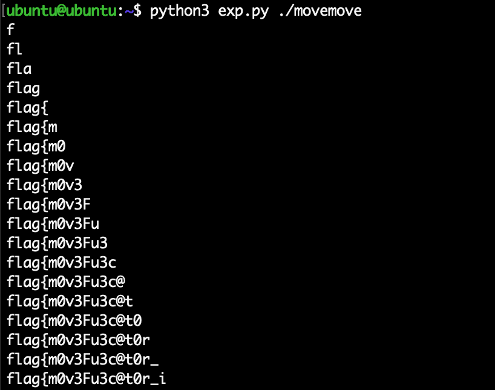

## CTF-Reverse-mov单指令混淆

Time: 2022.12.21  
Tags: CTF  


### 0x00 前言

最近在 CTF 比赛中遇到一道逆向题目，该题目通过 mov 单指令混淆(https://github.com/xoreaxeaxeax/movfuscator)，可以硬着头皮进行分析，而更好的方式是通过 perf 进行侧信道攻击，通过比较执行的指令数量来爆破 flag。

本文为该题的 writeup；本文测试环境如下：
```
Proxmox VE 7.2
Ubuntu 16.04 x86
```

### 0x01 题目
拿到题目 [movemove](./movemove.zip)，查看二进制基本信息以及运行状态如下：
<div align="center">

</br>[1.movemove基本信息]
</div>

### 0x02 分析
拖入 IDA 分析如下，可以看到整个二进制几乎全部由 `mov` 指令实现的：
<div align="center">

</br>[2.IDA分析movemove]
</div>

直接逆向手动分析混淆是下下策；

google 一下很容易找到 `mov` 单指令混淆的相关论文(https://drwho.virtadpt.net/files/mov.pdf)和开源实现(https://github.com/xoreaxeaxeax/movfuscator)。(当然也能找到一些历史题目)

有一种猜想，如果题目中以逐字节的方式对输入进行比较，那么当我们输入错误的字符时，程序就会提前退出，而当输入正确的字符时，程序将执行的更远，也就是执行更多的指令；基于这种猜想我们可以使用 `perf` 工具对程序执行的指令进行统计，从而爆破找出 flag。

`perf` 的正常工作依赖于 CPU 硬件的性能监控单元(Performance Monitoring Unit)和性能计数器(Performance Monitor Counter)，通常虚拟机都不会开启该功能，测试如下：
<div align="center">

</br>[3.perf不能正常工作]
</div>

Vmware 可以通过 CPU 设置中勾选 `PMU` 来进行支持，PVE 下可以通过选择 `host` CPU 类型来使用 CPU 直通来支持：
<div align="center">

</br>[4.pve开启CPU直通]
</div>

开启后测试 `perf` 如下：
<div align="center">

</br>[5.perf正常工作]
</div>

回到题目上，我们想通过 `perf` 统计题目在比较输入和 flag 的指令数，可以使用如下命令：
```
$ perf stat -x , -e instructions:u ./movemove

stat: 表示进行统计
-x: 表示使用 csv 格式输入，并使用 , 作为分隔符
-e: 表示筛选事件类型，选择「指令」类型，并只统计用户态指令(如果包含内核指令的话，会有较大的误差)
```

我们尝试输入不同字符测试如下：
<div align="center">

</br>[6.perf统计movemove指令]
</div>

其中输出结果格式如下：
```
统计的指令数, 统计单位/空, 事件名称, 计数器运行时间, 计数器运行的测量时间百分比
201875,,instructions:u,41110917,100.00
```

这里我们仅需要关注第一个值，可以看到输入 `f` 字符的执行指令数量明显大于 `a` 字符。

### 0x03 解题
按照这个思路，我们编写 `exp.py` 脚本如下：
```
from subprocess import *
import string
import sys

command = "perf stat -x : -e instructions:u " + sys.argv[1] + " 1>/dev/null"
flag = ''
while True:
    ins_count = 0
    count_chr = ''
    for i in (string.ascii_letters + string.digits + string.punctuation):
        target = Popen(command, stdout=PIPE, stdin=PIPE, stderr=STDOUT, shell=True)
        target_output, _ = target.communicate(input=('%s\n'%(flag + i)).encode())
        #print(i, target_output)
        instructions = int(target_output.decode().split(':')[0])
        #print(instructions)
        if instructions > ins_count:
            count_chr = i
            ins_count = instructions
    flag += count_chr
    print(flag)
```

执行如下：
<div align="center">

</br>[7.运行脚本爆破flag]
</div>

<!--
flag: flag{m0v3Fu3c@t0r_i3_7uring_C0mp1ete}
-->

### 0x04 其他
这种通过 `perf` 统计执行指令数量的侧信道攻击方式，也适用于其他逐字节比较的情况；但如果该题目中，在逐字节比较前使用 `strlen` 检查 flag 的长度，若不满足则直接退出，那么这种方法就失效了。

当然直接逆向分析也能解出该题，逆向分析时可以使用 https://github.com/kirschju/demovfuscator 工具解混淆，将 `mov` 指令合并解析，便于我们进行逆向分析。


### 0x05 References
https://drwho.virtadpt.net/files/mov.pdf  
https://github.com/xoreaxeaxeax/movfuscator  
https://guyinatuxedo.github.io/22-movfuscation/swamp19_future/index.html  
https://stackoverflow.com/questions/63065486/make-sense-of-numbers-in-perf-stat-output  
https://man7.org/linux/man-pages/man1/perf-stat.1.html#CSV_FORMAT  