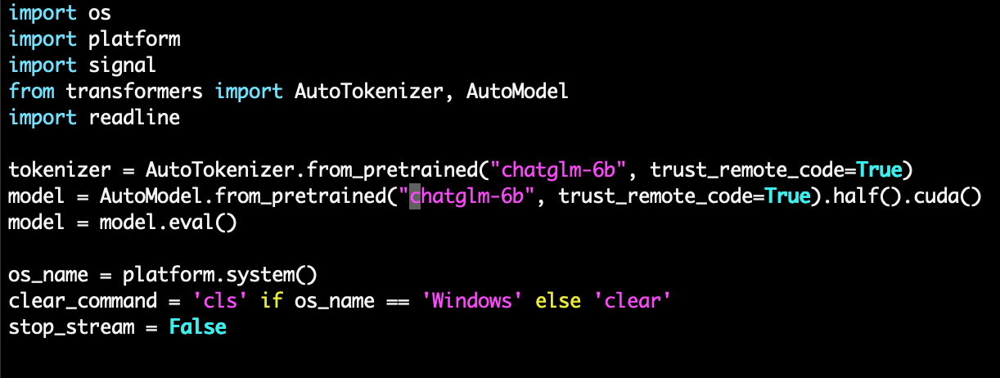

## ChatGLM的部署和使用

Time: 2023.07.06  
Tags: LLM  


### 0x00 前言

随着 LLaMA 模型的开源，清华大学也推出了专精中文领域的 ChatGLM-6B；ChatGLM-6B 使用了和 ChatGPT 相似的技术，经过约 1T 标识符的中英双语训练，结合监督微调、反馈自助、人类反馈强化学习等技术，最终 62 亿参数的 ChatGLM-6B 已经能生成相当符合人类偏好的回答。

紧随着 ChatGLM-6B 的开源，清华大学又推出了其第二代版本 ChatGLM2-6B，在原有的模型基础之上拥有了更强大的性能、更长的上下文以及更高效的推理。

ChatGLM-6B 模型默认大小(FP16)只需要 13GB 的显存即可运行，经过 INT4 量化最小可达 6GB，完全可以在消费级显卡上搭建自己的 ChatGPT。

本文记录了 ChatGLM-6B 的部署过程以及使用说明。

本文实验环境：
```
Ubuntu 20.04 x64
NVIDIA Tesla T4 显卡 (16GB)
ChatGLM-6B (commit:9d56e5797dbe24eb1be43c83819f0e6acc27920d)
ChatGLM2-6B (commit:04d5ee435d5b174b930d26a9914a0801a7d4308c)
```

### 0x01 部署ChatGLM
在使用显卡部署之前，我首先尝试使用 CPU 部署 ChatGLM-6B，实验环境为 `Ubuntu22.04 x64 16C32G`，实际运行时大致需要 30GB 内存，运行速度大致 5-10 秒才能生成 1 个 token，离生产需求太远了，更不用说微调和训练了。

我们本地没有合适的显卡，所以从 AutoDL(https://www.autodl.com/home) 按量付费租赁 GPU 算力：
<div align="center">

</br>[1.AutoDL租赁GPU算力]
</div>

我们选择了 Tesla T4 显卡，其具有 16GB 的显存，完全满足 ChatGLM-6B 的运行需求，同时 AutoDL 的主机提供 25GB 的系统盘(`/`)和 50GB 的数据盘(`/root/autodl-tmp`)，云服务器准备完毕后使用 ssh 登陆主机即可使用。

首先安装 `git-lfs` 并从 https://huggingface.co/ 下载 `chatglm-6b` 模型，大约 25GB：
```
cd /root/autodl-tmp

curl -s https://packagecloud.io/install/repositories/github/git-lfs/script.deb.sh | sudo bash
sudo apt-get install git-lfs

git clone https://huggingface.co/THUDM/chatglm-6b
```

随后从 github 下载 ChatGLM-6B 的源码，并通过 pip 安装相关依赖：
```
cd /root
git clone https://github.com/THUDM/ChatGLM-6B

cd ChatGLM-6B/
pip install -r requirements.txt
```

AutoDL 提供的云服务器已经配置好了 Nvidia 驱动以及 CUDA，使用 `nvidia-smi` 查看显卡信息：
<div align="center">

</br>[2.查看nvidia显卡信息]
</div>

使用 `nvcc -V` 查看 CUDA 版本信息：
<div align="center">

</br>[3.查看cuda版本信息]
</div>

### 0x02 运行ChatGLM
我们将模型文件 `chatglm-6b` 软链接到 ChatGLM-6B 源码目录下：
```
cd /root/ChatGLM-6B
ln -s /root/autodl-tmp/chatglm-6b/ chatglm-6b
```

然后将 `cli_demo.py` 中的模型文件加载目录修改为 `chatglm-6b`：
<div align="center">

</br>[4.修改模型加载目录]
</div>

使用 `python3 cli_demo.py` 启动 ChatGLM-6B：
<div align="center">

</br>[5.启动ChatGLM-6B]
</div>

此时我们可以通过 `nvidia-smi` 查看显卡负载情况，目前占用 12GB 的显存，随着后续使用还会上浮 1GB 左右，如下：
<div align="center">

</br>[6.ChatGLM-6B显卡负载]
</div>

使用以下 prompt 测试，可以发现 ChatGLM-6B 具有良好的表现(当然如官方文档所说，目前还很容易被误导)
```
你好
介绍下中国的首都
还有哪些旅游景点
解释下金子为什么浮在水面上
```

测试如下：
<div align="center">

</br>[7.ChatGLM-6B运行测试]
</div>

### 0x03 运行ChatGLM2
ChatGLM2 的部署基本一致，其模型文件 `chatglm2-6b` 大约 24GB，按照如上同样的方式进行部署运行如下：
<div align="center">

</br>[8.ChatGLM2-6B运行测试]
</div>

下文我们将 ChatGLM2-6B 作为基本模型(虽然以上几个简单的问题没有展示出 ChatGLM2-6B 的进步)。

### 0x04 P-Tuning
按照官方提供的教程(https://github.com/THUDM/ChatGLM2-6B/tree/main/ptuning)，我们尝试对 ChatGLM2-6B 模型进行 P-Tuning 的微调；这里我们对 INT4 量化后的模型进行微调和测试。(FP16 的模型实际训练时需要 22 GB 的显存)

首先安装微调所需要的依赖，以及下载训练数据：
```
cd ChatGLM2-6B/ptuning
pip install rouge_chinese nltk jieba datasets

wget "https://cloud.tsinghua.edu.cn/f/b3f119a008264b1cabd1/?dl=1" -O AdvertiseGen.tar.gz
```

解压 `AdvertiseGen.tar.gz`，其中包含两个 json 文件，`train.json` 是用于训练的数据集，`dev.json` 是用于验证的数据集，其内容格式一致。
```
tar -zxvf AdvertiseGen.tar.gz

wc -l AdvertiseGen/*
    1070 AdvertiseGen/dev.json
  114599 AdvertiseGen/train.json
  115669 total
```

ADGEN 数据集任务为根据输入(content)生成一段广告词(summary)，其数据格式如下：
```
{
    "content": "类型#上衣*版型#宽松*版型#显瘦*图案#线条*衣样式#衬衫*衣袖型#泡泡袖*衣款式#抽绳",
    "summary": "这件衬衫的款式非常的宽松，利落的线条可以很好的隐藏身材上的小缺点，穿在身上有着很好的显瘦效果。领口装饰了一个可爱的抽绳，漂亮的绳结展现出了十足的个性，配合时尚的泡泡袖型，尽显女性甜美可爱的气息。"
}
```

接下来我们使用 `train.sh` 启动训练，官方已经将参数都准备好了，`train_file` 为训练数据的路径，`validation_file` 为验证数据的路径，`max_steps` 设置训练 3000 步，`quantization_bit 4` 设置为 INT4 量化的训练，我们只需要修改 `model_name_or_path` 指向我们本地的 chatglm2-6b 路径即可：
<div align="center">

</br>[9.train.sh启动参数]
</div>

使用 `bash train.sh` 启动训练，但是在运行至 `10/3000` 左右会出现报错(https://github.com/THUDM/ChatGLM2-6B/issues/175)：
```
......
  File "/root/miniconda3/lib/python3.8/site-packages/transformers/trainer_pt_utils.py", line 841, in _get_learning_rate
    if self.is_deepspeed_enabled:
AttributeError: 'Seq2SeqTrainer' object has no attribute 'is_deepspeed_enabled'
```

可通过修改 transformers 版本至 4.27.1，或修改 `trainer_pt_utils.py` 文件报错处为 `if False:` 来解决；随后重新启动完成训练：
<div align="center">

</br>[10.ADGEN数据训练完成]
</div>

在本文实验环境下，ADGEN 114599 条数据训练大致花费了 10 个小时，训练过程显存占用大约 8GB；训练后的 CHECKPOINT 文件保存在 `./[src]/output/` 目录下，其文件大致 60MB。

训练完成后，我们可以使用 `evaluate.sh` 进行训练结果评估，同样我们只需修改其中的模型文件路径，该文件将对 chatglm2-6B INT4 量化的模型，以训练 ADGEN 3000 步的 CHECKPOINT 进行评估：
<div align="center">

</br>[11.evaluate.sh启动参数]
</div>

使用 `bash evaluate.sh` 进行训练结果的评估，`dev.json` 有 1070 条数据，大致需要花费 2 小时：
<div align="center">

</br>[12.评估ADGEN训练结果]
</div>

评估完成后，其结果保存在 `[src]/output/adgen-chatglm2-6b-pt-128-2e-2/generated_predictions.txt` 中，其中 `labels` 是我们预期的结果(即 `dev.json` 中的 `summary`)，而 `predict` 是 ChatGLM2-6B 生成的结果，比较这两个值来判断训练的质量：
<div align="center">

</br>[13.ADGEN评估结果]
</div>

我们来实际测试一下训练的模型，官方这里仅提供了 `web_demo.py`，我们可以参考 README(https://github.com/THUDM/ChatGLM2-6B/blob/main/ptuning/README.md) 编写 `ChatGM2-6B/ptuning/test.py` 测试脚本，其中不加载 CHECKPOINT 则是对原始模型进行测试，反之则是对我们训练的模型进行测试(同时还需设置训练时的 `pre_seq_len` 值)：
```
from transformers import AutoConfig, AutoModel, AutoTokenizer
import torch
import os

# load tokenizer
tokenizer = AutoTokenizer.from_pretrained("../chatglm2-6b", trust_remote_code=True)
config = AutoConfig.from_pretrained("../chatglm2-6b", trust_remote_code=True)
#config = AutoConfig.from_pretrained("../chatglm2-6b", trust_remote_code=True, pre_seq_len=128)
model = AutoModel.from_pretrained("../chatglm2-6b", config=config, trust_remote_code=True)
model = model.quantize(4).cuda()
# load checkpoint
"""
CHECKPOINT_PATH = "./output/adgen-chatglm2-6b-pt-128-2e-2/checkpoint-3000/"
prefix_state_dict = torch.load(os.path.join(CHECKPOINT_PATH, "pytorch_model.bin"))
new_prefix_state_dict = {}
for k, v in prefix_state_dict.items():
    if k.startswith("transformer.prefix_encoder."):
        new_prefix_state_dict[k[len("transformer.prefix_encoder."):]] = v
model.transformer.prefix_encoder.load_state_dict(new_prefix_state_dict)
"""

model = model.eval()

if __name__ == "__main__":
    while True:
        query = input("Q: ")

        print("A: ", end="")
        current_length = 0
        for response, _ in model.stream_chat(tokenizer, query):
            print(response[current_length:], end="", flush=True)
            current_length = len(response)
        print("")
```

使用以下三个 prompt 作为测试：
```
Q1: 你好
Q2: 类型#上衣*材质#牛仔布*颜色#白色*风格#简约*图案#刺绣*衣样式#外套*衣款式#破洞
Q3: 类型#裙*版型#显瘦*风格#文艺*风格#简约*图案#印花*图案#撞色*裙下摆#压褶*裙长#连衣裙*裙领型#圆领
```

原始模型测试如下：
<div align="center">

</br>[14.原始模型测试ADGen]
</div>

ADGEN 训练后的模型如下：
<div align="center">

</br>[15.p-tuning训练后测试ADGen]
</div>

可以看到符合 ADGen prompt 的回答，训练过的模型明显优于原始模型，但是由于神经网络的灾难性遗忘问题，这里却连最简单的「你好」都无法正确回答了。

### 0x05 CVE数据训练
基于官方提供的 P-Tuning 示例，我们尝试对安全行业的数据进行实验性训练测试，我们向模型添加 CVE 编号漏洞的信息，以实现向模型输入 CVE 编号后，模型能回答我们对应漏洞的基本信息。

我们准备 5 条训练数据 `CVEGen/train.json` 如下：
```
{"content": "CVE-2023-34843", "summary": "CVE-2023-34843 是 Traggo 软件的一个目录穿越漏洞该漏洞，由于 Traggo 对路径处理存在问题，导致攻击者可以读取任意文件。"}
{"content": "CVE-2023-35843", "summary": "CVE-2023-35843 是 Lightdash 的一个文件读取漏洞，由于 Lightdash 未过滤目录跳转符，导致攻击者可以读取任意文件。"}
{"content": "CVE-2023-3224", "summary": "CVE-2023-3224 是 Nuxt.js 开发模式下的一个未授权 RCE 漏洞，Nuxt 框架在开发模式下，存在 test-component-wrapper 组件，该组件可以用来动态导入 NodeJs 模块，攻击者可利用该功能在服务端执行 NodeJs 代码。"}
{"content": "CVE-2023-20887", "summary": "CVE-2023-20887 是 VMWarevRealizeNetworkInsight 的一个未授权 RCE 漏洞，该漏洞是由于开发者对用户输入过滤不严，攻击者可以构造恶意请求导致 RCE。"}
{"content": "CVE-2023-23333", "summary": "CVE-2023-23333 是 SolarViewCompact 的一个未授权命令注入漏洞，由于 SolarViewCompact 未对用戶输入做过滤，导致攻击者可以注入系统命令。"}
```

准备 4 条评估数据 `CVEGen/dev.json` 如下：
```
{"content": "CVE-2023-34843", "summary": "CVE-2023-34843 是 Traggo 软件的一个目录穿越漏洞该漏洞。"}
{"content": "CVE-2023-34843是", "summary": "CVE-2023-34843 是 Traggo 软件的一个目录穿越漏洞该漏洞，由于 Traggo 对路径处理存在问题，导致攻击者可以读取任意文件。"}
{"content": "介绍下CVE-2023-23333", "summary": "CVE-2023-23333 是 SolarViewCompact 的一个未授权命令注入漏洞，由于 SolarViewCompact 未对用戶输入做过滤，导致攻击者可以注入系统命令。"}
{"content": "CVE-1999-1999", "summary": "对不起，我没有相关漏洞的信息"}
```

随后同样使用 `bash train.sh` 进行训练(2小时)，使用 `bash evaluate.sh` 进行评估：
<div align="center">

</br>[16.评估CVE数据训练]
</div>

虽然只有几条训练数据，不过可以看到模型能够返回漏洞信息了，虽然正确率相当的低。

最后我们也使用问答模式来对比下原模型和训练后的模型：
<div align="center">

</br>[17.CVE数据训练后测试对比]
</div>

>在实际场景下，我们可以增加训练数据集以及优化参数，以达到更好的训练效果，但目前训练所产生的神经网络的灾难性遗忘问题还没有有效的解决方案，还需要进一步的研究以及期待技术的进步。

### 0x06 References
https://chatglm.cn/blog  
https://github.com/THUDM/ChatGLM-6B  
https://huggingface.co/THUDM/chatglm-6b  
https://github.com/THUDM/ChatGLM2-6B  
https://huggingface.co/THUDM/chatglm2-6b  
https://www.autodl.com/home  
https://www.tjsky.net/tutorial/664  
https://www.bilibili.com/video/BV1fd4y1Z7Y5/  
https://sspai.com/post/79230  
https://github.com/wdkwdkwdk/CLONE_DK  
https://github.com/ssbuild/chatglm_finetuning  
https://github.com/yuanzhoulvpi2017/zero_nlp  
https://aizpy.com/2023/03/30/chatglm-6b-lora/  
https://github.com/hiyouga/ChatGLM-Efficient-Tuning  