## CodeQL入门和基本使用

Tags: 代码审计
Time: 2024.10.08


### 0x00 前言

CodeQL 是 GitHub 推出的一种静态代码分析工具，用于查找和修复代码中的漏洞和安全问题。该工具最早由 Semmle 团队开发并命名为 Semmle QL，应用于自家的源代码分析平台 LGTM(Looks Good To Me) 上；2020年，Github 收购了 Semmle 团队并成立了 Security Lab，整合 Semmle 团队的技术能力后推出了 CodeQL 工具，随后 CodeQL 成为了 Github 安全生态中的一个重要组成部分。

目前 CodeQL 已经成为静态代码分析的代表性工具，其关键的核心思想是将源代码按照语义进行解析并存储于数据库中，随即用户可以像对待数据一样查询代码，从而通过编写查询语句从代码中发现安全问题；因此 CodeQL(Code Query Language)整体看起来有点像 SQL(Structured Query Language)。

本文将介绍 CodeQL 的基本概念，结合官方教程学习基础的使用方法，并以 Python 为例演示 CodeQL 在具体编程语言方面的应用。

本文实验环境：
```
Ubuntu 22.04
CodeQL 2.18.3
VSCode 1.93.0
```

### 0x01 CodeQL环境配置
CodeQL 工具包含两大部分组成：
1. 核心引擎(闭源)：用于解析源代码并存储于数据库，以及执行QL语句从数据库中进行查询；
2. SDK代码库(开源)：包含各编程语言对应的 QL 代码库(属性/谓词/等)，以便快速编写查询语句；

按照官方文档(https://docs.github.com/en/code-security/codeql-cli)我们可以直接从 https://github.com/github/codeql-action/releases 下载对应的软件包，其中包括了核心引擎以及兼容版本的 SDK 代码库，执行如下：
```
# download from https://github.com/github/codeql-action/releases
$ tar -zxvf codeql-bundle.tar.gz
```

解压后即安装完毕，在 Linux 下的命令行二进制程序为 `codeql`，如下：
<div align="center">
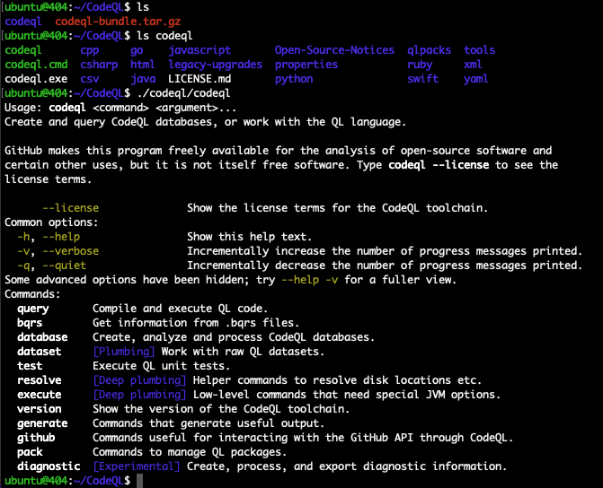
</br>[1.安装codeql并显示帮助]
</div>

使用 CodeQL `resolve languages` 子命令可以查看支持的编程语言，目前支持：csv, yaml, csharp, javascript, cpp, go, html, python, java, ruby, swift, properties, xml；如下：
<div align="center">
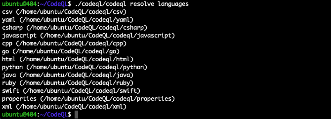
</br>[2.codeql对编程语言的支持]
</div>

我们来为 CodeQL 编写 `Hello World` 查询，首先需要使用 `codeql` 创建一个数据库，这样我们才能为其编写查询语句，使用如下命令创建数据库：
```
# 此处我们无需关注目标应用的源代码和编程语言
$ ./codeql/codeql database create test_db --language=python
```

创建完毕后，会在当前目录生成 `test_db` 目录，执行如下：
<div align="center">
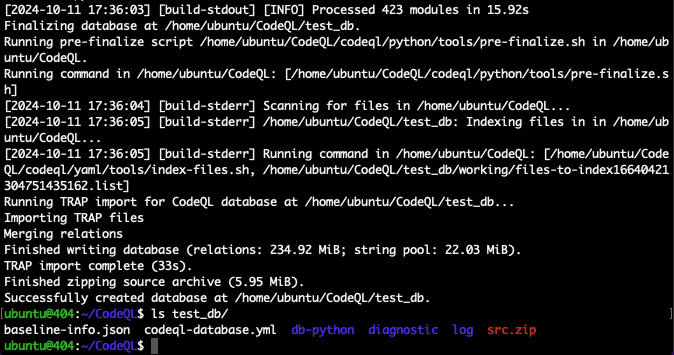
</br>[3.codeql创建测试数据库]
</div>

随后我们来编写查询语句，一个标准的 CodeQL 查询语句格式如下：
```
/**
 *
 * Query metadata
 *
 */

import /* ... CodeQL libraries or modules ... */

/* ... Optional, define CodeQL classes and predicates ... */

from /* ... variable declarations ... */
where /* ... logical formula ... */
select /* ... expressions ... */
```

该语句可以理解为：通过 `import` 导入哪些库，然后从哪些数据中(`from`)，寻找满足哪些条件(`where`)的结果(`select`)；不过编写 [helloworld.ql](./helloworld.ql) 则相对简单些，如下：
```
select "Hello World!"
```

使用 `query run` 子命令指定 `test_db` 数据库执行 `helloworld.ql` 查询语句，命令如下：
```
$ ./codeql/codeql query run -d test_db/ helloworld.ql
```

执行如下：
<div align="center">
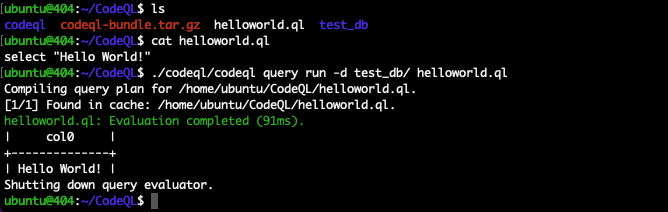
</br>[4.codeql执行helloworld查询]
</div>

除了以上这种 CodeQL-cli(命令行) 的使用方式，CodeQL 还提供了另外两种方式，这里我们进行对比介绍：
1. cli：适合对项目源码进行批量的规则扫描和检测，使用命令行进行操作；
2. VSCode插件：适合使用 CodeQL 辅助进行代码审计，使用 VSCode 进行操作；
3. CI/CD：结合规则库将  CodeQL 添加进 CI/CD 流程进行持续化的项目安全管理，在 CI/CD 流程中自动执行；

>注意在未获得 GitHub Advanced Security 的许可证前，Github 不允许将 CodeQL 应用于自动分析、持续集成或持续交付(CI/CD)中；因此本文 CI/CD 的使用方式不再进行拓展。

### 0x02 辅助代码审计/vscode插件
CodeQL 目前最常用的场景是辅助安全研究人员进行代码审计，这里我们来介绍如何配置和使用 VSCode-CodeQL插件。

在「0x01 CodeQL环境配置」的 CodeQL-cli 环境下，使用 VSCode 搜索 `CodeQL` 插件进行安装，如下：
<div align="center">
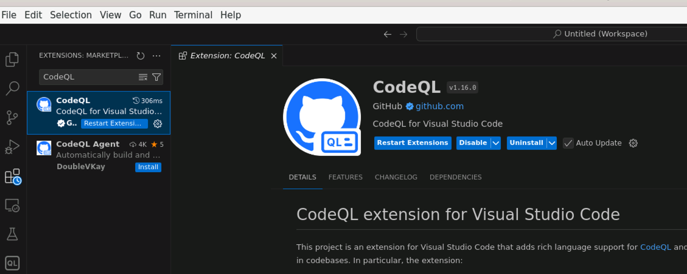
</br>[5.VSCode安装CodeQL插件]
</div>

安装完毕后，在插件设置中还需配置 `CodeQL-cli` 的执行路径如下：
<div align="center">
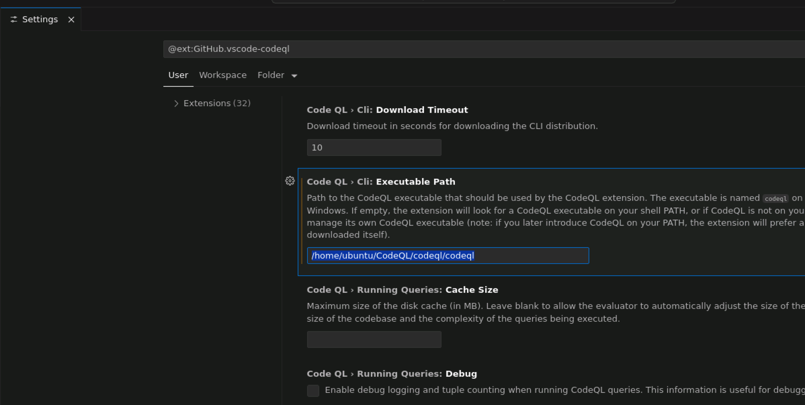
</br>[6.CodeQL插件配置执行路径]
</div>

随后就可以在 VSCode 中使用 CodeQL 了；在 VSCode 中我们需要先添加 CodeQL 的数据库文件，这里复用上文中的 `test_db`，如下：
<div align="center">
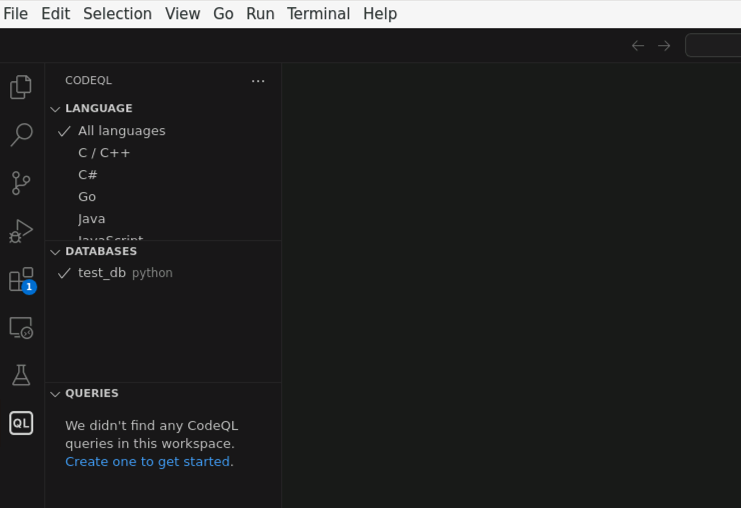
</br>[7.CodeQL插件添加数据库]
</div>

然后使用 `Ctrl+Shift+P` 呼出命令行，选择 `CodeQL: Quick Query` 创建快速查询：
<div align="center">
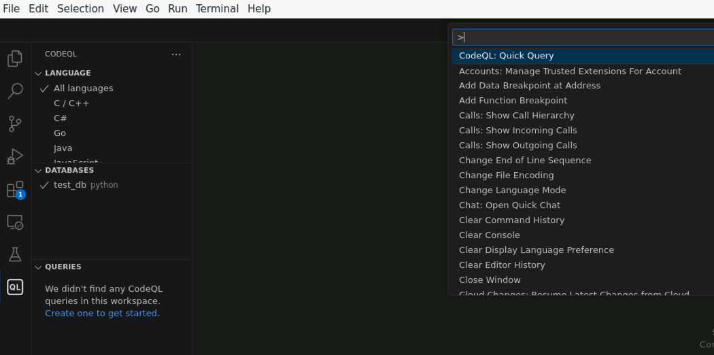
</br>[8.CodeQL插件创建快速查询]
</div>

同样编写 `Hello World` 查询，点击执行即可在分窗口下查看结果，如下：
<div align="center">
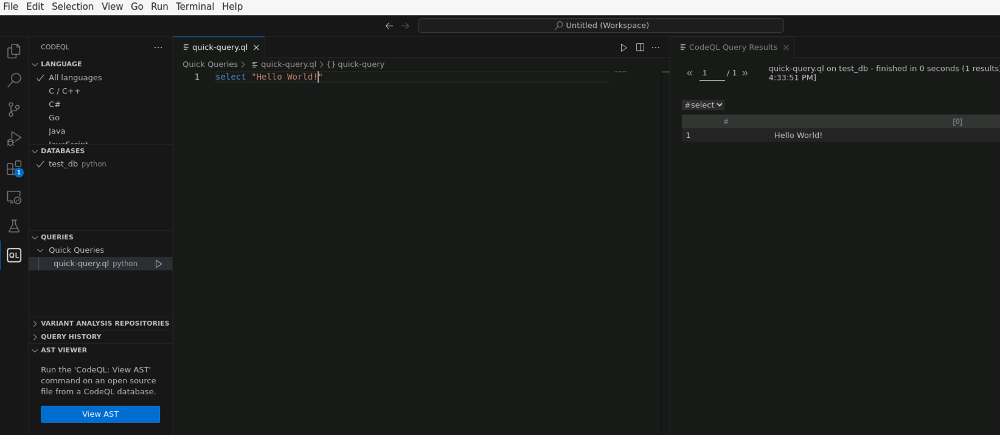
</br>[9.CodeQL插件执行HelloWorld]
</div>

用户在 VSCode 中使用 CodeQL 插件，可以借助其代码提示快速的编写查询语句，通过可视化的执行结果能帮助我们快速定位、分析源码，同时这也非常方便调试和分析 QL 语句；整个使用过程十分贴合人工代码审计，是目前最受欢迎的 CodeQL 使用方式，下文中我们也将主要使用这种方式进行实验演示。

### 0x03 批量扫描/命令行
关于在 `CodeQL-cli` 命令行下使用规则库对项目源码进行批量扫描的使用方式，我们这里也进行简单的介绍。

以 https://github.com/knownsec/pocsuite3 作为目标项目，拉取源代码并使用 CodeQL 创建数据库：
```
$ mkdir pocsuite3 && cd pocsuite3/
$ git clone https://github.com/knownsec/pocsuite3.git
# 创建数据库，使用 --source-root 指定源码路径
$ ../codeql/codeql database create pocsuite3_db --language=python --source-root=./pocsuite3/
```

执行如下：
<div align="center">
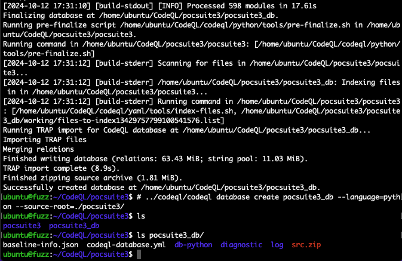
</br>[10.codeql创建pocsuite3的数据库]
</div>

随后我们使用 `database analyze` 子命令按默认规则库(`codeql/python-queries/1.2.0/Security/*`)进行批量扫描，结果文件通常使用 `SARIF` 格式，以便后续使用 VSCode 进行查看，如下：
```
$ ../codeql/codeql database analyze pocsuite3_db/ --format=sarif-latest --output=result.sarif
```

执行如下：
<div align="center">
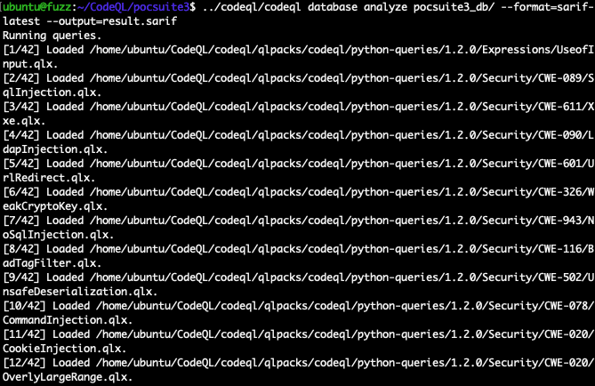
</br>[11.codeql使用默认规则进行批量扫描]
</div>

扫描完成后，在 VSCode 中安装 `SARIF Viewer` 插件(https://github.com/microsoft/sarif-vscode-extension)后，打开 `result.sarif` 扫描结果文件，预览窗口中以代码交叉引用的方式展示扫描出来的代码问题，如下：
<div align="center">
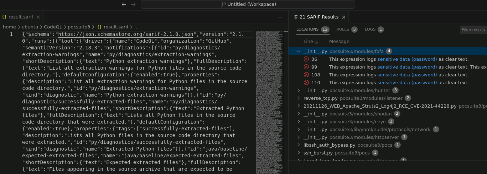
</br>[12.查看SARIF扫描结果]
</div>

在 VSCode 的工作区中添加 pocsuite3 源代码文件夹，点击 CodeQL 的结果项就可以访问源代码位置，如下：
<div align="center">
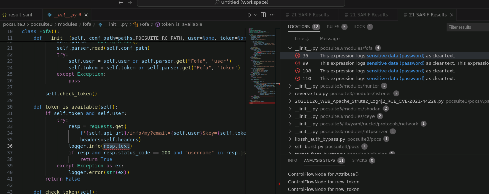
</br>[13.通过SARIF扫描结果分析问题]
</div>

此处展示的是根据 `CWE-312` 规则，在源代码 `logger.info(resp.text)` 发现敏感信息(如密码)被明文保存至日志文件中，可能造成敏感信息泄露的问题。

>实际场景下，使用默认规则库几乎只能找到直白浅显的代码问题，这是因为 CodeQL 的规则和业务逻辑存在一定的相关性，一条规则在不同的业务逻辑下可能产生不同的判断结果和数据流动，即便我们提炼漏洞模型从而编写出比较通用的规则，也不能 100% 保证扫描出漏洞，还需要具体情况具体分析。

### 0x04 QL/tutorials
CodeQL 官方提供了 QL 教程(https://codeql.github.com/docs/writing-codeql-queries/ql-tutorials/)以小游戏的方式帮助用户入门 QL 并理解基础的语法规则。

我们跟随教程了解 QL 的基础语法，首先一个标准的 CodeQL 查询语句格式如下：
```
from /* ... variable declarations ... */
where /* ... logical formulas ... */
select /* ... expressions ... */
```

一个简单的示例查询如下：
```
from int x, int y
where x = 6 and y = 7
select x * y

# 42
```

该查询表示声明了两个 `int` 类型的变量 `x / y`，从(`from`)这些变量中寻找(`where`)满足条件`x = 6 and y = 7` 的数据，获取结果(`select`)并计算 `x * y`，执行后查询结果为 `42`。

再来几个基础练习如下：
```
# Exercise 1: 获取 "lgtm" 字符串的长度
# 
from string s
where s = "lgtm"
select s.length()
# 4

# Exercise 2: 计算 3^5 和 245.6 两个数中较小者的正弦值
from float x, float y
where x = 3.pow(5) and y = 245.6
select x.minimum(y).sin()
# -0.89

# Exercise 3: 对一个布尔值进行取反操作
from boolean b
where b = false
select b.booleanNot()
# true

# Exercise 4: 计算 2017.06.10 至 2017.09.28 之间的天数
from date start, date end
where start = "10/06/2017".toDate() and end = "28/09/2017".toDate()
select start.daysTo(end)
# 110
```

以上练习仅使用了 QL 内置的原始类型，实际上并没有用到数据库中的信息，下面我们结合 QL 提供的编程语言 SDK(python) 来进行查询：
```
import python

from Function f
where count(f.getAnArg()) > 7
select f
```

该查询表示首先导入 `python` 编程语言库，声明 `Function` 类型的变量 `f`，寻找 `f` (函数)的参数大于 7 个的函数。

执行如下：
<div align="center">
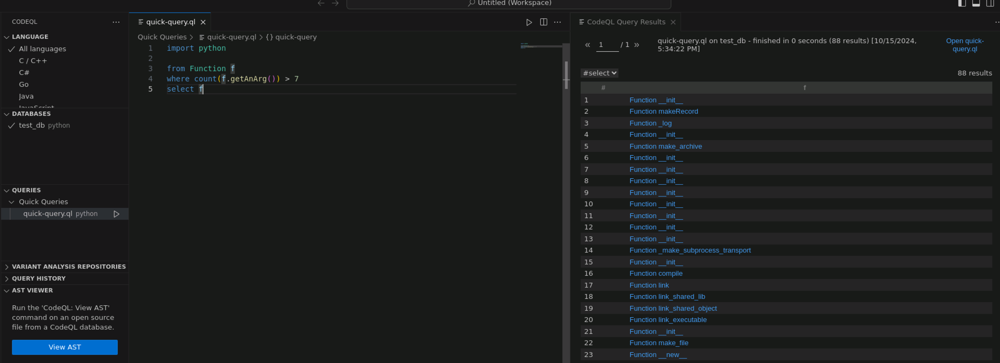
</br>[14.codeql-python查询示例]
</div>

QL 教程中还提供了一个「找到小偷」的小游戏(https://codeql.github.com/docs/writing-codeql-queries/find-the-thief/#)，帮助我们学习 QL 中使用逻辑连接词、量词和聚合词。

「找到小偷」这个小游戏讲的在一个小村庄里，小偷偷走了王冠，我们经过一番专业侦查，获得了村子里所有人的名单和他们的一些个人信息，以及有关小偷的信息，接下来需要我们使用 QL 找出这个小偷；

侦查到的小偷信息如下：
1. 小偷身高是否超过150厘米？ Y
2. 小偷是金发的吗？ N
3. 小偷是秃头吗？ N
4. 小偷年龄是否未满 30 岁？	N
5. 小偷住在城堡的东边吗？ Y
6. 小偷的头发是黑色还是棕色的？ Y
7. 小偷的身高是否超过180cm，且矮于190cm？ N
8. 小偷是村里最年长的人吗？	N
9. 小偷是村里最高的人吗？ N
10. 小偷是不是比一般村民矮啊？ Y
11. 这个小偷是不是村东区最年长的人？ Y

CodeQL 提供了 `tutorial` SDK 库为教程中的示例准备了数据库数据，同时还提供了「谓词」以便用户进行练习使用，QL 的谓词是一种小型查询，它表达(封装)了各种数据之间的关系并描述了它们的一些属性(类似编程语言中的函数)，如下：

1. `getAge()`       返回人的年龄(int)
2. `getHairColor()` 返回人的头发颜色(string)
3. `getHeight()`    返回人的身高(float)
4. `getLocation()`  返回此人家的位置(string)

随后我们就可以将信息转化为对应的 QL 查询语句了，以第 1 条为例：
```
# 1. 小偷身高是否超过150厘米？ Y
import tutorial
from Person t
where t.getHeight() > 150
select t
```

应对第 3 条，我们需要使用 `exists` 关键词，`exists` 表示引入一个临时变量，当至少一个条件满足时该项才会被保留；
```
# 3. 小偷是秃头吗？ N
# 小偷不是秃头，即表示 getHairColor() 返回任意字符串都满足条件

# exists syntax
# exists(<variable declarations> | <formula>)

import tutorial
from Person t
where exists(string c | t.getHairColor() = c)
select t
```

对于第 9 条，我们需要使用 `max` 关键词函数，使用 `max` 聚合函数求出最大值：
```
# 9. 小偷是村里最高的人吗？ N
import tutorial
from Person t
where not t.getHeight() = max(float h | exists(Person p | p.getHeight() = h) | h)
select t, t.getHeight()
```

我们将所有的信息都转换为 QL 的查询条件，并使用 `and` 关键词进行连接，如下：
```
import tutorial

from Person t
where
  /* 1 */ t.getHeight() > 150 and
  /* 2 */ not t.getHairColor() = "blond" and
  /* 3 */ exists (string c | t.getHairColor() = c) and
  /* 4 */ not t.getAge() < 30 and
  /* 5 */ t.getLocation() = "east" and
  /* 6 */ (t.getHairColor() = "black" or t.getHairColor() = "brown") and
  /* 7 */ not (t.getHeight() > 180 and t.getHeight() < 190) and
  /* 8 */ exists(Person p | p.getAge() > t.getAge()) and
  /* 9 */ not t = max(Person p | | p order by p.getHeight()) and
  /* 10 */ t.getHeight() < avg(float i | exists(Person p | p.getHeight() = i) | i) and
  /* 11 */ t = max(Person p | p.getLocation() = "east" | p order by p.getAge())
select "The thief is " + t + "!"

# The thief is Hester!
```

执行后找到小偷 "Hester"，如下：
<div align="center">
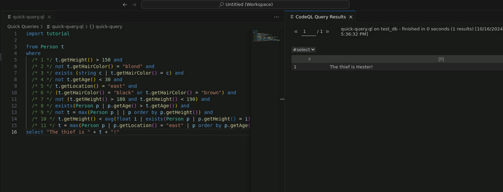
</br>[15.codeql-tutorial找到小偷]
</div>

感兴趣的读者还可以继续完成「Catch the fire starter / Crown the rightful heir / Cross the river」小游戏，以进一步掌握 QL 的基础语法，本文这里不再进行拓展。

### 0x05 u-boot/CTF
通过 QL/tutorials 教程学习了基础语法，我们现在来尝试进行一些实际案例；CodeQL 官方提供了 CTF 题目来帮助用户进阶学习 QL 语法(https://securitylab.github.com/ctf/)，已经结束的题目是我们最佳的学习资料，我们这里选择 `U-Boot Challenge` 题目进行实践。

U-Boot 项目是采用 C 语言进行开发的，早期 CodeQL 的安全研究人员在 U-Boot((https://github.com/u-boot/u-boot/tree/d0d07ba86afc8074d79e436b1ba4478fa0f0c1b5)加载程序中发现的 13 个远程代码执行漏洞，而我们的目标就是使用 CodeQL 复现找出这些漏洞。

首先为 U-Boot 源码创建 QL 数据库，可以直接下载 `U-Boot Challenge` 题目提供的数据库文件，如下：
```
$ wget https://github.com/github/securitylab/releases/download/u-boot-codeql-database/u-boot_u-boot_cpp-srcVersion_d0d07ba86afc8074d79e436b1ba4478fa0f0c1b5-dist_odasa-2019-07-25-linux64.zip
```

我们这里采用手动从源码构建 QL 数据库 `u-boot_db`，如下：
```
# 下载 u-boot-d0d07ba8 源码
# download from https://github.com/u-boot/u-boot/tree/d0d07ba86afc8074d79e436b1ba4478fa0f0c1b5
$ unzip u-boot-d0d07ba86afc8074d79e436b1ba4478fa0f0c1b5.zip

# 使用 CodeQL 指定源码创建数据库
# 对于编译型语言，CodeQL 会执行其编译脚本以分析代码结构从而创建数据库(默认会从 autobuild 尝试自动执行编译脚本)
../codeql/codeql database create u-boot_db --language=cpp --source-root=./u-boot-d0d07ba86afc8074d79e436b1ba4478fa0f0c1b5

# 部分情况下会因为编译脚本执行错误而导致数据库创建失败，这时可以单独执行编译脚本排查问题，随后再重新创建数据库
# 实验环境 Ubuntu22.04 + Gcc 11.4.0，需 patch
# vim u-boot-d0d07ba86afc8074d79e436b1ba4478fa0f0c1b5/scripts/dtc/dtc-lexer.lex.c
# YYLYTYPE yylloc => extern YYLTYPE yylloc
```

执行如下：
<div align="center">
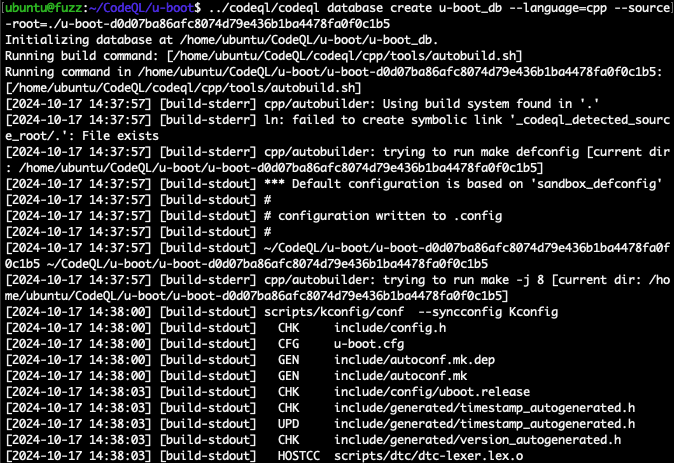
</br>[16.codeql创建uboot数据库]
</div>

随后我们就可以在 VSCode 中添加 `u-boot_db` 数据库以进行 QL 查询了；题目中的漏洞是因为程序未对用户传入的网络数据包长度值进行校验，从而导致 `memcpy` 将可控的 n 字节数据从 src 复制到 dst 内存中，引起 `memcpy` 溢出漏洞；根据此思路按题目进行实验：

1.首先我们来查找sink(漏洞点) `memcpy` 和source(数据入口) `ntohl/ntohll/ntohs` 的函数定义：
```
# (sink/漏洞点) memcpy 是函数，从 Function 中进行查询
import cpp

from Function f
where f.getName() = "memcpy"
select f

# (source/数据入口) ntohl/ntohll/ntohs 是宏，从 Macro 中进行查询
import cpp

from Macro m
where m.getName() = "ntohl" or m.getName() = "ntohll" or m.getName() = "ntohs"
select m
```

执行 sink 查询如下：
<div align="center">
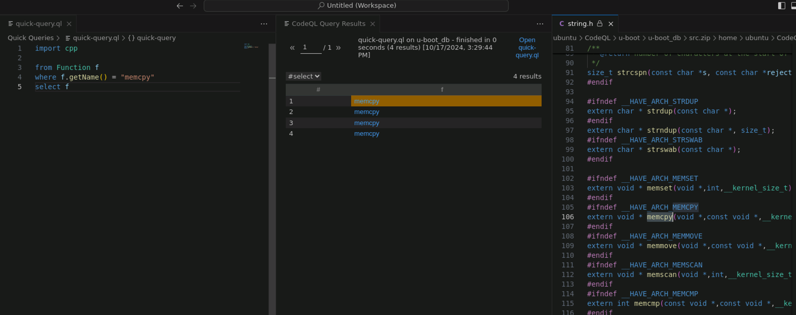
</br>[17.从uboot查询memcpy函数定义]
</div>

2.那么哪些函数调用了 `memcpy` 和 `ntohl/ntohll/ntohs` 呢，编写查询如下：
```
# (sink/漏洞点) 使用 FunctionCall 查询 memcpy 的调用
import cpp

from FunctionCall fc
where fc.getTarget().getName() = "memcpy"
select fc

# (source/数据入口) 使用 MacroInvocation 查询 ntoh* 的调用
import cpp

from MacroInvocation mi
where mi.getMacroName().regexpMatch("ntoh(s|l|ll)")
select mi
```

执行 source 查询如下：
<div align="center">
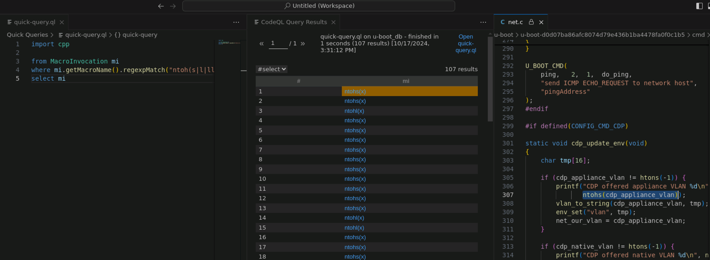
</br>[18.从uboot查询调用ntoh*的函数]
</div>

3.我们现在分别找到了 sink(漏洞点)的函数和 source(数据输入)的函数，他们之间是否存在变量的传递呢？现在就需要我们来进行数据流分析(flow)，使用 `DataFlow + TaintTracking` 进行全局数据流查询，如下：
```
import cpp
import semmle.code.cpp.dataflow.TaintTracking
import DataFlow::PathGraph

class NetworkByteSwap extends Expr {
    NetworkByteSwap() {
        exists(MacroInvocation mi |
            mi.getMacroName().regexpMatch("ntoh(s|l|ll)")
            and this = mi.getExpr()
        )
    }
}

class Config extends TaintTracking::Configuration {
    Config() { this = "Config"}

    override predicate isSource(DataFlow::Node source) {
        source.asExpr() instanceof NetworkByteSwap
    }

    override predicate isSink(DataFlow::Node sink) {
        exists(FunctionCall c | c.getTarget().getName() = "memcpy"
            and sink.asExpr() = c.getArgument(2)
        )
    }
}

from Config cfg, DataFlow::PathNode source, DataFlow::PathNode sink
where cfg.hasFlowPath(source, sink)
select sink, source, sink, "Network byte swap flows to memcpy"
```

执行如下：
<div align="center">
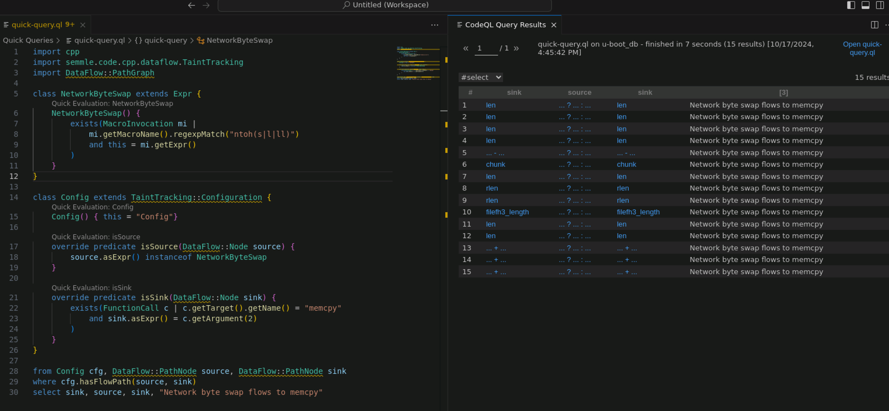
</br>[19.从uboot查询出多个漏洞]
</div>

>为了更好的复现 `U-Boot Challenge` 题目，我们这里使用了 `DataFlow::PathGraph` 库，该库已被弃用将来可能会被删除；目前应使用 `DataFlow::ConfigSig` 模块的方式进行编写。

以查询结果中的第 8/9 项为例，其对应了一个漏洞 [CVE-2019-14195](https://cve.mitre.org/cgi-bin/cvename.cgi?name=CVE-2019-14195)，源码如下：
<div align="center">
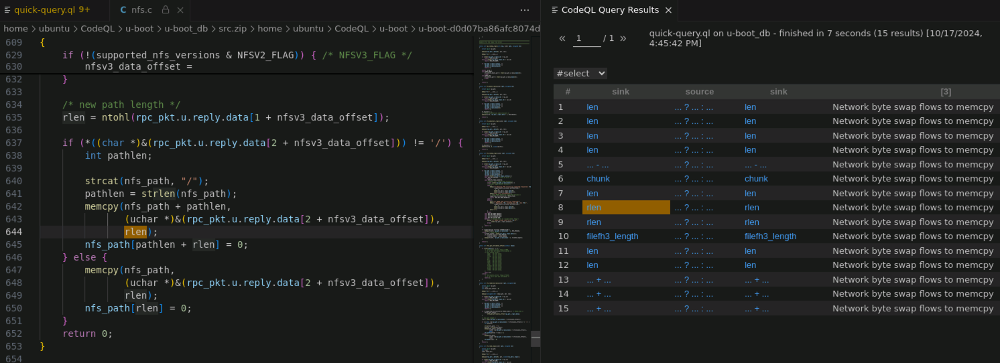
</br>[20.uboot的CVE-2019-14195漏洞]
</div>

从源码中我们可以清楚看到，`rlen` 来源于用户传入的数据报文 `ntohl(rpc_pkt.u.reply.data[1 + nfsv3_data_offset]);`，在未做任何检查的情况下，直接传给 `memcpy()`函数作为 `len`，精心构造该数据，即可触发 `memcpy` 内存溢出漏洞。

### 0x06 QL基本语法
即便我们没有了解过 QL 语法，跟随 CodeQL 教程和 CTF 的题解也能快速的编写查询语句进行复现，现在我们就进一步开始学习 QL 语言的基本语法。

通过官方手册 https://codeql.github.com/docs/ql-language-reference/ 可进行系统性的学习，本文整理了个目录以便于记忆：

* 关于QL语言：QL 是一种声明性的、面向对象的查询语言
* 谓词：谓词用于描述构成 QL 程序的逻辑关系 (predicate)
    * 没有结果的谓词
    * 带结果的谓词 (result)
    * 递归谓词
    * 谓词种类
    * 绑定行为
    * 数据库谓词
* 查询：查询是 QL 程序的输出，通常将 QL 程序称为查询
    * 选择子句 (from...where...select)
    * 查询谓词 (query)
* 类型：QL 是一种静态类型语言，因此每个变量都必须具有声明的类型
    * 原始类型 (boolean / float / int / string / date)
    * 类 (class)
    * 字符类型和类域类型
    * 代数数据类型 (newtype)
    * 类型联合
    * 数据库类型
    * 类型兼容性
* 模块：模块通过将相关类型、谓词和其他模块组合在一起来提供一种组织 QL 代码的方法 (module)
    * 模块种类
    * 模块主体
    * 导入模块 (import)
    * 内置模块
* 签名：参数化模块使用签名作为其参数的类型系统 (signature)
    * 谓词签名
    * 类型签名
    * 模块签名
* 别名：别名是现有 QL 实体的替代名称 (=)
* 变量：QL 中的变量使用方式与代数或逻辑中的变量类似，变量的值通常受公式限制
    * 声明变量
    * 自由变量和绑定变量
* 表达式：表达式计算结果是一组值并且具有类型
    * 变量引用 (this / result)
    * 常量值
    * 括号表达式
    * 范围
    * 常量值表达式
    * 超级表达式
    * 调用谓词（带结果）
    * 聚合 (count / min / max / avg / sum / concat / rank / strict* / unique)
    * Any (any)
    * 一元运算 (+ / -)
    * 二元运算 ( + / - / * / / / %)
    * 强制类型转换
    * 无关表达式 (_)
* 公式：公式定义表达式中使用的自由变量之间的逻辑关系
    * 比较 (> / >= / < / <= / = / !=)
    * 类型检查 (instanceof)
    * 范围检查 (in)
    * 调用谓词
    * 括号公式
    * 量化公式 (exists / forall / forex)
    * 逻辑连接词 (any() / none() / not / if...then...else / and / or / implies)
* 注解：注解是一个字符串，您可以将其直接放置在 QL 实体或名称的声明之前
    * 注解概述 (abstract / cached / deprecated / external / transient / final / library / override / private / query / ...)
* 递归： QL 中的谓词直接或间接地依赖于自身，则称其为递归
    * 相互递归
    * 传递闭包
* 注释：所有标准的单行和多行注释都会被 QL 编译器忽略，并且仅在源代码中可见

QL 语言除了以上基本语法外，SDK 库也是非常重要的组成部分，其内置的各种语法(如：函数Function、调用关系Call)能帮助用户快速编写查询；不同编程语言之间虽然存在诸多共性(如变量、函数、流程控制语句)，但也有很多不同点相差甚远(如 C 语言中有宏，Python 没有)，因此 CodeQL 的 SDK 以编程语言为大类进行分别实现。

本文这里以 Python 语言为例，同样这里整理了个目录以便于记忆，系统性的 SDK 学习请参考：https://codeql.github.com/docs/codeql-language-guides/codeql-for-python/ 

* Python 代码的基本查询：学习编写和运行简单的 CodeQL 查询
    * 关于查询
    * 寻找一个 CodeQL 数据库来实验
    * 扩展查询
* Python 的 CodeQL 库：利用 Python 的 CodeQL 库中的大量类集合分析 Python 程序
    * 句法 
    * 控制流
    * 数据流
    * API 图
* Python 的数据流分析：使用 CodeQL 跟踪数据分析 Python 程序数据流动的地方
    * 本地数据流
    * 全局数据流
* Python 使用 API 图：API 图是引用外部库中定义的函数、类和方法的统一接口
    * 模块导入
    * 访问属性
    * 调用和类实例
    * 子类
    * 内置函数和类
* Python 的函数：使用标准 CodeQL 库中的语法类来查找 Python 函数并识别对它们的调用
* Python 的表达式和语句：使用 CodeQL 库中的语法类来探索如何在代码库中使用 Python 表达式和语句
    * 语句
    * 表达式
    * 类和函数定义
* Python 的控制流分析：编写 CodeQL 查询来探索 Python 程序的控制流图
    * ControlFlowNode​​
    * BasicBlock​​
* Python 自定义库编写：可将查询代码扩展和封装成新的模块或库

除了以上 SDK 教程和示例外，还可以参考官方提供的 Python 的 CodeQL 查询帮助(https://codeql.github.com/codeql-query-help/python/)，其中提供了大量的实际操作案例；当然更为重要的 SDK 的官方参考文档(https://codeql.github.com/codeql-standard-libraries/python/)，从参考文档中我们可以查阅任意一个谓词的作用、参数、返回值以及使用示例。

>其他编程语言的 SDK 参考资料，可在本小节提供 Python 参考链接的父级页面进行查阅。

### 0x07 QL基本思路
CodeQL 是一种自动化代码审计方案，在代码审计中 source、sink、data flow、sanitizer 等基础概念构成了代码审计的基本思路，其分别表示：
* source：输入位置，通常指用户直接或间接可控的数据输入位置，是 data flow 的起点
* sink：缺陷位置，通常指可能存在代码缺陷的位置，是 data flow 的终点
* data flow：数据流，数据由 source 流动至 sink 的过程
* sanitizer：净化函数，函数对数据进行了过滤从而阻断了 data flow 的流动

以 Web 应用的命令注入漏洞(CWE-78)，通常用户发起的 `request` 中所携带的参数(如 `GET/POST`) 就是 source，代码中调用命令执行函数(如 `system()`)的地方则是 sink，data flow指的是用户传入的数据能正确流动至命令执行函数的过程；

找到一条 data flow 通常就找到了一个代码缺陷或安全漏洞，不过实际上我们还需要排除 sanitizer 的影响，净化函数会对用户输入进行检查和过滤，最终阻断 data flow 的流动。

按照这种基本思路，在 CodeQL 中编写查询语句可以按照如下步骤：
1. 编写 sink 的查询语句
2. 编写 source 的查询语句
3. 查询 source 到 sink 之间的 data flow
4. 补充 sanitizer 的查询语句

我们使用 Python 的 `flask` 框架编写一个包含命令注入的程序，下文我们将使用 CodeQL 逐步演示找出该漏洞，[example.py](./example.py) 如下：
```
from flask import Flask
from flask import request

app = Flask(__name__)

def exec_system(cmd):
    import os
    result = os.popen(cmd).read()
    return result

@app.route("/")
def hello_world():
    return "Hello World!"

@app.route("/command_execution")
def command_execution():
    param = request.values.get("param")
    cmd = "echo %s | base64" %  param
    result = exec_system(cmd)
    return result

@app.errorhandler(404)
def page_not_found(e):
    return "404 Not Found", 404

if __name__ == '__main__':
    app.run(host='127.0.0.1',debug=True)

# curl "http://127.0.0.1:5000/command_execution?param=123;whoami"
# 123
# dWJ1bnR1Cg==
```

使用 CodeQL 为 example.py 创建数据，如下：
```
./codeql/codeql database create example_db --language=python --source-root=./src
```

其工作目录如下：
<div align="center">
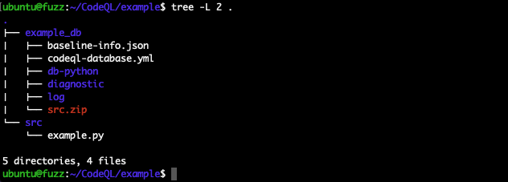
</br>[21.codeql创建example数据库]
</div>

随后在 VSCode 中添加 `example_db` 数据库，选择 `Python` 语言并创建 `Qucik Query` 进行查询。

### 0x08 sink/source查询
在 example.py 首先查询 sink 点，即源码中的 `os.popen(cmd).read()`，编写查询如下：
```
import python

from Call call
where call.getLocation().getFile().getRelativePath() = "example.py"
    and call.getAChildNode().(Attribute).getName() = "popen"
select call
```

>为了更直观的展示查询结果，我们额外添加了 `*.getRelativePath() = "example.py"` 条件以限制查询目标都位于 example.py 内，排查系统库和第三方库代码所带来的混淆。

执行如下：
<div align="center">
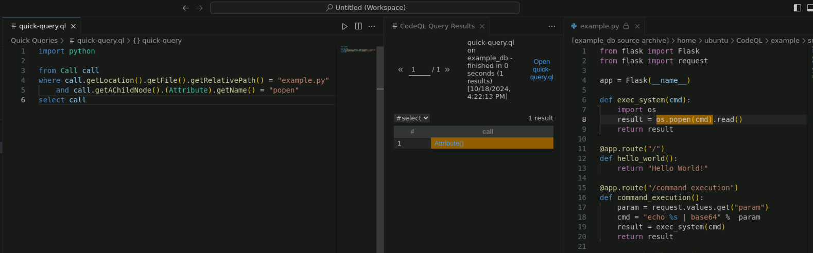
</br>[22.example编写sink查询]
</div>

随后来查询 source 点，在 `flask` 中所有经过 `@app.route()` 装饰器的函数都是 Web 入口：
```
import python

from Function f
where f.getLocation().getFile().getRelativePath() = "example.py"
    and f.getADecorator().getAChildNode().(Attribute).getName() = "route"
select f
```

执行如下：
<div align="center">
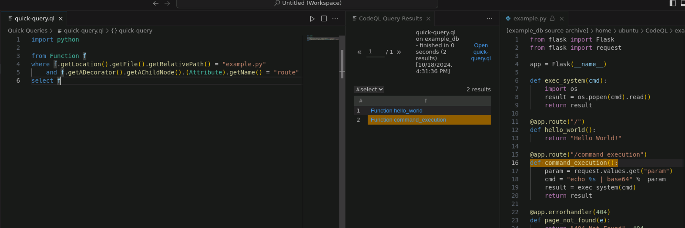
</br>[23.example编写source查询]
</div>

CodeQL 符合预期的找出了 `hello_world() / command_execution()` 两个 source 点。

另外使用 CodeQL 提供的 `View AST` 功能能够极大的方便我们编写 sink/source 查询，以精确定位到具体的 ASTNode；首先右键点击 QL 数据库，将 QL 数据库添加至工作区(`Add Database Source to Workspace`)，随后在工作区中打开目标源码文件，如下：
<div align="center">
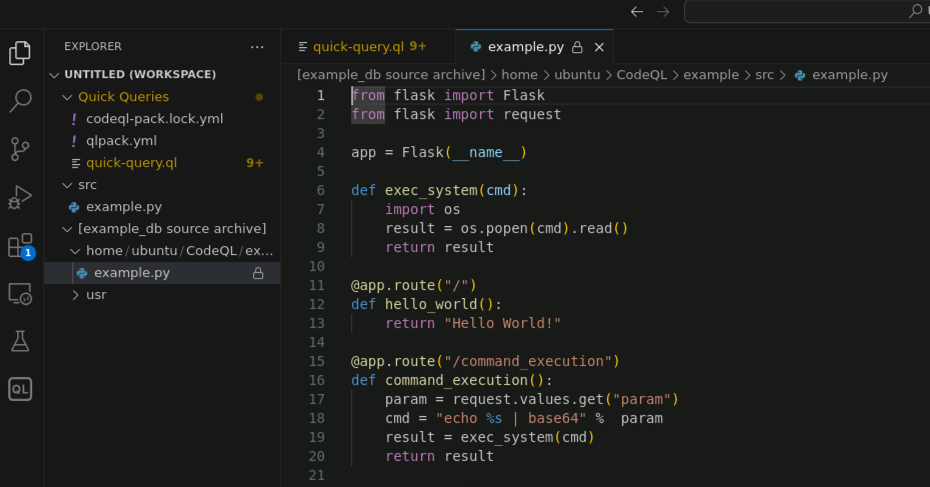
</br>[24.从数据库访问源码文件]
</div>

然后切换至 CodeQL 插件页面下，点击 `View AST` 后将分析并打开当前源码文件的 ASTNode 结构，如下：
<div align="center">
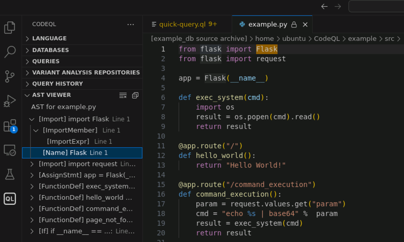
</br>[25.访问example.py的ASTNode结构]
</div>

根据展示的 ASTNode 结构，用户可以清晰、快速的编写查询语句。

### 0x09 控制流查询
通常进行代码审计时，找到敏感函数后我们就会去关注两段代码是否可达，如函数 A 是否会调用到函数 B 或函数 B 是否会被函数 A 调用(函数回溯)，找出代码控制流能帮助我们快速理解业务逻辑关系；在进行数据流查询前，我们先来介绍一下控制流查询。

以上文中的 sink 为例，我们查询有哪些函数调用了 `exec_system()` 函数，我们这里需要使用递归查询，通过回溯调用链的方式找到 source 的位置；这里我们编写传递闭包的谓词，传递闭包谓词必须有两个兼容类型的参数，在调用谓词时添加 `+`(一次或多次) 和 `*`(零次或多次)符号进行指定查询方式，编写查询语句如下：
```
import python

query predicate edges(Function a, Function b) {
    a.getAStmt().getAChildNode().(Call).getFunc().(Name).getId() = b.getName()
}

from Function src, Function dst
where src.getLocation().getFile().getRelativePath() = "example.py"
    and dst.getLocation().getFile().getRelativePath() = "example.py"
    and dst.getName() = "exec_system"
    and edges+(src, dst)
select src, dst
```

执行如下：
<div align="center">
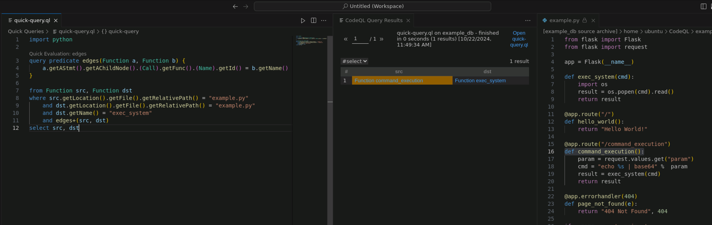
</br>[26.example控制流查询]
</div>

可以看到，我们控制流查询找到了在 `command_execution()` 函数调用了 `exec_system()` 函数(此处如果有多层调用关系也可以正确查出)。

### 0x0A 局部数据流查询
查询函数内部的局部变量数据流是相对容易的事情，同时局部数据流查询更快、计算量更小、更准确；以 source 为例，我们查询 `command_execution()` 函数中的 `param` 如何流向 `exec_system(cmd)` 函数调用，如下：
```
import python
import semmle.python.dataflow.new.DataFlow
import semmle.python.dataflow.new.TaintTracking

from Call call, DataFlow::CallCfgNode ccn, DataFlow::ExprNode expr
where call.getLocation().getFile().getRelativePath() = "example.py"
    and call.getAChildNode().(Name).getId() = "exec_system"
    and ccn.asExpr() = call
    //and DataFlow::localFlow(expr, ccn.getArg(0))
    and TaintTracking::localTaint(expr, ccn.getArg(0))
    and expr instanceof DataFlow::LocalSourceNode
select ccn, expr
```

我们这里使用 `Call` 找到 `exec_system()` 的位置并传递给 `CallCfgNode`，随后使用局部污点数据流分析 `TaintTracking::localTaint()` 查询哪些数据流向了 `exec_system()` 第一个参数(`cmd`)，执行如下：
<div align="center">
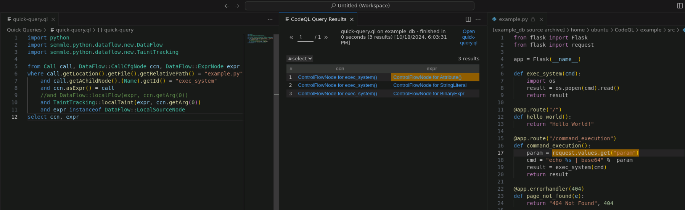
</br>[27.example局部数据流查询]
</div>

可以看到，我们通过局部数据流查询，找到了在 `command_execution()` 函数中 `exec_system(cmd)` 的参数来源于 `request.values.get("param")`。

>如果使用 `DataFlow::localFlow()` 则只能查询名称为 `cmd` 变量的数据流动，使用污点分析才能够追踪变量的传递。

### 0x0B 全局数据流查询
在上文的基础上，查询 source 到 sink 的数据流动需要使用全局数据流查询，全局数据流查询的格式一般如下：
```
import python

module MyFlowConfiguration implements DataFlow::ConfigSig {
  predicate isSource(DataFlow::Node source) {
    ...
  }

  predicate isSink(DataFlow::Node sink) {
    ...
  }
}

//module MyFlow = DataFlow::Global<MyFlowConfiguration>;
module MyFlow = TaintTracking::Global<MyFlowConfiguration>;

from DataFlow::Node source, DataFlow::Node sink
where MyFlow::flow(source, sink)
select source, "Dataflow to $@.", sink, sink.toString()
```

首先编写模块(`module`)继承于 `DataFlow::ConfigSig`，其中必须实现 `isSource` 和 `isSink` 谓词，该部分对应上文中的 source 和 sink 查询语句，其次使用该模块定义变量，最后编写语句查询数据；我们编写全局数据流查询如下：
```
import python
import semmle.python.dataflow.new.DataFlow
import semmle.python.dataflow.new.TaintTracking

module RouteToCmdExecConfiguration implements DataFlow::ConfigSig {
    predicate isSource(DataFlow::Node source) {
        exists(Function f |
            f.getLocation().getFile().getRelativePath() = "example.py"
            and f.getADecorator().getAChildNode().(Attribute).getName() = "route"
            and source.asExpr() = f.getAStmt().(AssignStmt).getATarget()
        )
    }

    predicate isSink(DataFlow::Node sink) {
        exists(Call call |
            call.getLocation().getFile().getRelativePath() = "example.py"
            and call.getAChildNode().(Attribute).getName() = "popen"
            and sink.asExpr() = call.getAnArg()
        )
    }
}

//module RouteToCodeExec = DataFlow::Global<RouteToCodeExecConfiguration>;
module RouteToCmdExec = TaintTracking::Global<RouteToCmdExecConfiguration>;

from DataFlow::Node source, DataFlow::Node sink
where RouteToCmdExec::flow(source, sink)
select source, sink
```

同样使用污点查询，执行如下：
<div align="center">
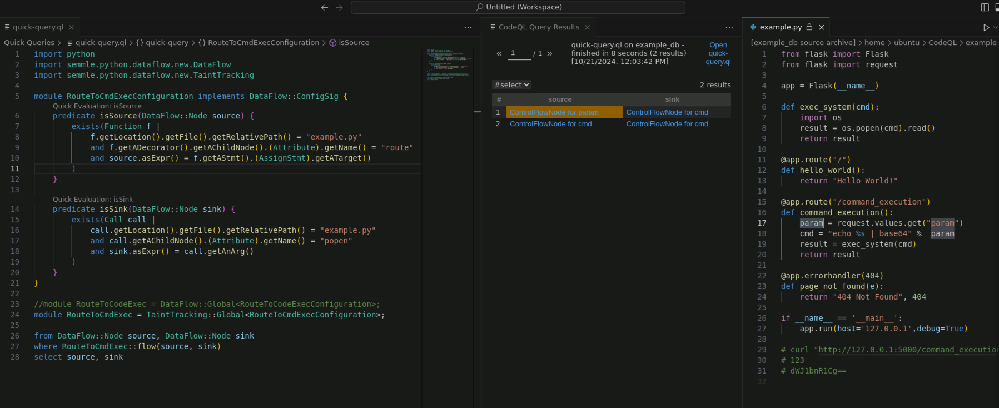
</br>[28.example全局数据流查询]
</div>

可以看到，我们通过 CodeQL 的全局数据流查询找到了源代码中 `os.popen(cmd)` 处存在命令注入漏洞，通过 Web 接口 `/command_execution` 路由的 `param` 参数进行触发和利用。

### 0x0C 总结
本文介绍了 CodeQL 的基本概念和环境搭建，结合官方教程学习了基础的使用方法，并演示了 CodeQL 在 Python 编程语言中的基础查询思路，并进行了简单实践。

但是要将 CodeQL 应用于生产环境中还需要跨越一大步，QL 作为一门"编程语言"，如果用户对语法更加熟练、对 SDK 库更加熟悉、加上大量的编写经验，将极大的提高编写效率以及查询语句的质量；当然 QL 语言也会存在"BUG"，最常见的是数据流断裂即 source 到 sink 明明可达，但是 CodeQL 却无法查询出来，这就需要运用大量的编写经验对查询语句进行调试和优化；

除此之外，编写 CodeQL 的查询语句通常都和业务逻辑存在一定的相关性，脱离了业务场景该 QL 语句可能就失效了，而通过大量的同类漏洞提炼漏洞模型，编写通用型 QL 查询语句可以解决该问题，通用型 QL 查询语句适用性更广、价值更高，这是一种进阶的 CodeQL 使用方法；

最后由于不同编程语言都有各自的特性，要想使用 CodeQL 挖掘各类应用程序，则还需要掌握对应编程语言的基本知识以及熟练使用对应的 CodeQL-SDK 库，这也是需要大量的实践积累。

### 0x0D References
CodeQL官方地址：https://codeql.github.com/  
CodeQL官方文档：https://codeql.github.com/docs/  
CodeQL官方文档教程：https://codeql.github.com/docs/codeql-overview/  
CodeQL-SDK文档：https://codeql.github.com/codeql-standard-libraries/  
CodeQL-Cli指南：https://docs.github.com/en/code-security/codeql-cli/getting-started-with-the-codeql-cli/about-the-codeql-cli  
CodeQL编程语言规则帮助：https://codeql.github.com/codeql-query-help/  
CodeQL官方CTF：https://securitylab.github.com/ctf/  
GitHub安全实验室Blog：https://github.blog/tag/github-security-lab/  
GitHub安全实验室资源：https://github.com/github/securitylab  
CodeQL-learninglab测试仓库：https://github.com/github/codeql-learninglab-actions  
CodeQL-SDK开源仓库：https://github.com/github/codeql  
codeql-action仓库：https://github.com/github/codeql-action  
vscode-codeql-starter插件仓库：https://github.com/github/vscode-codeql-starter  

CodeQL zero to hero part 1: The fundamentals of static analysis for vulnerability research：
https://github.blog/developer-skills/github/codeql-zero-to-hero-part-1-the-fundamentals-of-static-analysis-for-vulnerability-research/  
CodeQL zero to hero part 2: Getting started with CodeQL：
https://github.blog/developer-skills/github/codeql-zero-to-hero-part-2-getting-started-with-codeql/  
CodeQL zero to hero part 3: Security research with CodeQL：
https://github.blog/security/vulnerability-research/codeql-zero-to-hero-part-3-security-research-with-codeql/
https://github.com/GitHubSecurityLab/codeql-zero-to-hero  
CodeQL从入门到放弃：https://www.freebuf.com/articles/web/283795.html  
Codeql 入门教程：https://xz.aliyun.com/t/7657  
CodeQL提升篇：https://tttang.com/archive/1415/  
代码分析引擎 CodeQL 初体验：https://paper.seebug.org/1078/  
CodeQL初入：https://kiprey.github.io/2020/12/CodeQL-setup/  
CodeQL学习笔记：http://blog.gamous.cn/post/codeql/  
Codeql 踩坑记录：https://rmb122.com/2020/03/30/Codeql-%E8%B8%A9%E5%9D%91%E8%AE%B0%E5%BD%95/  
CodeQL坐牢记录：https://blog.z3ratu1.top/CodeQL%E5%9D%90%E7%89%A2%E8%AE%B0%E5%BD%95.html  
人与代码的桥梁-聊聊SAST：https://lorexxar.cn/2023/12/18/sast2024/  
Transitive call graph for python cryptographic operations：https://github.com/github/securitylab/discussions/703