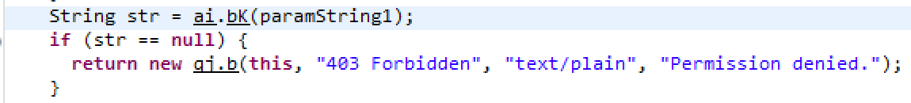

# ES文件浏览器安全漏洞分析(CVE-2019-6447)

Time: 2019.02.26  
Tags: 漏洞分析,逆向分析  

### 0x00 前言
ES 文件浏览器(ES File Explorer File Manager application)是一款安卓系统上的文件管理器，它支持在手机上浏览、管理文件。有超过 1 亿次下载量，是目前安卓系统上使用得最广的文件管理器。

2019年1月，由国外安全研究者公开一个关于 ES 文件浏览器的安全漏洞(CVE-2019-6447)。

2月下旬，笔者浏览到该漏洞的相关文章，想借此机会学习 APK 逆向，随即对该漏洞进行了复现分析，结合已公开的分析文章，发现原理非常简单，下面就来一探究竟吧。

### 0x01 漏洞概述
ES 文件浏览器在运行时会创建一个绑定在 59777 端口的 HTTP 服务，在该服务提供了 10+ 个命令，用于访问用户手机的数据以及执行应用程序；但该服务并没有对请求进行校验，从而导致出现安全漏洞。

**影响范围**  
<= ES 文件浏览器 v4.1.9.7.4

**修复方式**  
前往应用商城下载最新版即可。修复该漏洞的版本为(v4.1.9.9)

### 0x02 漏洞复现
**漏洞复现环境**  

* Windows 7  
* OPPP R7
* ES 文件浏览器v4.1.9.4
* ADB (Android Debug Bridge)

**复现过程**  
1. 通过 USB 连接手机与电脑，并打开 USB 调试。

2. 通过 ADB 检查设备连接情况，并安装 ES 文件浏览器v4.1.9.4 到设备上。

3. 在手机上可以看到 ES 文件浏览器已经安装成功，启动该应用；通过 ADB 查看当前网络端口情况，可以看到 59777 端口已经打开。

4. 将手机和电脑配置到同一 WIFI 下，便于我们进行访问测试。

 
5. 构造 HTTP 数据报文，将命令封装至 Json 数据中，请求 59777 端口；这里演示 `getDeviceInfo` 命令，可以看到成功返回了设备的信息。

### 0x03 漏洞分析
**反编译dex文件**  
对 ES 文件浏览器v4.1.9.4 进行分析，首先将该 APK 进行解压，可以看到其中包含了三个 `*.dex` 文件。使用 dex2jar 工具分别这三个文件进行反编译，得到三个 `*.jar` 文件。

使用 jd-gui 工具加载这三个 `jar` 文件，使用关键词搜索 `59777`、`command`、`getDeviceInfo` 以快速定位到漏洞逻辑部分，其位于 `classes2-dex2jar.jar` 下的 `com.estrongs.android.f.a` 路径下。

**ES HTTP支持的指令**  
上图中，可以看到除了 `getDeviceInfo` 命令，该 HTTP 服务还支持不少的命令：

| command | description |
|----------|-------------|
| listFiles | 列出所有的文件 |
| listPics | 列出所有的图片 |
| listVideos | 列出所有的视频 |
| listAudios | 列出所有的音频 |
| listApps | 列出安装的应用 |
| listAppsSystem | 列出系统自带的应用 |
| listAppsPhone | 列出通信相关的应用 |
| listAppsSdcard | 列出安装在sd卡上的应用 |
| listAppsAll | 列出所有的应用 |
| getAppThumbnail | 列出指定应用的图标 |
| appLaunch | 启动制定的应用 |
| appPull | 从设备上下载应用 |
| getDeviceInfo | 获取系统信息 |

除了以上列出的命令，还可以直接访问 `url+系统文件路径`，直接访问文件数据：

	curl --header "Content-Type: application/json" http://192.168.0.105:59777/etc/wifi_mos.sh

命令执行示例(列出所有的文件)：
	
	curl --header "Content-Type: application/json" --request POST --data "{\"command\":\"listFiles\"}" http://192.168.0.105:59777

**命令处理**  
其命令处理部分逻辑大致就是进行相应的逻辑处理，并将执行的结果封装为 Json 数据格式，拼接为 HTTP 协议进行返回，下面是 `getDeviceInfo` 的处理逻辑：

通过以上的功能逻辑可以看到，HTTP 服务是 ES 文件浏览器的一个内置功能，可能是用于不同设备之间的共享，但由于没有对请求进行校验，导致安全问题的出现。

### 0x04 补丁分析
下载已补丁的版本 v4.1.9.9.3，同样对 APK 进行解包，通过 dex2jar 反编译为 `*.jar` 文件，对文件进行分析。

**POST 请求校验**  
v4.1.9.9.3 版本可能重新进行了代码混淆，其反编译后的机构和 v4.1.9.4 有很大的差别；我们仍然使用关键词搜索来快速定位到之前的漏洞逻辑部分。位于 `classes3-dex2jar.jar` 下的 `es.qg` 路径下。

从上图可以看到，标注地方是新版本所添加的补丁，在处理请求时，首先进行检查，检查失败的情况下返回 400 错误。

跟入 `ap.d()` 函数中，可以看到两个关键检查函数：  

1.检查函数1  

该函数获取了 `UIModeManager` 对象，当该对象的类型等于 `4` 时，返回 `true`，通过查阅官方文档，在该处数值 4 对应的类型为 `UI_MODE_TYPE_TELEVISION`，也就是安卓TV的类型。说明官方将该功能限制在安卓TV的设备上了。

2.检查函数2  

检查函数2依然是对安卓TV的判断，在上一步函数获取了屏幕的尺寸并转换成了一个值，在该处判断值要大于 20，才能返回 `true`。

###### Andoird TV会受到威胁？
根据以上补丁的情况来看，可以猜测到 Android TV 似乎受到该漏洞的威胁，但实际上并不会。因为 Android TV 处理流程和手机版的不同，本身也不受该漏洞的影响。

将有漏洞的版本(v4.1.9.4)安装至 Android TV 上；经过测试可以发现，在 Android TV 下发起请求将直接返回 `500` 错误。

原因是程序在判断设备是 TV 时，会首先提前做一次来源 IP 检查(判断是否由是本地发起的请求，检查失败也返回 `500` 错误)，随后再检查可访问的路径，如下函数(`classes3-dex2jar.jar/es.qj$a`)：

但经过测试，发现该数组的值为 `NULL`，直接返回 `false`

最终跳转至该语句，返回 `500` 错误。所以 Android TV 也不会受到该漏洞的影响。

**Get请求列目录修复**  
在上文中还提到发送 `GET` 请求可以列文件，在新版本也进行了修复。

当以 `GET` 方式发起请求时，将进入 `ai.bK()` 的函数判断，在该函数中检查了 HTTP 的数据必须以 `http://127.0.0.1:` 开头，才可以返回文件列表；HTTP 协议都是以 `GET/POST/...` 开头，肯定不会以这个方式开头，虽然不太理解这个检查，但还算是解决了列目录的问题。

### 0x05 总结
通过以上的分析，可以完整的了解到 ES 文件浏览器安全漏洞的触发过程以及补丁情况；整体看来就是，开发者在设计共享访问功能的时候忽略对请求的检查，从而导致的安全漏洞。

### 0x06 References
Github: <https://github.com/fs0c131y/ESFileExplorerOpenPortVuln>  
Twitter: <https://twitter.com/fs0c131y/status/1085460755313508352>  
techcrunch: <https://techcrunch.com/2019/01/16/android-app-es-file-explorer-expose-data/>  
Freebuf: <https://www.freebuf.com/vuls/195069.html>  
smwenku: <https://www.smwenku.com/a/5c45ee68bd9eee35b21ef1db/zh-cn>  