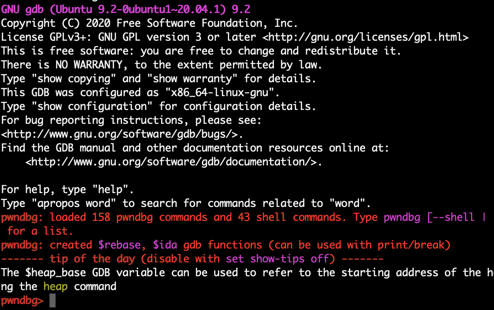

## GDB插件的配置

Time: 2022.10.25  
Tags: 逆向分析  

### 0x00 前言
GDB 是 Linux 下最常用的调试工具，但是其默认用户体验很差，在一般情况下我们都会使用插件来增强 GDB 的功能；如下：

* peda https://github.com/longld/peda
* gef https://github.com/hugsy/gef
* pwndbg https://github.com/pwndbg/pwndbg

这三个插件使用方式基本类似，都默认提供了：`寄存器 / 栈空间 / 执行代码段` 的展示；不过也有一些优劣：peda 能够更方便的搜索字符串，gef 能够更方便查看数据结构，pwndbg 针对 arm/mips 架构更稳定。

在实际使用过程中，不同需求可能要用到不同的插件，那么我们来搭建一个兼容多插件的 GDB 环境。

测试环境
```
Ubuntu 20.04 x64
```

### 0x01 插件安装
我们先单独安装各个插件。

**1.peda**  
```
cd /home/ubuntu/
git clone https://github.com/longld/peda.git ~/peda

echo "source ~/peda/peda.py" > ~/.gdbinit
```

<div align="center">

</br>[peda插件运行示意]
</div>

**2.gef**  
```
cd /home/ubuntu/
wget -q https://github.com/hugsy/gef/raw/master/gef.py -O ~/gdbinit-gef.py

echo "source ~/gdbinit-gef.py" > ~/.gdbinit
```

<div align="center">

</br>[gef插件运行示意]
</div>

**3.pwndbg**  
```
cd /home/ubuntu/
git clone https://github.com/pwndbg/pwndbg
cd pwndbg
./setup.sh

echo "source ~/pwndbg/gdbinit.py" > ~/.gdbinit
```

<div align="center">

</br>[pwndbg插件运行示意]
</div>

### 0x02 按参数加载
`gdbinit` 文件提供定义命令的功能，我们可以在其中定义命令，在使用 GDB 时指定命令，实现按需加载插件。

GDB Scripting Syntax
```
define <command>
    <code>
end
document <command>
    <information about the command>
end
```

按照如上语法，我们将插件编写命令到 `.gdbinit` 如下：
```
define init-peda
source /home/ubuntu/peda/peda.py
end
document init-peda
Initializes the PEDA (Python Exploit Development Assistant for GDB) framework
end

define init-pwndbg
source /home/ubuntu/pwndbg/gdbinit.py
end
document init-pwndbg
Initializes PwnDBG
end

define init-gef
source /home/ubuntu/gdbinit-gef.py
end
document init-gef
Initializes GEF (GDB Enhanced Features)
end
```

使用 `gdb -ex [command]` 可以设置命令启动，如下：
<div align="center">

</br>[按参数加载插件]
</div>

## 0x03 References
<https://infosecwriteups.com/pwndbg-gef-peda-one-for-all-and-all-for-one-714d71bf36b8>  
<https://github.com/pwndbg/pwndbg>  
<https://github.com/longld/peda>  
<https://github.com/hugsy/gef>  
<https://www.cse.unsw.edu.au/~learn/debugging/modules/gdb_init_file/>  