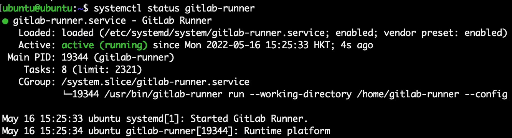
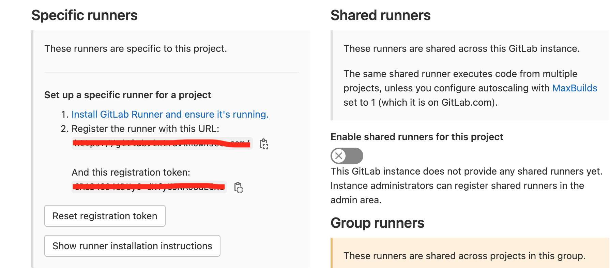
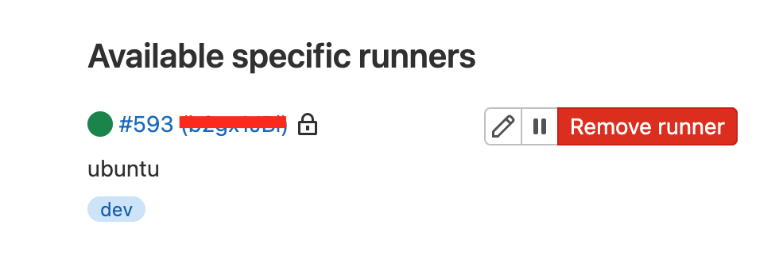
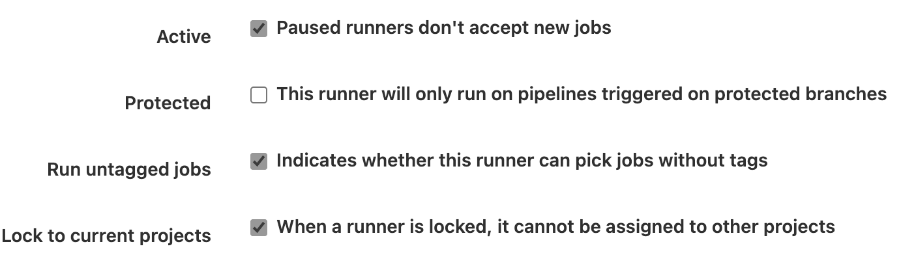
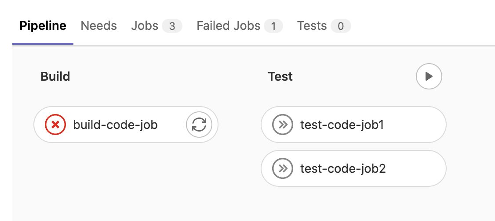
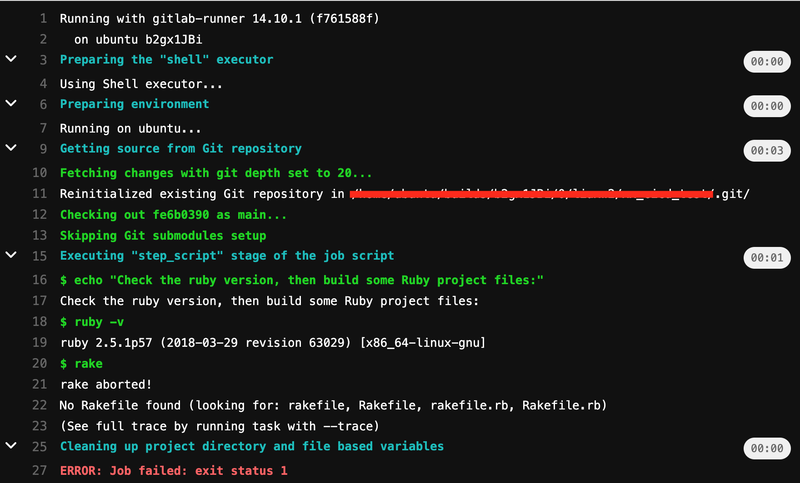
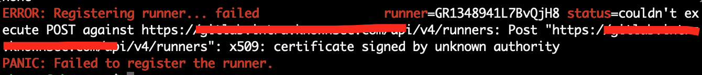
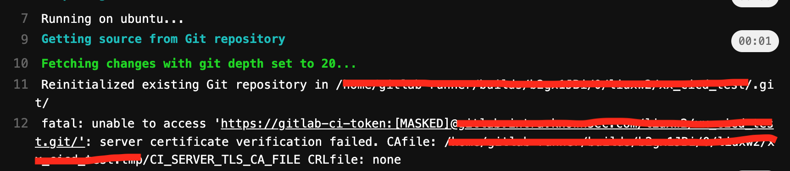

## Gitlab-CICD配置以及自签证书的问题

Time: 2022.05.19  
Tags: 开发,运维  

### 0x00 前言
Gitlab CI/CD 指得是 Gitlab 提供的一套基于 Gitlab 的持续集成、持续交付、持续部署的系统，开发人员可以通过 CI/CD 自动化构建、测试和部署应用。

* 持续集成(Continuous Integration): 对代码变更进行自动化的构建和测试
* 持续交付(Continuous Delivery): 对代码变更进行自动化的构建和测试，以及手动部署应用
* 持续部署(Continuous Deployment): 对代码变更进行自动化的构建和测试，并自动部署应用

最近有个项目迭代，所以使用 CI/CD 来将不断更新代码进行部署，但由于自签证书的 gitlab 导致配置 CI/CD 过程遇到了很多问题；这里记录了 CI/CD 的配置过程以及自签证书引发的一些问题。

测试环境
```
Gitlab 14.10.0
gitlab-runner 14.10.1 (on Ubuntu18.04)
```

### 0x01 gitlab-runner安装配置
根据 Gitlab 官方文档 <https://docs.gitlab.com/runner/install/linux-manually.html> 安装 gitlab-runner；gitlab-runner 相当于一个 gitlab 的执行客户端，当 gitlab 仓库代码发生变动后，将通知到 gitlab-runner，然后启动我们需要执行的脚本。

我这里直接下载 `gitlab-runner_amd64.deb`，然后 `dpkg -i gitlab-runner_amd64.deb` 安装即可，安装完成后可以通过 `systemctl status gitlab-runner` 查看运行状态：
<div align="center">

</br>[1.gitlab-runner服务状态]
</div>

现在来配置 gitlab-runner，首先我们在 gitlab-web 上找到 `Token`，在项目中的 `Setting-CI/CD-Runners` 下，这里有共享和特定两种类型，这里我们使用特定型就可以：

<div align="center">

</br>[2.gitlab-web runner token]
</div>

使用 `gitlab-runner register` 初始化配置：
```
$ sudo gitlab-runner register --tls-ca-file gitlab.intra.knownsec.com.pem 
Runtime platform                                    arch=amd64 os=linux pid=19468 revision=f761588f version=14.10.1
Running in system-mode.                            
                                                   
Enter the GitLab instance URL (for example, https://gitlab.com/):
https://gitlab.xxxx.com/
Enter the registration token:
xxxxxxxxxxxxxxxxxxxxxxxxx
Enter a description for the runner:
[ubuntu]: ubuntu
Enter tags for the runner (comma-separated):
test
Enter optional maintenance note for the runner:
none
Registering runner... succeeded                     runner=GR1348941L7BvQjH8
Enter an executor: custom, docker-ssh, shell, docker-ssh+machine, kubernetes, docker, parallels, ssh, virtualbox, docker+machine:
shell
Runner registered successfully. Feel free to start it, but if it's running already the config should be automatically reloaded! 
```

需要注意其中 tags 相当于该 gitlab-runner 的名称，在使用时可以按名称选择不同的 runner；另外 gitlab-runner 提供多种执行方式，最常用的是：`docker / shell`，这里选择的是 shell。

常用的执行器：
```
docker: 需要预装 docker，所有脚本都在 docker 中执行，按 docker 的方式进行构建
shell: 直接在主机上执行脚本，有一定的安全隐患，但可以避免 docker in docker 的问题
```

随后在 gitlab-web 上就可以看到我们注册的这个 runner：

<div align="center">

</br>[3.成功注册的runner]
</div>

点击编辑按钮可以配置 runner，默认情况下只有 tag 的 git 提交才会触发 runner 执行，这里我们勾选下 `Run untagged jobs`，这样每次 push 代码都可以触发：

<div align="center">

</br>[4.runner配置为非tag也执行]
</div>

### 0x02 gitlab-ci.yml文件
我们在上一步配置好了执行客户端，现在来写需要执行的脚本，gitlab CI/CD 需要在项目根目录创建 `.gitlab-ci.yml` 文件，gitlab-runner 将安装该配置文件进行执行。

`gitlab-ci.yml` 的详细语法可以参考：<https://docs.gitlab.com/ee/ci/yaml/gitlab_ci_yaml.html>，官方 demo 如下：
```
stages:
  - build
  - test

build-code-job:
  stage: build
  script:
    - echo "Check the ruby version, then build some Ruby project files:"
    - ruby -v
    - rake

test-code-job1:
  stage: test
  script:
    - echo "If the files are built successfully, test some files with one command:"
    - rake test1

test-code-job2:
  stage: test
  script:
    - echo "If the files are built successfully, test other files with a different command:"
    - rake test2
```

我们在项目中添加文件并 push 到 gitlab 仓库中，可以看到触发 runner 的执行流程：

<div align="center">

</br>[5.pipeline执行流程]
</div>

以及详细的执行情况：

<div align="center">

</br>[6.pipeline-job详细执行情况]
</div>

CI/CD 完整的配置流程就打通了，后续按需编写 `gitlab-ci.yml` 即可。

### 0x03 自签证书gitlab
由于我这里的 gitlab 服务器使用的自签证书，在配置 CI/CD 的过程中还遇到了不少问题。

首先是 `gitlab-runner register` 必须设置 pem 证书：

<div align="center">

</br>[7.注册时未设置自签证书]
</div>

pem 证书可以通过浏览器访问 gitlab 然后到处证书，一般为 cer 格式，需要转换为 pem 格式：
```
openssl x509 -inform der -in [x.cer] -out [x.pem]
```

然后使用如下命令即可：
```
gitlab-runner register --tls-ca-file [path]
```

这里需要额外注意，pem 证书尽量使用绝对路径，在注册完成后查看 `/etc/gitlab-runner/config.toml` 文件中的 `tls-ca-file` 的值，使用的就是我们填入的值。

如果使用的是相对路径，那么换个目录执行 `gitlab-runner run` 就会报错，以及 `gitlab-runner` 服务也会报同样的错误，因为无法找到这个 pem 证书文件。而此时在 gitlab-web 上是无法获取到错误的，CI/CD 将一只处理 `pending` 状态并显示：
```
this job has not started yet this job is in pending state and is waiting to be picked by a runner
```

但是即便我们将 pem 证书设置为绝对路径，`gitlab-runner` 也可能无法正常运行(可能和操作系统 ca 相关的库有关系)，此时 `gitlab-runner` 可以正确拉取到任务，但执行时报错：

<div align="center">

</br>[8.runner服务拉取仓库错误]
</div>

看错误信息是 git 在拉取项目时出现的证书错误，该文件夹内容是 gitlan-runner 执行任务时创建，`CI_SERVER_TLS_CA_FILE` 原则上就是
我们设置的 pem 证书，但执行时却没有复制过来，导致运行失败。

这里取消 git 的证书验证可以解决该问题：

```
export GIT_SSL_NO_VERIFY=1
[OR]
git config --global http.sslVerify false
```


### 0x0x References
https://docs.gitlab.com/runner/  
https://docs.gitlab.com/ee/ci/  
https://docs.gitlab.com/ee/ci/yaml/gitlab_ci_yaml.html  
https://docs.gitlab.com/runner/install/linux-manually.html  
https://blog.51cto.com/u_15127518/2685369  
https://forum.gitlab.com/t/gitlab-runner-server-certificate-verification-failed/59450/4