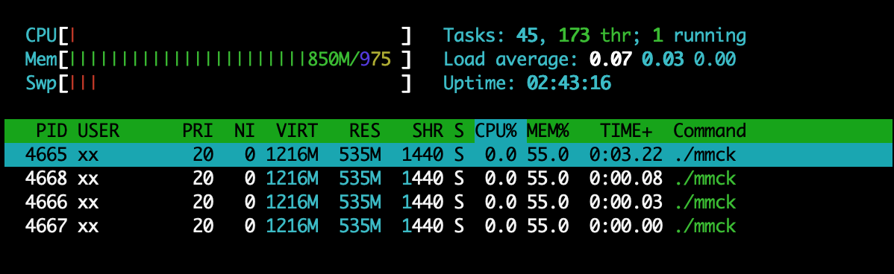
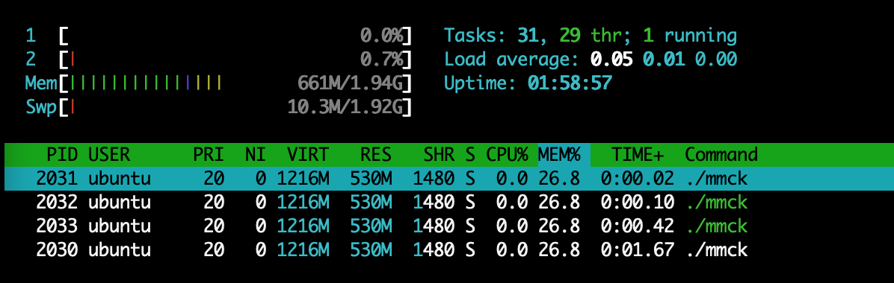
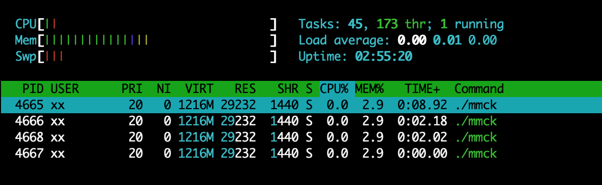
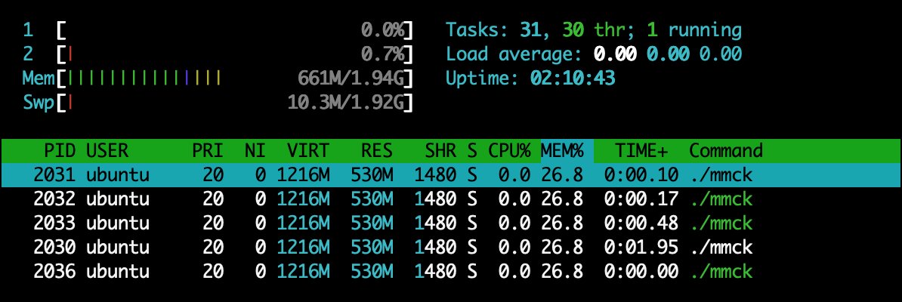
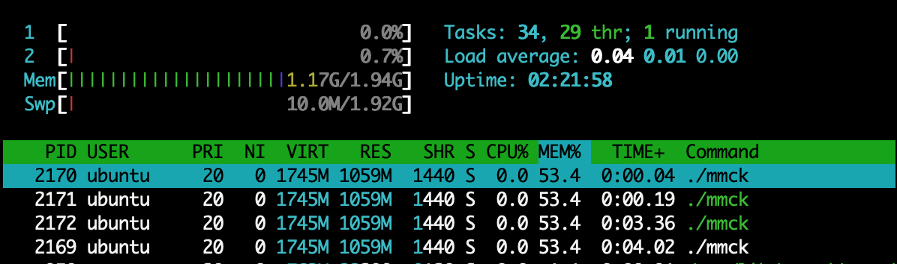
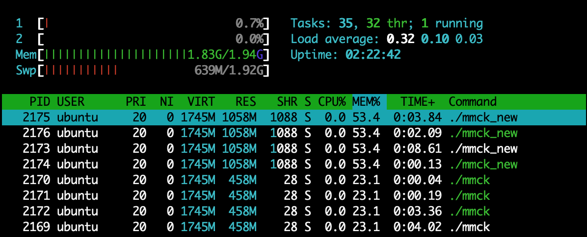

## Golang-GC机制引起的内存占用

Time: 2020.07.23  
Tags: 开发  
PublicFiles: memorycheck.go  

### 0x00 前言
最近在调试一个用 golang 写的服务程序，发现存在较高的内存占用，起初以为是内存泄漏所引起的，逐步调试才发现是由于 golang 的垃圾回收机制和操作系统处理机制造成的。

本文仅以测试和数据为准，不进行深入的跟踪和分析，对这个事件进行简要的记录。

### 0x01 事件
在我们的实际场景下，每个服务程序可最大启动 32 个协程，服务程序被打包在 docker 镜像中，调度可以根据任务新增容器提高并发。

(linux4.15)在正常运行中，每个协程所消耗的内存都比较大(10M-200M不等)，当任务较多时，并且单个任务消耗内存较大时，通过协程数量和容器数量内存消耗就会倍数放大，然后出现内存峰值，但这个内存峰值并不会下降。

在这个情况下，我们通过 `htop` 注意到该进程占用了大量内存，然后对这个情况进行跟进。

### 0x02 golang-GC
我们先来对比下 C 和 golang 的内存释放流程，(当然忽略了很多内存优化机制)；C 释放内存直接还给操作系统，golang 变量生命周期结束后，由 GC 进行收回，再归还给操作系统，如下：

	C：free => os
	golang: variable => GC => os

垃圾回收机制让程序员开发更加简单，不用关注内存细节，可以更加专注于业务逻辑，但同时垃圾回收是有一定的性能损失的；优秀的垃圾回收机制可以更好的处理内存申请和释放，同时占用更少的资源。

golang 的 GC 运行机制大致如下：

	1.周期性的对内存进行扫描
	2.本次释放的内存容量，决定下次释放内存的时机，大致为2倍
	3.超过 2min 未释放内存，强制执行一次GC
	4.释放的内存由 GC 择机归还给操作系统

### 0x03 测试环境
测试环境如下，linux4.4 和 4.5 以上有差异，我们需要对比测试：

	Golang 1.14.2
	Ubuntu 16.04 (linux4.4)
	Ubuntu 20.04 (linux5.4)

>linux4.5 以上、macos、windows 提供了一种 `MADV_FREE` 的内存管理机制，golang1.12对其进行了支持；大致意思是当操作系统有足够的空闲内存，应用程序释放内存后并不直接归还给操作系统，当空闲内存紧缺时再由操作系统收回 <https://man7.org/linux/man-pages/man2/madvise.2.html>。

测试程序：

	package main

	import (
	    "fmt"
	    "time"
	)

	func test(i int) {
	    b := make([]byte, 1024 * 1024 * 256)  // 256M
	    fmt.Println("count", i)
	    b[100] = '1'
	    fmt.Println("out", i)
	}

	func main() {
	    var pause string = ""
	    fmt.Scanln(&pause)
	    fmt.Println("[start]")

	    for i := 0; i < 10; i++ {
	        test(i)
	        time.Sleep(1 * time.Second)
	    }

	    for i := 1; i <= 10; i++ {
			time.Sleep(1 * time.Minute)
			fmt.Printf("%d minutes has passed\n", i)
		}

	    fmt.Println("[end]")
	    fmt.Scanln(&pause)
	}

### 0x04 GC和MADV_FREE的内存占用
将测试程序使用 `golang1.14.2` 编译后，分别在 `ubuntu16.04` 和 `ubuntu20.04` 上使用如下命令运行(可观测 GC 运行情况)：

	GODEBUG=gctrace=1 ./mmck

**1.10次申请**  
在程序调用完 10 次 `test()` 函数后，此刻使用 `htop` 观察内存占用如下：

 [10次申请后ubuntu16.04内存占用]

 [10次申请后ubuntu20.04内存占用]

此时，由于内存峰值的原因，GC 的下一次释放内存阈值大致位于 500M 左右。

	gc 10 @56.573s 0%: 0.010+0.090+0.002 ms clock, 0.010+0.087/0/0+0.002 ms cpu, 512->512->256 MB, 513 MB goal, 1 P

**2.10min**  
随后，由于程序没有开销，将会触发每 2 分钟一次的周期 GC，可以观察到 `ubuntu16.04` 内存占用逐渐降低，最后基本和初始状态相差不大；我们观察 10min 后的内存占用情况：

 [10min后ubuntu16.04内存占用]

 [10min后ubuntu20.04内存占用]

### 0x05 MADV_FREE测试
在 `ubuntu20.04` 上我们可以通过如下方式(<https://github.com/golang/go/issues/23687>)：
	
	GODEBUG=madvdontneed=1

来关闭 `MADV_FREE` 内存管理机制，使用默认的 `MADV_DONTNEED`；再通过如上方式进行测试，可以观察到内存占用和如上 `ubuntu16.04` 的情况一样了。

在 `MADV_FREE` 的情况下，应用程序占用了大量内存，其他程序是否可以正常使用呢？

>由于测试环境 `ubuntu20.04` 分配了 2G 内存，这里将测试代码分配的内存增加到 512M 来进行测试 `b := make([]byte, 1024 * 1024 * 512)  // 512M`

在 `ubuntu20.04` 下运行测试程序，待 10 次内存申请分配执行完后，内存占用如下：

	GODEBUG=gctrace=1 ./mmck

 [ubuntu20.04内存占用(512M)]

然后我们修改 `mmck => mmck_new`，再次运行测试程序，观察内存占用情况：

	GODEBUG=gctrace=1 ./mmck_new

 [ubuntu20.04内存占用(512Mx2)]

### 0x06 总结
`MADV_FREE` 的机制的引入无疑是提高了应用程序的性能，虽然在某些情况下可能影响性能分析，但也不能因噎废食使用 `GODEBUG=madvdontneed=1`。

在程序开发时，可以优化内存峰值问题，本质可以使程序更加稳定；在 golang 这还可以减少 GC 负担，同时减少“内存占用”。

由于 golang GC 的阈值机制，在某些场合下可以调用 `runtime.GC()` 以手工触发一次 GC，可以有效减低内存峰值。

### 0x07 References
<https://man7.org/linux/man-pages/man2/madvise.2.html>  
<https://github.com/golang/go/issues/23687>  
<https://ms2008.github.io/2019/06/30/golang-madvfree/>  
<https://colobu.com/2019/08/28/go-memory-leak-i-dont-think-so/>  
<https://github.com/golang/go/issues/37585>  
<https://github.com/golang/go/issues/22439>  
<https://groups.google.com/forum/#!topic/golang-nuts/0WSOKnHGBZE/discussion>  
<https://pengrl.com/p/20033/>  