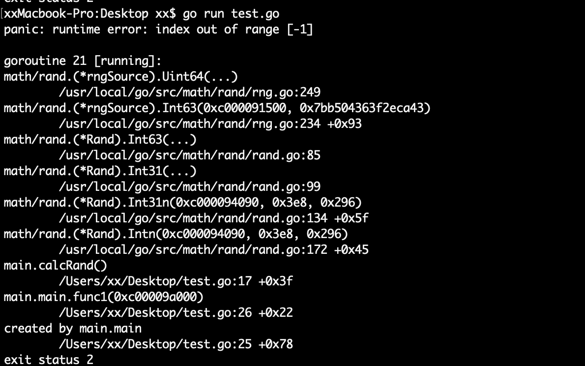
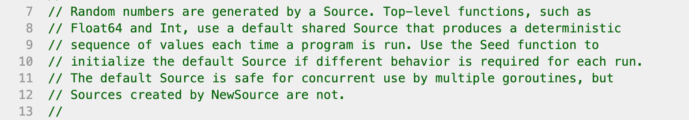
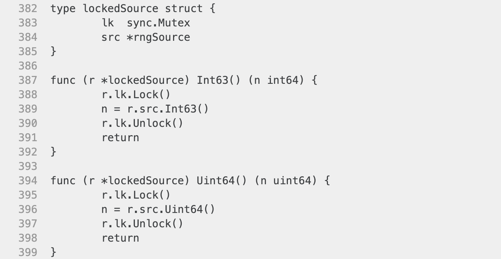

## Golang-rand并发使用引发的panic

Time: 2020.08.10  
Tags: 开发  

### 0x00 前言

在项目中遇到 `math/rand` 库所引发的 panic，跟踪发现 `math/rand` 库中部分函数是并发不安全的，由于错误的使用函数而导致的。这里做个简要记录。

参考于 <https://text.baldanders.info/golang/pseudo-random-number-generator/>

### 0x01 poc

	package main

	import (
	    "math/rand"
	    "sync"
	    "time"
	)

	var randSource = NewRandSource()

	func NewRandSource() *rand.Rand {
	    return rand.New(rand.NewSource(time.Now().UnixNano()))
	}

	func calcRand() {
	    for i := 0; i < 10000; i++ {
	        //randSource.Intn(1000)
	        rand.Intn(1000)
	    }
	}

	func main() {
	    rand.Seed(time.Now().UnixNano())
	    wg := sync.WaitGroup{}
	    for i := 0; i < 1000; i++ {
	        wg.Add(1)
	        go func() {
	            calcRand()
	            wg.Done()
	        }()
	    }
	    wg.Wait()
	}

在一定概率下就会触发 panic，如下：

 [图1.rand触发panic]

### 0x02 bug
跟踪到 golang 源码内的注释<https://golang.org/src/math/rand/rand.go>，可以看到：

 [图2.rand源码注释说明]

使用了并发不安全的方式初始化 `Seed`，多个协程在获取随机数时进行竞争，最终导致 panic。

### 0x03 fix
实际上，golang 本身提供了并发安全的访问方式，其默认的 `rand` 对象就是并发安全的，在访问时使用了全局的锁进行限制，如下：

 [图3.并发安全的rand函数]

所以在我们使用时，使用默认 `rand` 对象即可，如下：

	rand.Seed(time.Now().UnixNano())
	rand.Intn(1000)

### 0x04 References
<https://text.baldanders.info/golang/pseudo-random-number-generator/>  
<https://www.felix021.com/blog/read.php?2205>  
<https://github.com/golang/go/issues/21393>  
<https://golang.org/pkg/math/rand/>  
<https://golang.org/src/math/rand/rand.go>  