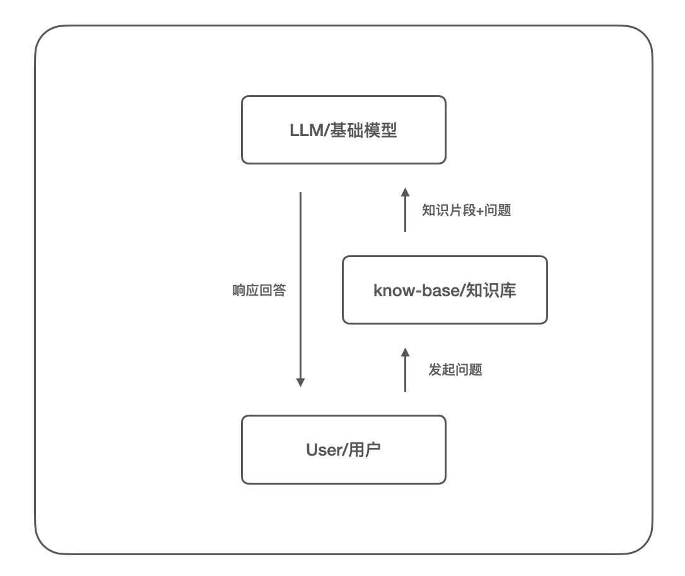
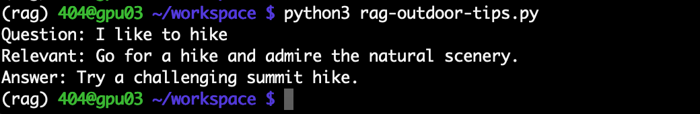
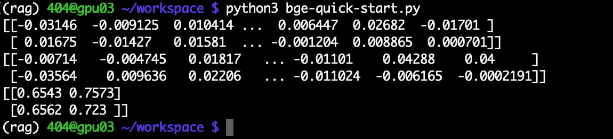
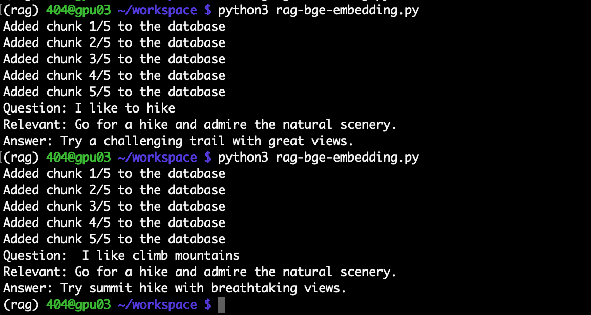
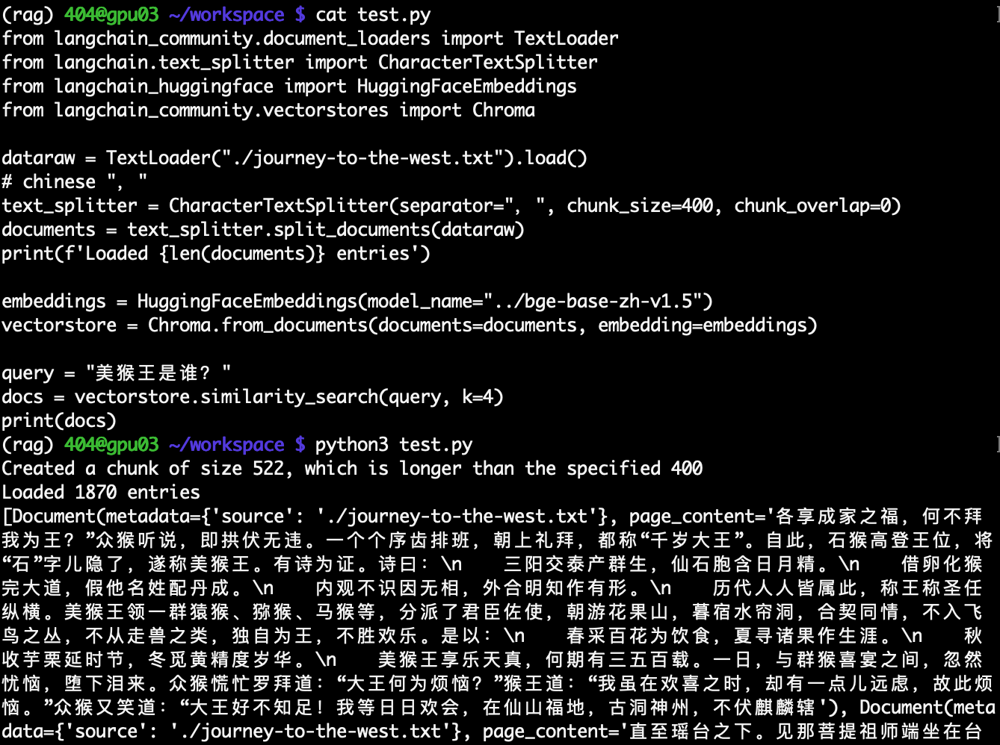
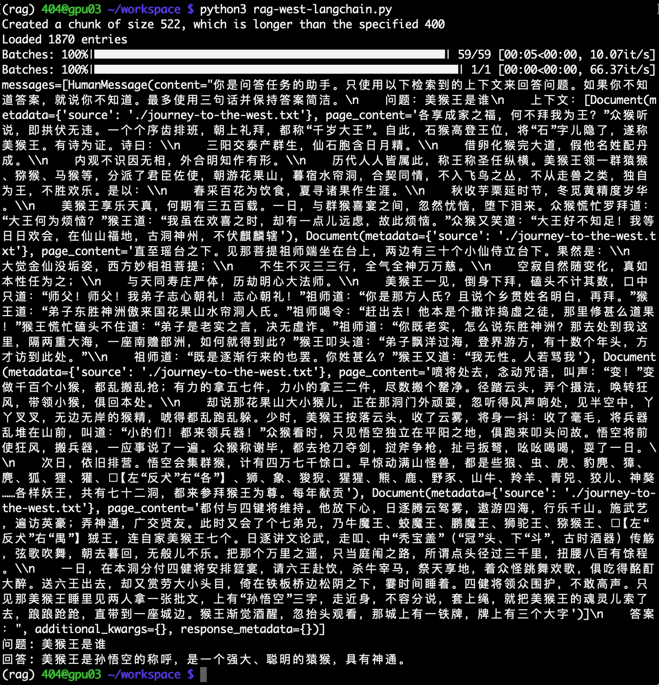
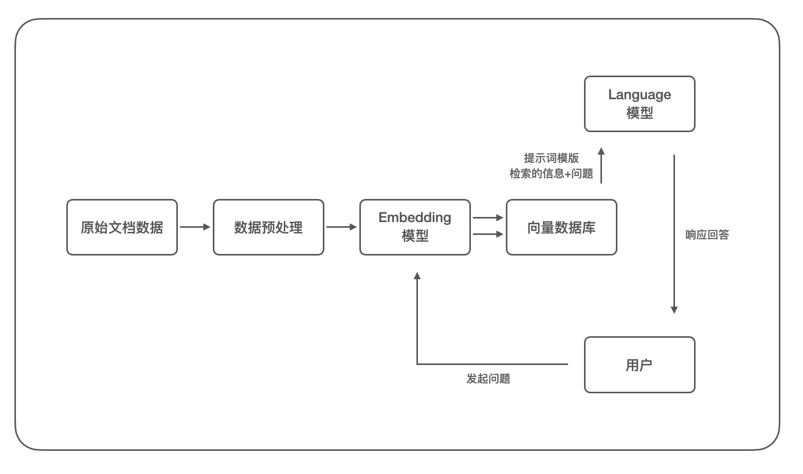

## LLM检索增强生成(RAG)的基本原理和实现

Tags: LLM  
Time: 2025.02.17


### 0x00 前言


随着 LLM (Large Language Model)技术的快速发展，智能聊天机器人和自然语言处理(NLP)领域也上升到了一个新的高度，计算机可以「理解」人类的书写和说话方式，并依靠模型内部的知识解答问题；伴随着 Meta AI 的研究人员提出的检索增强生成(RAG)技术，即不用训练就可以扩展模型的知识储备，为基于 LLM 构建定制化的知识库提供了可行的方案。

本文就检索增强生成技术的基本原理进行介绍，并使用代码演示 RAG 技术在构建知识库方面的应用实施。

本文实验环境：
```
Ubuntu 22.04 + 4090/24GB
Anaconda
Ollama 0.5.1
Llama-3.1-8B-Instruct (language model)
bge-large-en-v1.5 (embedding model)
bge-large-zh-v1.5 (embedding model)
```

### 0x01 RAG的原理
在引入检索增强生成技术前，我们来看看使用 LLM 基础模型来搭建知识库有哪些方案：
1. Fine-Tuning/微调，使用微调将知识库数据添加至模型的内部结构中
2. Prompt/提示词，使用提示次将知识库数据添加至模型的上下文中

首先 Fine-Tuning/微调 方案所面临的最大问题是训练成本过高，用户难以将其引入到实际使用场景下，而 Prompt/提示词 方案则需要考虑基础模型的上下文长度问题，目前多数模型支持 4k/8k/.../100k (token)等不同长度的上下文，超过上下文长度的历史数据将被模型「遗忘」，但在搭建知识库的场景中这样的上下文长度依然是远远不够的(100k 的上下文长度约等于支持 75k 的英语单词)。

在 Prompt/提示词 这个方案下，如果我们在接受到用户的问题后，首先从知识库中搜索于该问题相关的一些数据片段，再将这些数据和原始问题组合成提示词提交给大模型，大模型再基于数据和问题来生成回答，这样的流程我们就将其称之为「检索-增强-生成」即检索增强生成(Retrieval-Augmented Generation) 技术。

根据以上描述可以绘制 RAG 的流程图：
<div align="center">

</br>[1.LLM-RAG流程示意图]
</div>

根据 RAG 的特性，使用该技术构建知识库有几大优势：
1. 降低应用成本，不需要对基础模型进行训练，极大降低成本
2. 数据具备时效性，知识库可以随时修改并应用生效
3. 有效避免模型"幻觉"，使用确切的数据片段供模型生成回答，有效减少模型编造数据
4. 增加回答的可理解性，可以清晰追溯回答的内容来源于哪些知识库文档

### 0x02 最小实现示例
现在我们沿着上文思路，基于 Llama-3.1-8B-Instruct 实现一个 RAG 的最小可行性验证，我们准备了一些关于户外活动的建议作为知识库数据，如下：
```
"Take a leisurely walk in the park and enjoy the fresh air.",
"Visit a local museum and discover something new.",
"Attend a live music concert and feel the rhythm.",
"Go for a hike and admire the natural scenery.",
"Visit an amusement park and ride the roller coasters."
```

>Llama-3.1-8B-Instruct 支持 128k 的上下文长度，当然可以将以上知识库数据全部放入 prompt 中，我们这里仅仅为了 RAG 的演示。

用户的问题和知识库数据，我们采用最简单的单词匹配的方式，如下：
```
query = ["I", "like", "to", "hike"]
doc = ['Go', 'for', 'a', 'hike', 'and', 'admire', 'the', 'natural', 'scenery.']

matched => ["hike"]
```

通过以上函数匹配到知识库片段，我们再将其和用户问题组装至提示词中，模版如下：
```
You are a bot that makes recommendations for activities. You answer in very short sentences and do not include extra information.
This is the recommended activity: {relevant_document}
The user input is: {user_input}
Compile a recommendation to the user based on the recommended activity and the user input.
```

使用 Ollama 的 API 调用 Llama-3.1-8B-Instruct 模型，完整代码 [rag-outdoor-tips.py](./rag-outdoor-tips.py) 如下：
```
import requests
import json

DOCUMENTS = [
    "Take a leisurely walk in the park and enjoy the fresh air.",
    "Visit a local museum and discover something new.",
    "Attend a live music concert and feel the rhythm.",
    "Go for a hike and admire the natural scenery.",
    "Visit an amusement park and ride the roller coasters."
]

def get_similarity(query, documents):
    query_words = query.split()
    similarities = []
    for doc in documents:
        value = 0
        for w in query_words:
            if w in doc:
                value = value + 1
        similarities.append(value)
    # end for
    return documents[similarities.index(max(similarities))]
# end get_similarity

user_input = "I like to hike"
relevant_document = get_similarity(user_input, DOCUMENTS)

print("Question:", user_input)
print("Relevant:", relevant_document)

prompt = """
You are a bot that makes recommendations for activities. You answer in very short sentences and do not include extra information.
This is the recommended activity: {relevant_document}
The user input is: {user_input}
Compile a recommendation to the user based on the recommended activity and the user input.
"""

url = 'http://localhost:11434/api/generate'
data = {
    "model": "llama3.1:8b",
    "prompt": prompt.format(user_input=user_input, relevant_document=relevant_document),
    "stream": False,
}
headers = {'Content-Type': 'application/json'}
response = requests.post(url, data=json.dumps(data), headers=headers)

print("Answer:", response.json()['response'])
```

使用用户问题「I like to hike」，运行如下：
<div align="center">

</br>[2.户外活动建议RAG的运行演示]
</div>

至此我们实现了 RAG 的最小可行性验证，我们提供的知识库可以良好的和 Llama-3.1-8B-Instruct 模型配合工作。

但是如果用户的问题是「I like climb mountains」，这属于「hike」的同义词，但在我们构建的 RAG 中却无法匹配到对应的内容，这不符合预期；所以这就需要我们从语义上来对知识库进行搜索匹配了，通过使用词嵌入模型来实现。

### 0x03 Embedding模型
词嵌入(Word embedding)模型是自然语言处理（NLP）中语言模型与表征学习技术的统称，它可以将高维度的数据转化为低维度的嵌入空间，并通过学习将相似的数据点映射到嵌入空间中相近的位置，从而捕捉特征和语义信息，并提高模型的效率和准确性。如果两个单词在向量空间中具有相似的位置，通常意味着这两个单词具有相似的含义和语义，词嵌入模型在 RAG 技术中发挥着至关重要的作用。

BGE (BAAI General Embedding)模型是由北京智源人工智能研究院(BAAI)推出的一系列开源 embedding 模型；其中 bge-large-en-v1.5 和 bge-large-zh-v1.5 在分别在英文和中文环境下具有良好的表现，同时这两个模型较小，具有广泛的适用性。

这里我们尝试使用 bge-large-en-v1.5 模型，分别下载模型权重文件和官方代码库：
```
# download model from huggingface
$ huggingface-cli download BAAI/bge-base-en-v1.5 --local-dir ./bge-base-zh-v1.5
# download source from github
$ git clone https://github.com/FlagOpen/FlagEmbedding.git
```

使用官方示例测试向量化和相似度计算，[bge-quick-start.py](./bge-quick-start.py)代码如下：
```
from FlagEmbedding import FlagAutoModel

import os
os.environ["CUDA_VISIBLE_DEVICES"] = "0"
os.environ['TRANSFORMERS_NO_ADVISORY_WARNINGS'] = 'true'

def main():
    model = FlagAutoModel.from_finetuned('./bge-base-en-v1.5',
                                          query_instruction_for_retrieval="Represent this sentence for searching relevant passages:",
                                          use_fp16=True)

    sentences_1 = ["I love NLP", "I love machine learning"]
    sentences_2 = ["I love BGE", "I love text retrieval"]
    embeddings_1 = model.encode(sentences_1)
    embeddings_2 = model.encode(sentences_2)

    print(embeddings_1)
    print(embeddings_2)
    
    similarity = embeddings_1 @ embeddings_2.T
    print(similarity)
# end main()
    
if __name__ == "__main__":
    main()
# end __main__()
```

运行该测试代码如下：
<div align="center">

</br>[3.bge测试代码运行示例]
</div>

我们可以看到 `I love NLP` 语句被向量化为了 `[-0.03146  -0.009125  0.010414 ...  0.006447  0.02682  -0.01701 ]`，而通过相似性计算，可以看到 `I love NLP` 和 `I love BGE` 的相似度为 `0.6543`，其他同理。

现在我们将 embedding 应用到上文的户外活动建议的 RAG 技术中，我们需要将单词匹配的逻辑修改为使用 bge-large-en-v1.5 embedding 模型计算相似度，重写 `get_similarity()` 函数如下：
```
def get_similarity(question, documents):
    model = FlagAutoModel.from_finetuned('./bge-base-en-v1.5',
                                          query_instruction_for_retrieval="Represent this sentence for searching relevant passages:",
                                          use_fp16=True)
    # calculate data embedding vector
    VECTOR_DB = []
    for i, chunk in enumerate(documents):
        embedding = model.encode(chunk)
        VECTOR_DB.append((chunk, embedding))
        print(f'Added chunk {i+1}/{len(documents)} to the database')
    # end for

    # calculate query embedding vector
    query = model.encode(question)

    similarities = []
    for chunk, embedding in VECTOR_DB:
        similarity = query @ embedding
        similarities.append((chunk, similarity))
    # end for

    similarities.sort(key=lambda x: x[1], reverse=True)
    return similarities[0][0]
# end get_similarity()
```

完整代码参考 [rag-bge-embedding.py](./rag-bge-embedding.py)，分别测试用户问题「I like to hike」和「I like climb mountains」如下：
<div align="center">

</br>[4.bge-embedding的RAG运行示例]
</div>

我们这里使用 bge-large-en-v1.5 模型和 Llama-3.1-8B-Instruct 模型构建了基础的 RAG 系统框架，其中 bge-large-en-v1.5 作为 embedding 模型对知识库数据和用户提问进行了向量化处理，并按照相似度从知识库中检索相关内容，Llama-3.1-8B-Instruct 作为语言模型，配合提示词、知识库检索的内容和用户问题生成回答内容。

### 0x04 langchain实践
根据上文的 RAG 构建方法，我们这里尝试使用西游记小说作为知识库，以 bge-large-zh-v1.5 作为 embedding 模型(中文)，来增强 Llama-3.1-8B-Instruct 语言模型对西游记故事的处理能力，同时我们这里使用 langchain 框架来提高开发效率。

首先我们需要根据模型的上下文长度选择合适的数据切片大小；其中 bge-large-zh-v1.5 模型的上下文长度为 512，Llama-3.1-8B-Instruct 上下文长度为 128k，而每个汉字约等于 1 个 token，在每轮检索中我们计划使用最相关的前 4 个知识片段；而西游记小说 [journey-to-the-west.txt](./journey-to-the-west.txt) 全文大约 60 万个汉字，所以我们这里应该将其分割为不超过 512 个汉字的片段；这里选择 400 作为长度限制，分隔符号使用中文逗号，编写代码如下：
```
dataraw = TextLoader("./journey-to-the-west.txt").load()
# chinese "，"
text_splitter = CharacterTextSplitter(separator="，", chunk_size=400, chunk_overlap=0)
documents = text_splitter.split_documents(dataraw)
print(f'Loaded {len(documents)} entries')
```

其次我们还需要使用向量数据库以帮助我们存储知识库的向量数据，以及快速的从数据库中检索相似数据，这里我们选用 `chromadb`：
```
embeddings = HuggingFaceEmbeddings(model_name="../bge-base-zh-v1.5")
vectorstore = Chroma.from_documents(documents=documents, embedding=embeddings)
```

测试运行 embedding 模型部分如下，可以看到数据片段按预期检索出来了：
<div align="center">

</br>[5.bge模型测试检索问题]
</div>

随后我们使用如下提示词模版组合上下文信息和用户问题：
```
你是问答任务的助手。只使用以下检索到的上下文来回答问题。如果你不知道答案，就说你不知道。最多使用三句话并保持答案简洁。
    问题：{question}
    上下文：{context}
    答案：
```

编写完整代码 [rag-west-langchain.py](./rag-west-langchain.py) 如下：
```
from langchain_community.document_loaders import TextLoader
from langchain.text_splitter import CharacterTextSplitter
from langchain_huggingface import HuggingFaceEmbeddings
from langchain_community.vectorstores import Chroma
from langchain_core.prompts import ChatPromptTemplate
from langchain_ollama import ChatOllama
from langchain_core.runnables import RunnablePassthrough
from langchain_core.output_parsers import StrOutputParser

dataraw = TextLoader("./journey-to-the-west.txt").load()
# chinese "，"
text_splitter = CharacterTextSplitter(separator="，", chunk_size=400, chunk_overlap=0)
documents = text_splitter.split_documents(dataraw)
print(f'Loaded {len(documents)} entries')

embeddings = HuggingFaceEmbeddings(model_name="./bge-base-zh-v1.5", show_progress=True)
#client = chromadb.PersistentClient(path=filepath+".sqlite3")
vectorstore = Chroma.from_documents(documents=documents, embedding=embeddings)

retriever = vectorstore.as_retriever()

from langchain_core.runnables import RunnableLambda
def inspect(state):
    print(state)
    return state
# end inspect

template = """你是问答任务的助手。只使用以下检索到的上下文来回答问题。如果你不知道答案，就说你不知道。最多使用三句话并保持答案简洁。
    问题：{question}
    上下文：{context}
    答案："""

prompt = ChatPromptTemplate.from_template(template)
llm = ChatOllama(model="llama3.1:8b")
rag_chain = (
        {"context": retriever, "question": RunnablePassthrough()}
        | prompt
        | RunnableLambda(inspect)
        | llm
        | StrOutputParser()
)

query = "美猴王是谁"
answer = rag_chain.invoke(query)
print(f"问题: {query}\n回答: {answer}")
```

>其中 `inspect()` 函数用于调试以帮助我们查看检索到的数据片段。

测试运行西游记知识库的 RAG 如下：
<div align="center">

</br>[6.西游记RAG的测试运行]
</div>

### 0x05 RAG总结
根据上文的实践，我们可以梳理更加完整的 RAG 流程图，其中添加了 embedding 模型和向量数据库如下：
<div align="center">

</br>[7.较为完整的LLM-RAG流程图]
</div>

根据该流程图我们清晰明确的去设计实施 RAG 系统的各个环节，而当我们搭建完成一个 RAG 系统后，还需要评估 RAG 系统的效果，通常可以在嵌入模型和语言模型这两个环节进行评估：
1. 嵌入模型环节评估：评估知识库片段和问题之间的准确度
2. 语言模型环节评估：根据最终回答评估 RAG 整体的质量，使用专家人工进行评估或使用其他模型进行自动化打分

搭建一个 RAG 系统是比较简单的工作，但要搭建一个好用的 RAG 系统将面临很多难点，从以上流程图可以按顺序思考：
1. 如何选择嵌入模型和语言模型？
2. 知识库中的数据类型？文档、代码、图片应该如何处理？
3. 知识库数据应该按多少长度进行分割？分割是否会影响原始语义？
4. 问题与知识库检索结果的相似度？以及截取结果的数量？
5. 如何取舍或融合知识库数据和语言模型原生数据？
6. 如何设计提示词模板以获得更好的回答？
7. 等等

进一步的深入学习，推荐阅读 404 同事 @Hcamael 的文章 [从零开始搭建本地安全 AI 大模型攻防知识库](https://paper.seebug.org/3210/)。

### 0x06 References
检索增强生成：简化智能自然语言处理模型的创建: https://ai.meta.com/blog/retrieval-augmented-generation-streamlining-the-creation-of-intelligent-natural-language-processing-models/  
facebook/rag-token-nq: https://huggingface.co/facebook/rag-token-nq  
Retrieval-Augmented Generation for Knowledge-Intensive NLP Tasks: https://arxiv.org/pdf/2005.11401  
A beginner's guide to building a Retrieval Augmented Generation (RAG) application from scratch: https://learnbybuilding.ai/tutorials/rag-from-scratch  
MMTEB: Massive Multilingual Text Embedding Benchmark: https://huggingface.co/spaces/mteb/leaderboard  
FlagEmbedding: https://github.com/FlagOpen/FlagEmbedding  
从头开始编写一个简单的 RAG: https://huggingface.co/blog/ngxson/make-your-own-rag  
从零开始搭建本地安全 AI 大模型攻防知识库: https://paper.seebug.org/3210/  
从零开始构建一个基于大模型和 RAG 的知识库问答系统: https://blog.abyssdawn.com/archives/461.html  
从头开始构建检索增强生成 (RAG): https://medium.com/red-buffer/building-retrieval-augmented-generation-rag-from-scratch-74c1cd7ae2c0  
LangChain+RAG—构建知识库（一）: http://www.enmalvi.com/2024/06/05/langchain-rag-1/  
大模型应用之RAG技术学习: https://yzddmr6.com/posts/llm-rag/  
为什么 RAG 仍然重要：超越 LLM 中的 token 限制: https://medium.com/@InferenzTech/why-rag-still-matters-beyond-token-limits-in-llms-289d16a930af  