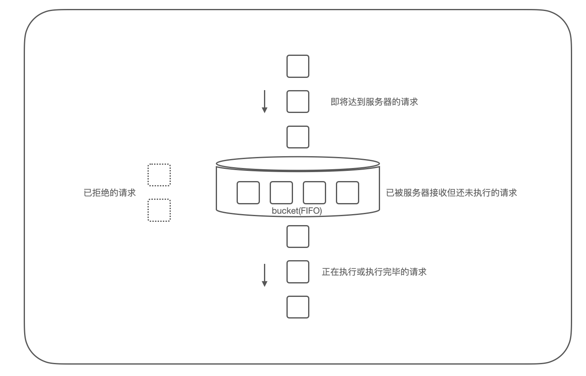

## Nginx配置限流策略

Time: 2022.06.06  
Tags: 运维  


### 0x00 前言

在业务系统中常常需要限流的配置以保证服务的可用性，并且保证大部分用户的体验。

比如在某时刻突发大量请求访问到系统，引发 CPU/带宽 负载过高，最终导致大量失败请求；比如某些爬虫服务的大量请求导致系统负载过高，而普通用户没法正常使用；又或者系统提供大文件下载，大量用户同时下载时导致带宽负载过高，最终影响整个系统的运行。

在基于 Nginx 做网关的业务系统中，可以通过 Nginx 的限流配置，提高系统的可用性；本文对此进行详细介绍。


### 0x01 搭建测试环境
首先配置 Nginx 环境，这里测试环境推荐使用源码编译，并搭配上第三方 Nginx echo 模块(https://github.com/openresty/echo-nginx-module)，便于调试。

```
$ wget 'https://github.com/openresty/echo-nginx-module/archive/refs/heads/master.zip'
$ unzip echo-nginx-module-master.zip

$ wget 'http://nginx.org/download/nginx-1.11.2.tar.gz'
$ tar -xzvf nginx-1.11.2.tar.gz
$ cd nginx-1.11.2/

# Here we assume you would install you nginx under /opt/nginx/.
$ ./configure --prefix=/opt/nginx \
     --add-module=/path/to/echo-nginx-module

$ make -j2
$ make install
```

>这里受 Nginx 版本或本地 GCC 的版本限制，编译可能会报错，我这里测试环境使用的是 nginx-1.15.8(http://nginx.org/en/download.html)

安装完成过后，我们添加在 `nginx.conf` 添加配置便于后续测试：
```
$ cd /opt/nginx
$ vim conf/nginx.conf
# 在 server 块下添加，当访问 /echo 路径时，系统延时两秒进行处理以模拟耗时操作，并返回请求 ip
location /echo {
    default_type text/plain;
    echo "$remote_addr";
    echo_sleep 2;
}
```

手动启动更加方便调试：

```
$ cd /opt/nginx
$ sudo ./sbin/nginx -g "daemon off;"

# another terminal
$ curl http://127.0.0.1
<!DOCTYPE html>
<html>
<head>
<title>Welcome to nginx!</title>
<style>
```

为了模拟用户并发请求，这里写了个简易的 Python 脚本[bench.py](./bench.py):
```
#/usr/bin/python3
#coding=utf-8

import requests
import sys
import time
import threading

THREAD_MAX = 10
BENCH_TIME = 30     # second

def worker(url, i):
    start = time.time()
    resp = requests.get(url)
    end = time.time()
    print("[%d] url=%s status_code=%d spend=%f" %(
            i, url, resp.status_code, end-start))
# end worker()

if __name__ == "__main__":
    if len(sys.argv) < 2:
        print("python3 bench.py [url]")
        exit()

    url = sys.argv[1]

    ts = []
    for i in range(0, THREAD_MAX):
        t = threading.Thread(target=worker, args=(url,i,))
        t.start()
        ts.append(t)
        time.sleep(0.01)
    # end for

    for t in ts:
        t.join()
    # end for
# end main()
```


### 0x02 请求限流
配置「请求限流」可以应对突发的大量请求，在 Nginx 中采用的是：漏桶算法(leaky bucket)，其原理大致如下：

<div align="center">

</br>[1.漏桶算法示意图]
</div>

如图所示，当大量请求达到服务器后，首先进入到缓冲区内(bucket)，这是一个先进先出(FIFO)的队列，在缓冲区内的请求按配置的速率进行放行，如一秒 10 个请求(10r/s)，Nginx 则会按每 100ms 放行一个请求的速度进行控制，放行的请求进行执行；在此过程中，如果缓冲区已满但还有请求进来，则直接拒绝该请求，默认返回 503 错误。

在 Nginx 中配置说明如下：
```
# 1.设置请求限流的共享内存空间
# key 表示请求来源的IP地址 (限流策略作用于IP地址上，不同地址不会相互影响)
# name:size 为共享内存空间命名并设置大小
# rate 设置请求限流速度
Syntax:	limit_req_zone key zone=name:size rate=rate [sync];
Default:	—
Context:	http

# 2.配置请求限流策略
# name 使用哪一个共享内存空间
# burst 最大突发请求数量(缓冲区大小)，默认为0
# nodelay/delay 缓冲区内的请求，不延迟执行/执行几个后再延迟执行
Syntax:	limit_req zone=name [burst=number] [nodelay | delay=number];
Default:	—
Context:	http, server, location
```

那么在我们的测试环境下，配置请求限流策略如下：
```
$ cd /opt/nginx
$ vim conf/nginx.conf
# http 块
# 以客户端地址(二进制)为key，名为 one 的 10MB 共享内存空间，设置速率为每秒处理1个请求
limit_req_zone $binary_remote_addr zone=one:10m rate=1r/s;
# 设置缓冲区大小为 5 个请求
limit_req zone=one burst=5;
```

使用测试脚本可以看到：
```
ubuntu@ubuntu:~/nginx$ python3 bench.py http://127.0.0.1/echo
[6] url=http://127.0.0.1/echo status_code=503 spend=0.006821
[7] url=http://127.0.0.1/echo status_code=503 spend=0.005325
[8] url=http://127.0.0.1/echo status_code=503 spend=0.005015
[9] url=http://127.0.0.1/echo status_code=503 spend=0.005436
[0] url=http://127.0.0.1/echo status_code=200 spend=2.014297
[1] url=http://127.0.0.1/echo status_code=200 spend=3.001579
[2] url=http://127.0.0.1/echo status_code=200 spend=3.989079
[3] url=http://127.0.0.1/echo status_code=200 spend=4.974513
[4] url=http://127.0.0.1/echo status_code=200 spend=5.963596
[5] url=http://127.0.0.1/echo status_code=200 spend=6.949078
```

第一个请求不需要等待，执行阶段花费了 2 秒，第二个请求，需要等待 1 秒才能得到执行，执行阶段花费了 2 秒，一共耗时 3 秒，后续请求类似；缓冲区大小设置为 5，所以一共有 6 个请求得到了执行。

我们还可以设置 `nodelay` 参数，表示当请求到达缓冲区后不进行等待，直接开始执行，但缓冲区大小的释放速度仍然按速率进行；而配置 `delay=2` 表示缓冲区内前两个请求立即执行，后续的请求延时执行。


### 0x03 并发限流
使用上一步的请求限流可以满足大部分场景，但当某些请求耗时过长或长链接请求，会导致并发数量较高，从而引发负载问题；这需要并发限流来进行控制。

在 Nginx 中配置说明如下：
```
# 1.设置并发限流的共享内存空间
# key 表示请求来源的IP地址 (限流策略作用于IP地址上，不同地址不会相互影响)
# name:size 为共享内存空间命名并设置大小
Syntax:	limit_conn_zone key zone=name:size;
Default:	—
Context:	http
# 2.配置并发限流策略
# zone 使用哪一个共享内存空间
# number 并发数量限制
Syntax:	limit_conn zone number;
Default:	—
Context:	http, server, location
```

那么在我们的测试环境下，配置并发限流策略如下(注意注释上一步的配置)：
```
$ cd /opt/nginx
$ vim conf/nginx.conf
# http 块
# 以客户端地址(二进制)为key，名为 addr 的 10MB 共享内存空间
limit_conn_zone $binary_remote_addr zone=addr:10m;
# 设置并发数量限制为 5
limit_conn addr 5;
```

使用测试脚本可以看到：
```
ubuntu@ubuntu:~/nginx$ python3 bench.py http://127.0.0.1/echo
[5] url=http://127.0.0.1/echo status_code=503 spend=0.007235
[6] url=http://127.0.0.1/echo status_code=503 spend=0.005227
[7] url=http://127.0.0.1/echo status_code=503 spend=0.005254
[8] url=http://127.0.0.1/echo status_code=503 spend=0.005260
[9] url=http://127.0.0.1/echo status_code=503 spend=0.005187
[1] url=http://127.0.0.1/echo status_code=200 spend=2.004727
[0] url=http://127.0.0.1/echo status_code=200 spend=2.017230
[2] url=http://127.0.0.1/echo status_code=200 spend=2.008670
[3] url=http://127.0.0.1/echo status_code=200 spend=2.004406
[4] url=http://127.0.0.1/echo status_code=200 spend=2.020513
```

前 5 个请求可以正常执行，后 5 个则被 Nginx 拒绝了。


### 0x04 带宽限流
当服务器提供文件下载服务，大量用户同时下载时容易引发带宽的负载问题，这里可以使用带宽限流的方式。

在 Nginx 中配置说明如下：
```
# 配置响应数据的带宽限制
Syntax:	limit_rate rate;
Default:	limit_rate 0;
Context:	http, server, location, if in location
# 配置当传输多少数据后，才开始进行带宽限流
Syntax:	limit_rate_after size;
Default:	
limit_rate_after 0;
Context:	http, server, location, if in location
```

那么在我们的测试环境下，配置带宽限流策略如下(注意注释上一步的配置)：
```
$ cd /opt/nginx
$ vim conf/nginx.conf
# http 块
limit_rate_after 500k;
limit_rate 10k;
```

我们测试如下：
```
# 首先在 html 目录下准备一个文件
cd /opt/nginx
dd if=/dev/urandom of=html/test bs=1M count=1

# 使用 curl 下载测试
ubuntu@ubuntu:~/nginx$ curl http://127.0.0.1/test -o test
  % Total    % Received % Xferd  Average Speed   Time    Time     Time  Current
                                 Dload  Upload   Total   Spent    Left  Speed
 63 1024k   63  652k    0     0  50354      0  0:00:20  0:00:13  0:00:07 12275^C
```

可以看到前 500kb 很快就下载了，然后就进入到了 10kb/s 的限速下载。


### 0x05 白名单
在配置请求限流和并发限流时，以客户端IP地址作为 key，这里我们可以为其设置白名单，使用 Nginx 提供的 geo 和 map 模块：
```
# geo
# (default $address is $remote_addr)
Syntax:	geo [$address] $variable { ... }
Default:	—
Context:	http

# map
Syntax:	map string $variable { ... }
Default:	—
Context:	http
```

这里按如下方式配置：
```
geo $whitelist {
        default 1;
        127.0.0.1 0;
    }
map $whitelist $limit_key {
    0 "";
    1 $binary_remote_addr;
}
limit_req_zone $limit_key zone=one:10m rate=1r/s;
limit_req zone=one burst=5;
```

然后我们在本机访问就不会被限流了。


### 0x05 Referenes
http://nginx.org/en/docs/http/ngx_http_limit_req_module.html
http://nginx.org/en/docs/http/ngx_http_limit_conn_module.html
http://nginx.org/en/docs/http/ngx_http_core_module.html#limit_rate
http://nginx.org/en/docs/http/ngx_http_geo_module.html
http://nginx.org/en/docs/http/ngx_http_map_module.html
https://github.com/openresty/echo-nginx-module
https://en.wikipedia.org/wiki/Leaky_bucket
https://zhaox.github.io/nginx/2019/09/05/explain-nginx-rate-limit
https://chenyongjun.vip/articles/81