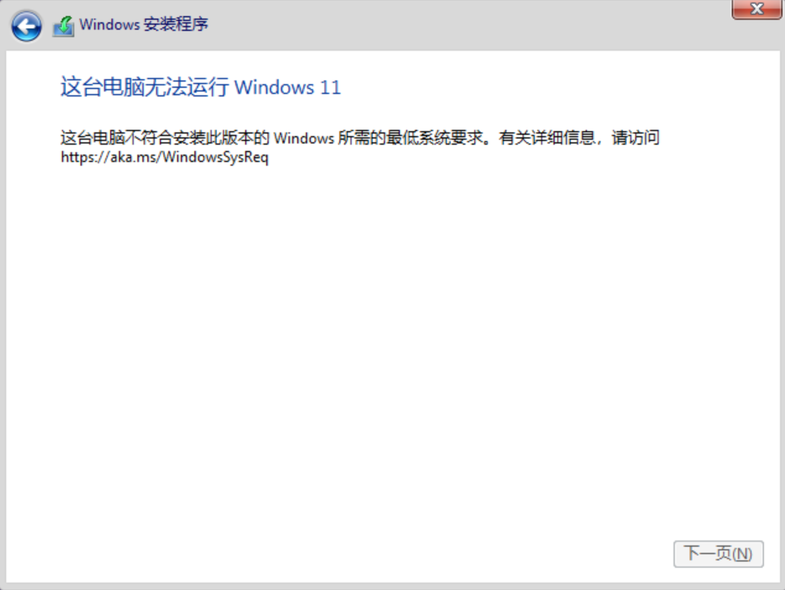

## PVE环境安装Windows11操作系统

Time: 2023.12.29  
Tags: 运维  

### 0x00 前言
最近日常工作中遇到一个 Windows11 操作系统的前置要求，由于安装 Windows11 操作系统需要硬件满足一定的要求，恰巧我日常工作环境又使用 ProxmoxVE 虚拟机，果不其然遇到了一些坑，本文对此进行简要记录。

本文实验环境：
```
ProxmoxVE 7.2-3
Windows11 22H2
```

### 0x01 win11硬件要求
Windows11 的硬件要求可以参考官网：https://www.microsoft.com/en-us/windows/windows-11-specifications?r=1，

简单列一下日常关注项如下：
* CPU 需大于等于 2 核
* 内存大于等于 4GB
* 磁盘空间大于等于 64GB
* 需要使用 UEFI 引导
* 需要 TPM 2.0 硬件支持

如果以上任意一项不满足，在 Windows11 的安装过程将报错提示如下：

<div align="center">

</br>[1.win11系统硬件要求]
</div>

### 0x02 配置和安装
我们按照 Windows11 的硬件要求，在 ProxmoxVE 配置并安装操作系统如下：

首先配置虚拟机的基本信息：
<div align="center">

</br>[2.win11系统硬件要求]
</div>

选择 Windows11 的 ISO 镜像，以及选择虚拟机的操作系统类型，PVE 将按照操作系统帮助我们进行配置预设：
<div align="center">

</br>[3.选择操作系统和镜像]
</div>

这里进行系统相关的配置，`machine` 需要选择 `q35`，`q35` 是比默认的 `i440fx` 更为先进的机器，能够支持 PCI 直通等功能，在这里为了更好的配合 OVMF(UEFI) 进行工作；当然 BIOS 需要选择 `OVMF(UEFI)`，TPM 需要勾选并且使用 `2.0` 版本，存储位置默认即可：
<div align="center">

</br>[4.系统配置]
</div>

磁盘空间选择大于 64GB 即可，接口类型选择 `IDE/STAT/SCSI` 都可以，`VirtIO` 则需要驱动才能进行使用：
<div align="center">

</br>[5.磁盘配置]
</div>

CPU 选择大于 2 核心，内存选择大于 4GB 即可：
<div align="center">

</br>[6.CPU配置]
</div>

<div align="center">

</br>[7.内存配置]
</div>

网络使用默认(`E1000`)即可：
<div align="center">

</br>[8.网络配置]
</div>

随后完成配置，开机启动，进入如下界面后按下任意键从 CD 引导 ISO 镜像：
<div align="center">

</br>[9.从CD引导ISO镜像]
</div>

随后即可正常进入 Windows11 的安装界面：
<div align="center">

</br>[10.进入win11安装界面]
</div>

### 0x03 手动引导ISO
但在实际操作过程中，往往都不如上文中这么顺利；受到操作系统类型(Linux/Windows)，操作系统的版本，ProxmoxVE 版本的各种差异，都有可能导致从 CD 引导 ISO 镜像失败，如下：
<div align="center">

</br>[11.引导ISO镜像失败]
</div>

这可能是 OVMF 和 ISO 镜像存在兼容性问题，通过手动引导 ISO 即可解决，在如上界面等待 2-5min 将自动进入 UEFI shell，如下：
<div align="center">

</br>[12.进入UEFI shell]
</div>

这里使用如下命令手动引导 ISO：
```
# 进去 FS0 文件系统
FS0:
# 切换至 \EFI\BOOT\ 目录
cd \EFI\BOOT\
# 执行启动 BOOTX64.EFI 文件
BOOTX64.EFI
```

执行如下，随后即可正常引导启动 ISO 镜像文件：
<div align="center">

</br>[13.在UEFI shell中手动引导ISO]
</div>

>熟悉操作后，可以直接从 BIOS 直接选择进入 UEFI shell 手动引导 ISO 镜像。

### 0x04 References
https://en.wikipedia.org/wiki/UEFI  
https://wiki.ubuntu.com/UEFI/OVMF  
https://forum.proxmox.com/threads/windows-10-iso-wont-boot-with-ovmf-fine-with-seabios.91032/  
https://suzuame.moe/unraid-vms-cant-boot-from-ovmf  
https://www.microsoft.com/en-us/windows/windows-11-specifications?r=1  