## ProxmoxVE下的windows内核调试环境配置

Time: 2022.02.23  
Tags: 运维,逆向分析  


### 0x00 前言

windows内核调试常用于 windows 驱动开发调试、内核分析等，使用 WinDBG 可以很方便的进行本地内核调试，但本地内核调试存在较多的限制(如不能使用导致主机暂停运行的指令)，通常我们都会通过虚拟机软件搭建 windows 双机调试环境，其中一台作为调试机(`debuger`)，另一台作为被调试机(`debugee`)，双机调试几乎可以满足大部分的 windows 内核分析、调试等工作。

通过 `Vmware` 虚拟机软件搭建 windows 双机调试环境是最常见的方案，搭建步骤和坑点基本都由前辈梳理成章了，但我日常工作都由 `ProxmoxVE` 虚拟机支撑起来，遂想使用 ProxmoxVE 配置 windows 的内核调试环境，在此过程中遇到了不少难点。

本文对 ProxmoxVE 下的 windows 内核调试环境配置进行了详细介绍和实验演示，对其中的难点进行了简易分析，希望本文能对有相同需求的小伙伴提供一些帮助。

### 0x01 基本环境
本文环境如下：
```
ProxmoxVE 7.2-3
Windows10 1909 专业版
```

ProxmoxVE 是一套基于 KVM 的虚拟化解决方案，由于其开源特性以及 Linux 的亲和性，ProxmoxVE 通常在企业内部大量使用，同时也常常作为商业软件的底层支撑组件。同类软件还有大名鼎鼎的 Vmware 和 VirtualBox，这些软件在使用方面都大同小异。

ProxmoxVE 底层是一台 Debian 主机，然后基于 KVM+Qemu 实现了虚拟化软件，配置完成后可通过 web 控制台(`https://[ip]:8006`)进行管理和使用：
<div align="center">
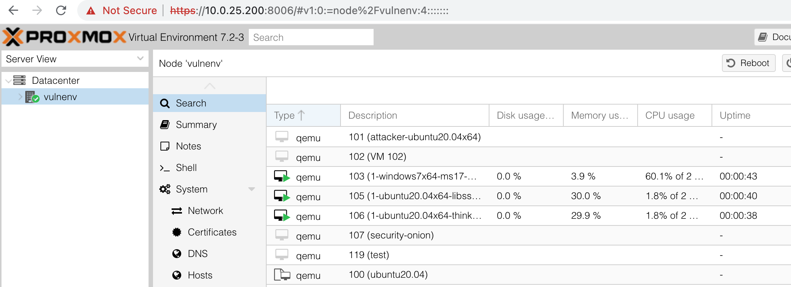
</br>[1.PVE的web控制台]
</div>

通常情况下，我们使用 Vmware 搭建 windows 双机调试环境，都以宿主机作为调试机(`debuger`)，以虚拟机作为被调试机(`debugee`)，通过 Vmware 配置串口设备(`serial`) 通信进行调试；

而 ProxmoxVE 是一台 Linux 主机，要搭建 windows 双机调试环境必需要两台虚拟机才行。

### 0x02 本地内核调试
我们先从简单的本地内核调试环境开始，以此来准备基本的调试环境；在 ProxmoxVE 中安装 windows10 系统，并完成基本的配置如下：
<div align="center">
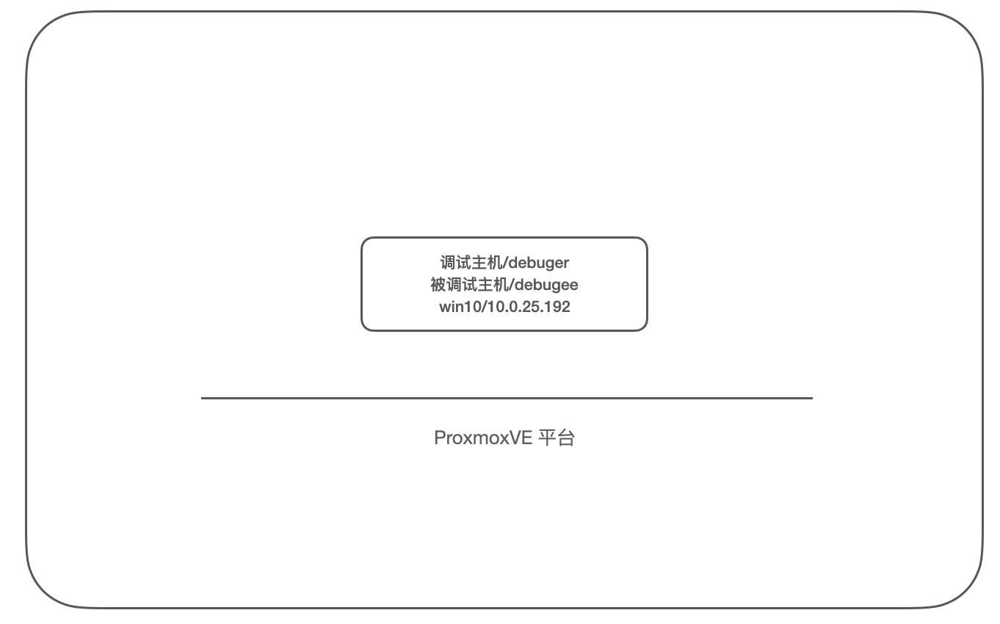
</br>[2.本地内核调试环境]
</div>

我们从官网下载 [WinDBG](https://learn.microsoft.com/zh-cn/windows-hardware/drivers/debugger/debugger-download-tools  ) 并在 windows10 系统上进行安装：
<div align="center">
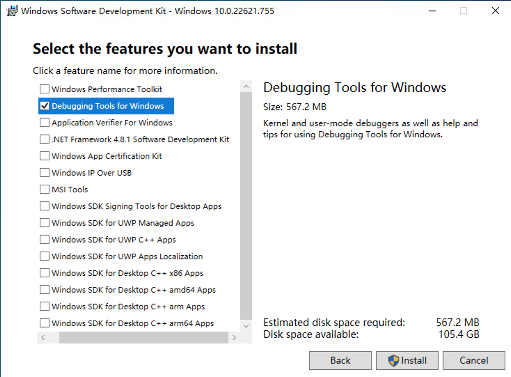
</br>[3.windbg安装配置]
</div>

并在环境变量中(系统变量)配置符号表设置：
```
_NT_SYMBOL_PATH
SRV*c:\symbols*http://msdl.microsoft.com/download/symbols
```

>配置完成后，WinDBG在调试过程中将自动从微软符号表服务器下载对应数据，并保存至 `C:\symbols` 下；  
>也可以在 WinDBG 中使用 Ctrl+S 配置符号表，不过采用环境变量的方式还可以方便其他应用使用该配置。

随后我们使用 `bcdedit` 修改 windows 的启动配置数据文件，使用管理员权限打开 powershell：
```
# 开启 debug
$ bcdedit /debug on
# 查看 bcdedit 配置
$ bcdedit
# 查看 dbgsettings 配置(默认为 local)
$ bcdedit /dbgsettings
```
执行如下：
<div align="center">
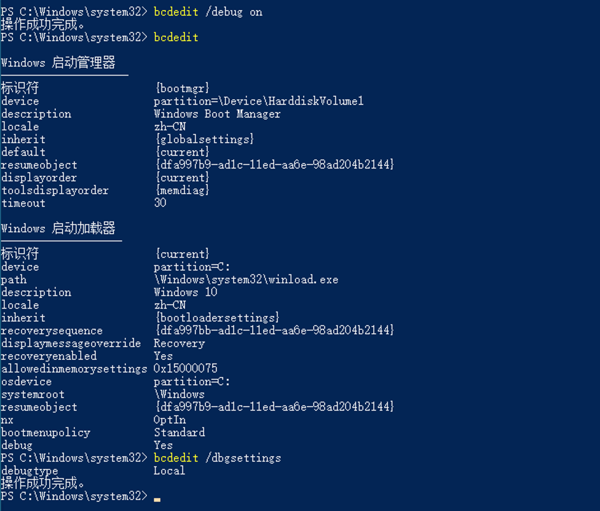
</br>[4.bcdedit配置本地调试]
</div>

>通过 windows 开机启动项选择「启用调试模式」也是一样的，不过通过 bcdedit 修改是永久有效的。  
>如果不想影响目前的配置，可以通过 `bcdedit /copy "{current}" /d "debug test"` 复制当前配置，随后使用 `bcdedit /set "{id}" debug on` 进行配置，在开机时可选择不同的启动项进入系统。

随后重启 windows10 虚拟机生效配置，使用管理员权限启动 WinDBG，选择 `File - Kernel Debug`，选择 `Local` 本地调试标签：
<div align="center">
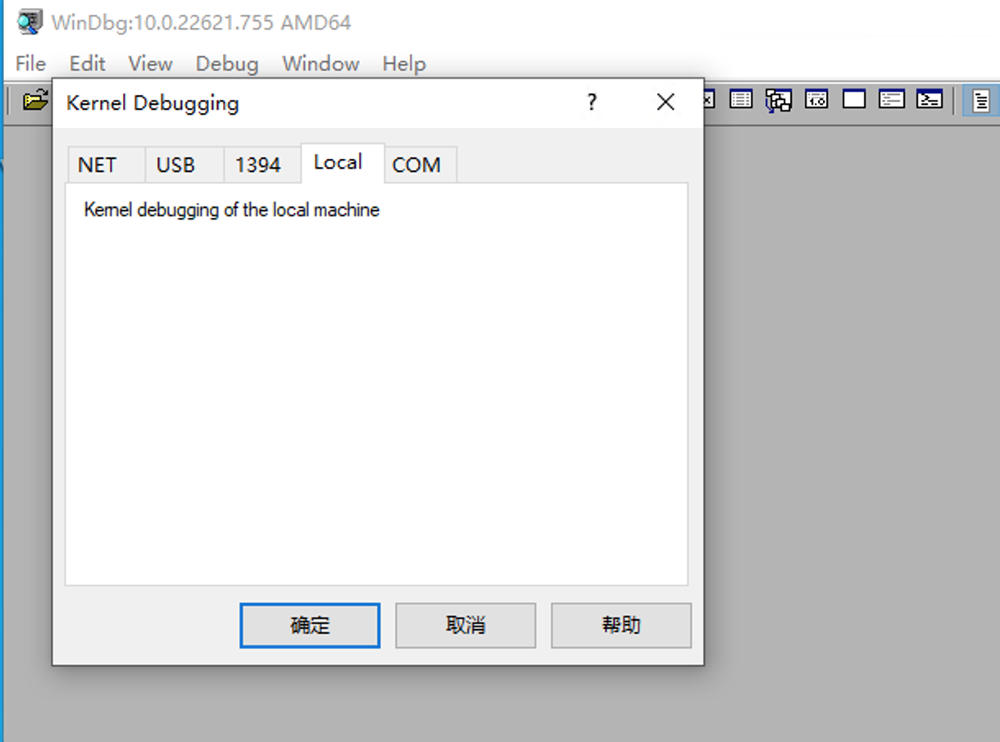
</br>[5.windbg-local标签]
</div>

随后便可以正常进行本地内核调试，我们能够查看内核中的各项数据；但本地内核调试不能影响系统的运行，所以不能打断点、单步调试等，当然 `go` 指令也是不能使用的：
<div align="center">
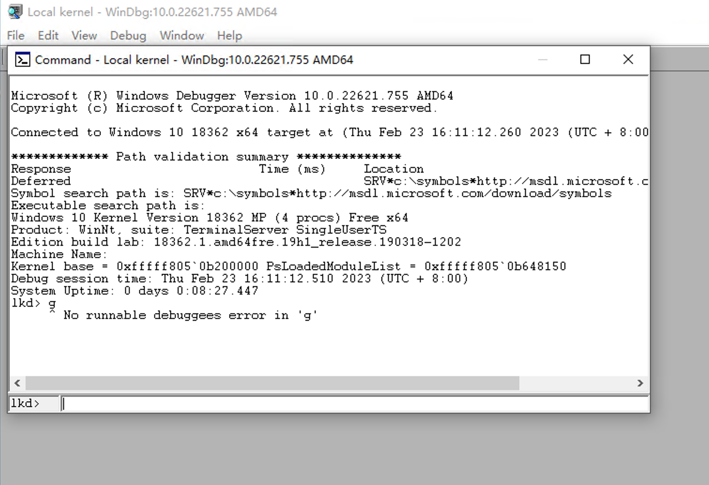
</br>[6.windbg本地内核调试]
</div>

### 0x03 网络双机调试
从 windows8 开始微软提供了网络调试内核的方法，其简称为 `kdnet`，因为通信效率要比串口高，所以使用起来体验更好，是目前微软推荐的内核调试方法。

网络双机调试除了对系统版本有要求，对网卡也有一定的要求，支持的厂商和型号可以查阅 https://learn.microsoft.com/en-us/windows-hardware/drivers/debugger/supported-ethernet-nics-for-network-kernel-debugging-in-windows-10 ；除此之外，还需要两台主机位于同一子网内。

那么我们需要在 ProxmoxVE 再添加一台 windows10 虚拟机作为被调试机(`debugee`)，以我们上文本地内核调试中的主机作为调试机(`debuger`)，以此用两台虚拟机组成 windows 网络双机调试的环境，如下：

>本地内核调试中的配置 `bcdedit /debug on` 不会影响该步骤，也可以手动设置 `bcdedit /debug off` 关闭调试功能。
<div align="center">
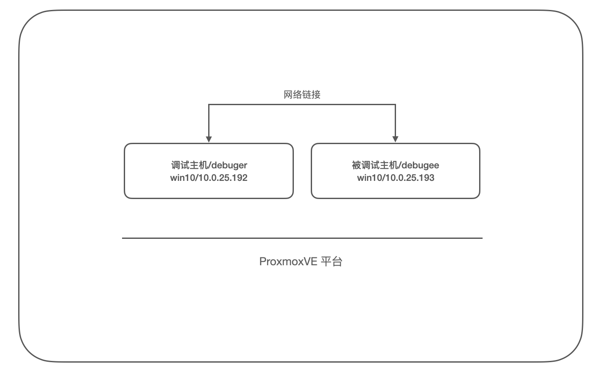
</br>[7.网络双机调试环境]
</div>

搭建这台被调试机(`debugee`)时需要注意，在配置操作系统类型时应选择 `Other` 类型，如下：(如果选择 `windows` 类型，ProxmoxVE 在虚拟化时会提供 Hyper-V 的各项支持，以此来提高虚拟机的性能，但这些项导致网络调试无法正常运行，我们将在 `### 0x05 kdnet问题排查` 进行简要分析)
<div align="center">
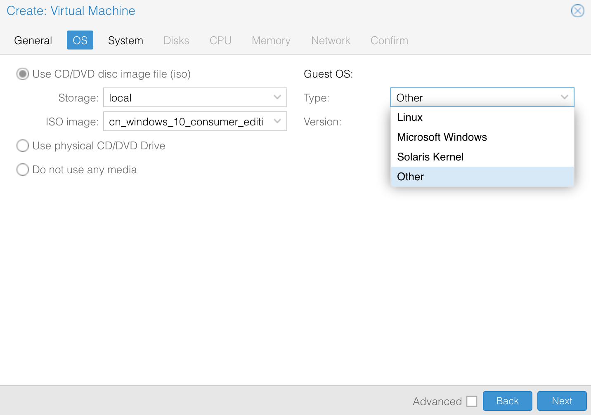
</br>[8.系统类型配置为other]
</div>

由于配置为 `Other` 类型，ProxmoxVE 可能无法提供 windows 的推荐配置，最终导致无法正确安装 windows 系统，若遇到该问题可排查磁盘是否设置为 `IDE` 类型。

除此之外，在网卡配置阶段需要选择 `Intel E1000`，如下：
<div align="center">
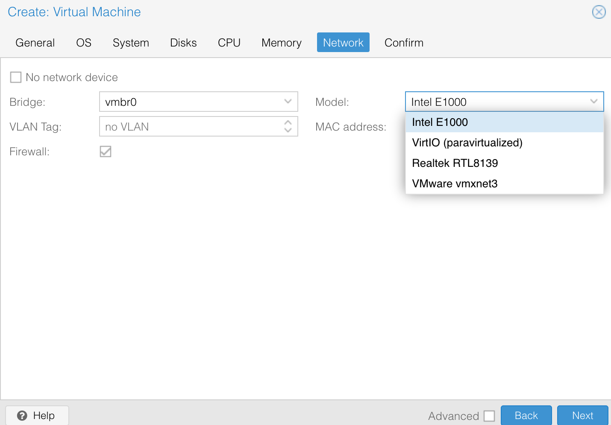
</br>[9.网卡配置为intel e1000]
</div>

根据测试 e1000 网卡在系统内部的硬件 id 为 `VEN_8086&DEV_100E`，满足网络调试对网卡的要求；另外 `Realtek RTL8139` 不满足要求，而`VirtIO` 和 `Vmware vmxnet3` 需要安装特定驱动才能使用。

接下来完成 windows10 系统安装和基础配置，随后进行网络调试的配置；官方推荐使用 [kdnet 工具进行自动配置](https://learn.microsoft.com/en-us/windows-hardware/drivers/debugger/setting-up-a-network-debugging-connection-automatically)，但并不能顺利配置；

我们从调试机(`debuger`) 的 WinDBG 目录中(`C:\Program Files (x86)\Windows Kits\10\Debuggers\x64`) 拷贝 `kdnet.exe` 和 `VerifiedNICList.xml` 到被调试机上(`debugee`)，按官方教程操作如下：
<div align="center">
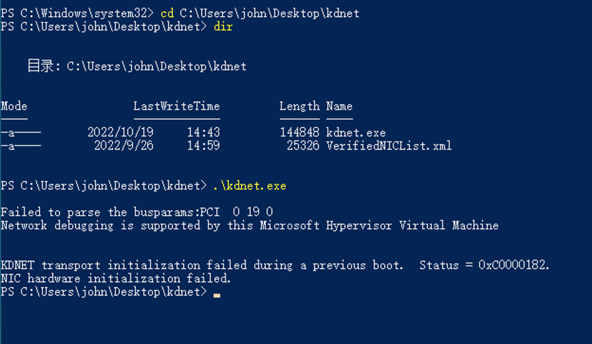
</br>[10.kdnet自动配置失败]
</div>

虽然我们的网卡位于 `VerifiedNICList` 中，但 `kdnet.exe` 无法正确解析。我们按[官方手动配置教程](https://learn.microsoft.com/en-us/windows-hardware/drivers/debugger/setting-up-a-network-debugging-connection)进行设置：
```
# 开启 debug
$ bcdedit /debug on
# 设置网络调试参数
# 设置调试机(debugger)的 ip 地址为 10.0.25.192
# 设置被调试机的端口为 50000 (必须>=49152)
# 设置被调试机的连接密码为 p.a.s.s (必须为 x.x.x.x 格式)
$ bcdedit /dbgsettings NET HOSTIP:10.0.25.192 PORT:50000 KEY:p.a.s.s
# 查看调试配置
$ bcdedit /dbgsettings
```

执行如下：
<div align="center">
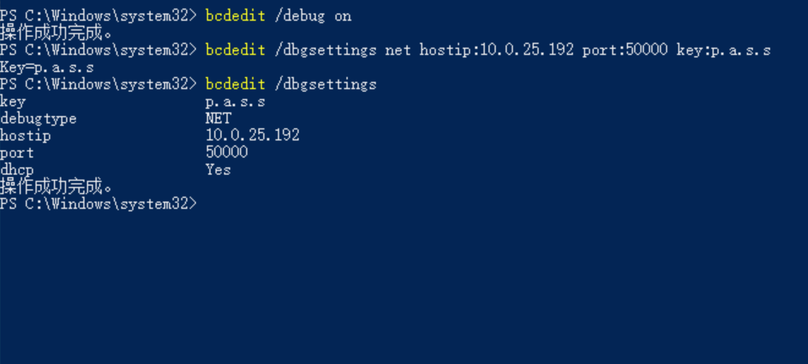
</br>[11.手动配置kdnet]
</div>

完成配置后重启生效；随即我们在调试机(`debuger`) 使用 WinDBG 进行网络调试配置，端口号为 `50000`，密钥为 `p.a.s.s`，如下：
<div align="center">
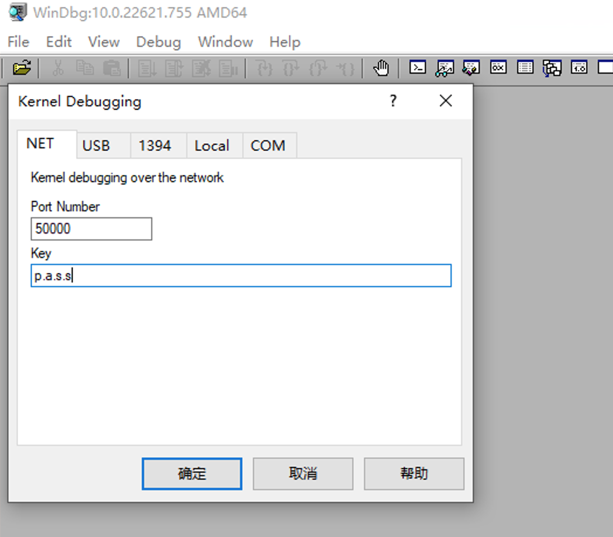
</br>[12.windbg-net标签]
</div>

无论被调试机(`debugee`) 是在运行期间还是重启阶段，都可以被调试机(`debuger`)正确连接并进行调试，连接成功后可使用 `break` 断下来：
<div align="center">
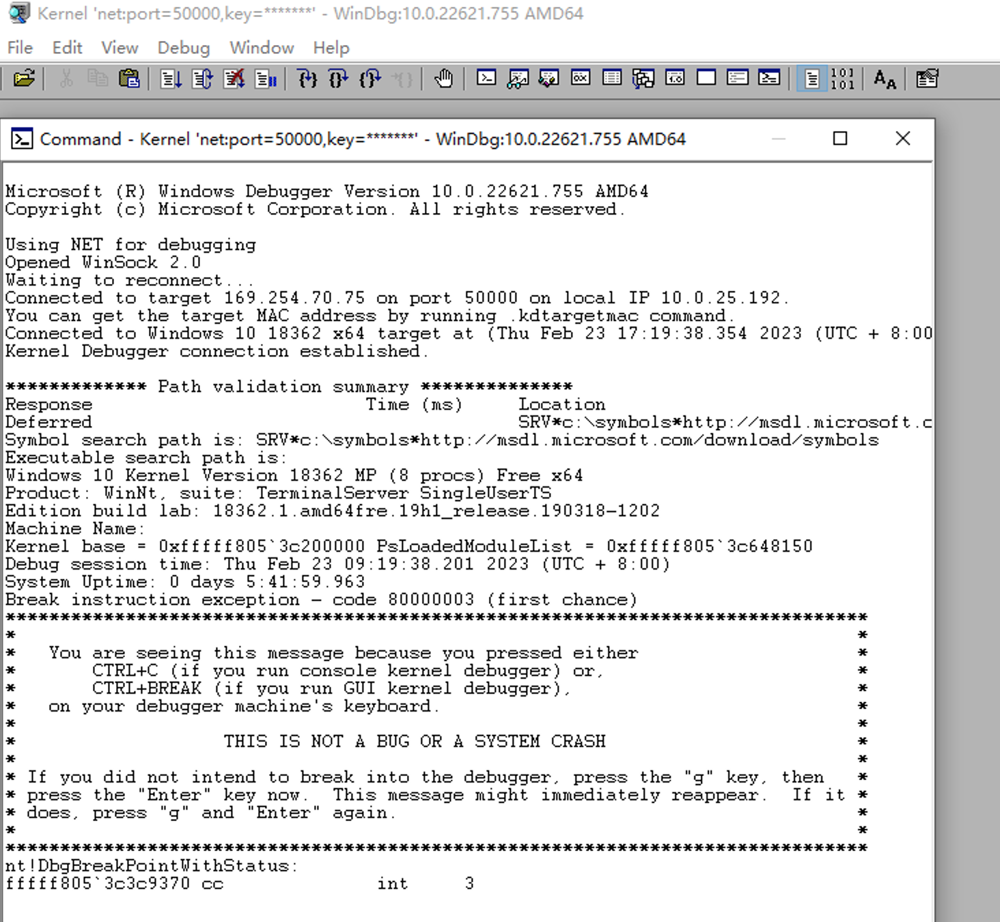
</br>[13.windbg网络双机调试]
</div>

>如果 ProxmoxVE 和虚拟机未采用 DHCP 分配 ip 地址，被调试机(`debugee`) 会在启动阶段卡在 windows logo 阶段 10min 左右，我们将在 `### 0x05 kdnet问题排查` 进行简要分析。

### 0x04 串口双机调试
微软从 windows8 才开始提供网络调试功能，如果要调试 windows7 系统则需要使用传统的串口双机调试的方法了。这里我们复用上文环境，配置 windows10 虚拟机的串口双机调试，windows7 同理可得，环境配置如下：

>上文中网络双机调试中的各项配置、操作系统类型、网卡类型均不影响该步骤。

<div align="center">
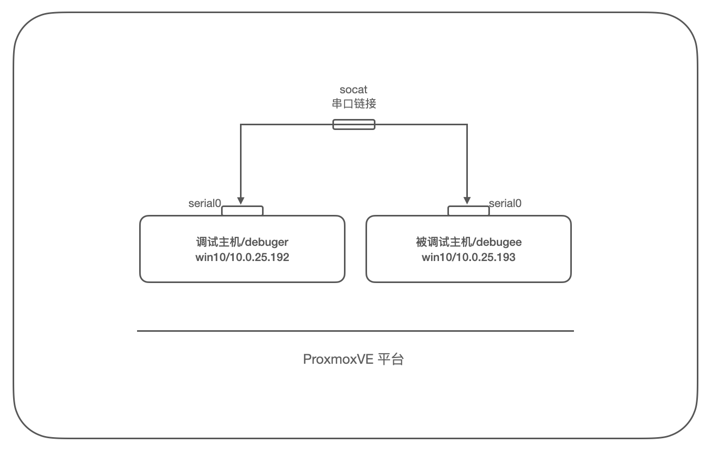
</br>[14.串口双机调试环境]
</div>

首先我们为两台 windows10 虚拟机添加串口(虚拟机关机后再开机硬件改动生效)，如下：
<div align="center">
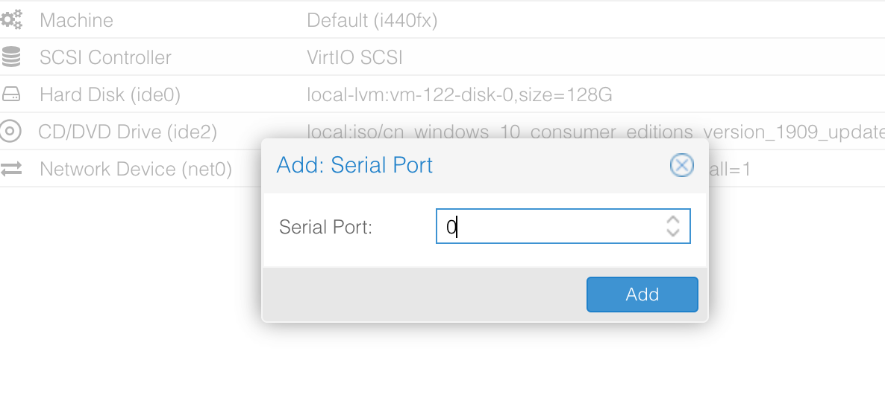
</br>[15.pve添加串口设备]
</div>

>配置成功后，可在 windows 设备管理器中看到 com 设备。

目前这两个串口独立运行，我们通过 ssh 登录 ProxmoxVE 的控制台，使用 `socat` 将两个接口连接起来：
```
# 正常启动两台虚拟机后
# pve(windows10-1)=132 / pve(windows10-2)=133
# 使用 tmux 开启后台终端，socat 需要一直运行
$ tmux
# socat 连接两个串口设备
# 使用 -v 查看运行日志
# 使用 UNIX-CLIENT 的类型打开文件
$ socat -v UNIX-CLIENT:/var/run/qemu-server/132.serial0 UNIX-CLIENT:/var/run/qemu-server/133.serial0
```

配置完成后，我们在被调试机(`debugee`)中设置串口调试：
```
# 开启 debug
$ bcdedit /debug on
# 设置串口调试参数
# 设置调试串口为 1 (com1)
# 设置串口波特率为 115200
$ bcdedit /dbgsettings SERIAL DEBUGPORT:1 BAUDRATE:115200
# 查看调试配置
$ bcdedit /dbgsettings
```

执行如下：
<div align="center">
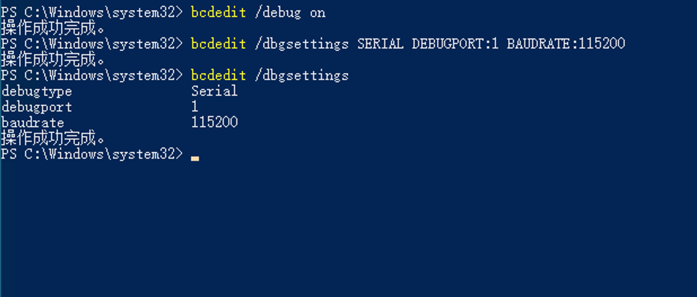
</br>[16.bcdedit配置串口调试]
</div>

随后我们切换至调试机(`debuger`)下，使用 WinDBG 设置串口调试配置，波特率为 `115200`，端口为 `com1`，不勾选 `pipe`，勾选 `reconnect`，如下：
<div align="center">
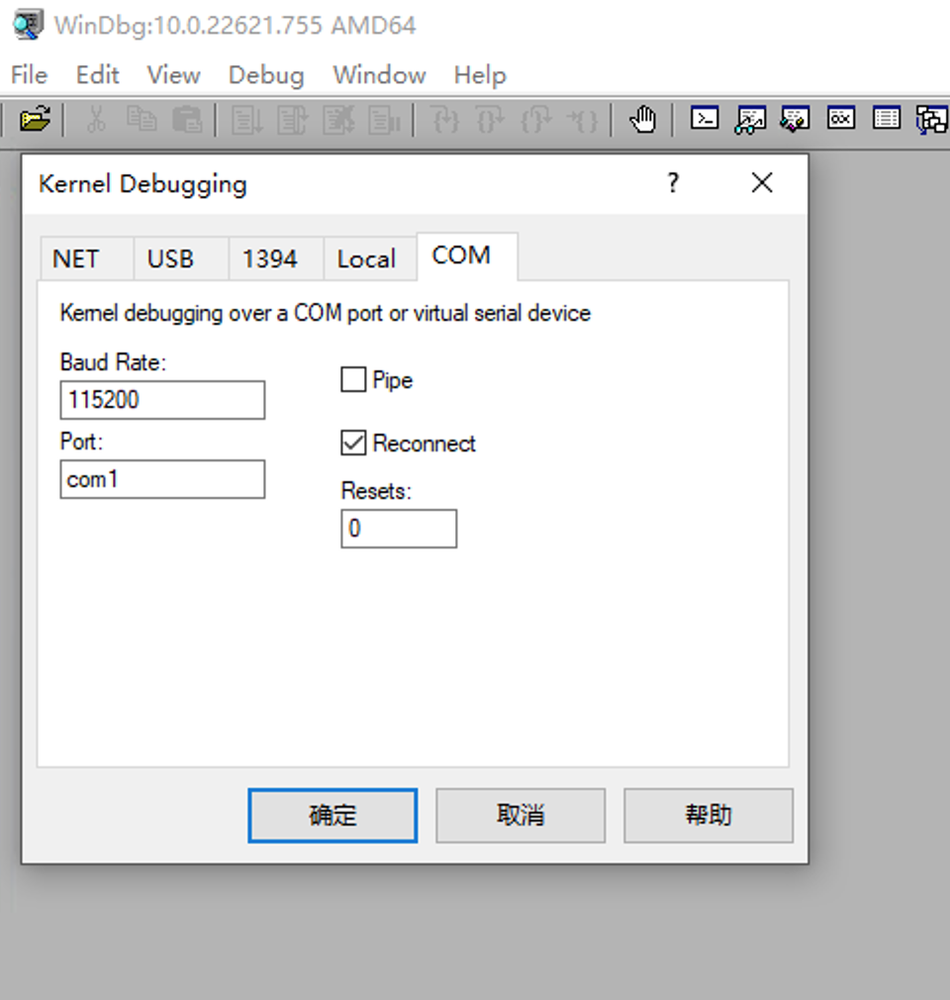
</br>[17.windbg-com标签]
</div>

设置完毕后，在 WinDBG 显示 `Waiting to reconnect...` 后，重启被调试机(`debugee`)，调试机(`debuger`)将在其系统启动时连接上去，使用 `break` 可将其断下来，如下：
<div align="center">
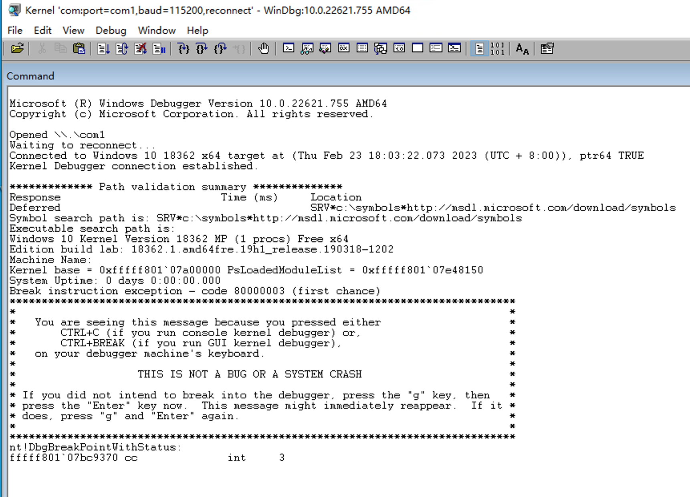
</br>[18.windbg串口双机调试]
</div>

>我这里首次连接时 WinDBG 将异常退出，不过重新启动 WinDBG 并设置好参数即可成功连接。

**ProxmoxVE串口调试的一些补充**  
熟悉 Vmware 搭建 windows 内核调试的朋友，通常都使用命名管道进行配置如 `\\.\pipe\com1`，但 ProxmoxVE 下的串口设备(serial) 仅支持 `/dev/.+|socket` 两种类型(实际上底层的 `kvm/qemu` 支持很多，但 ProxmoxVE 会直接报错无法启动虚拟机)，这为我们的串口调试带了一些困难；

同时我们默认配置的串口设备类型为 `socket`，其实际运行的参数如下：
<div align="center">
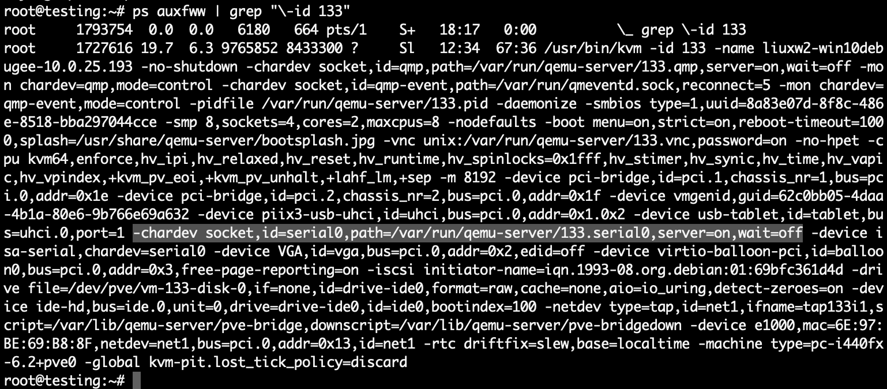
</br>[19.kvm实际启动参数-serial]
</div>

串口设备的参数为 `-chardev socket,id=serial0,path=/var/run/qemu-server/133.serial0,server=on,wait=off`，同样其参数在 ProxmoxVE 下不能修改。

在此限制条件下，我们可以使用 `socat` 以 `UNIX-CLIENT` 的方式将两台虚拟机的串口设备进行连接，从而实现串口双机调试。

### 0x05 kdnet问题排查
**1.hyper-v虚拟化导致kdnet无法工作**  
在上文「网络双机调试」的环境配置中，我们在 ProxmoxVE 配置被调试机(`debugee`)时将其操作系统类型设置为 `Other` 类型，这样才能使 kdnet 正常工作，为什么呢？

我们按正常的安装流程在 ProxmoxVE 中安装一台 windows10(即操作系统类型选择为 `win10/2016/2019`) 并启动，通过 ssh 登录 ProxmoxVE 查看底层 kvm/qemu 的启动参数，如下：
<div align="center">
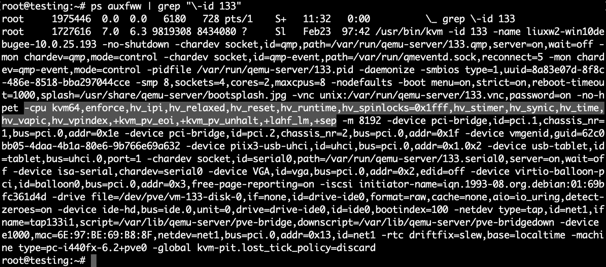
</br>[20.kvm实际启动参数-cpu]
</div>

我们可以看到其 cpu 参数为 `-cpu kvm64,enforce,hv_ipi,hv_relaxed,hv_reset,hv_runtime,hv_spinlocks=0x1fff,hv_stimer,hv_synic,hv_time,hv_vapic,hv_vpindex,+kvm_pv_eoi,+kvm_pv_unhalt,+lahf_lm,+sep`，其中 `hv_*` 的配置表示 kvm 将以 hyper-v 的方式提供虚拟化功能，windws 虚拟机将认为自己运行在 hyper-v 的技术之上，以便使用 hyper-v 的功能并在一定程度上提高运行性能。

而根据前辈在 kvm/qemu 下使用的 kdnet 的经验(https://www.osr.com/blog/2021/10/05/using-windbg-over-kdnet-on-qemu-kvm/) 来看，`hv_*` 配置项会导致 kdnet 工作时认为自身位于 hyper-v 环境下，从而使用 hyper-v 中未公开的通信机制，最终导致 kdnet 无法正常工作；

经过测试验证，在我们的环境下的表现和前辈文章不一致，`hv-vendor-id`(CPUID) 并不会被修改，这可能和 qemu 的版本有关系，但 `hv_*` 的配置项确实会影响 kdnet 的工作。我们沿着这个思路查找 ProxmoxVE 调用 kvm/qemu 的源码，在 [qemu-server](https://git.proxmox.com/?p=qemu-server.git;a=summary) 源码包中 `qemu-server/PVE/QemuServer.pm#vm_start()` 找到调用 kvm/qemu 的代码入口；

随后跟入该函数，在 `qemu-server/PVE/QemuServer.pm#config_to_command()` 找到拼接 qemu 命令的代码如下：
<div align="center">
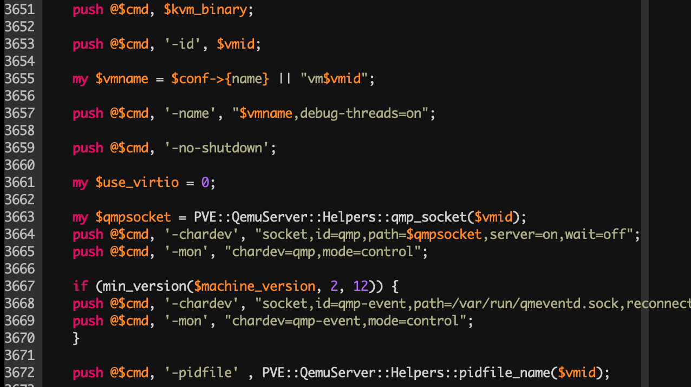
</br>[21.pve源码拼接qemu命令]
</div>

随后在 `qemu-server/PVE/QemuServer/CPUConfig.pm#get_cpu_config()` 找到 `-cpu` 参数的生成代码：
<div align="center">
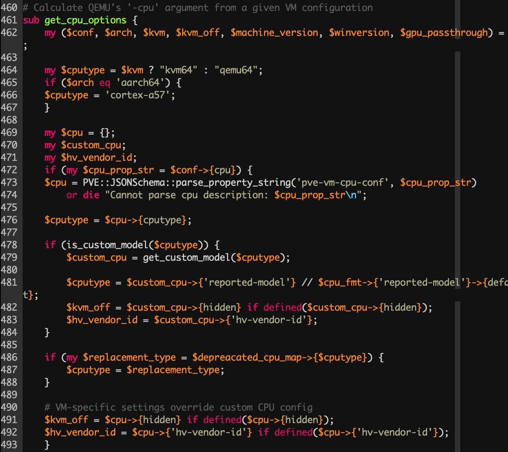
</br>[22.pve源码拼接cpu参数]
</div>

结合上下文可以了解到，当操作系统为 `win10` 等类型时，此处将自动在 `-cpu` 参数中添加 `hv_*` 参数，以更好的支持 windows 虚拟机。

那么在设置虚拟机硬件时，我们只需要选择操作系统类型为 `other`，即可避免 ProxmoxVE 使用 `hv_*` 参数启动虚拟机，从而保证 kdnet 可以正常工作。

>PS:  
>1.对于已配置好的虚拟机，可使用 ssh 登录 ProxmoxVE，修改虚拟机配置文件 `/etc/pve/qemu-server/[id].conf`，设置启动的 `ostype: other`，也可以关闭 hyber-v 的虚拟化。  
>2.对于已成功配置网络调试的主机，即便再重新打开 hyber-v 的虚拟化，kdnet 也能正常工作(这可能和已成功配置的网络调试器驱动有关？)

**2.非DHCP的调试机(`debugee`)启动时卡logo界面**  
当我们使用 `bcdedit` 配置好网络调试后，重启虚拟机可以发现 windows 使用了 `以太网(内核调试器)` 替代了原始网卡：
<div align="center">
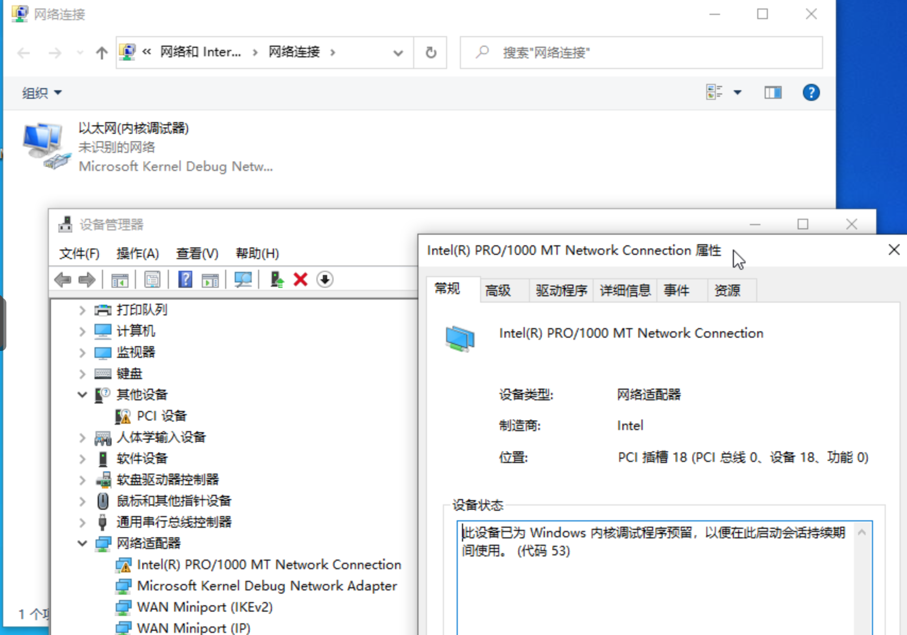
</br>[23.调试器网卡驱动]
</div>

`以太网(内核调试器)` 其默认采用 DHCP 的方式获取 ip，而通常情况下 ProxmoxVE 都采用静态 ip 分配，在系统启动阶段，该网卡将首先等待 DHCP 分配 ip，若获取失败，则自己分配 `169.254.*.*` 的地址；这个阶段发生在 windows logo 界面，大致需要 10min。

采用静态分配地址的 ProxmoxVE 服务器，可在被调试机(`debugee`)内修改网络调试，关闭 DHCP 即可解决：
```
# 查看网络调试配置
$ bcdedit /dbgsettings
# 关闭网络调试配置中的 dhcp
$ bcdedit /set "{dbgsettings}" dhcp no
# 查看网络调试配置
$ bcdedit /dbgsettings
```

执行如下：
<div align="center">
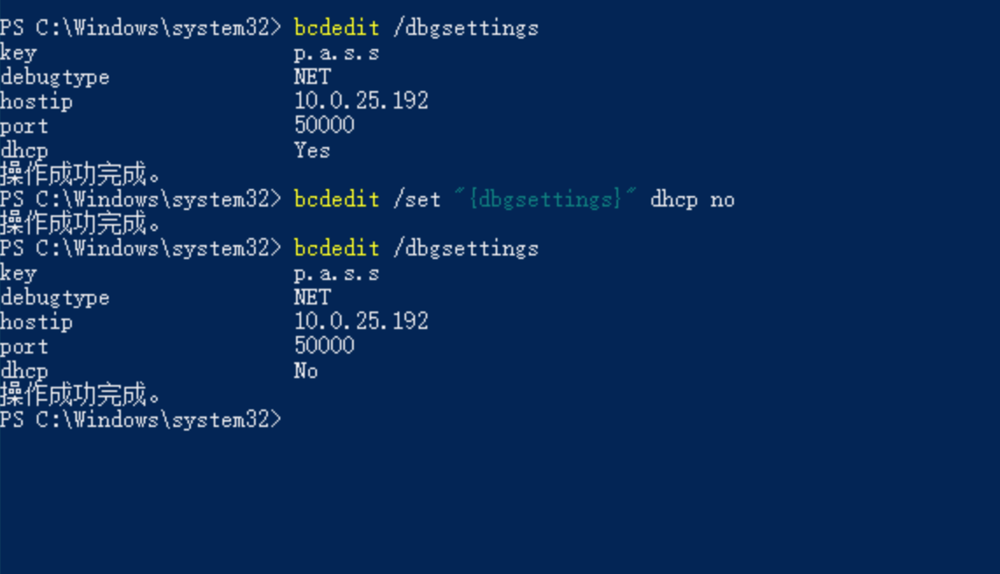
</br>[24.关闭网络调试的dhcp]
</div>

**3.kdnet下被调试机联网问题**  
在某些场景下，我们需要在联网条件下进行内核调试，串口调试不会影响网络，但网络调试会使用 `以太网(内核调试器)` 替代原始网卡，其默认采用 DHCP 方式，若上游配置好了 DHCP 服务器则可正常使用；

如果采用静态地址分配，则进入虚拟机后，在 `以太网(内核调试器)` 上配置静态地址即可，联网和网络调试不会冲突，都可以正常使用：
<div align="center">
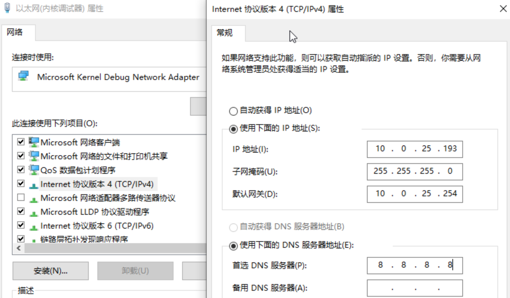
</br>[25.调试器网卡配置静态ip]
</div>

**4.kdnet下多网卡的被调试机配置**  
某些场景下，我们的虚拟机具有多张网卡，若想指定具体的网卡作为调试网卡，可以使用如下命令：
```
# 在网络调试配置成功的前提下
# 设置 busparams 参数
# 通过设备管理器查看对应网卡的 PCI 插槽 [bus.device.function]
$ bcdedit /set "{dbgsettings}" busparams 0.19.0
# 查看网络调试配置
$ bcdedit /dbgsettings
```

执行如下：
<div align="center">
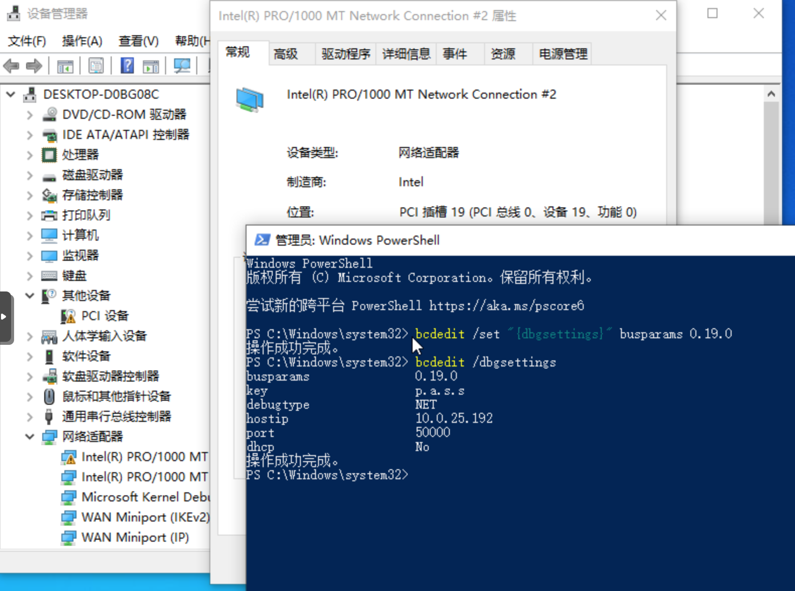
</br>[26.指定网络调试器网卡]
</div>

### 0x06 vmware碎碎念
通过以上一阵折腾，不得不说 vmware 在搭建 windows 调试环境这条路上帮我们铺平了道路；在实验过程中，我同时也配置了 vmware 下的环境，在这里我补充两个偏门的点，希望可以帮助到使用 vmware 搭建环境的小伙伴。

这里的测试环境如下：
```
Windows10 1909 专业版(宿主机)
Vmware Workstation 17
Windows10 1909 专业版(虚拟机)
```

**1.vmware下的网络调试搭建**  
在网络调试的需求下，无论是使用宿主机调试虚拟机，还是使用虚拟机调试虚拟机，vmware 均可以完美支持；其 vmware 提供的虚拟机网卡默认支持 windows 网络调试，同时 vmware 默认采用 NAT 网络并默认开启 DHCP。

**2.vmware串口调试搭建**  
使用 vmware 通过宿主机串口调试虚拟机，这我们再熟悉不过了，在虚拟机串口中配置命名管道 `\\.\pipe\com1`，设置`该端是服务器`，设置`另一端是应用程序`，勾选 `轮询时主动放弃CPU`，如下：
<div align="center">
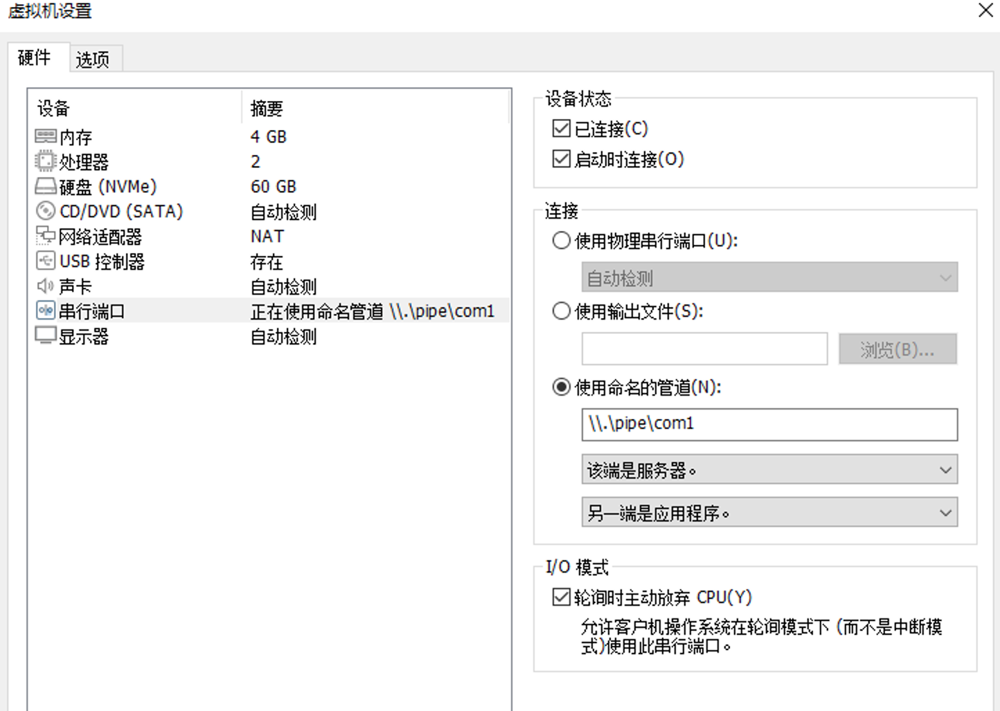
</br>[27.vmware被调试机串口配置]
</div>

在虚拟机使用 `bcdedit` 配置串口调试，随后在宿主机中打开 WinDBG 使用串口调试连接即可，如下：
<div align="center">
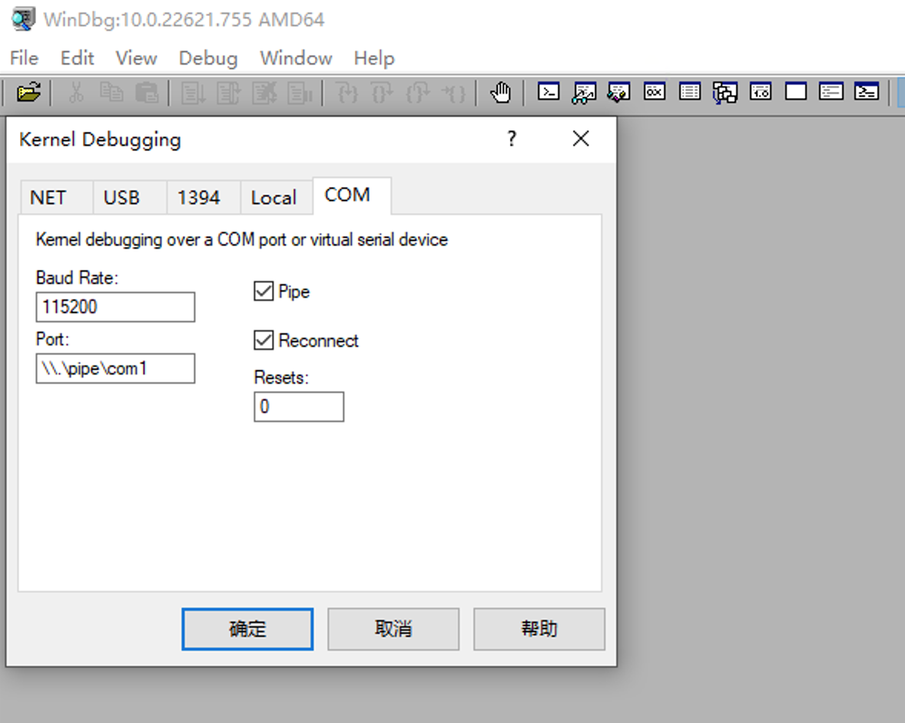
</br>[28.vmware宿主机串口调试]
</div>

**但如果要使用虚拟机串口调试虚拟机**，这就稍微有点不同了；首先配置被调试机(`debugee`)串口，配置命名管道 `\\.\pipe\com1`，设置`该端是服务器`，设置`另一端是虚拟机`，勾选 `轮询时主动放弃CPU`，如下：
<div align="center">

</br>[29.vm-vm被调试机串口调试]
</div>

随后配置调试机(`debuger`)串口，配置命名管道 `\\.\pipe\com1`，设置`该端是客户端`，设置`另一端是虚拟机`，如下：

<div align="center">
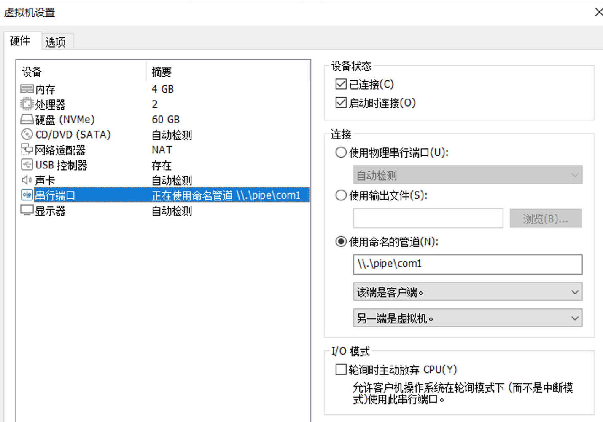
</br>[30.vm-vm调试机串口调试]
</div>

同样也在被调试机(`debugee`) 使用 `bcdedit` 配置串口调试，然后在调试机(`debuger`)中使用 WinDBG 进行串口调试，这里需要注意串口设备为 `com1`，且不能勾选 `pipe`(因为命名管道是对于宿主机的，而它在虚拟机内部仅仅是 com 口)，如下：
<div align="center">
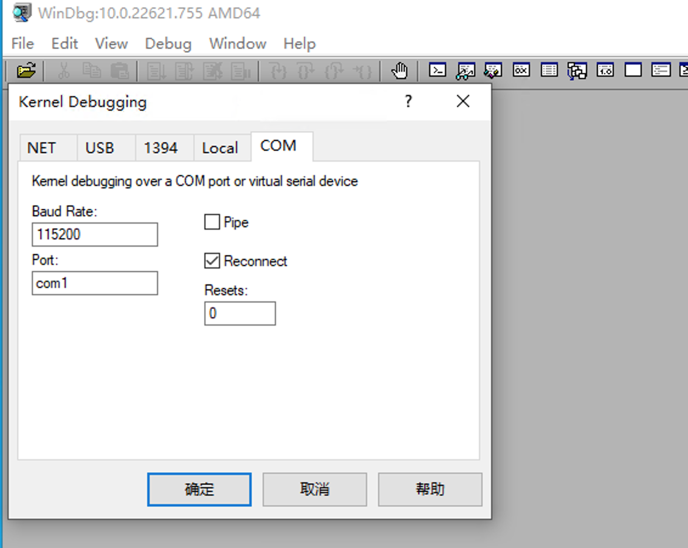
</br>[31.vm-vm windbg配置串口调试]
</div>

配置完成后，被调试机(`debugee`)重启即可成功连接。

### 0x07 References
https://learn.microsoft.com/zh-cn/windows-hardware/drivers/debugger/debugger-download-tools  
https://learn.microsoft.com/en-us/windows-hardware/drivers/devtest/bcdedit--dbgsettings  
https://learn.microsoft.com/en-us/windows-hardware/drivers/debugger/supported-ethernet-nics-for-network-kernel-debugging-in-windows-10  
https://learn.microsoft.com/en-us/windows-hardware/drivers/debugger/setting-up-a-network-debugging-connection-automatically  
https://learn.microsoft.com/en-us/windows-hardware/drivers/debugger/setting-up-a-network-debugging-connection  
https://forum.proxmox.com/threads/two-windows-guests-communicating-via-serial-console-comn.67588/  
https://forum.proxmox.com/threads/serial-port-between-two-vms.63833/#post-290092  
https://superuser.com/questions/1404669/crossover-computer-connection-vs-network-switch-broadcast-packet-differences  
https://www.linux-kvm.org/page/WindowsGuestDrivers/GuestDebugging  
https://www.osr.com/blog/2021/10/05/using-windbg-over-kdnet-on-qemu-kvm/  
https://www.qemu.org/docs/master/system/i386/hyperv.html  
https://git.proxmox.com/?p=qemu-server.git;a=summary  