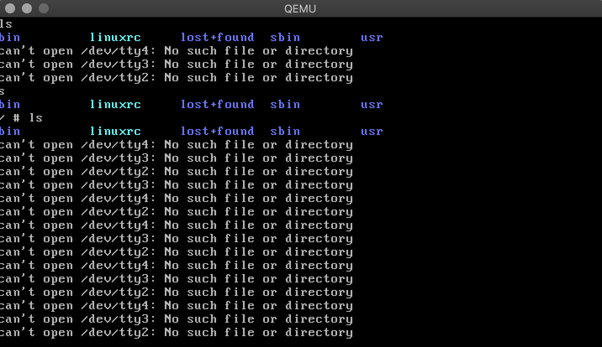
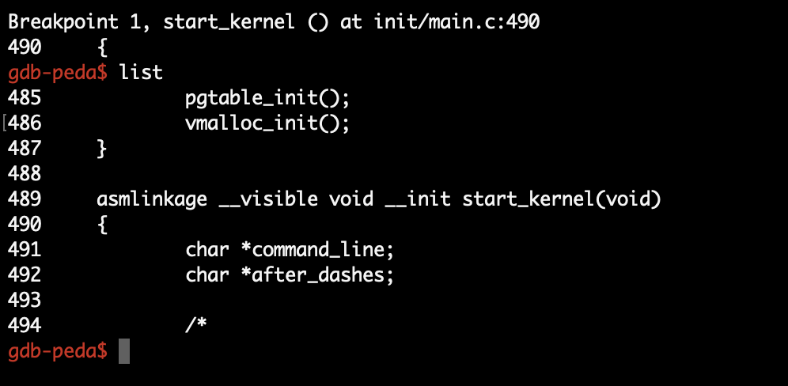

## QEMU搭建Linux内核调试环境

Time: 2019.06.25  
Tags: 开发  

### 0x00 前言
最近接触到 TCP 的 SACK panic 漏洞，但发现自己没有 linux 的内核调试环境，遂搭建一个并对搭建过程进行记录。

由于自己的环境，这里仅记录下在 MAC 平台下，使用 qemu + GDB 进行 linux 内核调试的环境。当然还有其他更加便捷的方式，如 vmware。


本文实验环境：
```
[MAC 平台]
Qemu
GDB 8.2
linux-4.0.1 源码
Busybox 源码
(额外还需要一台 x86 linux 虚拟机，作为编译环境使用)
```

### 0x01 Linux编译
在选择 Linux 源码时，需要选择版本稍微新一些的，因为旧版的源码依赖于旧版的 GDB 编译，这里选择 4.0.1；这个步骤我们使用「x86 linux 虚拟机」进行编译。

**configuure**  
执行配置(缺少什么组件就安装)

	make menuconfigure

进行配置菜单：

	取消 64-bit kernel
	设置 kernel hacking –> kernel debugging –> compile the kernel with debug info
	设置 kernel hacking –> compile the kernel with frame pointers

**compile**  
进行编译

	make

编译完成后，关注几个文件：

	linux-4.0.1/arch/x86/boot/bzImage
	用于 Qemu 启动的内核镜像文件
	
	linux-4.0.1/vmlinux
	用于 GDB 加载的内核文件


### 0x02 busybox编译
busybox 源码选择最新版即可，版本之间影响不大。

**configure**  
执行配置

	make menuconfig

在配置菜单中：

	设置 Busybox Settings->Build Options->Build BusyBox as a static binary (no shared libs)

**compile**  
进行编译

	make
	(可以使用 make -j4，指定编译的线程数)

编译完成后，关注生成文件：

	busybox-1.30.1/busybox
	
	尝试执行
	./busybox whoami
	(命令正确执行，表示 busybox 工作正常)

**构建文件系统**  
这里我们需要构建一个文件系统，供后续 Qemu 加载内核使用。这个步骤我们使用「x86 linux 虚拟机」进行编译。

1.创建一个磁盘镜像，64M即可

	dd if=/dev/zero of=rootfs.img bs=1024K count=64

2.格式化为 ext3 格式

	mkfs.ext3 rootfs.img

3.创建文件夹，并将 rootfs 挂载上去

	mkdir image
	mount -o loop rootfs.img image/

4.在编译完成的 busybox 根目录下，安装 busybox 至磁盘镜像中

	cd busybox-1.30.1
	make install CONFIG_PREFIX=/root/image/

5.卸载 rootfs

	umount image

此时，文件系统制作完成，内核工作时将依赖该文件系统。


### 0x03 gdb编译
MAC 上通过 brew 安装的 GDB 不能调试 linux 内核，原因有：其不支持 linux 的二进制文件，并且 linux 内核调试依赖 python。

GDB 源码选择 8.2 及以上的版本(本机环境 python3.7，8.2及以上才能正确兼容)，该步骤在 MAC 上进行。

**configure**  
进行配置

	./configure --build=x86_64-apple-darwin --target=x86_64-linux --with-python=/usr/local/bin/python3

**compile**  
进行编译

	make

编译完成后，可以使用 `gdb-8.2/gdb/gdb`，我们这里将其配置为：

	alias gdb_k='gdb-8.2/gdb/gdb'


### 0x04 Qemu安装
在 MAC 上执行 Qemu 安装，brew 即可：

	brew isntall qemu

安装完成后，命令行输入 `qemu` 可以看到多个命令，我们的内核是 x86 的，关注这个即可：

	qemu-system-i386

### 0x05 启动调试
我们在 「linux 虚拟机」 上编译了不少东西，先转移到 MAC 上，创建个文件夹：

	.kernel_debug
	├── bzImage
	├── linux-4.0.1
	└── rootfs.img

其中 `linux-4.0.1` 是我们编译后的源码文件夹，直接拷贝过来；`bzImage` 来源于 `linux-4.0.1/arch/x86/boot/bzImage`；`rootfs.img` 是我们使用 busybox 制作的文件系统。

**启动 linux 内核**  
在 `kernel_debug` 文件下：

	qemu-system-i386 -kernel bzImage -hda rootfs.img -append "root=/dev/sda"

参数表示启动 `bzImage` 内核，指定 `rootfs.img` 为一个硬盘，并设置初始加载硬盘为 `/dev/sda`，即 `rootfs.img`

启动演示：
<div align="center">

</div>
可以正确执行命令(不要在意 tty 的错误提示)

**启动调试**  

	qemu-system-i386 -kernel bzImage -hda rootfs.img -append "root=/dev/sda" -gdb tcp::7777 -S

在之前启动的参数后添加调试参数，`-gdb` 指定调试端口为 tcp 7777端口，`-S` 表示在 CPU 启动后就中断。

启动后，会发现 Qemu 卡在启动界面，这时候 GDB 就可以附加上来了：

1.进入到 `linux-4.0.1` 启动 gdb_k (便于 `list` 命令能正确显示源码)

	gdb_k

2.加载文件

	file vmlinux
	
3.远程附加

	 target remote 127.0.0.1:7777

即可进行调试。

**调试演示**  
在上一步中附加成功后，这里我们紧接着，尝试进行调试。

1.在内核入口下断点

	gdb-peda$ b start_kernel
	Breakpoint 1 at 0xc1ab873c: file init/main.c, line 490.

2.运行至该断点处

(此刻被中断在 CPU 启动时，需要运行到内核入口处，以便完成初始化和引导的程序逻辑)

	gdb-peda$ c
	Breakpoint 1, start_kernel () at init/main.c:490

3.使用 list 命令查看该处代码

	gdb-peda$ list
	485		pgtable_init();
	486		vmalloc_init();
	487	}
	...

4.即可开心的进行调试啦。

<div align="center">

</div>


### 0x06 References
<https://blog.csdn.net/jasonLee_lijiaqi/article/details/80967912>  
<https://www.cnblogs.com/chineseboy/p/4216521.html>  
<https://bestwing.me/Linux_Kernel_Debugging_with_VMware_and_GDB.html>  
<https://xz.aliyun.com/t/2024>  
<https://consen.github.io/2018/01/17/debug-linux-kernel-with-qemu-and-gdb/>  