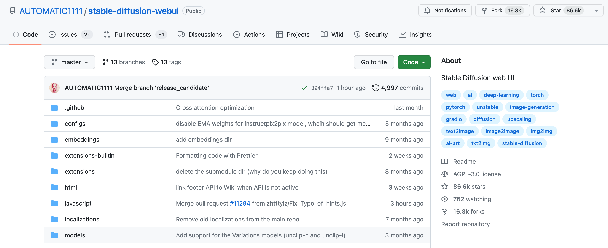
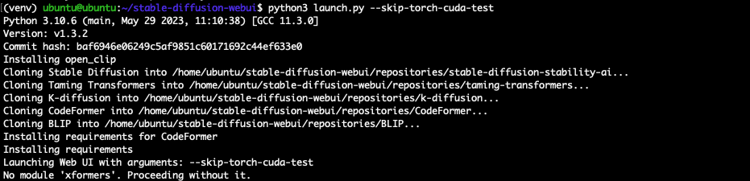
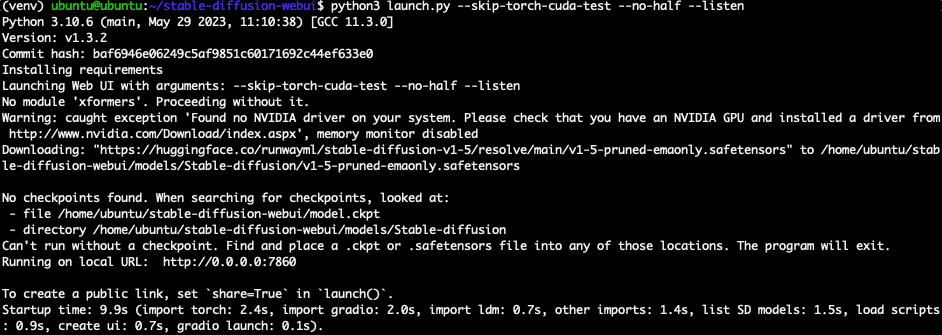
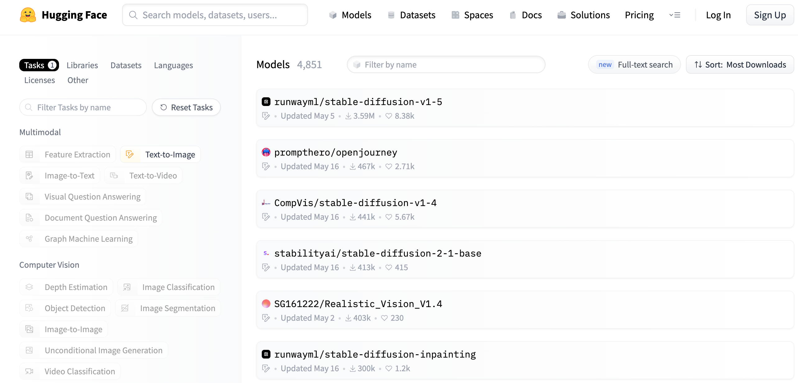
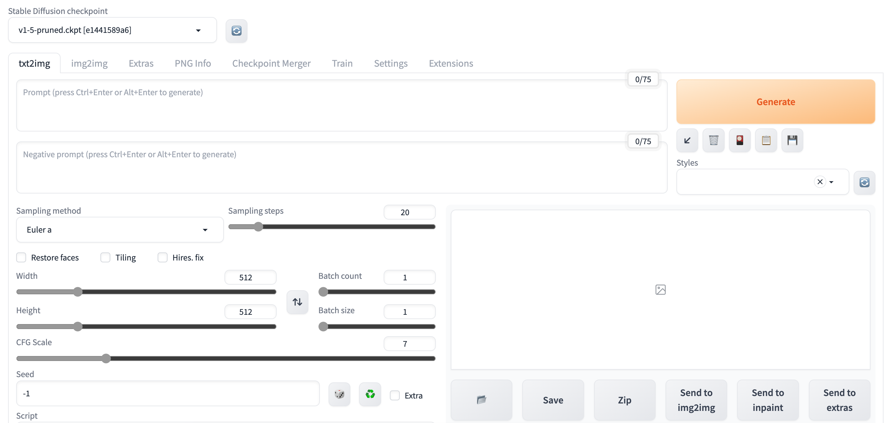
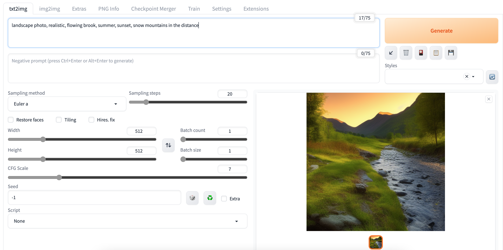
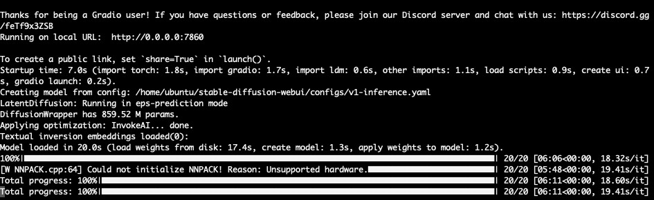

## StableDiffusion的cpu推理使用

Time: 2023.06.27  
Tags: 其他  


### 0x00 前言

ChatGPT 的爆火督促我去接触学习一些大模型的基本原理，在这过程中又看到很多小伙伴用 Stable Diffusion 工具文生图玩得不亦乐乎，虽然 Stable Diffusion 采用的是扩散模型，不过也想借此机会尝试一下。

不过我没有推荐配置的显卡，好在 Stable Diffusion 也支持使用 CPU 进行推理，只是速度慢一些，用于学习场景足够了。本文将详细介绍工具搭建流程以及基本使用。

本文实验环境：
```
Ubuntu22.04 x64 16C16G
```

### 0x01 StableDiffusion搭建
Stable Diffusion 的官方开源地址为 https://github.com/Stability-AI/stablediffusion， 不过使用 WebUI 更便于新手学习使用；

通过 Github 访问 Stable Diffusion WebUI 如下(https://github.com/AUTOMATIC1111/stable-diffusion-webui)：
<div align="center">

</br>[1.Stable Diffusion Github主页]
</div>

我们可以使用官方推荐的一键安装的方式：
```
sudo apt install wget git python3 python3-venv
bash <(wget -qO- https://raw.githubusercontent.com/AUTOMATIC1111/stable-diffusion-webui/master/webui.sh)
```

执行完毕后，会自动启动服务，随后通过 web 使用即可。

但是受国内网络访问限制，以及我们需要使用 CPU 进行推理，可以手动安装如下：
```
# 安装依赖(python3.10)
sudo apt install wget git python3 python3-venv libgl1
# 从 github 下载 sd
git clone https://github.com/AUTOMATIC1111/stable-diffusion-webui.git
# 初始化 venv
cd stable-diffusion-webui/
python3 -m venv venv
# 进入 venv
source venv/bin/activate
# 安装 pip 依赖
pip3 install -r requirements.txt
```

随后使用 `launch.py` 启动服务：
```
# CPU 推理，设置参数跳过 torch-cuda 检查
# --no-half 禁止 torch 使用半精度的数据类型(需要显卡支持，以提高性能)
# --listen 设置服务监听在 0.0.0.0，可公开访问
python3 launch.py --skip-torch-cuda-test --no-half --listen
```

启动服务时还会检查依赖并自动下载安装，如下：
<div align="center">

</br>[2.启动服务检查并安装依赖]
</div>

随后便可以正常启动如下：
<div align="center">

</br>[3.成功启动服务]
</div>

>以上各步骤可以单独配置代理，再进行安装。

### 0x02 模型下载
Stable Diffusion 安装完毕后还不能直接使用，我们还需要配置模型；我们可以从官网(https://huggingface.co/models) 按 `Text-To-Image` 下载模型，如下：
<div align="center">

</br>[4.huggingface模型下载]
</div>

或者从更受欢迎的 C 站 CivitAI(https://civitai.com/) 下载模型：
<div align="center">

</br>[5.civitai模型下载]
</div>

比较受欢迎的模型有：
* Stable Diffusion：官方模型，内容庞杂，什么风格都有，属于中性模型
* Anything：以二次元漫画为主打的模型
* Deliberate：包括人、动物、生活用品等的全面万能的真实系模型
* 国风3：东方人物形象、中国特色服饰和建筑风格，国风模型
* ......

我这里选择下载 Stable Diffusion v1.5 官方模型(https://huggingface.co/runwayml/stable-diffusion-v1-5)，下载完成后，将模型文件 `v1-5-pruned.ckpt` 放置在 Stable Diffusion 源码路径下 `[src]/models/Stable-diffusion/v1-5-pruned.ckpt`，其他模型类似。

### 0x03 文生图
Stable Diffusion 工具和模型都配置完成后，我们通过 Web 访问即可进行使用：
<div align="center">

</br>[6.Stable Diffusion使用]
</div>

页面的左上角可以选择使用的模型，随后可以选择不同的使用方式，这里简单介绍下文生图(`txt2img`)的页面功能：

1. Prompt：提示词，关键词，特征点，(越靠前权重越大，还可使用括号和比例增加权重)
2. Negative Prompt：不想要的内容的提示词，排除一些负面标签
3. Sampling method：推理/推演算法
4. Sampling steps：推理/推演多少步，通常设置为 20，值越大细节越丰富，耗费更多的时间
5. 图片分辨率：Width x height
6. 三个扩展选项：Restore faces(面部修复) / Tiling(画面平铺) / Hires.fix(高分辨率)
7. 批量操作：Batch count(顺序生成的数量) / Batch size(同时生成的数量)
8. CFG Scale：与提示词的相关性，越高则越相关，但图片可能失真，越低越不相关，但图片质量更好
9. Seed：图像生成的初始化状态，在一定程度上影响生成结果

我们使用如下 `Prompt`，其他均为默认值，生成图片：
```
Prompt: landscape photo, realistic, flowing brook, summer, sunset, snow mountains in the distance
```

执行如下：
<div align="center">

</br>[7.Stable Diffusion文生图]
</div>

在 16C16G 的实验环境下进行 CPU 推理，推理速度差不多 20s/it，5 min 生成一张图：
<div align="center">

</br>[8.CPU推理速度]
</div>

>推理过程中，16核跑满，内存占用大约 11G，其中 `v1-5-pruned.ckpt` 模型大约 7G，还需要 3-5G 用于推理使用，其他模型可参考该数据。

### 0x04 其他
想使用 Stable Diffusion 生成优秀的图片，则要比上文示例复杂得多，除了挑选合适的模型，还需要不断的对 Prompt 进行调整测试，当然还包括各种微调，如使用哪种推理算法、推理多少步、相关性调整、随机数等等。

除了文生图以外，Stable Diffusion 还可以以图生图，或者对图片局部进行修改，还有非常多值得深入研究的点。

### 0x05 References
https://github.com/Stability-AI/stablediffusion  
https://github.com/AUTOMATIC1111/stable-diffusion-webui  
https://huggingface.co/models  
https://civitai.com/  
https://huggingface.co/runwayml/stable-diffusion-v1-5  
https://laion-aesthetic.datasette.io/laion-aesthetic-6pls/images  
https://lexica.art/  
https://www.krea.ai/  
https://promptomania.com/  