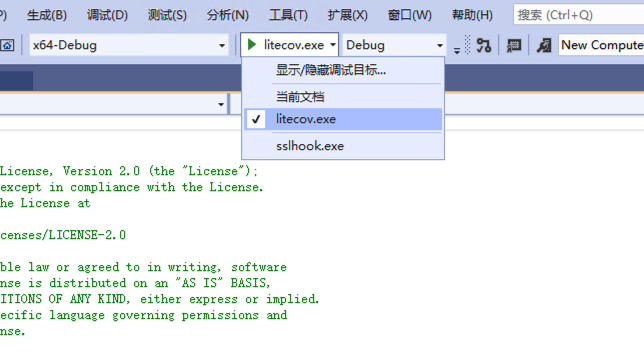

## TinyInst的插桩实现原理分析

Time: 2023.10.12  
Tags: 开发,代码分析,fuzzing  


### 0x00 前言

TinyInst 是一个基于调试器原理的轻量级动态检测库，由 Google ProjectZero 团队开源，支持 Windows、macOS、Linux 和 Android 平台。同 DynamoRIO、PIN 工具类似，解决二进制程序动态检测的需求，不过相比于前两者 TinyInst 更加轻量级，更加便于用户理解，更加便于程序员进行二次开发。

本文将通过分析 TinyInst 在 Windows 平台上的插桩源码，来理解 TinyInst 的基本运行原理；为后续调试 TinyInst 的衍生工具(如 Jackalope fuzzing 工具)或二次开发打下基础。

本文实验环境
```
Windows10 x64 专业版
Visual Studio 2019
TinyInst (commit:5a45ad40007e00fb2172dc4139ef1e2a9532992a)
```

### 0x01 编译运行
在搭建好 Visual Studio 和 Python3 的开发环境后，从 github 拉取 TinyInst 的源码：
```
git clone --recurse-submodules https://github.com/googleprojectzero/TinyInst.git
```

可以参考官方提供的 cmake 的编译流程，在 `Developer Command Prompt for VS 2019` 开发者命令行中：
```
# C:\Users\john\Desktop\TinyInst
mkdir build
cd buildmake 
cmake -G "Visual Studio 16 2019" -A x64 ..
cmake --build . --config Release
```

编译完成后，二进制文件位于 `[src]\build\Release\litecov.exe`。

这里我们使用 Visual Studio 来编译项目，以便于后续进行源码分析和调试；打开 Visual Studio 后使用 `文件-打开-CMake` 使用 `CMakeLists.txt` 文件加载 TinyInst 项目如下：
<div align="center">

</br>[1.使用vs加载CMakeLists项目]
</div>

其默认为 `x64-Debug` 的配置方案，使用 `生成-全部生成` 编译项目，二进制文件位于 `[src]\out\build\x64-Debug\litecov.exe`。

随后我们使用 Visual Studio 编译一个 HelloWorld 作为目标程序(Debug/x64)：
```
#include <stdio.h>

int main(int argc, char* argv[]) {
	printf("Hello World\n");
	return 0;
}
```

如下命令使用 `litecov.exe` 对目标程序 `HelloWorld.exe` 进行动态检测，发现了 282 条新路径：
```
.\litecov.exe -instrument_module HelloWorld.exe -trace_debug_events -- .\HelloWorld.exe
```

执行如下：
<div align="center">

</br>[2.litecov.exe运行测试]
</div>

>TinyInst 默认使用 basic-block(基础块) 覆盖统计，如上即产生了 282 个基础块覆盖。 

### 0x02 实现原理概要
通过官方文档的介绍(https://github.com/googleprojectzero/TinyInst#how-tinyinst-works)，我们可以大致了解其运行原理；TinyInst 以调试器的身份启动/附加目标程序，通过监视目标进程中的调试事件，如加载模块、命中断点、触发异常等，实现对目标程序的完全访问和控制，进而实现插桩和覆盖率收集等功能。

当 TinyInst 首次加载目标模块时，他会将目标模块中的代码段设置为不可执行(原始内存空间)，在后续执行流抵达后，目标程序将触发 `0xC0000005(Access Violation)` 异常；同时 TinyInst 还会在目标模块地址范围的 2GB 范围内，开辟内存空间以放置二进制重写的代码(工作内存空间)；

当执行流进入目标模块后，TinyInst 将收到目标程序抛出的 `0xC0000005` 的异常，此时 TinyInst 将从执行流的位置按 basic-block(基础块) 解析代码指令，在基础块头部添加插桩代码、修正末尾的跳转指令偏移，再将整块指令代码写入工作内存空间中，随后跟随跳转指令，递归发现、解析和重写所有的基本块代码。

最后 TinyInst 将目标程序的 `RIP` 寄存器指向二进制重写的代码的开始位置(工作内存空间)，目标程序真正开始运行，并在运行过程中完成覆盖率的记录。

简单梳理 TinyInst 的源码，程序入口位于 `tinyinst-coverage.cpp#main()`，按照类的继承关系，整体可以分为三大模块：
1. Debugger：底层的调试器实现，负责处理调试事件
2. TinyInst：继承于 Debugger，负责目标程序的访问和控制、插桩相关实现，是程序核心部分
3. LiteCov：继承于 TinyInst，负责覆盖率的相关实现

<div align="center">

</br>[3.核心类关系示意图]
</div>

有了以上基础了解后，下面我们就通过源码级的静态分析 + 动态调试来深入剖析 TinyInst 详细的实现原理。

### 0x03 调试器原理
TinyInst 基于调试器进行实现，我们先来简单了解调试器原理，TinyInst 在完成初始化操作后，会以 `DEBUG_PROCESS` 的方式启动目标程序，随后循环处理调试事件，以此方式访问目标程序的数据并控制目标程序的执行情况。

其底层调试器的简易实现，如下：
```
#include <Windows.h>
#include <stdio.h>

int main(int argc, char* argv[]) {
    STARTUPINFO si = { 0 };
    si.cb = sizeof(si);

    PROCESS_INFORMATION pi = { 0 };
    if (CreateProcess("HelloWorld.exe", "HelloWorld.exe", NULL, NULL, FALSE, DEBUG_PROCESS | DEBUG_ONLY_THIS_PROCESS, NULL, NULL, &si, &pi) == FALSE) {
        printf("CreateProcess failed : %d\n", GetLastError());
        return -1;
    }

    CloseHandle(pi.hThread);
    CloseHandle(pi.hProcess);

    BOOL waitEvent = TRUE;
    DEBUG_EVENT debugEvent;
    while (waitEvent == TRUE && WaitForDebugEvent(&debugEvent, INFINITE)) {
        DWORD status = DBG_CONTINUE;

        switch (debugEvent.dwDebugEventCode) {
        case CREATE_PROCESS_DEBUG_EVENT:
        case CREATE_THREAD_DEBUG_EVENT:
        case EXCEPTION_DEBUG_EVENT:
        case EXIT_PROCESS_DEBUG_EVENT:
        case EXIT_THREAD_DEBUG_EVENT:
        case LOAD_DLL_DEBUG_EVENT:
        case UNLOAD_DLL_DEBUG_EVENT:
        case OUTPUT_DEBUG_STRING_EVENT:
        case RIP_EVENT:
        default:
            printf("unhandle/unknown debug event\n");
        }

        if (waitEvent == TRUE) {
            ContinueDebugEvent(debugEvent.dwProcessId, debugEvent.dwThreadId, status);
        }
    }

    return 0;
}
```

在 TinyInst 中调试器实现的核心逻辑位于 `[src]\Windows\debugger.cpp# Debugger::DebugLoop()`，如下：
<div align="center">

</br>[4.TinyInst调试事件处理]
</div>

### 0x04 配置源码调试
上文我们通过 Visual Studio 加载了 TinyInst 项目，Visual Studio 能够很好的帮助我们进行静态分析，这里我们还需配置其源码的动态调试环境。

首先配置 cmake 项目的启动参数，在 Visual Studio 中右键 `CMakeLists.txt` 选择 `添加调试配置`，随后在 `launch.vs.json` 文件中添加启动参数如下：
```
{
  "version": "0.2.1",
  "defaults": {},
  "configurations": [
    {
      "type": "default",
      "project": "CMakeLists.txt",
      "projectTarget": "litecov.exe",
      "name": "litecov.exe",
      "args": [ "-instrument_module", "HelloWorld.exe", "-trace_debug_events", "--", ".\\HelloWorld.exe" ]
    }
  ]
}
```

随后设置启动项为 `litecov.exe`，如下：
<div align="center">

</br>[5.设置litecov启动项]
</div>

在 `tinyinst-coverage.cpp#main()` 打下断点，启动调试如下：
<div align="center">

</br>[6.源码动态调试]
</div>

至此 TinyInst 的分析环境我们搭建好了。

### 0x05 目标程序初始化
下面我们跟随 TinyInst 完整的执行流程来分析其实现。以 `.\litecov.exe -instrument_module HelloWorld.exe -trace_debug_events -- .\HelloWorld.exe` 命令启动后，其最终将调用 `CreateProcess()` 以调试模式启动目标程序，如下：
<div align="center">

</br>[7.CreateProcess启动目标程序]
</div>

此处调用栈为：
<div align="center">

</br>[8.启动目标程序的调用栈]
</div>

目标程序启动后，TinyInst 进入 `debugger.cpp#Debugger::DebugLoop()` 调试事件循环中；目标程序默认会在初始化前抛出 `0x80000003(EXCEPTION_BREAKPOINT)` 断点异常，TinyInst 接收到该断点异常后，从目标程序加载的模块中找到目标模块(`HelloWorld.exe`)，随后在目标模块的入口点(`start()`)添加 `0xCC` 断点指令，如下：
<div align="center">

</br>[9.在目标模块入口处设置断点]
</div>

随后，TinyInst 继续运行目标程序(默认断点无需额外处理)，目标程序执行流抵达目标模块后，将如期触发我们在 `start()` 设置的断点，TinyInst 接过控制权后，将调用核心插桩函数 `tinyinst.cpp#TinyInst::InstrumentModule()`，在该函数中调用 `ExtractCodeRanges()` 设置目标模块的代码段为 `可读可写不可执行` 权限，如下：
<div align="center">

</br>[10.设置代码段为不可执行]
</div>

这样操作的目的是当目标程序执行流抵达时，由于代码为不可执行权限，将抛出 `0xC0000005` 异常，从而将控制权转交给 TinyInst；

调用 `ExtractCodeRanges()` 后紧接着 TinyInst 将在目标模块前或后的 2GB 内存空间内申请空间，作为二进制重写的工作内存空间，其申请的大小为 `原始代码段大小 * 插桩指令放大系数4 + 全局跳转表大小`，其中全局跳转表项为固定值 `0x2000` 个，随后通过 `InitGlobalJumptable()` 初始化全局跳转表，如下：
<div align="center">

</br>[11.TinyInst工作内存空间初始化]
</div>

我们将在「0x07 全局跳转表」进行分析，接下来将先分析插桩操作。

### 0x06 二进制重写
TinyInst 采用的是二进制重写的方案进行插桩，紧接着上文的代码逻辑继续跟进；TinyInst 还原模块入口点的断点后继续执行目标程序，执行流抵达目标模块后抛出 `0xC0000005` 异常，随后控制权转交给 TinyInst，TinyInst 最终调用 `tinyinst.cpp#TinyInst::TryExecuteInstrumented()` 开始插桩操作，这里调用栈为：
<div align="center">

</br>[12.TryExecuteInstrumented调用栈]
</div>

跟入 `TinyInst::TryExecuteInstrumented()` 函数，最终调用 `TranslateBasicBlockRecursive()` 循环解析基础代码块(`basic-block`)，其中 `queue` 为待解析的基础块，由 `TranslateBasicBlock()` 进行解析当前基础块并添加新的基础块，如下：
<div align="center">

</br>[13.TranslateBasicBlock代码片段]
</div>

在 `TranslateBasicBlock()` 函数中，执行实际的插桩操作如下：
<div align="center">

</br>[14.插桩和指令代码解析片段]
</div>

首先使用 `InstrumentBasicBlock()` 在基础块的头部写入插桩代码 `mov` 指令，这里的地址是 TinyInst 在目标模块的工作内存空间初始化的覆盖率 bitmap， 并且 TinyInst 将基础块地址和 bitmap 的索引一一对应，当执行到该基础块时，将在 bitmap 中设置为 1，TinyInst 就以此方法进行覆盖率的记录。(这里 `mov` 的地址为占位符，根据实际偏移进行修正)
```
// mov byte ptr [rip+offset], 1
// note: does not clobber flags
static unsigned char MOV_ADDR_1[] = {0xC6, 0x05, 0xAA, 0xAA, 0xAA, 0x0A, 0x01};
```

随后通过 `while` 循环逐条解析并复制指令，直到遇到跳转指令(如：`jmp/call/ret`)，然后在 `HandleBasicBlockEnd()` 函数中处理跳转指令，如下处理有条件的跳转指令：
<div align="center">

</br>[15.处理有条件的跳转指令]
</div>

在 TinyInst 中将跳转指令分为 4 个大类：
1. 返回指令：`ret`
2. 有条件的跳转指令: `je / jp / ...`
3. 无条件的跳转指令: `jmp`
4. 函数调用指令: `call`

不同的跳转指令有不同的处理方式，但其本质都是为了连接上下文以及修正跳转地址；但这里还有更为重要的一个操作是区分远跳转(外部调用)和近跳转(内部调用)，若为近跳转则拼接基础块代码即可，若为远跳转，则将其调用地址改为全局跳转表的地址，由全局跳转表完成后续的调用过程。

循环发现并解析完所有的基础块后，再统一修复在解析过程中待定的跳转地址，最后将二进制重写的代码写入目标模块的工作内存空间内，修改目标程序的 `RIP` 到二进制重写的代码的入口，随后目标程序正式开始执行。

**二进制重写示例**  
以 `HelloWorld.exe` 为例，我们这里可以通过比较原始代码和二进制重写的代码，来演示二进制重写的过程；如上文描述，当 TinyInst 收到 `HelloWorld.exe` 的 `0xC0000005` 异常，此时 `RIP` 正位于程序入口处 `start()`，其原始代码如下：
<div align="center">

</br>[16.HelloWorld的start代码]
</div>

以及其 `jmp` 后的 `mainCRTStartup()` 原始代码如下：
<div align="center">

</br>[17.HelloWorld的mainCRTStartup代码]
</div>

经过 TinyInst 二进制重写后，`start()` 和 `mainCRTStartup()` 对应的代码如下：
<div align="center">

</br>[18.HelloWorld的二进制重写代码]
</div>

>这里有个小技巧，我们可以使用 WinDBG 非侵入模式的观测被调试程序的内存，如上我们观测 `HelloWorld.exe` 中二进制重写的代码；不过需要注意一点，WinDBG detach 后目标程序才可以继续运行。

### 0x07 全局跳转表
经过以上二进制重写后，目标模块可以顺利执行模块本身的代码，但还无法处理外部调用，这就需要全局跳转表来完成。

我们回到全局跳转表 `InitGlobalJumptable()` 初始化函数，其首先在二进制重写的内存空间前 0x2000 项中循环写入一个跳转地址，该跳转地址为 `内存起始地址 + 指针大小(8) * 0x2000 + 0x08`，并在跳转地址写入 `0xCC` 断点指令，同时在第 0x2000 项的位置写入全局跳转表的起始地址，如下：
<div align="center">

</br>[19.InitGlobalJumptable代码]
</div>

初始化后的全局跳转表示例如下：
```
0:000> dq 0x00007ff73b950000
00007ff7`3b950000  00007ff7`3b960008 00007ff7`3b950008
00007ff7`3b950010  00007ff7`3b960008 00007ff7`3b950008
00007ff7`3b950020  00007ff7`3b960008 00007ff7`3b950008
......
00007ff7`3b95fff0  00007ff7`3b960008 00007ff7`3b950008
00007ff7`3b960000  00007ff7`3b950000 xxxxxxxx`xxxxxxcc
```

在「0x06 二进制重写」解析基础块的过程中，若发现目标模块进行远跳转(外部调用)则会使用全局跳转表来完成，以 `call(far)` 指令为例，TinyInst 将其转换为：
```
# call function_address

    call label
    jmp  return_address
label:
    pushfq
    push rax
    push rbx
    mov  rax, function_address
    mov  rbx, rax
    and  rbx, 0x0FFF8 (length of JUMPTABLE)
    add  rbx, JUMPTABLE_START_ADDRESS
    jmp  rbx
```

以上二进制重写的代码主要操作为：保存 `eflags/rax/rbx` 到栈中，将要调用的函数地址 `function_address` 保存在 `rax` 中，随后将其与全局跳转表长度 `0x0FFF8` 计算 hash 并保存在 `rbx` 中，从 `rbx` 继续运行。

全局跳转表中所对应的 hash 位置，默认指向跳转地址，其对应的指令为 `0xCC`，TinyInst 捕获该断点异常后，调用 `tinyinst.cpp#TinyInst::HandleIndirectJMPBreakpoint` 继续完成远跳转流程；跟进 `tinyinst.cpp#TinyInst::AddTranslatedJump` 函数如下：
<div align="center">

</br>[20.AddTranslatedJump代码片段]
</div>

该函数将写入如下函数调用指令：首先通过 `rax` 检查目标函数地址(用于 hash 碰撞检测)，随后从栈中还原 `rbx/rax/eflags`，最终调用目标函数执行，完成整个外部函数调用流程。
```
    cmp rax, original_address
    je  label
    jmp JUMPTABLE_JUMP_ADDRESS
label:
    pop rbx
    pop rax
    popfq
    jmp [actual_address]
    [original_address]
    [actual_address]
```

>这里的实现较为复杂，原因是 TinyInst 兼容实现了 `jmp` 指令的远跳转，本文这里不进行拓展分析。

除此之外，该函数还会修正全局调用表中对应的 hash 位置，再次调用该函数时将直接跳转至以上代码，以代码缓存的方式提高执行性能。

### 0x08 执行流程示意图
通过以上「二进制重写」和「全局跳转表」的相互配合，TinyInst 实现了基本的动态检测功能；下面我们用状态图来总结概括 TinyInst 的插桩实现流程，如下：
<div align="center">

</br>[21.TinyInst插桩流程]
</div>

在以上 TinyInst 的控制下，目标程序的执行流程如下：
<div align="center">

</br>[22.目标程序执行流程]
</div>

### 0x09 References
https://github.com/googleprojectzero/TinyInst  
https://www.anquanke.com/post/id/234925  