## Ubuntu图片查看器EoG的fuzzing

Time: 2023.07.14  
Tags: fuzzing  


### 0x00 前言

`Eye of Gnome Image Viewer` (EoG) 是 Ubuntu 中的默认图片查看应用程序，作为图片查看器同时开放源码，非常适合 fuzzing 漏洞挖掘入门。

在 2022.12 月学习 fuzzing 时，尝试使用 afl++ 对 EoG 进行漏洞挖掘，虽然整个过程较为简单，但仍有不少值得记录的点，遂在这个时间点进行复盘时重新梳理并整理成文。

本文实验环境：
```
Ubuntu 22.04 x64 (Desktop)
EoG 42.0 (build-in)
eog 43.2 (compile from source)
```

### 0x01 搭建编译环境
我们安装 Ubuntu 22.04 桌面版后，其内置有 `EoG 42.0` 软件，不过我们可以直接下载源码进行白盒 fuzzing，能够便于我们分析软件逻辑同时提高 fuzzing 的运行效率。

从 github 拉取 `EoG` 的代码，并切换至 `43.rc` 分支：
```
git clone https://gitlab.gnome.org/GNOME/eog.git
git checkout 43.rc
```

`EoG` 采用 meson/ninja 构建和编译项目，安装对应的依赖如下：
```
# require meson (>= 0.58.0)
apt install python3 meson ninja-build

# require cmake (>= 3.17)
apt install cmake
```

安装依赖组件库如下：
```
apt install libglib2.0-dev libgnome-desktop-3-dev libpeas-dev libhandy-1-dev libexif-dev liblcms2-dev libexempi-dev librsvg2-dev itstool gettext
```

使用如下命令构建 `EoG`，成功编译后生成的二进制文件位于：`[src]/build/src/eog`：
```
meson build -Dlibportal=false
ninja
```

>编译过程中可能会出现 `FAILED: src/Eog-3.0.gir` 的错误，不过这里不影响我们的实验。

运行如下：
<div align="center">
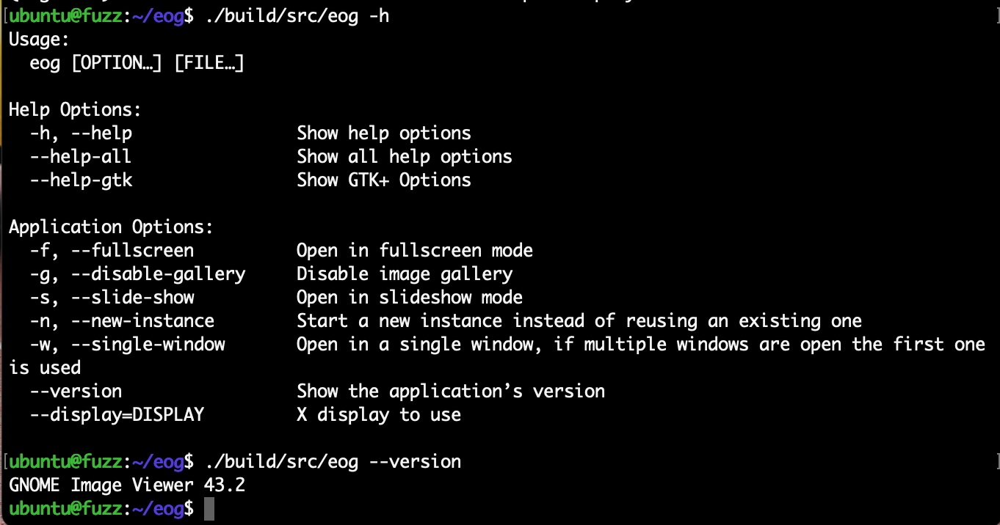
</br>[1.测试运行源码编译的EoG]
</div>

在命令行使用 DEBUG 模式运行 `EoG` 打开图片：
```
cd [src]/build/
EOG_DEBUG=1 ./src/eog ../tests/gnome-logo.png
```

<div align="center">
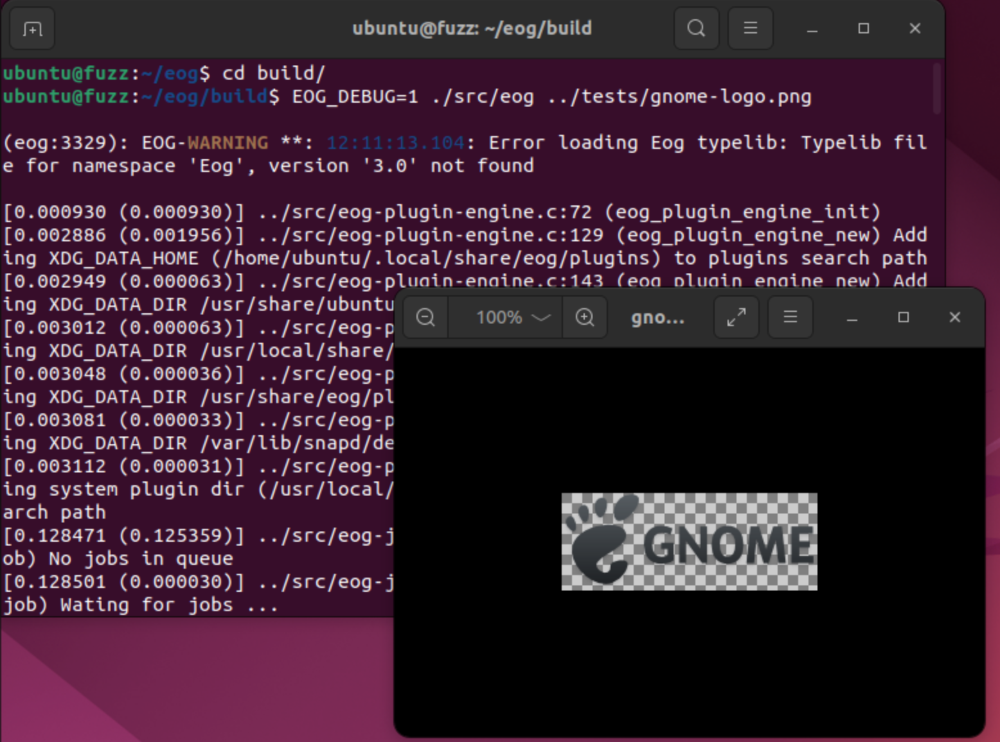
</br>[2.命令行 EoG 打开图片]
</div>

>若使用 ssh 访问 Ubuntu，使用命令行运行 `EoG` 打开图片时可能提示错误 `(eog:2404): Gtk-WARNING **: 11:53:14.884: cannot open display:`，说明 GUI 还未初始化，在 GUI 登陆一次系统后即可解决。

### 0x02 源码分析
根据源码分析 `EoG` 的大致逻辑，编写用于 fuzzing 的 harness；通过 `src/main.c#main()` 跟进分析，可以发现整个项目是基于 GTK 进行开发的，在 `eog-application.c` 中找到信号注册函数：
<div align="center">
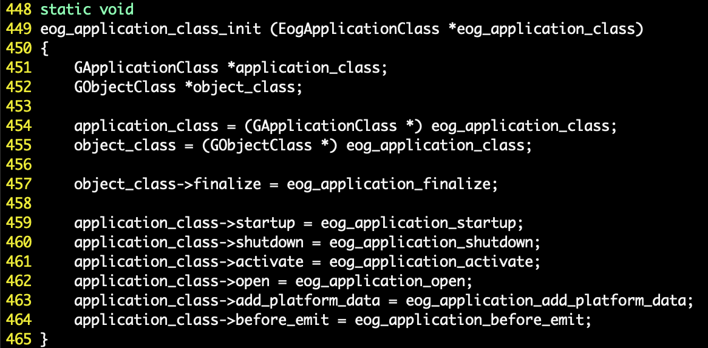
</br>[3.eog_application_class_init源码]
</div>

当我们打开图片时，GTK 将首先进行窗口初始化操作，然后按 `open` 信号调用 `eog-application.c#eog_application_open()` 函数加载文件，最终调用 `eog-window.c#eog_window_open_file_list()` 函数初始化 `eog_job` 对象，并添加到 `eog-job-scheduler` 调度队列中：
<div align="center">
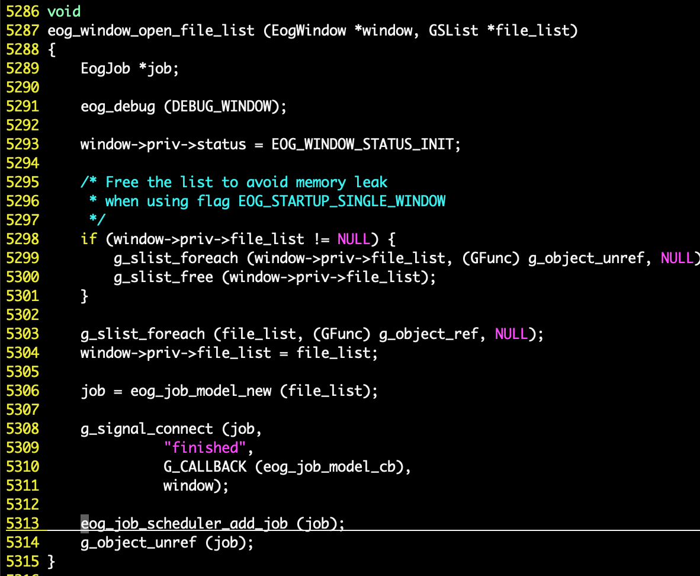
</br>[4.eog_window_open_file_list源码]
</div>

使用 GDB 动态调试获取此处的调用栈如下：
```
$ cd [src]/build
$ gdb src/eog

# 进入 gdb interactive shell
$ set args ../tests/gnome-logo.png

# eog 主要逻辑实现都在 libeog.so 中，打断点前注意先完成 so 的加载
$ start
$ break eog-window.c:5287
$ run
```

其调用栈如下：
<div align="center">
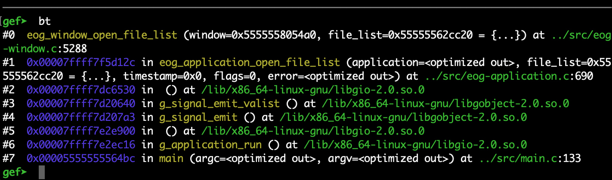
</br>[5.添加eog-job时的调用栈]
</div>

当 `eog_job_scheduler` 接收到 `job` 随即进行图片的加载，完成加载后触发 `finished` 信号进行 `eog_job_model_cb()` 回调，然后再创建 `eog_job_load_new` 的任务，最终可以找到 `eog_image.c#eog_image_real_load()` 为实际加载解析图片的入口函数，通过 GDB 动态调试获取其调用栈如下：
```
$ break eog-image.c:960
$ run
```

其调用栈如下：
<div align="center">
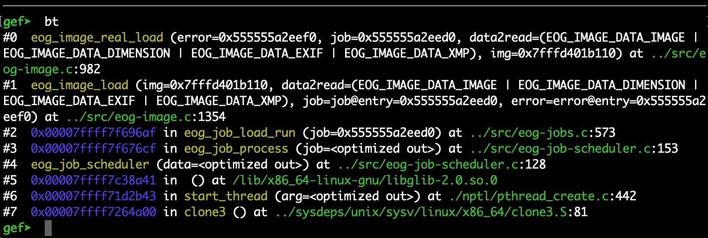
</br>[6.eog_image_real_load调用栈]
</div>

### 0x03 harness
在大致了解 EoG 的执行流程后，定位到关键的图像解析函数 `eog_image_real_load()`，我们可以改写 `src/main.c#main()` 函数，编写用于 fuzzing 的 harness 如下：
```
// harness

#include "eog-debug.h"
#include "eog-enums.h"
#include "eog-image.h"
#include "eog-jobs.h"

#include <stdio.h>

#include <glib.h>

int main(int argc, char* argv[]) {
    printf("harness\n");

    //
    if (argc < 2) {
        printf("eog <image-path>\n");
        return 0;
    }

    //
    eog_debug_init();

    while (__AFL_LOOP(1000)) {
        //
        GFile *file = NULL;
        file = g_file_new_for_path(argv[1]);

        //
        EogImage *image = NULL;
        image = eog_image_new_file(file, "test");

        //
        EogJobModel *jobm;
        EogJob *job;
        jobm = g_object_new(EOG_TYPE_JOB_MODEL, NULL);
        job = EOG_JOB(jobm);

        //
        gboolean success = FALSE;
        EogImageData data2read = EOG_IMAGE_DATA_ALL;
        success = eog_image_load(image, data2read, job, &job->error);
        printf("success = %d\n", success);
    }

    return 0;
}
```

我们可以复用其编译脚本进行编译：
```
# 进入源码目录，删除已构建的 build 目录
$ cd [src] && rm -rf build/
# 使用 afl-gcc-fast 构建项目
$ CC=afl-gcc-fast meson build -Dlibportal=false
# 编译项目
$ ninja
```

运行 harness 如下：
<div align="center">
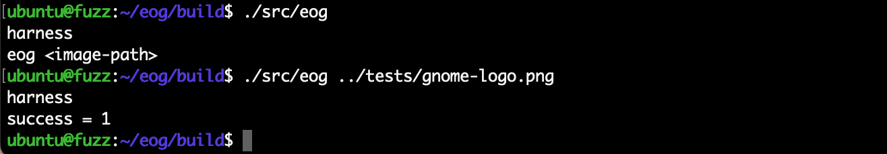
</br>[7.harness运行测试]
</div>

### 0x04 fuzzing
我们通过 https://github.com/MozillaSecurity/fuzzdata 手动选取了一些文件作为种子文件：
<div align="center">
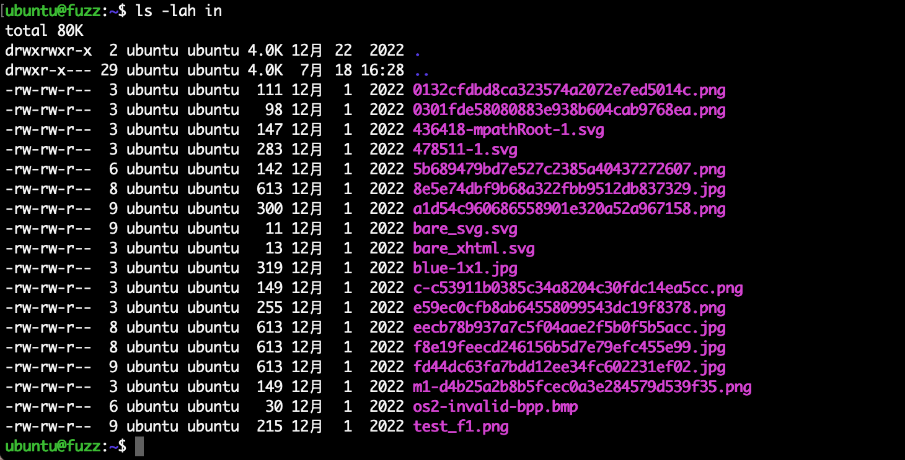
</br>[8.准备eog的种子文件]
</div>

>这里还可以添加更多的种子文件，并增加对种子文件进行去重和最小化处理。

构建工作目录如下：
```
.
├── AFLplusplus
├── eog
├── in
└── out
```

启动 fuzzing 如下：
```
# 启动 master
$ AFLplusplus/afl-fuzz -M 00 -i in/ -o out/ -t 10000 eog/build/src/eog @@
# 启动 slaver
$ AFLplusplus/afl-fuzz -S 01 -i in/ -o out/ -t 10000 eog/build/src/eog @@
```

执行如下：
<div align="center">
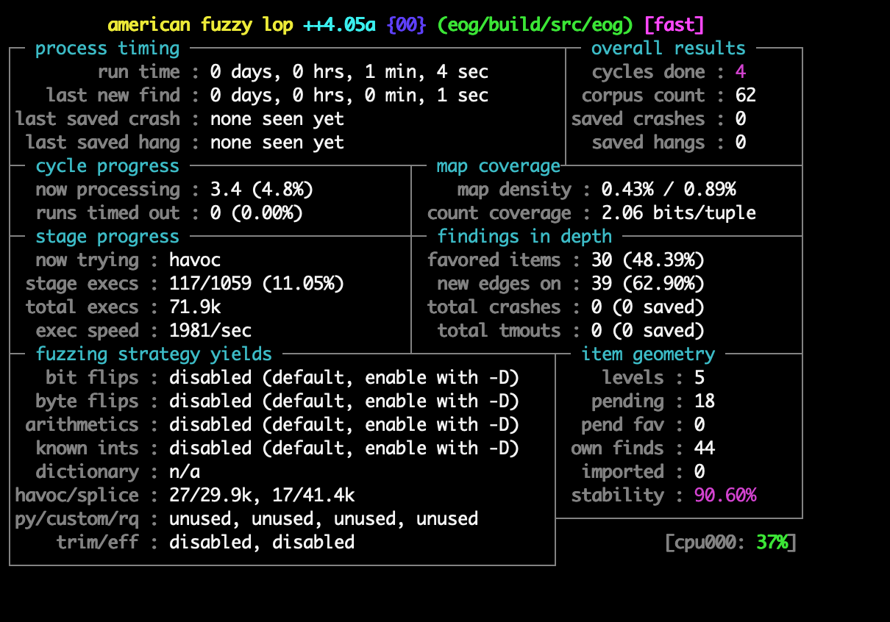
</br>[9.对eog进行fuzzing]
</div>

经过 8C8G 主机两个星期的 fuzzing，我们找到了两个内存泄漏问题，虽然不是直接的内存损坏问题，但其会造成 100% 的内存占用，最终 crash。

### 0x05 g_content_type_guess的内存占用
其 [g_content_type_guess_bug_poc.jpeg](./g_content_type_guess_bug_poc.jpeg) crash 文件如下：
<div align="center">
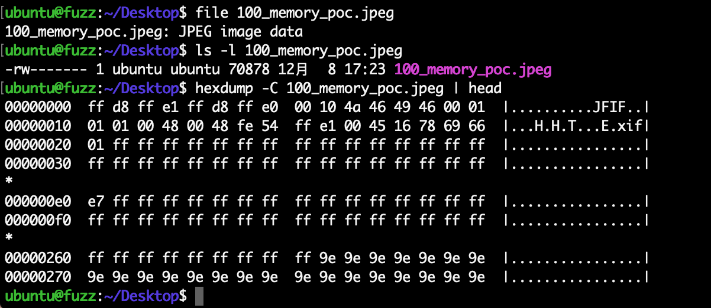
</br>[10.g_content_type_guess的bug poc]
</div>

使用 EoG 打开该图片，将引发 100% 的内存占用：
<div align="center">
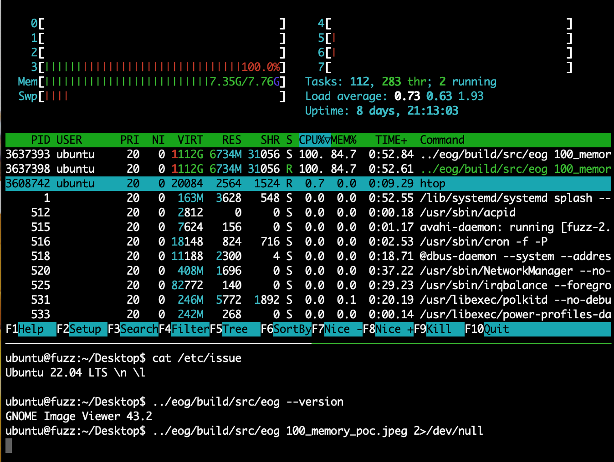
</br>[11.g_content_type_guess 100%内存占用]
</div>

粗略分析了 bug 的原因，发现问题出在 `eog-image.c` 下的 `eog_image_real_load()` 函数中，更准确地说是在 `while (!priv->cancel_loading) {}` 代码段中：

<div align="center">
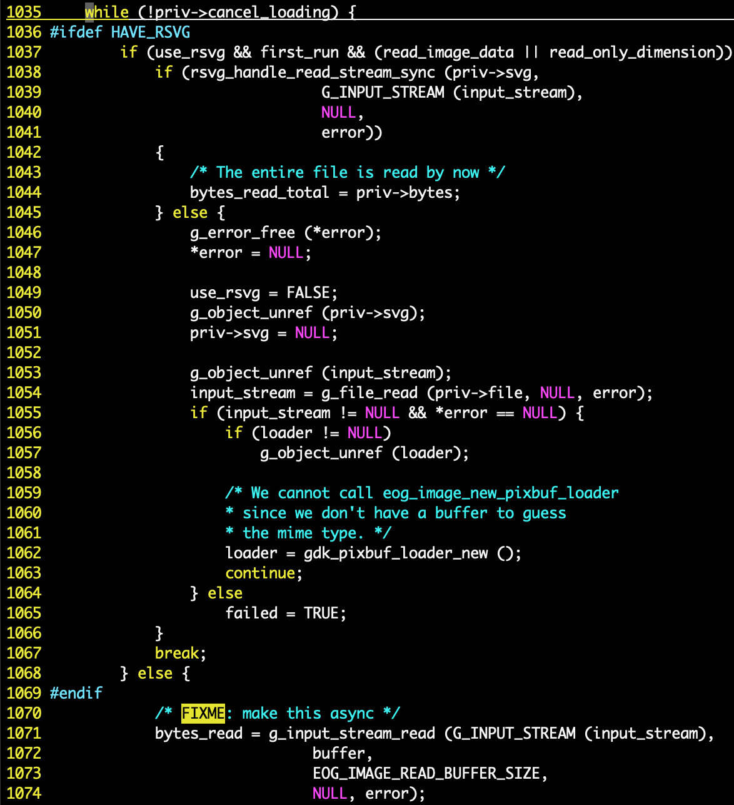
</br>[12.g_content_type_guess bug处源码]
</div>

在此代码中，每轮从文件（`input_stream`）中读取最多 64kb 的数据，然后通过 `g_content_type_guess()` 猜测文件类型，并通过 `eog_image_update_stream()` 更新文件类型，并可能重置 `input_stream` 的偏移;

在 PoC 文件中，前 64KB 内容被猜测为 "image-jpeg"，其余部分被猜测为 "image/x-tga"，两部分类型不一致，`eog_image_update_stream()` 会重置 `input_stream` 值，所以这里形成死循环；

在每次循环中，在猜测文件内容之前都要通过 `gdk_pixbuf_loader_write()`函数读入文件内容，这里会不断申请内存空间，导致内存占用。死循环加上内存申请，最终造成 100% 的内存占用，引发操作系统的 OOM(out of memory) kill。

我们可以使用如下 PATCH 进行临时修补，以便继续进行 fuzzing：
```
diff --git a/src/eog-image.c b/src/eog-image.c
index fc5368c3..7d98dbb0 100644
--- a/src/eog-image.c
+++ b/src/eog-image.c
@@ -1032,7 +1032,13 @@ eog_image_real_load (EogImage     *img,
        if (read_image_data || read_only_dimension)
                loader = eog_image_new_pixbuf_loader (img, &use_rsvg, mime_type, error);
 
+    gint reset_count = 0;
        while (!priv->cancel_loading) {
+        eog_debug_message (DEBUG_IMAGE_LOAD, "FLAG reset_count = %d", reset_count);
+        if (reset_count > 10) {
+            eog_debug_message (DEBUG_IMAGE_LOAD, "FLAG patch, reset_count > %d", reset_count);
+            return FALSE;
+        }
 #ifdef HAVE_RSVG
                if (use_rsvg && first_run && (read_image_data || read_only_dimension)) {
                        if (rsvg_handle_read_stream_sync (priv->svg,
@@ -1097,6 +1103,7 @@ eog_image_real_load (EogImage     *img,
 
                                        if (!uncertain &&
                                            eog_image_update_stream (img, mime_type, new_mimetype, input_stream)) {
+                        reset_count += 1;
                                                g_error_free (*error);
                                                *error = NULL;
                                                g_free (mime_type);
```

### 0x06 gdk-pixbuf库的内存占用
这个 100% 内存占用的问题是由 EoG 的依赖库 `gdk-pixbuf 2.42.8` 引发的，Ubuntu22.04 的中 EoG 的默认版本为 `42.0`，默认依赖 `gdk-pixbuf 2.42.8`。

补充实验环境：
```
gdk-pixbuf 2.42.8
gdk-pixbuf 2.42.10
```

首先查看 [gdk-pixbuf-bug-poc.jpeg](./gdk-pixbuf-bug-poc.jpeg) crash 文件如下：
<div align="center">
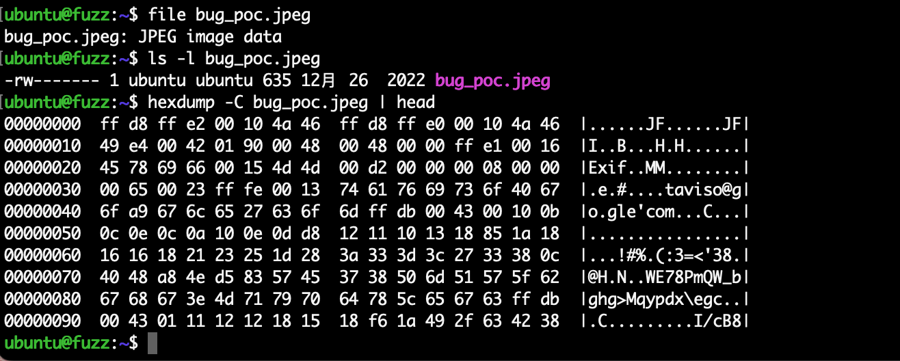
</br>[13.gdk-pixbuf的bug poc]
</div>

使用 EoG 打开该图片，将引发 100% 的内存占用：
<div align="center">
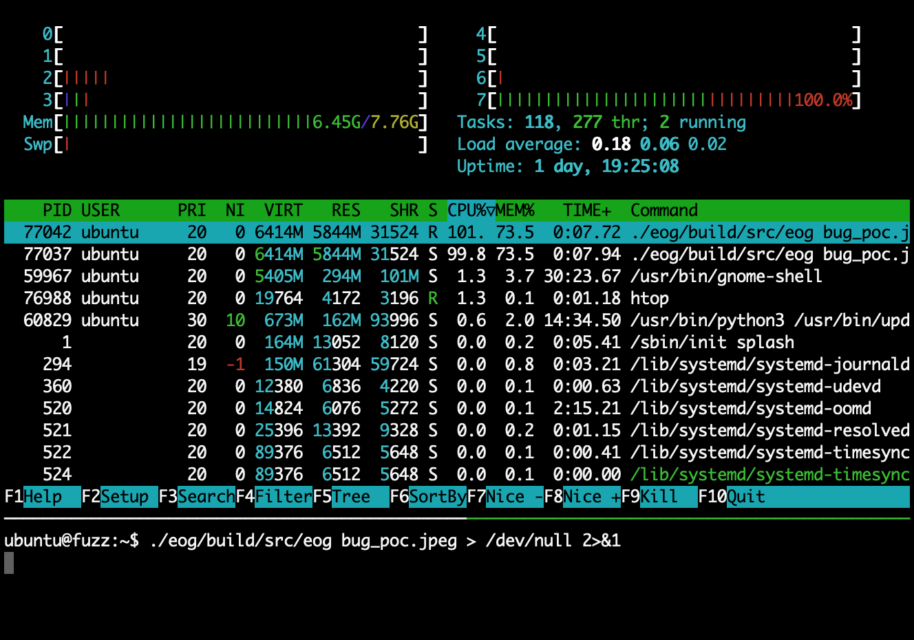
</br>[14.gdk-pixbuf 100%内存占用]
</div>

通过源码调试发现其位于 `eog-image.c#eog_image_real_load()` 下：
<div align="center">

</br>[15.eog_image_real_load bug触发位置]
</div>

由 so 库函数 `gdk_pixbuf_loader_write` 触发，其位于 `libgdk_pixbuf-2.0.so.0`：
<div align="center">

</br>[16.ldd查看eog依赖库]
</div>

根据 `strings` 结果和 lib 库名称 `libgdk_pixbuf-2.0.so.0.4200.8` 可以推测其版本为 `2.42.8`；下载 `gdk_pixbuf-2.42.8` 源码(https://gitlab.gnome.org/GNOME/gdk-pixbuf) 并编译，使用 `LD_LIBRARY_PATH` 优先加载编译版本的 so 库：
```
$ LD_LIBRARY_PATH=./gdk-pixbuf-2.42.8/build/gdk-pixbuf/ ./eog_fuzz/build/src/eog bug_poc.jpeg
```

可以复现该 bug，同样通过 gdb 调试 EoG，启动后添加 `gdk-pixbuf-2.42.8` 源码路径，可以源码调试 `gdk-pixbuf`：
```
# gdb console
$ set environment LD_LIBRARY_PATH=gdk-pixbuf-2.42.8/build/gdk-pixbuf/
$ set directories gdk-pixbuf-2.42.8/
```

如下：
<div align="center">

</br>[17.gdk-pixbuf源码调试]
</div>

这里未深入分析 bug 原因，在 `gdk-pixbuf` gitlab 上发现前几个 commit 提交了关于内存限制的补丁，如下：
```
diff --git a/gdk-pixbuf-2.42.8/gdk-pixbuf/io-jpeg.c b/gdk-pixbuf-2.42.10/gdk-pixbuf/io-jpeg.c
index 48b1637..3841fc0 100644
--- a/gdk-pixbuf-2.42.8/gdk-pixbuf/io-jpeg.c
+++ b/gdk-pixbuf-2.42.10/gdk-pixbuf/io-jpeg.c
@@ -1090,6 +1090,9 @@ gdk_pixbuf__jpeg_image_load_increment (gpointer data,
                        jpeg_save_markers (cinfo, JPEG_COM, 0xffff);
                        rc = jpeg_read_header (cinfo, TRUE);
                        context->src_initialized = TRUE;
+
+                        /* Limit to 1GB to avoid OOM with large images */
+                        cinfo->mem->max_memory_to_use = 1024 * 1024 * 1024;
                        
                        if (rc == JPEG_SUSPENDED)
                                continue;
```

进一步跟进源码，其 `struct jpeg_decompress_struct cinfo` 位于 `libjpeg` 库内，在解析 jpeg 文件时可对内存使用量进行限制。

下载 `gdk-pixbuf 2.42.10` 源码并编译，测试发现 bug 已修复
```
$ LD_LIBRARY_PATH=./gdk-pixbuf-2.42.10/build/gdk-pixbuf/ ./eog_fuzz/build/src/eog bug_poc.jpeg
```

如果要继续进行 fuzzing，我们可以通过 `LD_LIBRARY_PATH` 启动 `afl-fuzz`：
```
$ LD_LIBRARY_PATH=./gdk-pixbuf-2.42.10/build/gdk-pixbuf/ afl-fuzz -i in/ -o out/ ./eog_fuzz/build/src/eog @@
```

或者在 EoG 编译时直接指定 `gdk-pixbuf` so 库路径(使用修复版本 `gdk-pixbuf 2.42.10`)：
```
diff --git a/meson.build b/meson.build
index dea7b23a..55a34f9e 100644
--- a/meson.build
+++ b/meson.build
@@ -119,7 +119,8 @@ dependency('shared-mime-info', version: '>= 0.20')
 
 common_deps = [
   gio_dep,
-  dependency('gdk-pixbuf-2.0', version: '>= 2.36.5'),
+  #dependency('gdk-pixbuf-2.0', version: '>= 2.36.5'),
+  cc.find_library('gdk_pixbuf-2.0', dirs: '/home/ubuntu/gdk-pixbuf-2.42.10/build/gdk-pixbuf/'),
   dependency('glib-2.0', version: glib_req_version),
   dependency('gtk+-3.0', version: '>= 3.24.15'),
   dependency('libhandy-1', version: '>= 1.5.0'),
```

随后再正常编译即可：
```
CC=afl-gcc-fast meson build -Dlibportal=false
ninja
```

>由于不同编译工具对 so 库的指定方式不同，所以只有熟悉编译工具才能顺利的修改 so 库依赖；除此之外，还可以采用二进制的 patch 的方式修改 so 库依赖，可以参考 https://github.com/NixOS/patchelf。

### 0x07 References
https://gitlab.gnome.org/GNOME/eog.git  
https://www.linuxfromscratch.org/blfs/view/svn/gnome/eog.html  
https://blog.michinari-nukazawa.com/2020/03/eogeye-of-gnome.html  
https://cve.mitre.org/cgi-bin/cvekey.cgi?keyword=eog  
https://docs.gtk.org/gtk4/getting_started.html  
https://zhengmingpei.github.io/GTK-3-Chinese-Reference-Manual/content/building_app/asmallapp.html  
https://www.cnblogs.com/ztguang/p/12645234.html  
https://github.com/MozillaSecurity/fuzzdata  