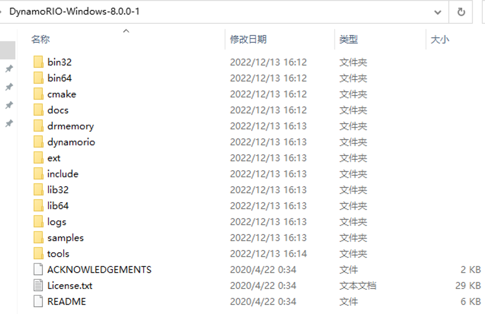
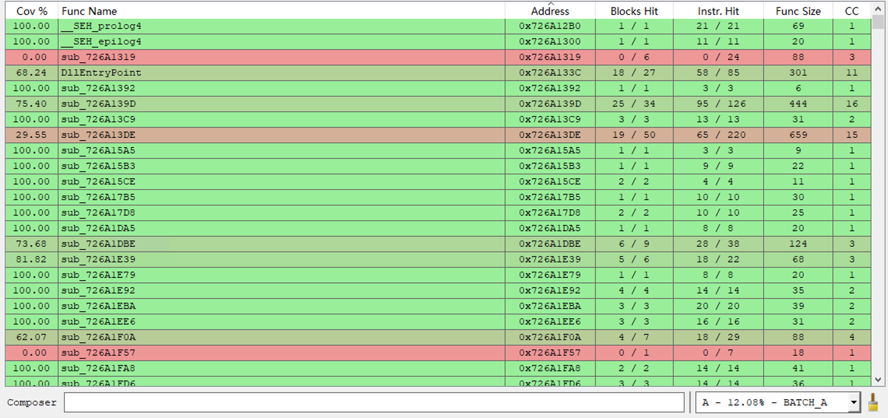
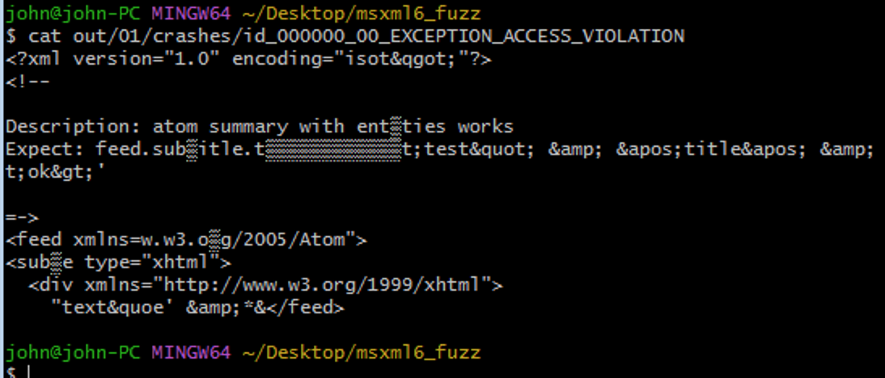

## WinAFL环境配置和基本使用

Time: 2022.12.12  
Tags: fuzzing  


### 0x00 前言

在本文之前，我们已经学习和掌握了 fuzz 的基本思想，并通过 `afl/afl++` 对 Linux 平台的程序进行了 fuzz 尝试，熟悉了 fuzz 的基本工具使用，后续只要不断的进行实操，一定会收获有价值的 crash 的。但是对于 Linux 平台的程序进行 fuzz，并不是一件收益很高的事情，因为 Linux 下大部分都是开源软件，对于开源软件我们有很多种方式进行漏洞挖掘，如 SAST(静态应用程序安全测试)或者直接人工代码审计。

而 fuzz 实际上不关心软件是否有源码，对于 `afl/afl++` 而言有源码更方便进行代码插桩，而没有源码则可以使用 `qemu_mode` 模式进行 fuzz；黑盒下没有较好的漏洞挖掘方法，所以面向黑盒的 fuzz 是一件极具收益的事情。

Windows 平台则是天然的黑盒 fuzz 环境，目前已经有大量的 Windows 软件的漏洞通过 fuzz 挖掘出来；本文在掌握 fuzz 基本思想的基础上，从 Linux 平台转至 Windows 平台，从 `afl/afl++` 转至 `winafl`，介绍并实验 `winafl` 的基本使用。

### 0x01 winafl概要
`afl/afl++` 本身是面向 Linux 平台的，并不能对 Windows 平台的程序进行 fuzz 测试，Google 的工程师基于 `afl` 的思想和源码，开源 `winafl` 工具以面向 Windows 黑盒 fuzz。

`winafl` 的基本使用和 `afl/afl++` 几乎一致，但是由于其底层实现逻辑完全不同，使用起来的感觉还是存在明显差异；不过 fuzz 的思想是不变，在我们 `afl/afl++` 的基础上很容易很够理解和上手 `winafl`。

本文测试环境
```
Windows10 x64 1903
Visual Studio 2022
DynamoRIO-8.0.0-1
winafl-master(4071f169a161b6368c09fd3ff1fd742c08164fa4)
IDA 7.5
```

### 0x02 winafl环境配置
**1.Visual Studio**  
在配置 `winafl` 之前，我们首先配置下 `Visual Studio 2022` 的 C/C++ 开发环境(https://visualstudio.microsoft.com/)，用于后续编译 `winafl`，同时也便于常规软件的 harness 开发和测试。

按 Visual Studio 官方教程，自动下载安装 C/C++ 开发环境：
<div align="center">

</br>[1.安装VisualStudio]
</div>

**2.DynamoRIO**  
从 github 拉取的 `winafl`，里面已经提供了 `bin32/bin64` 的二进制文件 `afl-fuzz` 等等，但并不能直接用于黑盒 fuzz，在 Windows 平台上 `afl` 依赖于 `DynamoRIO` 进行指令插桩。

可以通过源码编译 `DynamoRIO` 或直接从官网下载 `DynamoRIO` 的二进制(https://dynamorio.org/)，我们这里下载 `DynamoRIO-Windows-8.0.0-1` 并解压至桌面。
<div align="center">

</br>[2.配置DynamoRIO]
</div>

如果源码编译 `DynamoRIO` 的话，需要提前安装 `cmake`；我们可以使用 `Visual Studio` 附带的或者从官网下载安装 `cmake`(https://cmake.org/)，用于编译带 `DynamoRIO` 支持的 `winafl`。
<div align="center">

</br>[3.安装cmake]
</div>

>在使用 IntelPT 的情况下，由于 DynamoRIO 运行需要 IntelPT 硬件支持，虚拟机环境下需要合适的 CPU 类型，否则 DynamoRIO 会报错退出。(如在 Intel CPU 的 ProxmoxVE 环境下，虚拟机应选择 host 类型才能正常使用 DynamoRIO)

**3.winafl**  
从 github 拉取 `winafl` 源码：
```
$ git clone git@github.com:googleprojectzero/winafl.git
$ cd winafl
# 拉取 Intel PT 相关支持
$ git submodule update --init --recursive
```

编译 32 位、DynamoRIO支持、IntelPT支持的 `winafl`：
```
$ mkdir build32
$ cd build32
$ cmake -G "Visual Studio 17 2022" -A Win32 .. -DDynamoRIO_DIR=/c/Users/john/Desktop/DynamoRIO-Windows-8.0.0-1/cmake/ -DUSE_COLOR=1 -DINTELPT=1
$ cmake --build . --config Release
```

编译 64 位、DynamoRIO支持、IntelPT支持的 `winafl`：
```
$ mkdir build64
$ cd build64
$ cmake -G "Visual Studio 17 2022" -A x64 .. -DDynamoRIO_DIR=/c/Users/john/Desktop/DynamoRIO-Windows-8.0.0-1/cmake/ -DUSE_COLOR=1 -DINTELPT=1
$ cmake --build . --config Release
```

<div align="center">

</br>[4.winafl编译完成]
</div>

成功完成后，即完成了 `winafl` 的环境配置。

### 0x03 辅助工具
fuzz 中除了 `winafl`，我们还需要一些辅助工具：

**IDA**  
使用 IDA 可以对程序进行静态分析，以便于我们梳理程序逻辑，编写 harness 等；直接安装即可。

IDA 中还可以配置 `Lighthouse` 插件(https://github.com/gaasedelen/lighthouse)，用于 fuzz 的覆盖率分析，下载解压将 `plugins` 文件内容复制到 IDA 的 `plugins` 目录下，完成安装。

**WinDBG**  
通过官网下载 WinDBG 进行安装(https://learn.microsoft.com/zh-cn/windows-hardware/drivers/debugger/debugger-download-tools)：
<div align="center">

</br>[5.安装WinDBG]
</div>

配置微软符号服务器，可以便于我们跟踪调试程序，配置环境变量如下：
```
_NT_SYMBOL_PATH
SRV*C:\Symbols*http://msdl.microsoft.com/download/symbols
```

打开 WinDBG 随便打开个二进制文件，可以看到符号配置成功，在使用过程中 WinDBG 会自动从微软服务器下载需要的符号内容：
<div align="center">

</br>[6.WinDBG符号配置]
</div>

### 0x04 fuzz test
环境配置成功后，我们从 fuzz test 来熟悉 `winafl` 的操作；`winafl` 源码中提供了测试程序 `test.c`，其源码如下：
```
/*
   WinAFL - A simple test binary that crashes on certain inputs:
     - 'test1' with a normal write access violation at NULL
     - 'test2' with a /GS stack cookie violation
   -------------------------------------------------------------

   Written and maintained by Ivan Fratric <ifratric@google.com>

   Copyright 2016 Google Inc. All Rights Reserved.

   Licensed under the Apache License, Version 2.0 (the "License");
   you may not use this file except in compliance with the License.
   You may obtain a copy of the License at

       http://www.apache.org/licenses/LICENSE-2.0

   Unless required by applicable law or agreed to in writing, software
   distributed under the License is distributed on an "AS IS" BASIS,
   WITHOUT WARRANTIES OR CONDITIONS OF ANY KIND, either express or implied.
   See the License for the specific language governing permissions and
   limitations under the License.

*/

#define _CRT_SECURE_NO_WARNINGS
#include <stdio.h>
#include <windows.h>
#include <string.h>


int __declspec(noinline) test_target(char* input_file_path, char* argv_0)
{
	char *crash = NULL;
	FILE *fp = fopen(input_file_path, "rb");
	char c;
	if (!fp) {
		printf("Error opening file\n");
		return 0;
	}
	if (fread(&c, 1, 1, fp) != 1) {
		printf("Error reading file\n");
		fclose(fp);
		return 0;
	}
	if (c != 't') {
		printf("Error 1\n");
		fclose(fp);
		return 0;
	}
	if (fread(&c, 1, 1, fp) != 1) {
		printf("Error reading file\n");
		fclose(fp);
		return 0;
	}
	if (c != 'e') {
		printf("Error 2\n");
		fclose(fp);
		return 0;
	}
	if (fread(&c, 1, 1, fp) != 1) {
		printf("Error reading file\n");
		fclose(fp);
		return 0;
	}
	if (c != 's') {
		printf("Error 3\n");
		fclose(fp);
		return 0;
	}
	if (fread(&c, 1, 1, fp) != 1) {
		printf("Error reading file\n");
		fclose(fp);
		return 0;
	}
	if (c != 't') {
		printf("Error 4\n");
		fclose(fp);
		return 0;
	}
	printf("!!!!!!!!!!OK!!!!!!!!!!\n");

	if (fread(&c, 1, 1, fp) != 1) {
		printf("Error reading file\n");
		fclose(fp);
		return 0;
	}
	if (c == '1') {
		// cause a crash
		crash[0] = 1;
	}
	else if (c == '2') {
		char buffer[5] = { 0 };
		// stack-based overflow to trigger the GS cookie corruption
		for (int i = 0; i < 5; ++i)
			strcat(buffer, argv_0);
		printf("buffer: %s\n", buffer);
	}
	else {
		printf("Error 5\n");
	}
	fclose(fp);
	return 0;
}

int main(int argc, char** argv)
{
    if(argc < 2) {
        printf("Usage: %s <input file>\n", argv[0]);
        return 0;
    }

	if (argc == 3 && !strcmp(argv[2], "loop"))
	{
		//loop inside application and call target infinitey
		while (true)
		{
			test_target(argv[1], argv[0]);
		}
	}
	else
	{
		//regular single target call
		return test_target(argv[1], argv[0]);
	}
}
```

我们不关心源码，因为我们要针对黑盒进行 fuzz，不过源码可以在最后验证我们的 crash；在上文中编译 `winafl` 时，`test.exe (x64)` 也一并进行编译好了，我们对其进行 fuzz。

首先构建我们的 fuzz 工作目录：
```
.
├── test.exe                // 64位
├── in
│   └── seed                // "1234"
├── out
└── winafl.dll              // 64位 winafl.dll (build32/build64下)
```

我们使用 IDA 分析 `test.exe`，找到我们需要进行的 fuzz 函数以及偏移地址：
<div align="center">

</br>[7.test.exe目标函数偏移]
</div>

我们找到 `main` 目标函数的偏移为 `0x1200`；

接下来使用 `DynamoRIO` 的 `drrun.exe`，配置好参数后(详细参数参考：https://github.com/googleprojectzero/winafl/blob/master/readme_dr.md)，检查插桩是否正确工作：
```
$ /C/Users/john/Desktop/DynamoRIO-Windows-8.0.0-1/bin64/drrun.exe -c winafl.dll -debug -coverage_module test.exe -target_module test.exe -target_offset 0x1200 -fuzz_iterations 10 -nargs 2 -- test.exe in/seed
```

执行完毕后，会在当前文件夹下生成类似这样的 `afl.test.exe.00384.0000.proc.log` log 文件；我们看到其中 `pre_fuzz-post_fuzz` 一共运行了 10次，当出现 `Everything appears to be running normally.` 表示插桩可以正常工作：
<div align="center">

</br>[8.drrun插桩测试]
</div>

我们再来检查下路径覆盖率，使用 `drrun.exe` 生成覆盖率文件：
```
$ /C/Users/john/Desktop/DynamoRIO-Windows-8.0.0-1/bin64/drrun.exe -t drcov -- test.exe in/seed
```

使用 IDA 加载 `test.exe`，并用插件 `Lighthouse` 打开覆盖率文件，可以进行覆盖率评估：
<div align="center">

</br>[9.test.exe覆盖率测试]
</div>

接下来我们使用 `winafl` 进行 fuzz(详细参数参考：https://github.com/googleprojectzero/winafl/blob/master/README.md)：
```
# winafl 命令比较复杂，中间部分其实就是 DynamoRIO 的参数
$ /C/Users/john/Desktop/winafl/build64/bin/Release/afl-fuzz.exe -i in/ -o out/ -t 20000 -D /C/Users/john/Desktop/DynamoRIO-Windows-8.0.0-1/bin64/ -- -coverage_module test.exe -target_module test.exe -target_offset 0x1200 -fuzz_iterations 100 -nargs 1 -- test.exe @@
```
<div align="center">

</br>[10.winafl模糊测试test.exe]
</div>

很快我们就可以找到埋在源码中的两个 crash。

### 0x05 fuzz MSXML6
跟随 https://symeonp.github.io/2017/09/17/fuzzing-winafl.html 的教程，我们尝试对 MSXML6 进行 fuzz，进行实操练习。由于 MSXML6.dll 的特殊性，我们需要在 Windows7 系统上配置 fuzz 环境再进行实验：
```
Windows7 x64 旗舰版 sp1
Visual Studio 2013
cmake 2.8.12 rc3
DynamoRIO-8.0.0-1
winafl-master(4071f169a161b6368c09fd3ff1fd742c08164fa4)
```

由于以上各老版本的兼容性问题，经过测试，我按以下操作成功编译 `winafl`(x86)：
```
# 1.按以上正确安装软件
# 2.修改 winafl 源码中 `afl-fuzz.c#load_stats_file()` 函数中的 `snprintf()` 为 `_snprintf()` (snprintf为 C99 标准，于 vs2015 加入支持)
# 3.配置编译参数(取消Intel PT支持，否则无法正常进行编译, Windows7?)
cmake -G "Visual Studio 12" .. -DDynamoRIO_DIR=/c/Users/john/Desktop/DynamoRIO-Windows-8.0.0-1/cmake/ -DUSE_COLOR=1
# 4.编译
cmake --build . --config Release
```

使用 VS 创建空控制台项目，添加源文件 `main.cpp`，编写 `harness` 如下(这里我们主要学习 winafl 的使用，`harness` 直接参考作者的即可)：
```
#include <stdio.h>
#include <tchar.h>
#include <windows.h>

#import <msxml6.dll>

extern "C" __declspec(dllexport)  int main(int argc, char** argv);
extern "C" __declspec(dllexport) _bstr_t fuzzme(char* filename);

// Macro that calls a COM method returning HRESULT value.
#define CHK_HR(stmt)        do { hr=(stmt); if (FAILED(hr)) goto CleanUp; } while(0)

void dump_com_error(_com_error& e) {
    _bstr_t bstrSource(e.Source());
    _bstr_t bstrDescription(e.Description());

    printf("Error\n");
    printf("\a\tCode = %08lx\n", e.Error());
    printf("\a\tCode meaning = %s", e.ErrorMessage());
    printf("\a\tSource = %s\n", (LPCSTR)bstrSource);
    printf("\a\tDescription = %s\n", (LPCSTR)bstrDescription);
}

_bstr_t validateFile(_bstr_t bstrFile) {
    // Initialize objects and variables.
    MSXML2::IXMLDOMDocument2Ptr pXMLDoc;
    MSXML2::IXMLDOMParseErrorPtr pError;
    _bstr_t bstrResult = L"";
    HRESULT hr = S_OK;

    // Create a DOMDocument and set its properties.
    CHK_HR(pXMLDoc.CreateInstance(__uuidof(MSXML2::DOMDocument60), NULL, CLSCTX_INPROC_SERVER));

    pXMLDoc->async = VARIANT_FALSE;
    pXMLDoc->validateOnParse = VARIANT_TRUE;
    pXMLDoc->resolveExternals = VARIANT_TRUE;

    // Load and validate the specified file into the DOM.
    // And return validation results in message to the user.
    if (pXMLDoc->load(bstrFile) != VARIANT_TRUE) {
        pError = pXMLDoc->parseError;

        bstrResult = _bstr_t(L"Validation failed on ") + bstrFile +
            _bstr_t(L"\n=====================") +
            _bstr_t(L"\nReason: ") + _bstr_t(pError->Getreason()) +
            _bstr_t(L"\nSource: ") + _bstr_t(pError->GetsrcText()) +
            _bstr_t(L"\nLine: ") + _bstr_t(pError->Getline()) +
            _bstr_t(L"\n");
    }
    else {
        bstrResult = _bstr_t(L"Validation succeeded for ") + bstrFile +
            _bstr_t(L"\n======================\n") +
            _bstr_t(pXMLDoc->xml) + _bstr_t(L"\n");
    }

CleanUp:
    return bstrResult;
}

_bstr_t fuzzme(char* filename) {
    _bstr_t bstrOutput = validateFile(filename);
    //bstrOutput += validateFile(L"nn-notValid.xml");
    //MessageBoxW(NULL, bstrOutput, L"noNamespace", MB_OK);
    return bstrOutput;

}

int main(int argc, char** argv) {
    if (argc < 2) {
        printf("Usage: %s <xml file>\n", argv[0]);
        return 0;
    }

    HRESULT hr = CoInitialize(NULL);
    if (SUCCEEDED(hr)) {
        try {
            _bstr_t bstrOutput = fuzzme(argv[1]);
            printf("%s\n", (LPCSTR)bstrOutput);
        }
        catch (_com_error& e) {
            dump_com_error(e);
        }
        CoUninitialize();
    }
    return 0;
}
```

>在如上代码中的 `#import <msxml6.dll>` 采用的是 windows 下的 com 组件调用方式；默认使用的是系统目录下的文件(如：`C:\Windows\System32\msxml6.dll`)，使用 visual stdio 编译后，可在解决方案目录中看到 `msxml6.tlh/msxml6.tli` 文件，这是 com 组件的调用约定定义。  
>
>在该 Windows7 环境下通过 `(Get-Item C:\Windows\System32\msxml6.dll).VersionInfo` 获取到的 `msxml6.dll` 版本为 `6.30.7601.17514`，在上文 Windows10 环境中版本为 `6.30.19041.1023`；我通过覆盖 `msxml6.dll` 和 com 组件劫持等方式，都无法在 Windows10 环境中使用 Windows7 下的 `msxml6.dll`，所以完成该实验需要在 Windows7 环境下进行。

编译获得 `harness` 二进制文件(x86)，构建 `msxml6_fuzz` 的工作目录如下：
```
.
├── harness.exe
├── in
├── nn-valid.xml
├── out
└── winafl.dll              // 32位 winafl.dll
```

提供个测试 `nn-valid.xml`：
```
<?xml version="1.0"?>
<book xmlns:xsi="http://www.w3.org/2001/XMLSchema-instance"
      xsi:noNamespaceSchemaLocation="nn.xsd" 
      id="bk101">
   <author>Gambardella, Matthew</author>
   <title>XML Developer's Guide</title>
   <genre>Computer</genre>
   <price>44.95</price>
   <publish_date>2000-10-01</publish_date>
   <description>An in-depth look at creating applications with
   XML.</description>
</book>
```

测试运行如下：
<div align="center">

</br>[11.测试harness解析xml]
</div>

接下来检查插桩是否正确工作，在 `harness` 源码中我们已经将目标函数 `fuzzme` 设置为导出函数，这里可以直接使用函数名：
```
$ /c/Users/john/Desktop/DynamoRIO-Windows-8.0.0-1/bin32/drrun.exe -c winafl.dll -debug -coverage_module msxml6.dll -target_module harness.exe -target_method fuzzme -fuzz_iterations 10 -nargs 1 -- ./harness.exe nn-valid.xml
```

检查 `log` 文件内容是否正确，且包含 `Everything appears to be running normally.`，这表示我们的插桩可以正常工作。

现在我们来准备种子文件，从 https://github.com/MozillaSecurity/fuzzdata 获取 xml 文件保存至 `input1`，使用 `winafl-cmin.py` 进行去重：
```
$ python ../winafl/winafl-cmin.py --working-dir /c/Users/john/Desktop/winafl/build32/bin/Release/ -D /c/Users/john/Desktop/DynamoRIO-Windows-8.0.0-1/bin32/ -t 10000 -i /c/Users/john/Desktop/msxml6_fuzz/input1/ -o /c/Users/john/Desktop/msxml6_fuzz/input2/ -coverage_module msxml6.dll -target_module harness.exe -target_method fuzzme -nargs 1 -- /c/Users/john/Desktop/msxml6_fuzz/harness.exe @@
```

>这里一定要注意使用绝对路径，`winafl-cmin.py` 工作时将切换至 `working-dir` 目录，那么其他文件的访问都得使用绝对路径才行。

执行后，总共 1505 个文件只剩 40 个文件：
<div align="center">

</br>[12.winafl-cmin去重xml数据]
</div>

如果这一步有 xml 文件导致 `harness` 异常退出了，`winafl-cmin.py` 是无法正常工作的，可以先利用程序退出码(正常退出为 `0`)把异常文件筛选出去，如下：
```
for file in *; do printf "==== FILE: $file =====\n";/c/Users/john/Desktop/msxml6_fuzz/harness.exe $file; echo $?; done
```

我们尽量保证种子文件大小在 1KB 以下，以提高 fuzz 的效率，使用 `afl-tmin.exe` 对种子文件进行裁剪(这一步比较耗时，也可以手动删除较大的种子文件)：
```
# 单文件
$ ../winafl/build32/bin/Release/afl-tmin.exe -i input2/id_001.xml -o input3/id_001.xml -D /c/Users/john/Desktop/DynamoRIO-Windows-8.0.0-1/bin32/ -t 10000 -- -coverage_module msxml6.dll -target_module harness.exe -target_method fuzzme -nargs 1 -- ./harness.exe @@
# 批量
$ for file in input2/*; do /c/Users/john/Desktop/winafl/build32/bin/Release/afl-tmin.exe -i $file -o input3/${file##*/} -D /c/Users/john/Desktop/DynamoRIO-Windows-8.0.0-1/bin32/ -t 10000 -- -coverage_module msxml6.dll -target_module harness.exe -target_method fuzzme -nargs 1 -- ./harness.exe @@; done
```

我们测试当前所有种子文件所形成的路径覆盖率：
```
$ mkdir coverage && cd coverage/
$ for file in ../input2/*; do ../../DynamoRIO-Windows-8.0.0-1/bin32/drrun.exe -t drcov -- ../harness.exe $file; done
```

使用 IDA(lighthouse) 加载 `msxml6.dll` 并添加 `drcov` log 文件夹，可以看到种子文件已经形成了良好的路径覆盖率(lighthouse仅支持 IDA7.0 及以上)，如下：
<div align="center">

</br>[13.msxml6-harness覆盖率]
</div>

接下来进行 fuzz：
```
$ cp -r input3/ in/
# master
$ ../winafl/build32/bin/Release/afl-fuzz.exe -M 00 -i in/ -o out/ -t 20000 -D /c/Users/john/Desktop/DynamoRIO-Windows-8.0.0-1/bin32/ -- -coverage_module msxml6.dll -target_module harness.exe -target_method fuzzme -nargs 1 -- ./harness.exe @@
# slaver
$ ../winafl/build32/bin/Release/afl-fuzz.exe -S 01 -i in/ -o out/ -t 20000 -D /c/Users/john/Desktop/DynamoRIO-Windows-8.0.0-1/bin32/ -- -coverage_module msxml6.dll -target_module harness.exe -target_method fuzzme -nargs 1 -- ./harness.exe @@
```

经过 2 并发累计 38 小时的 fuzz，我们收获了 15 个 crash：
<div align="center">

</br>[14.msxml6-aflfuzz工作面板]
</div>

通过 WinDBG 调试 crash，通过 `kv` 获取函数调用链去重 crash，实际上 15 个 crash 都是相同的，我们通过 fuzz 跑出来的 PoC 如下：
<div align="center">

</br>[15.msxml6-dos-poc]
</div>

也就是原作者文中的 crash(调用链不同可能是版本差异)：
<div align="center">

</br>[16.msxml6-dos-crash]
</div>

由原作者文中可知这是个 DoS，我们这里不进行深入分析；如果我们还要继续 fuzz 的话寻找其他 crash 的话，则需要对 `msxml6.dll` 进行二进制 patch，然后再进行 fuzz。

### 0x06 issue
`winafl` 基于 `afl/afl++` 进行改造使其适配于 Windows 系统，但使用起来感觉不如 `afl/afl++` 在 Linux 下那么协调；这里整理记录上文所遇到的坑：

1. DynamoRIO 的实现和操作系统紧密相关，如果无法正常搭建 winafl 环境，可以试试换一个版本的 DynamoRIO
2. winafl 工作时会相互依赖多个组件，不同组件访问文件的方式都可能不同，所以涉及到路径的地方，都尽可能使用绝对路径(很多由路径问题引发的错误并不会报错提示)
3. 注意关闭 Windows Defender 的实时保护功能，fuzz 过程中会不断生成输入文件，Defender 实时保护会自动扫描文件，这将占用大量 CPU 资源；(一般可通过组策略/注册表永久关闭)
4. 上一步如果很难关闭 Defender 的话，也可以在 Defender 中配置白名单来解决，不过这样的话 Defender 仍会占用部分资源
5. winafl 工作时尽量预留一部分 CPU 资源(可以方便查看 fuzz 状态)，最重要的是，若 CPU 占用过高会可能导致 harness 进程长时间得不到执行权，winafl 判断超时后，会强制退出
6. 关闭 windows update(更新)，其在累计一定更新内容后会自动重启主机并更新；可手动暂停延长更新时间或通过禁用 Windows Update 服务，关闭该功能
7. 建议物理切断或以防火墙的方式断开网络链接，某些自动运行程序会按服务器指令进行运行(如：Windows Update)，从而影响 fuzz；可在防火墙-高级设置中，将出栈/入栈总策略都配置为「阻止」(阻止与规则不匹配的入栈/出栈连接)，随后将出栈/入栈策略的全部项都禁用，如此配置所有应用都不能发起/接受、出栈/入栈的网络连接，随后再根据需求手动配置指定的规则
8. 通常我们使用 powershell 时会开启「快速编辑模式」，此时鼠标点击 powershell 界面，程序将被挂起以便于用户操作；实际 fuzz 时建议关闭该功能，避免误点击而导致 fuzz 挂起
9. etc


### 0x07 References
https://github.com/googleprojectzero/winafl  
https://dynamorio.org/  
https://github.com/DynamoRIO/dynamorio  
https://cmake.org/  
https://visualstudio.microsoft.com/  
https://learn.microsoft.com/en-us/windows-hardware/drivers/debugger/  
https://github.com/gaasedelen/lighthouse  

https://bbs.pediy.com/thread-261323.htm  
https://jackkuo.org/post/dynamorio_introduction/  
https://myfzy.top/2020/04/20/winafl%E5%B0%9D%E8%AF%95/  
https://myfzy.top/2021/06/02/%E6%A8%A1%E7%B3%8A%E6%B5%8B%E8%AF%95%E4%B9%8BWinAFL%E6%80%BB%E7%BB%93/  
https://symeonp.github.io/2017/09/17/fuzzing-winafl.html  
https://www.anquanke.com/post/id/86905  
https://bbs.pediy.com/thread-255544.htm  
https://forum.90sec.com/t/topic/998  
https://bbs.pediy.com/thread-255162.htm  
https://paper.seebug.org/323/  
https://learn.microsoft.com/zh-cn/cpp/preprocessor/hash-import-directive-cpp?view=msvc-170  