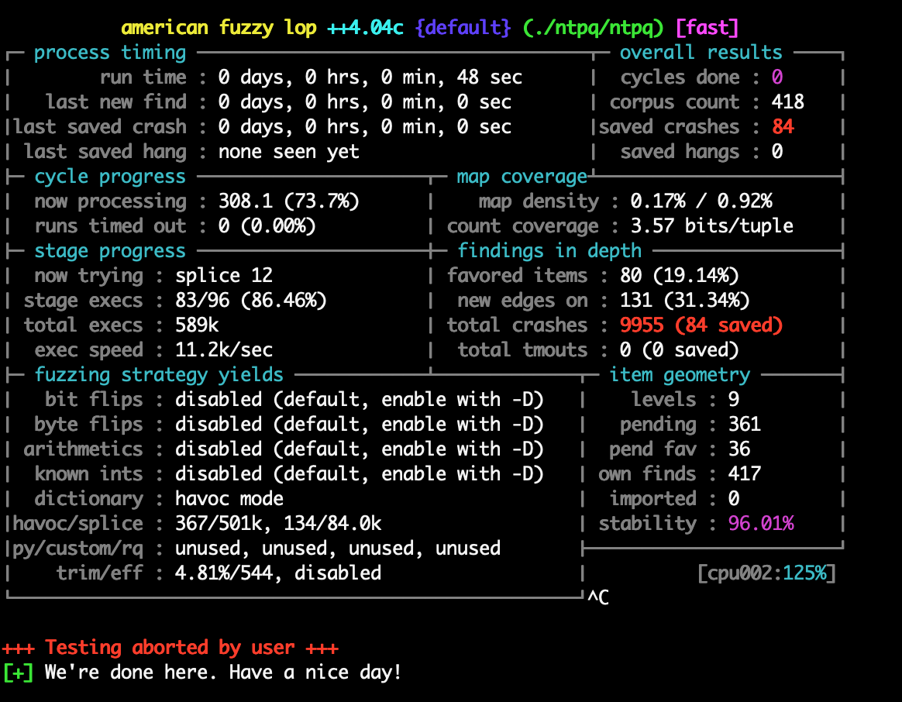
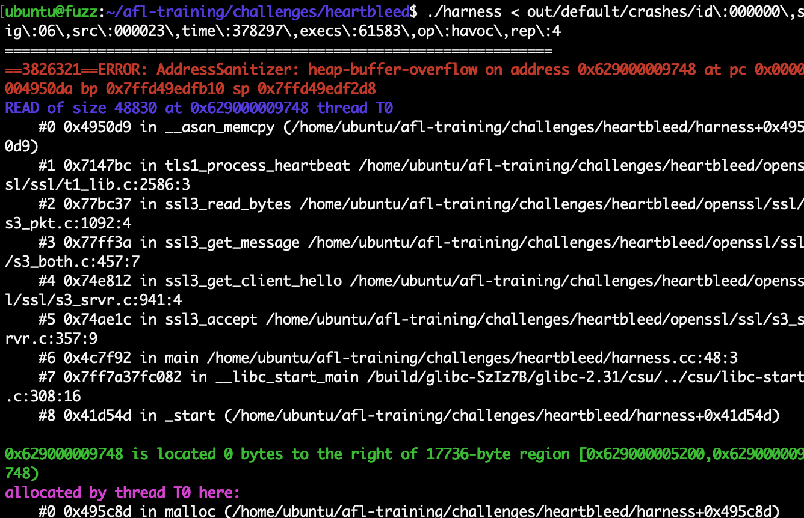

## afl入门和afl-training

Time: 2022.11.30  
Tags: fuzzing  


### 0x00 前言

在上一篇「fuzz入门和afl基本使用」中，我们学习了 fuzz 的原理、掌握了 afl 的基本使用，不过这和 fuzz 漏洞挖掘实战还有很大的距离。本文通过复现 afl-training 的各项练习，学习实战中 afl 常用的使用方法和 fuzz 思想。

afl-training(https://github.com/mykter/afl-training) 是 Michael Macnair 制作的 afl 学习指南，在多次会议中进行演讲分享；可以通过 [PDF](./Fuzzing.with.AFL.-.GrayHat.2020.pdf) 进行学习，也可以按 github 的 README 逐步进行实验学习。

本文将使用 afl++ 用于 fuzz 测试，afl 工具已经有很久没有更新了，afl++(https://github.com/AFLplusplus/AFLplusplus) 则是社区成员以 afl 作为基础，进行大量的改进和优化，并迭代更新的版本，使用方法上几乎没有区别。

本文使用环境：
```
Ubuntu20.04 x64
afl++ 4.04c
```

### 0x01 afl++环境配置
在配置 afl++ 之前，我们先来安装 clang 以便能够支持需要 clang 编译的项目，同时安装 llvm 的相关组件，以便 afl++ 可以使用 llvm 的特性(eg: afl-gcc-fast)：
```
$ apt install gcc g++ clang lcov
$ apt install llvm
$ apt install gcc-9-plugin-dev (需要指明 gcc 版本)
```

我们使用 `git` 拉取 afl++，并编译安装：
```
$ git clone https://github.com/AFLplusplus/AFLplusplus.git
$ cd AFLplusplus/
$ git checkout 4.04c
$ make && make install
```

在我们本轮的实验中，不需要对二进制程序进行 fuzz，这里就不进行 `qemu_mode` 的编译了。

通过 `git` 拉取我们的实验环境 `afl-training`：
```
$ git clone https://github.com/mykter/afl-training.git
$ git submodule init && git submodule update
```

`afl-training` 中提供了简单的 `quickstart` demo 程序，在「fuzz入门和afl基本使用」我们已经做过相关练习，这里我们不再进行赘述，直接跑起来热热身即可：
```
$ cd afl-training/
$ cd quickstart/
$ CC=afl-gcc make
$ afl-fuzz -i input/ -o output/ ./vulnerable
```

很快就可以找到 crash，如下：
<div align="center">

</br>[1.quickstart热身]
</div>

### 0x02 harness
(harness / libxml2)

根据我们之前的实验，我们可以发现 afl/afl++ 仅支持标准输入和命令行参数的文件输入两种方式，但是现实场景下随软件的不同，接收输入的方式各不相同，比如我们对 FTP 进行 fuzz 测试，那么输入就是网络数据报文；除此之外，大型软件一般都有多个可以接收输入的地方，我们没有办法直接让 afl++ 调用执行这些软件。

当我们分析软件找到输入口后，可以通过编写 hook 的方式编写一个小程序，在程序中进行输入前的初始化，然后调用原输入口，最后再进行资源回收，以这种方式突破软件输入的局限性，并可以针对性的 fuzz 任一输入点；在 fuzz 中将这个小程序称之为 harness。

接下来我们尝试对 `libxml2` 进行 fuzz，`libxml2` 通过 C 语言开发，是解析 XML 文档的函数库。XML 文档格式如下：
```
<root>
<child>
<subchild>.....</subchild>
</child>
</root>
```

按照 `afl-training` 的教程，我们将通过 fuzz `libxml2 v2.9.2` 版本的 CVE-2015-8317 漏洞，首先我们配置 `libxml2` 的环境：
```
$ cd [src]/challenges/libxml2/libxml2/
$ CC=afl-gcc ./autogen.sh
$ make -j 4
```

编译完成后只能表示 `libxml2` 的编译环境搭建好了，`libxml2` 是一个函数库，我们没法直接用 afl 对其进行 fuzz，我们需要为其编写 harness；由于我们仅学习 afl 的使用技巧，这里我们按照 `afl-training` 提供的 demo 编写 `harness.c` 即可(这里暂时删除了 `__AFL_LOOP` 部分，我们将在「0x04 LLVM优化」章节进行介绍)：
```
#include "libxml/parser.h"
#include "libxml/tree.h"

int main(int argc, char **argv) {
    if (argc != 2){
        return(1);
    }

    xmlInitParser();
    xmlDocPtr doc = xmlReadFile(argv[1], NULL, 0);
    if (doc != NULL) {
        xmlFreeDoc(doc);
    }
    xmlCleanupParser();

    return(0);
}
```

在 `harness` 中我们直接调用 `xmlReadFile` 对 XML 文件进行解析，编译如下：
```
afl-gcc harness.c -I ./libxml2/include ./libxml2/.libs/libxml2.a -lz -lm -o harness
```

创建输入种子如下 `in/seed.xml`：
```
<?xml version="1.0" encoding="UTF-8"?>
<note>
  <to>Tove</to>
  <from>Jani</from>
  <heading>Reminder</heading>
  <body>Don't forget me this weekend!</body>
</note>
```

启动 fuzz：
```
afl-fuzz -i in/ -o out/ ./harness @@
```

<div align="center">

</br>[2.尝试对libxml2进行fuzz]
</div>

但我们运行了很长一段时间也没有收获，需要想办法提高 fuzz 效率。

### 0x03 LLVM优化
fuzz 的效率越高，我们就可以花更少的时间找到 crash，或是发现更多的路径；afl/afl++ 可以利用 LLVM 的特性和优化功能，极大的提高 fuzz 的效率。这里我们介绍常用的三个方法：

**AFL_HARDEN**  
`AFL_HARDEN` 等价于 `-fstack-protector-all` 编译参数，即在编译时启动对所有函数的栈保护机制，当出现栈溢出漏洞时，只要数据覆盖了 canary 就可以自动抛出 crash，而不是等到随机输入覆盖到返回地址后，程序运行错误而导致的 crash。这种方式可以更加容易的发现栈溢出引发的 crash。

以 `libxml2` 的 `harness` 为例，编译示例如下：
```
AFL_HARDEN=1 afl-gcc-fast harness.c -I ./libxml2/include ./libxml2/.libs/libxml2.a -lz -lm -o harness
```

**AFL_USE_ASAN**  
`ASAN` 的全称为 Address-Sanitizier(https://github.com/mirrorer/afl/blob/master/docs/notes_for_asan.txt)，是 LLVM 提供的一种内存检测工具，通过静态插桩、以及在堆/栈缓冲区放置保护区(检测溢出)，从而在代码运行阶段主动的感知内存错误，主动抛出 crash，能够极大提高 fuzz 效率。

以 `libxml2` 的 `harness` 为例，编译示例如下：
```
AFL_USE_ASAN=1 afl-gcc-fast harness.c -I ./libxml2/include ./libxml2/.libs/libxml2.a -lz -lm -o harness
```

>`AFL_HARDEN` 和 `AFL_USE_ASAN` 是互斥的，通常使用 ASAN 即可。  
>ASAN 对性能损耗是较大的，通常情况下只为一个 fuzz 实例开启 ASAN 即可，因为该 fuzz 实例同步其他实例的样本后，即可以 ASAN 的方式发现内存错误。

**__AFL_LOOP**  
afl/afl++ 在运行时使用 `fork` 的方式创建新进场而不是直接运行程序，这提高了一定的 fuzz 效率。但 `fork` 本身也需要一定的成本，afl 提出了一种「持久模式」，当一个 API 为无状态时，不采用 `fork` 的方式，而是使用一个单独的、长期存在的进程，循环读入输入数据并运行，这种方式也极大的提高了 fuzz 效率。

我们仅需要简单的代码 `__AFL_LOOP` 即可启用「持久模式」，afl/afl++ 会自动帮我们处理细节问题；以 `libxml2` 的 harness 为例，我们修改其为持久模式如下：
```
#include "libxml/parser.h"
#include "libxml/tree.h"

int main(int argc, char **argv) {
    if (argc != 2){
        return(1);
    }

    xmlInitParser();
    while (__AFL_LOOP(1000)) {
        xmlDocPtr doc = xmlReadFile(argv[1], NULL, 0);
        if (doc != NULL) {
            xmlFreeDoc(doc);
        }
    }
    xmlCleanupParser();

    return(0);
}
```

`__AFL_LOOP(1000)` 表示每循环 1000 次结束进程，数值过大可能引发内存占用问题，一般按实际情况为准。

当然这个也需要使用 `afl-gcc-fast` 进行编译。

### 0x04 并行fuzz
除了使用 LLVM 提高 fuzz 的效率，由于 afl-fuzz 是单核运行，我们还可以使用并行 fuzz 提高效率(https://github.com/google/AFL/blob/master/docs/parallel_fuzzing.txt)，其参数如下：
```
# 启动一个 afl-fuzz 实例，并指定为 master，名称为 00
$ afl-fuzz -i in/ -o out/ -M 00 ./test
# 启动一个 afl-fuzz 实例，并指定为 secondary，名称为 01
$ afl-fuzz -i in/ -o out/ -S 01 ./test
```

-M/-S 的区别在于：-M 会进行确定性检查，-S 则是直接进行随机变异；一般情况下，并行 fuzz 中应该有一个 master 实例。

运行起来后，不同实例将在输出目录 `out` 以自己名称创建自己的工作文件夹，每个实例会周期性的从输出目录中寻找自己 `interesting` 的样本加入到自己的样本库中，以这种方式进行多实例间的协作。(当然 afl-fuzz 也支持多系统间的并行，本质就是对输出目录进行同步共享)

对于并行 fuzz，我们可以使用 `afl-whatsup` 来统计并展示所有实例的运行状态：
```
$ afl-whatsup out/
```

那我们再来高效的对 `libxml2` 进行 fuzz，我们对持久模式的 `harness` 编译如下：
```
$ AFL_USE_ASAN=1 afl-gcc-fast harness.c -I ./libxml2/include ./libxml2/.libs/libxml2.a -lz -lm -o harness
# 并行模式
$ afl-fuzz -M 00 -i in/ -o out/ ./harness @@
$ afl-fuzz -S 01 -i in/ -o out/ ./harness @@
```

<div align="center">

</br>[3.高效的对libxml2进行fuzz]
</div>

从 crash 中分析我们能够找到 CVE-2015-8317 漏洞点 `xmlDictComputeFastQKey()` 函数内的数组越界访问，这个 crash 是由 ASAN 报告的：
<div align="center">

</br>[4.CVE-2015-8317漏洞点]
</div>

除了漏洞点的 crash 以外，我们还有很多其他类型的 crash，在这里是由 ASAN 产生的误报，对于无效的 crash 我们一般都要对其进行 patch，以免干扰后续的 fuzz；patch 可以根据实际代码进行，而对于 ASAN 的误报，我们将指定函数加入到 ASAN 的白名单中，如下：
```
void __attribute__((no_sanitize_address)) MOVETO_ENDTAG_PATCH(xmlChar *p)
{
    while ((*p) && (*(p) != '>')) (p)++;
}
```

### 0x05 样本优化
除了在运行方面提高 fuzz 效率，我们还可以通过优化样本来提高 fuzz 效率，使用不同的样本文件增加路径覆盖率，使 afl-fuzz 进行输入变异时更容易覆盖到更多的路径。

我们同样以 `libxml2` 为例，我们可以在互联网上收集一些 XML 作为样本，这里我们使用 https://github.com/MozillaSecurity/fuzzdata 中的 XML 样本：
```
$ git clone https://github.com/MozillaSecurity/fuzzdata.git
$ cp -r ~/fuzzdata/samples/xml/ input1
```

在我们准备好大量样本后，还需要对样本进行优化；因为重复的样本(即产生相同路径覆盖的样本)对 afl-fuzz 没有意义，而较大的样本则会增加变异成本，但无法有效的覆盖到新的路径(afl-fuzz推荐样本在 1KB 以下)。

我们首先使用 `afl-cmin` 工具筛选掉重复的样本：
```
$ afl-cmin -i input1/ -o input2/ ./harness @@
```
<div align="center">

</br>[5.afl-cmin样本去重]
</div>

可以看到 1505 个样本通过 `afl-cmin` 后只有 303 个了；我们还需要使用 `afl-tmin` 对这些样本进行最小化处理：
```
$ mkdir input3
$ afl-tmin -i input2/001.xml -o input3/001.xml -- ./harness @@
```
<div align="center">

</br>[6.afl-tmin样本最小化]
</div>

`afl-tmin` 是单个文件进行精简，对于多个文件可以使用 shell 脚本：
```
$ cd input2
$ mkdir result
$ for i in *; do afl-tmin -i $i -o result/$i -- ../harness @@; done;
```

>PS: 实际场景下还可以对最小化后的样本集再次去重。

我们以这一份样本集作为输入数据，实验发现能在更少的时间内发现 crash。

### 0x06 变异字典
对于某些程序的 fuzz 而言随机变异不都是好事，如网络协议或其他具有标准格式的数据输入，随机变异的输入数据很难覆盖到程序的正常分支流程。`afl-fuzz` 提供了字典功能，基于字典语法来进行变异可较大提高性能(https://lcamtuf.blogspot.com/2015/01/afl-fuzz-making-up-grammar-with.html)。

我们尝试进行 `afl-training` 中的 `ntpq` 练习，NTP(Network Time Protocol/网络时间协议)是用来使计算机时间同步化的一种协议，这里我们将 fuzz `ntp-v4.2.2` 的 CVE-2009-0159 漏洞：
```
$ cd [src]/challenges/ntpq/
$ wget https://www.eecis.udel.edu/~ntp/ntp_spool/ntp4/ntp-4.2/ntp-4.2.2.tar.gz
$ tar -zxf ntp-4.2.2.tar.gz
$ cd ntp-4.2.2/
$ CC=afl-gcc-fast ./configure
$ AFL_HARDEN=1 make -C ntpq
```

ntp 编译没有问题，CVE-2009-0159 漏洞点为 `cookedprint` 函数，我们编写 harness 如下，并将其写入到 `[src]/ntpq.c#486#main()` 中：
```
int main(int argc, char *argv[]) {
    //return ntpqmain(argc, argv);

#ifdef __AFL_HAVE_MANUAL_CONTROL
    __AFL_INIT();
#endif
    int datatype=0;
    int status=0;
    char data[1024*16] = {0};
    int length=0;
#ifdef __AFL_HAVE_MANUAL_CONTROL
    while (__AFL_LOOP(1000)) {
#endif
        datatype=0;
        status=0;
        memset(data,0,1024*16);
        read(0, &datatype, 1);
        read(0, &status, 1);
        length = read(0, data, 1024 * 16);
        cookedprint(datatype, length, data, status, stdout);
 #ifdef __AFL_HAVE_MANUAL_CONTROL
    }
 #endif
    return 0;
}
```

由于 ntpq 基于指令进行解析执行，我们通过字典的方式使 afl-fuzz 能够基于字典进行输入数据变异(`afl-traning` 已提供字典)，从而更高效的进行 fuzz：
```
$ mkdir in/
$ echo 1 > in/seed
$ CC=afl-gcc-fast ./configure
$ AFL_HARDEN=1 make -C ntpq
$ afl-fuzz -x ../ntpq.dict -i in/ -o out/ ./ntpq/ntpq
```
<div align="center">

</br>[7.ntpq使用字典进行fuzz]
</div>

很快我们就找到了若干 crash，这里就不进行 crash 分析了；我们还可以对比不使用字典的情况，可以发现很难找到 crash。

### 0x07 覆盖率
通过 `afl` 进行 fuzz 这个过程似乎对于我们是黑盒的，我们无法得知何时能找到 crash、或许软件真的没有 crash、有哪些路径还没有运行到？评价一次 fuzz 的好坏我们通常使用路径覆盖率进行衡量。

继续以 `afl-training` 的 ntpq 为例，我们通过 gcov 查看上文中我们编写的 `harness` 的路径覆盖率：
```
$ make distclean
$ CC=clang CFLAGS="--coverage -g -O0" ./configure
$ make -C ntpq
```

我们在上文对 `ntpq` 的 fuzz 中，输出目录 `out` 有大量的变异输入，我们查看这些输入的路径覆盖率：
```
$ for F in out/default/queue/id* ; do ./ntpq/ntpq < $F > /dev/null ; done
```

运行完成后，会在二进制文件所在目录生成 `*.gcda/*.gcno`，根据这些文件生成 `gcov` 报告：
```
$ cd [src]/ntpq
$ llvm-cov gcov ntpq.c
```

查看 `ntpq.c.gcov` 文件如下：
<div align="center">

</br>[8.ntpq路径覆盖gcov]
</div>

其中前面是 `-` 的表示是没有对应生成代码的区域，前面是数字的表示执行了的次数，前面是 `#####` 的表示是没有执行到的代码，可以通过路径覆盖率然后调整种子以提升 fuzz 效率。

### 0x08 harness进阶
在上文中我们已经熟悉 harness 的编写方法，但在实际场景下分析程序和编写 harness 都是比较难的一项工作，这里我们再多介绍一些案例。

比如有些程序有多个输入点，那对于不同的输入点，我们就需要编写不同的 harness，单独完整的进行 fuzz，这样才能对程序进行一个比较完整的 fuzz 测试。还有些需要通过环境变量进行输入，那这个我们可以在 `harness` 中读取文件，然后通过 `setenv` 来设置输入。

还有些针对网络协议的 fuzz，我们就需要将网络报文解析的部分拆出来，如 `afl-training` 中的 `heartbleed` 练习，其目标是 fuzz 出 OpenSSL-1.0.1 中的 CVE-2014-0160 漏洞，我们跟随教程操作如下：
```
$ cd [src]/challenges/heartbleed/
$ cd openssl/
$ git checkout OpenSSL_1_0_1f
$ CC=afl-clang-fast CXX=afl-clang-fast++ ./config -d
$ AFL_USE_ASAN=1 make
```

编译没有问题后，编写 `harness.cc` 如下：
```
// Copyright 2016 Google Inc. All Rights Reserved.
// Licensed under the Apache License, Version 2.0 (the "License");
#include <openssl/ssl.h>
#include <openssl/err.h>
#include <assert.h>
#include <stdint.h>
#include <stddef.h>
#include <unistd.h>

#ifndef CERT_PATH
# define CERT_PATH
#endif

SSL_CTX *Init() {
  SSL_library_init();
  SSL_load_error_strings();
  ERR_load_BIO_strings();
  OpenSSL_add_all_algorithms();
  SSL_CTX *sctx;
  assert (sctx = SSL_CTX_new(TLSv1_method()));
  /* These two file were created with this command:
      openssl req -x509 -newkey rsa:512 -keyout server.key \
     -out server.pem -days 9999 -nodes -subj /CN=a/
  */
  assert(SSL_CTX_use_certificate_file(sctx, "server.pem",
                                      SSL_FILETYPE_PEM));
  assert(SSL_CTX_use_PrivateKey_file(sctx, "server.key",
                                     SSL_FILETYPE_PEM));
  return sctx;
}

int main() {
  static SSL_CTX *sctx = Init();
  SSL *server = SSL_new(sctx);
  BIO *sinbio = BIO_new(BIO_s_mem());
  BIO *soutbio = BIO_new(BIO_s_mem());
  SSL_set_bio(server, sinbio, soutbio);
  SSL_set_accept_state(server);

  /* TODO: To spoof one end of the handshake, we need to write data to sinbio* here */
  char data [0x100];
  size_t size = read(STDIN_FILENO, data, 0x100);
  if(size == -1) {
      return -1;
  }
  BIO_write(sinbio, data, size);

  SSL_do_handshake(server);
  SSL_free(server);
  return 0;
}
```

编译 `harness` 并进行 fuzz：
```
$ AFL_USE_ASAN=1 afl-clang-fast++ -g harness.cc openssl/libcrypto.a openssl/libssl.a openssl/libcrypto.a openssl/libssl.a -o harness -I openssl/include -ldl
$ mkdir in
$ echo 11111 > in/seed
$ afl-fuzz -i in/ -o out/ ./harness
```
<div align="center">

</br>[9.heartbleed的fuzz]
</div>

复现 crash 文件，ASAN 准确的为我们指出了 CVE-2014-0160 的漏洞点：
<div align="center">

</br>[10.ASAN的heartbleed漏洞点]
</div>

### 0x09 crash分析
(patch / 去重 / 利用)

crash 的分析也是 fuzz 中非常重要的环节，这个环境能不断推进我们去调整优化 `harness`，最终找到有实际价值的 crash 或漏洞。

当我们进行一次成功的 fuzz 后，我们将收获大量的 crash，虽然 `afl-fuzz` 会帮助我们筛除重复的 crash，但其能力有限，有很多重复的 crash 他无法进行甄别，需要我们人工进行去重；通常使用的方法获取 crash 时的调用栈信息(栈帧)，如果调用栈一致，一般都是相同的 crash，我们使用 GDB 查看上文实验中的任一 crash 如下：
<div align="center">

</br>[11.gdb查看crash栈帧]
</div>

>当然也有工具可以自动化按栈帧的方式进行 crash 去重。

当对 crash 去重后，我们就可以开始对 crash 进行分析了，但是一般情况下，我们分析会发现有很多无效的 crash，比如 ASAN 的误报、afl超时判断、程序内的 assert 等等，对于这些 crash，我们可以使用 PATCH 的方式来忽略掉这些 crash，以便我们能够更加准确的关注有价值的 crash。

最后当发现有价值的 crash 后，我们就可以按照二进制漏洞利用的手法，编写 PoC 或 Exploit 了。

### 0x0x References
https://aflplus.plus/  
https://github.com/google/AFL  
https://github.com/AFLplusplus/AFLplusplus  
https://github.com/AFLplusplus/AFLplusplus/blob/stable/docs/tutorials.md
https://github.com/google/fuzzer-test-suite/  
https://github.com/MozillaSecurity/fuzzdata  
 
https://github.com/mykter/afl-training  
https://tttang.com/archive/1508/  
https://www.anquanke.com/post/id/254167  
https://xz.aliyun.com/t/7400  

https://xz.aliyun.com/t/1541  
https://github.com/AFLplusplus/AFLplusplus/blob/stable/instrumentation/README.gcc_plugin.md  

https://cve.mitre.org/cgi-bin/cvename.cgi?name=CVE-2015-8317
https://xorl.wordpress.com/2009/04/13/cve-2009-0159-ntp-remote-stack-overflow/

https://myfzy.top/2021/03/01/Fuzzing%20and%20vulnerabilities/  
https://myfzy.top/2021/03/04/AFL/#Part-2-%E6%80%BB%E8%A7%88  
https://www.cnblogs.com/tomyyyyy/articles/13610206.html  
https://mundi-xu.github.io/2021/03/12/Start-Fuzzing-and-crashes-analysis/  
https://paper.seebug.org/841/  