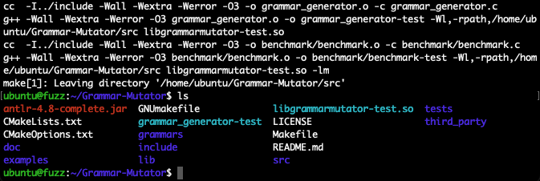
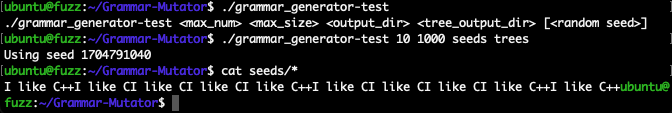
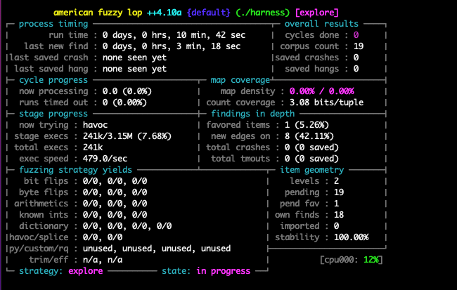
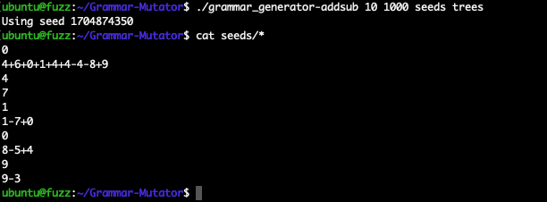
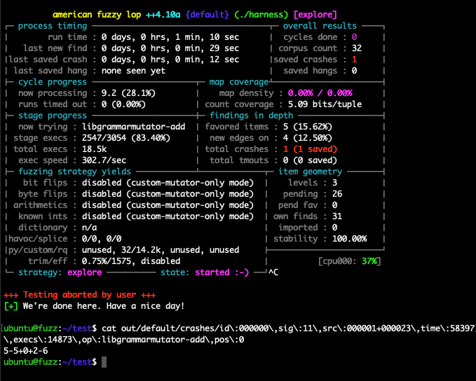
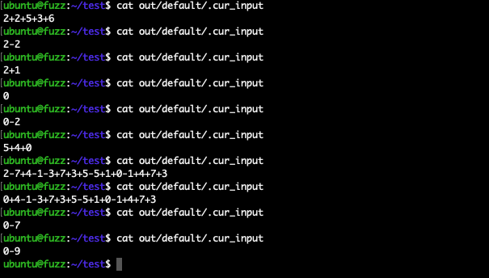
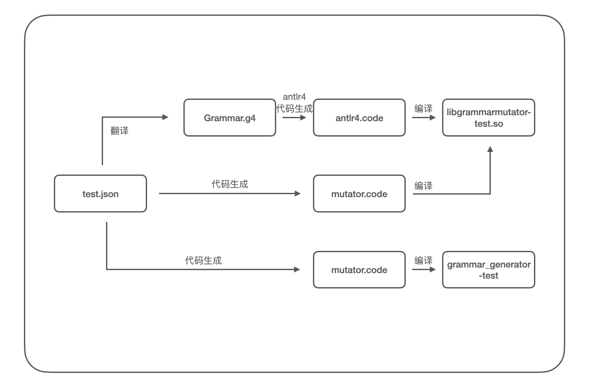

## afl语法变异插件Grammar-Mutator的基本使用

Time: 2024.01.09  
Tags: fuzzing  


### 0x00 前言

变异算法是 fuzzing 中非常重要的一个环节，良好的变异算法能产出较高的路径覆盖率，从而提高发现 crash 的概率；afl/afl++ 默认提供的变异算法在通用情况下表现优秀，但对于格式要求严格的数据则显得无能为力，基于语法的变异是一种优秀的变异算法优化方案，并具有良好的普适性，安全研究人员通过对理解数据格式编写对应的语法树生成器，从而可以准确的生成符合要求的数据，极大的提高路径覆盖率。

最近工作中和同事 @ghost461 一起研究学习 afl++ 的语法变异插件 Grammar-Mutator，本文对此进行梳理，并详细介绍 Grammar-Mutator 的使用和基本原理。

本文实验环境：
```
Ubuntu 22.04
AFL++ 4.09c
Grammar-Mutator
(commit:74f8e136b94b66ec7e5ff0c1ef97be281a8b8ba0)
```

### 0x01 Grammar-Mutator
首先配置 afl++ 环境以便下文使用：
```
$ git clone https://github.com/AFLplusplus/AFLplusplus.git
$ cd AFLplusplus/
$ make
```

随后配置 Grammar-Mutator 环境，Grammar-Mutator 依赖 antlr4 运行，需要先配置 antlr4 如下：
```
# 从 github 拉取 Grammar-Mutator
$ git clone https://github.com/AFLplusplus/Grammar-Mutator.git

# 配置 antlr4
$ cd Grammar-Mutator/
$ sudo apt install valgrind uuid-dev default-jre python3
$ wget https://www.antlr.org/download/antlr-4.8-complete.jar
```

Grammar-Mutator 使用 json 格式描述语法，在 `[src]/grammars/` 提供了几个示例语法文件：`http/javascript/json/test/ruby`，其中 `test.json` 的语法文件如下：
```
{
    "<A>": [["I ", "<B>"]],
    "<B>": [["like ", "<C>"]],
    "<C>": [["C"], ["C++"]]
}
```

json 主要描述语法的前后关系以及终结符值，这种方法非常简单易懂(类似BNF范式)；使用尖括号 `<token>` 表示非终结符，其他则为终结符，每个符号使用一个二维数组表示其可选值，其中每一个一维数组对应符号的可选值(一维数组之间为并列关系)，一维数组内部的值表示该选项具体的值(一维数组内部的值为串联关系)；所以以上语法可以生成的数据为：
```
I like C
I like C++
```

我们通过以下语句编译 Grammar-Mutator 项目：
```
$ make ANTLR_JAR_LOCATION=./antlr-4.8-complete.jar GRAMMAR_FILE=grammars/test.json
```

执行如下，成功编译后将生成 `grammar_generator-test` 用于生成种子文件，以及 `libgrammarmutator-test.so` 用于 afl++ 变异算法插件，如下：
<div align="center">

</br>[1.gm编译test语法]
</div>

我们可以使用 `grammar_generator-test` 生成 fuzzing 种子文件，或检查测试语法是否正确：
```
# ./grammar_generator-test <max_num> <max_size> <output_dir> <tree_output_dir> [<random seed>]
$ ./grammar_generator-test 10 1000 seeds trees
```

执行如下：
<div align="center">

</br>[2.test语法生成数据]
</div>

>其他示例语法可以自行尝试测试。

### 0x02 常规fuzzing
我们首先使用 afl++ 进行常规 fuzzing，为了方便演示和对比，我们编写「10以内的加减法」的小工具作为 fuzzing 目标(`ten-addsub.c`) ：
```
#include <stdio.h>
#include <string.h>

char VALID_CHARS[] = {'0', '1', '2', '3', '4', '5', '6', '7', '8', '9', '+', '-'};

// valid-format: 1+2+3+4-5
int check_character(char* data, int len) {
    int vc_len = strlen(VALID_CHARS);

    if (len % 2 != 1) {
        return 0;
    }

    int opflag = 0;
    for (int i = 0; i < len; i++) {
        int valid = 0;
        for (int j = 0; j < vc_len; j++) {
            if (data[i] == VALID_CHARS[j]) {
                valid = 1;
            }
        }
        if (valid == 0) {
            return 0;
        }

        if (data[i] == '+' || data[i] == '-') {
            if (opflag == 0) {
                return 0;
            }
            opflag = 0;
        } else {
            if (opflag == 1) {
                return 0;
            }
            opflag = 1;
        }
    }
    return 1;
}

int addsub(int sum, char op, char v) {
    if (op == '+') {
        return sum + (v - 0x30);
    } else {
        // op == '-'
        return sum - (v - 0x30);
    }
}

int main(int argc, char* argv[]) {
    char data[1025] = {};

    printf("please input expr:\n");
    scanf("%1024s", data);

    int data_len = strlen(data);
    if (check_character(data, data_len) == 0) {
        printf("error: invalid characters\n");
        return 0;
    }

    int sum = (data[0] - 0x30);
    for (int i = 1; i < data_len; i+=2) {
        sum = addsub(sum, data[i], data[i+1]);
        // crash
        if (data_len == 9 && data[i+1] == '5' && sum == 0) {
            char *crash = NULL;
            crash[0] = 1;
        }
    }

    printf("result = %d\n", sum);
    return 0;
}
```

我们埋了一个 crash 的点，当输入长度为 9(即五个数字参与运算)，当前数字为 '5'，任意一轮计算结果为 0 时，手动抛出 `Null-Pointer Write Exception`。

我们对该测试用例进行常规 fuzzing：
```
# 编译 harness (关闭优化以便更符合代码预期)
$ ../AFLplusplus/afl-gcc -Wall -O0 ten-addsub.c -o harness 

# 准备种子文件
$ mkdir in
$ echo "1+2" > in/1

# 启动fuzzing(并开启确定性变异)
$ ../AFLplusplus/afl-fuzz -D -i in/ -o out/ -t 1000 ./harness
```

执行如下：
<div align="center">

</br>[3.afl++常规fuzzing]
</div>

我们可以通过 `cat out/default/.cur_input ` 查看 afl++ 的当前输入数据，以此来抽样评估变异的输入数据，如下：
<div align="center">

</br>[4.afl++常规fuzzing的抽样输入数据]
</div>

可以看到输入数据变异得比较发散，其中大多数都无法通过 `check_character()` 函数的检查。

### 0x03 语法变异fuzzing
我们使用语法变异来进行 fuzzing，首先为我们的「10以内的加减法」小工具编写语法 `addsub.json`：
```
{
    "<EXPR>": [["<NUMBER>", "<OPERATION>", "\n"]],
    "<OPERATION>": [["<SYMBOL>", "<NUMBER>", "<OPERATION>"], []],
    "<SYMBOL>": [["+"], ["-"]],
    "<NUMBER>": [["0"], ["1"], ["2"], ["3"], ["4"], ["5"], ["6"], ["7"], ["8"], ["9"]]
}
```

以上语法描述的是：
1. 每条 `EXPR`，以 `NUMBER` 开头，后跟 `OPERATION`，结尾为 `\n` 字符
2. 每个 `OPERATION` 由 `[SYMBOL, NUMBER]` 串联组成，可以有 0 个或多个 `OPERATION`
3. 每个 `SYMBOL` 从 `+-` 字符二选一
4. 每个 `NUMBER` 从 `0123456789` 字符中十选一

使用 Grammar-Mutator 编译以上语法：
```
make ANTLR_JAR_LOCATION=./antlr-4.8-complete.jar GRAMMAR_FILE=grammars/addsub.json
```

使用 `grammar_generator-addsub` 生成种子数据，可以生成的数据非常符合预期，如下：
<div align="center">

</br>[5.addsub语法生成种子数据]
</div>

我们将 `libgrammarmutator-addsub.so` 拷贝至 fuzzing 工作目录下，目录结构如下：
```
├── harness
├── in
│   └── 1                          // “1+2”
├── libgrammarmutator-addsub.so
├── out
└── ten-addsub.c
```

>这里我们仍使用上文的 `1+2` 作为输入种子，这样可以方便我们更好的进行对比；在实际场景下，可以直接使用语法变异器生成的种子。

使用 `AFL_CUSTOM_MUTATOR_LIBRARY` 指定语法变异插件模块，还需要使用 `AFL_CUSTOM_MUTATOR_ONLY=1` 设置仅使用自定义变异(即不使用 afl++ 默认的变异算法，因为默认变异可能大幅破坏语法结构从而导致 Grammar-Mutator 报错退出)，启动 fuzzing 如下：
```
AFL_CUSTOM_MUTATOR_ONLY=1 AFL_CUSTOM_MUTATOR_LIBRARY=./libgrammarmutator-addsub.so ../AFLplusplus/afl-fuzz -i in/ -o out/ -t 1000 ./harness
```

执行如下：
<div align="center">

</br>[6.afl++语法fuzzing]
</div>

同样通过 `cat out/default/.cur_input ` 查看 afl++ 的当前输入数据，可以看到变异数据也非常符合预期：
<div align="center">

</br>[7.afl++语法fuzzing的抽样输入数据]
</div>

通过语法变异 1min 就发现了 crash，对比常规 fuzzing 在路径覆盖率和效率上都有显著的提高。

### 0x04 antlr4拓展
antlr4 是著名的语法解析引擎，Grammar-Mutator 底层依赖 antlr4 进行工作，其 `json` 文件需要首先翻译为 `g4` 语法文件，才能被 antlr4 解析加载，其编译过程示意如下：
<div align="center">

</br>[8.Grammar-Mutator编译过程示意图]
</div>

上文中 Grammar-Mutator 提供的示例语法 `test.json` 对应的的 `g4` 语法如下：
```
grammar Grammar;
entry
    : node_A EOF
    ;
node_A
    : 'I ' node_B
    ;
node_B
    : 'like ' node_C
    ;
node_C
    : 'C'
    | 'C++'
    ;
```

实际上 antlr4 应用非常广泛，从 fuzzing 的角度考虑可以直接基于 antlr4 的语法文件构建自定义变异器，从而复用 antlr4 大量现有的描述文法，为对应的应用进行高效的 fuzzing。

### 0x05 文法进阶
Grammar-Mutator 提供的 json 文法描述文件非常简单易懂，但最终还是会转化为标准的 g4 文法描述文件才能给 antlr4 进行使用，不严谨的文法描述可能导致语法解析错误、语法解析回溯成本过高、语法解析陷入死循环等问题。

**1.LL(1)文法规范**  
antlr4 使用 LL(*) 文法，我们仍可以使用 LL(1) 文法规范来进行约束以编写更加严谨的文法；LL(1)文法规范如下：

对形如 `A => 𝛂 | 𝛃` 这样的文法，满足：
1. 文法不含有左递归
2. 同一非终结符的FIRST集合两两不相交，即 FIRST(𝛂) ∩ FIRST(𝛃) = 𝟇
3. 若非终结符𝛃的FIRST集若包含𝞮，则不能与A的FOLLOW集相交，即 𝞮 ∊ FIRST(𝛂)，满足 FIRST(𝛃) ∩ FOLLOW(A) = 𝟇

>有关文法、LL、LR、FIRST、FOLLOW 定义请参考龙书《编译原理》。

antlr4 目前已经可以处理(优化改写)直接左递归语法，但无法处理间接左递归，尽量在编写阶段进行优化。

左递归文法优化示例：
```
S => SA|A
A => a
OPTIMIZE:转化为右递归
S => AS'
S' => AS'|𝞮
A => a
```

FIRST集合相交文法优化示例：
```
S => A|B
A => x|y
B => x|z
OPTIMIZE:提取公共前缀
S => xS'
S' => A|B
A => y
B => z
```

FIRST/FOLLOW集合相交文法优化示例：
```
S => aA|d
A => dAS|𝞮
分析：A => dAS|𝞮
FIRST(dAS) = {d}
FOLLOW(A)  = {a, d}
OPTIMIZE:改写语法
S => a|d|A
A => AS|𝞮
OPTIMIZE:转化为右递归
S => a|d|A
A => SA'
A' => SA'|𝞮
```

>示例中都是简单的直接文法，但实际应用场景文法会比较复杂，文法中的间接关系更容易出现以上问题。

**2.词法和文法**  
一个完整的文法通常包含词法和语法两大部分，antlr4 也如此，但 Grammar-Mutator 提供的 json 文法仅支持语法解析，因为其核心的变异算法依赖于语法树(AST)进行工作。

那么在为 Grammar-Mutator 编写 json 文法时，可以忽略词法，仅关注语法即可；但这样可能引发部分解析错误，以及额外的解析/回溯解析成本，但 Grammar-Mutator 本就依赖于此(AST)进行工作，这可能是 Grammar-Mutator 设计之初的考虑。

**3.理解变异算法**  
Grammar-Mutator 内部提供了 4 种特别的变异算法，参考于[NAUTILUS:Fishing-for-Deep-Bugs-with-Grammars](./ndss2019_04A-3_Aschermann_paper.pdf)，分别是：
1. rules_mutation 按文法规则对所有节点进行变异
2. random_mutation 随机挑选节点按文法规则进行变异
3. random_recursive_mutation 随机选择递归节点进行变异
4. splicing_mutation 随机选择节点进行裁剪

`rules_mutation` 的变异次数和规则的复杂度有关系，其他三种变异算法默认值都为 `1000` 次，这是一个良好的值，在实际场景中，过低的变异次数可能无法充分利用指定样本的变异空间，过高的变异次数则又可能穷尽变异空间导致出现大量重复的变异样本数据。


### 0x06 References
https://github.com/AFLplusplus/Grammar-Mutator  
https://github.com/AFLplusplus/AFLplusplus  
https://securitylab.github.com/research/fuzzing-apache-1/  
https://github.com/antlr/antlr4/blob/master/doc/index.md  
https://github.com/antlr/antlr4/blob/master/doc/getting-started.md  
https://github.com/antlr/grammars-v4  
https://rk700.github.io/2018/01/04/afl-mutations/  
《Antlr4权威指南》  