## aws云服务器系统备份

Time: 2022.11.21  
Tags: 开发,运维  

### 0x00 前言
在日常工作中，我们有时候需要对系统进行备份和还原，Linux 下通常使用 dd 来进行，Windows 可以使用自带「备份和还原」功能，或者使用其他的第三方工具；除此之外，对于云服务器，还可以通过云厂商提供的备份还原方案来进行。

在本文中将首先简单介绍常见的备份方案和实施，然后着重以 aws 云服务器为例，介绍云厂商所提供的备份还原方案。

### 0x01 常见的备份方案
**Linux**  
在 Linux 操作系统中，自带的 `dd` 命令就可以帮助我们完成系统备份和还原，首先使用 `fdisk -l` 命令查看磁盘的挂载情况：
<div align="center">
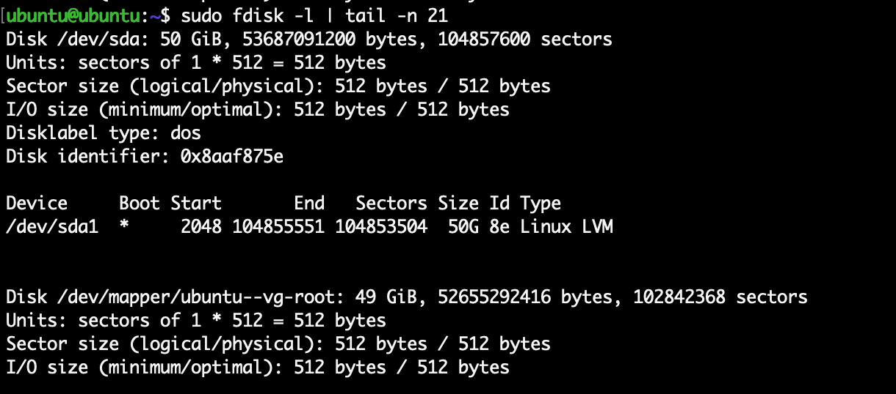
</br>[1.fdisk查看磁盘挂载]
</div>

随后便可以使用 `dd` 命令针对磁盘或者文件系统进行备份，可以直接备份到另一块磁盘中，或者保存为一个文件：
```
# 备份磁盘到另一块磁盘
dd if=/dev/sda of=/dev/sdb
# 备份磁盘为文件
dd if=/dev/sda of=/tmp/backup.img
```

`dd` 命令非常耗时，在备份过程中可以使用 `SIGSUR1` 信号查看进度：
```
kill -USR1 <pid>
```
<div align="center">
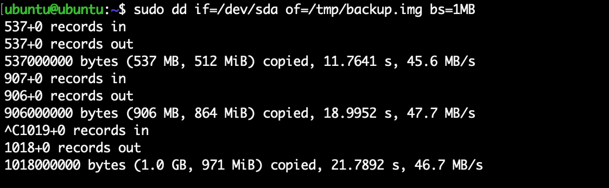
</br>[2.备份为文件并查看dd命令进度]
</div>

**Windows**  
Windows 从 Windows7 开始提供「备份和还原」功能，在控制面板中可以找到：
<div align="center">
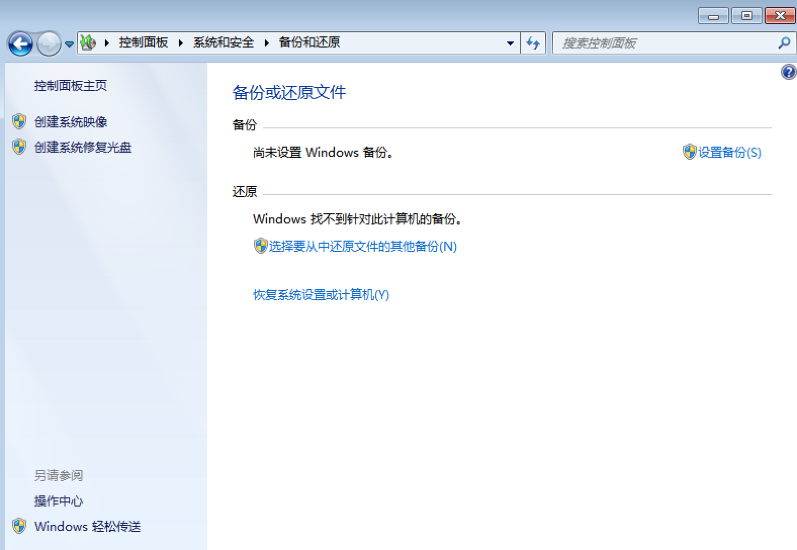
</br>[3.Windows备份和还原]
</div>

随后便可以按照指导逐步操作进行备份，需要注意一点是备份不能保存在驱动盘上(这里我的虚拟机只有一个 C 盘)：
<div align="center">
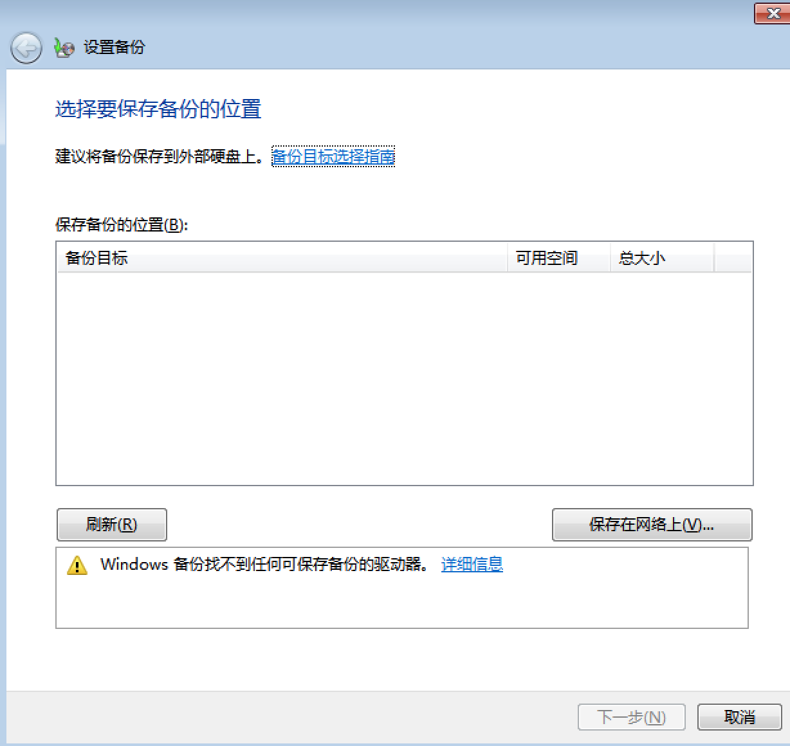
</br>[4.Windows备份操作]
</div>

>当然熟悉 Linux 同学，也可以在 Windows 安装 dd 进行备份

**补充**  
除了 Linux/Windows 自带的备份方案，还有大量的第三方工具可以完成这项工作，这里就不进行赘述了。

无论是备份 Linux 还是 Windows，若备份到本机存储下，一定要保证还要足够的磁盘空间；如果可以接触物理机的话，可以直接通过 USB 接入移动硬盘作为备份使用，如果是云服务器可以直接附加新的云硬盘(大多数云厂商默认支持热装载)。

除此之外，有时候需要进行脱机备份，这个时候可以使用 live-USB(Linux) 和 WinPE(Windows) 系统，然后使用如上方式进行备份。

### 0x02 aws备份概要
云厂商的服务器通常都提供了快照功能，这几乎不需要任何操作就可以完成服务器的备份，但是这个备份文件我们没法访问到，只能在云平台中进行查看和还原。如果要像上文一样备份并且拿到备份文件，那就要稍微复杂一点了。

aws 中提供了一项对象存储服务叫 s3，全称为 Amazon Simple Storage Service，和大部分的对象存储服务一样，其不关心文件的类型，也无需用户操作底层实现，只需要关注存储和读取即可。

在 aws 中，允许用户导出服务器(实例)到 s3 存储中，随后用户可以通过 s3 来访问下载数据，通过这种方式我们就可以对服务器进行备份，并获取到备份文件。

接下来，我们介绍 aws 云服务器系统备份的流程。

>对于云服务器，一般推荐直接使用云厂商提供的备份功能，而不是使用 `0x01 常用备份方案` 所提供的方案，云厂商提供的备份功能通常都比 `dd` 更快，把备份文件保存至 s3 后，拉取到本地也比较快。

### 0x03 安装 aws-cli
在 aws 中较为复杂的操作指令通过 aws-cli 来完成，首先通过官方方式在本地安装 aws-cli 工具：
<div align="center">
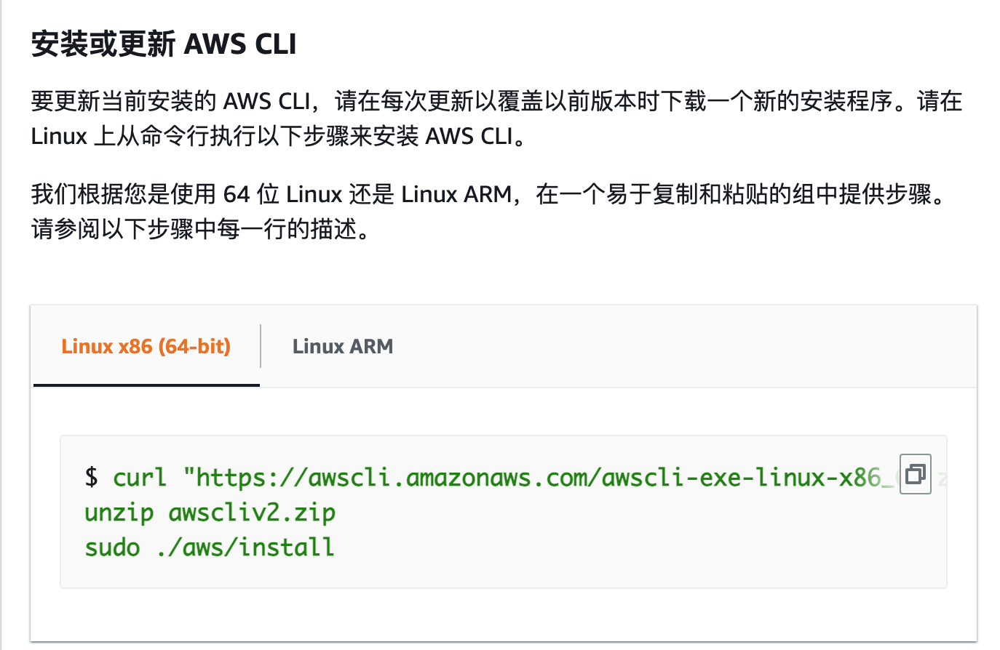
</br>[5.安装aws-cli]
</div>

随后在 aws web 上初始化 IAM 角色(Identity and Access Management)，这个角色将用户 aws-cli 访问控制；这里我们可以给角色赋予 `AdministratorAccess` 最高权限：
<div align="center">
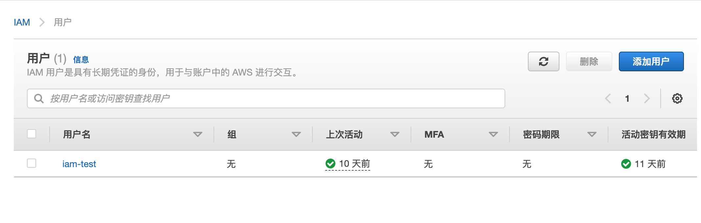
</br>[6.初始化IAM角色]
</div>

IAM 角色创建完毕后会生成 `ACCESS_KEY` 和 `SECRET_KEY`，将用于接下来 aws-cli 的初始化配置，使用 `aws configure` 进行配置：
<div align="center">
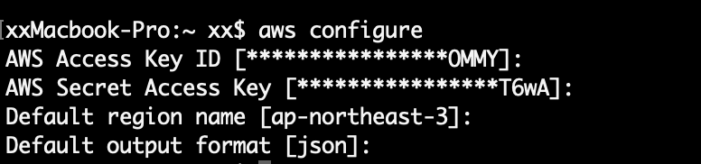
</br>[7.aws-cli配置]
</div>

这里需要配置地区，在同一时间内 aws-cli 只能操作对应地区的资源，最后是配置输出格式，使用 `json` 即可。

配置完成后，可以使用 `aws ec2 describe-instances` 命令查看服务器信息，测试配置情况：
<div align="center">
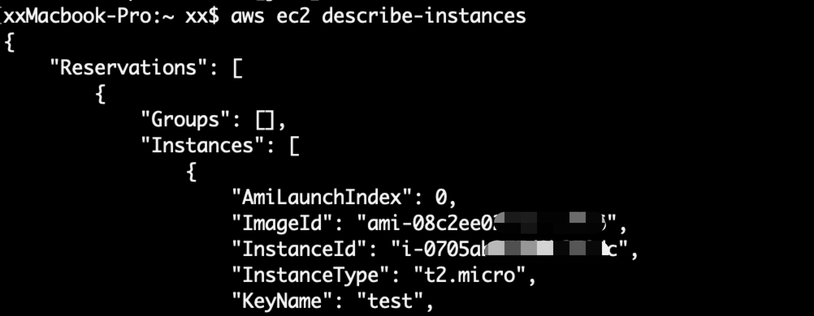
</br>[8.aws-cli查看ec2服务器]
</div>

aws-cli 的详细操作可以参考官方文档：https://docs.aws.amazon.com/zh_cn/cli/latest/userguide/cli-chap-welcome.html

### 0x04 配置s3 bucket
我们现在来配置 s3 存储；aws 只能支持导出服务器到同地区的 s3，所以我们创建同地区的 bucket：
<div align="center">
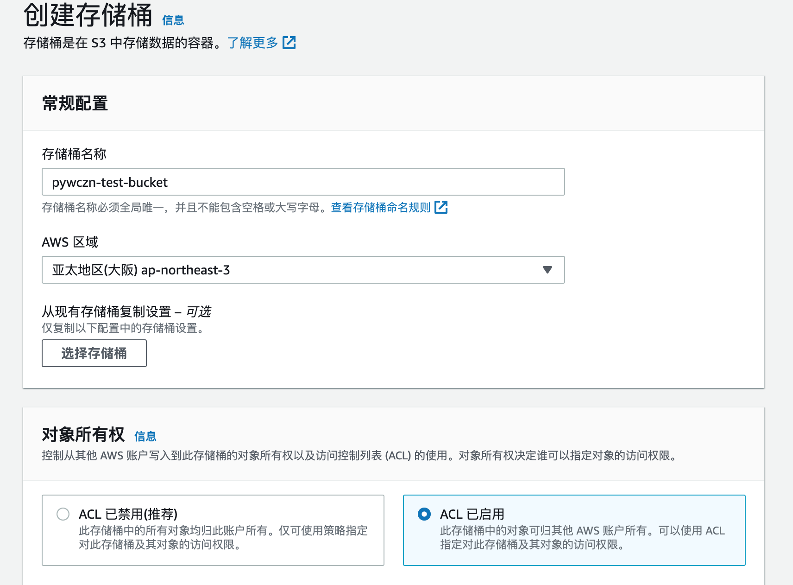
</br>[9.aws创建s3-bucket]
</div>

这里还需要开启 ACL，用于后续访问权限配置；成功创建 bucket 后，我们在 bucket 创建文件夹 `exports` 便于后续数据管理。

aws 提供的从服务器导出到 s3 的功能，需要在 bucket 的 ACL 中提前配置对应地区的权限(https://docs.aws.amazon.com/zh_cn/vm-import/latest/userguide/vmexport.html)：
<div align="center">
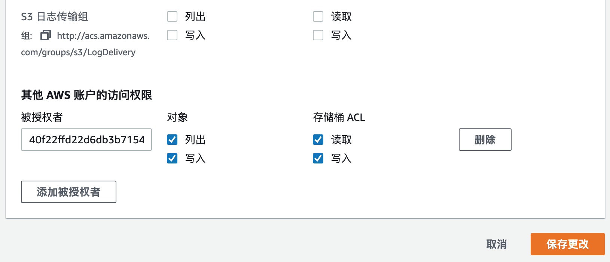
</br>[10.bucket配置地区Grantee]
</div>

### 0x05 配置vmimport角色
备份服务器到 s3 还需要配置 IAM 的 vmimport 角色，这里可以直接使用 aws-cli 来进行操作更加方便。

首先创建 `vmimport` 角色，先编写信任策略文件(`trust-policy.json`)如下：
```
{
   "Version": "2012-10-17",
   "Statement": [
      {
         "Effect": "Allow",
         "Principal": { "Service": "vmie.amazonaws.com" },
         "Action": "sts:AssumeRole",
         "Condition": {
            "StringEquals":{
               "sts:Externalid": "vmimport"
            }
         }
      }
   ]
}
```

使用 aws-cli 创建角色：
```
aws iam create-role --role-name vmimport --assume-role-policy-document "file://trust-policy.json"
```

随后我们为 `vmimport` 角色配置权限策略，编写权限策略文件(`role-policy.json`)如下：
```
{
   "Version":"2012-10-17",
   "Statement":[
      {
         "Effect": "Allow",
         "Action": [
            "s3:GetBucketLocation",
            "s3:GetObject",
            "s3:ListBucket" 
         ],
         "Resource": [
            "arn:aws:s3:::disk-image-file-bucket",
            "arn:aws:s3:::disk-image-file-bucket/*"
         ]
      },
      {
         "Effect": "Allow",
         "Action": [
            "s3:GetBucketLocation",
            "s3:GetObject",
            "s3:ListBucket",
            "s3:PutObject",
            "s3:GetBucketAcl"
         ],
         "Resource": [
            "arn:aws:s3:::export-bucket",
            "arn:aws:s3:::export-bucket/*"
         ]
      },
      {
         "Effect": "Allow",
         "Action": [
            "ec2:ModifySnapshotAttribute",
            "ec2:CopySnapshot",
            "ec2:RegisterImage",
            "ec2:Describe*"
         ],
         "Resource": "*"
      }
   ]
}
```

使用 aws-cli 将权限策略应用到 `vmimport` 角色上：
```
aws iam put-role-policy --role-name vmimport --policy-name vmimport --policy-document "file://role-policy.json"
```

### 0x06 备份服务器到s3
以上都准备完毕后，现在我们开始备份服务器到 s3 的 bucket 中，首先创建导出策略文件(`file.json`)如下：
```
{
    "ContainerFormat": "ova",
    "DiskImageFormat": "VMDK",
    "S3Bucket": "pywczn-test-bucket",
    "S3Prefix": "exports/"
}
```

使用如下命令将指定服务器导出到 s3 bucket 中：
```
aws ec2 create-instance-export-task --instance-id instance-id --target-environment vmware --export-to-s3-task file://file.json
```
<div align="center">
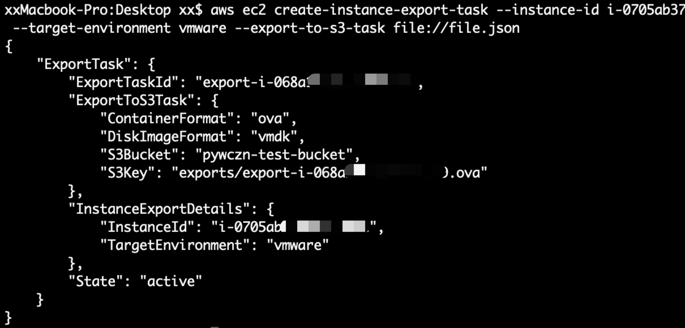
</br>[11.aws导出服务器到s3]
</div>

导出过程比较耗时，在过程中可以使用如下命令查看情况：
```
aws ec2 describe-export-tasks --export-task-ids export-task-id
```

导出完毕后在我们的 `pywczn-test-bucket` 中 `exports` 文件夹可以看到备份文件：
<div align="center">
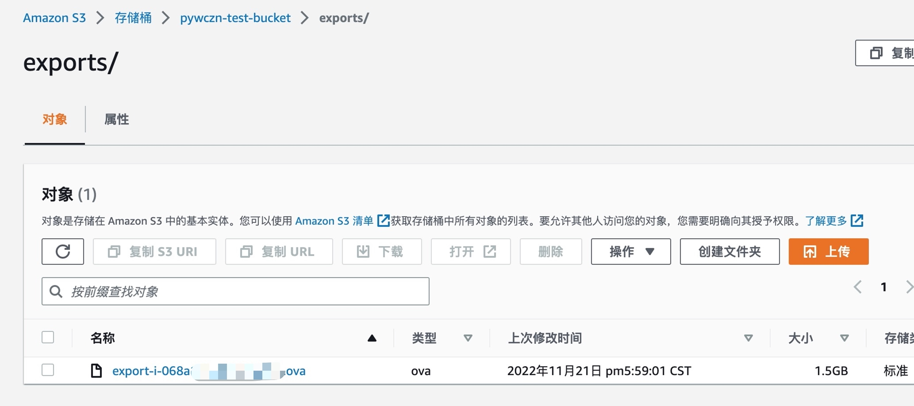
</br>[12.服务器导出s3成功]
</div>

### 0x07 s3转存
上一步将服务器导出到 s3 中有很多限制，比如服务器和 bucket 必须为同地区的；而当我们的数据已经在 s3 中过后，使用起来就方便很多了，我们可以直接使用 aws-cli 下载数据：
```
aws s3 cp <source> <target> [--options]
```

或者我们可以将文件移动到其他地区，更快的下载到本地，或是移动到其他账号下的 s3 进行存储。无论是跨区域还是跨账号的转存，我们只需要在目标位置创建好 bucket，并在 ACL 中添加源 s3 的账号规范ID(可以在源 bucket 的 ACL 中找到自己的ID)，并开启写权限，

在本地的 aws-cli 中，我们已经配置好了源 s3 的访问权限，所以只需要 `aws s3 cp` 到目标 bucket 即可完成转存。
```
aws s3 cp s3://pywczn-test-bucket/exports s3://xxxxxxx/exports --recursive --source-region ap-northeast-3 --region ap-northeast-3
```

>这里需要指定文件夹，如果指定具体文件会失败，而且没有任何提示信息。

### 0x08 issue
1. aws提供从实例备份到 s3，就是上文中我们介绍的方式，还提供从镜像备份到 s3 的功能，将服务器打个镜像后就可以使用该功能，但是在实操中一直没有成功，感兴趣的同学可以研究研究。(而从实例备份到 s3，其内部也会首先转化为镜像)
2. 如果镜像是第三方的，或者镜像内包含第三方软件，aws提供的这两种备份导出功能都不能正常工作，这应该和软件许可有关系。这样情况的话，我们只能使用常规的几种方案了。

### 0x09 References
http://zuyunfei.com/2015/06/04/linux-dd/  
https://megazone.com/cn/ec2-instance-migration/  
https://docs.aws.amazon.com/zh_cn/cli/latest/userguide/getting-started-install.html  
https://docs.aws.amazon.com/zh_cn/vm-import/latest/userguide/vmexport.html  
https://docs.aws.amazon.com/cli/latest/reference/ec2/describe-export-tasks.html  
https://docs.aws.amazon.com/zh_cn/vm-import/latest/userguide/vmexport_image.html  
https://docs.aws.amazon.com/zh_cn/prescriptive-guidance/latest/patterns/copy-data-from-an-s3-bucket-in-one-account-and-region-to-another-account-and-region.html  
https://docs.aws.amazon.com/zh_cn/vm-import/latest/userguide/required-permissions.html  
https://docs.aws.amazon.com/zh_cn/cli/latest/userguide/cli-chap-configure.html  