## fread函数r和rb模式对比

Time: 2023.07.26  
Tags: 开发  


### 0x00 前言

在初学 C 语言时，我们都学会了通过 `fread()` 函数来读取文件内容，也充分理解了需要使用 `r` 模式来打开文本文件，使用 `rb` 模式来打开二进制文件，这样才可以正确读取文件内容。

而实际场景下只有 Windows 系统区分 `r/rb`，Linux 系统不区分；我们在一个将 Linux 项目改写为 Windows 项目的过程中，忽略了该问题，从而导致一系列的无效 DEBUG。

本文以 C 语言的 `stdio` 库的 `fread()` 函数为例，从 `r/rb` 的表现出发，探讨 `r/rb` 的具体的差异细节，并通过源码进行分析校对。

本文实验环境
```
Windows 10 x64
Visual Studio 2019
Ubuntu 18.04 x64
GCC 7.5.0
```

### 0x01 复现"bug"
首先我们使用如下 Python 代码构建文本文件：
```
data = ""
for i in range(0, 128):
    data += chr(i)

with open("ascii", "wb") as f:
    f.write(data.encode())
```

文本文件内容如下：
<div align="center">
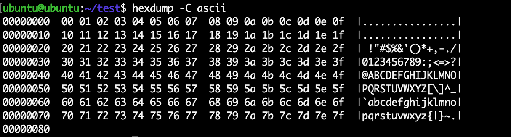
</br>[1.ascii文本文件]
</div>

编写 `fread()` 的 C 代码读取该文件如下：
```
#define _CRT_SECURE_NO_WARNINGS

#include <stdio.h>

int x_read(char* path, char* mode) {
    FILE* fp = NULL;
    char buffer[0x100] = { 0 };
    int ret = 0;

    fp = fopen(path, mode);
    ret = fread(buffer, 1, 0x100, fp);
    printf("ret = %d\n", ret);

    for (int i = 0; i < ret; i++) {
    printf("%02x ", buffer[i] & 0xFF);
    }
    printf("\n\n");

    fclose(fp);
    return 0;
}

int main(int argc, char* argv[]) {
    printf("fread testing ...\n");

    x_read("./ascii", "r");
    x_read("./ascii", "rb");

    return 0;
}
```

在 Linux 系统编译(gcc)运行如下：
<div align="center">
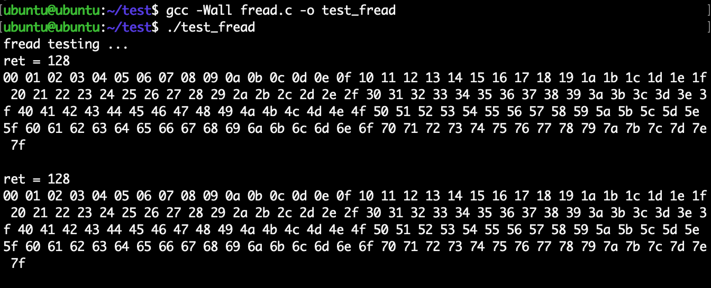
</br>[2.Linux运行测试fread函数]
</div>

在 Windows 系统编译(visual studio)运行如下：
<div align="center">
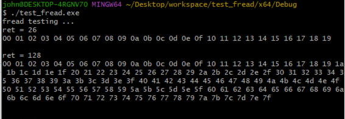
</br>[3.Windows运行测试fread函数]
</div>

可以看到 Windows 文本模式(`r`) 下未能按预期读出正确的数据。

>程序中使用 `fread()` 读取文件，其实际调用流程为 `程序 => stdio库 => 系统调用`，Windows 下 stdio 库由 msvcrt 实现，`r/rb` 存在差异，Linux 下通常由 glibc 进行实现(其他实现表现一致)，`r/rb` 不存在差异；这里我们仅以操作系统进行阐述，不特意指明 stdio 的实现。

### 0x02 r/rb的差异
在 Windows 的测试实验中，相对于原始数据，`r` 文本模式读取文件时会做两处改变：
```
1. 将回车换行(CRLF)变为换行(LF)
    0x0D 0x0A => 0x0A
2. 读取至 EOF 时截止(CTRL+Z)
    0x1A
```

除了 `fread()` 以外，文本模式下 `fwrite()` 也呈现类似的特性，即写入 `0x0A` 字符时将自动转换为 `0x0D 0x0A` 写入。

Windows 下这种文本模式(`r`)读写文件时的设计，其目的是为了更加贴合用户使用/阅读的直观感受，对于开发人员而言这些转换是透明的，而当开发人员需要直接访问数据时，则需要使用二进制模式(`rb`)。

在 Windows 系统上，除了 C 语言的 `fread()` 函数呈此特性，其他高级语言虽然实现不尽相同，但也保持该特性(仅验证Python)。

### 0x03 源码分析
Linux 下的 `fread()` 函数 `r/rb` 模式处理一致，都为二进制模式读取文件，这里不进行深入分析，感兴趣的同学可以通过 glibc 源码(或 https://github.com/bminor/glibc 镜像仓库)，以及如下 `fread()` 到系统调用 `read()` 的栈回溯，进行源码分析：
<div align="center">
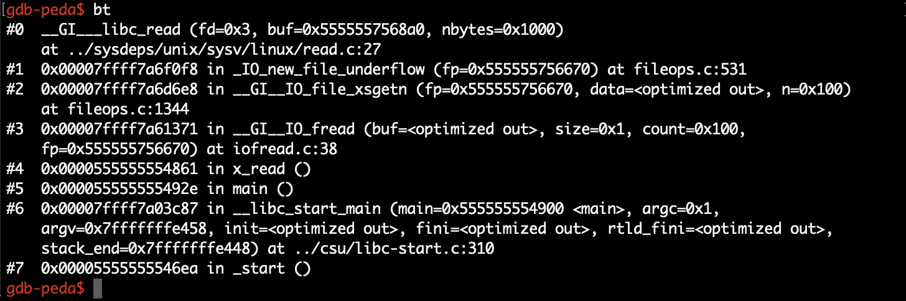
</br>[4.Linux下fread至read的栈回溯]
</div>

我们这里重点分析下 Windows 下 `fread()` 的处理流程，如果系统安装了 Visual Studio 则在 `C:\Program Files (x86)\Windows Kits\10\Source\10.0.10240.0\ucrt` 可找到 msvcrt 的源码实现(或 https://github.com/Chuyu-Team/VC-LTL 镜像仓库)：
<div align="center">
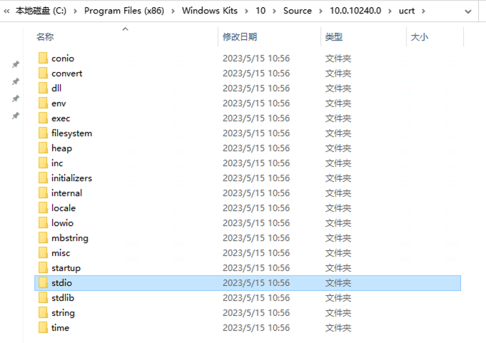
</br>[5.msvcrt源码目录树]
</div>

`fread()` 函数实现在 `[src]/stdio/fread.cpp` 中，如下：
<div align="center">
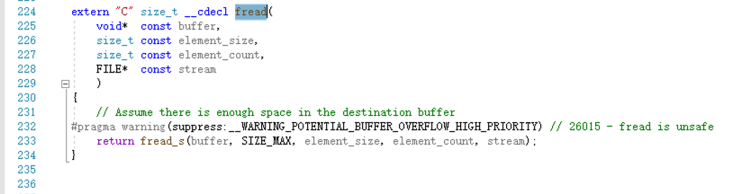
</br>[6.fread源码片段]
</div>

逐步跟入将调用 `_fread_nolock_s()` 函数，该函数将尝试从缓存中读取数据，或通过 `_read_nolock()` 函数读取文件来填充缓存，如下：
<div align="center">
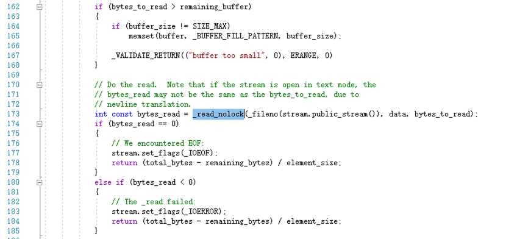
</br>[7._fread_nolock_s源码片段]
</div>

跟入 `[src]/lowio/read.cpp#_read_nolock()` 函数，该函数将根据不同的 `textmode` 设置不同的读取工作模式：
<div align="center">
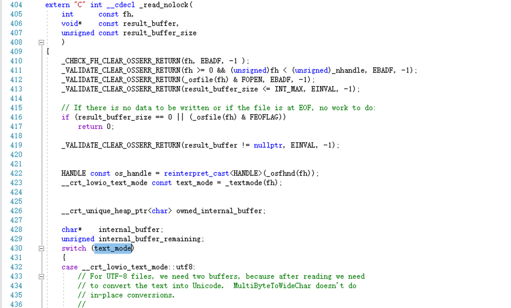
</br>[8._read_nolock源码片段]
</div>

然后通过 `ReadFile` 系统调用读取文件：
<div align="center">
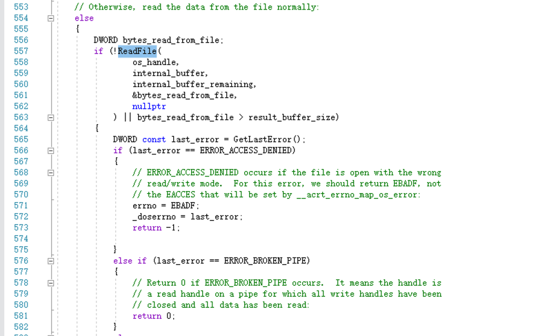
</br>[9._read_nolock函数通过ReadFile读取文件]
</div>

最后再根据 `textmode` 处理(转换)文件内容：
<div align="center">
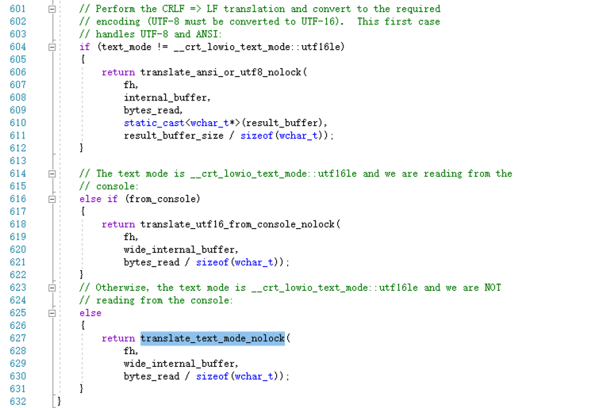
</br>[10._read_nolock按文本模式处理文件内容]
</div>

我们跟入 `[src]/lowio/read.cpp#translate_text_mode_nolock()` 函数，可以看到其中将 `CRLF` 修改为 `LF` 的代码，以及根据 `CTRL-Z`(`0x1A`) 判断文件 EOF 的逻辑：
<div align="center">
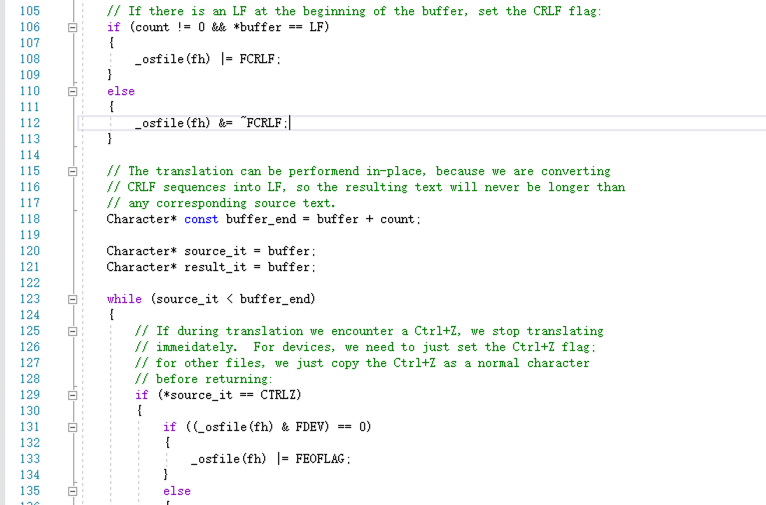
</br>[11.translate_text_mode_nolock源码片段]
</div>

至此我们通过 msvcrt 代码核对了 Windows 下文本模式 `rb` 读取文件的相关特征表现。

在 Windows 上除了文本模式的 ascii 方式读取，实际上还有 `UTF-8/UTF-16` 的区别，也就是 Windows 常说的 BOM 头，即在文本文件开头的几个字符，如下：
```
#define UTF16LE_BOM     0xFEFF      // UTF16 Little Endian Byte Order Mark
#define UTF16BE_BOM     0xFFFE      // UTF16 Big Endian Byte Order Mark
#define BOM_MASK        0xFFFF      // Mask for testing Byte Order Mark
#define UTF8_BOM        0xBFBBEF    // UTF8 Byte Order Mark
#define UTF16_BOMLEN    2           // No of Bytes in a UTF16 BOM
#define UTF8_BOMLEN     3           // No of Bytes in a UTF8 BOM
```

这部分内容将由 `fopen()` 函数调用处理，底层实现在 `[src]/lowio/open.cpp#_wsopen_nolock()` 函数，在该函数中调用 `configure_text_mode()` 函数读取并匹配 BOM 头，从而设置对应的读取模式：
<div align="center">
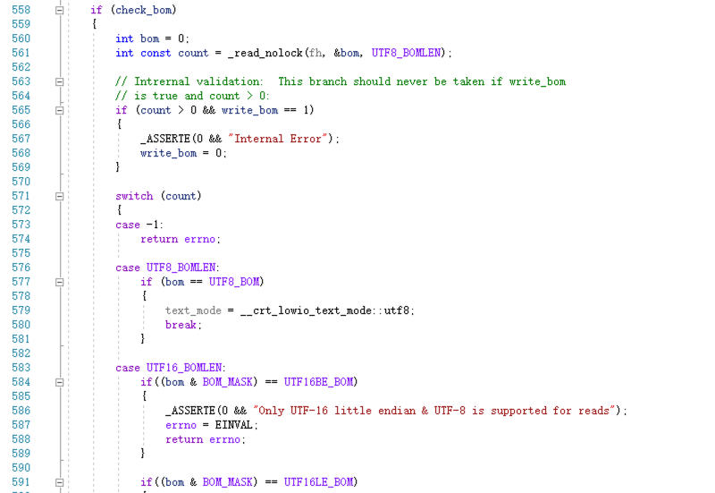
</br>[12.configure_text_mode源码片段]
</div>

### 0x04 References
https://stackoverflow.com/questions/2174889/whats-the-differences-between-r-and-rb-in-fopen  
https://stackoverflow.com/questions/3187693/fread-ftell-apparently-broken-under-windows-works-fine-under-linux  
https://stackoverflow.com/questions/14551353/fread-or-fseek-fails-on-win32-but-not-mac32  
https://paper.seebug.org/925/  
https://www.cnblogs.com/ZIKH26/articles/16575066.html  