## fuzz入门和afl基本使用

Time: 2022.11.23  
Tags: fuzzing  


### 0x00 前言

fuzz 是一种有效的漏洞挖掘方法，最近尝试去入门 fuzz，以本文作为学习笔记。

本文简单介绍了 fuzz 的基础概念和思想，并使用 afl 进行实验演示。

### 0x01 什么是fuzz
模糊测试(fuzz testing)是一种软件测试技术，其核心思想是将自动或半自动生成的随机数据输入到一个程序中，并监视程序异常，如崩溃，断言失败等，以此来发现可能的程序错误。

最早于 1988年，威斯康星大学的 Barton Miller 教授在他的课程实验提出模糊测试，实验内容是开发一个基本的命令行模糊器以测试 Unix 程序，这个模糊器可以用随机数据来“轰炸”这些测试程序直至其崩溃。近年来，模糊测试在安全领域的漏洞挖掘中发挥着举重若轻的作用，每年都有大量的 CVE 产出于这种 fuzz 思想。
<div align="center">
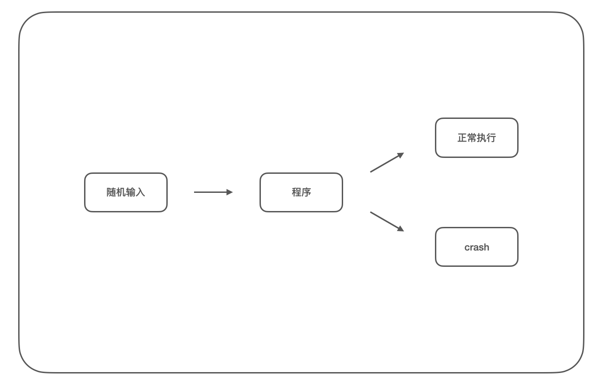
</br>[1.fuzz的基本流程]
</div>

### 0x02 常见的fuzz工具
最早提出的 fuzz 方法虽然可以发现错误，但是由于输入过于随机，大部分的输入都是不合法的，程序早早的就结束了运行，无法进行有效覆盖测试，所以这种方法的效率是非常低的。

**基于变种的fuzzer**  
基于随机输入的思想，「基于变种的fuzzer」(mutation-based fuzzer)被提出，这种方法不再完全随机生成输入，而是在已知合法的输入的基础上，对该输入进行随机变种或者依据某种经验性的变种，从而产生不可预期的测试输入。典型的工具有：Taof, GPF, ProxyFuzz, Peach Fuzzer。

**基于模板的fuzzer**  
「基于变种的 fuzzer」对于合法的输入集合有较强的依赖性，需要测试人员尽可能多的寻找不同的输入类型，并对此进行测试和跟踪研究，在此过程中，测试人员会不断加深对程序的理解，最终可以充分理解程序的执行逻辑；而当测试人员充分理解程序的执行逻辑后，便可以直接构造不同的输入，从而尽可能的覆盖到程序的所有分支，这种方法被称之为「基于模板的fuzzer」(Generation-based)，典型的工具有：SPIKE, Sulley, Mu‐4000, Codenomicon。

**基于反馈演进的fuzzer**  
fuzz 改进的方法其本质都是围绕「覆盖率」展开的，随机输入越能够覆盖程序不同的分支，就越有可能找到程序错误；「基于变种的fuzzer」需要测试人员寻找不同的输入类型并进行测试，「基于模板的fuzzer」则需要测试人员对程序逻辑有充分的理解，两种方法都需要测试人员大量的时间成本。「基于反馈演进的fuzzer」(Evolutionary-based)被提出，这种方法会实时的记录当前对于目标程序测试的覆盖程度，从而调整自己的 fuzz 输入，其自动调整输入的过程被称之为「变异策略」，常见的变异策略有对输入数据进行：位翻转、加减、替换、拼接等。典型的工具有：afl，afl++，libFuzzer。

### 0x03 afl环境配置
afl(American Fuzzy Lop) 是 fuzz 领域中最著名的工具，由 Google 安全工程师 Michal Zalewski 开发并开源，主要针对 Linux 下的软件进行 fuzz 漏洞挖掘。这里我们在 Ubuntu20.04(x64) 上搭建 afl 的运行环境。

下载编译安装
```
$ wget http://lcamtuf.coredump.cx/afl/releases/afl-latest.tgz
$ tar -xvf ./afl-latest.tgz
$ cd afl-2.52b/
$ make && make install
```

可以看到 afl 正常工作：
<div align="center">
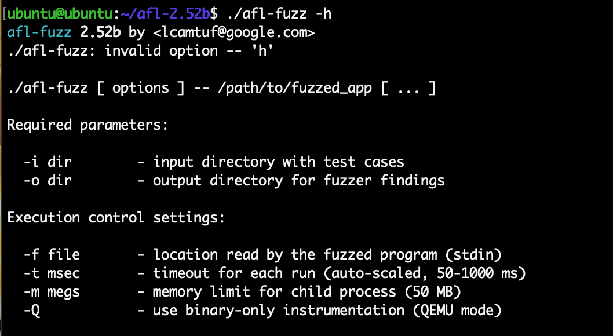
</br>[2.afl帮助信息]
</div>

afl 默认编译仅能支持对有源码的程序进行 fuzz，这里我们可以跳至 「0x04 fuzz-test」和 「0x05 fuzz-upx」进行实验。

若要 afl 支持对二进制程序(无源码)进行 fuzz，需要额外编译 `qemu_mode`：
```
$ cd qemu_mode/
$ ./build_qemu_support.sh
```

使用 apt 安装完相关依赖后，脚本会自动下载 `qemu` 相关组件，然后进行编译构建，但是由于 afl 已经停止更新了，还是存在一些编译问题：
<div align="center">
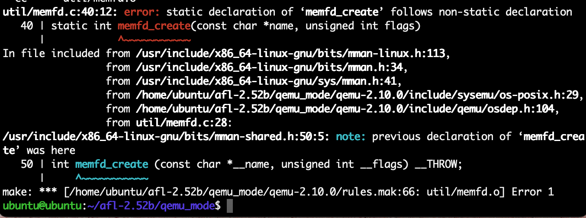
</br>[3.qemu-mode memfd_create编译报错]
</div>

这个我们创建 `qemu_mode/patches/memfd_create.diff` 补丁文件，补丁内容如下：
```
--- qemu-2.10.0-clean/util/memfd.c      2018-11-20 18:11:00.170271506 +0100
+++ qemu-2.10.0/util/memfd.c    2018-11-20 18:11:13.398423613 +0100
@@ -37,7 +37,7 @@
 #include <sys/syscall.h>
 #include <asm/unistd.h>

-static int memfd_create(const char *name, unsigned int flags)
+int memfd_create(const char *name, unsigned int flags)
 {
 #ifdef __NR_memfd_create
     return syscall(__NR_memfd_create, name, flags);
```

在 `build_qemu_supprt.sh` 中 134 行左右添加以下指令加载该补丁：
```
patch -p1 <../patches/memfd_create.diff || exit 1
```

再次构建发现如下错误：
<div align="center">
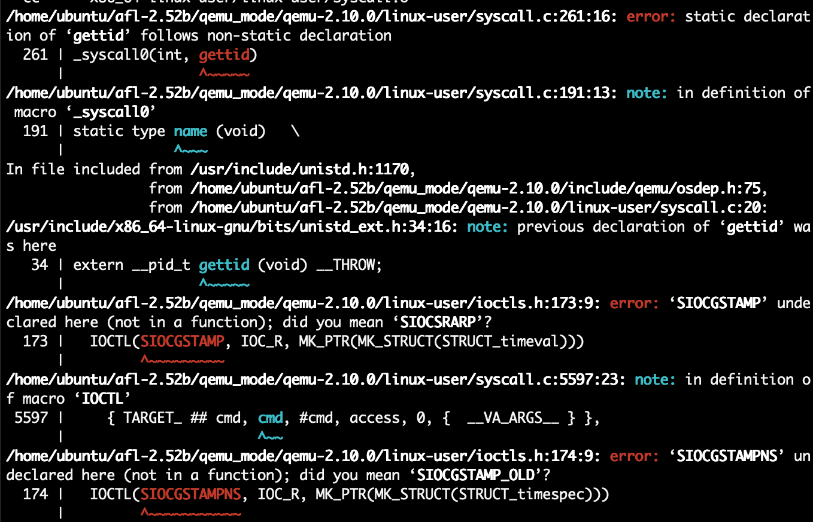
</br>[4.qemu-mode gettid编译报错]
</div>

我们在 `qemu_mode/patches/syscall.diff` 添加补丁内容，完整内容如下：
```
--- qemu-2.10.0-rc3-clean/linux-user/syscall.c	2017-08-15 11:39:41.000000000 -0700
+++ qemu-2.10.0-rc3/linux-user/syscall.c	2017-08-22 14:34:03.193088186 -0700
@@ -34,6 +34,7 @@
 #include <sys/resource.h>
 #include <sys/swap.h>
 #include <linux/capability.h>
+#include <linux/sockios.h> // https://lkml.org/lkml/2019/6/3/988
 #include <sched.h>
 #include <sys/timex.h>
 #ifdef __ia64__
@@ -116,6 +117,8 @@ int __clone2(int (*fn)(void *), void *ch
 #include "qemu.h"

+extern unsigned int afl_forksrv_pid;
+
 #ifndef CLONE_IO
 #define CLONE_IO                0x80000000      /* Clone io context */
 #endif
 
@@ -256,7 +259,9 @@ static type name (type1 arg1,type2 arg2,
 #endif

 #ifdef __NR_gettid
-_syscall0(int, gettid)
+// taken from https://patchwork.kernel.org/patch/10862231/
+#define __NR_sys_gettid __NR_gettid
+_syscall0(int, sys_gettid)
 #else
 /* This is a replacement for the host gettid() and must return a host
    errno. */
@@ -6219,7 +6224,8 @@ static void *clone_func(void *arg)
     cpu = ENV_GET_CPU(env);
     thread_cpu = cpu;
     ts = (TaskState *)cpu->opaque;
-    info->tid = gettid();
+    // taken from https://patchwork.kernel.org/patch/10862231/
+    info->tid = sys_gettid();
     task_settid(ts);
     if (info->child_tidptr)
         put_user_u32(info->tid, info->child_tidptr);
@@ -6363,9 +6369,11 @@ static int do_fork(CPUArchState *env, un
                mapping.  We can't repeat the spinlock hack used above because
                the child process gets its own copy of the lock.  */
             if (flags & CLONE_CHILD_SETTID)
-                put_user_u32(gettid(), child_tidptr);
+                // taken from https://patchwork.kernel.org/patch/10862231/
+                put_user_u32(sys_gettid(), child_tidptr);
             if (flags & CLONE_PARENT_SETTID)
-                put_user_u32(gettid(), parent_tidptr);
+                // taken from https://patchwork.kernel.org/patch/10862231/
+                put_user_u32(sys_gettid(), parent_tidptr);
             ts = (TaskState *)cpu->opaque;
             if (flags & CLONE_SETTLS)
                 cpu_set_tls (env, newtls);
@@ -11402,7 +11410,8 @@ abi_long do_syscall(void *cpu_env, int n
         break;
 #endif
     case TARGET_NR_gettid:
-        ret = get_errno(gettid());
+        // taken from https://patchwork.kernel.org/patch/10862231/
+        ret = get_errno(sys_gettid());
         break;
 #ifdef TARGET_NR_readahead
     case TARGET_NR_readahead:
@@ -11688,8 +11690,21 @@
         break;
 
     case TARGET_NR_tgkill:
-        ret = get_errno(safe_tgkill((int)arg1, (int)arg2,
-                        target_to_host_signal(arg3)));
+
+        {
+          int pid  = (int)arg1,
+              tgid = (int)arg2,
+              sig  = (int)arg3;
+
+          /* Not entirely sure if the below is correct for all architectures. */
+
+          if(afl_forksrv_pid && afl_forksrv_pid == pid && sig == SIGABRT)
+              pid = tgid = getpid();
+
+          ret = get_errno(safe_tgkill(pid, tgid, target_to_host_signal(sig)));
+
+        }
+
         break;
 
 #ifdef TARGET_NR_set_robust_list
```

构建成功后，我们在使用 afl 时添加 `-Q` 便可以针对无源码的二进制程序进行 fuzz。

>通常对无源码的程序进行 fuzz 都比有源码的慢。

### 0x04 fuzz-test
成功编译安装 afl 后，这里我们来介绍 afl 的基础用法；我们使用如下 c 语言作为例子(`test.c`)：
```
#include <stdio.h>
#include <stdlib.h>
#include <unistd.h>
#include <string.h>
#include <signal.h>

int vuln(char* str) {
    int len = strlen(str);
    if(str[0] == 'A' && len == 66) {
        // 字符串的首字符为A并且长度为66，则异常退出
        raise(SIGSEGV);
    }
    else if(str[0] == 'F' && len == 6) {
        // 字符串的首字符为F并且长度为6，则异常退出
        raise(SIGSEGV);
    }
    else {
        printf("it is good!\n");
    }
    return 0;
}

int main(int argc, char *argv[]) {
    char buf[100]={0};
    gets(buf);      // 存在栈溢出漏洞
    printf(buf);    // 存在格式化字符串漏洞
    vuln(buf);

    return 0;
}
```

我们使用 `afl-gcc` 对程序进行插桩编译：
```
$ afl-gcc -g test.c -o test

# afl-gcc 编译过程中会有如下的插桩 log 信息
[+] Instrumented 10 locations (64-bit, non-hardened mode, ratio 100%).
```

编译完成后，我们使用 gdb 反汇编浅浅的看一下 afl 的插桩痕迹 `__afl_maybe_log` 函数：
<div align="center">
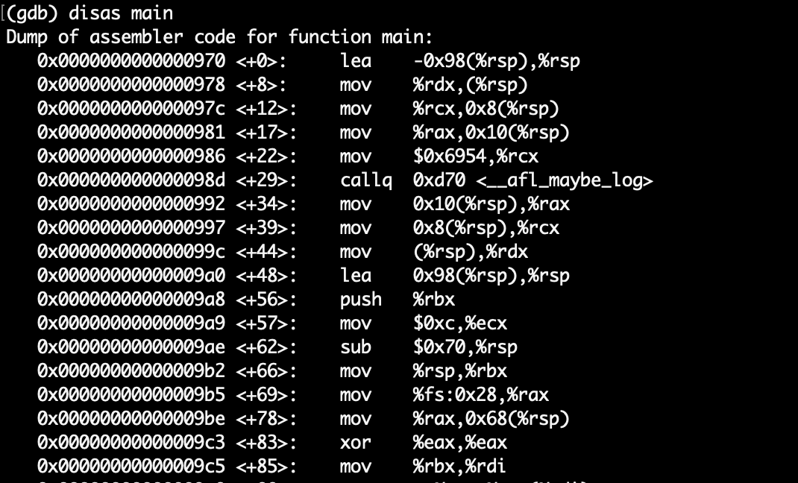
</br>[5.test的插桩痕迹]
</div>

`test` 程序从标准输入中读入数据，我们首先准备输入样本(种子)文件，样本文件必须保证程序可以正常运行，因为 afl 后续将根据样本文件进行随机变异，然后生成新的数据不断进行 fuzz：
```
$ mkdir in
$ echo "abcd" > in/1
$ mkdir out
```

`afl-fuzz` 仅支持标准输入和文件输入两种方式：
```
# 标准输入
$ afl-fuzz -i [input_dir] -o [output_dir] [program]
# 文件输入，文件名以命令行参数传入，使用 @@ 作为占位符
$ afl-fuzz -i [input_dir] -o [output_dir] [program] @@
```

接下来开始对 `test` 进行 fuzz：
```
$ afl-fuzz -i in/ -o out/ ./test
```
<div align="center">
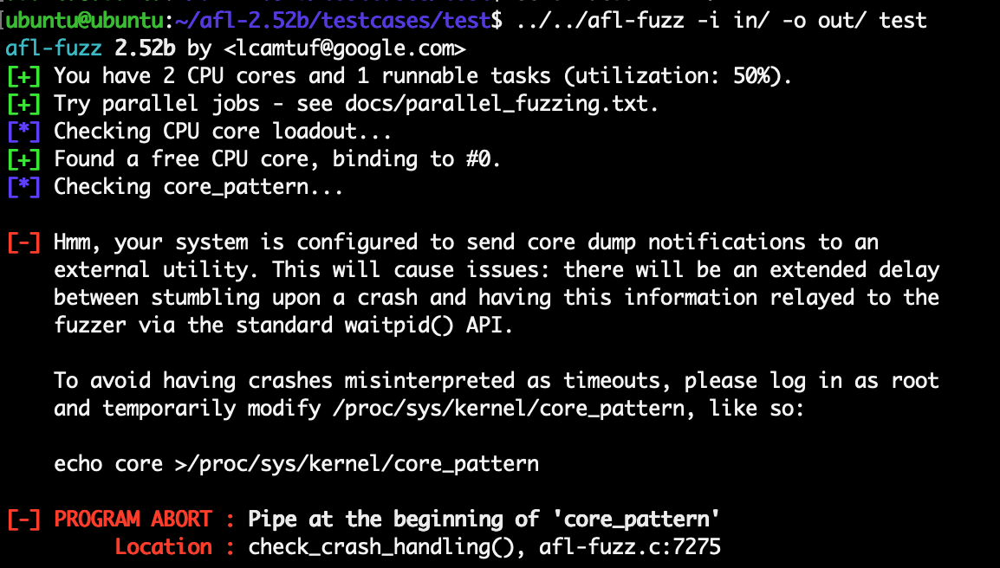
</br>[6.afl需要修改core到文件]
</div>

按照提示进行配置后，重新执行可以正常进行 fuzz，`afl-fuzz` 的工作界面如下：
<div align="center">
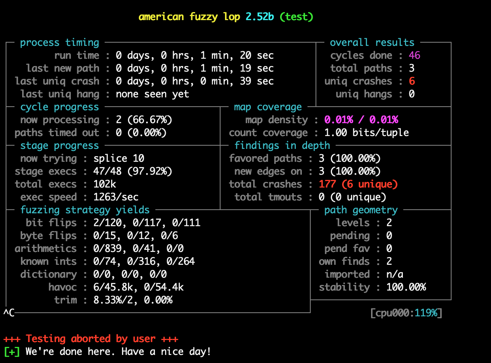
</br>[7.afl-fuzz工作界面]
</div>

其面板分为以下几个板块：
```
process timing: 进行 fuzz 的各项时间
overall results: 总体结果
    cycles done: afl对所有种子文件进行所有类型的变异测试为一轮，随后采用不同的
    变异方式进行下一轮fuzz；该数据有「洋红色/黄色/蓝色/绿色」颜色标识，当为绿色
    时表示 afl 有很长时间没有发现新的路径了，一般此时可以停止 fuzz 了。
    total paths: 总共发现的路径
    uniq crashes: 不同的 crash 的个数(fuzz的目标)
    uniq hangs: 不同的超时的个数
cycle progress: 当前轮次的进度
map coverage: 映射覆盖率
stage progress: 阶段进展
    now trying: 目前正在尝试的变异策略
    stage execs: 当前阶段的进度
    total execs: 总共累计的执行次数
    exec speed: 执行速度
findings indepth: 深度发现
Fuzzing strategy yields: 模糊测试策略产出
Path geometry: 路径几何
```

这里我们尝试跑了 2min 手动 `Ctrl-C`，共出了 6 个不同的 crash，我们复现试试：
<div align="center">
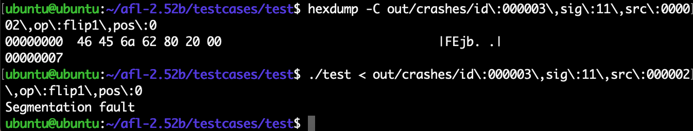
</br>[8.test测试crash数据]
</div>

我们来分析下这些 crash：
```
# gets() 栈溢出
$ hexdump -C out/crashes/id\:000000\,sig\:06\,src\:000000\,op\:havoc\,rep\:16 
00000000  00 80 f5 ff ff ff 00 e1  00 80 08 89 89 89 89 89  |................|
00000010  89 89 89 89 89 89 89 89  89 89 89 89 00 00 00 98  |................|
00000020  98 98 98 98 98 98 98 98  98 98 98 98 98 98 98 98  |................|
00000030  98 98 98 89 89 89 89 89  89 89 00 00 00 98 98 98  |................|
00000040  98 98 98 98 98 98 98 98  98 98 98 98 98 98 98 98  |................|
00000050  98 98 98 98 98 98 98 98  98 c9 98 98 98 98 98 98  |................|
00000060  98 98 98 98 98 98 98 98  f3 ff ff 2b 00 00 00 00  |...........+....|
00000070  2c                                                |,|
00000071

# gets() 栈溢出
$ hexdump -C out/crashes/id\:000001\,sig\:06\,src\:000000\,op\:havoc\,rep\:128 
00000000  41 01 70 70 01 00 ff ff  00 ff 06 64 20 8e 6b 6b  |A.pp.......d .kk|
00000010  6b 6b 6b 6b 6b 6b 6b 6b  4f 6b 6b 6b 6b 7c 6b 6b  |kkkkkkkkOkkkk|kk|
00000020  6b 00 6b 6b 6b 6b ff 80  61 61 80 6b 6b 6b 6b 6b  |k.kkkk..aa.kkkkk|
00000030  6b 6b 6b 6b 6b 6b 6b bc  63 6b 6b 00 10 a4 a4 ae  |kkkkkkk.ckk.....|
00000040  a4 a4 80 ff ef 00 a4 a4  a4 61 6b 80 00 6b 51 6b  |.........ak..kQk|
00000050  6b ff 80 61 61 61 6b 6b  6b 6b 6b 6b 6b 3e 61 61  |k..aaakkkkkkk>aa|
00000060  61 6b 6b 6b 80 6b 6b 6b  61 a4 a4 a4 85 a4 a4 00  |akkk.kkka.......|
00000070  10 a4 6b 6b 6b 6b 6b 6b  6b 6b 6b 6b 6b 6b 7e 6b  |..kkkkkkkkkkkk~k|
00000080  6b 6b 8a 41 41 41                                 |kk.AAA|
00000086

# gets() 栈溢出
$ hexdump -C out/crashes/id\:000002\,sig\:06\,src\:000001\,op\:havoc\,rep\:128 
00000000  38 4d 4f 4d 65 ff 00 10  00 40 00 62 ff 4d 7c ed  |8MOMe....@.b.M|.|
00000010  81 4d 7f ff 80 14 4d 4d  4f 59 65 4d ff 81 95 ff  |.M....MMOYeM....|
00000020  80 00 6d 81 7c 00 80 81  64 4d 4d 80 00 81 81 00  |..m.|...dMM.....|
00000030  4d 1b 00 e5 4d 1b 63 e5  ff 7f ff ff 4d ff ff ff  |M...M.c.....M...|
00000040  ff 40 00 62 4d 4d 7c 00  4f 59 62 4d 4d ff ff 14  |.@.bMM|.OYbMM...|
00000050  4d 4d 4f 59 80 00 40 00  62 4d 4d 7c 00 80 81 64  |MMOY..@.bMM|...d|
00000060  4d 4d 4d 4d ff b4 00 81  81 00 4d 4d ff ff ff 80  |MMMM......MM....|
00000070  00 81 81 00 4d 4d 81 1b  63 1b 40 00 62 4d 4d ff  |....MM..c.@.bMM.|
00000080  ff ff ff 40 4e 30 81 81  81 81 f8 ff ff ff 7f 0b  |...@N0..........|
00000090

# 首字母为 F，且字符串长度为 6
$ hexdump -C out/crashes/id\:000003\,sig\:11\,src\:000002\,op\:flip1\,pos\:0 
00000000  46 45 6a 62 80 20 00                              |FEjb. .|
00000007

# 格式化字符串漏洞，%n
$ hexdump -C out/crashes/id\:000004\,sig\:06\,src\:000002\,op\:havoc\,rep\:2 
00000000  66 25 6a 6e 80 20 00                              |f%jn. .|
00000007

# 首字母为 A，且字符串长度为 66
$ hexdump -C out/crashes/id\:000005\,sig\:11\,src\:000000\,op\:havoc\,rep\:64 
00000000  41 80 f3 07 f3 e1 f3 f3  f3 f3 f3 f3 f3 f3 f3 f3  |A...............|
00000010  f3 f3 f3 f3 f3 f3 f3 f3  f3 f3 f3 f3 f3 f3 f3 f3  |................|
*
00000030  f3 f3 f3 80 ff fe ff f3  20 20 20 20 29 64 6b 6b  |........    )dkk|
00000040  6a 41 00 40 25 f3 5d 41  40 f3                    |jA.@%.]A@.|
0000004a
```
>这里我们可以发现，afl 虽然标记了 6 个 uniq crash，但实际有 3 个相同的栈溢出；afl 只是按自身策略去尽量去重(路径覆盖)，实际的 crash 必须要人工进行分析测试。

afl-fuzz 的输出目录 `out`，同时也是工作目录，其目录结构如下：
```
$ tree out/
out/
├── crashes                 // 不同的 crash 输入数据
│   ├── id:000000,sig:06,src:000000,op:havoc,rep:16
│   ├── id:000001,sig:06,src:000000,op:havoc,rep:128
│   ├── id:000002,sig:06,src:000001,op:havoc,rep:128
│   ├── id:000003,sig:11,src:000002,op:flip1,pos:0
│   ├── id:000004,sig:06,src:000002,op:havoc,rep:2
│   ├── id:000005,sig:11,src:000000,op:havoc,rep:64
│   └── README.txt
├── fuzz_bitmap             // 覆盖率bitmap
├── fuzzer_stats            // fuzz数据统计
├── hangs                   // 不同的 hangs(挂起) 输入数据
├── plot_data               // 不同时刻 fuzz 进度记录
└── queue                   // 产生不同覆盖率的输入样本
    ├── id:000000,orig:1
    ├── id:000001,src:000000,op:flip1,pos:0,+cov
    └── id:000002,src:000000,op:havoc,rep:16,+cov
```

### 0x05 fuzz-upx
掌握了以上的基础操作，我们来尝试去 `upx` 工具进行 fuzz，进一步熟悉 afl 工具。

下载 `upx 3.96` 的源码(https://github.com/upx/upx/releases/tag/v3.96)：
```
$ wget "https://github.com/upx/upx/releases/download/v3.96/upx-3.96-src.tar.xz"
$ tar -xvf upx-3.96-src.tar.xz 
$ cd upx-3.96-src/
```

安装 upx 依赖组件：
```
$ apt install zlib1g zlib1g-dev
$ wget http://www.oberhumer.com/opensource/ucl/download/ucl-1.03.tar.gz
$ tar -xvf ./ucl-1.03.tar.gz
$ cd ucl-1.03/
$ ./configure CFLAGS="$CFLAGS -std=c90 -fPIC"
$ make
```

使用 `afl-gcc` 编译 upx：
```
$ CC=afl-gcc CXX=afl-g++ make all UPX_UCLDIR=/home/ubuntu/ucl-1.03/
```

尝试运行 `upx -h`：
<div align="center">

</br>[9.upx帮助信息]
</div>

接下来我们 fuzz `upx` 的解包流程，`upx -d` 需要一个二进制文件，我们使用 Linux 自带命令 `file` 作为种子文件：
```
$ mkdir in
$ cp /usr/bin/file in/
$ mkdir out
```

使用 afl 对 `upx` 解包流程进行 fuzz：
```
afl-fuzz -i in/ -o out/ ./src/upx.out -d @@
```

在运行 6 小时后后，我们收获了 2 个 crash：
<div align="center">
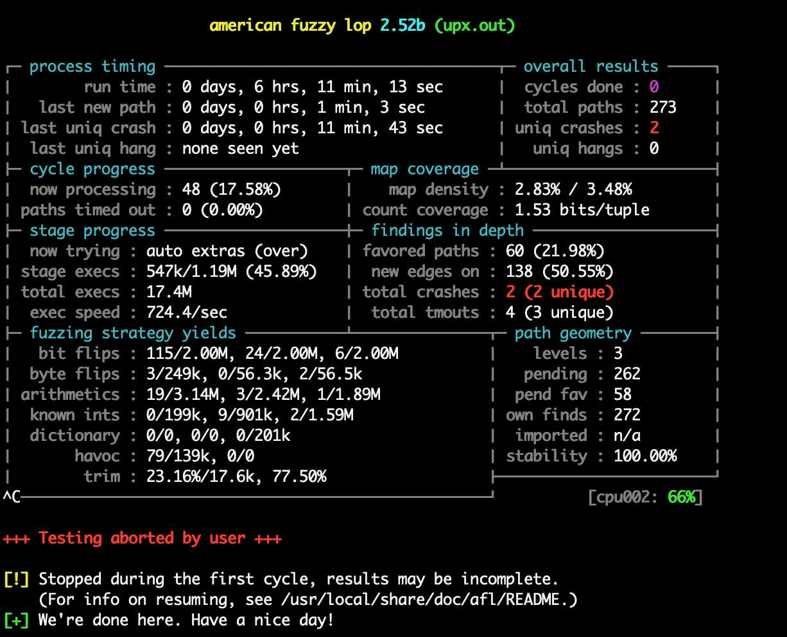
</br>[10.afl对upx模糊测试]
</div>

使用 GDB 调试 crash 文件如下，通过 `bt` 命令可以查看调用链：
<div align="center">
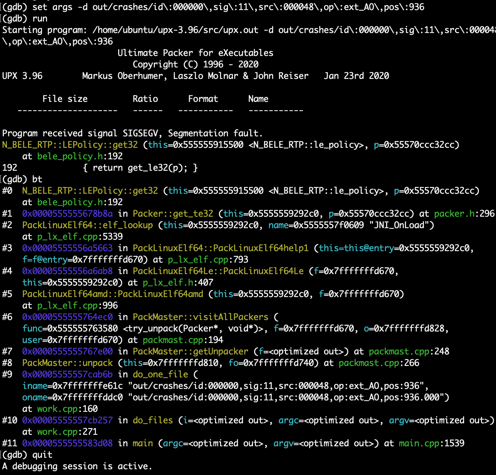
</br>[11.gdb分析upx的crash]
</div>

根据调用链结合源码进行动态调试分析，最终我们定位到 `[src]/src/p_lx_elf.cpp#5339` 代码中，`hp` 变量来源于 `&hasharr[bucket - symbias]`，三个变量的值都由输入控制，由于没有对 `bucket - symbias` 的结果进行检查，当后续通过 `get_te32()` 函数进行读取时，导致数组越界错误。
<div align="center">
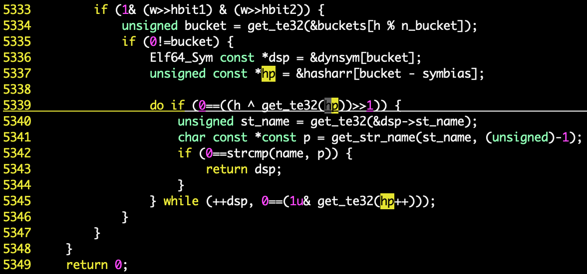
</br>[12.通过upx源码分析crash原因]
</div>

另一个 crash 也是相同的；在另一轮的尝试中，我们获取到了更多的 crash，但同样也是些不影响正常功能的 DoS；但这没有关系，至此我们熟悉了 afl 的概念和基础使用。

### 0x0n References:
https://lcamtuf.coredump.cx/afl/  
https://github.com/google/AFL  
https://afl-1.readthedocs.io/en/latest/user_guide.html  
https://www.fuzzingbook.org/  
https://zh.wikipedia.org/wiki/%E6%A8%A1%E7%B3%8A%E6%B5%8B%E8%AF%95  
https://desword.github.io/2018/11/01/fuzzer_simple_survey/  
https://xz.aliyun.com/t/4314  
https://snappyjack.github.io/articles/2019-12/AFL%E6%80%BB%E7%BB%93  
https://bbs.pediy.com/thread-249179.htm  
https://www.codeleading.com/article/96585044055/  
https://github.com/google/AFL/issues/41  
https://patchwork.kernel.org/project/qemu-devel/patch/20190320161842.13908-3-berrange@redhat.com/  
https://lkml.org/lkml/2019/6/3/988  
https://www.ruanyifeng.com/blog/2012/08/how_to_read_diff.html  
https://www.mail-archive.com/debian-bugs-dist@lists.debian.org/msg1643066.html  