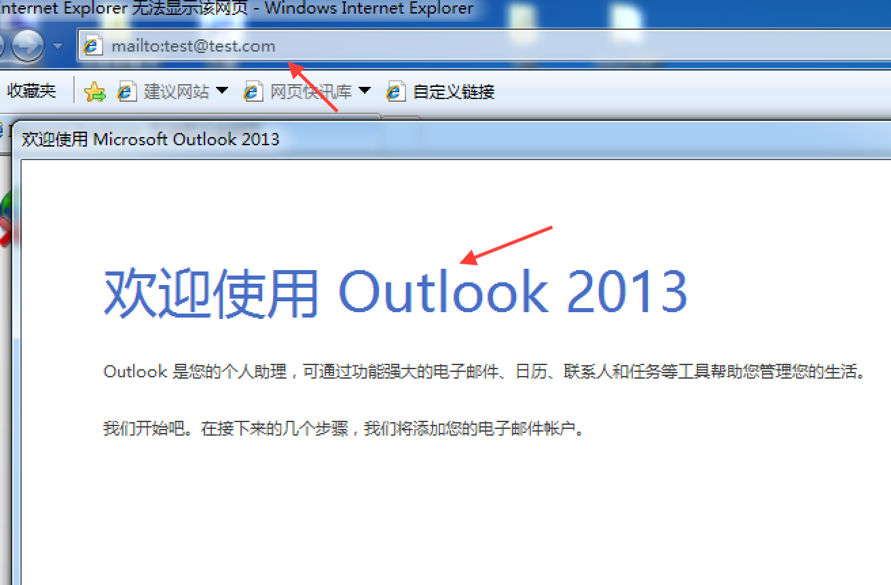
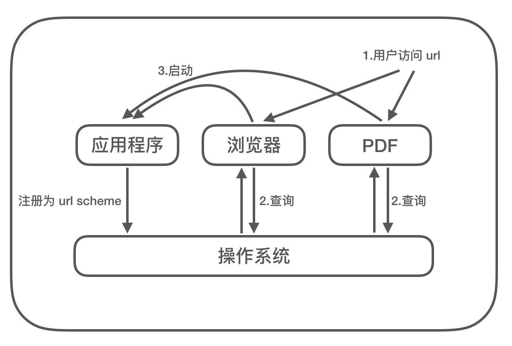
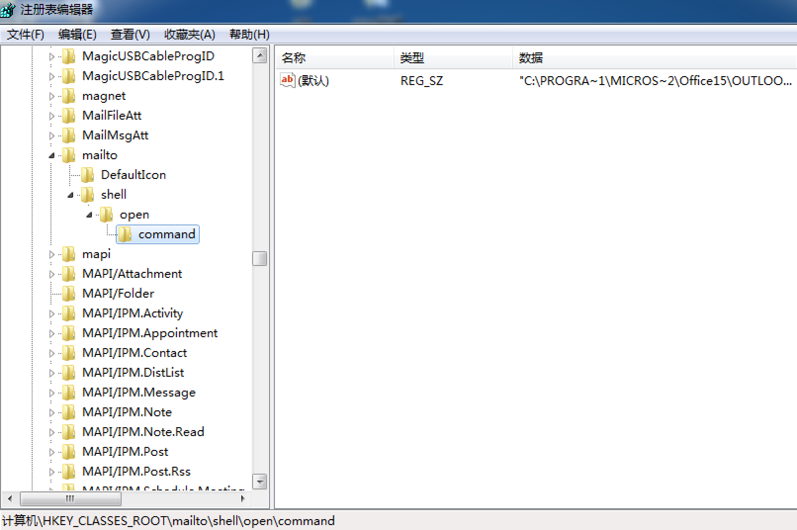
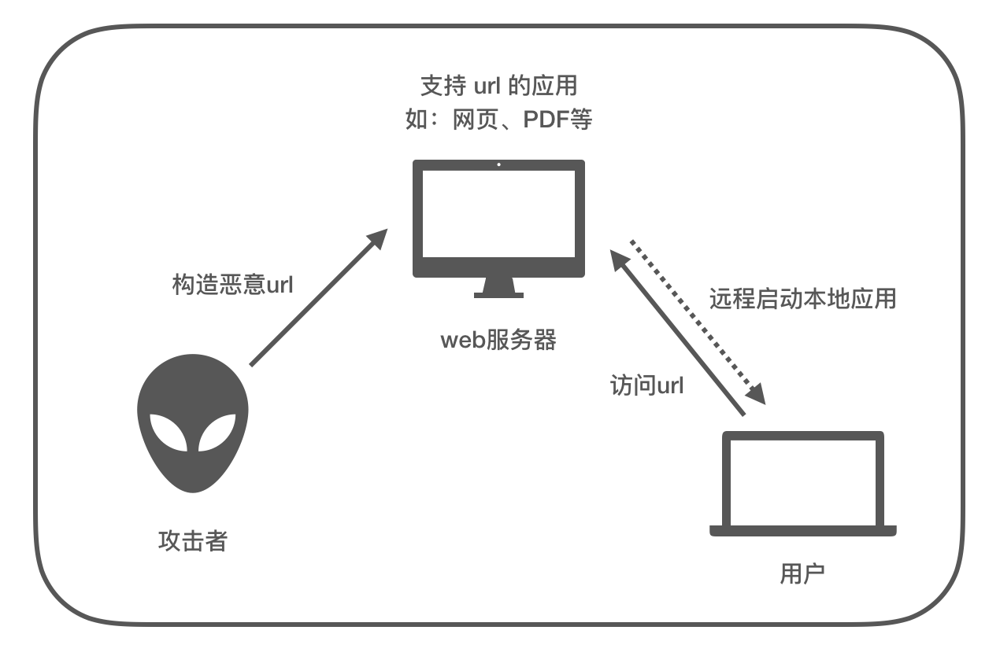
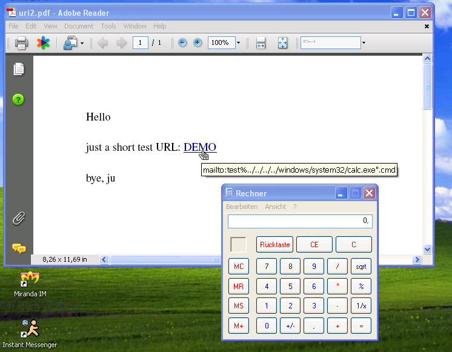
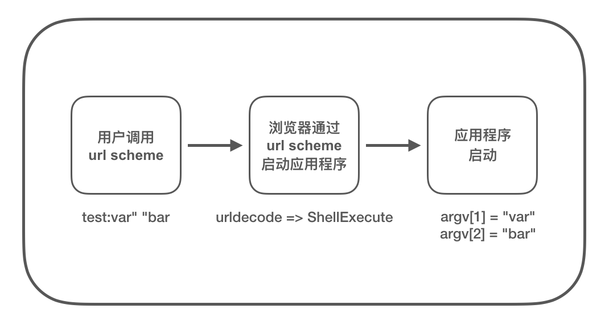
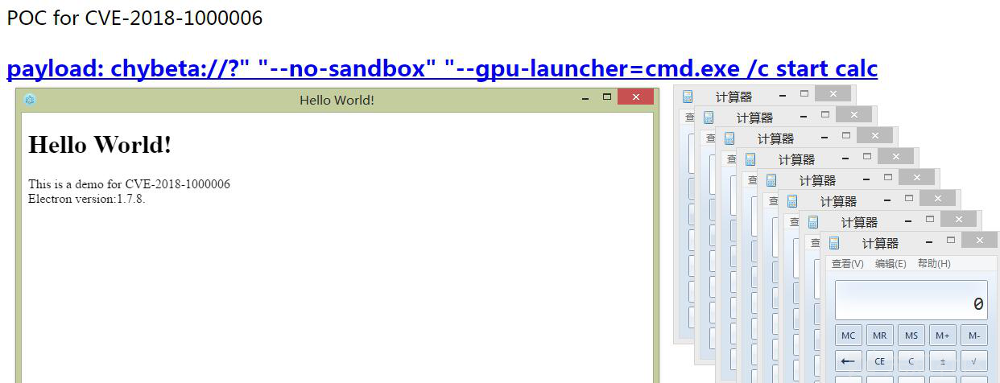
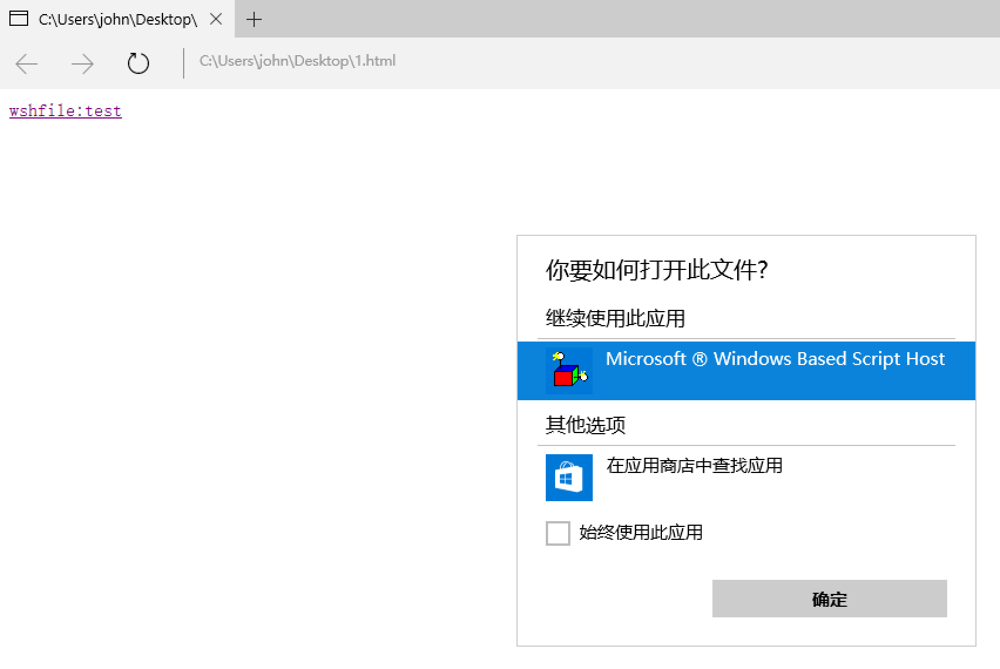
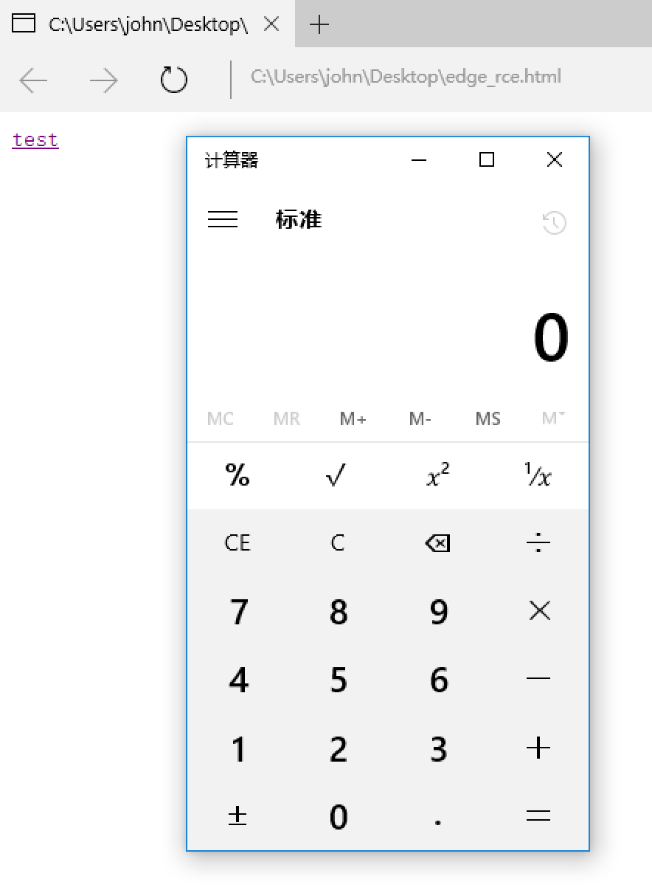

## 从CVE-2018-8495看PC端urlscheme的安全问题

Time: 2018.10.18  
Tags: 漏洞分析  

### 0x00 前言
本文受 CVE-2018-8495 漏洞的启发，以学习的目的，针对 PC 端 `url scheme` 的安全问题进行了分析研究。

说到 `url scheme` 的安全问题，这并不是一个新问题，早在 2008 年就有相关的研究和利用；如今 2018 年又陆续出现了安全问题，包括 1 月的 Electron 命令注入(CVE-2018-1000006) 以及 10 月的 Edge RCE(CVE-2018-8495)，可见 `url scheme` 的安全问题值得去一探究竟。

`url scheme` 也称为 `url protocol` 或 `url handler`，本文使用 `url scheme` 这个名称。

### 0x01 url scheme是什么
**常见的url scheme应用场景**   
在平时使用电脑的过程中，常常会发现点击某一个链接就会尝试启动本地的应用程序，比如点击类似 `mailto://test@test.com`，就会启动邮件客户端，点击 `thunder://xxxxx`，就会启动迅雷客户端；这就是 `url scheme` 的应用。除此之外，我们使用浏览器也会发现地址栏中一些不同的前缀，常用的有 `http://`、`https://`、`ftp://` 和 `file://`，这同样是 `url scheme` 的应用场景。

各大操作系统开发商和浏览器开发商为了提高用户体验，丰富浏览器的功能，允许开发人员将 URI 与本地的应用程序进行关联，从而在用户使用浏览器时，可以通过点击某一链接即可启动应用程序；将这个功能简称为 `url scheme`。比如在 `windows7` 下使用 `IE8` 启动默认邮件客户端 `outlook`：

正因为 `url scheme` 这个优秀的功能设计，各大操作系统开发商都对此进行了支持，无论是 PC 端 Windows, MAC, Linux，还是移动端 iOS, Android 都有良好的支持。本文针对 PC 端下的 `url scheme` 的安全问题进行分析，移动端下同样也有类似的问题，但利用方式不同，这里就不展开了。

**url scheme工作流程**  
在了解 `url scheme` 的功能后，可以大致理解到 `url scheme` 的工作流程；应用程序在操作系统中注册 `url scheme` 项，当浏览器或其他支持 url 的应用访问 特定的 `url scheme` 时，从系统中匹配相对应的 `url scheme` 项，从而启动该应用程序；可见这是一个三方相互支持的功能。

正因如此，对于 `url scheme` 这个功能，在操作系统、浏览器(或其他支持 url 的应用)、应用程序这三个环节中，无论哪个环节出现了安全问题，或者是相互支持出现了问题，都将影响 `url scheme` 功能，最终给用户带来安全问题。

### 0x02 创建 url scheme
那么 `url scheme` 功能是如何在操作系统中注册的呢？不同的操作系统都有不同的实现方式，这里以 Windows7 为例进行演示说明。

在 Windows7 上，`url scheme` 被记录在注册表 `HKEY_CLASSES_ROOT` 下，如 `mailto` 的相关字段：

如果要创建一个新的 `url scheme`，直接在 `HKEY_CLASSES_ROOT` 添加即可，并在相应的字段中填入对应的值。创建的子项名即为 `url scheme` 功能名，在该子项下还包含两个项：`DefaultIcon` 和 `shell`，`DefaultIcon` 包含该功能所使用的默认图标路径；在 `shell` 项下继续创建子项，例如: open，然后在 `open` 项下创建 `command` 子项，用于描述应用程序的路径以及参数。

举个例子，创建 `calc` 用于启动 `C:\Windows\System32\calc.exe`：

	HKEY_CLASSES_ROOT
		calc
		(Default) = "URL:Calc Protocol"
		URL Protocol = ""
		DefaultIcon
		(Default) = "C:\Windows\System32\calc.exe,1"
		shell
			open
				command
					(Default) = "C:\Windows\System32\calc.exe" "%1"

补充一点：实际上，在 Windows 中有两种添加 `url scheme` 的方式，以上是直接添加注册表的方式(Pluggable Protocol)，还有一种是异步可插拔协议(Asynchronous Pluggable Protocol)，注册的协议会记录在 `HKEY_CLASSES_ROOT\PROTOCOLS\` 下。这里就不展开了，详情可以参考：<https://docs.microsoft.com/en-us/previous-versions/windows/internet-explorer/ie-developer/platform-apis/aa767916(v%3dvs.85)>

### 0x03 安全隐患
对于 `url scheme` 功能，简单来讲就是「通过 url 可以启动某一个本地的应用程序」，这无疑大大提高了用户体验，但同时引入一些安全隐患，比如用户可以通过浏览器启动一个恶意程序，或者用户启动的应用程序具有特殊的功能可以被调用(如：删除文件、启动网络连接)。

除此之外，对于包含 url 的的相关应用，用户是往往作为一个使用者、阅读者，而不是编辑者；也就是说 url 可以被攻击者恶意构造，从而达到远程启动本地应用程序的效果。

那么在操作系统中，有哪些 `url scheme` 是可以被调用的呢？这里提供三个脚本用于导出三大 PC 系统下 `url scheme`：

Windows: [<http://./>]  
MAC: [<http://./>]  
Linux: [<http://./>]  

(脚本来源于：<https://www.blackhat.com/presentations/bh-europe-08/McFeters-Rios-Carter/Whitepaper/bh-eu-08-mcfeters-rios-carter-WP.pdf>)

运行脚本程序，可以看到系统下有不少可以调用的 `url scheme`，其中包括操作系统默认支持的，如 `http`、`ftp`、`mailto`，也有第三方的应用程序，如 `qq`、`thunder`；如果这些应用程序出现安全问题，比如支持删除文件、启动另一个程序等敏感操作，最终在 `url scheme` 的帮助下，都将远程触发的安全问题。

除了应用程序可能出现的安全问题，浏览器(或其他程序)在进行 url 解析并启动应用程序的过程也可以出现安全问题；并且这三方相互支持的过程中，仍然可能出现问题；无论是哪一个环节出现的安全问题，其危害最终都会在 `url scheme` 下被放大。

本文就这以上可能出现安全问题的环节进行分析，并举例说明。

### 0x04 操作系统的问题
在 2007 年，Heise Security 公开了由 「`url scheme` 导致远程命令执行」的漏洞，其出现在 Windows XP 下已安装 IE7 版本的系统中，影响范围包括所有支持 `url scheme` 的应用程序。

其构造的 PoC 如下：

	mailto:test%../../../../windows/system32/calc.exe".cmd

在 Windows XP 下运行结果如下：

图片来源于：<http://www.h-online.com/security/news/item/URI-problem-also-affects-Acrobat-Reader-and-Netscape-733744.html>

其造成漏洞的原因是由于微软通过安装适用于 Windows XP 的 IE7 改变了操作系统对 url 的处理，而应用程序直接将路径传递给操作系统用于启动，最终导致包含 `％` 字符的特殊链接导致启动任意程序。

在漏洞公开后，微软并没有发布修复补丁，并且认为这不是 Windows XP 的原因，随后各大应用程序开发人员对该漏洞进行了修复。当然，上层应用可以对输入的参数进行检查，但这里也可以认为是操作系统方面的问题，导致了 `url scheme` 远程命令执行。

### 0x05 浏览器的参数注入
2018 年，在 `url scheme` 的安全问题中，有两个问题是由于 Windows 下的 IE 和 Edge 参数注入引发的，其中一个是 Electron 自定义协议命令注入(CVE-2018-1000006)，另一个是 Edge 远程代码执行(CVE-2018-8495)。

在 Windows 下 IE 和 Edge 对 `url scheme` 的处理方式有些不同，在浏览器接收到一个 `url scheme` 后，访问注册表查询对应的应用程序路径，随后进行 url 解码，然后调用 `ShellExecute` 函数簇，启动应用程序；正是因为 url 解码这一步造成了双引号闭合，从而引起了参数注入问题。示意图如下：

**Electron 自定义协议命令注入**  
2018 年 1 月，Electron 发布了由自定义协议而导致命令注入的安全公告(CVE-2018-1000006)，由于参数注入而引发的问题，构造的 PoC 如下：

	chybeta://?" "--no-sandbox" "--gpu-launcher=cmd.exe /c start calc

使用 IE 浏览器访问该链接，最终生成的启动参数如下：

	electron.exe "//?" "--no-sandbox" "--gpu-launcher=cmd.exe /c start calc"

通过参数注入，调用 electron 中支持的 `--gpu-launcher` 参数，传入 `cmd.exe` 启动计算器，如下图：

图片来源于：<https://xz.aliyun.com/t/1990>，详情可以参考这个链接。

**Edge 远程代码执行**  
2018 年 10 月，Edge 公开了远程代码执行的安全公告(CVE-2018-8495)，同样也是利用参数注入，最终达到了远程代码执行的效果；整个利用过程颇具巧妙性，本文对此进行详细的分析。

首先说一点的是，在 Edge 中居然可以打开一些不合法的 `url scheme`(没有包含 `URL Protocol` 字段)，比如  `WSHFile` 项：

当然在 Windows7 和 Windows8 下不能打开。

而恰恰 `WSHFile` 项指向了 `wscript.exe`，这个应用程序非常熟悉是Windows 内置的脚本解释器，那么可以利用 `WSHFile` 尝试去运行一个脚本；除此之外，上文提到 Edge 浏览器中存在参数注入的问题，那么是否有脚本可以接收参数并用于执行呢？

漏洞作者最终找到：

	C:\Windows\WinSxS\amd64_microsoft-windows-a..nagement-appvclient_
	31bf3856ad364e35_10.0.17134.48_none_c60426fea249fc02\SyncAppvPublishingServer.vbs

该脚本文件支持接收参数，并且会将命令直接拼接到字符串中，然后通过 `powershell` 进行执行。

	psCmd = "powershell.exe -NonInteractive -WindowStyle 
	 Hidden-ExecutionPolicy RemoteSigned -Command &{" & syncCmd & "}"

最终构造的 PoC 如下：

	<a id="q" href='wshfile:test/../../WinSxS/AMD921~1.48_/SyncAppvPublishingServer.vbs" test test;calc;"'>test</a>
	

以及执行后触发的效果：

目前 Windows10 上已经发布了修复补丁，Edge 已经不能调用这种不合法的 `url scheme` 了。

除此之外，404实验室的小伙伴在分析漏洞的过程中，也有一些额外的发现，如在注册表 `HKEY_CLASSES_ROOT` 还发现了和 `WSHFile` 类似的 `url scheme`，都指向 `wscript.exe`，同样也可以触发远程代码执行。包括：

	1.wshfile
	2.wsffile
	3.vbsfile
	4.vbefile
	5.jsefile

还有在 `C:\Windows\System32\` 下也存在 `SyncAppvPublishingServer.vbs`，同样也可以利用，并且比漏洞作者所提供的更加可靠。

除了 `SyncAppvPublishingServer.vbs` 这个文件， 在 `C:\Windows\System32\Printing_Admin_Scripts\zh-CN` 下的 `pubprn.vbs` 也同样可以触发代码执行。

补充一点，在 Windows7 系统下 chrome 与 Edge 有相同的特性——会打开一些不合法的 `url scheme`，但由于 chrome 不存在参数注入的问题，所以可以暂且认为是安全的。

### 0x06 应用程序的问题
2017 年 12 月，macOS 上的 helpViewer 应用程序被公开由 XSS 造成文件执行的漏洞(CVE-2017-2361)，影响 macOS Sierra 10.12.1 以下的版本；该漏洞同样也利用了 `url scheme`，攻击者可以构造恶意页面，从而发动远程攻击。这是典型的由于应用程序所导致的 `url scheme` 安全问题。

漏洞详情可以参考：<https://bugs.chromium.org/p/project-zero/issues/detail?id=1040&can=1&q=reporter%3Alokihardt%40google.com%20&sort=-reported&colspec=ID%20Status%20Restrict%20Reported%20Vendor%20Product%20Finder%20Summary&start=100>

其构造的 PoC 如下：

	document.location = "help:///Applications/Safari.app/Contents/
	Resources/Safari.help/%25252f..%25252f..%25252f..%25252f..%25252f..%25252f..
	%25252f/System/Library/PrivateFrameworks/Tourist.framework/Versions/A/
	Resources/en.lproj/offline.html?redirect=javascript%253adocument.write(1)";

在这个漏洞的利用过程中，可以发现操作系统和浏览器并没有出现问题，而是通过 `url scheme` 打开的应用程序出现了问题。通过对利用链的分析，可以了解到其中几个巧妙的点：  
1. 利用 `url scheme` 中的 help 协议打开应用程序 Safari.help  
2. 使用双重 url 编码绕过 helpViewer 对路径的检查，打开一个可以执行 JavaScript 的页面    
3. 使用 helpViewer 的内置协议 `x-help-script` 打开应用程序(PoC不包含)

### 0x07 总结
`url scheme` 功能的便捷性得力于操作系统、浏览器(或其他支持 url 的应用)以及应用程序三方的相互支持；要保证 `url scheme` 功能安全可靠，就必须牢牢把关这三方的安全。

除此之外，不同的操作系统对 `url scheme` 实现方式不同，不同的浏览器也有自己的特性，应用程序也各有各的处理方式，多种组合的结果，就有可能出现一些意料之外的安全问题。

最后感谢 404 实验室小伙伴 @LoRexxar 与 @dawu 在分析过程中给我的帮助。

### 0x08 References
1. CVE-2018-8495分析: <https://leucosite.com/Microsoft-Edge-RCE/>  
2. Seebug.paper: <https://paper.seebug.org/515/>  
3. 先知: <https://xz.aliyun.com/t/1990>  
4. electronjs: <https://electronjs.org/blog/protocol-handler-fix>  
5. blackhat: <https://www.blackhat.com/presentations/bh-europe-08/McFeters-Rios-Carter/Whitepaper/bh-eu-08-mcfeters-rios-carter-WP.pdf>  
6. blackhat: <https://www.blackhat.com/presentations/bh-dc-08/McFeters-Rios-Carter/Presentation/bh-dc-08-mcfeters-rios-carter.pdf>  
7. oreilly: <https://www.oreilly.com/library/view/hacking-the-next/9780596806309/ch04.html>  
8. Github: <https://github.com/ChiChou/LookForSchemes>  
9. MSRC.CVE-2018-8495: <https://portal.msrc.microsoft.com/en-US/security-guidance/advisory/CVE-2018-8495>  
10. Microsoft: <https://docs.microsoft.com/en-us/windows/uwp/launch-resume/reserved-uri-scheme-names>  
11. Microsoft: <https://docs.microsoft.com/en-us/previous-versions/windows/internet-explorer/ie-developer/platform-apis/aa767914(v=vs.85)>  
12. Microsoft: <https://docs.microsoft.com/en-us/previous-versions/windows/internet-explorer/ie-developer/platform-apis/aa767916(v%3dvs.85)>  
13. h-online: <http://www.h-online.com/security/news/item/URI-problem-also-affects-Acrobat-Reader-and-Netscape-733744.html>  
14. chromium: <https://bugs.chromium.org/p/project-zero/issues/detail?id=1040&can=1&q=reporter%3Alokihardt%40google.com%20&sort=-reported&colspec=ID%20Status%20Restrict%20Reported%20Vendor%20Product%20Finder%20Summary&start=100>  