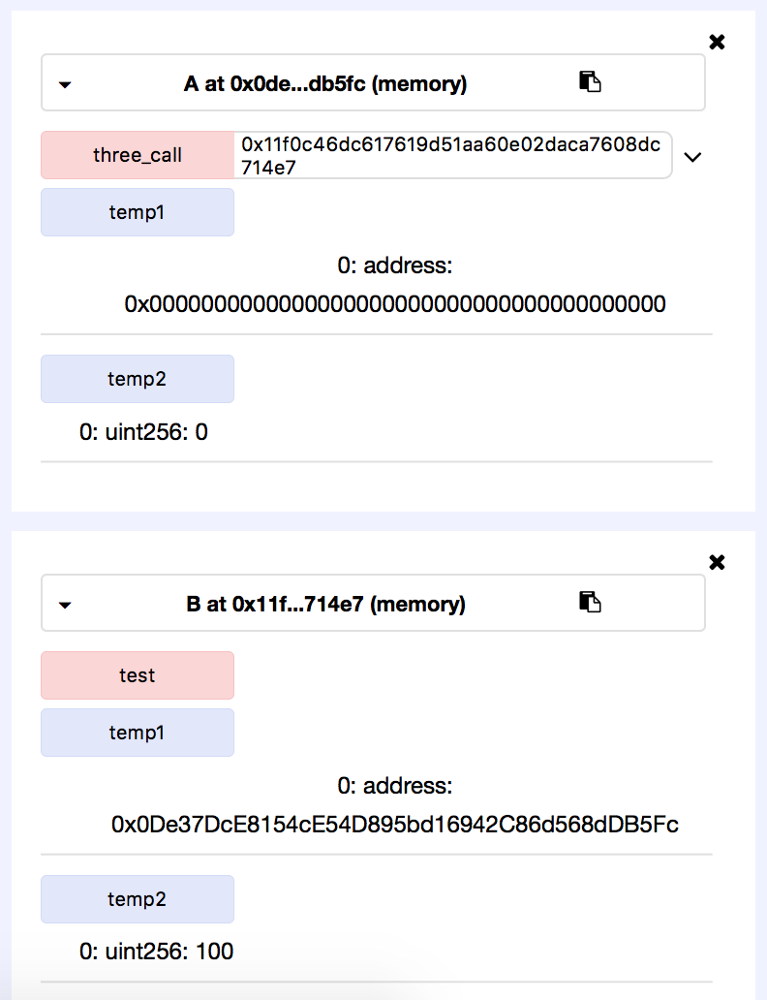
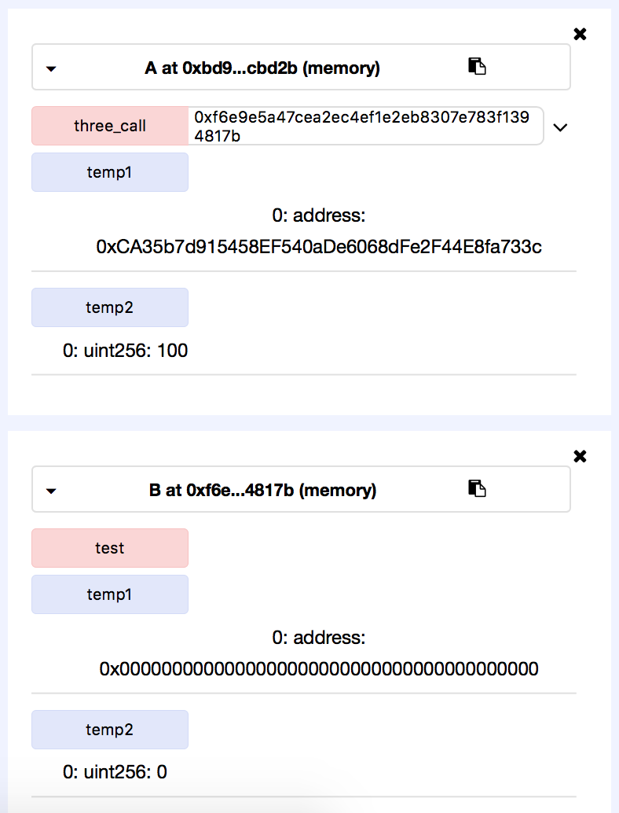
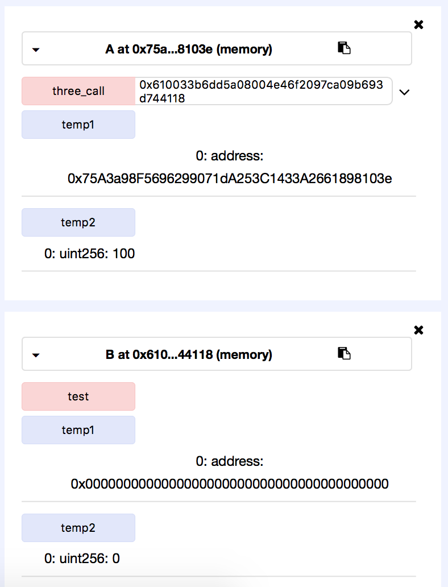
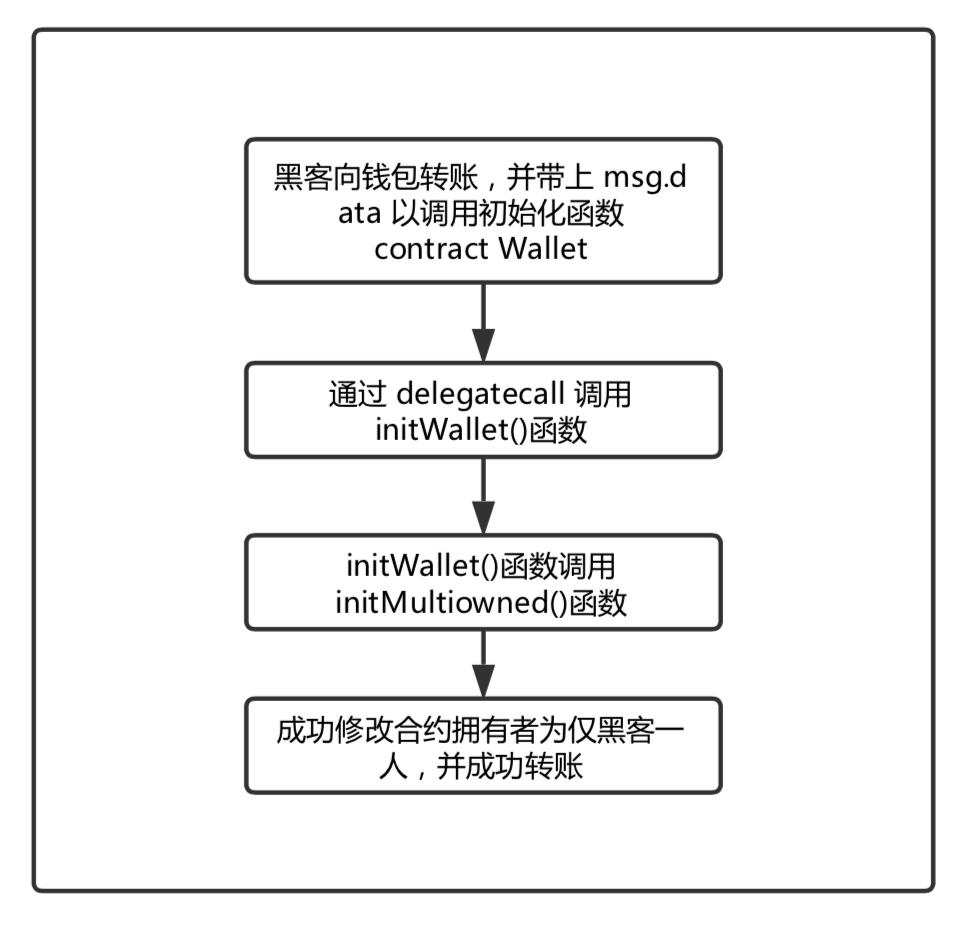
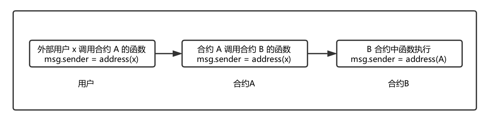
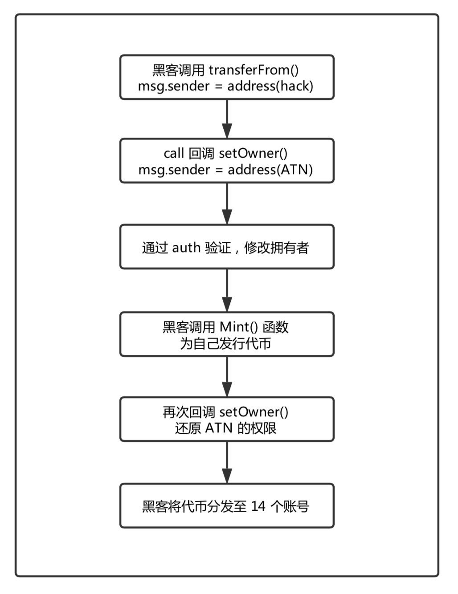
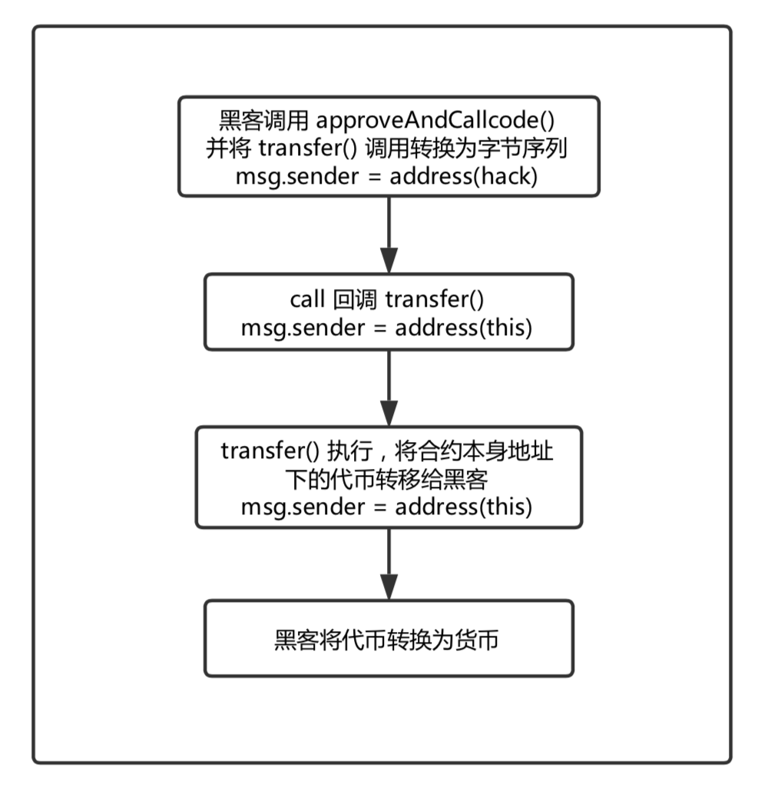

## 以太坊Solidity合约call函数簇滥用导致的安全风险

Time: 2018.06.26  
Tags: 区块链,漏洞分析  

### 0x00 前言

Solidity [[1](#ref)] 是一种用与编写以太坊智能合约的高级语言，语法类似于 JavaScript。Solidity 编写的智能合约可被编译成为字节码在以太坊虚拟机上运行。Solidity 中的合约与面向对象编程语言中的类（Class）非常类似，在一个合约中同样可以声明：状态变量、函数、事件等。同时，一个合约可以调用/继承另外一个合约。

在 Solidity 中提供了 `call`、`delegatecall`、`callcode` 三个函数来实现合约之间相互调用及交互。正是因为这些灵活各种调用，也导致了这些函数被合约开发者“滥用”，甚至“肆无忌惮”提供任意调用“功能”，导致了各种安全漏洞及风险：

2017.7.20，Parity Multisig电子钱包版本 1.5+ 的漏洞被发现，使得攻击者从三个高安全的多重签名合约中窃取到超过 15 万 ETH [[2](#ref)]，其事件原因是由于未做限制的 `delegatecall` 函数调用了合约初始化函数导致合约拥有者被修改。

2018.6.16，「隐形人真忙」在先知大会上演讲了「智能合约消息调用攻防」的议题[[3](#ref)]，其中提到了一种新的攻击场景—— `call` 注⼊，主要介绍了利用对 `call` 调用处理不当，配合一定的应用场景的一种攻击手段。接着于 2018.6.20，`ATN` 代币团队发布「ATN抵御黑客攻击的报告」[[4](#ref)]，报告指出黑客利用 `call` 注入攻击漏洞修改合约拥有者，然后给自己发行代币，从而造成 `ATN` 代币增发。

由此本文主要是针对 Solidity 合约调用函数`call`、`delegatecall`、`callcode` 三种调用方式的异同、滥用导致的漏洞模型并结合实际案例进行分析介绍。

### 0x01 Solidity 的三种调用函数

在 Solidity 中，`call` 函数簇可以实现跨合约的函数调用功能，其中包括
 `call`、`delegatecall` 和 `callcode` 三种方式。  

以下是 Solidity 中 `call` 函数簇的调用模型：

	<address>.call(...) returns (bool)
	<address>.callcode(...) returns (bool)
	<address>.delegatecall(...) returns (bool)

这些函数提供了灵活的方式与合约进行交互，并且可以接受任何长度、任何类型的参数，其传入的参数会被填充至 32 字节最后拼接为一个字符串序列，由 EVM 解析执行。

在函数调用的过程中， Solidity 中的内置变量 `msg` 会随着调用的发起而改变，`msg` 保存了调用方的信息包括：调用发起的地址，交易金额，被调用函数字符序列等。

**三种调用方式的异同点**

* call: 最常用的调用方式，调用后内置变量 `msg` 的值**会修改**为调用者，执行环境为**被调用者**的运行环境(合约的 storage)。
* delegatecall: 调用后内置变量 `msg` 的值**不会修改**为调用者，但执行环境为**调用者**的运行环境。
* callcode: 调用后内置变量 `msg` 的值**会修改**为调用者，但执行环境为**调用者**的运行环境。

通过下面的例子对比三种调用方式，在 `remix` 部署调试，部署地址为 `0xca35b7d915458ef540ade6068dfe2f44e8fa733c`：

	pragma solidity ^0.4.0;

	contract A {
	    address public temp1;
	    uint256 public temp2;
    
	    function three_call(address addr) public {
	        addr.call(bytes4(keccak256("test()")));					// 1
	        //addr.delegatecall(bytes4(keccak256("test()")));		// 2
	        //addr.callcode(bytes4(keccak256("test()")));			// 3
	    }
	}

	contract B {
	    address public temp1;
	    uint256 public temp2;

	    function test() public  {
	        temp1 = msg.sender;
	        temp2 = 100;
	    }
	}

在部署后可以看到合约 A 的变量值： `temp1 = 0x0, temp2 = 0x0`，同样合约 B 的变量值也是： `temp1 = 0x0, temp2 = 0x0`。

现在调用语句1 `call` 方式，观察变量的值发现合约 A 中变量值为 `0x0`，而**被调用者**合约 B 中的 `temp1 = address(A), temp2 = 100`：

现在调用语句2 `delegatecall` 方式，观察变量的值发现合约 B 中变量值为 `0x0`，而**调用者**合约 A 中的 `temp1 = 0xca35b7d915458ef540ade6068dfe2f44e8fa733c, temp2 = 100`：

现在调用语句3 `callcode` 方式，观察变量的值发现合约 B 中变量值为 `0x0`，而**调用者**合约 A 中的 `temp1 = address(A), temp2 = 100`：

### 0x02 delegatecall 「滥用」问题
>delegatecall:  调用后内置变量 `msg` 的值**不会修改**为调用者，但执行环境为**调用者**的运行环境。

#### 原理
在智能合约的开发过程中，合约的相互调用是经常发生的。开发者为了实现某些功能会调用另一个合约的函数。比如下面的例子，调用一个合约 A 的 `test()` 函数，这是一个正常安全的调用。

	function test(uint256 a) public {
		// codes
	}

	function callFunc() public {
		<A.address>.delegatecall(bytes4(keccak256("test(uint256)")), 10);
	}
	
但是在实际开发过程中，开发者为了兼顾代码的灵活性，往往会有下面这种写法：

	function callFunc(address addr, bytes data) public {
		addr.delegatecall(data);
	}

这将引起任意 public 函数调用的问题：合约中的 `delegatecall` 的调用地址和调用的字符序列都由用户传入，那么完全可以调用任意地址的函数。

除此之外，由于 `delegatecall` 的执行环境为调用者环境，当调用者和被调用者有相同变量时，如果被调用的函数对变量值进行修改，那么修改的是调用者中的变量。

#### 利用模型
下面的例子中 B 合约是业务逻辑合约，其中存在一个任意地址的 `delegatecall` 调用。

	contract B {
		address owner;
	
	    function callFunc(address addr, bytes data) public {
	        addr.delegatecall(data);
	        //address(Attack).delegatecall(bytes4(keccak256("foo()")));  //利用代码示意
	    }
	}

攻击者对应这种合约可以编写一个 Attack 合约，然后精心构造字节序列(将注释部分的攻击代码转换为字节序列)，通过调用合约 B 的 `delegatecall`，最终调用 Attack 合约中的函数，下面是 Attack 合约的例子：

	contract Attack {
		address owner;
	
	    function foo() public {
	        // any codes
	    }
	}
	
对于 `delegatecall` 「滥用」的问题，实际的漏洞效果取决于 Attack 合约中的攻击代码，可能造成的安全问题包括：

1. 攻击者编写一个转账的函数，窃取合约 B 的货币
2. 攻击者编写设置合约拥有者的函数，修改合约 B 的拥有者

#### delegatecall 安全问题案例

**Parity MultiSig钱包事件**  

2017.7.20，Parity Multisig电子钱包版本 1.5+ 的漏洞被发现，使得攻击者从三个高安全的多重签名合约中窃取到超过 15 万 ETH ，按照当时的 ETH 价格来算，大约为 3000 万美元。

其事件原因是由于未做限制的 `delegatecall` 可以调用 `WalletLibrary` 合约的任意函数，并且其钱包初始化函数未做校验，导致初始化函数可以重复调用。攻击者利用这两个条件，通过 `delegatecall` 调用 `initWallet()` 函数，最终修改了合约拥有者，并将合约中的以太币转到自己的账户下。

下面是存在安全问题的代码片段：  
(Github/parity: <https://github.com/paritytech/parity/blob/4d08e7b0aec46443bf26547b17d10cb302672835/js/src/contracts/snippets/enhanced-wallet.sol>)

a. delegatecall 调用代码：  
(`contract Wallet is WalletEvents`)

	// gets called when no other function matches
	  function() payable {
	    // just being sent some cash?
	    if (msg.value > 0)
	      Deposit(msg.sender, msg.value);
	    else if (msg.data.length > 0)
	      _walletLibrary.delegatecall(msg.data);
	  }

b. initWallet() 与 initMultiowned() 代码片段：  
(`contract WalletLibrary is WalletEvents`)

	function initWallet(address[] _owners, uint _required, uint _daylimit) {
	    initDaylimit(_daylimit);
	    initMultiowned(_owners, _required);
	}
	
	...
	
	function initMultiowned(address[] _owners, uint _required) {
	    m_numOwners = _owners.length + 1;
	    m_owners[1] = uint(msg.sender);
	    m_ownerIndex[uint(msg.sender)] = 1;
	    for (uint i = 0; i < _owners.length; ++i) {
	      m_owners[2 + i] = uint(_owners[i]);
	      m_ownerIndex[uint(_owners[i])] = 2 + i;
	    }
	    m_required = _required;
	}

其中钱包初始化函数 `initMultiowned()` 未做校验，可以被多次调用，存在安全隐患，但由于其位于 `WalletLibrary` 合约下，是不能直接调用的。黑客利用 `Wallet` 合约中的 `delegatecall` 调用 `WalletLibrary` 合约的 `initWallet()` 函数，初始化整个钱包，将合约拥有者修改为仅黑客一人，随后进行转账操作。

黑客攻击链：

 
除了上述 `delegatecall` 滥用的案例，在分析研究的过程中，发现有部分蜜罐合约利用 `delegatecall` 的特性(拷贝目标到自己的运行空间中执行)，在代码中暗藏后门，暗中修改转账地址，导致用户丢失货币。有关 `delegatecall` 蜜罐的详情请参考「以太坊蜜罐智能合约分析」(<https://paper.seebug.org/631/>)，其中的 「4.2 偷梁换柱的地址(访问控制)：firstTest」小节。

### 0x03 call 安全问题
>call: 最常用的调用方式，调用后内置变量 `msg` 的值**会修改**为调用者，执行环境为**被调用者**的运行环境。

`call` 注入是一种新的攻击场景，由「隐形人真忙」在先知大会上演讲「智能合约消息调用攻防」议题上提出，原因是对 `call` 调用处理不当，配合一定的应用场景的一种攻击手段。

#### call 注入原理
**call 调用修改 msg.sender 值**  
通常情况下合约通过 `call` 来执行来相互调用执行，由于 `call` 在相互调用过程中内置变量 `msg` 会随着调用方的改变而改变，这就成为了一个安全隐患，在特定的应用场景下将引发安全问题。

外部用户通过 call 函数再调用合约函数：

**高度自由的 call 调用**

在某些应用场景下，调用函数可以由用户指定；下面是 `call` 函数的调用方式：

	<address>.call(function_selector, arg1, arg2, ...)
	<address>.call(bytes)

从上面可以看出，`call` 函数拥有极大的自由度：

1. 对于一个指定合约地址的 `call` 调用，可以调用该合约下的任意函数
2. 如果 `call` 调用的合约地址由用户指定，那么可以调用任意合约的任意函数

为了便于理解，可以将智能合约中的 `call` 函数类比为其他语言中的 `eval` 函数，`call` 函数相当于给用户提供了随意调用合约函数的入口，如果合约中有函数以 `msg.sender` 作为关键变量，那么就会引发安全问题。

**call 函数簇调用自动忽略多余参数**  
`call` 函数簇在调用函数的过程中，会自动忽略多余的参数，这又额外增加了 `call` 函数簇调用的自由度。下面的例子演示 `call` 自动忽略多余参数：

	pragma solidity ^0.4.0;

	contract A {
	    uint256 public aa = 0;
    
	    function test(uint256 a) public {
	        aa = a;
	    }
    
	    function callFunc() public {
	        this.call(bytes4(keccak256("test(uint256)")), 10, 11, 12);
	    }
	}

例子中 `test()` 函数仅接收一个 `uint256` 的参数，但在 `callFunc()` 中传入了三个参数，由于 `call` 自动忽略多余参数，所以成功调用了 `test()` 函数。

#### call 注入模型
`call` 注入引起的最根本的原因就是 `call` 在调用过程中，会将 `msg.sender` 的值转换为发起调用方的地址，下面的例子描述了 `call` 注入的攻击模型。

	contract B {
		function info(bytes data){
			this.call(data);
			//this.call(bytes4(keccak256("secret()"))); //利用代码示意
		}
		function secret() public{
			require(this == msg.sender);
			// secret operations
		}
	}

在合约 B 中存在 `info()` 和 `secret()` 函数，其中 `secret()` 函数只能由合约自己调用，在 `info()` 中有用户可以控制的 `call` 调用，用户精心构造传入的数据(将注释转为字节序列)，即可绕过 `require()` 的限制，成功执行下面的代码。

对于 `call` 注入的问题，实际造成的漏洞影响取决于被调用的函数，那么可能的安全问题包括：

**1.权限绕过**  
如同上面的例子，合约将合约本身的地址作为权限认证的条件之一，但由于 `call` 的调用会导致 `msg.sender` 变量值更新为调用方的值，所以就会引起权限绕过的问题。
    
    function callFunc(bytes data) public {
	 	this.call(data);
	 	//this.call(bytes4(keccak256("withdraw(address)")), target); //利用代码示意
	}
    
	function withdraw(address addr) public {
		require(isAuth(msg.sender));
		addr.transfer(this.balance);
	}
    
	function isAuth(address src) internal view returns (bool) {
		if (src == address(this)) {
			return true;
		}
		else if (src == owner) {
			return true;
		}
		else {
			return false;
		}
	}

上述例子表示了权限绕过导致的任意用户提取货币。，`withdraw()` 函数设计的初衷为只能有合约拥有者和合约本身可以发起取款的操作；但由于 `call` 的问题，只要用户精心拼接字符序列调用 `call`，从而调用 `withdraw()` 函数，就可以绕过 `isAuth()` 并取款。

**2.窃取代币**  
在代币合约中，往往会加入一个 `call` 回调函数，用于通知接收方以完成后续的操作。但由于 `call` 调用的特性，用户可以向 `call` 传入 `transfer()` 函数调用，即可窃取合约地址下代币。

下面的例子表示了用户传入 `transfer()` 函数导致窃取代币。
    
	function transfer(address _to, uint256 _value) public {
		require(_value <= balances[msg.sender]);
		balances[msg.sender] -= _value;
		balances[_to] += _value;
	}
    
	function callFunc(bytes data) public {
		this.call(data);
		//this.call(bytes4(keccak256("transfer(address,uint256)")), target, value); //利用代码示意
	}
	
该例子是代币合约的代码片段，用户传入精心构造的字符序列以通过 `call` 来调用 `transfer()` 函数，并传入 `transfer()` 的参数 `_to` 为自己的地址；通过 `call` 调用后， `transfer()` 函数执行时的 `msg.sender` 的值已经是合约地址了，`_to` 地址是用户自己的地址，那么用户就成功窃取了合约地址下的代币。

#### call 注入案例
**1.ATN代币增发**  
2018.5.11，ATN 技术人员收到异常监控报告，显示 `ATN Token` 供应量出现异常，通过分析发现 `Token` 合约由于存在漏洞受到攻击。该事件对应了上文中的第一种利用模型，由于 ATN 代币的合约中的疏漏，该事件中 `call` 注入不但绕过了权限认证，同时还可以更新合约拥有者。  

在 ATN 项目中使用到了 `ERC223` 和 `ds-auth` 库，两个库在单独使用的情况下没有问题，同时使用时就会出现安全问题，以下是存在安全问题的代码片段。  (Github/ATN: <https://github.com/ATNIO/atn-contracts>)

a. `ERC223` 标准中的自定义回调函数：  
(Github/ERC223: <https://github.com/Dexaran/ERC223-token-standard>)

	function transferFrom(address _from, address _to, uint256 _amount, bytes _data, string _custom_fallback) public returns (bool success) {
        ...
        if (isContract(_to)) {
            ERC223ReceivingContract receiver = ERC223ReceivingContract(_to);
            receiver.call.value(0)(bytes4(keccak256(_custom_fallback)), _from, _amount, _data);
        }
        ...
    }

b. `ds-auth` 权限认证和更新合约拥有者函数：  
(Github/ds-auth: <https://github.com/dapphub/ds-auth>)

	...
	function setOwner(address owner_) public auth {
	    owner = owner_;
	    emit LogSetOwner(owner);
	}

	...

	modifier auth {
	    require(isAuthorized(msg.sender, msg.sig));
	    _;
	}

	function isAuthorized(address src, bytes4 sig) internal view returns (bool) {
	    if (src == address(this)) {
	        return true;
	    } else if (src == owner) {
	        return true;
	    } else if (authority == DSAuthority(0)) {
	        return false;
	    } else {
	        return authority.canCall(src, this, sig);
	    }
	}

黑客通过调用 `transferFrom()` 函数，并传入黑客自己的地址作为 `_from` 参数， ATN 合约的地址作为 `_to` 参数，并传入 `setOwner()` 作为回调函数；在执行过程中，由于 `call` 调用自动忽略多余的参数，黑客的地址将作为 `setOwner()` 的参数成功执行到函数内部，与此同时，`call` 调用已经将 `msg.sender` 转换为了合约本身的地址，也就绕过了 `isAuthorized()` 的权限认证，黑客成功将合约的拥有者改为了自己；随后调用 `Mint()` 函数为自己发行代币，最后黑客再次调用 `setOwner()` 将权限还原，企图销毁作案现场。

黑客攻击链：

得力于 ATN 代币团队及时发现问题，并高效的解决问题，此次事件并未对 ATN 代币造成较大的波动；ATN 代币团队封锁了黑客账户，也销毁了由黑客发行的 1100W 个代币，最后在交易所的配合下追踪黑客。

**2.大量代币使用不安全代码**  
对于第二种利用模型，在目前公开的智能合约中，仍有不少合约使用这种不安全的代码，为了实现通知接收方以完成后续的操作，加入了一个高度自由的回调函数方法。以下是存在安全隐患的代码片段：  
(etherscan: <https://etherscan.io/address/0xbe803e33c0bbd4b672b97158ce21f80c0b6f3aa6#code>)

	...
	function transfer(address _to, uint256 _value) public returns (bool success) {
        require(_to != address(0));
        require(_value <= balances[msg.sender]);
        require(balances[_to] + _value > balances[_to]);
        balances[msg.sender] -= _value;
        balances[_to] += _value;
        Transfer(msg.sender, _to, _value);
        return true;
    }

	...

	function approveAndCallcode(address _spender, uint256 _value, bytes _extraData) public returns (bool success) {
        allowed[msg.sender][_spender] = _value;
        Approval(msg.sender, _spender, _value);
        if(!_spender.call(_extraData)) { revert(); }
        return true;
    }
    ...
    
黑客通过调用 `approveAndCallcode()` 函数，将合约地址作为 `_spender` 参数，并将 `transfer()` 的调用转换为字节序列作为 `_extraData` 参数，最终调用 `transfer()` 函数。在 `transfer()` 函数中，`_to` 参数为黑客的地址，而此时 `msg.sender` 的值已经是合约本身的地址了，黑客通过这种方式，成功窃取了合约地址中的代币。

黑客攻击链：

**对于上述所描述的安全问题目前还不能造成直接的经济损失。在对这类智能合约的审计过程中，发现目前大量的代币合约不会使用到合约本身的地址作为存储单元，也就是说 合约地址所对应的代币量为 0 (`balances[address(this)] == 0`)。但这种不安全的代码很难猜测到在后续的发展中，会引起什么样的问题，应该保持关注并避免这种不安全的代码。**

### 0x04 callcode 安全问题
>callcode: 调用后内置变量 `msg` 的值**会修改**为调用者，但执行环境为**调用者**的运行环境。

由于 `callcode` 同时包含了 `call` 和 `delegatecall` 的特性，通过上文对 `call` 和 `delegatecall` 的安全问题进行了分析和举例，可以得出的结论是 `call` 和 `delegatecall` 存在的安全问题将同时存在于 `callcode` 中，这里不再进行详细的分析。

### 0x05 总结  

目前，区块链技术极高的热度促使该技术不断的投入到了生产环境中，但还没有完整的技术流水线，也没有统一的行业规范，同时 Solidity 语言现在版本为 `0.4.25`，还没有发布第一个正式版本，导致基于区块链技术的产品出现各种安全漏洞，部分漏洞可以直接造成经济损失。

针对文中所提到的安全隐患，这里给开发者几个建议：

1. `call`、`callcode`、`delegatecall`调用的自由度极大，并且 `call` 会发生 `msg` 值的改变，需要谨慎的使用这些底层的函数；同时在使用时，需要对调用的合约地址、可调用的函数做严格的限制。
2. `call` 与 `callcode` 调用会改变 `msg` 的值，会修改 `msg.sender` 为调用者合约的地址，所以在合约中不能轻易将合约本身的地址作为可信地址。
3. `delegatecall` 与 `callcode` 会拷贝目标代码到自己的环境中执行，所以调用的函数应该做严格的限制，避开调用任意函数的隐患。
4. 智能合约在部署前必须通过严格的审计和测试。

### 0x06 References
  
[1] Solidity: <http://solidity.readthedocs.io/en/v0.4.24/>  
[2] zeppelin: <https://blog.zeppelin.solutions/on-the-parity-wallet-multisig-hack-405a8c12e8f7>  
[3] seebug.「智能合约消息调用攻防」: <https://paper.seebug.org/625/>  
[4] ATN.IO: <https://paper.seebug.org/621/>  
[5] seebug.DAO攻击事件解析:  <https://paper.seebug.org/544/>  
[6] seebug.智能合约call注入攻击:  <https://paper.seebug.org/624/>   
[7] Github.ATN:  <https://github.com/ATNIO/atn-contracts>  
[8] Github.ERC223:  <https://github.com/Dexaran/ERC223-token-standard>  
[9] Github.ds-auth:  <https://github.com/dapphub/ds-auth>    
[10]The Parity Wallet Hack Explained:   <https://blog.zeppelin.solutions/on-the-parity-wallet-multisig-hack-405a8c12e8f7>   
[11]Github.OpenZeppelin:  <https://github.com/OpenZeppelin/openzeppelin-solidity/issues/1044>  
[12]ethereum.call/callcode/delegatecall:  <https://ethereum.stackexchange.com/questions/3667/difference-between-call-callcode-and-delegatecall>  
[13]Github.parity: <https://github.com/paritytech/parity/blob/4d08e7b0aec46443bf26547b17d10cb302672835/js/src/contracts/snippets/enhanced-wallet.sol>  
[14]《以太坊技术详解与实战》  