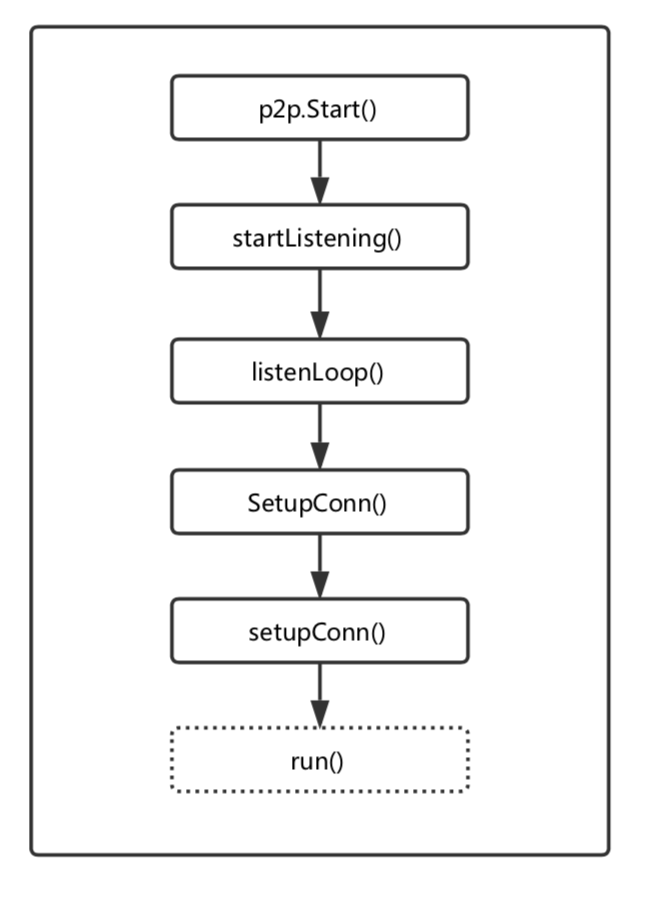

## 以太坊网络架构解析

Time: 2018.07.12  
Tags: 区块链,代码分析,网络  

### 0x00 前言

区块链的火热程度一直以直线上升，其中以区块链 2.0 —— 以太坊为代表，不断的为传统行业带来革新，同时也推动区块链技术发展。

区块链是一种分布式数据存储、点对点传输、共识机制、加密算法等计算机技术的新型应用模式，这是一个典型的去中心化应用，建立在 p2p 网络之上；本文以学习和分析以太坊运作原理为目的，将以太坊网络架构作为一个切入点，逐步深入分析，最终对以太坊网络架构有个大致的了解。

通过学习以太坊网络架构，可以更容易的对网络部分的源码进行审计，便于后续的协议分析，来发现未知的安全隐患；除此之外，目前基于 p2p 网络的成熟的应用非常少，借助分析以太坊网络架构的机会，可以学习一套成熟的 p2p 网络运行架构。

本文侧重于数据链路的建立和交互，不涉及网络模块中的节点发现、区块同步、广播等功能模块。

### 0x01 目录
1. Geth 启动
2. 网络架构
3. 共享密钥
4. RLPXFrameRW 帧
5. RLP 编码
6. LES 协议
7. 总结

其中第 3、4、5 三个小节是第 2 节「网络架构」的子内容，作为详细的补充。

### 0x02 Geth 启动
在介绍以太坊网络架构之前，首先简单分析下 Geth 的整体启动流程，便于后续的理解和分析。

**以太坊源码目录**  

	tree -d -L 1
	.
	├── accounts				账号相关
	├── bmt						实现二叉merkle树
	├── build					编译生成的程序
	├── cmd						geth程序主体
	├── common					工具函数库
	├── consensus				共识算法
	├── console					交互式命令
	├── containers				docker 支持相关
	├── contracts				合约相关
	├── core					以太坊核心部分
	├── crypto					加密函数库
	├── dashboard				统计
	├── eth						以太坊协议
	├── ethclient				以太坊RPC客户端
	├── ethdb					底层存储
	├── ethstats				统计报告
	├── event					事件处理
	├── internal				RPC调用
	├── les						轻量级子协议 
	├── light					轻客户端部分功能
	├── log						日志模块
	├── metrics					服务监控相关
	├── miner					挖矿相关
	├── mobile					geth的移动端API
	├── node					接口节点
	├── p2p						p2p网络协议
	├── params					一些预设参数值
	├── rlp						RLP系列化格式 
	├── rpc						RPC接口
	├── signer					签名相关
	├── swarm					分布式存储
	├── tests					以太坊JSON测试
	├── trie					Merkle Patricia实现
	├── vendor					一些扩展库
	└── whisper					分布式消息

	35 directories

**初始化工作**  
Geth 的 `main()` 函数非常的简洁，通过 `app.Run()` 来启动程序：

	[./cmd/geth/main.go]
	func main() {
		if err := app.Run(os.Args); err != nil {
			fmt.Fprintln(os.Stderr, err)
			os.Exit(1)
		}
	}

其简洁是得力于 Geth 使用了 `gopkg.in/urfave/cli.v1` 扩展包，该扩展包用于管理程序的启动，以及命令行解析，其中 `app` 是该扩展包的一个实例。

在 Go 语言中，在有 `init()` 函数的情况下，会默认先调用 `init()` 函数，然后再调用 `main()` 函数；Geth 几乎在 `./cmd/geth/main.go#init()` 中完成了所有的初始化操作：设置程序的子命令集，设置程序入口函数等，下面看下 `init()` 函数片段：

	[./cmd/geth/main.go]
	func init() {
		// Initialize the CLI app and start Geth
		app.Action = geth
		app.HideVersion = true // we have a command to print the version 
		app.Copyright = "Copyright 2013-2018 The go-ethereum Authors"
		app.Commands = []cli.Command{
			// See chaincmd.go:
			initCommand,
			importCommand,
			exportCommand,
			importPreimagesCommand,
			...
		}
		...
	}

在以上代码中，预设了 `app` 实例的值，其中 `app.Action = geth` 作为 `app.Run()` 调用的默认函数，而 `app.Commands` 保存了子命令实例，通过匹配命令行参数可以调用不同的函数(而不调用 `app.Action`)，使用 Geth 不同的功能，如：开启带控制台的 Geth、使用 Geth 创造创世块等。

**节点启动流程**  
无论是通过 `geth()` 函数还是其他的命令行参数启动节点，节点的启动流程大致都是相同的，这里以 `geth()` 为例：

	[./cmd/geth/main.go]
	func geth(ctx *cli.Context) error {
		node := makeFullNode(ctx)
		startNode(ctx, node)
		node.Wait()
		return nil
	}

其中 `makeFullNode()` 函数将返回一个节点实例，然后通过 `startNode()` 启动。在 Geth 中，每一个功能模块都被视为一个服务，每一个服务的正常运行驱动着 Geth 的各项功能；`makeFullNode()` 通过解析命令行参数，注册指定的服务。以下是 `makeFullNode()` 代码片段：

	[./cmd/geth/config.go]
	func makeFullNode(ctx *cli.Context) *node.Node {
		stack, cfg := makeConfigNode(ctx)

		utils.RegisterEthService(stack, &cfg.Eth)

		if ctx.GlobalBool(utils.DashboardEnabledFlag.Name) {
			utils.RegisterDashboardService(stack, &cfg.Dashboard, gitCommit)
		}
	
		...

		// Add the Ethereum Stats daemon if requested.
		if cfg.Ethstats.URL != "" {
			utils.RegisterEthStatsService(stack, cfg.Ethstats.URL)
		}
		return stack
	}

然后通过 `startNode()` 启动各项服务并运行节点。以下是 Geth 启动流程图：

每个服务正常运行，相互协作，构成了 Geth：

### 0x03 网络架构
通过 `main()` 函数的调用，最终启动了 p2p 网络，这一小节对网络架构做详细的分析。

**三层架构**  
以太坊是去中心化的数字货币系统，天然适用 p2p 通信架构，并且在其上还支持了多种协议。在以太坊中，p2p 作为通信链路，用于负载上层协议的传输，可以将其分为三层结构：

1.最上层是以太坊中各个协议的具体实现，如 eth 协议、les 协议。  
2.第二层是以太坊中的 p2p 通信链路层，主要负责启动监听、处理新加入连接或维护连接，为上层协议提供了信道。  
3.最下面的一层，是由 Go 语言所提供的网络 IO 层，也就是对 `TCP/IP` 中的网络层及以下的封装。  

**p2p 通信链路层**  
从最下层开始逐步分析，第三层是由 Go 语言所封装的网络 IO 层，这里就跳过了，直接分析 p2p 通信链路层。p2p 通信链路层主要做了三项工作：

1.由上层协议的数据交付给 p2p 层后，首先通过 RLP 编码。
2.RLP 编码后的数据将由共享密钥进行加密，保证通信过程中数据的安全。  
3.最后，将数据流转换为 RLPXFrameRW 帧，便于数据的加密传输和解析。  
(以上三点由下文做分析)

**p2p 源码分析**  
p2p 同样作为 Geth 中的一项服务，通过「0x03 Geth 启动」中 `startNode()` 启动，p2p 通过其 `Start()` 函数启动。以下是 `Start()` 函数代码片段：

	[./p2p/server.go]
	func (srv *Server) Start() (err error) {
		...
		if !srv.NoDiscovery {
			...
		}
		if srv.DiscoveryV5 {
			...
		}
		...
		// listen/dial
		if srv.ListenAddr != "" {
			if err := srv.startListening(); err != nil {
				return err
			}
		}
		...
		go srv.run(dialer)
		...
	}

上述代码中，设置了 p2p 服务的基础参数，并根据用户参数开启节点发现(节点发现不在本文的讨论范围内)，随后开启 p2p 服务监听，最后开启单独的协程用于处理报文。以下分为服务监听和报文处理两个模块来分析。

###### 服务监听
通过 `startListening()` 的调用进入到服务监听的流程中，随后在该函数中调用 `listenLoop` 用一个无限循环处理接受连接，随后通过 `SetupConn()` 函数为正常的连接建立 p2p 通信链路。在 `SetupConn()` 中调用 `setupConn()` 来做具体工作，以下是 `setupConn()` 的代码片段：

	[./p2p/server.go]
	func (srv *Server) setupConn(c *conn, flags connFlag, dialDest *discover.Node) error {
		...
		if c.id, err = c.doEncHandshake(srv.PrivateKey, dialDest); err != nil {
			srv.log.Trace("Failed RLPx handshake", "addr", c.fd.RemoteAddr(), "conn", c.flags, "err", err)
			return err
		}
		...
		phs, err := c.doProtoHandshake(srv.ourHandshake)
		...
	}

`setupConn()` 函数中主要由 `doEncHandshake()` 函数与客户端交换密钥，并生成临时共享密钥，用于本次通信加密，并创建一个帧处理器 `RLPXFrameRW`；再调用 `doProtoHandshake()` 函数为本次通信协商遵循的规则和事务，包含版本号、名称、容量、端口号等信息。在成功建立通信链路，完成协议握手后，处理流程转移到报文处理模块。

下面是服务监听函数调用流程：

###### 报文处理
`p2p.Start()` 通过调用 `run()` 函数处理报文，`run()` 函数用无限循环等待事务，比如上文中，新连接完成握手包后，将由该函数来负责。`run()` 函数中支持多个命令的处理，包含的命令有服务退出清理、发送握手包、添加新节点、删除节点等。以下是 `run()` 函数结构：

	[./p2p/server.go]
	func (srv *Server) run(dialstate dialer) {
		...
		for {
			select {
			case <-srv.quit: ...
			case n := <-srv.addstatic: ...
			case n := <-srv.removestatic: ...
			case op := <-srv.peerOp: ...
			case t := <-taskdone: ...
			case c := <-srv.posthandshake: ...
			case c := <-srv.addpeer: ...
			case pd := <-srv.delpeer: ...
			}
		}
	}
	
为了理清整个网络架构，本文直接讨论 `addpeer` 分支：当一个新节点添加服务器节点时，将进入到该分支下，根据之前的握手信息，为上层协议生成实例，然后调用 `runPeer()`，最终通过 `p.run()` 进入报文的处理流程中。

继续分析 `p.run()` 函数，其开启了读取数据和 `ping` 两个协程，用于处理接收报文和维持连接，随后通过调用 `startProtocols()` 函数，调用指定协议的 `Run()` 函数，进入具体协议的处理流程。

下面是报文处理函数调用流程

###### p2p 通信链路交互流程
这里整体看下 p2p 通信链路的处理流程，以及对数据包的封装。

### 0x04 共享密钥
在 p2p 通信链路的建立过程中，第一步就是协商共享密钥，该小节说明下密钥的生成过程。  

**迪菲-赫尔曼密钥交换**  
p2p 网络中使用到的是「迪菲-赫尔曼密钥交换」技术[[1](#ref)]。迪菲-赫尔曼密钥交换（英语：Diffie–Hellman key exchange，缩写为D-H） 是一种安全协议。它可以让双方在完全没有对方任何预先信息的条件下通过不安全信道创建起一个密钥。

简单来说，链接的两方生成随机的私钥，通过随机的私钥得到公钥。然后双方交换各自的公钥，这样双方都可以通过自己随机的私钥和对方的公钥来生成一个同样的共享密钥(shared-secret)。后续的通讯使用这个共享密钥作为对称加密算法的密钥。其中对于 A、B公私钥对满足这样的数学等式：`ECDH(A私钥, B公钥) == ECDH(B私钥, A公钥)`。

**共享密钥生成**  
在 p2p 网络中由 `doEncHandshake()` 方法完成密钥的交换和共享密钥的生成工作。下面是该函数的代码片段：

	[./p2p/rlpx.go]
	func (t *rlpx) doEncHandshake(prv *ecdsa.PrivateKey, dial *discover.Node) (discover.NodeID, error) {
		...
		if dial == nil {
			sec, err = receiverEncHandshake(t.fd, prv, nil)
		} else {
			sec, err = initiatorEncHandshake(t.fd, prv, dial.ID, nil)
		}
		...
		t.rw = newRLPXFrameRW(t.fd, sec)
		..
	}

如果作为服务端监听连接，收到新连接后调用 `receiverEncHandshake()` 函数，若作为客户端向服务端发起请求，则调用 `initiatorEncHandshake()`函数；两个函数区别不大，都将交换密钥，并生成共享密钥，`initiatorEncHandshake()` 仅仅是作为发起数据的一端；最终执行完后，调用 `newRLPXFrameRW()` 创建帧处理器。

从服务端的角度来看，将调用 `receiverEncHandshake()` 函数来创建共享密钥，以下是该函数的代码片段：

	[./p2p/rlpx.go]
	func receiverEncHandshake(conn io.ReadWriter, prv *ecdsa.PrivateKey, token []byte) (s secrets, err error) {
		authPacket, err := readHandshakeMsg(authMsg, encAuthMsgLen, prv, conn)
		...
		authRespMsg, err := h.makeAuthResp()
		...
		if _, err = conn.Write(authRespPacket); err != nil {
			return s, err
		}
		return h.secrets(authPacket, authRespPacket)
	}

共享密钥生成的过程：

1. 在完成 TCP 连接后，客户端使用服务端的公钥(node_id)加密，发送自己的公钥和包含临时公钥的签名，还有一个随机值 nonce。
2. 服务端收到数据，获得客户端的公钥，使用椭圆曲线算法从签名中获得客户端的临时公钥；服务端将自己的临时公钥和随机值 nonce 用客户端的公钥加密发送。
3. 通过上述两步的密钥交换后，对于客户端目前有自己的临时公私钥对和服务端的临时公钥，使用椭圆曲线算法从自己的临时私钥和服务端的临时公钥计算得出共享密钥；同理，服务端按照相同的方式也可以计算出共享密钥。

以下是共享密钥生成图示：

得出共享密钥后，客户端和服务端就可以使用共享密钥做对称加密，完成对通信的加密。

### 0x05 RLPXFrameRW 帧
在共享密钥生成完毕后，初始化了 `RLPXFrameRW` 帧处理器；其 `RLPXFrameRW` 帧的目的是为了在单个连接上支持多路复用协议。其次，由于帧分组的消息为加密数据流产生了天然的分界点，更便于数据的解析，除此之外，还可以对发送的数据进行验证。

`RLPXFrameRW` 帧包含了两个主要函数，`WriteMsg()` 用于发送数据，`ReadMsg()`用于读取数据；以下是 `WriteMsg()` 的代码片段：

	[./p2p/rlpx.go]
	func (rw *rlpxFrameRW) WriteMsg(msg Msg) error {
		...
		// write header
		headbuf := make([]byte, 32)
		...
		// write header MAC
		copy(headbuf[16:], updateMAC(rw.egressMAC, rw.macCipher, headbuf[:16]))
		if _, err := rw.conn.Write(headbuf); err != nil {
			return err
		}
		
		// write encrypted frame, updating the egress MAC hash with
		// the data written to conn.
		tee := cipher.StreamWriter{S: rw.enc, W: io.MultiWriter(rw.conn, rw.egressMAC)}
		if _, err := tee.Write(ptype); err != nil {
			return err
		}
		if _, err := io.Copy(tee, msg.Payload); err != nil {
			return err
		}
		if padding := fsize % 16; padding > 0 {
			if _, err := tee.Write(zero16[:16-padding]); err != nil {
				return err
			}
		}
		
		// write frame MAC. egress MAC hash is up to date because
		// frame content was written to it as well.
		fmacseed := rw.egressMAC.Sum(nil)
		mac := updateMAC(rw.egressMAC, rw.macCipher, fmacseed)
		_, err := rw.conn.Write(mac)
		return err
	}

结合以太坊 RLPX 的文档[[2](#ref)]和上述代码，可以分析出 `RLPXFrameRW` 帧的结构。在一般情况下，发送一次数据将产生五个数据包：

	header			// 包含数据包大小和数据包源协议
	header_mac		// 头部消息认证
	frame			// 具体传输的内容
	padding			// 使帧按字节对齐
	frame_mac		// 用于消息认证
	
接收方按照同样的格式对数据包进行解析和验证。

### 0x06 RLP 编码
RLP编码 (递归长度前缀编码)提供了一种适用于任意二进制数据数组的编码，RLP 已经成为以太坊中对对象进行序列化的主要编码方式，便于对数据结构的解析。比起 json 数据格式，RLP 编码使用更少的字节。

在以太坊的网络模块中，所有的上层协议的数据包要交互给 p2p 链路时，都要首先通过 RLP 编码；从 p2p 链路读取数据，也要先进行解码才能操作。

以太坊中 RLP 的编码规则[[3](#ref)]。

### 0x07 LES 协议层
这里以 LES 协议为上层协议的代表，分析在以太坊网络架构中应用协议的工作原理。

LES 服务由 Geth 初始化时启动，调用源码 les 下的 `NewLesServer()` 函数开启一个 LES 服务并初始化，并通过 `NewProtocolManager()` 实现以太坊子协议的接口函数。其中 `les/handle.go` 包含了 LES 服务交互的大部分逻辑。

回顾上文 p2p 网络架构，最终 p2p 底层通过 `p.Run()` 启动协议，在 LES 协议中，也就是调用 LES 协议的 `Run()` 函数：

	[./les/handle.go#NewProtocolManager()]
	Run: func(p *p2p.Peer, rw p2p.MsgReadWriter) error {
		...
		select {
			case manager.newPeerCh <- peer:
				...
				err := manager.handle(peer)
				...
			case <-manager.quitSync:
				...
		}
	}
	
可以看到重要的处理逻辑都被包含在 `handle()` 函数中，`handle()` 函数的主要功能包含 LES 协议握手和消息处理，下面是 `handle()` 函数片段：

	[./les/handle.go]
	func (pm *ProtocolManager) handle(p *peer) error {
		...
		if err := p.Handshake(td, hash, number, genesis.Hash(), pm.server); err != nil {
			p.Log().Debug("Light Ethereum handshake failed", "err", err)
			return err
		}
		...
		for {
			if err := pm.handleMsg(p); err != nil {
				p.Log().Debug("Light Ethereum message handling failed", "err", err)
				return err
			}
		}
	}

在 `handle()` 函数中首先进行协议握手，其实现函数是 `./les/peer.go#Handshake()`，通过服务端和客户端交换握手包，互相获取信息，其中包含有：协议版本、网络号、区块头哈希、创世块哈希等值。随后用无线循环处理通信的数据，以下是报文处理的逻辑：

	[./les/handle.go]
	func (pm *ProtocolManager) handleMsg(p *peer) error {
		msg, err := p.rw.ReadMsg()
		...
		switch msg.Code {
			case StatusMsg: ...
			case AnnounceMsg: ...
			case GetBlockHeadersMsg: ...
			case BlockHeadersMsg: ...
			case GetBlockBodiesMsg: ...
			...
		}
	}

处理一个请求的详细流程是：

1. 使用 `RLPXFrameRW` 帧处理器，获取请求的数据。
2. 使用共享密钥解密数据。
3. 使用 `RLP` 编码将二进制数据序列化。
4. 通过对 `msg.Code` 的判断，执行相应的功能。
5. 对响应数据进行 `RLP` 编码，共享密钥加密，转换为 `RLPXFrameRW`，最后发送给请求方。

下面是 LES 协议处理流程：

### 0x08 总结
通过本文的分析，对以太坊网络架构有了大致的了解，便于后续的分析和代码审计；在安全方面来讲，由协议所带的安全问题往往比本地的安全问题更为严重，应该对网络层面的安全问题给予更高的关注。

从本文也可以看到，以太坊网络架构非常的完善，具有极高的鲁棒性，这也证明了以太坊是可以被市场所认可的区块链系统。除此之外，由于 p2p 网络方向的资料较少，以太坊的网络架构也可以作为学习 p2p 网络的资料。

### 0x09 References

[1] WIKI.DH： <https://en.wikipedia.org/wiki/Diffie–Hellman_key_exchange>  
[2] Github.rlpx： <https://github.com/ethereum/devp2p/blob/master/rlpx.md>  
[3] WIKI.RLP： <https://github.com/ethereum/wiki/wiki/RLP>   
[4] Github.ZtesoftCS： <https://github.com/ZtesoftCS/go-ethereum-code-analysis>  
[5] CSDN： <https://blog.csdn.net/weixin_41814722/article/details/80680749>  
[6] CSDN： <https://blog.csdn.net/itcastcpp/article/details/80305636>  
[7] ETHFANS： <https://ethfans.org/bob/articles/864>  
[8] BITSHUO： <https://bitshuo.com/topic/5975fbb14a7a061b785db8d5>  
[9] Github.go-ethereum： <https://github.com/ethereum/go-ethereum>    