## 使用Peach进行基于变异和生成的fuzzing

Time: 2024.08.28  
Tags: fuzzing  


### 0x00 前言

Peach 是一个于 2004 年开发的模糊测试框架(SmartFuzzer)，能够执行基于生成和变异的模糊测试。其核心思路在于其内部的 PeachPit 变异引擎，安全研究员可通过 xml 描述目标文档的详细格式(pit文件)，在随后的 fuzzing 过程中引导变异数据的生成；相比于使用 afl/afl++ 进行常规化的 fuzzing，使用 Peach 能够生成更规范的变异数据，从而在一定程度上提高覆盖率。

Peach 项目目前有接近 20 年的发展历史；Peach2.0 使用 Python 进行开发并于 2007 年夏开源发布，其功能包括进程监控和使用 XML 创建模糊测试器；Peach3.0 使用了 Microsoft .NET Framework(C#) 完整重写了项目，并使用 Mono 实现了跨平台支持，于 2013 年初发布；直到 2020 年，Peach Fuzzer Professional v4 被 GitLab 收购并成为 GitLab 生态圈的一部分。

本文将简单介绍 Peach 的功能，通过实验的方式理解 Peach 的核心思路和基本使用方法；由于 Peach4.0 部分功能被修改用于适配 GitLab，同时该项目目前处于停止维护的状态，所以本文将以 Peach3.0 作为实验环境。

本文实验环境：
```
Ubuntu 22.04 x64
Peach 3.1.124
Mono 4.8.1
GDB 12.1
Python 2.7
```

### 0x01 Peach环境配置
从 https://sourceforge.net/projects/peachfuzz/ 可以选择通过二进制包安装或者源码安装。

**Peach二进制包安装**  
这里我们首先进行二进制包安装：
```
# download peach-3.1.124-linux-x86_64-release.zip
# 配置工作目录
$ mkdir peach-3.1.124-linux-x86_64-release
$ cd peach-3.1.124-linux-x86_64-release/
# 解压和安装 Peach
$ unzip peach-3.1.124-linux-x86_64-release.zip
```

执行如下：
<div align="center">
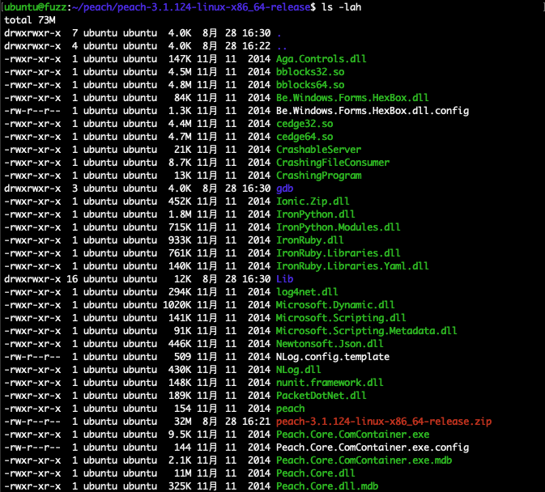
</br>[1.Peach二进制包安装]
</div>

Peach3 是由 Microsoft .NET Framework 进行开发的，所以需要 Mono (即跨平台的.NET实现)，我这里使用的较老的 `Mono 4.8.1` 版本，参考官方(https://www.mono-project.com/docs/getting-started/install/linux/#accessing-older-releases)使用 `apt` 安装老版本如下：
```
# 配置 mono 仓库签名
$ sudo apt install ca-certificates gnupg
$ sudo gpg --homedir /tmp --no-default-keyring --keyring /usr/share/keyrings/mono-official-archive-keyring.gpg --keyserver hkp://keyserver.ubuntu.com:80 --recv-keys 3FA7E0328081BFF6A14DA29AA6A19B38D3D831EF

# 添加 mono 源以及更新
$ echo "deb [signed-by=/usr/share/keyrings/mono-official-archive-keyring.gpg] https://download.mono-project.com/repo/ubuntu stable/snapshots/4.8.1 main" | sudo tee /etc/apt/sources.list.d/mono-official-stable.list
$ sudo apt update
$ sudo apt list -a mono-complete

# 使用 apt-preferences 解决依赖组件的版本问题
$ vim /etc/apt/preferences.d/50my
Package: *mono*
Pin: origin download.mono-project.com
Pin-Priority: 1001

Package: libnunit*
Pin: origin download.mono-project.com
Pin-Priority: 1001

# 安装 mono-complete=4.8.1.0-0xamarin1
sudo apt install mono-complete=4.8.1.0-0xamarin1

# 检查 mono 版本
$ mono -V
```

>经测试，在 Ubuntu 22.04 通过 `apt` 默认安装的 `mono 6.8.0.105` 环境下，`Peach3.exe` 不能正常执行 fuzzing 功能，仅能够执行 help 等命令。

执行如下：
<div align="center">
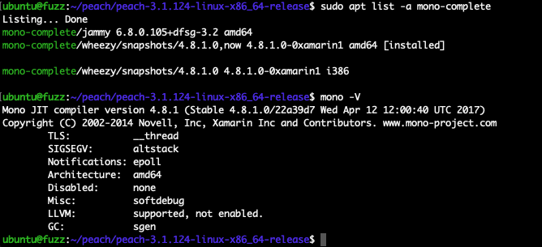
</br>[2.安装mono支持]
</div>

Peach3 的核心程序为 `Peach.exe`，使用 `mono Peach.exe -h` 或 `./Peach.exe -h` 运行如下：
<div align="center">
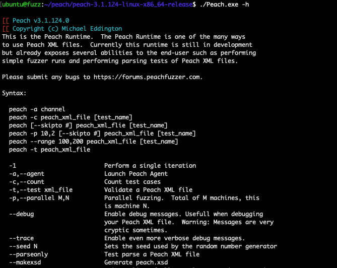
</br>[3.Peach运行以及帮助]
</div>

**GDB-Python2.7适配**  
由于 Peach3 在 Linux 环境下依赖于 GDB 和 Python2.7 运行，同时还要求 GDB 使用 Python2.7 的插件，Ubuntu 通过 `apt` 安装的 GDB 默认使用 Python3.x，我们需要从源码指定 Python 插件版本来编译 GDB，如下：
```
# 下载以及解压 gdb-12.1
$ wget "https://ftp.gnu.org/gnu/gdb/gdb-12.1.tar.gz"
$ tar -zxvf gdb-12.1.tar.gz
# 进入源码目录，处理部分依赖问题
$ cd gdb-12.1/
$ sudo apt install python2.7-dev texinfo
# 指定 python2.7 版本和编译
$ ./configure --prefix=/home/ubuntu/peach/install --with-python='/usr/bin/python2.7'
$ make && make install
```

编译安装完成后，使用 `ldd /home/ubuntu/peach/install/bin/gdb` 可以看到源码编译的 GDB 依赖于 Python2.7 如下：
<div align="center">
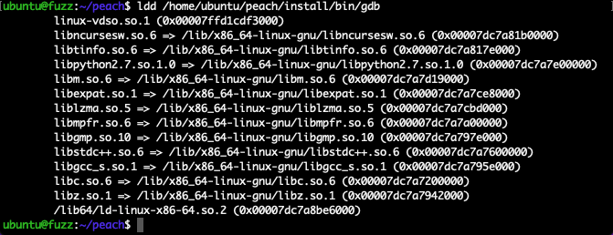
</br>[4.GDB-Python2.7适配]
</div>

**Peach源码安装**  
由于 Peach3 版本已经很老了，在实际使用还会出现诸多问题；这里我们推荐通过源码安装以便解决这些使用问题，如下：
```
# download peach-3.1.124-source.zip
# 配置工作目录
$ mkdir peach-3.1.124-source
$ cd peach-3.1.124-source
# 解压 Peach 源码
$ unzip peach-3.1.124-source.zip
```

为了使用 Peach3 能够直接使用我们源码编译的 GDB(Python2.7)，我们需要修改源码中的默认依赖，同时由于 GDB12.1 更新了 `logging` 的用法，我们还需要解决 Peach3 中不兼容的问题，我们整合后的补丁参考 [peach-gdb.patch](./peach-gdb.patch)；

除此之外，`peach-3.1.124` 版本下 `Peach.Core/Engine.cs#runTest()` 好像还存在 bug？这里的逻辑为 `目标程序运行 => 数据变异 => crash收集`，导致 `crash收集` 环节时将错位保存新变异的数据，修复补丁参考 [peach-runtest.patch](./peach-runtest.patch)；

最后由于 Peach3 源码依赖于 `3rdParty/pin/pin-2.13-61206-gcc.4.4.7-linux/` 组件，这需要非常老的 `Gcc4`，我们这里采取手动升高依赖版本 `pin-3.19-98425-gd666b2bee-gcc-linux`，如下：
```
# 下载和解压 
$ cd 3rdParty/pin/
$ wget "https://software.intel.com/sites/landingpage/pintool/downloads/pin-3.19-98425-gd666b2bee-gcc-linux.tar.gz"
$ tar -zxvf pin-3.19-98425-gd666b2bee-gcc-linux.tar.gz

# 修改编译依赖组件名称
$ vim ./build/config/linux.py
# env['PIN_VER'] = 'pin-3.19-98425-gd666b2bee-gcc-linux'
```

随后使用 `waf` 进行编译：
```
# 使用 configure 构建项目
$ python2.7 waf configure
# (由于修改了 pin 版本这里会提示错误，但不影响实际功能
# (Available - Missing Features: pin

# 使用 build 构建项目，编译的二进制存储于 [src]/slag/
$ python2.7 waf build
# (默认 pin 版本和默认 Gcc 版本的冲突错误
# (#error The C++ ABI of your compiler does not match the ABI of the pin kit.

# 使用 install 安装项目，编译的二进制存储于 [src]/output/
$ python2.7 waf install
```

编译安装执行如下：
<div align="center">
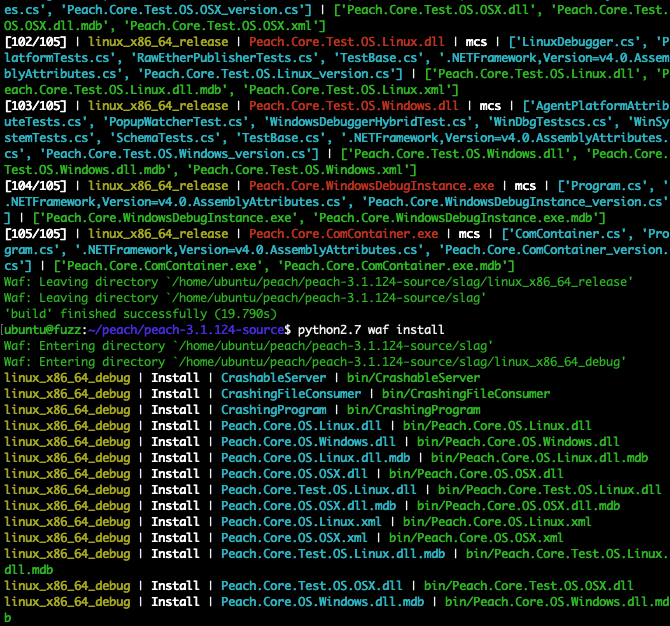
</br>[4.Peach二进制包安装]
</div>

安装完毕后，Peach 程序位于 `[src]/output/` 下，我们可以使用 `export PATH=` 添加路径，便于后续使用：
```
# Peach3 + mono 4.8.1 需要设置 TERM
$ export TERM=xterm
# 添加 PATH
$ export PATH=$PATH:/home/ubuntu/peach/peach-3.1.124-source/output/linux_x86_64_debug/bin/
$ Peach.exe -h
```

执行如下：
<div align="center">
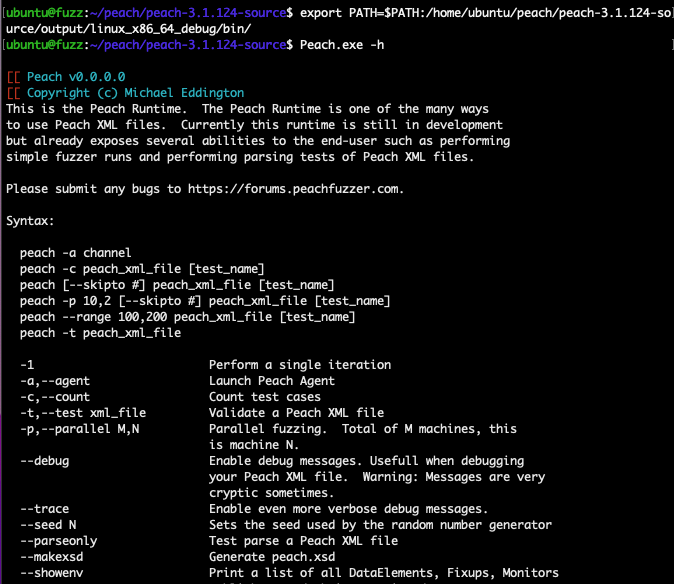
</br>[5.Peach运行以及帮助]
</div>

### 0x02 基于变异的fuzzing
配置好 Peach 环境后，我们可以按照官方文档学习「Dumb Fuzzing」(https://peachtech.gitlab.io/peach-fuzzer-community/v3/PeachQuickStart.html)，其核心思路是通过对种子文件的各种变换(位翻转、裁剪、拼接等)产生变异数据，也就是基于变异的 fuzzing；这里我们将对 Linux 下的图片查看器 `feh` 的 `PNG` 图片格式逻辑进行 fuzzing。

首先安装目标软件 `feh` 以及配置工作目录：
```
$ sudo apt install feh
$ mkdir test-feh && cd test-feh
```

使用 Peach 进行 fuzzing 的核心在于编写 Pit 文件，其模板文件 `[src]/Peach/template.xml` 如下：
<div align="center">
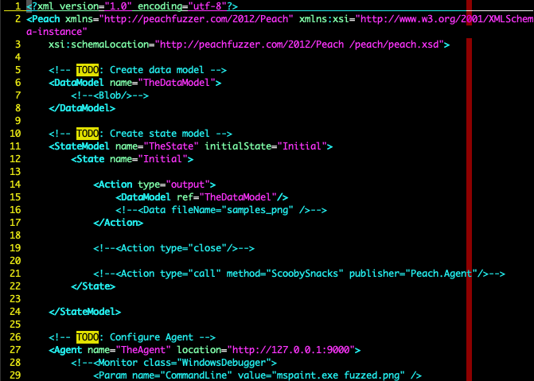
</br>[6.Peach模板Pit文件]
</div>

根据模板我们很容理解和构造针对 `PNG` 的 Pit 文件；首先构建 `<DataModel>` 字段，该字段用于描述数据格式，如下：
```
<DataModel name="TheDataModel">
    <Blob />
</DataModel>
```

我们这里使用「基于变异的fuzzing」，所以使用 `Blob` 二进制数据进行占位表示，后续我们将使用种子文件内容填充该位置；

随后是 `<StateModel>` 字段，该字段用于描述 Peach 的执行状态流，其中子字段 `<State>` 用于定义状态/阶段(通常只有一个)，如下：
```
<StateModel name="TheState" initialState="Initial">
    <State name="Initial" >
        <Action type="output" >
            <DataModel ref="TheDataModel" />
            <Data name="data" fileName="samples_png/*.png" />
        </Action>
        <Action type="close" />
        <Action type="call" method="LaunchViewer" publisher="Peach.Agent" />
    </State>
</StateModel>
```

`<Action>` 字段用于实际描述 Peach 的动作，最常用的有三个：
1. output：链接至具体的 `<DataModel>` 表示数据生成并在此输出/生成，我们这里额外使用了 `<Data>` 字段，从 `"samples_png/*.png"` 文件填充上文的 `<Blob>` 数据；
2. close：输出/生成完数据后，进行关闭文件的操作；
3. call：调用下一个组件，通常为 `Peach.Agent` 即 `<Agent>` 字段；

接下来就是 `<Agent>` 字段，主要需要设置 `<Monitor>` 子字段，其用于监控目标程序的异常状态(即crash)，依照操作系统我们这里使用 `LinuxDebugger`(底层调用为 GDB)，并按需设置好目标程序和命令行参数，如下：
```
<Agent name="TheAgent">
    <Monitor class="LinuxDebugger">
        <Param name="Executable" value="feh" />
        <Param name="Arguments" value="fuzzed.png" />
    </Monitor>
</Agent>
```

最后我们来设置 `<Test>` 字段，该字段相当于 Pit 文件的主函数，同时包含了一些全局定义等内容，如下：
```
<Test name="Default">
    <StateModel ref="TheState"/>

    <Publisher class="File">
        <Param name="FileName" value="fuzzed.png" />
    </Publisher>

    <Agent ref="TheAgent" />

    <Logger class="Filesystem">
        <Param name="Path" value="logs" />
    </Logger>
</Test>
```

这里定义并链接了上文的 `<StateModel>` 和 `<Agent>`，而 `<Publisher>` 表示生成的样本数据应该如何发布，这里保存为了 `fuzzed.png` 文件，该字段完成了「变异数据生成」和「样本传入目标程序」两个环节的对接：
```
<Action type="output" />
===>
<Publisher />
===>
<Param name="Arguments" value="fuzzed.png" />
```

另外还有 `<Logger>` 字段用于描述日志的存储；完整的 Pit 文件请参考 [png.xml](./png.xml)。

随后我们准备一个 `test.png` 样本图片，并构建工作目录如下：
```
.
├── png.xml
└── samples_png
    └── test.png
```

使用如下命令启动 Peach 进行 fuzzing：
```
# feh 需要 GUI 支持，在 ssh 下需设置 DISPLAY
$ export DISPLAY=:0
# 启动 Peach 进行 fuzzing
$ Peach.exe png.xml
```

执行如下：
<div align="center">
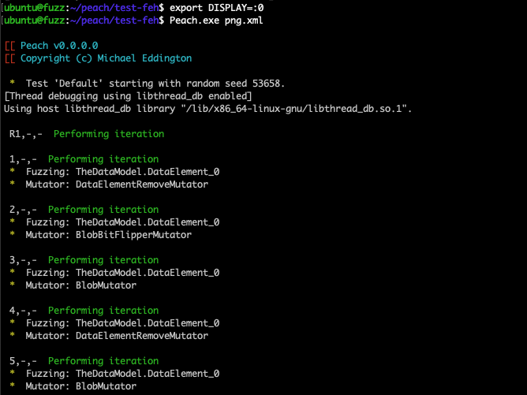
</br>[7.Peach进行基于变异的fuzzing]
</div>

### 0x03 基于生成的fuzzing
接下来我们继续按照官方文档学习「File Fuzzing」(https://peachtech.gitlab.io/peach-fuzzer-community/v3/TutorialFileFuzzing.html)，其核心思路是根据用户编写的 xml 规范化的生成编译数据，即基于生成的 fuzzing，这是 Peach 最核心的功能，这里我们将对 Linux 下的图片查看器 `mplayer` 的 `wave` 格式进行 fuzzing。

首先安装目标软件 `mplayer` 以及配置工作目录：
```
$ sudo apt install mplayer
$ mkdir test-mplayer && cd test-mplayer
```

相比于上文的「0x02 基于变异的fuzzing」编写 Pit 文件，「基于生成的fuzzing」同样需要 4 大标签：
1. `<DataModel>`
2. `<StateModel>`
3. `<Agent>`
4. `<Test>`

不同点在于 `<DataModel>` 标签内我们将使用具体的数据结构来描述 `wave` 格式，这里我们主要针对 `<DataModel>` 标签进行详细介绍和编写；

在编写 `<DataModel>` 标签内容前，我们需要对 `wave` 格式有一个精确的认知，可以参考 [WaveFormat](http://soundfile.sapp.org/doc/WaveFormat/) 格式说明以及示例文件 [sample.wav](https://file-examples.com/index.php/sample-audio-files/sample-wav-download/) 如下：
<div align="center">

</br>[8.wave文件格式说明]
</div>

首先我们编写一个名为 `Wav` 的 `<DataModel>`，用于整体描述 wave 文件格式，其中定义了 `RIFF/WAVE` 魔数，注释部分 `wave data` 将在下文进行填充：
```
<DataModel name="Wav">
    <!-- wave header -->
    <String value="RIFF" token="true" />
    <Number size="32" />
    <String value="WAVE" token="true" />
    <!-- wave data -->
</DataModel>
```

我们提取了 wave 格式子块结构的通用部分(`fmt/data sub-chunk`)，定义了一个名为 `Chunk` 的通用 wave 块，这里我们使用了 `<Relation>` 标签，表示该 `Number` 的值和名为 `Data` 的数据相关联，如下：
```
<DataModel name="Chunk">
    <String name="ID" length="4" padCharacter=" " />
    <Number name="Size" size="32">
        <Relation type="size" of="Data" />
    </Number>
    <Blob name="Data" />
    <Padding alignment="16" />
</DataModel>
```

接着我们来编写 `ChunkFmt` 块，用于表示包含有 `fmt sub-chunk` 的 wave 文件，我们这里使用了 `ref` 引用了通用 `Chunk` 块，其中同名的数据结构 `Data` 将会由新的进行覆盖，如下：
```
<DataModel name="ChunkFmt" ref="Chunk">
    <String name="ID" value="fmt " token="true" />
    <Block name="Data">
        <Number name="CompressionCode" size="16" />
        <Number name="NumberOfChannels" size="16" />
        <Number name="SampleRate" size="32" />
        <Number name="AverageBytesPerSecond" size="32" />
        <Number name="BlockAlign" size="16" />
        <Number name="SignificantBitsPerSample" size="16" />
        <Number name="ExtraFormatBytes" size="16" />
        <Blob name="ExtraData" />
    </Block>
</DataModel>
```

我们再来尝试编写 `ChunkData` 块，其表示包含有 `data sub-chunk` 的 wave 文件，该结构只有简单的 `data` 部分：
```
<DataModel name="ChunkData" ref="Chunk">
    <String name="ID" value="data" token="true" />
</DataModel>
```

按照这个思路，我们继续编写完善 `ChunkFact / ChunkSint / ChunkWav1 / ChunkCue / ChunkPlst / ChunkLab1 / ChunkNote / ChunkLtxt / ChunkList / ChunkSmpl / ChunkInst` 等块；

最后我们填充 `Wav` 块，并使用 `<Choice>` 标签将这些 `Chunk*` 都添加进来，表示生成 wave 文件时将从中进行选取：
```
<DataModel name="Wav">
    <!-- wave header -->
    <String value="RIFF" token="true" />
    <Number size="32" />
    <String value="WAVE" token="true" />
    <Choice maxOccurs="30">
        <Block ref="ChunkFmt" />
        <Block ref="ChunkData" />
        <Block ref="ChunkFact" />
        <Block ref="ChunkSint" />
        <Block ref="ChunkWav1" />
        <Block ref="ChunkCue" />
        <Block ref="ChunkPlst" />
        <Block ref="ChunkLtxt" />
        <Block ref="ChunkSmpl" />
        <Block ref="ChunkInst" />
        <Block ref="Chunk" />
    </Choice>
</DataModel>
```

至此我们就完成了 wave 格式的描述，完整的 Pit 文件请参考 [wav.xml](./wav.xml)。

再补充一点，在 `<StateModel>` 的 `output` 动作下，我们使用 `<DataModel ref="Wav" />` 链接到我们定义的 wave 格式，同时还指定了 `<Data fileName="sample.wav" />`，即 Peach 会加载该文件用于验证 `<DataModel>`(格式不正确时会提示错误)，如下：
```
<Action type="output">
    <DataModel ref="Wav" />
    <!-- This is our sample file to read in -->
    <Data fileName="sample.wav" />
</Action>
```

随后构建工作目录如下：
```
.
├── sample.wav
└── wav.xml
```

使用如下命令启动 Peach 进行 fuzzing：
```
# 启动 Peach 进行 fuzzing
$ Peach.exe wav.xml
```

执行如下：
<div align="center">
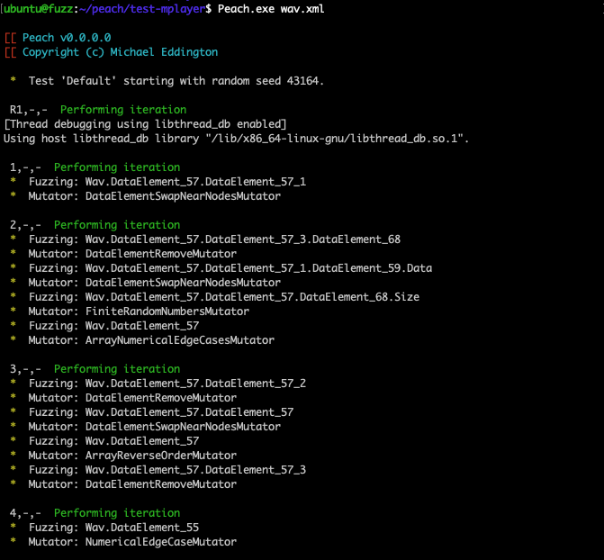
</br>[9.Peach进行基于生成的fuzzing]
</div>

### 0x04 Pit文件概要
通过以上官方提供的两个示例，我们基本了解了 Peach 的核心思路和基本使用，通过以下流程图概括 Peach 的工作流程：
<div align="center">
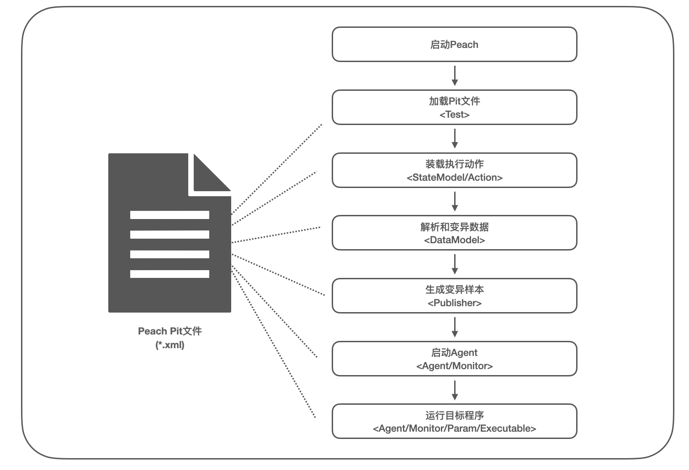
</br>[10.Peach进行基于生成的fuzzing]
</div>

可以看到 `PeachPit(*.xml)` 几乎定义了整个 Peach 的工作流程，当 Peach 启动后就从 `PeachPit` 加载 `<Test>` 内容，其中定义了关键的 `<StateModel> / <Publisher> / <Agent>` 数据，Peach 通过 `<StateModel>` 可访问到 `<DataModel>`，解析 `<DataModel>` 生成变异数据并按照 `<Publisher>` 保存为变异样本，随后调用 `<Agent>` 启动对应的监视器，由监视器传入变异样本并启动目标程序，收集异常完成一次 fuzzing。

对于 PeachPit 的语法最好的方式是官方文档(https://peachtech.gitlab.io/peach-fuzzer-community/v3/PeachPit.html)，我们这里仅简单列举下标签名称和关系：

**DataModel**  
* Blob：定义二进制数据
* Block：定义块结构
* Choice：定义可选择数据(类似switch)
* Custom：未知
* Flag：结合 Flags 父块，定义位域值
* Flags：结合 Flag 子项，定义位域值
* Number：定义数字数据
* Padding：定义填充数据
* String：定义字符串数据
* XmlAttribute：定义 xml 属性数据
* XmlElement：定义 xml 元素数据
* Relation：定义关联数据
* Fixup：定义修正数据(如校验值)
* Transformer：定义转换数据(如base64编码)
* Placement：定义偏移数据

**StateModel**  
* State：定义 Peach 的执行状态
    * Action：定义 Peach 的执行动作
        * output/DataModel：链接至 DataModel

**Agent**  
* Monitor：定义监视器
    * Param：定义监视器的参数

**Test**  
* StateModel：链接至 StateModel
* Publisher：定义变异数据的输出方式
* Agent：链接至 Agent
* Strategy：定义全局的变异策略
* Logger：定义日志存储

### 0x05 vuln实践
现在我们来编写一个有 crash 的测试程序，来进一步掌握 Peach 的基本使用，编写 [test.c](./test.c) 测试程序，关键代码如下：
```
// +------------------------------------------+
// | header | length | chunk1 | chunk2 | data |
// +------------------------------------------+
//   2bytes   4bytes   2bytes   4bytes   nbytes
int vuln(char* str, int len) {
    int offset = 0;

    if (len <= 12) {
        printf("data format error\n");
        return 0;
    }

    char* header = str + offset;
    offset = offset + 2;

    int length = atoi(str);
    offset = offset + 4;

    char* chunk1 = str + offset;
    offset = offset + 2;
    char* chunk2 = str + offset;
    offset = offset + 4;

    char* data = str + offset;

    if (length > 0xF0000000) {
        printf("length = %x\n", length);
        raise(SIGSEGV);
    }
    else if (data[0] == 'A') {
        printf("data[0] %c\n", data[0]);
        raise(SIGSEGV);
    }
    else {
        printf("OK\n");
    }
    
    return 0;
}
```

测试程序实现了一个简单的格式解析，并将在两个条件下手动跑出异常：
1. 当 `length > 0xF0000000` 时，则异常退出
2. 当 `data[0] == 'A'` 时，则异常退出

根据格式解析我们编写 PeachPit 文件 [test.xml](./test.xml)，其核心部分`<DataModel>` 如下：
```
<DataModel name="TheDataModel">
    <Number name="header" size="16" />
    <Number name="length" size="32" />
    <Number name="chunk1" size="16" />
    <Number name="chunk2" size="32" />
    <String value="1234"></String>
</DataModel>
```

随后启动 Peach 进行 fuzzing：
<div align="center">
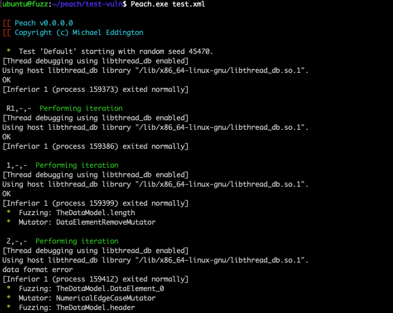
</br>[11.使用Peach对vuln程序进行fuzzing]
</div>

发现的 crash 将保存于 `<Logger>` 标签配置的路径下，如下：
<div align="center">
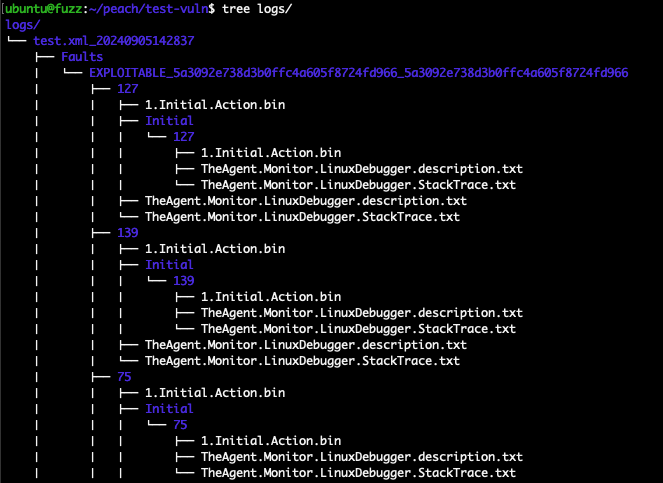
</br>[12.logs目录下的crash]
</div>

测试运行 `Faults/127` 样本，可以看到触发 crash：
<div align="center">
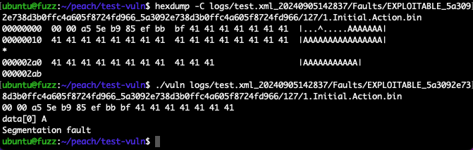
</br>[13.使用vuln程序测试运行crash]
</div>

### 0x06 进阶aflsmart
Peach 的核心思路在于使用 Pit 描述目标文件格式，从而进行生成更规范的变异数据，但从上文使用来看 Peach3 似乎有点年久失修了，不过好在有安全研究者开源了兼容 Peach3 的 aflsmart 工具(https://github.com/aflsmart/aflsmart)，其使用 Peach 的 Pit 文件作为 afl 的变异引擎，从而结合两者优势从而应对更复杂的 fuzzing 场景。

从 Github 拉取 aflsmart 项目，aflsmart 推荐安装环境为 `Ubuntu 14.04/16.04`，我们也可以直接使用 docker 进行构建：
```
#
$ git clone https://github.com/aflsmart/aflsmart.git
$ cd aflsmart
$ sudo docker build . -t aflsmart
#
$ sudo docker run -it aflsmart /bin/bash
$ export PATH=$PATH:/home/wd/aflsmart/peach-3.0.202-source/output/linux_x86_64_debug/bin/
```

同样以 [test.c](./test.c) 和 [test.xml](./test.xml) 作为测试程序，在 aflsmart 中我们不需要 `Agent`，改写 Pit 文件为 [test-aflsmart.xml](./test-aflsmart.xml)，随后使用 `afl-gcc` 编译项目如下：
```
$ ./aflsmart/afl-gcc test.c -o vuln
$ mkdir in
$ echo -e -n "\x00\x00\x00\x00\x00\x00\x00\x00\x00\x00\x00\x001234" > in/1
```

构建工作目录如下：
```
.
├── aflsmart
├── in
├── out
├── test.c
├── test-aflsmart.xml
└── vuln
```

使用如下命令启动 aflsmart 并指定 Pit 文件：
```
$ ../aflsmart/afl-fuzz -w peach -g test-aflsmart.xml -i in/ -o out/ -t 10000 ./vuln @@
```

执行如下：
<div align="center">
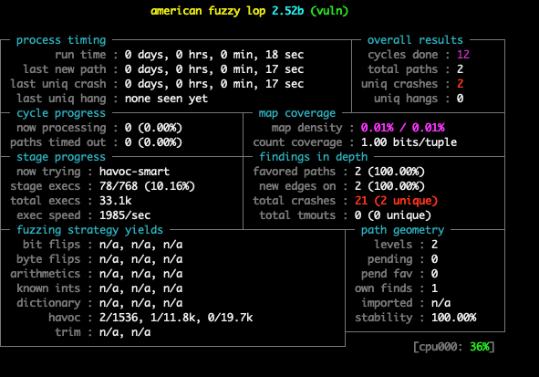
</br>[14.aflsmart模糊测试test程序]
</div>

结合 Peach 的 Pit 引擎，在到熟悉 afl-fuzz 界面很快就可以找到 crash。

### 0x07 References
https://peachtech.gitlab.io/peach-fuzzer-community/WhatIsPeach.html  
https://sourceforge.net/projects/peachfuzz/  
https://github.com/MozillaSecurity/peach  
https://www.mono-project.com/download/stable/  
https://www.mono-project.com/docs/getting-started/install/linux/#accessing-older-releases  
https://download.mono-project.com/repo/ubuntu/dists/stable/snapshots/index.html  
http://soundfile.sapp.org/doc/WaveFormat/  
https://file-examples.com/index.php/sample-audio-files/sample-wav-download/  
https://about.gitlab.com/blog/2021/03/23/gitlab-open-sources-protocol-fuzz-test-engine/  
https://medium.com/csg-govtech/lifes-a-peach-fuzzer-how-to-build-and-use-gitlab-s-open-source-protocol-fuzzer-fd78c9caf05e  
https://gitlab.com/gitlab-org/security-products/protocol-fuzzer-ce/-/issues/2  
https://github.com/aflsmart/aflsmart  