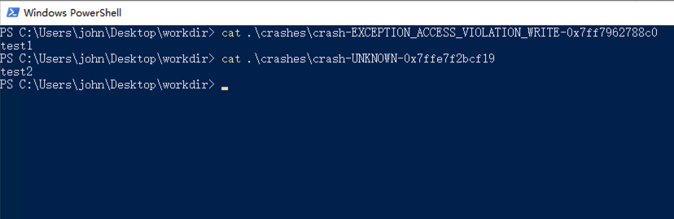
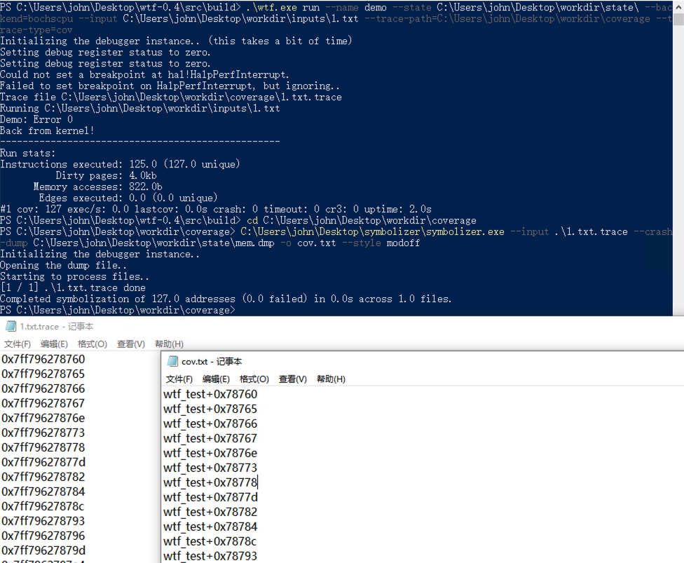

## 基于快照的fuzz工具wtf的基础使用

Time: 2023.06.15  
Tags: fuzzing  

### 0x00 前言
wtf (https://github.com/0vercl0k/wtf) 是一种分布式、代码覆盖引导、可定制、基于快照的跨平台模糊器，设计用于 fuzz 在 Microsoft Windows 平台上运行的用户模式或内核模式的目标。

在日常的 fuzz 的工作中，通常我们都需要先大致分析目标软件，然后对其输入点构造 harness，才可以使用工具对 harness 进行 fuzz，从而发现目标软件的潜在漏洞。构造 harness 不是一件容易的事情，这取决于安全研究人员分析解构目标软件的程度，除此之外，在部分软件中，只有进行完整的、复杂的初始化操作和预设，才能保证 harness 调用的输入点函数能够正常运行。

针对这一问题，基于快照的 fuzz 工具 wtf 吸引了我的注意；我们可以对正常运行的目标软件打下内存快照，然后对该内存快照进行 fuzz，这种方式可以不必编写 harness，并在一定程度上减少分析目标软件的成本。

本文从基于快照这一个特性出发，介绍 wtf 工具的基础使用和注意事项。

本文实验环境：
```
Windows 10 x64 专业版
Visual Studio 2019
WinDBG
ProxmoxVE 7.2-3
```

### 0x01 wtf概要
在 github 上可以访问 wtf 的源码和 README((https://github.com/0vercl0k/wtf))：
<div align="center">

</br>[1.wtf github展示]
</div>

作者提供了 4 篇使用 wtf 进行 fuzz 的实操文章：
* [Building a new snapshot fuzzer & fuzzing IDA](https://doar-e.github.io/blog/2021/07/15/building-a-new-snapshot-fuzzer-fuzzing-ida/)
* [Fuzzing Modern UDP Game Protocols With Snapshot-based Fuzzers](https://blog.ret2.io/2021/07/21/wtf-snapshot-fuzzing/)
* [Fuzzing RDPEGFX with "what the fuzz"](https://thalium.github.io/blog/posts/rdpegfx/)
* [A Journey to Network Protocol Fuzzing – Dissecting Microsoft IMAP Client Protocol](https://www.fortinet.com/blog/threat-research/analyzing-microsoft-imap-client-protocol)

其中第一篇针对 IDA 的 fuzz，也是作者开发 wtf 的初衷，其中讲诉了 wtf 的开发历程并介绍了 wtf 的实现原理。

通过以上文章，了解到使用 wtf 进行 fuzz 可以大致分为 3 个步骤：
```
1. 远程调试目标程序，并在合适的位置打下系统内存快照
2. 为内存快照编写 wtf 的 fuzz 模块/插件(也称为 harness)
3. 编译并启动 wtf 进行 fuzz
```

为了方便下文叙述，这里先介绍如何源码编译 wtf。wtf 使用 ninja 进行构建，首先我们下载 ninja(https://ninja-build.org/) 并添加到环境变量 `PATH` 中，随后从 github 下载 wtf 源码，打开 Visual Studio 的 x64 位开发者命令行工具(vs2019: `x64 Native Tools Command Prompt for VS 2019`):
```
# 进入 wtf 的 build 目录
$ cd C:\Users\john\Desktop\wtf-0.4\src\build
# 执行 bat 脚本
$ .\build-release.bat
```

执行如下：
<div align="center">

</br>[2.源码编译wtf]
</div>

编译成功后，会在 `build` 目录下生成 `wtf.exe` 文件，该二进制文件将支撑我们全部的 fuzz 流程。

### 0x02 fuzz hevd
wtf 提供了完整的测试用例 hevd / tlv_server，能够帮助我们快速上手 wtf，这里我们以 hevd 为例进行介绍；hevd(HackSys Extreme Vulnerable Windows Driver)是 Windows 内核驱动漏洞靶场(https://github.com/hacksysteam/HackSysExtremeVulnerableDriver)，以帮助安全研究员学习漏洞原理。

首先第一步是创建 hevd 运行时的系统内存快照，作者已经提供好了 https://github.com/0vercl0k/wtf/releases/download/v0.4/target-hevd.7z，下载解压后如下：
<div align="center">

</br>[3.target-hevd目录结构]
</div>

第二步是编写 hevd 的 wtf fuzz 模块/插件，其插件代码属于 wtf 源码的一部分，在其中需要定义如何对快照进行初始化，如何向快照注入测试用例等操作，同样作者也提供了 https://github.com/0vercl0k/wtf/blob/main/src/wtf/fuzzer_hevd.cc，如下：
<div align="center">

</br>[4.fuzzer-hevd部分源码]
</div>

通过 `build-release.bat` 重新编译 wtf 以添加 hevd 插件，`target-hevd` 已经准备好了工作目录，如下：
```
$ tree target-hevd
target-hevd
├── inputs          输入/测试用例/样本种子文件
├── outputs         输出/wtf发现的可产生不同的路径的测试用例
├── coverage        覆盖率文件夹
├── crashes         保存触发 crash 的测试用例
└── state           快照文件夹，包含内存dump(`mem.dmp`)和CPU状态`regs.json`

$ hexdump -C target-hevd/inputs/ioctl.bin 
00000000  3b 20 22 00                                       |; ".|
00000004
```

随后便可以使用 `wtf.exe` 进行 fuzz，wtf 的 fuzz 分为 server 节点和 fuzz 节点，服务器节点负责聚合代码覆盖率、语料库，生成测试用例并将其分发给客户端，fuzz 节点运行由服务器生成和分发的测试用例，并将结果传回服务器(代码覆盖率/结果等)。

```
$ cd C:\Users\john\Desktop\wtf-0.4\src\build
# 首先启动 server 节点
# master 指定为 server 节点
# --name 指定插件模块为 hevd
# --max_len 设置最大测试用例长度
# --runs 设置生成测试用例的个数
# --target 设置工作目录
$ .\wtf.exe master --name hevd --max_len=1028 --runs=10000000 --target C:\Users\john\Desktop\target-hevd
# 再启动一个 fuzz 节点
# fuzz 指定为 fuzz 节点
# --backend 指定执行后端为 bochscpu(还支持 whv/kvm)
$ .\wtf.exe fuzz --name hevd --backend=bochscpu --target C:\Users\john\Desktop\target-hevd
```

执行如下：
<div align="center">

</br>[5.对 hevd 进行 fuzz]
</div>

运行一段时间后我们将收获 crash，本文这里不进行扩展分析。

### 0x03 demo程序
`target-hevd` 示例能够让我们快速的上手 wtf，现在我们提供个 demo 程序以便完整的学习 wtf 的基本使用，编写 demo 程序如下：
```
#define _CRT_SECURE_NO_WARNINGS

#include <stdio.h>
#include <stdlib.h>
#include <string.h>

__declspec(dllexport) int fuzzme(char* data);

char* argv_0 = NULL;

int __declspec(noinline) fuzzme(char* data) {
	unsigned int len = strlen(data);

	if (!(len > 0 && data[0] == 't')) {
		printf("Error 0\n");
		return 0;
	}
	if (!(len > 1 && data[1] == 'e')) {
		printf("Error 1\n");
		return 0;
	}
	if (!(len > 2 && data[2] == 's')) {
		printf("Error 2\n");
		return 0;
	}
	if (!(len > 3 && data[3] == 't')) {
		printf("Error 3\n");
		return 0;
	}

	//
	printf("!!!!!!!!!!OK!!!!!!!!!!\n");

	char* crash = NULL;
	if (len > 4 && data[4] == '1') {
		crash[0] = NULL;
	} else if (len > 4 && data[4] == '2') {
		char buffer[5] = { 0 };
		// stack-based overflow to trigger the GS cookie corruption
		for (int i = 0; i < 5; ++i) {
			strcat(buffer, argv_0);
		}
		printf("buffer: %s\n", buffer);
	}
	else {
		printf("Error 4\n");
	}

	return 0;
}

int main(int argc, char* argv[]) {
	char ready = 0;
	char data[32] = { 0 };

	argv_0 = argv[0];

	printf("ready?\n");
	scanf("%c", &ready);

	printf("input data:\n");
	scanf("%16s", data);
	printf("%s\n", data);
	
	fuzzme(data);

	return 0;
}
```

在 `main()` 函数的起始位置，我们设置了一个 `ready` 标志等待用户输入一个字符后，再执行真正代码逻辑，这样可以方便我们后续调试该程序进行快照操作；随后 demo 程序接收用户输入的字符串，将该字符串传入核心函数 `fuzzme()` 进行处理，在该函数中将逐字节检查用户输入是否等于 `test`，满足条件后若第 5 个字节为 `1`，则手动触发空指针访问异常，若第 5 个字节为 `2`，则手动触发 GS cookie 异常，其他则调用 `printf()` 输出。

我们将该 demo 程序编译为 `wtf_test.exe`，接下来的目标则是使用 wtf 对该二进制程序的 `fuzzme()` 函数进行 fuzz，找到其中的两个异常错误；同样按照上文的三大步进行。

### 0x04 内存快照
首先我们需要搭建双机调试环境来获取二进制运行时的内存快照，官方推荐使用 hyper-v 虚拟机作为执行环境，我这里使用 ProxmoxVE 虚拟机环境也一样；运行的虚拟机(`debuggee`)使用 1C4G 的配置，调试主机(`debugger`)的环境不做要求，需要注意一点，由于打内存快照涉及到大量的数据通信，双机调试一定要使用网络调试进行，实验环境搭建如下：
<div align="center">

</br>[6.网络双机调试环境]
</div>

在 `debuggee` 上使用命令开启 powershell 配置网络双机调试如下：
```
# 开启 debug
$ bcdedit /debug on
# 设置网络调试参数
# 设置 debugger 的 ip 地址为 10.0.25.191
# 设置被调试机的端口为 50000
# 设置被调试机的连接密码为 p.a.s.s
$ bcdedit /dbgsettings NET HOSTIP:10.0.25.191 PORT:50000 KEY:p.a.s.s
# 查看调试配置
$ bcdedit /dbgsettings
```

除此之外，我们还需要关闭 Windows 的 KVA(Kernel Virtual Address) shadow 功能，否则 wtf 执行快照时将出现内存分页错误的问题，可以使用作者提供的脚本(https://github.com/0vercl0k/wtf/blob/main/scripts/disable-kva.cmd)进行关闭：
```
REM To disable mitigations for CVE-2017-5715 (Spectre Variant 2) and CVE-2017-5754 (Meltdown)
REM https://support.microsoft.com/en-us/help/4072698/windows-server-speculative-execution-side-channel-vulnerabilities
reg add "HKEY_LOCAL_MACHINE\SYSTEM\CurrentControlSet\Control\Session Manager\Memory Management" /v FeatureSettingsOverride /t REG_DWORD /d 3 /f
reg add "HKEY_LOCAL_MACHINE\SYSTEM\CurrentControlSet\Control\Session Manager\Memory Management" /v FeatureSettingsOverrideMask /t REG_DWORD /d 3 /f
```

>如果关闭 KVA shadow 后若还出现内存分页错误，可尝试使用 https://github.com/0vercl0k/lockmem 对内存进行锁定再进行快照。

随后使用 `debugger` 使用  WinDBG 网络调试连接 `debuggee`，随后在 `debuggee` 上执行 `wtf_test.exe` 程序，在 WinDBG 中进入目标进程空间如下：
<div align="center">

</br>[7.WinDBG进入目标进程空间]
</div>

此时，我们需要选择一个「合适」的内存快照位置，因为 wtf 将会以该快照作为起始运行状态，在 `wtf_test.exe` 中，我们的目标函数是 `fuzzme()`，所以我们在 `fuzzme()` 函数入口打下断点，并在 `wtf_test.exe` 程序中分别输入 `g` 和 `1234` 以运行到断点处，如下：
<div align="center">

</br>[8.fuzzme函数入口断点]
</div>

随后我们使用 WinDBG 的插件 bdump (https://github.com/yrp604/bdump)对此刻的运行状态进行快照：
```
# 加载 bdump.js 脚本
kd> .scriptload C:\Users\john\Desktop\bdump\bdump.js
# 打下内存快照，保存在 state 文件夹中
kd> !bdump_active_kernel "C:\\Users\\john\\Desktop\\state"
```

执行如下：
<div align="center">

</br>[9.bdump打下内存快照]
</div>

>在本文的实验环境下，打内存快照大约需要 40 min。

### 0x06 编写wtf插件
随后我们为 demo 程序编写 wtf 的插件，我们可以以 https://github.com/0vercl0k/wtf/blob/main/src/wtf/fuzzer_hevd.cc 作为模板进行改写。

插件主要需要实现 `Init()` 和 `InsertTestcase()` 两个函数，wtf 加载内存快照后，将停留在我们打下断点/打下快照的位置，然后首先调用一次插件的 `Init()` 函数，在该函数中一般定义了：1.快照运行到何处停止、2.如何处理异常错误、3.如何处理IO 等操作，完成初始化操作后，随后将在每次执行快照前，调用 `InsertTestcase()` 函数注入测试用例。

编写 demo 的 wtf 插件如下：
```
#include "backend.h"
#include "targets.h"
#include "crash_detection_umode.h"
#include <fmt/format.h>

namespace Demo {

bool InsertTestcase(const uint8_t *Buffer, const size_t BufferSize) {
    // "int fuzzme(char* data)" => data == Rcx
    const Gva_t data = Gva_t(g_Backend->Rcx());
    if (!g_Backend->VirtWriteDirty(data, Buffer, BufferSize)) {
        fmt::print("VirtWriteDirty failed\n");
        return false;
    }

    return true;
}

bool Init(const Options_t &Opts, const CpuState_t &) {
    // Stop the test-case once we return back from the call [fuzzme]
    const Gva_t Rsp = Gva_t(g_Backend->Rsp());
    const Gva_t ReturnAddress = Gva_t(g_Backend->VirtRead8(Rsp));
    if (!g_Backend->SetBreakpoint(ReturnAddress, [](Backend_t *Backend) {
            fmt::print("Back from kernel!\n");
            Backend->Stop(Ok_t());
        })) {
        fmt::print("Failed to SetBreakpoint ReturnAddress\n");
        return false;
    }

    // setup usermode crash/exception detection hooks
    if (!SetupUsermodeCrashDetectionHooks()) {
        fmt::print("Failed to SetupUsermodeCrashDetectionHooks\n");
        return false;
    }

    // patch "printf" to stdio
    if (!g_Backend->SetBreakpoint("printf", [](Backend_t *Backend) {
            const Gva_t StrPtr = Backend->GetArgGva(0);
            const std::string &str = Backend->VirtReadString(StrPtr);
            fmt::print("Demo: {}", str);
            Backend->SimulateReturnFromFunction(0);
        })) {
        fmt::print("Failed to SetBreakpoint printf\n");
        return false;
    }

    return true;
}

// Register the target.
Target_t Demo("demo", Init, InsertTestcase);

} // namespace Demo
```

>需要注意的是，由于快照不具备 IO 访问能力，发生 IO 操作时 wtf 无法正确处理，所以我们应该尽量选择一个「合适」的快照点；对于无法避免的 IO 操作，我们可以采用 patch 的方式修改逻辑，如 demo 程序中的 `printf()` 函数调用，我们在 `Init()` 中进行 patch，不会执行真正的 `printf()` 功能。

通过 `build-release.bat` 重新编译 wtf 以添加 demo 插件。

### 0x07 fuzz demo
首先我们准备好工作目录如下，其中 `state` 目录就是我们上文打下的内存快照：
```
$ tree workdir
workdir
├── inputs
├── outputs
├── coverage
├── crashes
└── state

$ cat workdir/inputs/1.txt
1234
```

在进行 fuzz 之前，我们先使用 wtf 的 `run` 子命令，检查内存快照和插件是否正确运行：
```
$ cd C:\Users\john\Desktop\wtf-0.4\src\build
# 指定为 run 子命令
# --name 指定插件模块为 demo
# --state 指定内存快照文件夹
# --backend 指定执行后端为 bochscpu
# --input 指定输入文件
$ .\wtf.exe run --name demo --state C:\Users\john\Desktop\workdir\state\ --backend=bochscpu --input C:\Users\john\Desktop\workdir\inputs\1.txt
```

执行如下：
<div align="center">

</br>[10.run测试运行demo插件]
</div>

>如果不能按预期执行，可以使用 `run` 命令生成路径覆盖，随后根据执行路径分析问题，下文我们将介绍在 wtf 如何获取路径覆盖。

随后我们便可以对其进行 fuzz：
```
$ cd C:\Users\john\Desktop\wtf-0.4\src\build
# 启动 server 节点
$ .\wtf.exe master --name demo --max_len=6 --runs=10000000 --target C:\Users\john\Desktop\workdir
# 启动一个 fuzz 节点
$ .\wtf.exe fuzz --name demo --backend=bochscpu --target C:\Users\john\Desktop\workdir
```

启动执行 2min 即可获得 crash 如下：
<div align="center">

</br>[11.对 demo 进行 fuzz]
</div>

其 crash 文件如下，顺利寻找到我们埋在 demo 程序中的两个异常错误：
<div align="center">

</br>[12.demo程序的crash文件]
</div>

### 0x08 覆盖率
使用 wtf 的 `run` 子命令还可以生成路径覆盖，配合 IDA 以及 lighthouse 插件可以帮助我们排查 fuzz 问题和衡量 fuzz 的质量，如下：
```
$ cd C:\Users\john\Desktop\wtf-0.4\src\build
# 指定为 run 子命令
# --trace-path 设置覆盖率输出文件夹
# --trace-type 设置路径类型为 cov
$ .\wtf.exe run --name demo --state C:\Users\john\Desktop\workdir\state\ --backend=bochscpu --input C:\Users\john\Desktop\workdir\inputs\1.txt --trace-path=C:\Users\john\Desktop\workdir\coverage --trace-type=cov
```

执行完毕后将在 `C:\Users\john\Desktop\workdir\coverage` 下生成 `1.txt.trace` 文件，该文件没有符号化不能直接使用，使用作者提供的工具 symbolizer(https://github.com/0vercl0k/symbolizer) 对其进行符号化处理：
```
$ cd C:\Users\john\Desktop\workdir\coverage

# --input 指定输入文件
# --crash-dump 指定内存快照文件
# -o 设置输出文件
# --style 指定符号化类型
$ C:\Users\john\Desktop\symbolizer\symbolizer.exe --input .\1.txt.trace --crash-dump C:\Users\john\Desktop\workdir\state\mem.dmp -o cov.txt --style modoff
```

执行完毕后，将在指定目录下生成符号化的路径覆盖文件 `cov.txt`，如下：
<div align="center">

</br>[13.wtf生成路径覆盖]
</div>

随后在 IDA 中加载 `wtf_test.exe` 文件，并使用 lighthouse 插件加载覆盖率文件如下：
<div align="center">

</br>[14.demo程序的代码覆盖]
</div>

### 0x09 References
https://github.com/0vercl0k/wtf  
https://github.com/0vercl0k/wtf/issues/14  
https://github.com/0vercl0k/lockmem  
https://github.com/0vercl0k/symbolizer  
https://github.com/yrp604/bdump  
https://msrc.microsoft.com/blog/2018/03/kva-shadow-mitigating-meltdown-on-windows/
https://blog.ret2.io/2021/07/21/wtf-snapshot-fuzzing/  