## 基于树莓派DIY制作电子相框

Time: 2024.05.22  
Tags: 其他


### 0x00 前言

最近家里拍摄的照片越来越多，但没有一个良好的展示的方式，通常冲洗照片可能还需要照片墙或者相册，这样也挺麻烦的，所以考虑 DIY 制作一个电子相框用来滚动播放，正巧家里还有一块闲置的树莓派 zero，本文就次进行记录。

本文实验环境：
```
raspberry pi zero
2021-12-02-raspios-buster-armhf.img
屏幕面板+驱动板+木质相框
QEMU 7.0.0
```

### 0x01 电子相框概要
实际上电子相框(数码相框)行业非常成熟，淘宝搜索「数码相框」我们可以找到各种尺寸和各种价位的产品，甚至某些还包括 WIFI 支持、APP 支持、触屏等功能，如下：
<div align="center">

</br>[1.淘宝搜索数码相框]
</div>

不过好在家里有一块闲置的树莓派 zero，可以满足我的 DIY 热情；参考以上成熟的电子相框产品，可以将电子相框拆分为三部分组成：
1. 显示模块：用于显示照片、以及相框摆放 (相框+屏幕)
2. 硬件模块：提供软件运行平台和基本硬件支持配置 (raspberry)
3. 软件模块：加载、轮播、显示照片 (图片查看器/PPT/网页浏览器/etc)

整体的模块关系示意图如下：
<div align="center">
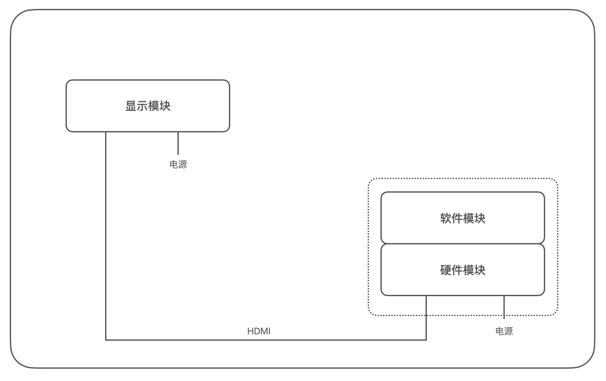
</br>[2.模块关系示意图]
</div>

### 0x02 相框和屏幕
首先我们来准备显示模块，理论上直接准备一个显示器即可，不过为了美观和相框的仪式感，我们还是采用屏幕面板 + 相框的方法进行自行组装。

首先根据自己的喜好我挑选了一个 8寸(内径)大小的黑色木质相框如下：
<div align="center">
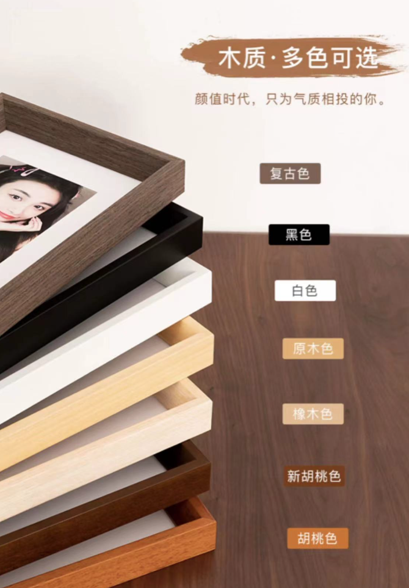
</br>[3.根据喜好挑选相框]
</div>

挑选时注意以下几个关键点，以上述这款为例：
1. 注意详细内径尺寸大小用于购买屏幕面板；外径(18.4x23.5cm)/内径8寸(15.2x20.3cm)
2. 由于屏幕面板比画布厚，所以尽量选择相框偏厚一点的，以保证背板可以正常盖上
3. 由于屏幕面板尺寸不一定和相框内径贴合，可以购买卡纸来调整下
4. etc

接下来按照相框的内径尺寸(15.2x20.3)挑选合适的屏幕面板，我们通常使用屏库网(https://www.panelook.cn/)进行搜索，如下我们搜索 7寸～8寸 的屏幕：
<div align="center">
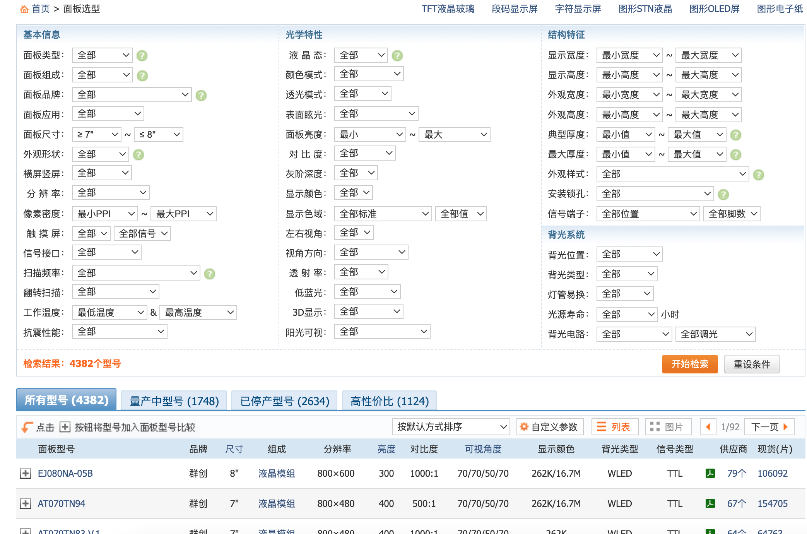
</br>[4.从屏库网搜索屏幕面板型号]
</div>

>注意屏幕面板尺寸可以买小，但不能买大。

屏幕面板除了尺寸、还有品牌、材质、分辨率等等参数需要选择，但最为重要的还有价格因素，从屏库网选择几款中意的面板后，通过面板型号在淘宝进行搜索比价，选择一款确认购买后，还需要根据接口类型选择购买对应的屏幕面板驱动板，还需要同时将屏幕面板参数发送给商家，让商家帮忙将驱动程序烧录进去，示意如下：
<div align="center">
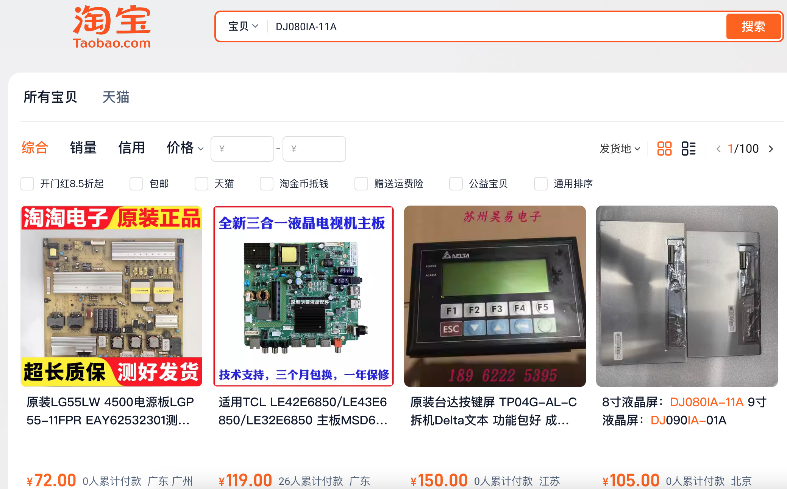
</br>[5.从淘宝搜索屏幕面板型号]
</div>

经过多轮比较，我最终在一个商家店里直接选择了「8寸屏幕面板+驱动板」的套件，示意如下：
<div align="center">
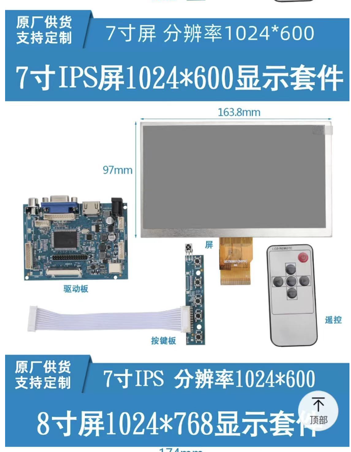
</br>[6.购买屏幕面板+驱动板套件]
</div>

>注意询问套件中是否包含电源。

我购买的屏幕面板参数如下：
1. 8寸尺寸，实际大小为 184.1 x 114.6mm
2. 分辨率 1280x800，画幅 16:10
3. HDMI接入
4. 其他忽略

等快递都到齐后，把屏幕面板当作画布一样装进相框即可，我这里使用热熔胶把屏幕面板和相框背板粘在一起固定，并将驱动板粘在背板的背面，组装完毕如下：

正面：
<div align="center">
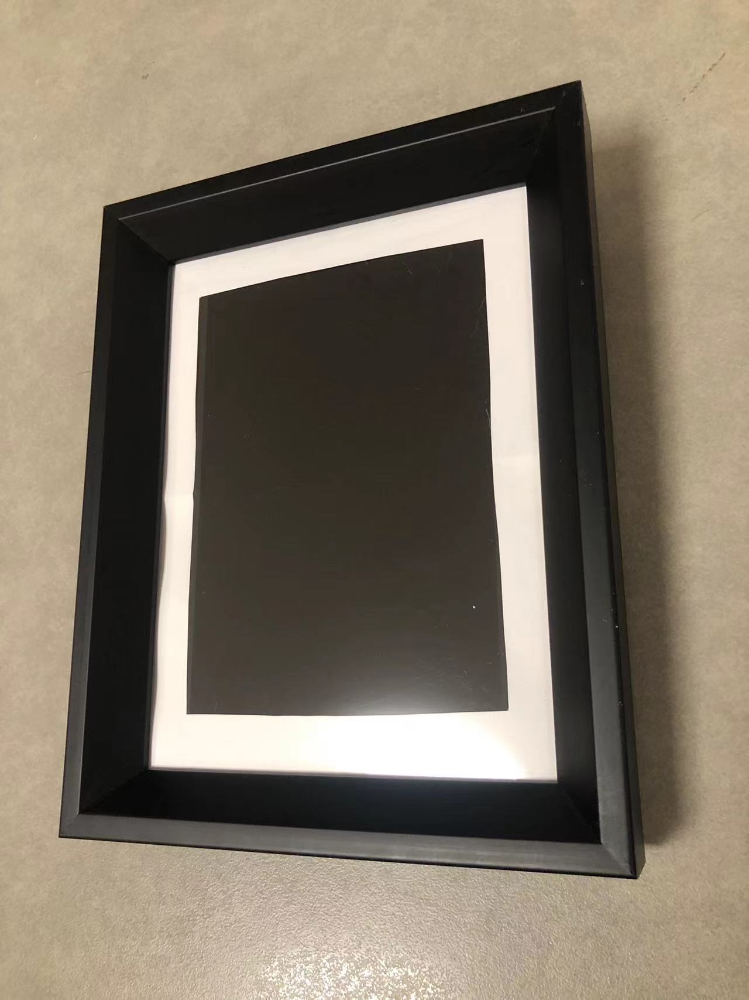
</br>[7.组装的电子相框正面]
</div>

背面：
<div align="center">
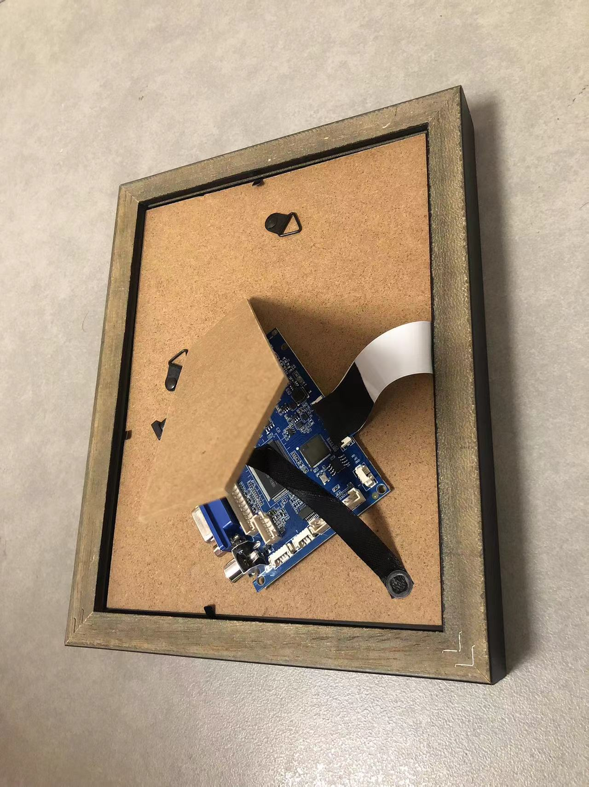
</br>[8.组装的电子相框背面]
</div>

### 0x03 树莓派配置
现在我们来准备硬件模块和软件模块，如果要在比较新的硬件上如树莓派4 上进行配置，那我们只需要安装好系统，联网并安装 `feh` 软件(https://github.com/derf/feh
)即可，`feh` 是一个轻量级的图片查看器，支持对一个文件夹下的图片进行轮播，安装命令如下：
```
$ sudo apt update
$ sudo apt install feh
```

但我们的硬件树莓派 zero 如下，它没有 WIFI 和蓝牙支持，甚至也只能使用 Micro USB 连接外设，这让我们配置软件非常不方便：
<div align="center">
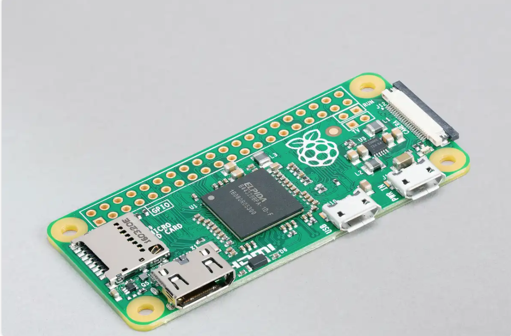
</br>[9.硬件树莓派zero主板]
</div>

我们可以考虑使用 QEMU 在虚拟环境下对树莓派镜像进行配置，全部准备完毕后再将系统烧录到 SD 卡中，由树莓派 zero 直接开机运行。

通过树莓派官网(https://www.raspberrypi.com/software/operating-systems/)下载镜像 `2021-12-02-raspios-buster-armhf.img`，通过 `git clone` 拉取专为 QEMU 模拟运行树莓派系统的适配的项目 qemu-rpi-kernel(https://github.com/dhruvvyas90/qemu-rpi-kernel)，构建目录结构如下：
```
.
├── 2021-12-02-raspios-buster-armhf.img
└── qemu-rpi-kernel
```

通过如下命令使用 QEMU 启动树莓派系统，其中设置机器架构为 `versatilepb`，CPU 类型为 `arm1176`，内存为 `256MB`，内核和 DTB 文件需要配套使用 `kernel-qemu-4.19.50-buster` 和 `versatile-pb-buster.dtb`，指定硬盘为镜像文件 `2021-12-02-raspios-buster-armhf.img`，root 挂载路径为 `/dev/sda2`，设置串口到标准输出，设置端口转发 `2222:22`：
```
$ qemu-system-arm -M versatilepb -cpu arm1176 -m 256 \
-kernel qemu-rpi-kernel/kernel-qemu-4.19.50-buster \
-dtb qemu-rpi-kernel/versatile-pb-buster.dtb \
-hda 2021-12-02-raspios-buster-armhf.img \
-append "root=/dev/sda2" \
-serial stdio \
-nic user,hostfwd=tcp:127.0.0.1:2222-:22
```

启动如下：
<div align="center">
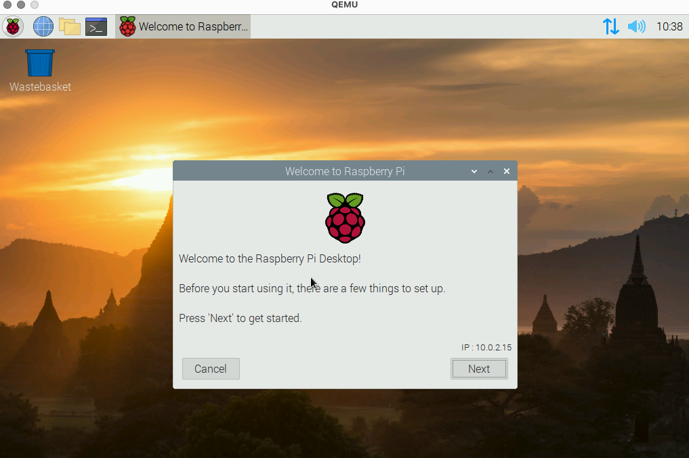
</br>[10.QEMU启动树莓派镜像]
</div>

默认情况下，虚拟主机将分配 `10.0.2.15` 的 IP 地址，随后我们便可以正常进行安装软件、配置以及测试：
```
# 使用串口或 ssh 连接虚拟主机进行配置
$ ssh pi@127.0.0.1 -p 2222
# raspberry

# 安装软件
$ sudo apt update
$ sudo apt install feh
$ sudo apt install fonts-arphic-ukai
```

准备一个图片文件夹 `~/Desktop/images/`，使用 `feh` 命令进行测试：
```
$ DISPLAY=:0 feh /home/pi/Desktop/images/ -F -Z -Y -d -r --randomize -D5 -C "/usr/share/fonts/truetype/arphic/" --font "ukai.ttc/24"

# -F  全屏显示
# -Z  自动缩放图片
# -Y  隐藏鼠标指针
# -d  显示文件名
# -r  递归显示目录内容
# -D5 每5秒换一张图片
# --randomize 随机显示
# -C 设置自定义字体路径
# --font 设置字体和大小
```

>`feh` 默认字体无法正确处理中文，所以这里设置使用 `fonts-arphic-ukai` 楷体字体

运行如下：
<div align="center">
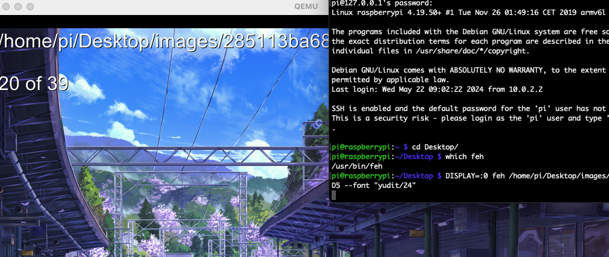
</br>[11.feh测试图片轮播]
</div>

随后使用 systemd 配置开机启动项 `/lib/systemd/system/photos-feh.service` 如下，这里需要在图形界面(`graphical.target`)初始化完成后再启动，所以需要放置于同级别的 `/lib/systemd/` 目录下：
```
[Unit]
Description=photos-feh
After=graphical.target

[Service]
Environment=DISPLAY=:0
WorkingDirectory=/home/pi/Desktop/images/
ExecStart=/usr/bin/feh ./ -F -Z -Y -d -r --randomize -D 900 -C "/usr/share/fonts/truetype/arphic/" --font "ukai.ttc/24"
Restart=always
User=pi

[Install]
WantedBy=default.target
```

使用 `systemctl` 测试并添加至开机启动：
```
$ sudo systemctl --user start photos-feh.service
$ sudo systemctl --user enable photos-feh.service
```

除此之外，还需要在树莓派设置中配置屏幕不休眠，如下：
<div align="center">
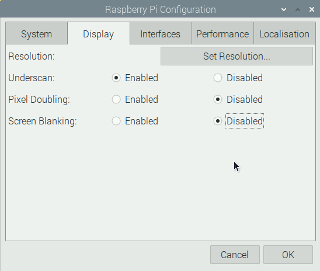
</br>[12.树莓派设置屏幕不休眠]
</div>

最后使用 `dd` 命令将配置好的树莓派 img 镜像写入到 SD 卡，完成系统的安装：
```
$ diskutil list
$ diskutil unmountDisk /dev/disk2
$ dd if=2021-12-02-raspios-buster-armhf.img of=/dev/disk2 status=progress bs=4M
```

### 0x04 成品展示
在以上都准备完毕后，我们将 SD卡插入树莓派 zero，将树莓派与相框通过 HDMI 线进行连接，通电后展示如下：
<div align="center">
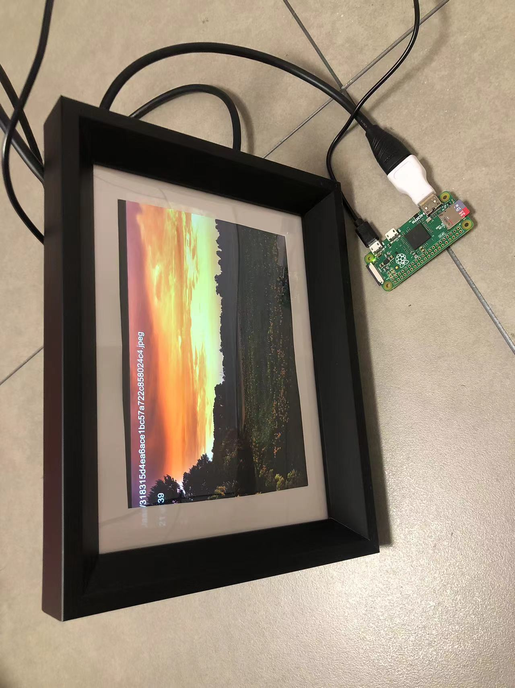
</br>[13.电子相框成品展示]
</div>

>树莓派启动时会自动调整磁盘大小和屏幕分辨率，如果有不兼容的问题，可以尝试重启解决。

后期维护可以使用 Linux 主机直接挂载 SD卡的分区，对照片进行编辑，命令示意如下：
```
$ mkdir data
$ fdisk -l
$ sudo mount /dev/sdb2 data/
```

### 0x05 模拟运行树莓派的扩展
实际上，在 QEMU 模拟运行树莓派系统并不是一件容易的事情，这是因为 QEMU 对不同机器架构模拟实现的程度不同，且树莓派系统对不同架构的硬件支持程度不同。

比如上文中我们使用 `qemu-rpi-kernel` 项目成功模拟运行了 `2021-12-02-raspios-buster-armhf.img` 镜像，而 `2024-03-15-raspios-bookworm-armhf.img` 则会出现 GUI 无法加载的情况，同时在串口中还无法使用默认密码进行登录，这可能是因为版本差异导致挂载文件或模拟运行出现了问题。

QEMU 还提供了 `raspi0/raspi1ap/raspi2b/raspi3ap/raspi3b` 机器架构的支持，那么如果是原生模拟运行呢？

经过测试，我们使用 `raspi2b` 成功运行了树莓派镜像，首先我们从树莓派镜像中提取内核和 DTB 文件(设备树引导文件)，如下：
```
# Ubuntu 22.04
$ mkdir data
$ fdisk -l 2021-12-02-raspios-buster-armhf.img
...
Device                                 Boot   Start      End Sectors  Size Id Type
2021-12-02-raspios-buster-armhf.img1           8192   532479  532478  256M  c W95 FAT32 (LBA)
2021-12-02-raspios-buster-armhf.img2         532480  7299071  6766592  3.2G 83 Linux

# 偏移地址 * 扇区大小 = 8192 * 512 = 4194304
$ sudo mount -o loop,offset=4194304 2021-12-02-raspios-buster-armhf.img data/
# 拷贝内核文件和 DTB 文件
$ cp data/kernel7.img .
$ cp data/bcm2709-rpi-2-b.dtb .
```

随后我们使用 QEMU 的 `raspi2b` 机器架构进行模拟运行：
```
$ ls -lah 2021-12-02-raspios-buster-armhf.img
3.5G Dec  2  2021 2021-12-02-raspios-buster-armhf.img
# 调整镜像大小为 2 的次方，否则启动将会提示错误
# SD card size has to be a power of 2, e.g. 128 GiB.
$ qemu-img resize -f raw 2021-12-02-raspios-buster-armhf.img 4G

# 测试内核是否可以成功启动，提示挂载问题则表示成功
$ qemu-system-arm -M raspi2b -kernel kernel7.img -dtb bcm2709-rpi-2-b.dtb

# 设置 SD 卡指向镜像以及挂载路径，并设置串口为标准输出
qemu-system-arm -M raspi2b \
-kernel kernel7.img -dtb bcm2709-rpi-2-b.dtb \
-sd 2021-12-02-raspios-buster-armhf.img \
-append "root=/dev/mmcblk0p2 rootwait console=ttyAMA0" \
-serial stdio
```

执行如下：
<div align="center">
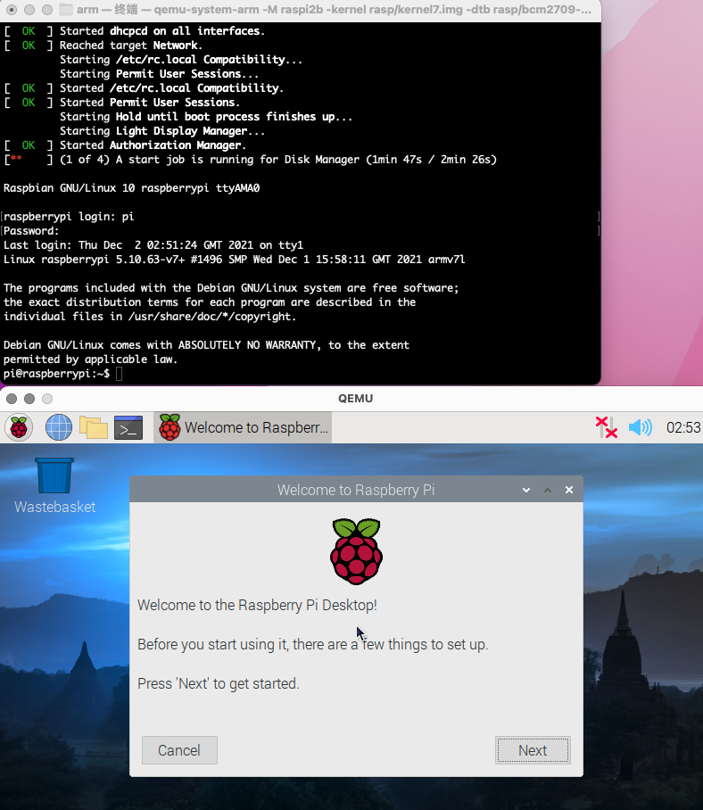
</br>[14.raspi2b架构模拟运行树莓派]
</div>

>在 QEMU 7.0 和 2021-12-02-raspios-buster-armhf.img 的版本下，经过测试 `raspi0/raspi3b` 启动过程中存在诸多问题。

但由于 QEMU 对树莓派的 `raspi2/raspi3` 没有实现 USB 的仿真，所以 GUI 这一侧不能正常使用，没有 USB 当然也没有网络的支持(https://bugs.launchpad.net/qemu/+bug/1772165)。

相比起来，使用 `qemu-rpi-kernel` 项目模拟树莓派系统更好用一些。

### 0x06 References
https://post.smzdm.com/p/az6qme7r/  
https://sspai.com/prime/story/tutorial-diy-eink-photoframe-with-rpi  
https://twheastasia.github.io/2022/01/09/%E6%A0%91%E8%8E%93%E6%B4%BE%E7%94%B5%E5%AD%90%E7%9B%B8%E5%86%8C-%E8%BD%AF%E4%BB%B6%E7%AF%87/  
https://post.smzdm.com/p/a785z7pg/  
https://sspai.com/post/66937  
https://sspai.com/post/56527  
https://www.panelook.cn/  
https://www.raspberrypi.com/products/raspberry-pi-zero/  
https://github.com/derf/feh  
https://www.raspberrypi.com/software/operating-systems/  
https://github.com/dhruvvyas90/qemu-rpi-kernel  
https://shumeipai.nxez.com/2020/06/30/linux-usage-systemd.html  
https://github.com/derf/feh/issues/518  
https://bugs.launchpad.net/qemu/+bug/1772165  
https://juejin.cn/post/7195382746540654651  