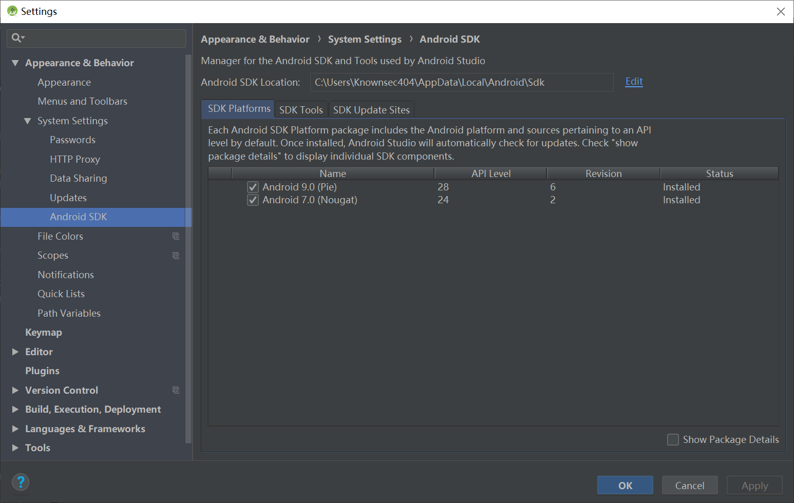
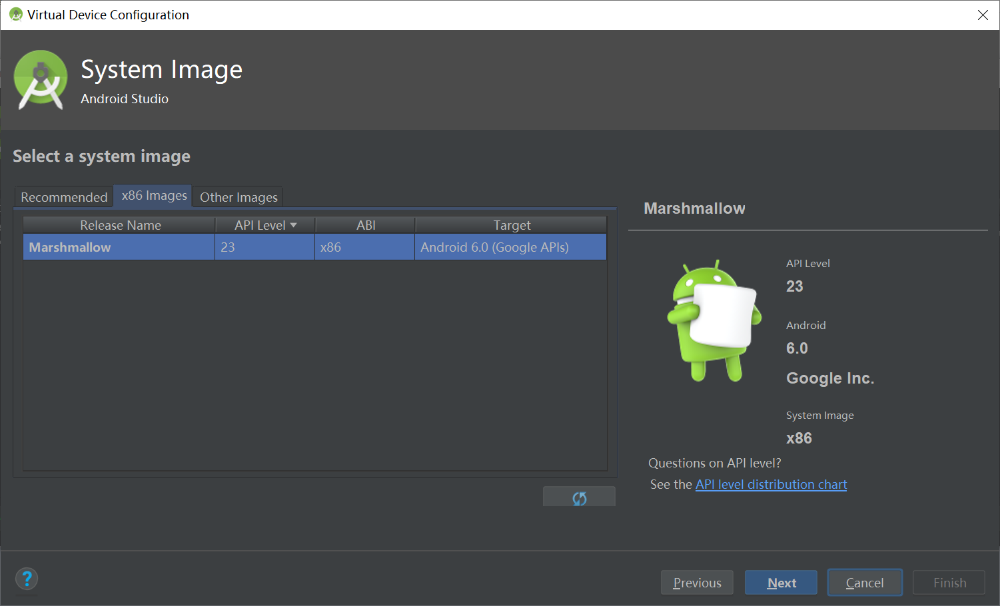
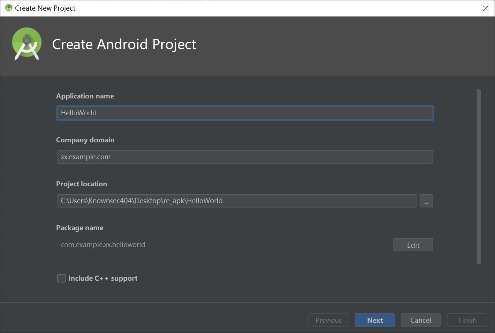
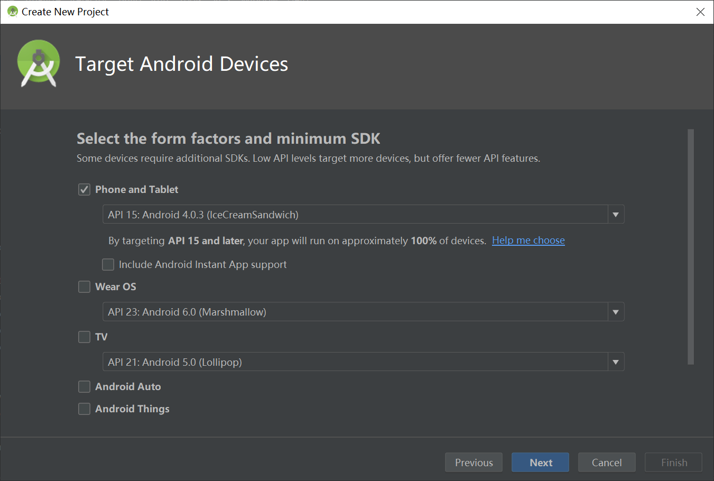
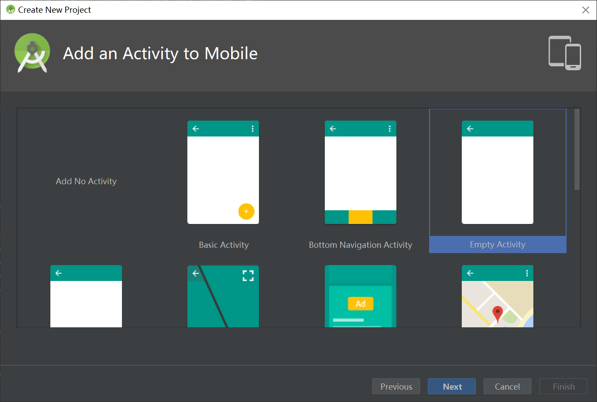
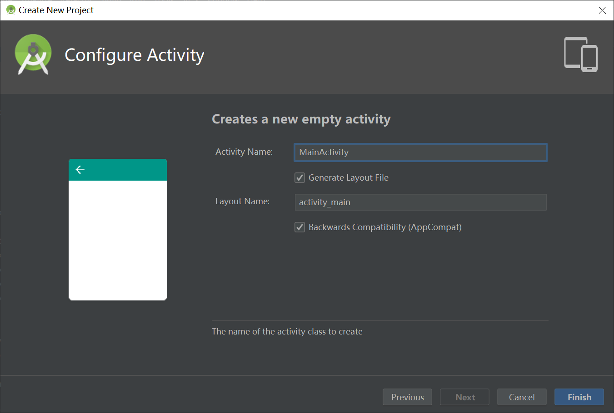
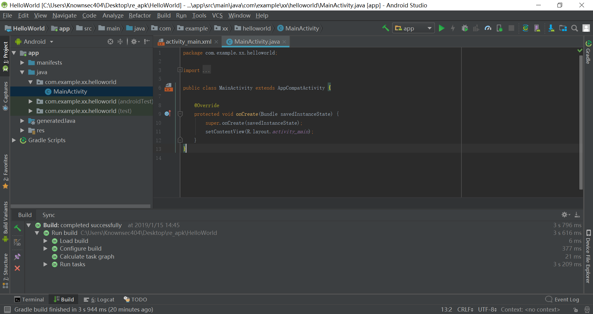
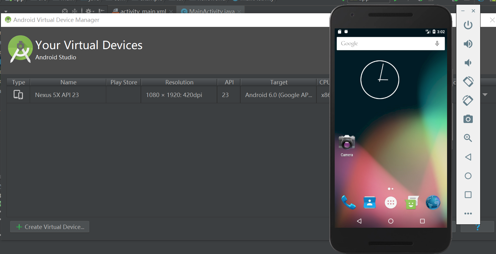
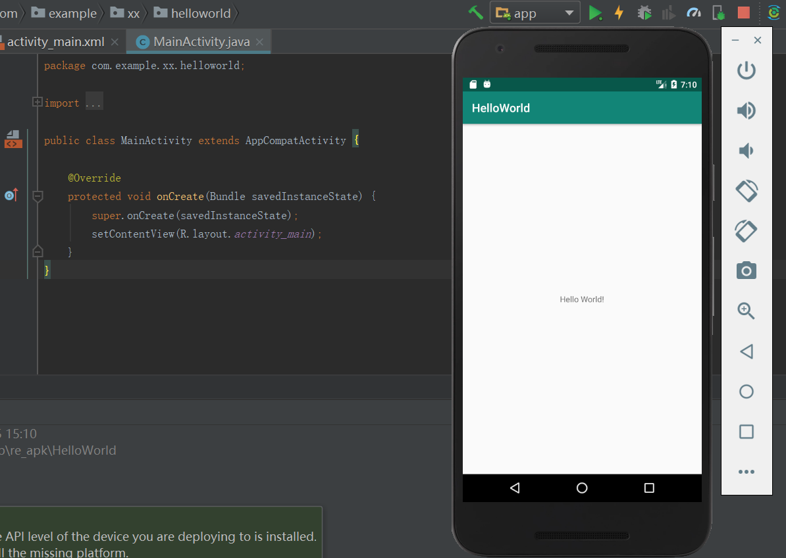
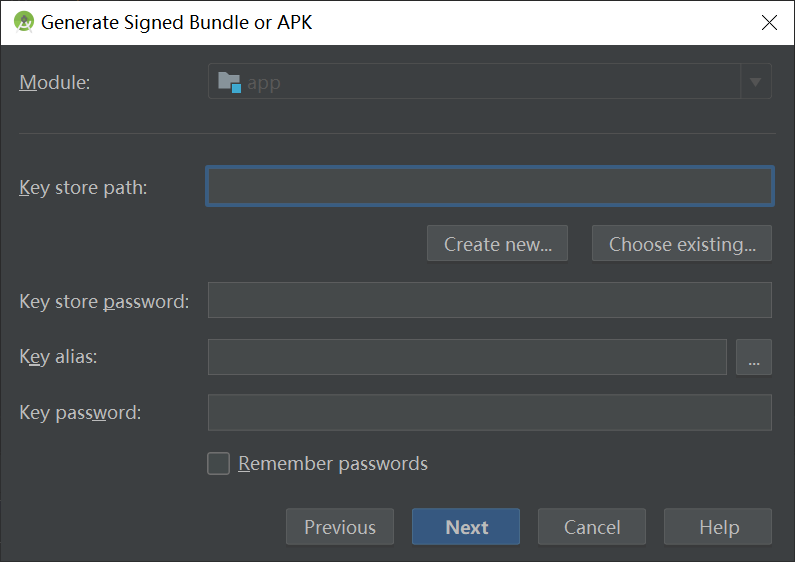

## 安卓开发环境的配置

Time: 2019.01.15  
Tags: 开发,Android  

### 0x00 前言

本文为「how to start reverse APK」的前导篇，旨意在为入门 APK 逆向前了解 android 的开发流程，以及相关开发软件，同时为 APK 逆向搭建必要的环境。

本文所有的实验环境为 `Windows10 x64`。

1. Android系统架构
2. JDK环境配置
3. Android Studio配置
4. HelloWorld
5. 总结

### 0x01 Android系统架构
Android 是一种基于 Linux 的开放源代码软件栈，为广泛的设备和机型而创建。下图所示为 Android 平台的主要组件。

 [图1.Android系统架构]

其中最上层的组件就是平时可以直接操作的 APP 应用程序(APK)。

### 0x02 JDK环境配置
在 2017 年，Google 推出 Kotlin 语言作为 Android 开发的推荐语言，而在此之前 Android 都是由 Java 进行开发的，就目前而言(2019.1)， Java 仍然是 Android 的主要开发语言，所以我们**讨论的范围也仅针对于 Java**。

使用 Java 首先必须进行 JDK 的环境配置。

	1. 前往 Oracle 下载 JDK 安装包
	2. 执行安装
	3. 配置环境变量

在 `cmd` 下执行 `java`、`javac` 可测试安装成功与否。

### 0x03 Android Studio配置
在配置好 JDK 环境后，基础的 Java 运行环境已经有了。常用的 Android 开发 IDE 有：

	1. Eclipse
	2. Android Studio

Google 官方推荐使用 Android Studio。

**Android Studio安装**  
首先下载安装 Android Studio：

	1.前往 https://developer.android.google.cn/studio/ 下载安装包
	2.直接执行安装即可

**SDK配置**  
安装好 Android Studio 后并不能立刻开始开发，还需要安装 SDK (Software Development Kit)。首次打开 Android Studio 会提示进行 SDK 的下载，也可以暂时取消，进入到 Android Studio 后手动配置。

通过 Android Studio 自动下载 SDK 需要科学上网，除此之外，可以通过其他方式下载 SDK，然后在 Android Studio 中配置 SDK 路径。

 [图2.SDK路径配置]

**AVD配置**  
在完成上两步后，实际上已经可以进行 Android 项目的开发了，但是运行调试还需要设备。可以使用真机进行项目调试，手机通过 USB 与电脑进行连接，打开「USB 调试」即可；当然，最方便的方式是使用模拟器。

在 Android Studio 中，内置了 AVD 管理(Android Virtual Device)。通过菜单栏 `Tools->AVD Manager` 即可创建模拟器设备，所有版本的系统都需要额外下载(科学上网)。**这里推荐下载 `Android6.0` 以下的版本，模拟器自动拥有 root 权限**，便于逆向工作的进行。

 [图3.已下载的Android6.0]

### 0x04 HelloWorld
开发环境配置完成后，即可进行 Android 项目的开发了；本文中的实验环境为 `Android Studio3.2.1`。

打开 Android Studio 或者在 Android Studio 中选择 `File->New Project` 开始创建项目。

1.输入项目名称、包、路径等相关信息  

 [图4.设置项目名称]

2.选择项目的目标平台以及最低支持的版本  

 [图5.选择项目的目标平台]

3.选择一个初始的 Activity  

 [图6.选择初始的Activity]

4.为该 Activity 命名

 [图7.为Activity命名]

点击 `Finish` 后即可完成 `HelloWorld` 项目的构建。

>PS: 在 Android Studio2.0 后，开始使用 Gradle 构建项目(Gradle 是一个基于 Apache Ant 和 Apache Maven 概念的项目自动化建构工具，能够大幅提高开发人员的效率)，如果是首次构建项目，Android Studio 后先进行下载(科学上网)。Gradle 的下载不受 Android Studio 设置中的代理影响，所以需要手动修改配置文件，其默认路径为 `C:\Users\John\.gradle\gradle.properties`，在最后添加如下代理设置才能生效：`org.gradle.jvmargs=-DsocksProxyHost=127.0.0.1 -DsocksProxyPort=1080`(本地的 socks5 代理设置)。

5.项目构建完成

 [图8.项目构建完成]

6.创建并启动 AVD  
打开菜单栏 `Tools->AVD Manager` 按照指导创建一台模拟器并启动。

 [图9.启动Android6.0的模拟器]

7.运行调试项目  
打开菜单栏 `Run->Run 'app'`，并选择刚才打开的模拟器，即可自动在模拟器中安装项目并启动。

 [图10.运行项目]

8.打包项目为 APK
通过打包项目可以将其打包为一个 APK。通过菜单栏 `Build->Generate Signed Bundle/APK` 可以打包 release 的 APK。(`Build->Build Bundle/APK`打包的是 debug 版的)。

点击后进入打包的界面，选择 APK。当打包 release 的 APK 时，必须对 APK 进行签名，所以需要先生成密钥，在该界面上按照指导进行即可。

 [图11.使用密钥进行签名]

随后在该项目下的 `[HelloWorld]/app/release` 可以看到打包好的应用。

### 0x05 总结
本文粗略的介绍了 Android 开发环境的配置，虽然未对其中的安装过程进行详细的描述，不过关键的步骤都进行了强调说明，为 Android 开发和 APK 逆向做了一个铺垫。

### 0x06 References
developer.android: <https://developer.android.com/guide/platform/?hl=zh-cn>