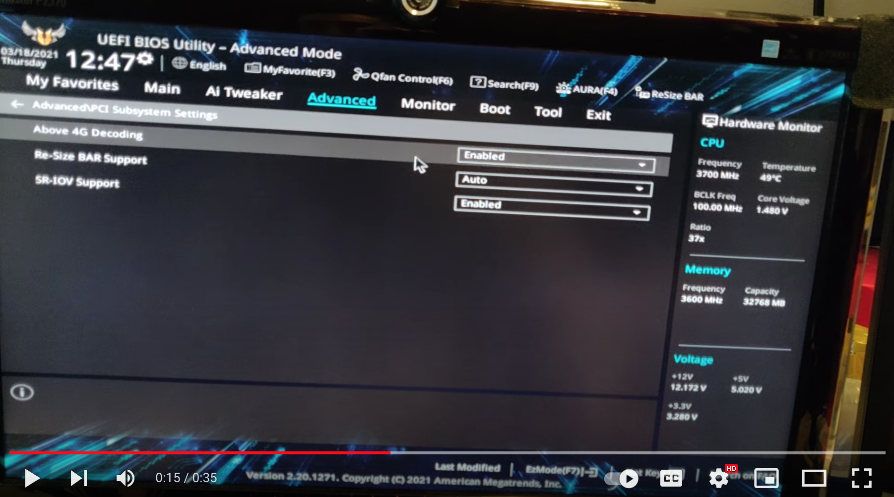
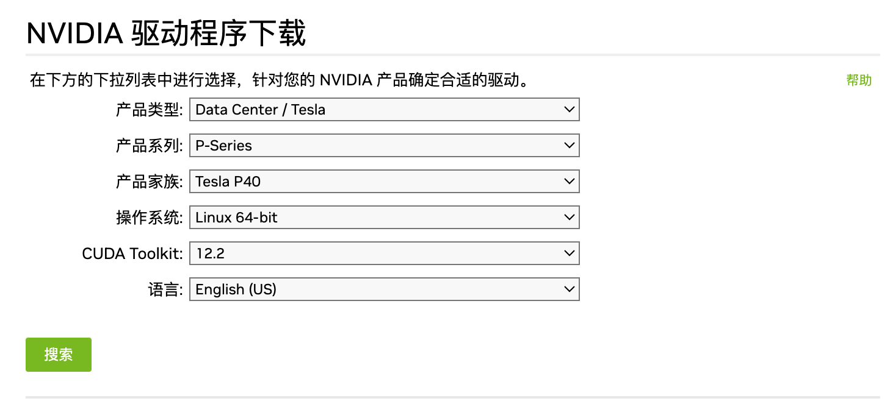

## 折腾P40显卡本地运行LLM的环境

Time: 2023.07.11  
Tags: LLM  


### 0x00 前言

2023.6 月，随着开源大模型(LLM: Large Language Model)越来越多，在本地部署大模型成为触手可及的事情，高性能消费级显卡如 4090、3080Ti 可以满足基本的部署需求，当然还可以直接租赁云厂商提供的 GPU 算力。

长时间租赁服务器仍是一个性价比较低的投入，而实验室正好有一台闲置的服务器，几个同事一商量就准备将其配置成一台拥有 GPU 计算卡的服务器。

本文梳理并记录了与同事(@Hcamael / @ghost461)一起使用 NVIDIA P40 显卡配置 LLM 运行环境的折腾过程。

本文实验环境
```
ASUS X570-PRO 主板
AMD Ryzen 9 3900X(CPU)
NVIDIA Tesla P40 (GPU/24GB/计算卡)
NVIDIA GeForce GTX 750 Ti(亮机卡)

Ubuntu22.04 x64
Windows10 22H2
```

### 0x01 硬件配置
我们闲置的主机是一台完善配置的 CPU 计算型服务器，由于 AMD 3900X 不带显卡，所以为其配置了 GTX750Ti 作为亮机卡，主板采用了高性能的 ASUS X570-PRO：
<div align="center">

</br>[1.ASUS X570-PRO主板]
</div>

NVIDIA Tesla P40 是一代矿卡，在二手市场有不少供货，虽然其计算性能偏弱，但其拥有 24GB 的显存，同时价格合理，非常符合我们的预期。

我们服务器配置是一个 650W 的电源，用电大户 CPU AMD 3900X TDP 105W，亮机卡 GTX750Ti 最大功率 60W，计算卡 P40 显卡最大功率为 250W，这样是完全满足需求的。(P40 显卡是计算卡，没有任何接口，实际配置时仍需要亮机卡)

同时 P40 显卡长度大约 26cm，默认不带散热器，我们又单独购买了涡轮式的散热器(满转时非常吵)，散热器长度为 4cm，所以机箱中 PCIE 插槽的长度空间至少要超过 30cm 以上；除此之外，在我们的实验环境下还需要合理的容纳下亮机卡：
<div align="center">

</br>[2.Nvidia P40显卡]
</div>
>还需要注意 P40 显卡需要使用 双8Pin 转 8Pin 的线进行独立供电。(卖家附赠)

对于显存超过 8GB 的显卡，主板必须支持 `Above 4G Decoding` 功能并开启，否则无法通过硬件自检，无法开机，ASUS X570-PRO主板设置如下：
<div align="center">

</br>[3.Above 4G Decoding设置]
</div>

>若主板支持 `Above 4G Decoding` 功能，但设置中找不到，可以尝试更新 BIOS 驱动。

比较幸运的是，以上条件我们的闲置服务器都满足。

### 0x02 操作系统配置
硬件配置完成后，我们开始安装操作系统，为了方便后续的使用，我们将安装 Windows10 和 Ubunt22.04 双系统。

服务器配置了 256 + 512 + 512GB 三块 SSD 硬盘，首先我们在 256GB 的硬盘上安装 Windows10 操作系统，随后再用其中一块 512GB 的硬盘安装 Ubuntu 系统，剩下的一块硬盘作为数据盘，两个系统都可以进行使用。

### 0x03 win10驱动配置
Windows10 系统安装完毕后，默认只能识别 GTX750Ti 这张显卡，在设备管理器中可以看到显卡，同时任务管理器可以看到显卡的负载(使用 Windows Update 更新驱动后，仍只有 GTX750Ti 显卡)。

我们需要手动安装 P40 显卡的驱动，从官网下载驱动如下：
<div align="center">

</br>[4.下载P40 windows驱动]
</div>

随后进行安装，安装过程会提示卸载老的驱动，安装完毕后可以在设备管理器中看到 P40 显卡，使用 `nvidia-smi` 可以查看显卡配置，但任务管理器没有显卡：
<div align="center">

</br>[5.P40驱动安装成功]
</div>

>在我们的实验环境下，P40 和 GTX750Ti 的驱动是不能兼容共存；不过部分较新的显卡如 4090、3080Ti 等消费级显卡的驱动是可以和计算卡兼容共存的，具体可以查看驱动的支持列表。

实际上此时 P40 显卡已经可以正常工作了，任务管理器中看不到负载是因为 P40 是一张计算卡，默认运行于 TCC(Tesla Compute Cluster) 模式(仅用于计算，不能作为本地显示输出)，可将其修改为 WDDM(Windows Display Driver Model) 模式(既用于计算又用于本地显示输出)。

我们可以通过注册表修改 P40 为 WDDM 模式，首先访问 `HKEY_LOCAL_MACHINE\SYSTEM\CurrentControlSet\Control\Class\{4d36e968-e325-11ce-bfc1-08002be10318}`，这里有多个 `{4d36e968-e325-11ce-bfc1-08002be10318}` 项，找出其下包含形如 `0000` 的项，然后通过查看该路径下的 `DriverDesc` 确认显卡
<div align="center">

</br>[6.注册表CurrentControlSet下P40显卡配置]
</div>

修改该项 P40 显卡配置项：
* AdapterType：修改 2 => 1
* FeatureScore：修改 0xcf => 0xd1
* 添加 DWORD 类型 GridLicensedFeatures，设置值为 7

随后进入 `HKEY_LOCAL_MACHINE\SYSTEM\ControlSet001\Control\Class{4d36e968-e325-11ce-bfc1-08002be10318}`，按以上相同方式找到 P40 显卡：
<div align="center">

</br>[6.注册表ControlSet001下P40显卡配置]
</div>

修改该项 P40 显卡配置项：
* 删除 AdapterType 项(默认值为 1)
* 添加 DWORD 类型 EnableMsHybrid，设置值为 1

随后在同目录下进入 `0000`，该项为我们的亮机卡 GTX750Ti 的配置，修改该配置项如下：
* 添加 DWORD 类型 EnableMsHybrid，设置值为 2

随后重启服务器，在任务管理器中可以看到 P40 显卡：
<div align="center">

</br>[7.任务管理器查看P40的负载]
</div>

但是在我们实验环境下，修改 P40 为 WDDM 模式用于图像显示，使用起来非常的卡，比如打开一张桌面截图大致需要 5-10s；不过网上有人使用 核显 + P40 WDDM 模式可以运行 3A 大作，我们猜测是可能是实验环境的问题：
1. 我们没有为 GTX750Ti 配置驱动(不兼容)
2. 由于没有核显，P40 的运算结果还必须要走 GTX750Ti 的 HDMI 出口

因这些问题最终降低了 P40 的图形显示性能；实际使用时，我们还原了以上设置，然后使用 `nvidia-smi -l 1` 监控 P40 负载即可。

最后在官网下载 CUDA，正常安装完毕后使用 `nvcc -V` 检查即可：
<div align="center">

</br>[8.从官网下载CUDA安装包]
</div>

### 0x04 ubuntu驱动配置
进入 Ubuntu 系统，默认也只能识别 GTX750Ti 这张显卡，使用 `ubuntu-drivers devices` 命令可以看到推荐的驱动呢都是以 GTX750Ti 为准的，不过我们可以使用 `lspci | grep -i nvidia` 查看硬件是否识别到了：
<div align="center">

</br>[9.lspci查看显卡硬件信息]
</div>

随后我们从官网下载驱动如下：
<div align="center">

</br>[10.下载P40 linux驱动]
</div>

>注意 `CUDA Toolkit` 按需选择版本，不要选择 `Any`，否则会提供较老版本的驱动，可能无法正常安装。

安装 P40 驱动前，先使用 `apt` 安装相关依赖：
```
# 移除可能已经安装的 nvidia 驱动
$ sudo apt-get remove --purge nvidia*

# 安装相关依赖
$ sudo apt install gcc dkms build-essentail linux-headers-$(uname -r) libglvnd-dev
```

驱动安装时需要退出 X-Server 图形界面，在 Ubuntu 桌面上执行 `sudo init 3` 退出图形界面；同时使用 `lsmod | grep nouveau` 查看 Ubuntu 默认的显卡驱动，默认情况下是启动的，可以直接使用 `sudo sh NVIDIA-Linux-x86_64-535.54.03.run` 开始安装，其首先会提示并自动写入 `/etc/modprobe.d/blacklist.conf` 配置文件禁用 nouveau 驱动，这里也可以直接手动写入：
```
$ sudo vim /etc/modprobe.d/blacklist-nouveau.conf

blacklist nouveau
options nouveau modeset=0

$ sudo reboot
```

禁用默认显卡驱动 nouveau 后重启服务器生效，随后再使用 `sudo sh NVIDIA-Linux-x86_64-535.54.03.run` 安装 P40 驱动；这里我们列出比较重要的几个选项：

首先其提示说包管理器能找到推荐驱动，需要我们确认使用二进制包安装的方式：
<div align="center">

</br>[11.确认使用二进制包安装驱动]
</div>

我们的服务器开启了 `Secure Boot`，所以第三方驱动必须签名才能被正确加载，这里我们需要先对驱动进行签名，后续选择生成新的密钥对并且不删除私钥，最后会保存在 `/usr/share/nvidia/` 目录下，随后选择 `Install signed kernel module` 继续安装：
<div align="center">

</br>[12.nvidia内核驱动签名]
</div>

>这一步也可以通过在 BIOS 中关闭 `Secure Boot` 来解决。

随后安装 32 位兼容库选择 `No`，注册为 DKMS 模块选择 `No`，更新 `X Server config` 配置文件选择 `Yes`，最后提示安装成功：
<div align="center">

</br>[13.nvidia驱动安装完成]
</div>

但是此时 nvidia 驱动还不能正常工作，我们还需要将该驱动的签名在MOK(安全启动流程))中进行注册，执行后需要设置一个密码：
```
sudo mokutil --import /usr/share/nvidia/nvidia-modsign-crt-7FB3D44A.der
```

执行完毕后，在首次重启服务器后，将进入 `Linux MOK Management` 管理界面，随后选择 `Enroll MOK` 以及 `Continue boot`，MOK 会自动列出我们刚才注册的密钥信息，随后输入密码即可完成注册。

重启服务器后，使用 `nvidia-smi` 查看显卡信息：
<div align="center">

</br>[14.P40驱动安装成功]
</div>

随后我们来配置 CUDA，从官网下载 CUDA 安装包如下：
<div align="center">

</br>[15.下载Linux版的CUDA安装包]
</div>

随后使用 `sudo sh cuda_12.2.0_535.54.03_linux.run` 开始安装，首先会提示说系统下已存在驱动，选择 `Continue` 即可，随后我们选择需要安装的组件，这里取消勾选驱动安装：
<div align="center">

</br>[16.CUDA安装组件选择]
</div>

>经测试，直接使用该安装包安装 NVIDA驱动和 CUDA，在驱动安装步骤会出错。

随后完成安装如下：
<div align="center">

</br>[17.CUDA安装完成]
</div>

按指导添加 `PATH` 和 `LD_LIBRARY_PATH` 到 `.bashrc` 后：
```
# CUDA config
export PATH=$PATH:/usr/local/cuda/bin
export LD_LIBRARY_PATH=$LD_LIBRARY_PATH:/usr/local/cuda/lib64
```

执行 `nvcc -V` 查看 CUDA 信息如下：
<div align="center">

</br>[17.检查cuda版本信息]
</div>

### 0x05 References
https://docs.nvidia.com/datacenter/tesla/tesla-installation-notes/index.html  
https://www.nvidia.cn/Download/index.aspx?lang=cn  
https://www.youtube.com/watch?v=wCvLZ6XqRd4  
https://www.mtain.top/archives/teslap40-xian-ka-shi-yong-xiang-guan-wen-ti  
https://qii404.me/2021/07/03/ubuntu-install-nvidia-driver.html  
https://azhuge233.com/tesla-p40-windows-%E4%B8%8B%E9%85%8D%E7%BD%AE%E6%A0%B8%E6%98%BE%E8%BE%93%E5%87%BA/  
https://controlnet.space/2021/05/13/note/gpu-driver-installation-in-linux-uefi-secure-boot/  
https://www.asus.com.cn/support/FAQ/1049829/  
