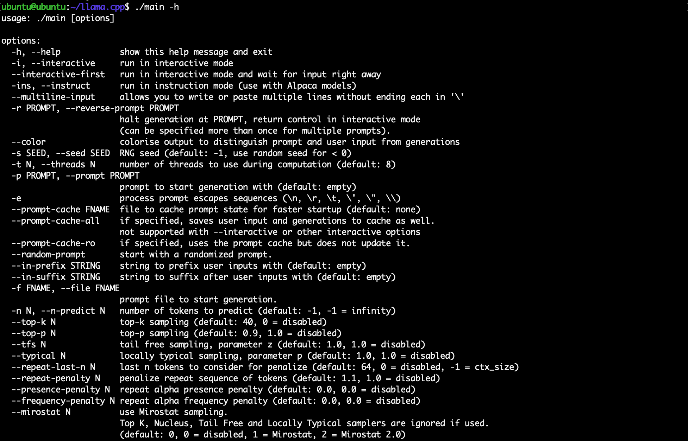
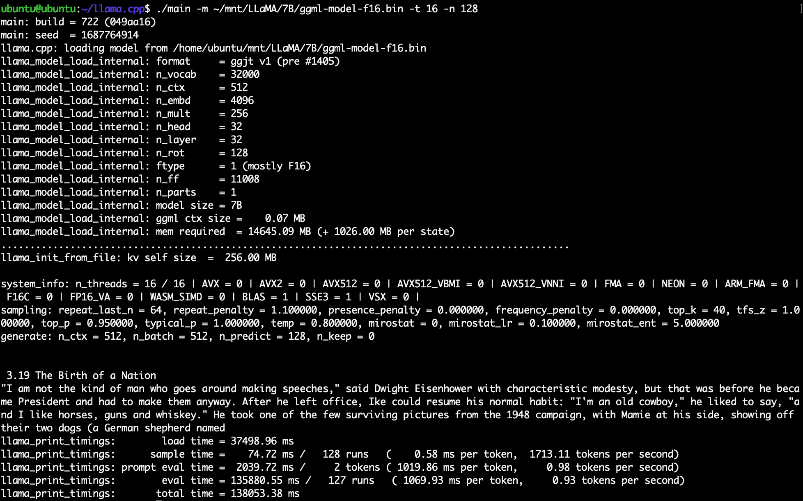
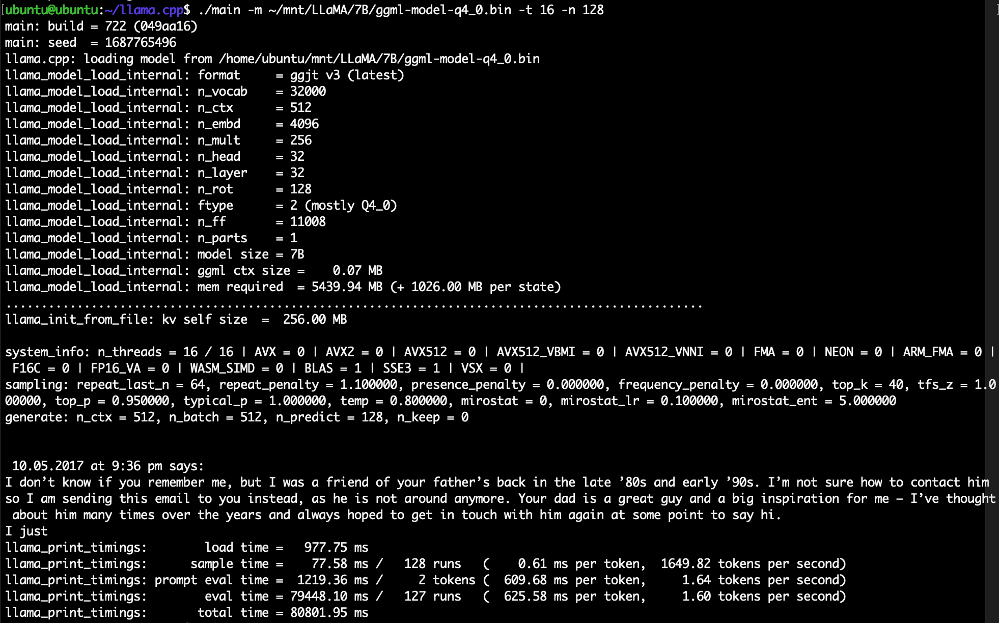
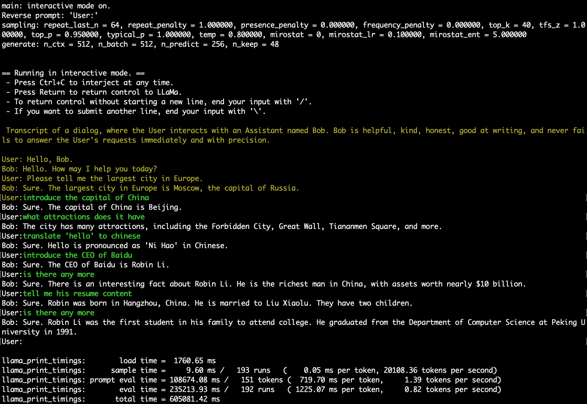
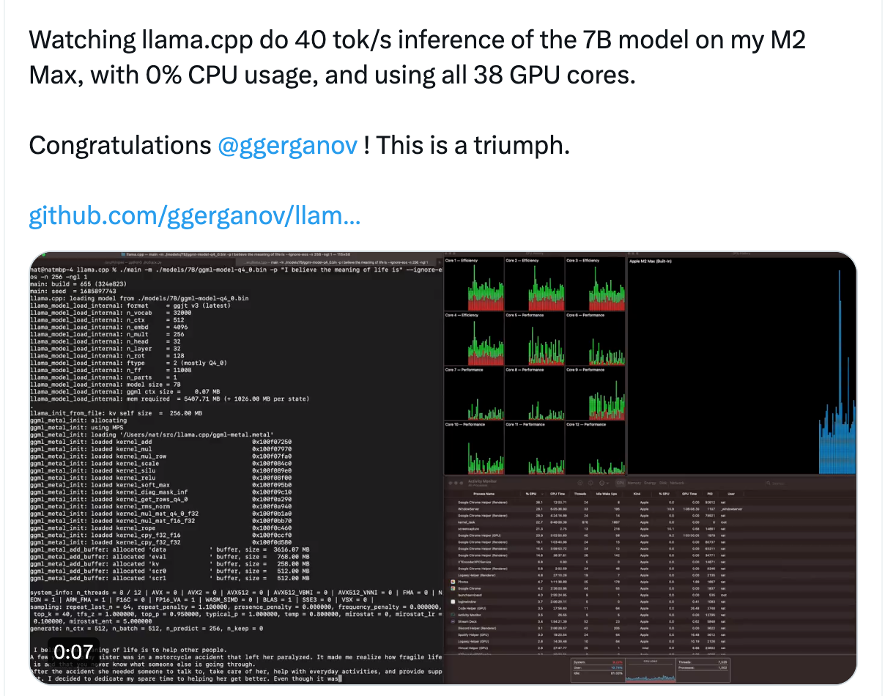

## 搭建基于llama.cpp的LLaMA模型

Time: 2023.06.26  
Tags: LLM  

### 0x00 前言
ChatGPT 从 2022.12 月掀起了大模型人工智能的浪潮，随后在一段时间内，各大团队都开源了自家的大模型，这无疑是入门学习大模型的好机会；但是大模型基本都需要大显存的显卡作为硬件支持，按时付费租赁云厂商的机器是个不错的选择，不过大神 Georgi Gerganov 根据 Meta 开源的 Python LLaMA 推理代码重写了 C++ 的版本 `llama.cpp`，可在 MacOS 和 Linux 平台上使用 CPU 进行推理。

随后伴随着 Meta LLaMA 模型的泄露，结合 llama.cpp 我们就可以在本地不需要显卡搭建部署大模型。

本文将以入门学习大模型的角度，详细介绍 llama.cpp 的搭建流程以及使用示例。

本文实验环境
```
Ubuntu 22.04 x64 (16C16G)
```

### 0x01 编译llama.cpp
首先在 Ubuntu 系统上安装 llama.cpp 的相关依赖：
```
apt update
apt install gcc g++ make python3-pip libopenblas-dev
```

从 github 拉取 llama.cpp 并进行编译：
```
git clone https://github.com/ggerganov/llama.cpp
cd llama
make
```

执行 `./main -h` 如下：
<div align="center">

</br>[1.llama-main帮助]
</div>

编译时，还可以添加 `OPENBLAS` 支持，以提高推理速度，如下：
```
# 检查 OPENBLAS 是否已安装
grep OPENBLAS_VERSION /usr/include/x86_64-linux-gnu/openblas_config.h
make LLAMA_OPENBLAS=1
```

>在 16C16G 主机上，运行 LLaMA-7B 模型平均 1000+ms/token，添加 `OPENBLAS` 支持可以微弱提高的推理速度(30ms)。

### 0x02 LLaMA下载和初始化
使用 aria2c 通过磁力链接下载 LLaMA 模型：
```
# LLaMA-7B
aria2c --select-file 21-23,25,26 'magnet:?xt=urn:btih:b8287ebfa04f879b048d4d4404108cf3e8014352&dn=LLaMA'
# LLaMA-13B
aria2c --select-file 1-4,25,26 'magnet:?xt=urn:btih:b8287ebfa04f879b048d4d4404108cf3e8014352&dn=LLaMA'
# LLaMA-30B
aria2c --select-file 5-10,25,26 'magnet:?xt=urn:btih:b8287ebfa04f879b048d4d4404108cf3e8014352&dn=LLaMA'
# LLaMA-65B
aria2c --select-file 11-20,25,26 'magnet:?xt=urn:btih:b8287ebfa04f879b048d4d4404108cf3e8014352&dn=LLaMA'
# everything
aria2c 'magnet:?xt=urn:btih:b8287ebfa04f879b048d4d4404108cf3e8014352&dn=LLaMA'
```

>如果是首次运行 aria2c，注意从互联网找一份最新的 `dht.dat` 文件。

配置 LLaMA 模型目录，可以按官方教程放置于 `./models` 目录下，也可以放置到其他目录下，但必须满足如下目录格式：
```
# obtain the original LLaMA model weights and place them in ./models
ls ./models
65B 30B 13B 7B tokenizer_checklist.chk tokenizer.model

# install Python dependencies
python3 -m pip install -r requirements.txt

# convert the 7B model to ggml FP16 format
python3 convert.py models/7B/

# quantize the model to 4-bits (using q4_0 method)
./quantize ./models/7B/ggml-model-f16.bin ./models/7B/ggml-model-q4_0.bin q4_0
```

模型大小如下：
|**Model**|**Original size**|**Quantized size (4-bit)**|
|---------|-----------------|----------------------|
|7B | 13 GB | 3.9 GB |
|13B| 24 GB | 7.8 GB |
|30B| 60 GB | 19.5 GB|
|65B|120 GB | 38.5 GB|

### 0x03 运行测试
使用以下命令使用 16 核运行 `LLaMA-7B f16` 模型，随机生成 128 token：
<div align="center">

</br>[2.LLaMA-7B-f16随机生成]
</div>

使用以下命令使用 16 核运行 `LLaMA-7B q4.0` 模型，随机生成 128 token：
<div align="center">

</br>[3.LLaMA-7B-q4.0随机生成]
</div>

在实验环境 16C16G 的配置下，运行 `LLaMA-7B f16` 模型其推理速度大约 `1000+ms/token`，运行 `LLaMA-7B q4.0` 模型大约 `500+ms/token`；

同时我们发现其运行过程中占用的内存远低于模型的实际大小，这是因为 llama.cpp 采用 `mmap` 的方式加载模型，只有当访问到才加载到内存中，随着使用内存占用将逐步增加。

使用 `mmap` 理论上可以加载任意大小的模型，但实际场景下尽量不要超过物理内存的限制，当 `mmap` 的模型大于物理内存时，系统将频繁的进行内存分页交换操作，受磁盘IO性能限制，从而导致 CPU 无法跑满，最终整体性能急剧下降。

>通常在 CPU 推理的情况下，理论上增加 CPU 核心数可线性提高推理速度，但实际情况下，还受到「软件适配 / CPU大小核(P/E) / 超线程 / 内存带宽 / 多核上下文切换」等问题的影响，需要自行测试以获得最佳性能。  
References:  
https://github.com/ggerganov/llama.cpp/issues/18  
https://github.com/ggerganov/llama.cpp/issues/34  
https://github.com/ggerganov/llama.cpp/issues/842  

### 0x04 chat
使用源码提供的 `./examples/chat.sh` 可以快速启动一个交互式聊天的 LLaMA 模型，其脚本内容如下：
```
#!/bin/bash

#
# Temporary script - will be removed in the future
#

cd `dirname $0`
cd ..

# Important:
#
#   "--keep 48" is based on the contents of prompts/chat-with-bob.txt
#
./main -m ./models/7B/ggml-model-q4_0.bin -c 512 -b 1024 -n 256 --keep 48 \
    --repeat_penalty 1.0 --color -i \
    -r "User:" -f prompts/chat-with-bob.txt
```

其中 `prompts/chat-with-bob.txt` 为：
```
Transcript of a dialog, where the User interacts with an Assistant named Bob. Bob is helpful, kind, honest, good at writing, and never fails to answer the User's requests immediately and with precision.

User: Hello, Bob.
Bob: Hello. How may I help you today?
User: Please tell me the largest city in Europe.
Bob: Sure. The largest city in Europe is Moscow, the capital of Russia.
User:
```

经过测试，`LLaMA-7B f16` 和 `LLaMA-7B q4.0` 比较容易答非所问，上下文也容易错乱；`LLaMA-13B` 在官方论文中表示某些场景下其效果可以达到 ChatGPT3 ([LLaMA - Open and Efficient Foundation Language Models](./LLaMA%20-%20Open%20and%20Efficient%20Foundation%20Language%20Models.pdf))；我们这里使用 `LLaMA-13B q4.0` 进行测试，如下：

<div align="center">

</br>[4.chat with LLaMA-13B-q4.0]
</div>

>在测试过程中还发现 `LLaMA` 模型无法理解 `continue` 这个词，不能像 GPT3 那样，可能这个词过于中性？

### 0x05 MacOS极致性能
在我们的 `Ubuntu 22.04 x64 16C16G` 实验环境中，运行 `LLaMA-7B q4.0` 的推理速度是 500+ms/token，llama.cpp 针对 MacOS M系列做了针对性的优化，官方在 M1 Pro 的配置下，运行 `LLaMA-7B q4.0` 的推理速度是 61.41ms/token。
<div align="center">

</br>[5.llama.cpp运行在Mac-M2上]
</div>

### 0x06 References
https://github.com/ggerganov/llama.cpp  
https://agi-sphere.com/install-llama-mac/  
https://github.com/ymcui/Chinese-LLaMA-Alpaca/wiki/llama.cpp-Deployment  
https://www.cnblogs.com/v3ucn/p/17250139.html  
https://github.com/ggerganov/llama.cpp/tree/master/examples/main  
https://twitter.com/natfriedman/status/1665402680376987648?s=20  
https://twitter.com/GuillaumeLample/status/1629151231800115202  
https://unix.stackexchange.com/questions/712651/does-mmap-allow-creating-a-mapping-that-is-much-larger-than-the-amount-of-physic  