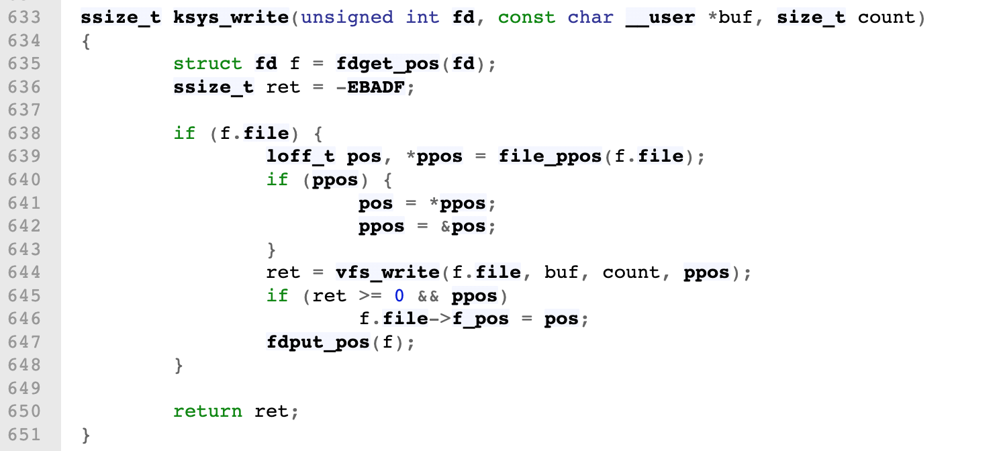
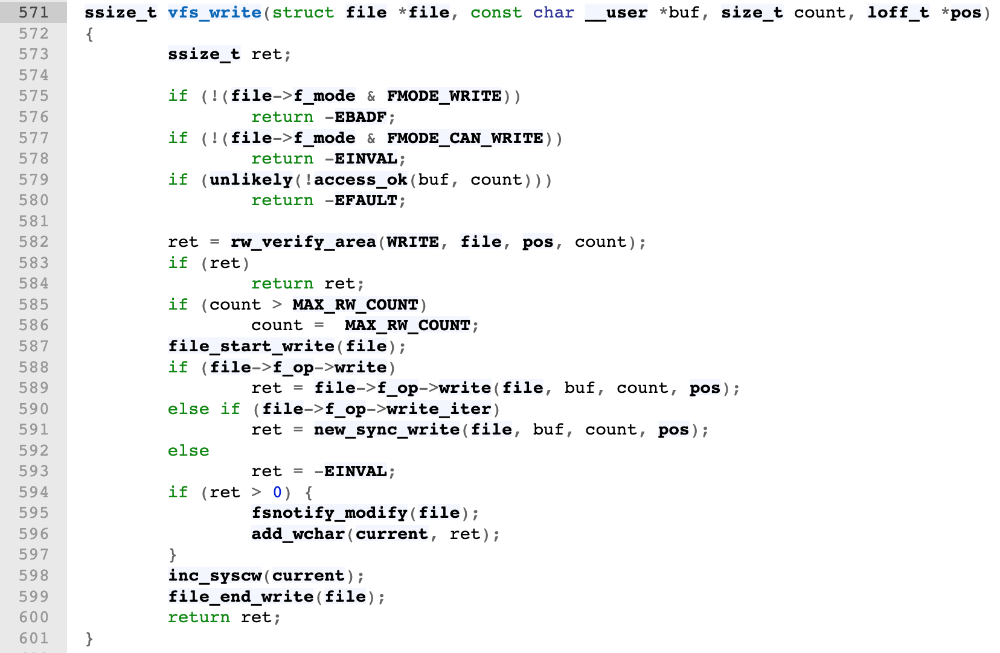
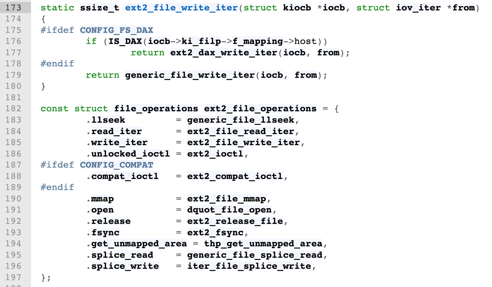
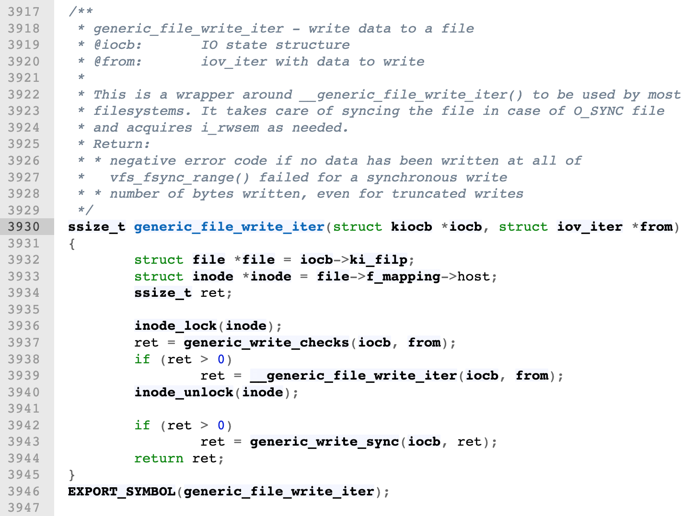
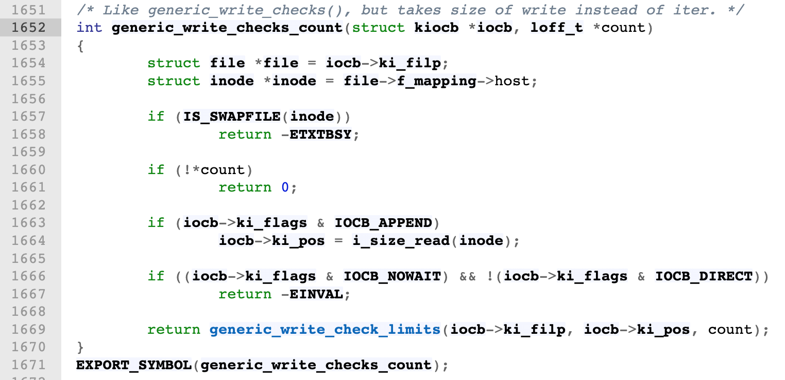

## 文件打开模式rwa的区别

Time: 2021.02.25  
Tags: 开发,Linux  


### 0x00 前言

编程时涉及到文件操作，需要通过 `r/w/a` 模式来打开文件，这对于我们太熟悉了；最近在使用时和预想的不太一样，这里对 `r/w/a` 模式进行详细的记录。


### 0x01 基础模式

`r`: 以只读的方式打开文本文件，文件必须存在；打开后文件指针位于开头  
`w`: 以只写的方式打开文本文件，文件不存在则新建，文件存在则清空；打开后文件指针位于开头  
`a`: 以只写的方式打开文本文件，文件不存在则新建，文件存在则从文件尾部以追加的方式开始写；打开后文件指针位于末尾，并且不能通过 `seek()` 更改。  

便于记忆的表格：

```
                  | r   r+   w   w+   a   a+
------------------|--------------------------
read              | +   +        +        +
write             |     +    +   +    +   +
write after seek  |     +    +   +
create            |          +   +    +   +
truncate          |          +   +
position at start | +   +    +   +
position at end   |                   +   +
```


### 0x02 二进制模式
以上都是使用文本模式(`textmode`)打开文件，如果在其上添加 `b`，如：`rb / wb / ab` 就是以二进制模式(`binarymode`)打开文件。

二进制模式与文本模式操作一致，只不过是数据以二进制流的形式读写。

	对于文本模式，写进去、读出来的，和实际存储的数据，两者不一定相同
	对于二进制模式，写进去、读出来的，和实际存储的数据，两者一定相同

>比如在 windows 上使用文本模式写入 `\n`，将会变成 `\r\n`


### 0x03 O_APPEND
补充一个特别的点。

在并发写文件时我们会习惯性的进行加锁，实际上不是必要的。

对于 `O_APPEND` 模式在类 Unix 系统上还有个特性：原子操作；由操作系统内核在写入文件时保证其原子操作；实际上在大量开源代码中的日志写入不加锁就是用的这个特性。

>PS:  
>1.Windows 下也同样拥有这个特性；  
>2.在 Linux 系统相关实现中，除文件写入外，对于 PIPE 或 FIFO 的写入，只保证小于 `PIPE_BUF` 的长度字节写入是原子性的，一般为 512/1024/4096/8192 等大小，受操作系统和文件实现的不同实现而不同；

也就是说当多线程/多进程都是以 `O_APPEND` 模式打开文件时，同时写入文件不会造成文件混乱，如下：

```
void* write_with_append(void* args) {
    sleep(1);

    int tid = pthread_self();
    char buf[32] = {0};
    sprintf(buf, "0x%08x\n", tid);

    int fd = open("./test", O_CREAT | O_RDWR | O_APPEND, 0644);
    write(fd, buf, strlen(buf));
    close(fd);

    return 0;
}
```

详细测试文件可以参考: [append_test.c](./append_test.c)，多线程执行是随机的，可以使用 bash 多次执行来观察：

```
#!/bin/bash

for i in {1..10}
do
    echo $i
    ./xx
    wc -l ./test
done
```

>PS: 早期都是通过 `seek+write` 追加文件的，而 `O_APPEND` 正是因为这个问题而引入的；  
>除此之外，Linux 从 3.14 起 `read/write` 才是原子性的。  
>还需要注意某些语言标准库的实现，其优化部分可能会在标准库层对写入进行拆分，从而导致底层为多次 write，引发覆盖的问题；比如 C 语言的 `fputs`。

### 0x04 linux源码分析
我们使用 <https://elixir.bootlin.com/linux/latest/source> 分析 linux 5.19 的代码。

通过分析 `write` 调用链，找到实际调用函数 [link](https://elixir.bootlin.com/linux/latest/source/fs/read_write.c#L633)：

<div align="center">

</div>

继续跟进 `vfs_write` 最终会通过 `file_operations` 调用实际的 `write` 函数，由各个文件系统实现，[link](https://elixir.bootlin.com/linux/latest/source/fs/read_write.c#L571)

<div align="center">

</div>

这里我们参考 `ext2` 的实现，[link](https://elixir.bootlin.com/linux/latest/source/fs/ext2/file.c#L173)

<div align="center">

</div>

跟进 `generic_file_write_iter` 函数，可以看到其中 `inode_lock/inode_unlock` 函数，其保证了写入文件的互斥；[link](https://elixir.bootlin.com/linux/latest/source/mm/filemap.c#L3930)

<div align="center">

</div>

我们再进入到 `generic_write_checks` 函数内，最终定位到 `generic_write_checks_count`，其中当设置了 `APPEND` 时，此处会重新刷新 `pos` 的值指向文件末尾；[link](https://elixir.bootlin.com/linux/latest/source/fs/read_write.c#L1652)

<div align="center">

</div>

根据如上源码分析，我们可以 Linux 文件写入的互斥性以及并发时 APPEND 是如何保证准确写到文件末尾的；以此应证了上文中说到的 APPEND 特性。


### 0x05 References
1.<https://stackoverflow.com/questions/1466000/difference-between-modes-a-a-w-w-and-r-in-built-in-open-function>  
2.<https://www.zhihu.com/question/24662572>  
3.《UNIX环境高级编程》  
4. <https://stackoverflow.com/questions/1154446/is-file-append-atomic-in-unix?noredirect=1&lq=1>  
5. <https://stackoverflow.com/questions/12942915/understanding-concurrent-file-writes-from-multiple-processes?noredirect=1&lq=1>  
6. <https://stackoverflow.com/questions/38219512/what-happens-if-i-log-into-the-same-file-from-multiple-different-processes-in-py>  
<https://github.com/torvalds/linux>  
<https://codeantenna.com/a/jBWk5CERwx>  