## 机器学习的线性回归模型

<!--
Tags: 机器学习,LLM  
Time: 2025.02.20

-->


### 0x00 前言

跟随着 ChatGPT 等大语言模型掀起的人工智能的浪潮，在这个时间点学习 AI 技术是一个绝佳的机会；但 AI 技术发展历史悠久，大语言模型也是由更为基础的技术更新、迭代、融合而产生，对于初学者而言，从机器学习开始入门无疑是一个不错的选择。

对于机器学习入门而言，吴恩达老师在 Coursera 平台(https://www.coursera.org/)推出的《机器学习》在线课程(https://www.coursera.org/learn/machine-learning)广受好评；本文将以该课程内容为主体大纲，对机器学习中最基础的线性回归模型进行学习，了解机器学习的概念和线性回归模型的实现，并以个人的理解梳理知识框架，作为学习笔记。

本文实验环境：
```
Ubuntu 22.04
Anaconda
Jupyter-notebook
```

### 0x01 机器学习定义
机器学习(Machine Learning)是人工智能的一个分支，机器学习理论主要是设计和分析一些让计算机可以自动“学习”的算法，让机器也能像人类一样，通过观察大量的数据，从而发现事物规律，学习获得某种分析问题、解决问题的能力。

近年来，机器学习已经广泛应用于多个领域比如：识别垃圾邮件、图像识别、语音识别、商品推荐、医疗诊断、无人驾驶、自然语言处理、等等。

目前正火热的大语言模型也属于机器语言领域，其技术发展迭代大致如下：
<div align="center">
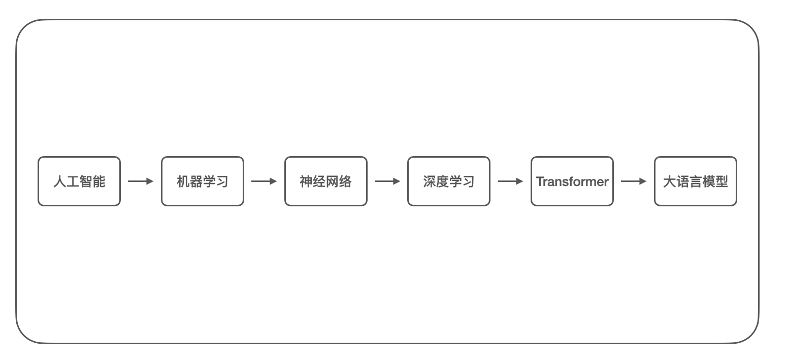
</br>[1.机器学习到大语言模型的技术发展迭代]
</div>

无论是“传统”的软件编程还是机器学习，其目的都是为了让计算机掌握一种能力；对于软件编程而言，通常由技术人员对需求进行分析，再使用编程语言进行实现它，而对于机器学习，同样先由技术人员对需求进行分析，但随后通过选择或开发相应的模型，并使用大量数据进行训练，使模型拟合出了一种能力；两者的流程对比图如下：
<div align="center">
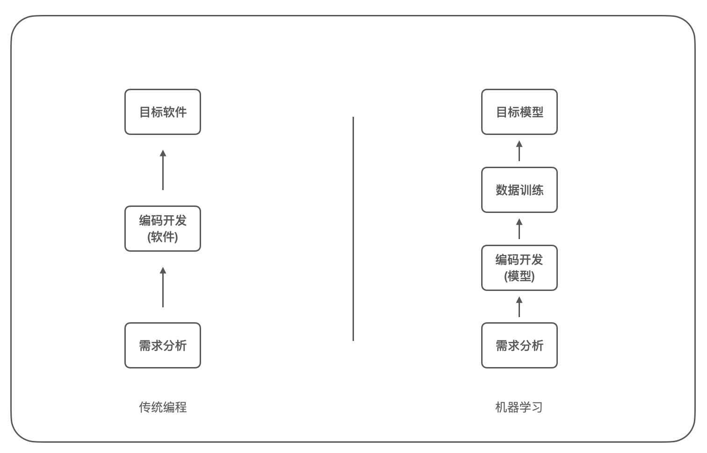
</br>[2.软件编程和机器学习的流程对比]
</div>

对于一些需求场景，软件编程和机器学习都能够良好的完成，但实现的方式完全不同，这意味着前期的投入方向不同，也决定两种方案所能达到的上限不同。

机器学习根据学习方法可以分为四个类型：
* 监督学习：使用带标签的数据训练模型，机器通过学习输入到输出的映射，通常用于回归、分类；
* 无监督学习：使用无标签的数据训练模型，机器自己发现数据中的结构或模式，通常用于聚类；
* 半监督学习：使用少量带标签的训练模型，机器再根据该数据的特征对大量无标签的数据进行标注；
* 强化学习：机器通过和环境进行交互，根据环境的反馈(奖励或惩罚)来调整自己的行为策略，以取得最大化的预期效果，通常用于游戏AI

### 0x02 什么是线性回归
线性回归是统计学中最基础且广泛使用的回归技术之一，它用于估计实际值(因变量)和一个或多个自变量(或预测变量)之间的线性关系；其核心思想是假设因变量 y 与自变量 x 之间存在线性关系，即可以用一条直线(或超平面)来描述它们之间的关系，目标是找到一条最佳拟合直线，使得预测值与真实值之间的误差最小。

我们使用机器学习中最为经典的「房价预测」例子来进行说明，假设有下面的数据，表示某地区房屋面积(平方英尺)和售价(美元/千)的关系：

| 房屋面积(平方英尺) | 售价(美元/千) |
|---------|----------|
| 2104 | 399900 |
| 1600 | 329900 |
| 2400 | 369000 |
| 1416 | 232000 |
| 3000 | 539900 |

使用 `numpy` 和 `matplotlib` 库在二维坐标系中绘制这些数据点：
```
import numpy as np
import matplotlib.pyplot as plt

plt.xlim(0, 3500)
plt.ylim(0, 600)

X = np.array([[2104, 399.900], [1600, 329.900], [2400, 369.000], [1416, 232.000], [3000, 539.900]])
plt.scatter(X[:,0], X[:,1])
plt.xlabel("size in feet2")
plt.ylabel("price in $1000's")

plt.show()
```

在 Jupyter-notebook 中运行如下：
<div align="center">
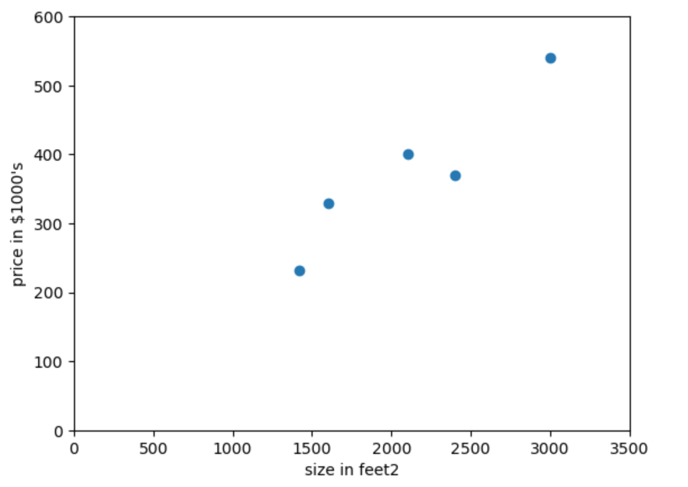
</br>[3.房价预测数据点二维坐标图]
</div>

从上图观察不难发现使用一条直线能够最大程度的拟合这些数据点，由于这里只有一个自变量(即房屋面积)，所以叫做一元线性回归，其函数表示为：
```math
y = ax + b
```

根据一元线性函数，我们可以猜测直线如下：
<div align="center">
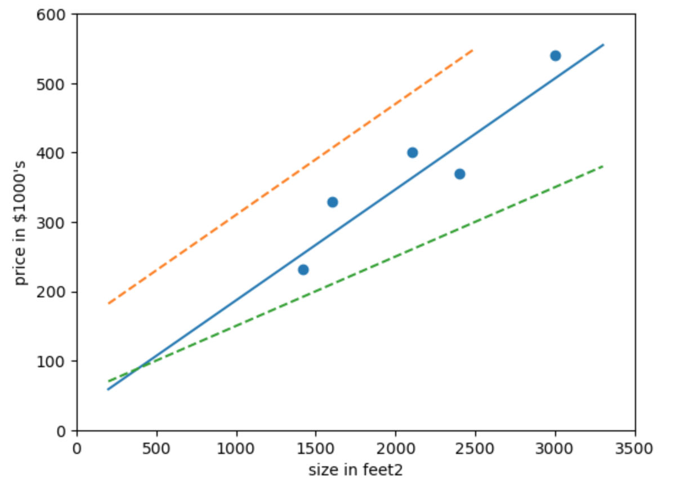
</br>[4.房价预测猜测拟合直线]
</div>

我们可以看到蓝色的直线可以较好的拟合这些数据点，那么如何找出这条蓝色的直线，就是线性回归需要求解的问题。

>另外在监督学习中我们可以简单将数据集分为连续的(如身高、年龄)或离散的(如性别、学历)，连续的数据集通常对应线性回归模型，主要用于预测，而离散的数据集通常对应逻辑(对数)回归模型，主要用于分类；本文中将主要介绍线性回归模型。

### 0x03 一元线性回归模型
在上文的房价预测案例中，数据集中提供了房屋面积(自变量)和价格(因变量)的对应关系，这是一元线性回归问题，其函数表达为：
```math
y = ax + b
```

数据集中提供的每组数据即对应 $x$ 和 $y$ 的值，求解一元线性回归问题就是求解函数中 $a$ 和 $b$ 的取值以最好的方式拟合该数据集。在机器学习中，我们通常称之为一元线性回归模型求解，$a$ 和 $b$ 称之为模型参数，其中更为细致的划分是 $a$ 为权重，常用 $w$ 表示，$b$ 为偏置，常用 $b$ 表示。

求解线性回归模型最直接的数学优化方法是最小二乘法，我们可以观察到使用实际值和预测值之间的误差，可以较好的评估线性回归模型(这里为直线)的拟合情况，如下图所示：
<div align="center">
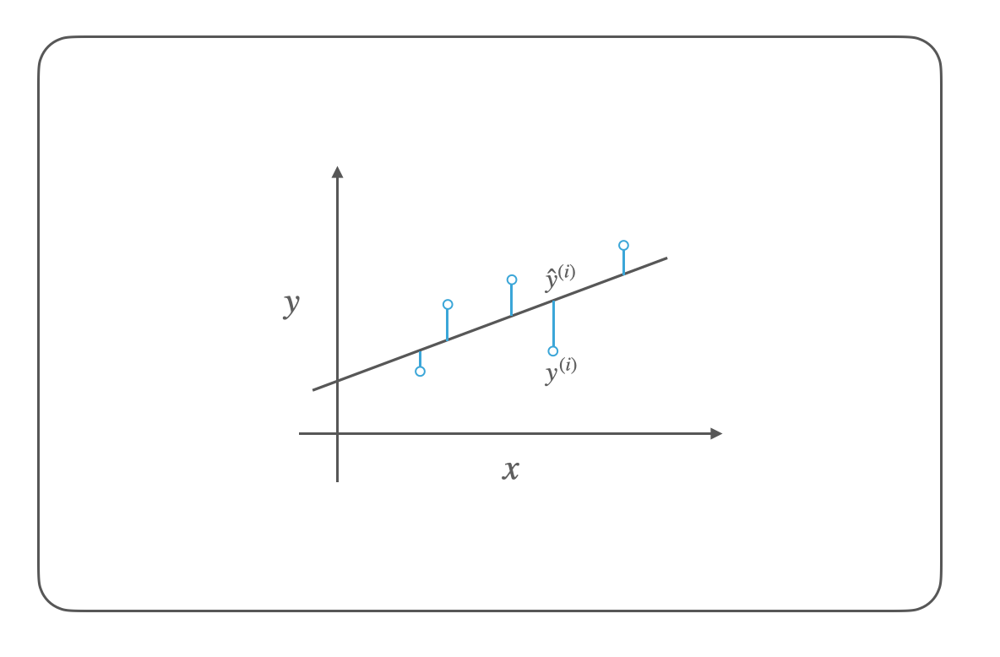
</br>[5.实际值和预测值的误差]
</div>

误差值通常可以使用平方误差 $(y - \hat{y})^2$ 和绝对误差 $|y - \hat{y}|$ 来表示，由于绝对值不便于进行数学运算，通常我们使用平方误差，描述总的误差情况就是误差平方和(Sum of Squared Errors)，在机器学习中我们通常将其称之为损失函数(Loss Function)或代价函数(Cost Function)，其数学表达式为：
```math
loss = (y^{(1)} - \hat{y}^{(1)})^2 + (y^{(2)} - \hat{y}^{(2)})^2 + ... + (y^{(n)} - \hat{y}^{(n)})^2
```

>$y^{(1)}$ 表示数据集第一项的实际值，$\hat{y}^{(2)}$ 表示数据集第二项的预测值。

代价函数通常使用 $J$ 表示，使用 $\sum$ 求和符号优化表达式如下：
```math
J(w, b) = \sum\limits_{i=1}^{n}{\left(y^{(i)}- (f_{w,b}{({x}^{(i)})}\right)^2}
```

其中：
```math
f(w, b) = wx + b
```

那么求解最佳的线性回归模型参数就是求解 $J(w, b)$ 的最小值，我们将 $J(w, b)$ 函数展开并化简可得：
```math

J(w, b) = n\bar{y^2} + w^2n\bar{x^2} + nb^2 + 2wbn\bar{x} - 2wn\bar{xy} - 2bn\bar{y}
```

>其中 $\bar{x}$ 表示 $x$ 的平均值，满足 $n\bar{x} = \sum\limits_{i=1}^{n}{x^{(i)}} = x^{(1)} + x^{(2)} + ... + x^{(n)}$

可以看到代价函数 $J(w, b)$ 是一个二元二次函数，使用导数可以求解函数的极值和最值，同时根据数学推论可以证明该函数是一个凸函数，极小值就是最小值；对于二元函数使用偏导数进行求解，此处令偏导数为 0 即可求解最小值，对 $w$ 和 $b$ 求解偏导数如下：
```math
\left\{
\begin{aligned}
\frac{\partial}{\partial w} J(w, b) &=& 2wn\bar{x^2} + 2bn\bar{x} - 2n\bar{xy} &=& 0 \\
\frac{\partial}{\partial b} J(w, b) &=& 2wn\bar{x} + 2nb - 2n\bar{y} &=& 0 \\
\end{aligned}
\right.
```

求解 $w$ 和 $b$ 两个未知数，将两个方程联合可得：
```math
\left\{
\begin{aligned}
w &=& \frac{\bar{xy} - \bar{x}\bar{y}}{\bar{x^2} - (\bar{x})^2} \\
b &=& \bar{y} - w\bar{x}
\end{aligned}
\right.
```

根据以上方程，可编写代码 [house_price_predict.py](./house_price_predict.py) 如下：
```
import numpy as np

X = np.array([2104, 1600, 2400, 1416, 3000])
Y = np.array([399.900, 329.900, 369.000, 232.000, 539.900])

bar_x = np.sum(X) / X.size
bar_y = np.sum(Y) / Y.size
print("bar_x = {0}".format(bar_x))
print("bar_y = {0}".format(bar_y))

bar_xx = np.sum(np.multiply(X, X)) / X.size
bar_yy = np.sum(np.multiply(Y, Y)) / X.size
bar_xy = np.sum(np.multiply(X, Y)) / X.size
print("bar_xx = {0}".format(bar_xx))
print("bar_yy = {0}".format(bar_yy))
print("bar_xy = {0}".format(bar_xy))

w = (bar_xy - bar_x * bar_y) / (bar_xx - bar_x * bar_x)
b = bar_y - w * bar_x
print("w = {0}".format(w))
print("b = {0}".format(b))
```

运行可以解得 $w$ 和 $b$，如下：
<div align="center">
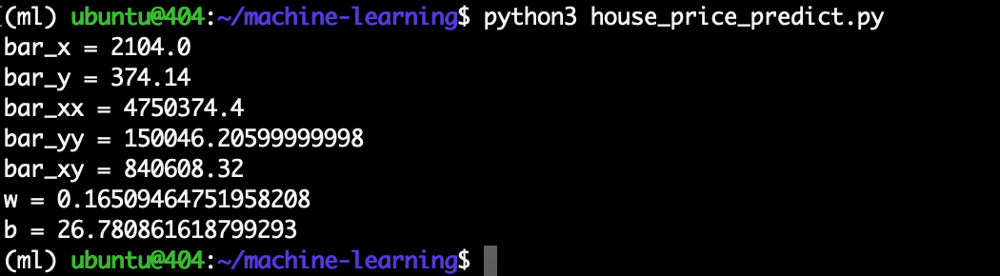
</br>[6.房价预测一元线性回归求解]
</div>

其绘制的图形如下：
<div align="center">
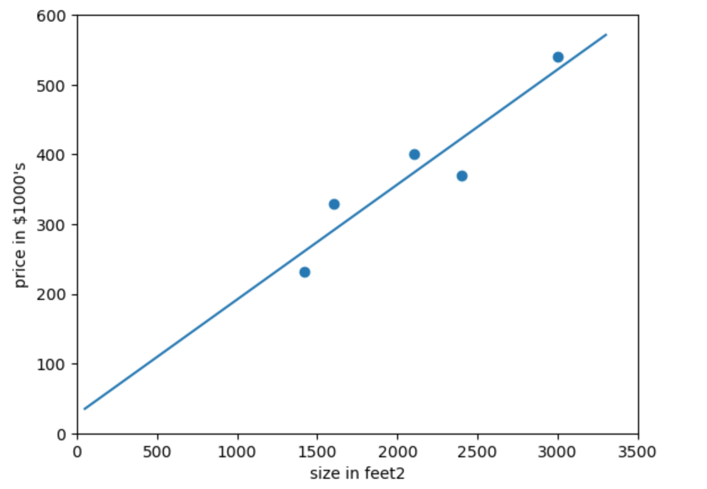
</br>[7.房价预测一元线性回归图形]
</div>

所以我们对于房价预测该数据集所对应的线性回归模型如下：
```math
y = 0.165 * x + 26.781
```

>在机器学习中，使用这种代数求解线性回归模型参数的解析方法被称之为正规方程。

### 0x04 二元线性回归模型
接下来，我们从一元线性回归拓展到二元线性回归，同样使用「房价预测」例子，这里有下面的数据，表示某地区房屋面积(平方英尺)以及卧室数量(个)和售价(美元/千)的关系：

| 房屋面积(平方英尺) | 卧室数量(个) | 售价(美元/千) |
|---------|----------|----------|
| 1985 | 4 | 299900 |
| 1534 | 3 | 314900 |
| 1427 | 3 | 198999 |
| 1380 | 3 | 212000 |
| 1494 | 3 | 242500 |

其中房屋面积和卧室数量是自变量，售价为因变量，可见这是一个二元线性回归问题，很容易想到这些数据点分布于一个三维空间中。

和一元线性回归一样，二元线性回归的函数记为：
```math
y = w_1x_1 + w_2x_2 + b
```

同样按照最小二乘法、使用误差平方和的方式可以列出代价函数如下：
```math
J(w_1,w_2,b) = \sum_{i=1}^{n}\left(y^{(i)} - (w_1x_1^{(i)} + w_2x_2^{(i)} + b)\right)^2
```

将 $J(w_1, w_2, b)$ 函数展开并化简可得：
```math
J(w_1,w_2,b) = \left(w_1^2\bar{x_1^2} + w_2^2\bar{x_2^2} + b^2 + \bar{y^2} + 2w_1w_2\bar{x_1x_2} + 2bw_1\bar{x_1} - 2w_1\bar{x_1y} + 2bw_2\bar{x_2} - 2w_2\bar{x_2y} - 2b\bar{y}\right) * n
```

同样分别对三个参数求偏导数，并令偏导数为 0 如下：
```math   
\left\{
\begin{aligned}
\frac{\partial}{\partial w_1} J(w_1,w_2,b) &=& 2w_1\bar{x_1^2} + 2w_2\bar{x_1x_2} + 2b\bar{x_1} - 2\bar{x_1y} &=& 0 \\
\frac{\partial}{\partial w_2} J(w_1,w_2,b) &=& 2w_2\bar{x_2^2} + 2w_1\bar{x_1x_2} + 2b\bar{x_2} - 2\bar{x_2y} &=& 0 \\
\frac{\partial}{\partial b} J(w_1,w_2,b) &=& 2b + 2w_1\bar{x_1} + 2w_2\bar{x_2} - 2\bar{y} &=& 0 \\
\end{aligned}
\right.
```

将三个方程联合可得：
```math
\left\{
\begin{aligned}
w_1 &=& \frac{(\bar{x_1y}-\bar{x_1}\bar{y})(\bar{x_2^2}-(\bar{x_2})^2) - (\bar{x_2y}-\bar{x_2}\bar{y})(\bar{x_1x_2}-\bar{x_1}\bar{x_2})}{(\bar{x_1^2}-(\bar{x_1})^2)(\bar{x_2^2}-(\bar{x_2})^2) - (\bar{x_1x_2}-\bar{x_1}\bar{x_2})^2} \\
w_2 &=& \frac{(\bar{x_1y}-\bar{x_1}\bar{y})(\bar{x_1x_2}-\bar{x_1}\bar{x_2}) - (\bar{x_2y}-\bar{x_2}\bar{y})(\bar{x_1^2} - (\bar{x_1})^2)}{(\bar{x_1x_2}-\bar{x_1}\bar{x_2})^2 - (\bar{x_2^2}-(\bar{x_2})^2)(\bar{x_1^2}-(\bar{x_1})^2)} \\
b &=& \bar{y} - w_1\bar{x_1} - w_2\bar{x_2} \\
\end{aligned}
\right.
```

根据以上方程，可编写代码 [house_price_predict_two.py](./house_price_predict_two.py) 如下：
```
import numpy as np

X1 = np.array([1985, 1534, 1427, 1380, 1494])
X2 = np.array([4, 3, 3, 3, 3])
Y = np.array([299.900, 314.900, 198.999, 212.000, 242.500])

x1 = np.sum(X1) / X1.size
x2 = np.sum(X2) / X2.size
y = np.sum(Y) / Y.size
print("bar_x1 = {0}".format(x1))
print("bar_x2 = {0}".format(x2))
print("bar_y = {0}".format(y))

x1y = np.sum(np.multiply(X1, Y)) / Y.size
x2y = np.sum(np.multiply(X2, Y)) / Y.size
x1x1 = np.sum(np.multiply(X1, X1)) / Y.size
x1x2 = np.sum(np.multiply(X1, X2)) / Y.size
x2x2 = np.sum(np.multiply(X2, X2)) / Y.size
print("bar_x1y = {0}".format(x1y))
print("bar_x2y = {0}".format(x2y))
print("bar_x1x1 = {0}".format(x1x1))
print("bar_x1x2 = {0}".format(x1x2))
print("bar_x2x2 = {0}".format(x2x2))

w1 = ((x1y-x1*y)*(x2x2-x2**2) - (x2y-x2*y)*(x1x2-x1*x2)) / ((x1x1-x1**2)*(x2x2-x2**2) - (x1x2-x1*x2)**2)
w2 = ((x1y-x1*y)*(x1x2-x1*x2) - (x2y-x2*y)*(x1x1-x1**2)) / ((x1x2-x1*x2)**2 - (x2x2-x2**2)*(x1x1-x1**2))
b = y - w1*x1 - w2*x2
print("w1 = {0}".format(w1))
print("w2 = {0}".format(w2))
print("b = {0}".format(b))
```

运行可以解得 $w_1$、$w_2$、$b$，如下：
<div align="center">
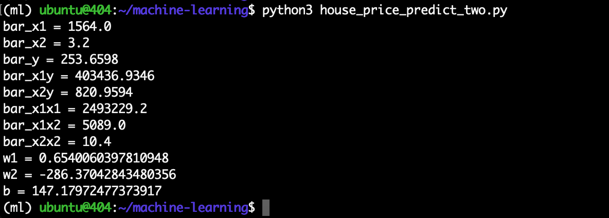
</br>[7.房价预测二元线性回归求解]
</div>

二元线性回归的数据点分布于一个三维空间中，求解的方程实际是一个平面，其绘制的图形如下：
<div align="center">
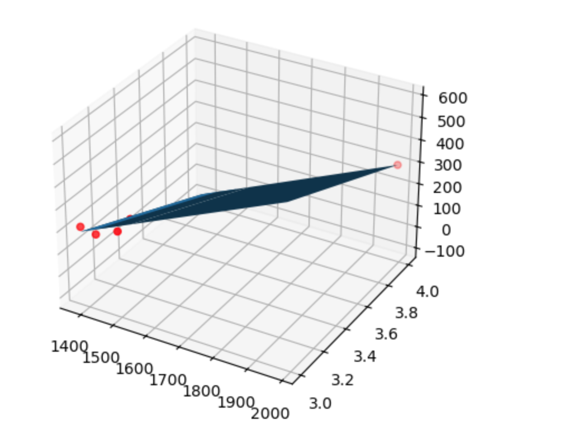
</br>[8.房价预测二元线性回归图形]
</div>

所以我们对于房价预测该数据集所对应的线性回归模型如下：
```math
y = 0.654 * x1 - 286.37 * x2 + 147.180
```

### 0x05 使用矩阵优化运算
在上文二元线性回归模型的示例中，我们可以看到使用代数法求解的过程非常繁琐，参数表达也比较混乱，实际上完美可以使用矩阵来进行优化。

回顾二元线性回归的函数表达如下：
```math
y = a_1x_1 + a_2x_2 + b
```

$a$ 我们可以视为一个行矩阵，$x$ 也可以视为一个行矩阵，$b$ 视为 $a0 * x0 (且x0=1)$，如下
```math
\textbf{a} = [a0, a1, a2] \\
\textbf{x} = [1, x1, x2]
```

那么将函数转换为矩阵则表示如下：
```math
y =
\left[ 
\begin{array}{ccc}
a_0 \\
a_1 \\
a_2 \\
\end{array} 
\right ]
\left[ 
\begin{array}{ccc}
1 & x_1 & x_2
\end{array} 
\right ]
= \textbf{a}^{T}\textbf{x}
= \textbf{x}^{T}\textbf{a}
```

上面只是对一组样本数据的表示，那么有 5 组数据的矩阵形式表示如下：
```math
\begin{aligned}{
\left[ 
\begin{array}{ccc}
y_1 \\
y_2 \\
... \\
y_5
\end{array} 
\right ]
=
\left[ 
\begin{array}{ccc}
1 & x_{11} & ... & x_{15} \\
1 & x_{21} & ... & x_{25} \\
... & ... & ... & ... \\
1 & x_{51} & ... & x_{55}
\end{array} 
\right ]
\left[ 
\begin{array}{ccc}
a_0 \\
a_1 \\
... \\
a_5 
\end{array} 
\right ]
}\end{aligned}
```

分别用 $y$、$a$、$\textrm{X}$ 代表上面的矩阵，上式可以简写成：
```math
\textbf{{y}} = \textrm{X}\textbf{a}
```

代价函数同样使用误差平方和，使用矩阵化简如下：
```math
\begin{aligned}
J &= \sum_{i=0}^{n}(y_i - \hat{y_i})^2 \\
&= (\bf{y}-\rm{X}\bf{a})^T (\bf{y}-\rm{X}\bf{a})
\end{aligned}
```

求解代价函数的最小值，这里使用矩阵求导，并令导数为 0 如下：
```math
\frac{\partial J}{\partial \textbf{a}} = 2\textrm{X}^TX\textbf{a} - 2\textrm{X}^T\bf{y} = 0
```

可以解得 $\textrm{a}$ 如下：
```math
\textbf{a} = (\textrm{X}^T\textrm{X})^{-1}\textrm{X}^T\textbf{y}
```

我们使用矩阵的方式再一次求解房价预测二元线性回归的问题，编写代码 [house_price_predict_matrix.py](./house_price_predict_matrix.py)如下：
```
import numpy as np

X = np.matrix([
    [1, 1, 1, 1, 1], 
    [1985, 1534, 1427, 1380, 1494], 
    [4, 3, 3, 3, 3]]).T
Y = np.matrix([299.900, 314.900, 198.999, 212.000, 242.500]).T

a = (X.T * X).I * X.T * Y
print("a = {0}".format(a))
```

可以看到使用矩阵优化后的代码相当简洁，使用矩阵的方式我们可以很容易拓展到多元线性回归模型。

>无论是代数求解还是矩阵求解都属于解析法，即正规方程。

### 0x06 梯度下降法
在上文中我们使用正规方程的方法来求解线性回归模型问题，函数表达式如下：
```math
\textbf{a} = (\textrm{X}^T\textrm{X})^{-1}\textrm{X}^T\textbf{y}
```

正规方程的方法虽然简单容易理解，符合数学运算思维，但在实际场景下却有很大的局限性：
1. 正规方程通过求导数计算极值点，但有些函数的导数不存在解析解；
2. 正规方程的计算过程中要求 $\textrm{X}^T\textrm{X}$ 必须可逆；
3. 正规方程的时间复杂度为 $O(n^3)$，n 为矩阵维度即特征个数，当特征数量过大将出现性能问题；

因此我们要学习一种新的方法，梯度下降(Gradient Descent)，它比正规方程更具有广泛性，可以用于很多复杂算法的求解。

要聊梯度则要先从导数开始，导数是指一元函数在某一点的变化率，表示函数值随自变量变化的快慢，导数的公式如下：
```math
f'(x) = \lim\limits_{\Delta x \to 0}\frac{\Delta y}{\Delta x}
      = \lim\limits_{\Delta x \to 0}\frac{f(x_0 + \Delta x) - f(x_0)}{\Delta x}
```

以 $f(x) = x^2$ 函数为例，我们可以计算其导数如下：
```math
f'(x) = 2x
```

该函数及其导数在坐标系中绘制如下：
<div align="center">
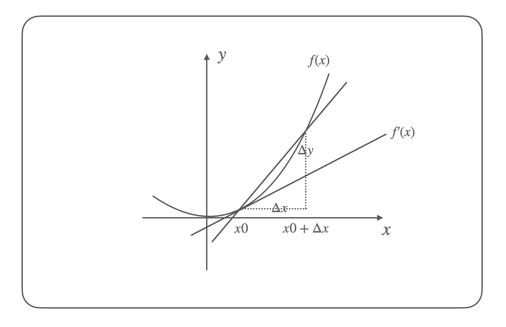
</br>[9.f(x)函数及导数图形示意图]
</div>

从一元函数拓展到多元函数下，就需要从导数拓展到偏导数，偏导数是指多元函数沿坐标轴的变化率；多元函数对应了有多个偏导数，其表示在不同坐标轴的变化率，那么联合多个偏导数就可以表示在任意方向的变化率，即方向导数(Directional Derivative)；而梯度(Gradient)则表示在某点的所有方向导数中，变化趋势最大的那个方向(向量)。

>梯度是导数的推广，导数是梯度的特例。

根据梯度的数学定义，对于多元函数 $f(x_1,x_2,...,x_n)$，其梯度是一个向量，由函数对所有自变量的偏导数组成。数学表示为：
```math
grad f = \nabla f = \left(\frac{\partial f}{\partial x_1},\frac{\partial f}{\partial x_2},...,\frac{\partial f}{\partial x_n}\right)
```

以 $f(x, y) = x^2 + y^2$ 二元函数为例，其梯度为：
```math
\nabla f = \left(\frac{\partial f}{\partial x},\frac{\partial f}{\partial y}\right) = (2x, 2y)
```

该函数在点 $(1, 2)$ 处，梯度为：
```math
\nabla f(1, 2) = (2 \cdot 1, 2 \cdot 2) = (2, 4)
```

梯度下降算法指的就是使用梯度下降的方法寻找函数的最小值，其核心思想是通过迭代的方式，沿着函数梯度下降最快的方向调整参数，当到达新的位置后，同样再以当前位置梯度下降最快的方向调整参数，通过这样不断的迭代，直到函数收敛到最小值。

在吴恩达老师《机器学习》课程的梯度下降章节生动描述了梯度下降的过程，如下：
<div align="center">
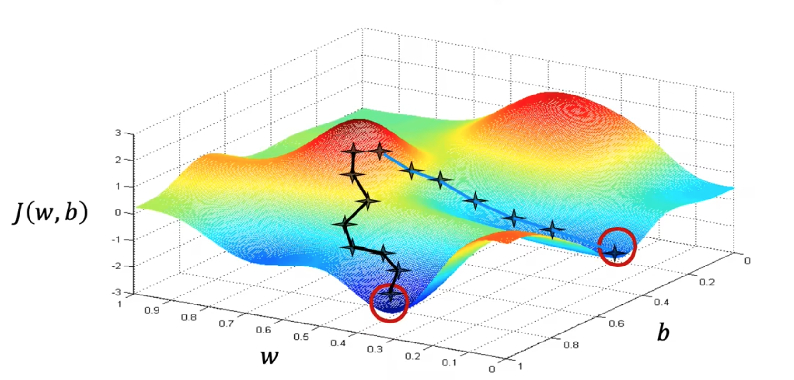
</br>[10.《机器学习》课程的梯度下降图示]
</div>

>从图中我们还可以看到，使用梯度下降算法的结果可能只是一个局部最小值，而不是全局最小值；这些缺点将由其他的改进算法进行解决。

在了解梯度下降法后，我们可以列出梯度下降更新参数的方程式，选取一个初始点 $\theta_0$，然后沿着梯度方向对初始值进行更新得到：
```math
\theta_1 = \theta_0 - \eta \nabla f(\theta)
```

其中 $\nabla f(\theta)$ 表示在 $\theta_0$ 点的梯度，$\eta$ 是一个待确定的常数，表示更新参数的步长，通常也称为学习率(learning rate)；获得 $\theta_1$ 再以同样的方式更新获得 $\theta_2$，不断迭代下去直到代价函数的值不再有显著变化，最终得到 $\theta_k$ 就是我们求解的参数值，它使代函数达到最小。

以一元二次函数 $f(\theta) = \theta^2$ 函数为例，我们知道该函数是抛物线函数，其在 $\theta=0$ 时拥有最小值 $f(\theta)=0$；该函数的梯度(导数)为 $\nabla f(\theta)= 2\theta$，我们选取初始点 $\theta_0=1$，学习率 $\eta=0.4$，使用梯度下降求解可得：
```math
\begin{align}
\theta_0 &= 1 \\
\theta_1 &= \theta_0 - \eta \nabla J(\theta_0) = 1 - 0.4 * (2*1) = 0.2 \\
\theta_2 &= \theta_1 - \eta \nabla J(\theta_1) = 0.2 - 0.4 * (2*0.2) = 0.04 \\
\theta_3 &= 0.008 \\
\theta_4 &= 0.0016 \\
\end{align}
```

可以看到通过 4 次迭代，此时 $\theta_4 = 0.0016$，$f(\theta) = 0.00000256$，基本上已经到达函数的最低点了。

### 0x07 梯度下降法求解
回顾「房价预测」一元线性回归的例子，我们现在使用梯度下降法来进行求解，首先列出我们的代价函数，这里我们使用均方误差(Mean Squared Error)方法(即误差平方和的平均值)，同时我们将代价函数除以 2 以方便后续求导(除以常数不改变函数的最值关系)，如下：
```math
J(a, b) = \frac{1}{2m} \sum_{i=1}^{m}(y_i - (ax_i + b))^2
```

>在梯度下降中使用均方误差(MSE)而不是误差平方和(SSE)作为成本函数，主要有两点原因：
>1. 使用均方误差能够避免参数更新时的一致性问题；误差平方和随着样本数 n 增大而增大，从而影响梯度更新的值不一致，均方误差通过除以样本数量 n，从而避免了因样本数不同而导致的偏差；
>2. 使用均方误差能够使梯度下降的收敛过程更加稳定；误差平方和在样本数量 n 很大时，会导致梯度过大从而使参数更新过大，导致不稳定的收敛过程；

对代价函数求梯度，也就是分别对 $a$ 和 $b$ 求偏导如下：
```math
\begin{aligned}
\frac{\partial J(a, b)}{\partial a} &= \frac{1}{m} \sum_{i=1}^{m}(y_i - (ax_i + b))x_i \\
\frac{\partial J(a, b)}{\partial b} &= \frac{1}{m} \sum_{i=1}^{m}(y_i - (ax_i + b)) \\
\end{aligned}
```

将其代入梯度下降更新参数的方程式，如下：
```math
\begin{align}
a &:= a - \eta \frac{1}{m} \sum_{i=1}^{m}((ax_i + b) - y_i)x_i \\
b &:= b - \eta \frac{1}{m} \sum_{i=1}^{m}((ax_i + b) - y_i) \\
\end{align}
```

在编写代码求解之前，我们还需要介绍下机器学习中的特征缩放，特征缩放(Feature Scaling)是数据预处理中的一种技术，用于将不同特征的数值范围调整到相同的尺度，包括标准化和归一化。

我们可以思考对于二元线性函数 $y = w_1*x_1 + w_2*x_2 + b$，假设特征 $x_1$ 的取值范围为 100-1000，$x_2$ 的取值范围为 1-10，在两个参数使用相同的学习率情况下，明显 $w_1$ 对代价函数 $J$ 的影响更大，梯度下降将在 $x_1$ 方向上更新过快，而在 $x_2$ 方向上更新过慢，导致收敛困难。

我们这里仅介绍最常见的最大最小值归一化(min-max normalization)，该方法将数值范围缩放到 [0, 1] 区间里，公式如下：
```math
x' = \frac{x-min(x)}{max(x)-min(x)}
```

使用最大最小值归一化对房价预测的数据进行特征缩放如下：

| 房屋面积(平方英尺) | 售价(美元/千) |
|---------|----------|
| 2104 => 0.434 | 399900 => 0.545 |
| 1600 => 0.116 | 329900 => 0.318 |
| 2400 => 0.621 | 369000 => 0.445 |
| 1416 => 0.000 | 232000 => 0.000 |
| 3000 => 1.000 | 539900 => 1.000 |

随后我们编写梯度下降法求解的代码 [house_price_predict_gd.py](./house_price_predict_gd.py) 如下：
```
import numpy as np

#X = np.array([2104, 1600, 2400, 1416, 3000])
#Y = np.array([3999.00, 3299.00, 3690.00, 2320.00, 5399.00])
X = np.array([0.434, 0.116, 0.621, 0.000, 1.000])
Y = np.array([0.545, 0.318, 0.445, 0.000, 1.000])

def cost(X, Y, a, b):
    s = 0
    for i in range(X.size):
        s += (Y[i] - (a*X[i] + b))**2
    return s * (1./2*Y.size)

def update_a(X, Y, a, b, eta):
    s = 0
    for i in range(X.size):
        s += ((a*X[i] + b)-Y[i])*X[i]
    return a - eta * s * (1./Y.size)

def update_b(X, Y, a, b, eta):
    s = 0
    for i in range(X.size):
        s += ((a*X[i] + b)-Y[i])
    return b - eta * s * (1./Y.size)

a = 0
b = 0
eta = 0.01

for i in range(10):
#for i in range(1000):
    a_new = update_a(X, Y, a, b, eta)
    b_new = update_b(X, Y, a, b, eta)
    cost_new = cost(X, Y, a_new, b_new)
    diff = abs(cost(X, Y, a, b) - cost(X, Y, a_new, b_new))
    print("a = {0}, b = {1}, cost = {2}, diff = {3}".format(a_new, b_new, cost_new, diff))
    a = a_new
    b = b_new
```

迭代 10 次运行如下：
<div align="center">
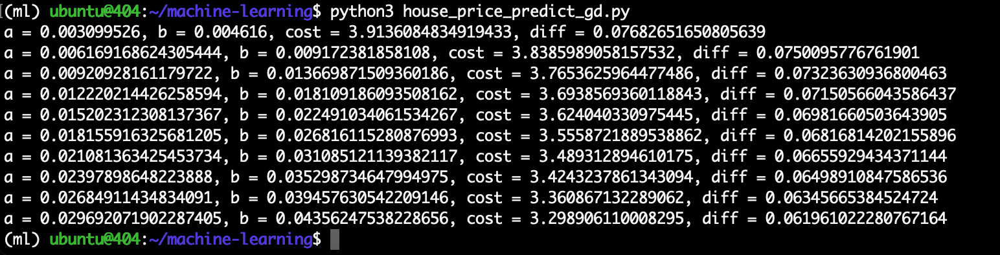
</br>[11.梯度下降法求解一元线性回归]
</div>

迭代 1000 次可以发现 `diff` 已经非常小了，说明此时已经达到收敛，比较 10/1000 次迭代的线性回归模型图形如下：
<div align="center">
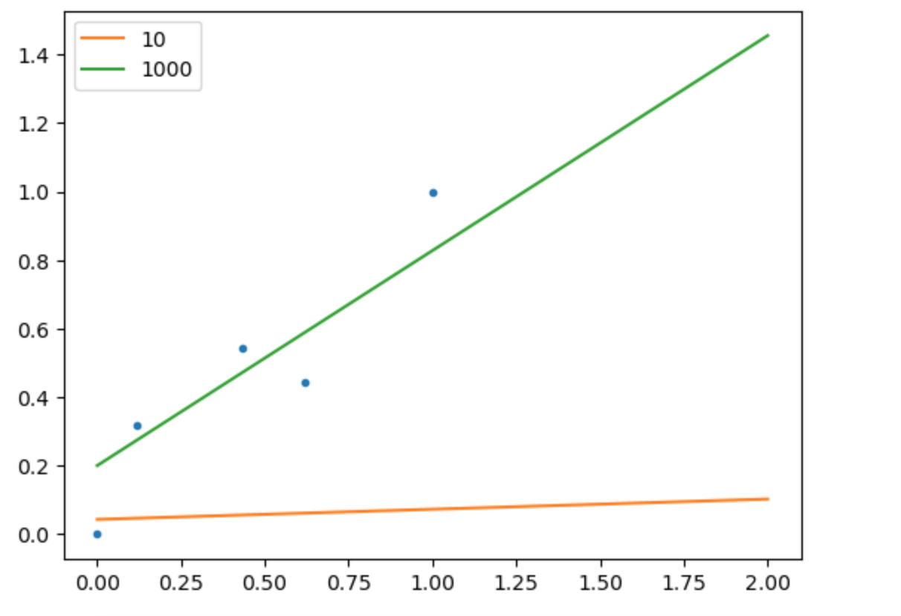
</br>[12.梯度下降比较不同迭代次数的收敛情况]
</div>

### 0x08 梯度下降矩阵求解
在求解多元线性回归的问题下，梯度下降和正规方程一样也可以使用矩阵优化表示并提高计算效率；梯度下降的代价函数使用均方误差，那么使用矩阵表示如下：
```math
J(\theta) = \frac{1}{2m} \sum_{i=1}^{m}(y^{(i)} - \theta^Tx^{(i)})^2
```

对代价函数求导，并代入梯度下降更新参数的方程式可得：
```math
\theta := \theta - \eta \frac{1}{m} X^T(\rm{X}\theta-\bf{y})
```

同样按方程式编写矩阵方式的梯度下降代码 [house_price_predict_gd_matrix.py ](./house_price_predict_gd_matrix.py) 如下：
```
import numpy as np

X0 = np.ones((5, 1))
X1 = np.array([0.434, 0.116, 0.621, 0.000, 1.000]).reshape(-1, 1)
X = np.hstack((X0, X1))
y = np.array([0.545, 0.318, 0.445, 0.000, 1.000]).reshape(-1, 1)

def gradient_descent(X, y, eta, theta, max_iter):
    for i in range(max_iter):
        diff = np.dot(X, theta) - y
        cost = (1./2*y.size) * np.sum(diff ** 2)

        gradient = (1./y.size) * np.dot(np.transpose(X), diff)
        theta = theta - eta * gradient

        print("theta: {0} {1}, cost: {2}".format(theta[0,0], theta[1,0], cost))
    return theta

theta_init = np.array([0, 0]).reshape(-1, 1)
eta = 0.01
max_iter = 1000

gradient_descent(X, y, eta, theta_init, max_iter)
```

其中自变量 $\textrm{X}$ 矩阵维度为 (5, 2)，第一列为偏置(全为 1)，参数 $\theta$ 矩阵维度为 (2, 1)，即第一行表示 $b$ 参数，第二行表示 $w$ 参数，运行求解获得线性回归模型如下：
```math
y = 0.625 * x + 0.202
```

### 0x09 References
Machine Learning Specialization: https://www.coursera.org/specializations/machine-learning-introduction  
Supervised Machine Learning: Regression and Classification: https://www.coursera.org/learn/machine-learning  
(强推|双字)最新吴恩达机器学习Deeplearning.ai课程: https://www.bilibili.com/video/BV1Pa411X76s/  
吴恩达机器学习课程练习:https://github.com/fengdu78/Coursera-ML-AndrewNg-Notes  
aneasystone机器学习笔记: https://github.com/aneasystone/ml-notes  
房价预测数据集: https://github.com/fengdu78/Coursera-ML-AndrewNg-Notes/blob/master/code/ex1-linear%20regression/ex1data2.txt  
机器学习入门(二) -- 什么是机器学习: https://waltyou.github.io/What-is-Machine-Learning/  
机器学习入门(三) -- 线性回归: https://waltyou.github.io/Linear-Regression/  
机器学习笔记一之机器学习定义、导数、最小二乘: https://www.devtalking.com/articles/machine-learning-1/  
机器学习中的凸优化问题: https://mopheiok.github.io/machinelearning/convex_optimization_machine_learning/  
Machine Learning--线性回归(实例):https://www.cnblogs.com/sinlearn/p/12683168.html  
从零开始，用Python徒手写线性回归: https://www.jiqizhixin.com/articles/2021-01-23-3  
线性回归分析-矩阵版: https://jasonxqh.github.io/2021/11/01/%E7%BA%BF%E6%80%A7%E5%9B%9E%E5%BD%92%E5%88%86%E6%9E%90-%E7%9F%A9%E9%98%B5%E7%89%88/  
线性回归的求解: https://lulaoshi.info/deep-learning/linear-model/minimise-loss-function.html  
gradient descent using python and numpy: https://stackoverflow.com/questions/17784587/gradient-descent-using-python-and-numpy