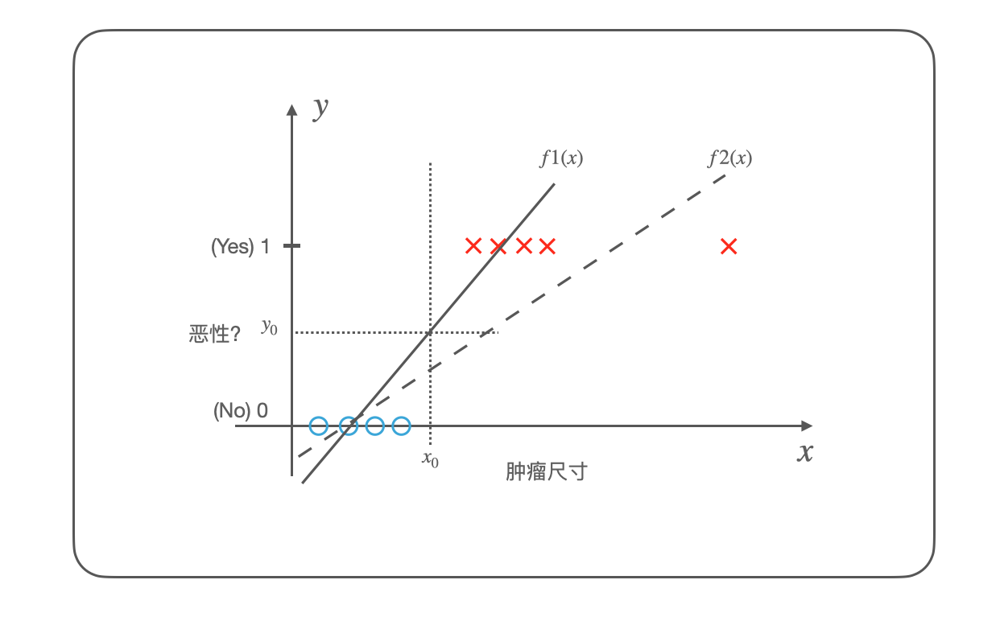
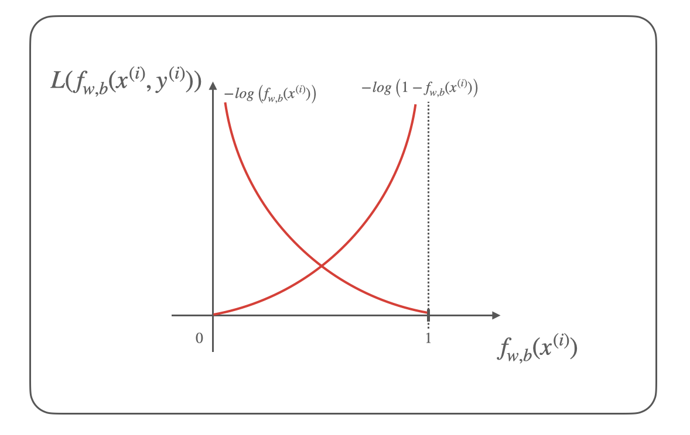

## 机器学习的逻辑回归模型

<!--
Tags: 机器学习,LLM  
Time: 2025.02.26

-->


### 0x00 前言

在「机器学习的线性回归模型」文章中，我们学习了监督学习中如何使用线性回归模型拟合连续的数据集，而本文将要学习监督学习的另一大场景：分类，用于拟合离散的数据集。

同样推荐吴恩达老师在 Coursera 平台(https://www.coursera.org/)推出的《机器学习》在线课程(https://www.coursera.org/learn/machine-learning)；
本文将以该课程内容为主体大纲，从线性回归模型拓展到逻辑回归模型，并学习逻辑回归模型的实现，以个人的理解梳理知识框架，作为学习笔记。

本文实验环境：
```
Ubuntu 22.04
Anaconda
Jupyter-notebook
```

### 0x01 机器学习三要素
在「机器学习的线性回归模型」一文的实践过程中，我们可以看到构建机器学习系统的过程主要包含以下三要素：
1. 模型：针对实际的数据集，利用先验知识假设输入数据和输出数据的内在规律和映射关系，如一元线性回归、多元线性回归、逻辑回归等；
2. 策略：根据模型定义一个损失函数来衡量模型的性能，描述预测值与理论值之间的差距，将其转化为最小化损失函数值的优化问题，如均方误差等；
3. 算法：针对求解损失函数最小值问题的具体数学方法和代码实现，如正规方程、梯度下降法等；

以经典案例房价预测为例，现有「房屋面积」和「价格」的关系数据集，我们可以假设该数据符合一元线性回归模型，针对一元线性回归模型，我们可以使用均方误差作为策略构建代价函数，随后我们使用梯度下降优化算法，求解代价函数在最小值时的参数值。

本文中，我们将按照模型、策略、算法三要素学习和构建逻辑回归模型。

### 0x01 什么是逻辑回归
假设我们现在有以下一组离散数据，表示某医疗诊断中关于肿瘤大小以及良性恶性的判断数据集：
<div align="center">

</br>[1.某医疗诊断肿瘤判断数据集示意图]
</div>

如上图所示我们仍可以选择使用一元线性回归模型 $y = wx + b$ 来进行拟合，对于正常数据样本，我们使用 $f1(x)$ 可以较好的拟合，我们在 $f1(x)$ 函数上选择合适的 $y_0$ 值作为分类标准；但是当我们遇到异常数据样本时，线性回归模型将如 $f2(x)$ 一样去拟合异常数据，此时再以 $y_0$ 值作为分类标准就会产生错误。

可见使用线性回归模型直接拟合这些离散的数据并不是一个好的选择，我们可以考虑将该线性回归模型的结果(即预测值)转化为 `1/0` 两个值，最简单的方式是再套一层单位阶跃函数(unit step function)表示如下：
```math
z = 
\begin{cases}
1,\quad f(x) \geq y_0 \\ 
0,\quad f(x) < y_0
\end{cases}
```

但是由于单位阶跃函数不连续、不可微，导致我们无法求解最佳的 $w$ 和 $b$ 的参数值，数据科学家们提出了一种 sigmoid 函数如下：
```math
y = \frac{1}{1 + e^{-x}}
```

使用 sigmoid 函数替换上述的单位阶跃函数可得：
```math
\begin{aligned}
z &= \frac{1}{1 + e^{-f(x)}} \\
&= \frac{1}{1 + e^{-(wx+b))}}
\end{aligned}
```

这种 sigmoid 函数又称之为对数概率函数(log-odds function) 或逻辑函数(logistic function)，绘制图形如下：
<div align="center">

</br>[2.对数几率函数坐标系图形]
</div>

可以看到对数概率函数的定义域为 $(-\infty, +\infty)$，值域为 $(0, 1)$，函数任意阶可导，两端可以良好的将异常值趋向 0 或 1；由于对数概率函数的结果是 $(0, 1)$ 连续的值，符合伯努利分布的期望，我们可以将其理解为预测为正例的概率值，在通常情况下我们选择 $y=0.5$ 作为阈值进行划分正例和反例。

### 0x02 决策边界
我们再来看看「医疗肿瘤诊断」这个数据集，输入变量只有一个，所以这是一个一元分类问题，输出结果只有 `0/1`，所以也可以称为二分类问题，从 图1 中还可以很容易发现 $x_0$ 的位置可以较好的对该目标进行分类，即：
```math
y = 
\begin{cases}
1,\quad x \geq x_0 \\ 
0,\quad x < x_0
\end{cases}
```

只按自变量($x$)绘图如下：
<div align="center">

</br>[3.一元分类问题的决策边界]
</div>

在机器学习中 $x_0$ 被称为决策边界(decision boundary)，一元分类问题的决策边界就是一个点或一条垂直于 $x$ 轴的直线($x = x_0$)。

如果是二元分类问题呢？可以假设我们现在有两个自变量 $x_1$ 和 $x_2$，其离散数据点分布如下：
<div align="center">

</br>[4.二元分类问题的线性决策边界]
</div>

可以看到对于该数据集的二元分类问题，决策边界是一条直线 $f(x_1, x_2)=x_1 + x_2 - 3 = 0$；所以求解分类问题，实际上就是在求解这个线性回归问题，这个线性回归方程对应的就是最佳决策边界，但由于这个线性回归方程无法直接和输出建立联系，则我们可以使用 sigmoid 来建立这个联系：
```math
y = \frac{1}{1 + e^{-x}}
```

>从决策边界的角度理解逻辑回归是一种直观且有效的方式。

当然还有许多非线性的二元分类问题，比如以下数据集：
<div align="center">

</br>[5.二元分类问题的非线性决策边界]
</div>

该决策边界为 $f(x_1, x_2) = x_1^2 + x_2^2 - 1 = 0$，是一个非线性回归方程，对于这类问题通常可以使用特征工程、核函数等方式将其转化为线性回归问题，或使用决策树、多层感知机等其他算法求解。

从定义上来看，标准的逻辑回归只能生成线性决策边界，所以逻辑回归是广义线性回归问题，本文就此进行讨论。

### 0x03 成本函数
让我们回到一元分类问题，现在我们已经找到了一个良好的逻辑回归模型即：
```math
\begin{aligned}
y &= \frac{1}{1 + e^{-z}} \\
z &= wx + b
\end{aligned}
```

随后我们要为这个逻辑回归模型寻找一个合适的损失函数($loss$)，这里我们不能再使用均方误差(MSE)，因为该逻辑回归模型使用均方误差的代价函数($J$)是一个非凸函数，无法直观的求解最小值，吴恩达老师的《机器学习》课程的图解如下：
<div align="center">

</br>[6.线性和逻辑回归均方误差的比较]
</div>

>通常损失函数($loss$)定义在单个样本上，算的是一个样本的误差；代价函数($J$)定义在整个训练集上，是所有样本误差的平均。

为此我们要找到一个新的损失函数($loss$)来衡量模型的性能；在逻辑回归模型中引入 sigmoid 函数后，我们将二分类问题转了概率问题，因此损失函数可以有以下等式：
```math
L(f_{w,b}(x^{(i)}, y^{(i)})) = 
\left\{
\begin{aligned}
-log\left(f_{w,b}(x^{(i)})\right) \quad if\ y^{(i)} = 1 \\
-log\left(1 - f_{w,b}(x^{(i)})\right) \quad if\ y^{(i)} = 0 \\
\end{aligned}
\right.
```

>注意此处 $f_{w,b}(x)= \frac{1}{1 + e^{-(wx+b))}}$ (即 sigmoid 函数)，损失函数 $L$ 也就是对该函数的值(概率$p$)再进行 $log$ 运算。

由以上等式可得，如果给定样本为正例($y=1$)，则预测的概率 $p$ 值越大，损失函数越小，表示预测越准确，反之如果给定样本为返例($y=0$)，则预测的概率 $p$ 值越小，损失函数越小，表示预测越准确。

根据等式可以在坐标系中画出函数示意图如下：
<div align="center">

</br>[7.逻辑回归损失函数示意图]
</div>

>$f_{w,b}(x)$ 函数即 sigmoid 函数，值域为 $(0, 1)$。

该损失函数看似是两个不同的函数，但可以通过数学技巧将其简化为一个函数，如下：
```math
L(f_{w,b}(x^{(i)}, y^{(i)})) = -y^{(i)}log\left(f_{w,b}(x^{(i)})\right) - (1 - y^{(i)})log\left(1 - f_{w,b}(x^{(i)})\right)
```

因此推出代价函数 $J(w,b)$ 如下：
```math
J(w,b) = -\frac{1}{m}\sum_{i=0}^{m}{\left[y^{(i)}log\left(f_{w,b}(x^{(i)})\right) + (1 - y^{(i)})log\left(1 - f_{w,b}(x^{(i)})\right)\right]}
```

>参考均方误差，除以 $m$ 获得平均误差大小使得梯度下降时更为稳定。

### 0x04 最大似然估计
以上损失函数的由来比较理想化，实际上这是由数据科学家通过最大似然估计(Maximum Likelihood Estimation)方法推导而来的，这里我们跟随其推导过程以加深我们对逻辑回归模型损失函数的理解。

根据 sigmoid 逻辑回归模型：
```math
y = \frac{1}{1 + e^{-(wx+b))}}
```

可以求出其反函数如下，可以看到这是一个自变量 $x$ 和因变量 $ln \frac{y}{1-y}$ 的线性关系函数：
```math
ln \frac{y}{1-y} = wx+b
```

其中我们可以将 $y$ 视为样本 $x$ 为正例的可能性，则 $1-y$ 是样本 $x$ 为反例的可能性，$\frac{y}{1-y}$ 两者的比值称之为几率(odds)，反映了 $x$ 作为正例的相对可能性，再对几率取对数得 $ln \frac{y}{1-y}$，即对数几率，该模型也称之为对数几率模型。

随后我们可以将 $y$ 改写为条件概率的形式 $P(y=1|x)$，表示当 $x$ 发生时 $y=1$ 的概率，这个概率也被称为后验概率，所以有：
```math
ln \frac{P(y=1|x)}{P(y=0|x)} = wx+b
```

将 $P(y=0|x) = 1 - P(y=1|x)$ 代入以上等式，把分类问题改写成两个条件概率形式如下：
```math
\begin{aligned}
p(y = 1 | x) = \frac{e^{wx+b}}{1+e^{wx+b}} \\
p(y = 0 | x) = \frac{1}{1+e^{wx+b}}
\end{aligned}
```

在这里对于概率问题我们可以采用最大似然估计的方法推导损失函数，最大似然估计是被广泛使用的一种参数估计方法，通俗理解来说，就是利用已知的样本结果信息，反推最具有可能(最大概率)导致这些样本结果出现的模型参数值，那么对于对数几率模型，最大似然估计方程可以写作：
```math
\mathop{\arg \max}_{w,b} \prod_{i=1}^m p(y_i | x_i; w,b)
```

由于这里的连乘结果很可能导致下溢，通常使用对数似然(log-likelihood)来代替，这样就可以将连乘转换成连加：
```math
\mathop{\arg \max}_{w,b} \sum_{i=1}^n \ln p(y_i | x_i; w,b)
```

这里 $p(y|x)$ 只包含 $y=1$ 和 $y=0$ 两种情况，可以使用数学技巧合并为一个表达式：
```math
p(y|x) = p(y=1|x)^y p(y=0|x)^{(1-y)}
```

继续推导简化求得 $p(y|x)$ 的对数如下：
```math
\ln p(y|x) = y \ln p(y=1|x) + (1-y) \ln p(y=0|x)
```

>实际上该等式就等于上文的 $-L(f_{w,b}(x^{(i)}, y^{(i)}))$，该损失函数称之为交叉熵损失函数(Cross Entropy Loss Function)。

将 $P(y=0|x) = 1 - P(y=1|x)$ 代入该等式，可得：
```math
\ln p(y|x) = y(wx+b) - \ln (1+e^{wx+b})
```

此处我们求得的是概率的最大值，添加负号就是损失函数的最小值，所以推出代价函数 $J$ 可得：
```math
J(w,b) = \frac{1}{m}\sum_{i=1}^m [\ln (1+e^{wx_i+b}) - y_i(wx_i+b)] \\
```

>同样除以 $m$ 获得平均误差大小使得梯度下降时更为稳定。

### 0x05 梯度下降法求解
在推出逻辑回归模型的损失函数后，我们就可以进行求解了；由于逻辑回归模型的损失函数是一个非线性函数，所以无法通过代数方法直接求解，这里我们使用梯度下降法进行求解。

按损失函数 $J(w,b)$ 对 $w$ 和 $b$ 求偏导数，通过链式求导可得：
```math
\begin{aligned}
\frac{\partial J}{\partial w} &= \sum_{i=1}^m (\frac{e^{wx_i+b}}{1+e^{wx_i+b}} -y_i)x_i \\
\frac{\partial J}{\partial b} &= \sum_{i=1}^m (\frac{e^{wx_i+b}}{1+e^{wx_i+b}} -y_i)
\end{aligned}
```

>如果使用 $z(x)$ 替换 $\frac{e^{wx_i+b}}{1+e^{wx_i+b}}$ 的话，该表达式的形状就和线性回归的偏导数一样。

将其带入梯度下降等式可得：
```math
\begin{aligned}
w &:= w - \eta \frac{\partial J}{\partial w} = w - \eta \sum_{i=1}^m (\frac{e^{wx_i+b}}{1+e^{wx_i+b}} - y_i)x_i \\
b &:= b - \eta \frac{\partial J}{\partial b} = b - \eta \sum_{i=1}^m (\frac{e^{wx_i+b}}{1+e^{wx_i+b}} - y_i)
\end{aligned}
```

现有某医疗诊断中关于肿瘤大小以及良性恶性的判断数据集如下：
| 肿瘤尺寸(mm) | 是否恶性 |
|------------|---------|
| 35mm | 是 |
| 27mm | 是 |
| 10mm | 否 |
| 15mm | 否 |
| 21mm | 是 |
| 8mm  | 否 |

可以编写逻辑回归模型的梯度下降求解代码[medical_tumor_judgment_gd.py](./medical_tumor_judgment_gd.py) 如下：
```
import numpy as np
import matplotlib.pyplot as plt

X = np.array([35, 27, 10, 15, 21, 8])
Y = np.array([1, 1, 0, 0, 1, 0])

def fx(x, w, b):
    return np.exp(w*x+b) / (1 + np.exp(w*x+b))

def update_w(X, Y, w, b, eta):
    s = 0
    for i in range(X.size):
        s += (fx(X[i], w, b) - Y[i])*X[i]
    return w - eta * s * (1./Y.size)

def update_b(X, Y, w, b, eta):
    s = 0
    for i in range(X.size):
        s += (fx(X[i], w, b) - Y[i])
    return b - eta * s * (1./Y.size)

def cost(X, Y, w, b):
    s = 0
    for i in range(X.size):
        s += np.log(1 + np.exp(w*X[i]+b)) - Y[i]*(w*X[i]+b)
    return s * (1 / X.size)

w = 0
b = 0
eta = 0.001

#for i in range(10):
for i in range(100000):
    w = update_w(X, Y, w, b, eta)
    b = update_b(X, Y, w, b, eta)
    print("{0}. w = {1}, b = {2}, cost = {3}".format(i, w, b, cost(X, Y, w, b)))
    
print("w = {0}, b = {1}, cost = {2}".format(w, b, cost(X, Y, w, b)))


x = np.linspace(0, 50, 10)
y = 1.0 / (1 + np.exp(-(w*x+b)))

plt.plot(X, Y, 'k.')
plt.plot(x, y, 'g-')

#y = w*x+b
#plt.plot(x, y)

plt.show()
```

>如上代码使用「0x04 最大似然估计」最后的简化表达式，交叉熵损失函数的代码可以参考 [medical_tumor_judgment_gd_cross.py](./medical_tumor_judgment_gd_cross.py)。

运行代码求解 $w$ 和 $b$ 并绘制图形如下：
<div align="center">

</br>[8.某医疗诊断肿瘤判断逻辑回归模型求解]
</div>

同时我们根据 $w$ 和 $b$ 可以推出决策边界直线等式为：
```math
y = 0.344x - 5.976
```

在一元分类问题中，我们还可以设 $y = 0.344x - 5.976 = 0$，求出决策边界的点即 $x=17.372$，也就是说在该医疗诊断肿瘤判断中，肿瘤尺寸大于等于 `17.372mm` 则判断为恶性，反正为良性。

### 0x06 多元分类问题
从一元分类问题拓展到多元分类问题，只需要将参数和自变量修改为矩阵方式即可：
```math
y = \frac{1}{1 + e^{-\theta^TX}}
```

同理可以推出梯度下降的矩阵形式如下：
```math
\Theta := \Theta + \eta X^T (Y - \frac{1}{1 + e^{-\theta^TX}})
```

现有某大学学生两次测试的评分和是否被录取的数据集，我们需要为此构建一个逻辑回归模型，数据集 [ex2data1.txt](./ex2data1.txt)如下：

| Exam1 | Exam2 | Admitted |
|-----------|------------|-------|
| 34.62365962451697 | 78.0246928153624 | 0 |
| 30.28671076822607 | 43.89499752400101 | 0 |
| 35.84740876993872 | 72.90219802708364 | 0 |
| 60.18259938620976 | 86.30855209546826 | 1 |
| 79.0327360507101 | 75.3443764369103 | 1 |
| ... | ... | ... |

同样我们可以按照梯度下降的矩阵形式编写代码，不过这里我们直接使用 scikit-learn 库来快速求解多元分类问题(scikit-learn 是机器学习中常用的第三方模块，对常用的如回归、分类等机器学习方法进行了封装)，编写代码[exam_admitted_scikit.py](./exam_admitted_scikit.py) 如下：
```
import numpy as np
import pandas as pd

path = 'ex2data1.txt'
data = pd.read_csv(path, header=None, names=['Exam 1', 'Exam 2', 'Admitted'])
print(data.head())

X_train,X_test,y_train,y_test = train_test_split(
    data[["Exam 1", "Exam 2"]],
    data["Admitted"],
    test_size = 0.2)

lr = LogisticRegression()
lr.fit(X_train,y_train)

score_train = lr.score(X_train, y_train)
score_test = lr.score(X_test, y_test)
print("score_train:", score_train)
print("score_test:", score_test)

predict = lr.predict(X_test)
print("predict_test:", predict)

print("w:",lr.coef_)
print("b:",lr.intercept_)
```

求解的逻辑回归模型与数据集的拟合关系如下：
<div align="center">

</br>[9.逻辑回归模型拟合学生评分和录取情况数据集]
</div>

### 0x07 References
Machine Learning Specialization: https://www.coursera.org/specializations/machine-learning-introduction  
Supervised Machine Learning: Regression and Classification: https://www.coursera.org/learn/machine-learning  
(强推|双字)最新吴恩达机器学习Deeplearning.ai课程: https://www.bilibili.com/video/BV1Pa411X76s/  
吴恩达机器学习课程练习:https://github.com/fengdu78/Coursera-ML-AndrewNg-Notes  
aneasystone机器学习笔记: https://github.com/aneasystone/ml-notes  
学生评分和录取情况数据集: https://github.com/fengdu78/Coursera-ML-AndrewNg-Notes/blob/master/code/ex2-logistic%20regression/ex2data1.txt  
关于Logistic Regression的理解: https://danielack.github.io/2018/05/20/Logistic%20Regression%E7%9A%84%E7%90%86%E8%A7%A3/  
逻辑回归的似然估计公式推导: https://www.whichxjy.com/logistic-regression/  
一文彻底理解逻辑回归：从公式推导到代码实现: https://www.cnblogs.com/marvin-wen/p/15966151.html  
Logistic Regression（逻辑回归）中的损失函数理解: https://www.cnblogs.com/edwardliu2000/p/15153173.html  
逻辑回归 logistics regression 公式推导: https://www.cnblogs.com/yeahle/p/13917514.html  
最大似然估计——统计学（十一）: https://www.cnblogs.com/haohai9309/p/16867285.html