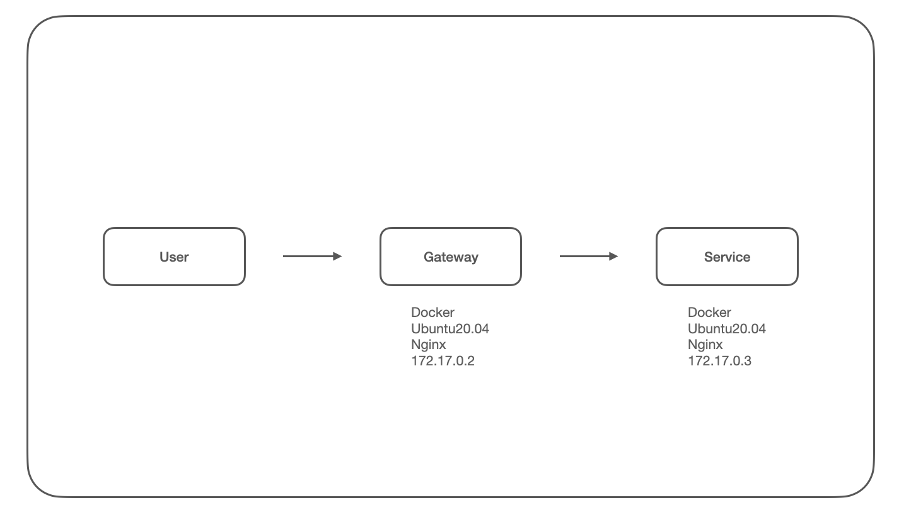
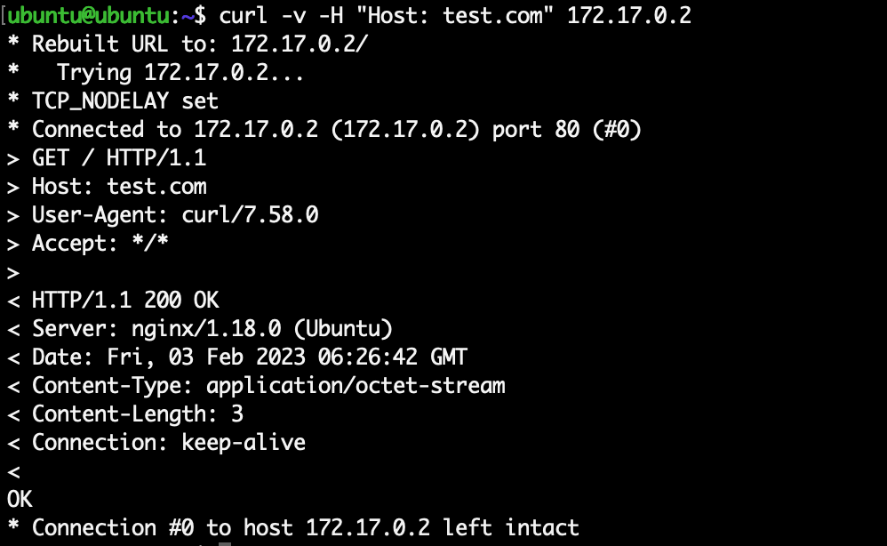
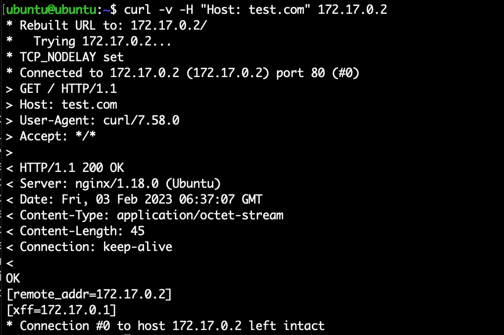
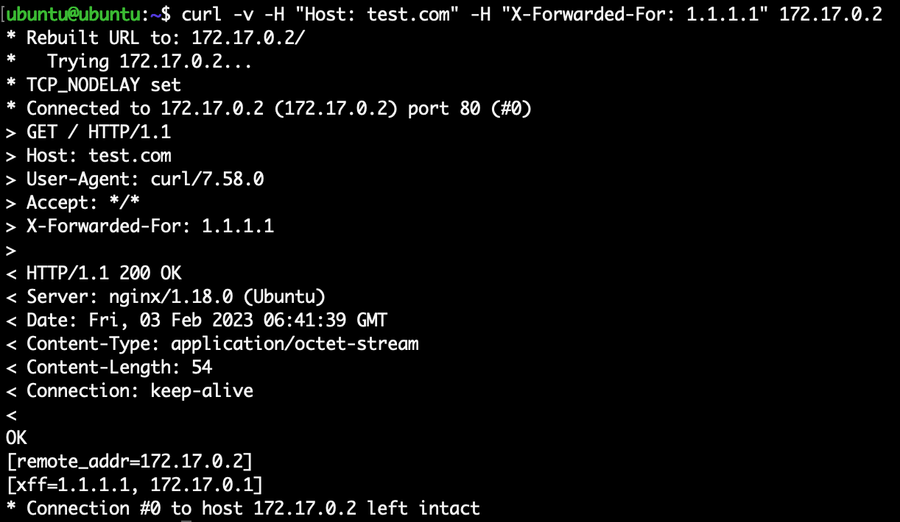
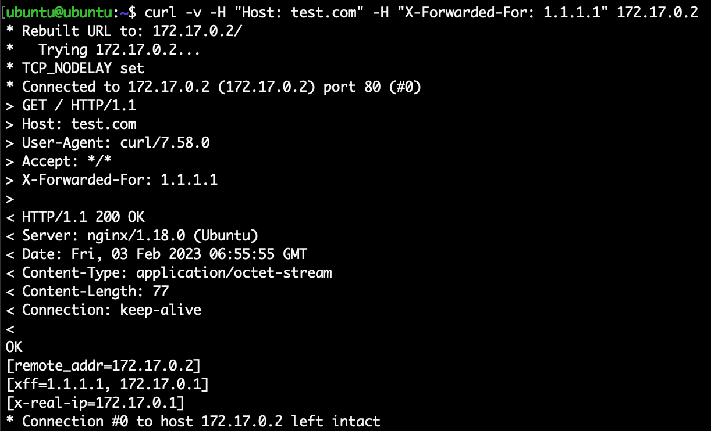

## 网关结构下Nginx如何获取用户ip地址

Time: 2023.02.02  
Tags: 运维  

### 0x00 前言
在现代互联网 web 业务中，配置一个网关服务有诸多优势，如统一流量入口，方便进行业务分流，对恶意流量进行识别等。

但由于网关的介入，业务服务不再能够直接获取到用户的 ip 地址，本文就该问题以 nginx 为例，介绍在网关结构下如何获取用户的 ip 地址，以及潜在的问题和解决方案。

本文实验环境
```
Docker
Ubuntu 20.04
Nginx 1.18.0
```

### 0x01 环境配置
根据现代互联网具有网关服务的 web 业务，简化后我们可以搭建实验环境结构如下：
<div align="center">

</br>[1.实验环境示意图]
</div>

在 Linux 服务器上通过 Docker 创建两个容器，分别作为网关 `gateway` 服务器和业务服务 `service` 服务器：
```
$ docker run -d -it --name=gateway -p80:80 ubuntu:20.04 /bin/bash
$ docker run -d -it --name=service ubuntu:20.04 /bin/bash
```

并在 `gateway` 和 `service` 安装 nginx 服务：
```
$ apt update
$ apt install nginx vim
# 通过如下命令验证 nginx 正常运行
$ nginx -g "daemon off;"
```

我们在 `service` 服务器中添加如下 nginx 配置文件，作为业务演示：
```
$ cat  /etc/nginx/sites-enabled/test.com
server {
    listen 80;

    server_name test.com;

    location / {
        return 200 "OK\n";
    }
}
```

我们在 `gateway` 服务器中添加如下 nginx 配置文件，网关以反向代理的方式连接到 `service` 业务服务：
```
$ cat /etc/nginx/sites-enabled/test.com
server {
    listen 80;

    server_name test.com;

    location / {
        # 因 gateway 介入丢失用户 ip 信息，通过 XFF 进行补充记录
        proxy_set_header X-Forwarded-For $proxy_add_x_forwarded_for;
        # 设置 Host 字段，以便 service 进行区分
        proxy_set_header Host $host;
        proxy_pass http://172.17.0.3:80/;
    }
}
```

在 Linux 宿主机上使用如下命令，可验证 `gateway` 和 `service` 正常工作：
```
curl -v -H "Host: test.com" 172.17.0.2
```

<div align="center">

</br>[2.验证环境正常工作]
</div>

### 0x02 XFF获取用户ip
通常我们使用 `$remote_addr` 获取用户 ip 地址，但由于网关的介入，通过这种方式在业务系统上只能获取到网关的 ip。很容易想到我们可以通过 `X-Forwarded-For` 字段来获取到用户 ip，`gateway` 通常像如上方式进行配置。

我们修改 `service` 的配置如下，以验证我们的方法：
```
$ cat  /etc/nginx/sites-enabled/test.com
server {
    listen 80;

    server_name test.com;

    location / {
        return 200 "OK\n[remote_addr=$remote_addr]\n[xff=$http_x_forwarded_for]\n";
    }
}
```

访问 `gateway` 服务，结果如下：
<div align="center">

</br>[3.通过 xff 获取用户ip]
</div>

我们可以看到 `$remote_addr` 是网关的地址，而通过 `$http_x_forwarded_for` 可以正确获取用户的 ip 地址。

如果是多级网关的结构，每个网关可按该方式在 `X-Forwarded-For` 追加 ip 地址信息，通常第一个值就是用户的 ip 地址。

但是 `X-Forwarded-For` 是可以伪造的，该值并不可靠，如下：
<div align="center">

</br>[4.伪造xff的演示]
</div>

这会为业务系统带来一些问题。

### 0x03 通过网关设置
正因如此，网关和业务系统不能默认信任 `X-Forwarded-For` 值，而应该由网关获取用户 ip 并通过 `http header` 传递给业务系统。

我们修改 `gateway` 的配置文件如下：
```
$ cat /etc/nginx/sites-enabled/test.com
server {
    listen 80;

    server_name test.com;

    location / {
        # 因 gateway 介入丢失用户 ip 信息，通过 XFF 进行补充记录
        proxy_set_header X-Forwarded-For $proxy_add_x_forwarded_for;
        # 设置 Host 字段，以便 service 进行区分
        proxy_set_header Host $host;
        # 将 $remote_addr 以 X-Real-IP 传递给业务系统
        proxy_set_header X-Real-IP $remote_addr;
        proxy_pass http://172.17.0.3:80/;
    }
}
```

同时修改 `service` 的配置文件如下：
```
$ cat  /etc/nginx/sites-enabled/test.com
server {
    listen 80;

    server_name test.com;

    location / {
        return 200 "OK\n[remote_addr=$remote_addr]\n[xff=$http_x_forwarded_for]\n[x-real-ip=$http_x_real_ip]\n";
    }
}
```

访问测试如下：
<div align="center">

</br>[5.x-real-ip访问测试]
</div>

业务系统可以使用与网关约定好的 `X-Real-IP` 字段获取用户 ip 地址，并可以通过对比 `X-Forwarded-For` 字段判断用户是否伪造了 xff 值。

### 0x04 CDN
将业务系统接入 CDN 是一个很常规的架构设计，在该架构下可以类比到以上的实验环境，唯一的区别是，在 CDN 下我们不能完全控制网关的配置。

而 CDN 厂商早就考虑到了 `X-Forwarded-For` 伪造的问题，都设置了自定义字段以便业务系统可以获取到可靠的用户 ip 地址，但由于各厂商实现不同，自定义字段稍有不同，比如：
```
1. 知道创宇云安全
HTTP_X_REAL_FORWARDED_FOR / HTTP_X_CONNECTING_IP
2. CLOUDFLARE
X-Real-IP / CF-Connecting-IP
3. AliCDN
Ali-CDN-Real-IP
4. TencentCDN
通过覆盖写入 X-Forwarded-For
```

除此之外，在实际的业务部署中，还需要将 CDN 的 ip 地址列入白名单，这样才可以保证通过 CDN 提供的自定义字段获取的用户 ip 是可靠的；若某用户绕过 CDN 访问业务的真实 ip，并伪造原本 CDN 提供的自定义字段，如：`CF-Connecting-IP`，那么业务系统此时仍会获取到伪造的用户 ip。

### 0x05 References
http://help.yunaq.com/faq/67/index.html  
https://developers.cloudflare.com/fundamentals/get-started/reference/http-request-headers/  
https://help.aliyun.com/document_detail/97599.html  
https://cloud.tencent.com/document/product/228/45078  