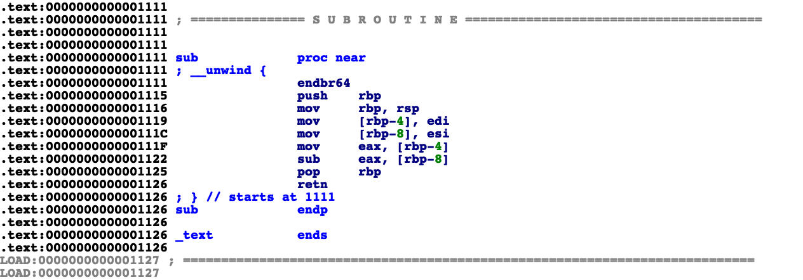
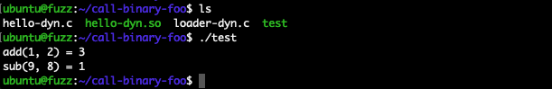
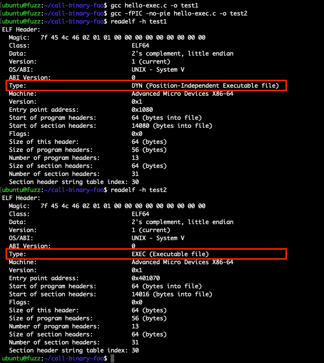
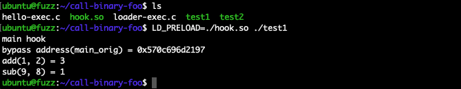
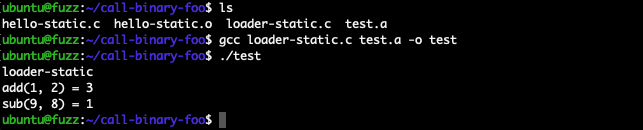
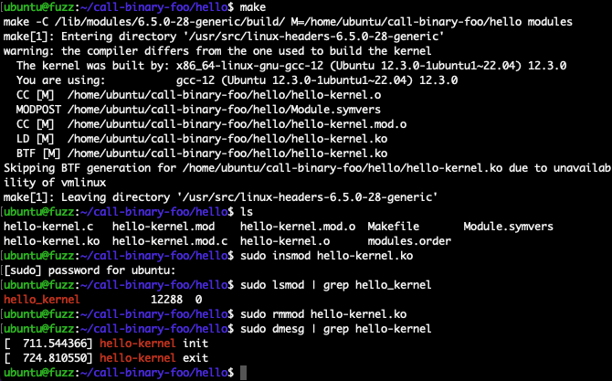
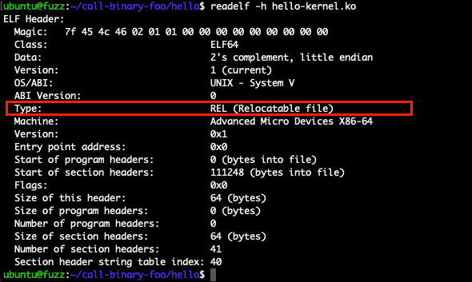
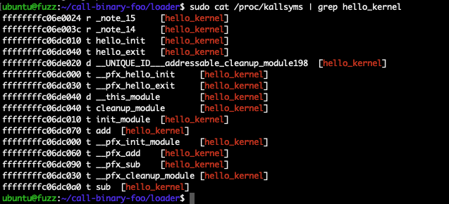
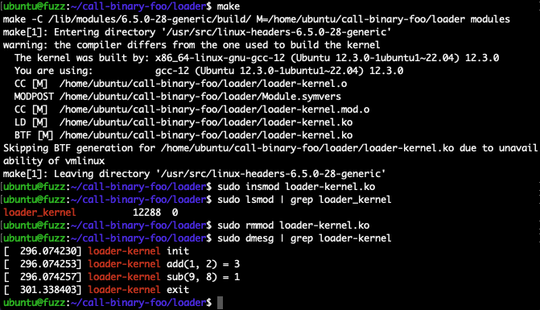

## 调用ELF文件任意函数的几种方式

Time: 2024.05.07  
Tags: 开发,逆向分析  


### 0x00 前言

动态链接库是一种把共享的代码制作为公共的库文件，以减少软件的冗余存储占用以及提高运行效率的软件开发优化方案，如 Linux 下的动态链接库(Shared Object) `.so` 文件，根据设计开发人员可以通过调用动态链接库的导出函数，快速实现业务功能。

Linux 下常见的可执行文件 ELF 格式包括：二进制程序(`EXEC`)、动态链接库(`so`)、静态链接库(`a`)、内核模块(`ko`)、等等，那么这些格式是否可以像动态链接库的函数一样被外部所调用，从而在闭源情况下实现对软件的二次开发，或者用于辅助逆向分析呢？本文就此进行探讨和实现。

本文实验环境：
```
Ubuntu 22.04 x64 (6.5.0-28-generic)
GCC-12 (GLIBC 2.35)
```

### 0x01 动态链接库
Linux 下的动态链接库(Shared Object)天然可被调用，我们准备如下的 `.so` 文件，其中 `add()` 函数为导出函数，`sub()` 函数为不可导出函数，[hello-dyn.c](./hello-dyn.c) 源码如下：
```
__attribute__((visibility("default"))) int add(int a, int b) {
	return a + b;
}

__attribute__((visibility("hidden"))) int sub(int a, int b) {
	return a - b;
}

// gcc -fPIC -shared hello-dyn.c -o hello-dyn.so
```

对于导出函数我们可以使用符号表进行调用，对于非导出函数我们可以使用地址进行调用，使用 IDA 查看 `sub()` 函数的地址如下：
<div align="center">

</br>[1.sub函数的偏移地址]
</div>

编写调用代码如下 [loader-dyn.c](./loader-dyn.c)：
```
#include <dlfcn.h>
#include <stdio.h>

typedef int (*FUNC_ADD) (int, int);
typedef int (*FUNC_SUB) (int, int);

int main(int argc, char* argv[]) {
    void* handle = dlopen("./hello-dyn.so", RTLD_LAZY);

    FUNC_ADD add = dlsym(handle, "add");
    FUNC_SUB sub = (FUNC_SUB)(*(long*)handle + 0x1111);

    int result = 0;
    result = add(1, 2);
    printf("add(1, 2) = %d\n", result);
    result = sub(9, 8);
    printf("sub(9, 8) = %d\n", result);

    dlclose(handle);
    return 0;
}

// gcc loader-dyn.c -o test
```

编译执行如下：
<div align="center">

</br>[2.调用动态链接库的任意函数]
</div>

### 0x02 二进制EXEC
二进制程序(`EXEC`)无法被 `dlopen()` 正确加载起来，无论是位置无关代码还是固定地址代码的编译方式，测试代码 [hello-exec.c](./hello-exec.c) 如下：
```
#include <stdio.h>

int add(int a, int b) {
	return a + b;
}

int sub(int a, int b) {
	return a - b;
}

int main(int argc, char* argv[]) {
	printf("[hello-exec]\n");

	int c = add(1, 2);
	printf("add(1, 2) = %d\n", c);

	int d = sub(3, 4);
	printf("sub(3, 4) = %d\n", d);

	return 0;
}

// Position Independent Executable (default: -fPIC)
// gcc hello-exec.c -o test1
// Absolute Address Code
// gcc -fPIC -no-pie hello-exec.c -o test2
```

编译后使用 `readelf -h [file]` 查看类型如下：
<div align="center">

</br>[3.readelf查看二进制程序的类型]
</div>

对于这种二进制程序的格式，可以使用 `LD_PRELOAD` 对 `__libc_start_main()` 函数进行 hook，从而改写原始程序的 `main()` 函数，实现对任意函数的调用，编写 [loader-exec.c](./loader-exec.c) 代码如下：
```
#define _GNU_SOURCE

#include <stdio.h>
#include <dlfcn.h>

typedef int (*FUNC_ADD) (int, int);
typedef int (*FUNC_SUB) (int, int);

static int (*main_orig)(int, char **, char **);

int main_hook(int argc, char **argv, char **envp) {
    printf("main hook\n");
    printf("bypass address(main_orig) = %p\n", main_orig);

    void* handle = dlopen(NULL, RTLD_LAZY);
    FUNC_ADD add = (FUNC_ADD)(*(long*)handle + 0x1169);
    FUNC_SUB sub = (FUNC_SUB)(*(long*)handle + 0x1181);

    int result = 0;
    result = add(1, 2);
    printf("add(1, 2) = %d\n", result);
    result = sub(9, 8);
    printf("sub(9, 8) = %d\n", result);

    return 0;
}

int __libc_start_main(
    int (*main)(int, char **, char **),
    int argc,
    char **argv,
    int (*init)(int, char **, char **),
    void (*fini)(void),
    void (*rtld_fini)(void),
    void *stack_end) {
    // Save the real main function address
    main_orig = main;

    // Find the real __libc_start_main()...
    typeof(&__libc_start_main) orig = dlsym(RTLD_NEXT, "__libc_start_main");

    // ... and call it with our custom main function
    return orig(main_hook, argc, argv, init, fini, rtld_fini, stack_end);
}

// gcc -fPIC -shared loader-exec.c -o hook.so
// LD_PRELOAD=./hook.so ./test1
```

使用 `LD_PRELOAD=./hook.so` 加载并调用 `add()` 和 `sub()` 函数如下：
<div align="center">

</br>[4.调用二进制程序的任意函数]
</div>

>对于类型为 `EXEC` 的二进制程序如 `test2`，因为地址则为固定地址，所以 `dlopen` 调用后的结果 `*handle = 0`，按照以上代码直接使用偏移累加即可。

>在 GLIBC 2.30 以前，`dlopen()` 还可以直接装载 PIE 类型的二进制程序，即这类二进制程序可以像动态链接库一样的方式调用任意函数，在大部分情况下可以正常工作。(https://stackoverflow.com/questions/59074126/loading-executable-or-executing-a-library)

### 0x03 静态链接库
除了上文动态链接库外，静态链接库(`.a`)也可以调用其任意函数，静态链接库的本质是编译过程中的目标文件(Object File)即 `.o` 文件，其中包含完整的符号链接，我们可以直接编写代码，通过链接实现对函数的调用，我们这里复用上文动态链接库测试代码为 [hello-static.c](./hello-static.c)，如下：
```
__attribute__((visibility("default"))) int add(int a, int b) {
	return a + b;
}

__attribute__((visibility("hidden"))) int sub(int a, int b) {
	return a - b;
}

// gcc -c hello-static.c
// ar -rcs test.a hello-static.o
```

随后我们编写代码直接使用符号调用 `add()` 和 `sub()` 函数即可，注意需要定义为外部函数，[loader-static.c](./loader-static.c) 代码如下：
```
#include <stdio.h>

extern int add(int a, int b);
extern int sub(int a, int b);

int main() {
    printf("loader-static\n");

    int result = 0;
    result = add(1, 2);
    printf("add(1, 2) = %d\n", result);
    result = sub(9, 8);
    printf("sub(9, 8) = %d\n", result);

    return 0;
}

// gcc loader-static.c test.a -o test
```

编译时指定静态链接库文件，执行如下：
<div align="center">

</br>[5.调用静态链接库的任意函数]
</div>

>目标文件即 `.o` 文件也同理。

### 0x04 内核模块
内核模块(`.ko`)也是一种常见的 ELF 文件，而调用内核模块的函数稍微有点不同，我们编写测试文件 [hello-kernel.c](./hello-kernel.c) 如下：
```
#include <linux/init.h>
#include <linux/module.h>

MODULE_LICENSE("GPL");

int add(int a, int b) {
	return a + b;
}

int sub(int a, int b) {
	return a - b;
}

static int hello_init(void) {
    printk("hello-kernel init\n");
    return 0;
}

static void hello_exit(void) {
    printk("hello-kernel exit\n");
}

module_init(hello_init);
module_exit(hello_exit);

// (required Makefile)
// make
//
// sudo insmod hello-kernel.ko
// sudo lsmod | grep hello_kernel
// sudo rmmod hello-kernel.ko
// sudo dmesg | grep hello-kernel
```

编写 `Makefile` 文件如下：
```
obj-m := hello-kernel.o
all:
	make -C /lib/modules/$(shell uname -r)/build/ M=$(PWD) modules
clean:
	make -C /lib/modules/$(shell uname -r)/build/ M=$(PWD) clean
```

使用 `make` 进行编译，测试运行如下：
<div align="center">

</br>[6.hello-kernel测试运行]
</div>

使用 `readelf -h [file]` 查看内核模块的类型，我们其类型 `REL` (Relocatable file)虽然和静态链接库一样，但内核模块的函数并不能像静态链接库那样被调用，如下：
<div align="center">

</br>[7.readelf查看hello-kernel类型]
</div>

内核模块被加载后，可通过 `sudo cat /proc/kallsyms` 在操作系统中查看其符号表和地址，如下：
<div align="center">

</br>[8.从kallsyms读取hello-kernel的符号表]
</div>

那么我们可以通过编写内核模块按地址实现对任意函数的调用，我们编写 [loader-kernel.c](./loader-kernel.c) 代码如下：
```
#include <linux/init.h>
#include <linux/module.h>

MODULE_LICENSE("GPL");

typedef int (*FUNC_ADD) (int a, int b);
typedef int (*FUNC_SUB) (int a, int b);

static int loader_init(void) {
    printk("loader-kernel init\n");

    // sudo cat /proc/kallsyms | grep hello_kernel
    // ffffffffc06dc070 t add	[hello_kernel]
    // ffffffffc06dc0a0 t sub	[hello_kernel]
    FUNC_ADD add = (FUNC_ADD)0xffffffffc06dc070;
    FUNC_SUB sub = (FUNC_SUB)0xffffffffc06dc0a0;

    int result = 0;
    result = add(1, 2);
    printk("loader-kernel add(1, 2) = %d\n", result);
    result = sub(9, 8);
    printk("loader-kernel sub(9, 8) = %d\n", result);

    return 0;
}

static void loader_exit(void) {
    printk("loader-kernel exit\n");
}

module_init(loader_init);
module_exit(loader_exit);

// (required Makefile)
// make
//
// sudo insmod loader-kernel.ko
// sudo lsmod | grep loader_kernel
// sudo rmmod loader-kernel.ko
// sudo dmesg | grep loader-kernel
```

>注意每次系统启动或内核模块重新加载，其符号地址都会发生变化。

同样编写 `Makefile` 并通过 `make` 编译，运行测试如下：
<div align="center">

</br>[9.调用内核模块的任意函数]
</div>

### 0x05 总结
本文通过对动态链接库调用方式的衍生，实现了对 Linux 下常见的二进制程序(`EXEC`)、动态链接库(`so`)、静态链接库(`a`)、内核模块(`ko`) 四种可执行文件(ELF)的任意函数调用，这种调用方式能够帮助我们在闭源情况下实现对软件的二次开发，以及用于辅助逆向分析。

除此之外，借助以上思路我们还可以对非常规的可执行文件(ELF)进行任意函数的调用，甚至在 Windows 下，我们也可以按照类似的方法进行实现。

### 0x06 References
https://man7.org/linux/man-pages/man3/dlsym.3.html  
https://stackoverflow.com/questions/34519521/why-does-gcc-create-a-shared-object-instead-of-an-executable-binary-according-to/34522357  
https://stackoverflow.com/questions/28937745/how-to-compile-elf-binary-so-that-it-can-be-loaded-as-dynamic-library  
https://reverseengineering.stackexchange.com/questions/29542/how-to-call-a-func-in-an-executable-binary  
https://stackoverflow.com/questions/59074126/loading-executable-or-executing-a-library  