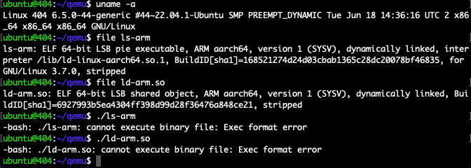
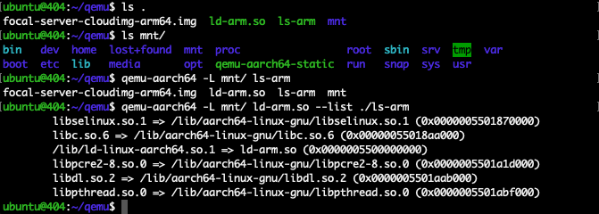
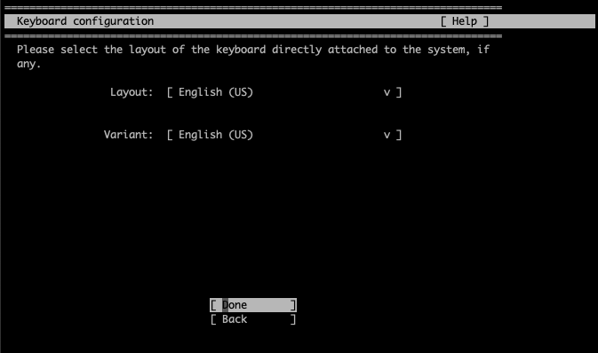

## 通过QEMU模拟运行ARM程序

0x7F@knownsec404  
Time: 2024.08.07  


### 0x00 前言

QEMU(Quick Emulator)是一款免费开源的模拟器和虚拟机，其能够像常规虚拟机一样配合 CPU 硬件进行虚拟化运行，同时还能在软件层面上实现跨架构的模拟运行；QEMU 提供了两种运行模式：系统模式支持对计算机的硬件设备进行模拟以实现操作系统的虚拟化运行，用户模式以二进制指令翻译的方式实现进程级别的模拟运行。

在日常工作中偶尔会遇到针对跨架构程序的运行、调试和分析，这就需要借助 QEMU 来进行；本文将以 x86 的宿主机环境 + ARM 的虚拟机环境为例，以 `focal-server-cloudimg-arm64.img` 镜像为样例，逐步介绍 QEMU 跨架构程序模拟运行的基本思路和操作方法。

本文实验环境：
```
Ubuntu 22.04 x64
QEMU emulator version 6.2.0
focal-server-cloudimg-arm64.img
```

### 0x01 QEMU基本使用
在 Ubuntu 下使用 `apt` 安装 QEMU 如下：
```
# 安装 QEMU 系统模式的组件
$ apt install qemu-system
# 安装 QEMU 用户模式的组件
$ apt install qemu-user qemu-user-static
```

安装完成后可以看到 QEMU 提供的命令如下：
<div align="center">

</br>[1.qemu命令列表]
</div>

首先我们在同架构的情况下启动虚拟机，以熟悉 QEMU 的基本用法，常规命令如下：
```
$ qemu-system-x86_64 -machine accel=kvm -smp 2 -m 2048 -hda ubuntu18.04_x86.qcow2 -nic user,hostfwd=tcp:127.0.0.1:2222-:22

# 参数解析
qemu-system-x86_64 \                # 使用 x86_64 系统模式
-machine accel=kvm \                # 使用 linux-kvm 硬件虚拟化
-smp 2 \                            # 设置 CPU 核心数为 2
-m 2048 \                           # 设置内存大小为 2048M
-hda ubuntu18.04_x86.qcow2 \        # 设置磁盘文件
-nic user,hostfwd=tcp:127.0.0.1:2222-:22    # 设置网络和端口转发
```

以上命令我们使用 QEMU 的 x86_64 架构以硬件虚拟化(`accel`)的方式启动了一台 2C2G (`smp/m`)的虚拟机，运行的系统镜像为 `ubuntu18.04_x86.qcow2`，并设置端口转发将虚拟机的 `22` 端口转发至宿主机的 `127.0.0.1:2222`。

随后我们便可以直接使用 `ssh ubuntu@127.0.0.1 -p 2222` 访问并使用虚拟机。

### 0x02 进程模拟
QEMU 提供的用户模式使用二进制指令翻译的方式实现进程级别的模拟运行，这是一种非常简单和轻量级的模拟运行方式。

首先我们使用 `qemu-nbd` 命令从镜像(`focal-server-cloudimg-arm64.img`)中提取目标二进制程序，这里我们以 `ld-linux-aarch64.so.1`(静态链接) 和 `ls`(动态链接) 两个命令为例，如下：
```
# 检查和确认镜像为 QCOW2 格式
$ file focal-server-cloudimg-arm64.img
# 加载 NBD 设备(Network Block Device)
$ sudo modprobe nbd max_part=8
# 使用 qemu-nbd 链接镜像文件和 NBD 设备
$ sudo qemu-nbd --connect=/dev/nbd0 focal-server-cloudimg-arm64.img
# 使用 fdisk 查看磁盘分区
$ sudo fdisk -l /dev/nbd0
# 创建文件夹并挂载
$ mkdir mnt/
$ sudo mount /dev/nbd0p1 mnt/
# 拷贝目标二进制程序
$ cp mnt/bin/ls ls-arm
$ cp -L mnt/lib/ld-linux-aarch64.so.1 ld-arm.so

# 卸载并释放 NBD 设备
$ sudo umount mnt
$ sudo qemu-nbd --disconnect /dev/nbd0
```

执行如下：
<div align="center">

</br>[2.从ubuntu-arm镜像中拷贝目标程序]
</div>

在默认情况下，直接执行程序则会因架构不同而报错：
<div align="center">

</br>[3.ubuntu直接运行arm程序]
</div>

安装 `qemu-user` 用户模式后，使用 `qemu-aarch64 [program]` 可实现进程模拟运行：
<div align="center">

</br>[4.qemu-aarch64进程模拟运行程序]
</div>

上图中我们可以看到静态链接的 `ld-arm.so` 可以被正常执行，而动态链接的 `ls-arm` 则提示依赖库问题；在一般情况下，由于模拟运行时架构不同、操作系统不同、运行时库不同，基本都会出现依赖问题，我们必须完整的解决依赖问题，目标二进制程序才可以正常运行；

我们可以使用 `qemu-aarch64 -L [path]` 参数指定目标程序的 `QEMU_LD_PREFIX`，复用挂载的文件系统(`mnt`)，从而简易的解决依赖问题，模拟运行 `ls-arm` 命令如下：
```
# 指定 QEMU_LD_PREFIX = mnt/ 并运行 ls-arm 程序
$ qemu-aarch64 -L mnt/ ls-arm
# 使用 ld-arm.so 查看 ls-arm 程序的依赖库
$ qemu-aarch64 -L mnt/ ld-arm.so --list ./ls-arm
```

执行如下：
<div align="center">

</br>[5.指定QEMU_LD_PREFIX运行ls-arm程序]
</div>

在实际情况下，目标二进制程序所依赖的组件可能比较复杂，我们还可以使用 `chroot` 命令以更完整复用挂载的文件系统(`mnt`)，由于 `chroot` 修改根目录后会影响 `qemu-aarch64` 程序的依赖库，所以我们需要使用 `qemu-aarch64-static` 程序：
```
# 拷贝 qemu-aarch64-static 至目标文件系统中
$ sudo cp /usr/bin/qemu-aarch64-static mnt/
# 使用 chroot 执行目标程序
$ sudo chroot ./mnt ./qemu-aarch64-static /bin/ls
$ sudo chroot ./mnt ./qemu-aarch64-static /lib/ld-linux-aarch64.so.1 --list /bin/ls
```

执行如下：
<div align="center">

</br>[6.使用chroot配合qemu模拟运行程序]
</div>

PS：随 QEMU 默认安装的还有 `binfmt-support` 组件，该工具会修改宿主机的内核加载器设置选项，通过识别二进制程序 ELF 信息选择对应的 QEMU 启动器(`qemu-xxx`)，可以方便用户在宿主机上透明的执行跨架构程序，如 `./ld-arm.so`，执行如下：
<div align="center">

</br>[7.binfmt-support执行跨架构程序]
</div>

### 0x03 系统模拟
在部分场景下，目标环境直接提供了 `iso` 安装镜像，我们可以通过安装系统来进行完整的系统模拟运行，这里我们以 `ubuntu-20.04.5-live-server-arm64.iso` 为例。

启动一台 ARM64 的 QEMU 虚拟机基础命令如下：
```
$ qemu-system-aarch64 -M virt -cpu cortex-a72 -smp 2 -m 2048 -serial stdio

qemu-system-aarch64 \       # 使用 aarch64 系统模式
-M virt \                   # 设置机器类型为 virt
-cpu cortex-a72 \           # 设置 cpu 类型为 cortex-a72
-smp 2 -m 2048 \            # 设置为 2C2G
-serial stdio               # 设置串口输出到stdio
```

直接运行命令后 QEMU 虚拟机的 CPU 将陷入死循环中，这是因为 QEMU 没有为 ARM 的虚拟机设置默认的固件程序(BIOS/UEFI)。(对于 x86 的主机，QEMU 为其默认设置了 `SeaBIOS` 程序，极大方便了用户进行使用)

参考 Ubuntu 官方提供的 ARM 虚拟机教程(https://ubuntu.com/server/docs/boot-arm64-virtual-machines-on-qemu)，我们使用  QEMU 提供的 `qemu-efi-aarch64` 通用 UEFI 固件进行手动设置：
```
# 安装 qemu-efi-aarch64，默认路径 /usr/share/qemu-efi-aarch64/
$ sudo apt install qemu-efi-aarch64
# 创建 EFI 镜像
$ truncate -s 64m efi.img
# 创建 NVRAM 镜像，用于 EFI 执行期间的变量存储
$ truncate -s 64m varstore.img
# 拷贝 EFI 镜像内容
$ dd if=/usr/share/qemu-efi-aarch64/QEMU_EFI.fd of=efi.img conv=notrunc
```

准备好 UEFI 固件后，启动 QEMU 虚拟机如下：
```
$ qemu-system-aarch64 -M virt -cpu cortex-a72 -smp 2 -m 2048 -drive if=pflash,format=raw,file=efi.img,readonly=on -drive if=pflash,format=raw,file=varstore.img -serial stdio

# 设置 efi.img 镜像
# -drive if=pflash,format=raw,file=efi.img,readonly=on
# 设置 varstore.img 镜像
# -drive if=pflash,format=raw,file=varstore.img
```

执行后进入 UEFI shell 即表示成功，如下：
<div align="center">

</br>[8.qemu-system-aarch64进入UEFI的shell]
</div>

输入 `exit` 进入 `Boot Manager` 界面，这里可以选择对应的 CD 驱动或磁盘驱动来引导启动系统。

接下来我们就可以使用 `iso` 安装系统了，如下：
```
# 创建一个 32G 的磁盘镜像文件
$ qemu-img create -f qcow2 ubuntu-arm.img 32G
# 查看磁盘镜像信息
$ qemu-img info ubuntu-arm.img

# 启动 ubuntu-arm 虚拟机
$ qemu-system-aarch64 -M virt -cpu cortex-a72 -smp 2 -m 2048 -drive if=pflash,format=raw,file=efi.img,readonly=on -drive if=pflash,format=raw,file=varstore.img -hda ubuntu-arm.img -cdrom ubuntu-20.04.5-live-server-arm64.iso -serial stdio

# 使用 -hda 设置磁盘镜像
# -hda ubuntu-arm.img
# 使用 -cdrom 设置 iso 镜像
# -cdrom ubuntu-20.04.5-live-server-arm64.iso
```

执行如下：
<div align="center">

</br>[9.qemu-system-aarch64从iso镜像安装]
</div>

完成系统安装后，重启在 `Boot Manager` 中选择从磁盘引导启动即可；直接启动虚拟机的命令只需删掉 `-cdrom` 参数，如下：
```
qemu-system-aarch64 -M virt -cpu cortex-a72 -smp 2 -m 2048 -drive if=pflash,format=raw,file=efi.img,readonly=on -drive if=pflash,format=raw,file=varstore.img -hda ubuntu-arm.img -serial stdio
```

执行如下：
<div align="center">

</br>[10.qemu-system-aarch64启动镜像]
</div>

PS：`qemu-efi-aarch64` 还可以作为 `BIOS` 启动，其命令更加简洁：
```
$ cp /usr/share/qemu-efi-aarch64/QEMU_EFI.fd bios.img
$ qemu-system-aarch64 -M virt -cpu cortex-a72 -smp 2 -m 2048 -bios bios.img -serial stdio
```

### 0x04 镜像模拟
在实际场景中，我们所遇到的目标环境通常都有复杂的依赖，在「0x02 进程模拟」中非常棘手，而官方也不会提供 `iso` 镜像用于构建系统，只提供已部署完成的 `img` 镜像，或是安全研究员从设备中提取的镜像文件；这就需要我们从镜像本身来搭建系统模拟运行环境了，这里我们以 `focal-server-cloudimg-arm64.img` 为例。

在进行镜像模拟前，我们首先梳理下计算机的启动流程，以帮助我们理解 QEMU 的模拟运行计算机的基本流程，通常计算机启动流程可分为五大步骤：1.固件启动、2.bootloader启动、3.kernel启动、4.加载文件系统、5.运行应用，如下：
<div align="center">

</br>[11.计算机的启动流程概要]
</div>

通电后，CPU 首先从固定位置运行 Firmware (固件)代码，如常见的 `BIOS / UEFI / BootRom`，随后固件通过识别磁盘分区的标签(MBR)启动 BootLoader，如常见的 `BOOTMGR / GRUB` 以及嵌入式的 `uboot`，BootLoader 完成初始化工作后会将 Kernel 加载至内存中，Kernel 进行初始化工作并加载 DeviceTreeBlob (设备树)以对应硬件与驱动之间的关系，随后加载内存文件系统 initrd 以完成基础驱动的初始化，从而从磁盘上加载 FileSystem (文件系统)，随后 Kernel 从文件系统中加载并完成所有的初始化工作(配置、驱动、等等)，最终启动对应的 Applicaiont (应用程序)，如 `/sbin/init`。

>对于 x86 主机由于有标准的 PCI 总线设计，Kernel 可以标准化的自动探测硬件设备以完成 DTB 的隐式加载，而 ARM 芯片和硬件众多，没有标准化的方式进行自动探测，通常都需要手动指定 DTB 文件。

对于 `focal-server-cloudimg-arm64.img` 镜像文件，我们可以使用 `qemu-efi-aarch64` 从 Firmware 自动加载 BootLoader 启动，命令如下：
```
qemu-system-aarch64 -M virt -cpu cortex-a72 -smp 2 -m 2048 -drive if=pflash,format=raw,file=efi.img,readonly=on -drive if=pflash,format=raw,file=varstore.img -hda focal-server-cloudimg-arm64.img -serial stdio
```

执行后可以看到 GRUB 界面，最终成功启动系统，如下：
<div align="center">

</br>[12.qemu从镜像启动系统至GRUB]
</div>

而某些场景下，我们没有合适的 Firmware 或者镜像根本没有提供 BootLoader，那我们可以直接从 Kernel 直接启动系统，首先从镜像中提取 `kernel` 和 `initrd` 文件如下：
```
# 挂载镜像至 mnt 目录，查看 mnt/boot/
$ ls -lah mnt/boot/
# 拷贝 kernel 和 initrd 文件
$ sudo cp mnt/boot/vmlinuz-5.4.0-187-generic .
$ sudo cp mnt/boot/initrd.img-5.4.0-187-generic .
# 修改 kernel 和 initrd 文件权限
$ sudo chown ubuntu:ubuntu *
```

执行如下：
<div align="center">

</br>[13.从镜像中提取kernel和initrd文件]
</div>

QEMU 从 Kernel 直接启动系统的命令如下：
```
$ qemu-system-aarch64 -M virt -cpu cortex-a72 -m 2048 -kernel vmlinuz-5.4.0-187-generic -initrd initrd.img-5.4.0-187-generic -hda focal-server-cloudimg-arm64.img -append "root=/dev/vda1" -serial stdio

# 设置 kernel 文件
# -kernel vmlinuz-5.4.0-187-generic
# 设置 initrd 文件
# -initrd initrd.img-5.4.0-187-generic
# 设置镜像文件，指定挂载路径 "root=/dev/vda1"
# -hda focal-server-cloudimg-arm64.img -append "root=/dev/vda1"
```

执行命令后可以看到 QEMU 直接从 Kernel 开始启动的：
<div align="center">

</br>[14.qemu从kernel启动的日志]
</div>

最后成功启动系统：
<div align="center">

</br>[15.qemu从kernel启动至ubuntu]
</div>

在实际操作中，由于 QEMU 模拟运行的环境与原生运行环境可能存在机器型号不同、CPU 等硬件不同的问题，可以通过几个关键参数 `-kernel / -dtb / -initrd / -hda` 按序测试进行调试：
1. `kernel`：虚拟机成功启动，但提示 `Error: invalid dtb and unrecognized/unsupported machine ID` 或 `Unable to mount root fs on unknown-block(0,0)` 错误，对应缺失 `dtb` 或 `initrd`
2. `dtb`：虚拟机成功启动，不会提示 `dtb` 错误但 CPU 陷入死循环
3. `initrd`：虚拟机成功启动，但提示 `No root device specified` 错误并进入 `initrd-shell`
4. `hda`：虚拟机成功启动，并顺利启动目标系统镜像

其次，对于镜像 `-append "root=/dev/vda1"` 的挂载目录，可以使用 `fdisk -l` 查看分区序号，也可以在 `initrd-shell` 中使用 `blkid` 查看磁盘挂载和类型，如下：
<div align="center">

</br>[16.在initrd-shell通过blkid查看磁盘]
</div>

### 0x05 应用模拟
在部分场景下，从系统镜像中提取 `Frimware / BootLoader / Kernel` 等文件比较困难，或者由于定制化的硬件设备使用了比较非常规的启动流程，导致无法成功进行「0x04 镜像模拟」；同时我们的需求是仅针对镜像中的某个应用的情况下，那我们可以使用同架构的其他系统模拟环境，通过挂载文件系统的方式，对目标程序进行针对应用的模拟。

这里我们以 `focal-server-cloudimg-arm64.img` 为例，假设该镜像无法提取启动流程的关键文件，而我们需要针对 `/bin/ls` 程序进行测试运行；则可以使用 `debian-arm` 的模拟环境来搭建，如下：
```
# 下载对应架构的 debian 模拟环境
# download from [https://people.debian.org/~gio/dqib/]
# 解压 debian 模拟环境
$ unzip dqib_arm64-virt.zip 
# 使用 debian 的模拟环境，挂载目标镜像系统至 "-hdb"
$ qemu-system-aarch64 -M virt -cpu cortex-a72 -m 2048 -kernel dqib_arm64-virt/kernel -initrd dqib_arm64-virt/initrd -hda dqib_arm64-virt/image.qcow2 -append "root=/dev/vda1" -hdb focal-server-cloudimg-arm64.img -serial stdio
```

执行如下：
<div align="center">

</br>[17.启动debian的模拟环境]
</div>

成功启动 `debian-arm` 的模拟环境后，将目标镜像系统挂载起来即可，运行目标应用程序 `/bin/ls` 如下：
```
# 挂载目标镜像系统
$ mount /dev/vdb1 /mnt
# 查看当前系统信息
$ cat /etc/issue
# 使用 `chroot` 切换根目录，运行镜像系统内的 bash
$ chroot /mnt /bin/bash
# 查看当前系统信息
$ cat /etc/issue
# 执行 "/bin/ls"
$ /bin/ls
```

执行如下：
<div align="center">

</br>[18.chroot目标镜像并运行应用]
</div>

PS: 由于第三方系统和目标镜像系统的硬件要求、兼容性等多方面存在差异，实际情况下应该按需进行调试。

### 0x06 总结
本文介绍了 QEMU 跨架构程序模拟运行的基本思路，使用 `focal-server-cloudimg-arm64.img` 镜像演示了在宿主机为 x86 架构，模拟运行 ARM 程序的操作步骤；同理，使用 QEMU 模拟运行 MIPS 程序及其他跨架构的需求也可以采用相同的思路和方法。

本文中示例的 `Ubuntu` 操作系统和 `ARM` 架构都属于比较通用的系列，兼容性良好；而在实际场景下，因 QEMU 对不同架构和机器的实现程度不同，不同镜像对硬件的支持程度不同，想使用 QEMU 完全的实现模拟运行还有诸多的挑战，更多时候应按照实际情况进行调整和适配。

### 0x07 References
https://www.qemu.org/  
https://en.wikipedia.org/wiki/QEMU  
https://cloud-images.ubuntu.com/  
https://cdimage.ubuntu.com/releases/20.04/release/  
https://github.com/0x7Fancy/0x7Fancy.github.io/blob/main/papers/QEMU%E8%99%9A%E6%8B%9F%E5%8C%96%E7%9A%84%E5%9F%BA%E6%9C%AC%E4%BD%BF%E7%94%A8  
https://gitlab.com/giomasce/dqib  
https://people.debian.org/~gio/dqib/  
https://paper.seebug.org/480/  
https://ubuntu.com/server/docs/boot-arm64-virtual-machines-on-qemu  
https://unix.stackexchange.com/questions/399619/why-do-embedded-systems-need-device-tree-while-pcs-dont  
https://www.kernel.org/doc/Documentation/arm64/booting.txt  
https://www.happyassassin.net/posts/2014/01/25/uefi-boot-how-does-that-actually-work-then/  
https://stackoverflow.com/questions/58420670/qemu-bios-vs-kernel-vs-device-loader-file  
https://sergioprado.blog/reverse-engineering-router-firmware-with-binwalk/  
https://secnigma.wordpress.com/2022/01/18/a-beginners-guide-into-router-hacking-and-firmware-emulation/  